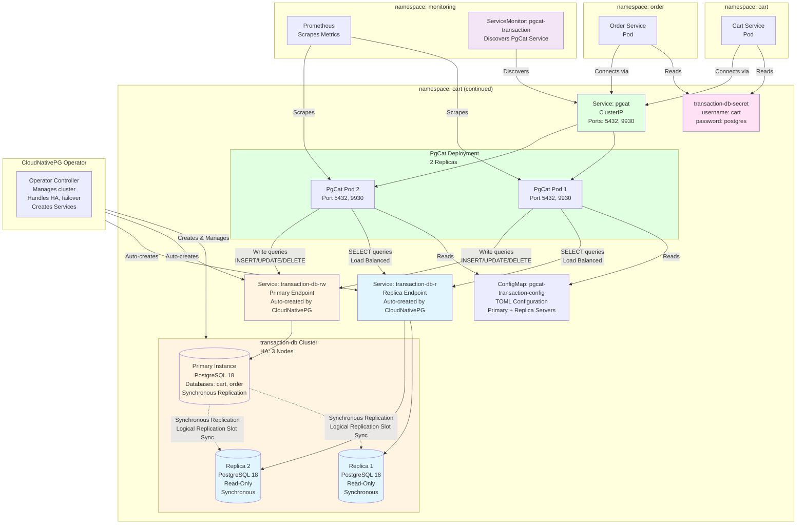
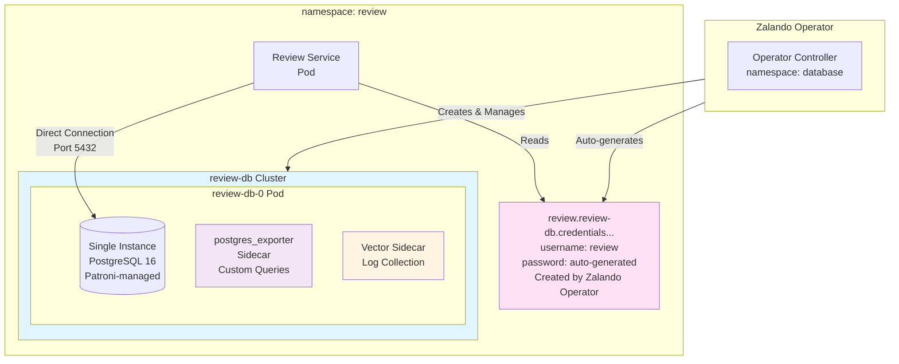
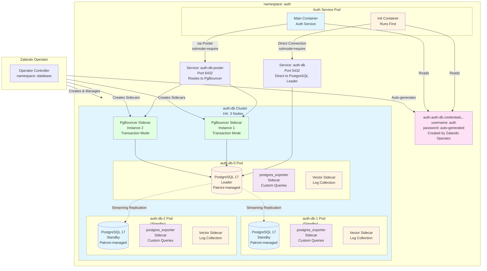
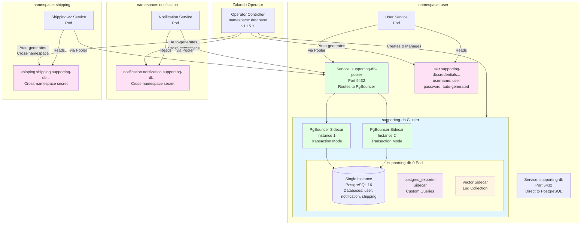
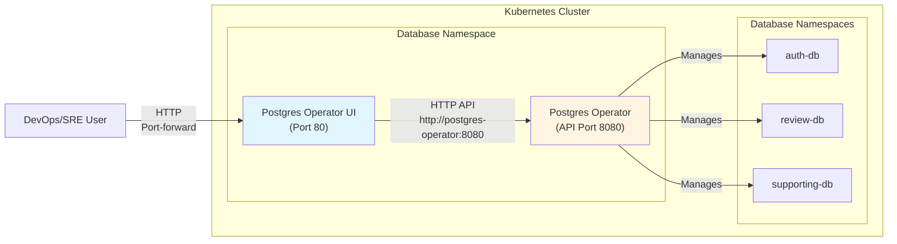

# Database Integration Guide
## Table of Contents

1. [Database Architecture](#database-architecture) - 5 clusters overview
2. [CloudNativePG Operator](#cloudnativepg-operator) - Product DB, Transaction DB, PgCat, PodMonitor
3. [Zalando Postgres Operator](#zalando-postgres-operator) - Review DB, Auth DB, Supporting DB, PgBouncer, Secrets, Monitoring, Password Rotation, Backup, UI Component, Cluster Management
4. [Shared Topics](#shared-topics) - Environment Variables, Helm Config, Local Dev, Verification, Best Practices

---
## Quick Summary

**PostgreSQL Operators:**
- **Zalando Postgres Operator** (v1.15.1): 3 clusters
  - `review-db`: PostgreSQL 16, 1 node, no pooler
  - `auth-db`: PostgreSQL 17, 3 nodes (HA), PgBouncer sidecar (2 instances)
  - `supporting-db`: PostgreSQL 16, 1 node, PgBouncer sidecar (2 instances)
- **CloudNativePG Operator** (v1.28.0): 2 clusters
  - `product-db`: PostgreSQL 18, 2 nodes (HA), PgDog standalone (2 replicas, Helm chart)
  - `transaction-db`: PostgreSQL 18, 3 nodes (HA), PgCat standalone (2 replicas)
---
**Deployment with Flux Operator**
- `controllers-local` ([kubernetes/clusters/local/controllers.yaml](../../kubernetes/clusters/local/controllers.yaml)) - installs database operators/CRDs
- `configs-local` ([kubernetes/clusters/local/configs.yaml](../../kubernetes/clusters/local/configs.yaml)) - applies database instances, poolers, and secrets
- **Source:** OCI artifact `mop-registry:5000/flux-infra-sync:local`
- **Manifests:**
  - `kubernetes/infra/controllers/databases/`
  - `kubernetes/infra/configs/databases/`
- **Reconciliation:** Every 10 minutes (automatic)
- **Dependencies:** `controllers-local` must be ready before `configs-local`

**Components deployed:**
1. **Operators:**
   - Zalando Postgres Operator (v1.15.1) - HelmRelease
   - CloudNativePG Operator (v1.28.0) - HelmRelease
2. **Database Clusters:** 5 clusters (3 Zalando + 2 CloudNativePG)
   - Review DB, Auth DB, Supporting DB (Zalando)
   - Product DB, Transaction DB (CloudNativePG)
3. **Connection Poolers:** PgBouncer (sidecar for auth-db, supporting-db), PgCat (standalone for transaction-db), PgDog (standalone Helm chart for product-db)
4. **Secrets:** Pre-created for CloudNativePG clusters

---

## Database Architecture

### Overview

The system uses **5 PostgreSQL clusters** distributed across different operators and connection patterns to demonstrate various database management approaches:

```mermaid
flowchart TB
    subgraph Operators["PostgreSQL Operators"]
        Zalando[Zalando Operator<br/>v1.15.1<br/>3 clusters]
        CloudNativePG[CloudNativePG Operator<br/>v1.28.0<br/>2 clusters]
    end
    
    subgraph Services[Microservices by Namespace]
        AuthSvc[Auth Service<br/>namespace: auth]
        ProductSvc[Product Service<br/>namespace: product]
        CartSvc[Cart Service<br/>namespace: cart]
        OrderSvc[Order Service<br/>namespace: order]
        ReviewSvc[Review Service<br/>namespace: review]
        UserSvc[User Service<br/>namespace: user]
        NotificationSvc[Notification Service<br/>namespace: notification]
        ShippingSvc[Shipping-v2 Service<br/>namespace: shipping]
    end
    
    subgraph Poolers[Connection Poolers]
        PgBouncerAuth[PgBouncer Sidecar<br/>Auth - Built-in]
        PgBouncerSupporting[PgBouncer Sidecar<br/>Supporting - Built-in]
        PgDogProduct[PgDog Standalone<br/>Product DB<br/>Helm Chart]
        subgraph PgCatTransactionDeployment["PgCat Transaction<br/>2 Replicas + HA"]
            PgCatTransaction[PgCat Standalone<br/>Transaction DB<br/>Read Replica Routing]
        end
    end
    
    subgraph Clusters["PostgreSQL Clusters"]
        AuthDB[(auth-db<br/>Zalando<br/>PostgreSQL 17<br/>HA: 3 nodes<br/>namespace: auth)]
        ProductDB[(product-db<br/>CloudNativePG<br/>PostgreSQL 18<br/>HA: 2 instances<br/>namespace: product)]
        subgraph TransactionDBCluster["transaction-db Cluster<br/>HA: 3 Instances"]
            TransactionPrimary[(Primary<br/>PostgreSQL 18<br/>Read-Write)]
            TransactionReplica1[(Replica 1<br/>PostgreSQL 18<br/>Read-Only)]
            TransactionReplica2[(Replica 2<br/>PostgreSQL 18<br/>Read-Only)]
        end
        ReviewDB[(review-db<br/>Zalando<br/>PostgreSQL 16<br/>Single Instance<br/>namespace: review)]
        SupportingDB[(supporting-db<br/>Zalando<br/>PostgreSQL 16<br/>Shared DB<br/>namespace: user)]
    end
    
    subgraph CloudNativePGServices["CloudNativePG Services<br/>Auto-created"]
        TransactionRW[transaction-db-rw<br/>Primary Endpoint]
        TransactionR[transaction-db-r<br/>Replica Endpoint<br/>Load Balanced]
    end
    
    Zalando --> AuthDB
    Zalando --> ReviewDB
    Zalando --> SupportingDB
    CloudNativePG --> TransactionDBCluster
    CloudNativePG --> CloudNativePGServices
    
    CloudNativePGServices --> TransactionRW
    CloudNativePGServices --> TransactionR
    TransactionRW --> TransactionPrimary
    TransactionR --> TransactionReplica1
    TransactionR --> TransactionReplica2
    
    AuthSvc -->|via pooler| PgBouncerAuth
    PgBouncerAuth --> AuthDB
    ProductSvc -->|via pooler| PgDogProduct
    PgDogProduct --> ProductDB
    CartSvc -->|via pooler| PgCatTransaction
    OrderSvc -->|via pooler| PgCatTransaction
    PgCatTransaction -->|SELECT queries| TransactionR
    PgCatTransaction -->|Write queries| TransactionRW
    TransactionPrimary -.->|Synchronous Replication| TransactionReplica1
    TransactionPrimary -.->|Synchronous Replication| TransactionReplica2
    ReviewSvc -->|direct| ReviewDB
    UserSvc -->|via pooler| PgBouncerSupporting
    NotificationSvc -->|via pooler| PgBouncerSupporting
    ShippingSvc -->|via pooler| PgBouncerSupporting
    PgBouncerSupporting --> SupportingDB
    
    style Zalando fill:#e1f5ff
    style CloudNativePG fill:#fff4e1
    style SupportingDB fill:#ffe1f5
    style AuthDB fill:#e1f5ff
    style ReviewDB fill:#e1f5ff
    style ProductDB fill:#fff4e1
    style TransactionDBCluster fill:#fff4e1
    style TransactionPrimary fill:#fff4e1
    style TransactionReplica1 fill:#e1f5ff
    style TransactionReplica2 fill:#e1f5ff
    style PgCatTransactionDeployment fill:#e1ffe1
    style PgBouncerSupporting fill:#e1ffe1
    style PgBouncerAuth fill:#e1ffe1
    style PgDogProduct fill:#e1ffe1
    style CloudNativePGServices fill:#fff4e1
```



### Database Summary

| Operator | Cluster | Database | Owner | Secret NS | Secret Type | Direct Connection | Pooler |
|----------|---------|----------|-------|-----------|-------------|-------------------|--------|
| CloudNativePG | product-db | product | product | product | Manual (`product-db-secret`) | `product-db-rw.product:5432` | PgDog |
| CloudNativePG | transaction-db | cart | cart | cart | Manual (`transaction-db-secret`) | `transaction-db-rw.cart:5432` | PgCat |
| CloudNativePG | transaction-db | order | cart | cart | Manual (`transaction-db-secret`) | `transaction-db-rw.cart:5432` | PgCat |
| Zalando | auth-db | auth | auth | auth | Auto (operator) | `auth-db.auth:5432` | PgBouncer |
| Zalando | review-db | review | review | review | Auto (operator) | `review-db.review:5432` | None |
| Zalando | supporting-db | user | user | user | Auto (operator) | `supporting-db.user:5432` | PgBouncer |
| Zalando | supporting-db | notification | notification.notification | notification | Auto (cross-ns) | `supporting-db.user:5432` | PgBouncer |
| Zalando | supporting-db | shipping | shipping.shipping | shipping | Auto (cross-ns) | `supporting-db.user:5432` | PgBouncer |

### Pooler Endpoints

| Cluster | Init Endpoint (Direct) | App Endpoint (via Pooler) |
|---------|------------------------|---------------------------|
| product-db | `product-db-rw.product:5432` | `pgdog-product.product:6432` |
| transaction-db | `transaction-db-rw.cart:5432` | `pgcat.cart:6432` |
| auth-db | `auth-db.auth:5432` | `auth-db-pooler.auth:5432` |
| review-db | `review-db.review:5432` | (direct, no pooler) |
| supporting-db | `supporting-db.user:5432` | `supporting-db-pooler.user:5432` |

### Cluster HA Summary

| Cluster | Operator | PostgreSQL | Instances | HA Pattern | Namespace |
|---------|----------|------------|-----------|------------|-----------|
| product-db | CloudNativePG | 18 | 2 (1 primary + 1 replica) | Patroni HA | `product` |
| transaction-db | CloudNativePG | 18 | 3 (1 primary + 2 replicas) | Patroni HA (Sync) | `cart` |
| auth-db | Zalando | 17 | 3 (1 leader + 2 standbys) | Patroni HA | `auth` |
| review-db | Zalando | 16 | 1 (single instance) | Patroni (single) | `review` |
| supporting-db | Zalando | 16 | 1 (single instance) | Patroni (single) | `user` |

---

## CloudNativePG Operator

### Overview

**CloudNativePG Operator** (v1.28.0) is a Kubernetes operator for PostgreSQL that uses Patroni internally for high availability management. It provides a declarative, Kubernetes-native approach to managing PostgreSQL clusters.

**Key Features:**
- Kubernetes-native CRDs for cluster management
- Patroni-based HA with automatic failover (< 30 seconds)
- PostgreSQL 18 (default image)
- Built-in `postgres_exporter` sidecar for metrics
- Support for synchronous replication
- Logical replication slot synchronization
- Production-ready performance tuning

**Clusters Managed:**
- **Product Database** (`product-db`) - 2 instances (1 primary + 1 replica)
- **Transaction Database** (`transaction-db`) - 3 instances (1 primary + 2 replicas) with synchronous replication

**Connection Pooler:**
- Product DB: PgDog standalone Helm chart (1 replica, HA capable)
- Transaction DB: PgCat standalone deployment (v1.2.0, 2 replicas each)

### Clusters

#### Product Database

- **Operator**: CloudNativePG (v1.28.0) - uses Patroni internally
- **PostgreSQL Version**: 18 (CloudNativePG default image)
- **Instances**: 2 (1 primary + 1 replica)
- **HA**: Patroni via Kubernetes API (automatic failover)
- **Pooler**: PgDog standalone deployment via Helm chart (`helm.pgdog.dev/pgdog`)
- **Namespace**: `product`
- **CRD**: `kubernetes/infra/configs/databases/instances/product-db.yaml`
- **Pooler HelmRelease**: `kubernetes/infra/configs/databases/poolers/product/helmrelease.yaml`

**Architecture Diagram:**


**Features:**
- Patroni HA with automatic failover (< 30 seconds)
- Connection pooling and routing via PgDog
- Async replication (no sync constraints)
- Pool size: 30 connections (configured in HelmRelease)
- CloudNativePG services: `product-db-rw` (read-write), `product-db-r` (read-only)
- **Secret**: `product-db-secret` in `product` namespace (Static secret)
- **Database Migrations**: Flyway init container runs `V1__init_schema.sql` and `V2__seed_products.sql` automatically

**Verification Commands:**

Check Flyway migration status:
```bash
# Get primary pod
PRIMARY_POD=$(kubectl get pods -n product -l cnpg.io/cluster=product-db,cnpg.io/instanceRole=primary -o jsonpath='{.items[0].metadata.name}')

# Get password
PASSWORD=$(kubectl get secret product-db-secret -n product -o jsonpath='{.data.password}' | base64 -d)

# Check Flyway migrations
kubectl exec -n product $PRIMARY_POD -- env PGPASSWORD=$PASSWORD psql -h localhost -U product -d product -c "SELECT version, description, installed_on, success FROM flyway_schema_history ORDER BY installed_rank DESC LIMIT 5;"
```

Verify seed data loaded:
```bash
# Check product count and total stock (expected: 8 products, 233 total stock)
kubectl exec -n product $PRIMARY_POD -- env PGPASSWORD=$PASSWORD psql -h localhost -U product -d product -c "SELECT COUNT(*) as product_count, COALESCE(SUM(stock_quantity), 0) as total_stock FROM products;"

# List all products
kubectl exec -n product $PRIMARY_POD -- env PGPASSWORD=$PASSWORD psql -h localhost -U product -d product -c "SELECT id, name, price, category_id, stock_quantity FROM products ORDER BY id;"
```

**Expected Results:**
- Flyway migrations: V1 (init schema) and V2 (seed products) both show `success = t`
- Product count: 8 products
- Total stock: 233

#### Transaction Database

- **Operator**: CloudNativePG (v1.28.0) - uses Patroni internally
- **PostgreSQL Version**: 18 (CloudNativePG default image)
- **Instances**: 3 (1 primary + 2 replicas) - **Production-Ready HA**
- **HA**: Patroni via Kubernetes API (automatic failover < 30 seconds)
- **Replication**: Synchronous replication with logical replication slot synchronization
- **Pooler**: PgCat standalone deployment v1.2.0 (`ghcr.io/postgresml/pgcat:v1.2.0`) with 2 replicas for HA
- **Namespace**: `cart`
- **CRD**: `kubernetes/infra/configs/databases/instances/transaction-db.yaml`
- **Pooler Config**: `kubernetes/infra/configs/databases/poolers/transaction/configmap.yaml`
- **Pooler Deployment**: `kubernetes/infra/configs/databases/poolers/transaction/deployment.yaml`
- **Production-Ready**: Comprehensive PostgreSQL performance tuning, synchronous replication, logical replication slot sync

**Architecture Diagram:**



**Features:**
- **High Availability**: 3-node HA setup (1 primary + 2 replicas) with automatic failover via Patroni
- **Synchronous Replication**: Zero data loss with synchronous replication (at least 1 synchronous replica required)
- **Logical Replication Slot Synchronization**: Enabled for CDC clients (Debezium, Kafka Connect) - slots synchronized across replicas during failover
- **Production-Ready Configuration**: Comprehensive PostgreSQL performance tuning (memory, WAL, query planner, parallelism, autovacuum, logging)
- **Resource Limits**: Optimized limits (CPU: 500m/1000m, Memory: 1Gi/2Gi - cost-optimized)
- **Security**: Password encryption upgraded to `scram-sha-256`, enhanced logging for security auditing
- Patroni-based HA management with automatic failover (< 30 seconds)
- Multi-database routing (cart + order databases on same cluster)
- Leader election via Kubernetes API (no separate etcd needed)
- Pool size: 30 connections per database
- **CloudNativePG Services** (auto-created by operator):
  - `transaction-db-rw.cart.svc.cluster.local` (read-write endpoint → primary instance)
  - `transaction-db-r.cart.svc.cluster.local` (read-only endpoint → load balances across replicas)
- **PgCat HA Integration**: PgCat routes SELECT queries to `transaction-db-r` (replicas) and writes to `transaction-db-rw` (primary)
- **Secret**: `transaction-db-secret` in `cart` namespace (CloudNativePG requires pre-created secret)
- **Multi-Service**: Both Cart and Order services share the same cluster but use separate databases
- **Monitoring**: PodMonitor CRD for Prometheus metrics collection (postgres_exporter sidecar)

**Note on Patroni:**
- CloudNativePG uses Patroni internally for HA management
- Patroni uses Kubernetes API as Distributed Configuration Store (DCS)
- No separate etcd cluster required - Kubernetes serves as coordination layer
- For learning purposes, CRD includes commented examples of etcd integration (not implemented)

### Features & Capabilities

**High Availability:**
- Patroni-based HA with automatic failover (< 30 seconds)
- Kubernetes API as Distributed Configuration Store (DCS)
- No separate etcd cluster required

**Replication:**
- Async replication (Product DB)
- Synchronous replication (Transaction DB) - zero data loss
- Logical replication slot synchronization for CDC clients

**Performance Tuning:**
- Production-ready PostgreSQL parameters (memory, WAL, query planner, parallelism, autovacuum, logging)
- Optimized resource limits
- SSD-optimized settings

**Multi-Database Support:**
- Transaction DB supports multiple databases (cart, order) on the same cluster
- PgCat provides multi-database routing

### Connection Patterns

#### PgCat Standalone

**When to use**: Read replica routing, multi-database routing, advanced load balancing.

**Key Points:**
- Connect via PgCat service: `pgcat-product.product.svc.cluster.local:5432`
- PgCat transparently routes to CloudNativePG cluster
- Application code same as direct connection

**PgCat Configuration** (`kubernetes/infra/configs/databases/poolers/product/configmap.yaml`):

**Key Concepts:**
- **pool_mode: `transaction`** - Connection released per transaction (optimal for REST APIs)
- **pool_size: 50** - Higher than transaction DB (30) due to Product being high-traffic service
- **Primary-only**: Currently uses only primary server; can add replicas later for read scaling
- **Image**: `ghcr.io/postgresml/pgcat:v1.2.0` (pinned version, not `latest`)
- **Deployment**: 2 replicas for PgCat itself (load balanced by Kubernetes Service)

**CloudNativePG Auto-Created Services:**
- `product-db-rw`: Read-write endpoint (primary)
- `product-db-r`: Read-only endpoint (for future replica routing)

**Transaction Database PgCat Configuration** (`kubernetes/infra/configs/databases/poolers/transaction/configmap.yaml`):

**Key Concepts:**
- **pool_mode: `transaction`** - Connection released after each transaction (better concurrency for microservices)
- **pool_size: 30** - Max connections pooler maintains to database per pool (cart + order)
- **Primary role** (`transaction-db-rw`): Handles all writes (INSERT, UPDATE, DELETE, DDL)
- **Replica role** (`transaction-db-r`): Handles read queries (SELECT) with automatic load balancing
- **Multi-database**: Single PgCat instance serves both Cart and Order databases on same PostgreSQL cluster

**Why transaction mode?**
- Microservices make short-lived transactions
- Higher connection reuse vs session mode
- Better for REST APIs with stateless requests

**Go Code**: Same as direct connection (PgCat is transparent to application).

#### High Availability Integration

**Transaction Database HA Configuration:**

The Transaction Database PgCat pooler is configured with **High Availability (HA)** support, enabling automatic read replica routing and load balancing.

**CloudNativePG Services (Auto-Created):**

CloudNativePG Operator automatically creates two Kubernetes services for each cluster:

1. **`transaction-db-rw`** (Read-Write Service):
   - Format: `{cluster-name}-rw.{namespace}.svc.cluster.local`
   - Points to: Current primary instance
   - Updates automatically during failover/switchover
   - Used by PgCat for: All write queries (INSERT, UPDATE, DELETE, DDL)

2. **`transaction-db-r`** (Read-Only Service):
   - Format: `{cluster-name}-r.{namespace}.svc.cluster.local`
   - Points to: All replica instances (load balanced by Kubernetes)
   - Automatically excludes unhealthy replicas
   - Updates automatically when replicas are added/removed
   - Used by PgCat for: All read queries (SELECT)

**How to Verify Services:**
```bash
# List CloudNativePG services
kubectl get svc -n cart | grep transaction-db

# Check service endpoints
kubectl get endpoints -n cart transaction-db-rw  # Should point to primary pod
kubectl get endpoints -n cart transaction-db-r   # Should point to replica pods
```

**Replica Server Configuration:**

**How Query Routing Works:**
1. **Primary server** (`transaction-db-rw`): Handles ALL writes + reads when no replicas available
2. **Replica servers** (`transaction-db-r`): Handle SELECT queries only, load balanced by Kubernetes
3. **Automatic failover**: Unhealthy replica banned for 60s, queries route to healthy replicas + primary
4. **Health checks**: Fast check (`;` query) before each query execution

**CloudNativePG Auto-Created Services:**
- **`-rw` service**: Always points to current primary (auto-updates on failover)
- **`-r` service**: Load balances across all healthy replicas (auto-updates when replicas added/removed)

**Monitoring:**

PgCat metrics are exposed via HTTP endpoint (`/metrics` on port 9930) and scraped by Prometheus using **ServiceMonitors**.

**Configuration Requirement:**
- PgCat config must have `enable_prometheus_exporter = true` in `[general]` section to expose HTTP metrics endpoint
- ConfigMaps: `kubernetes/infra/configs/databases/poolers/transaction/configmap.yaml` and `kubernetes/infra/configs/databases/poolers/product/configmap.yaml`

**ServiceMonitor Files:**
- `k8s/prometheus/servicemonitors/servicemonitor-pgcat-product.yaml` - For Product DB PgCat
- `k8s/prometheus/servicemonitors/servicemonitor-pgcat-transaction.yaml` - For Transaction DB PgCat

**Key Metrics:**
- `pgcat_pools_active_connections{pool="cart"}` - Active connections per pool
- `pgcat_pools_waiting_clients{pool="cart"}` - Clients waiting for connections
- `pgcat_servers_health{server_host="...", role="primary|replica"}` - Server health status
- `pgcat_queries_total{pool="cart", server_role="replica"}` - Query count by pool and role
- `pgcat_errors_total{pool="cart"}` - Error count per pool

**Deployment:**
ServiceMonitor is automatically deployed by `scripts/02-deploy-monitoring.sh` (applies all ServiceMonitors from `k8s/prometheus/servicemonitors/`).

**Troubleshooting:**

**Issue: SELECT queries not routing to replicas**
- Check PgCat logs: `kubectl logs -n cart -l app=pgcat-transaction --tail=100 | grep -i "routing\|replica"`
- Verify replica servers are healthy: `kubectl get pods -n cart -l cnpg.io/cluster=transaction-db`
- Check metrics: `pgcat_servers_health{role="replica"}` should show `status="healthy"`

**Issue: Uneven load distribution**
- Expected: 40-60% distribution per replica (not exactly 50/50)
- Monitor over time: `pgcat_queries_total{server_role="replica"}` per server
- Can adjust load balancing algorithm in ConfigMap if needed (default: "random")

**Issue: Replica failover not working**
- Verify CloudNativePG HA is working: `kubectl get cluster transaction-db -n cart`
- Check PgCat ban_time: Default 60 seconds (can be configured in `[general]` section)
- Monitor failover events: `pgcat_servers_health{status="unhealthy"}`

**Issue: Metrics not available in Prometheus**
- Verify `enable_prometheus_exporter = true` is set in PgCat config: `kubectl get configmap pgcat-transaction-config -n cart -o yaml | grep enable_prometheus`
- Verify ServiceMonitors exist: `kubectl get servicemonitor -n monitoring | grep pgcat`
- Check Prometheus targets: Port-forward to Prometheus UI and check `/targets` page
- Verify PgCat service has correct labels: `kubectl get svc -n cart pgcat -o yaml | grep -A 5 labels`
- Test metrics endpoint directly: `kubectl port-forward -n cart svc/pgcat 9930:9930` then `curl http://localhost:9930/metrics`

### Configuration

**CRD Examples:**

Product DB CRD location: `kubernetes/infra/configs/databases/instances/product-db.yaml`
Transaction DB CRD location: `kubernetes/infra/configs/databases/instances/transaction-db.yaml`

**Key Configuration Parameters:**
- `instances`: Number of PostgreSQL instances (2 for Product, 3 for Transaction)
- `postgresql.parameters`: PostgreSQL configuration parameters
- `postgresql.synchronous`: Synchronous replication settings (Transaction DB)
- `replicationSlots.highAvailability.synchronizeLogicalDecoding`: Logical replication slot sync
- `resources`: CPU and memory limits
- `storage.size`: Persistent volume size

**Secret Management:**
- CloudNativePG requires pre-created secrets
- Secrets must be created before cluster deployment
- Secret format: `{cluster-name}-secret` in cluster namespace
- Contains: `username`, `password` keys

### Monitoring

#### PodMonitor Setup

CloudNativePG clusters use **PodMonitor** CRDs to enable Prometheus scraping of `postgres_exporter` sidecars.

**PodMonitor Files:**
- `kubernetes/infra/configs/monitoring/podmonitors/podmonitor-cloudnativepg-product-db.yaml` (Product DB)
- `kubernetes/infra/configs/monitoring/podmonitors/podmonitor-cloudnativepg-transaction-db.yaml` (Transaction DB)

**Example PodMonitor** (`kubernetes/infra/configs/monitoring/podmonitors/podmonitor-cloudnativepg-product-db.yaml`):

**Key Elements:**
- **Selector**: Matches pods with label `cnpg.io/cluster: product-db`
- **Port**: `metrics` (exposed by postgres_exporter sidecar)
- **Interval**: 15s scrape interval
- **Labels**: Captures cluster, role (primary/replica), instance name

**Deployment:**
PodMonitors are deployed via Flux as part of `configs-local` (`kubernetes/infra/configs/monitoring/podmonitors/`).

**Key Metrics:**
- `pg_up` - Database availability
- `pg_stat_database_*` - Database statistics
- `pg_stat_activity_*` - Active connections
- `pg_replication_*` - Replication lag


## Zalando Postgres Operator

### Overview

**Zalando Postgres Operator** (v1.15.1) is a Kubernetes operator for PostgreSQL that uses Patroni internally for high availability management. It provides comprehensive PostgreSQL cluster management with built-in features like PgBouncer sidecar and automatic secret generation.

**Key Features:**
- Kubernetes-native CRDs for cluster management
- Patroni-based HA with automatic failover (< 30 seconds)
- PostgreSQL versions: 16 (review-db, supporting-db), 17 (auth-db) - explicitly configured
- Built-in PgBouncer sidecar for connection pooling
- Automatic secret generation
- Cross-namespace secret support
- Built-in `postgres_exporter` sidecar for metrics with custom queries
- **Vector sidecar**: Log collection for PostgreSQL logs (all clusters)
- **Optional UI Component**: Web-based graphical interface for cluster management

**Clusters Managed:**
- **Review Database** (`review-db`) - 1 instance (single instance)
- **Auth Database** (`auth-db`) - 3 instances (1 leader + 2 standbys) with production-ready HA
- **Supporting Database** (`supporting-db`) - 1 instance (shared database pattern)

**Connection Patterns:** Direct connection and PgBouncer sidecar

### Clusters

#### Review Database

- **Operator**: Zalando Postgres Operator (v1.15.1) - powered by Patroni
- **PostgreSQL Version**: 16 (explicitly configured in CRD)
- **Instances**: 1 (single instance, no HA)
- **HA**: Patroni via Kubernetes API (single instance, no failover needed)
- **Pooler**: None (direct connection)
- **Namespace**: `review` (same namespace as review service - no cross-namespace secrets needed)
- **CRD**: `k8s/postgres-operator/zalando/crds/review-db.yaml`

**Architecture Diagram:**



**Features:**
- Patroni-based management (even for single instance)
- Simple setup for low-traffic service
- Direct PostgreSQL connection (no pooler overhead)
- PostgreSQL 16
- **Secret**: Auto-generated by Zalando operator (`review.review-db.credentials.postgresql.acid.zalan.do`)
- **Monitoring**: `postgres_exporter` sidecar with custom queries for enhanced metrics
- **Log Collection**: Vector sidecar for PostgreSQL log collection to Loki
- **Note**: Cluster and service are in the same namespace (`review`), so cross-namespace secret feature is not needed

#### Log Collection with Vector Sidecar

- **Vector Sidecar**: Log collection sidecar for PostgreSQL logs
- **Log Location**: `/home/postgres/pgdata/pgroot/pg_log/*.log`
- **ConfigMap**: `pg-zalando-vector-config-review` in `review` namespace
- **Loki Endpoint**: `http://loki.monitoring.svc.cluster.local:3100`
- **Features**:
  - Multiline log parsing (PostgreSQL log format)
  - Label injection (namespace: `review`, cluster: `review-db`, pod)
  - Automatic log shipping to Loki
- **Resource Limits**: CPU 50m/200m, Memory 64Mi/128Mi
- **Configuration**: `k8s/postgres-operator/zalando/vector-configs/pg-zalando-vector-config-review.yaml`

#### Custom Metrics Configuration

- **ConfigMap**: `postgres-monitoring-queries-review` in `review` namespace
- **Custom Queries**:
  - **pg_stat_statements**: Query performance metrics (execution time, calls, cache hits, I/O statistics) - Top 100 queries
  - **pg_replication**: Replication lag monitoring (for HA clusters)
  - **pg_postmaster**: PostgreSQL server start time
- **Environment Variable**: `PG_EXPORTER_EXTEND_QUERY_PATH=/etc/postgres-exporter/queries.yaml`
- **Key Metrics Exposed**:
  - `pg_stat_statements_*` (calls, time_milliseconds, rows, cache hits, I/O stats)
  - `pg_replication_lag` (replication lag in seconds)
  - `pg_postmaster_start_time_seconds` (server start time)
- **Configuration**: `k8s/postgres-operator/zalando/monitoring-queries/postgres-monitoring-queries-review.yaml`

#### Auth Database

- **Operator**: Zalando Postgres Operator (v1.15.1) - powered by Patroni
- **PostgreSQL Version**: 17 (explicitly configured in CRD)
- **Instances**: 3 (HA: 1 leader + 2 standbys)
- **HA**: Patroni HA via Kubernetes API (automatic failover < 30 seconds)
- **Pooler**: PgBouncer sidecar (2 instances, transaction mode)
- **Namespace**: `auth` (same namespace as auth service - no cross-namespace secrets needed)
- **CRD**: `k8s/postgres-operator/zalando/crds/auth-db.yaml`
- **Production-Ready**: Comprehensive PostgreSQL performance tuning, optimized resource limits, enhanced logging

**Architecture Diagram:**



**Features:**
- **High Availability**: 3-node HA setup (1 leader + 2 standbys) with automatic failover via Patroni
- **Production-Ready Configuration**: Comprehensive PostgreSQL performance tuning (memory, WAL, query planner, parallelism, autovacuum, logging)
- **Resource Limits**: Optimized limits (CPU: 1 core, Memory: 2Gi - small, conservative)
- **Security**: Password encryption upgraded to `scram-sha-256`, enhanced logging for security auditing
- Patroni-based HA management with automatic failover (< 30 seconds)
- Built-in PgBouncer sidecar (Zalando operator feature)
- **Dual Connection Pattern**:
  - **Main Container**: Connects via PgBouncer pooler (`auth-db-pooler.auth.svc.cluster.local:6432`) with `sslmode=require` - PgBouncer requires SSL connections from clients
  - **Init Container**: Connects directly (`auth-db.auth.svc.cluster.local:5432`) with `sslmode=require` - Zalando operator requires SSL connections, init containers use direct connection (cannot use transaction pooling)
- Transaction pooling for short-lived connections (main container)
- Pool size: 25 connections
- **Secret**: Auto-generated by Zalando operator (`auth.auth-db.credentials.postgresql.acid.zalan.do`)
- **Monitoring**: `postgres_exporter` sidecar in each pod with custom queries for enhanced Prometheus metrics collection (pg_stat_statements, pg_replication, pg_postmaster)
- **Log Collection**: Vector sidecar in each pod for PostgreSQL log collection to Loki
- **Note**: Cluster and service are in the same namespace (`auth`), so cross-namespace secret feature is not needed

#### Log Collection with Vector Sidecar

- **Vector Sidecar**: Log collection sidecar for PostgreSQL logs (deployed in all 3 pods)
- **Log Location**: `/home/postgres/pgdata/pgroot/pg_log/*.log`
- **ConfigMap**: `pg-zalando-vector-config-auth` in `auth` namespace
- **Loki Endpoint**: `http://loki.monitoring.svc.cluster.local:3100`
- **Features**:
  - Multiline log parsing (PostgreSQL log format)
  - Label injection (namespace: `auth`, cluster: `auth-db`, pod)
  - Automatic log shipping to Loki
- **Resource Limits**: CPU 50m/200m, Memory 64Mi/128Mi
- **Configuration**: `k8s/postgres-operator/zalando/vector-configs/pg-zalando-vector-config-auth.yaml`

#### Custom Metrics Configuration

- **ConfigMap**: `postgres-monitoring-queries-auth` in `auth` namespace
- **Custom Queries**:
  - **pg_stat_statements**: Query performance metrics (execution time, calls, cache hits, I/O statistics) - Top 100 queries
  - **pg_replication**: Replication lag monitoring (critical for HA clusters)
  - **pg_postmaster**: PostgreSQL server start time
- **Environment Variable**: `PG_EXPORTER_EXTEND_QUERY_PATH=/etc/postgres-exporter/queries.yaml`
- **Key Metrics Exposed**:
  - `pg_stat_statements_*` (calls, time_milliseconds, rows, cache hits, I/O stats)
  - `pg_replication_lag` (replication lag in seconds)
  - `pg_postmaster_start_time_seconds` (server start time)
- **Configuration**: `k8s/postgres-operator/zalando/monitoring-queries/postgres-monitoring-queries-auth.yaml`

**Why Two Connection Paths?**
- **PgBouncer Pooler** (`auth-db-pooler`): Used by main container for transaction pooling, reduces connection overhead
- **Direct Connection** (`auth-db`): Used by init container because:
  - Init containers run before main container starts
  - Init containers need full database access and long-running operations
  - Transaction pooling mode doesn't support DDL statements (CREATE TABLE, ALTER TABLE, etc.)

#### Supporting Database

- **Operator**: Zalando Postgres Operator (v1.15.1) - powered by Patroni
- **PostgreSQL Version**: 16 (explicitly configured in CRD)
- **Instances**: 1 (single instance, no HA)
- **HA**: Patroni via Kubernetes API (single instance, no failover needed)
- **Pooler**: PgBouncer sidecar (2 instances, transaction mode) - Zalando built-in
- **Namespace**: `user` (cluster location)
- **CRD**: `kubernetes/infra/configs/databases/instances/supporting-db.yaml`

**Architecture Diagram:**



**Features:**
- Patroni-based management (even for single instance)
- Shared database pattern (3 databases: user, notification, shipping)
- **Connection Pooler**: PgBouncer sidecar (Zalando built-in, 2 instances)
- **Multi-Database Support**: All 3 databases accessible via same pooler endpoint
- PostgreSQL 16
- **Monitoring**: `postgres_exporter` sidecar with custom queries for enhanced metrics
- **Log Collection**: Vector sidecar for PostgreSQL log collection to Loki
- Cross-namespace secret management (see [Zalando Postgres Operator - Secret Management](#secret-management) section)

#### Log Collection with Vector Sidecar

- **Vector Sidecar**: Log collection sidecar for PostgreSQL logs
- **Log Location**: `/home/postgres/pgdata/pgroot/pg_log/*.log`
- **ConfigMap**: `pg-zalando-vector-config-supporting` in `user` namespace
- **Loki Endpoint**: `http://loki.monitoring.svc.cluster.local:3100`
- **Features**:
  - Multiline log parsing (PostgreSQL log format)
  - Label injection (namespace: `user`, cluster: `supporting-db`, pod)
  - Automatic log shipping to Loki
- **Resource Limits**: CPU 50m/200m, Memory 64Mi/128Mi
- **Configuration**: `k8s/postgres-operator/zalando/vector-configs/pg-zalando-vector-config-supporting.yaml`

#### Custom Metrics Configuration

- **ConfigMap**: `postgres-monitoring-queries-supporting` in `user` namespace
- **Custom Queries**:
  - **pg_stat_statements**: Query performance metrics (execution time, calls, cache hits, I/O statistics) - Top 100 queries
  - **pg_replication**: Replication lag monitoring (for HA clusters)
  - **pg_postmaster**: PostgreSQL server start time
- **Environment Variable**: `PG_EXPORTER_EXTEND_QUERY_PATH=/etc/postgres-exporter/queries.yaml`
- **Key Metrics Exposed**:
  - `pg_stat_statements_*` (calls, time_milliseconds, rows, cache hits, I/O stats)
  - `pg_replication_lag` (replication lag in seconds)
  - `pg_postmaster_start_time_seconds` (server start time)
- **Configuration**: `k8s/postgres-operator/zalando/monitoring-queries/postgres-monitoring-queries-supporting.yaml`

**Cross-Namespace Secret Pattern:**
- Database cluster exists in `user` namespace
- Services deploy in `notification` and `shipping` namespaces
- Zalando operator configured with `enable_cross_namespace_secret: true` via OperatorConfiguration CRD
- Users defined with `namespace.username` format (e.g., `notification.notification`, `shipping.shipping`)
- Secrets created with format: `{namespace}.{username}.{clustername}.credentials.postgresql.acid.zalan.do`
- **User Service**: Uses regular secret `user.supporting-db.credentials.postgresql.acid.zalan.do` in `user` namespace (same namespace)
- **Notification Service**: Uses cross-namespace secret `notification.notification.supporting-db.credentials.postgresql.acid.zalan.do` (should be in `notification` namespace)
- **Shipping Service**: Uses cross-namespace secret `shipping.shipping.supporting-db.credentials.postgresql.acid.zalan.do` (should be in `shipping` namespace)
- **Note**: Operator v1.15.1 automatically creates secrets in target namespaces (`notification`, `shipping`) when `enable_cross_namespace_secret: true` is configured

### Features & Capabilities

**High Availability:**
- Patroni-based HA with automatic failover (< 30 seconds)
- Kubernetes API as Distributed Configuration Store (DCS)
- 3-node HA setup for Auth DB (production-ready)

**Built-in Features:**
- PgBouncer sidecar for connection pooling (Auth DB)
- Automatic secret generation
- Cross-namespace secret support
- Built-in `postgres_exporter` sidecar for metrics

**Production-Ready Configuration:**
- Comprehensive PostgreSQL performance tuning (Auth DB)
- Optimized resource limits
- Enhanced logging for security auditing

### Monitoring

#### PodMonitor Setup

Zalando clusters use **PodMonitor** CRDs to enable Prometheus scraping of `postgres_exporter` sidecars.

**PodMonitor Files:**
- `kubernetes/infra/configs/monitoring/podmonitors/podmonitor-zalando-auth-db.yaml` (Auth DB)
- `kubernetes/infra/configs/monitoring/podmonitors/podmonitor-zalando-review-db.yaml` (Review DB)
- `kubernetes/infra/configs/monitoring/podmonitors/podmonitor-zalando-supporting-db.yaml` (Supporting DB)

**Deployment:**
PodMonitors are deployed via Flux as part of `configs-local` (`kubernetes/infra/configs/monitoring/podmonitors/`).

#### Log Collection with Vector Sidecar

All Zalando PostgreSQL clusters include a **Vector sidecar** for log collection and shipping to Loki.

**Configuration:**
- **Vector ConfigMaps**: Located in `kubernetes/infra/configs/databases/configmaps/vector-configs/`
  - `pg-zalando-vector-config-auth.yaml` (Auth DB)
  - `pg-zalando-vector-config-review.yaml` (Review DB)
  - `pg-zalando-vector-config-supporting.yaml` (Supporting DB)
- **Log Location**: `/home/postgres/pgdata/pgroot/pg_log/*.log` (default Zalando Spilo log path)
- **Loki Endpoint**: `http://loki.monitoring.svc.cluster.local:3100`
- **Features**:
  - Multiline log parsing (PostgreSQL log format with timestamp detection)
  - Label injection (namespace, cluster, pod, container)
  - Automatic log shipping to Loki
- **Resource Limits**: CPU 50m/200m, Memory 64Mi/128Mi per sidecar

**Verification:**
```bash
# Check Vector sidecar logs
kubectl logs -n auth auth-db-0 -c vector

# Query logs in Loki (via Grafana)
{job="postgres", namespace="auth", cluster="auth-db"}
```

#### Custom Metrics with postgres_exporter

All Zalando PostgreSQL clusters include `postgres_exporter` sidecars with **custom queries** for enhanced metrics.

**Configuration:**
- **Custom Queries ConfigMaps**: Located in `kubernetes/infra/configs/databases/configmaps/monitoring-queries/`
  - `postgres-monitoring-queries-auth.yaml` (Auth DB)
  - `postgres-monitoring-queries-review.yaml` (Review DB)
  - `postgres-monitoring-queries-supporting.yaml` (Supporting DB)
- **Environment Variable**: `PG_EXPORTER_EXTEND_QUERY_PATH=/etc/postgres-exporter/queries.yaml`
- **Custom Queries Configured**:
  - **pg_stat_statements**: Query performance metrics (execution time, calls, cache hits, I/O statistics) - Top 100 queries by execution time
  - **pg_replication**: Replication lag monitoring (critical for HA clusters like auth-db)
  - **pg_postmaster**: PostgreSQL server start time

**Key Metrics Exposed:**
- `pg_stat_statements_*` (calls, time_milliseconds, rows, shared_blks_hit, shared_blks_read, etc.)
- `pg_replication_lag` (replication lag in seconds)
- `pg_postmaster_start_time_seconds` (server start time)

**Prerequisites:**
- PostgreSQL clusters must have `pg_stat_statements` extension enabled (configured via `shared_preload_libraries` in CRDs)

**Verification:**
```bash
# Check if custom metrics are exposed
kubectl port-forward -n auth svc/auth-db 9187:9187
curl http://localhost:9187/metrics | grep pg_stat_statements

# Query metrics in Prometheus/Grafana
pg_stat_statements_calls{namespace="auth", cluster="auth-db"}
```

### Connection Patterns

#### Direct Connection

**When to use**: Low-traffic services, simple setup, no connection pooling needed.

**Key Points:**
- Connect directly to service: `{cluster-name}.{namespace}.svc.cluster.local:5432`
- Use Zalando auto-generated secret for credentials
- No pooler overhead, suitable for low-traffic services

**Used by:** Review DB

#### PgBouncer Sidecar

**When to use**: High connection churn, transaction pooling needed, Zalando operator built-in.

**Configuration Helm Values:**

**Key Concepts:**
- **Endpoint**: Use `-pooler` suffix service (`auth-db-pooler.auth.svc.cluster.local`)
- **pool_mode: `transaction`** - Same concept as PgCat (connection per transaction)
- **Built-in sidecar**: No separate deployment needed, Zalando creates it automatically
- **numberOfInstances: 2** - 2 PgBouncer pods for HA
- **SSL required**: PgBouncer enforces SSL connections (`sslmode=require`)

**CRD Config** (`k8s/postgres-operator/zalando/crds/auth-db.yaml`):
```yaml
connectionPooler:
  numberOfInstances: 2
  mode: transaction  # Transaction pooling
```

**Go Code**: Same as direct connection (application doesn't know about pooler).

**Used by:** Auth DB

#### PgDog Standalone (product-db)

**When to use**: CloudNativePG clusters, advanced connection pooling features, Helm-based deployment.

**Key Points:**
- Connect via PgDog service: `pgdog-product.product.svc.cluster.local:6432`
- PgDog provides connection pooling with transaction mode
- Application code same as direct connection (transparent routing)
- Helm chart deployment with HA (2 replicas)

**Deployment:**
- **Helm Chart**: `helm.pgdog.dev/pgdog` (version 0.31)
- **HelmRelease**: `kubernetes/infra/configs/databases/poolers/product/helmrelease.yaml`
- **Replicas**: 2 (HA deployment with pod anti-affinity)
- **Port**: 6432 (PostgreSQL protocol), 9090 (OpenMetrics)

**Configuration:**
- **Database**: product
- **Pool size**: 50 (high traffic)
- **pool_mode**: `transaction` (connection per transaction)

**Service Endpoint:**
- `pgdog-product.product.svc.cluster.local:6432`

**Monitoring:**
- OpenMetrics: Port 9090 (`/metrics` endpoint)
- ServiceMonitor: Auto-created by Helm chart (enabled)

**Why PgDog for product-db:**
- CloudNativePG clusters don't have built-in pooler
- Prepared statements support in transaction mode
- Advanced features available if needed (pub/sub, sharding)
- Production-ready Helm chart with HA, monitoring, security

**Go Code**: Same as direct connection (PgDog is transparent to application).

**Used by:** Product DB

### Secret Management

#### Secret Naming Convention

Zalando Postgres Operator automatically creates secrets for each database user. The naming convention depends on whether cross-namespace secrets are enabled:

**Regular Format** (same namespace):
`{username}.{cluster-name}.credentials.postgresql.acid.zalan.do`

**Cross-Namespace Format** (when `enable_cross_namespace_secret: true`):
`{namespace}.{username}.{cluster-name}.credentials.postgresql.acid.zalan.do`

| Service | Secret Name | Namespace | Format |
|---------|-------------|-----------|--------|
| **User** | `user.supporting-db.credentials.postgresql.acid.zalan.do` | `user` | Regular (same namespace) |
| **Notification** | `notification.notification.supporting-db.credentials.postgresql.acid.zalan.do` | `notification` | Cross-namespace (`namespace.username`) |
| **Shipping** | `shipping.shipping.supporting-db.credentials.postgresql.acid.zalan.do` | `shipping` | Cross-namespace (`namespace.username`) |
| **Review** | `review.review-db.credentials.postgresql.acid.zalan.do` | `review` | Regular (same namespace) |
| **Auth** | `auth.auth-db.credentials.postgresql.acid.zalan.do` | `auth` | Regular (same namespace) |

**Note**: 
- These secrets contain `username` and `password` keys
- Helm charts reference these secrets directly - no manual secret creation needed for Zalando-managed databases
- Cross-namespace secrets use `namespace.username` format in the database CRD (e.g., `notification.notification`)

#### Cross-Namespace Secrets for Shared Supporting Database

The **Supporting Database** (`supporting-db`) cluster uses a **shared database pattern** where multiple services (User, Notification, Shipping-v2) share the same PostgreSQL cluster but use separate databases within that cluster.

**Key Characteristics:**
- **Cluster Location**: `supporting-db` cluster is deployed in the `user` namespace
- **Services**: User (same namespace), Notification (`notification` namespace), Shipping-v2 (`shipping` namespace)
- **Cross-Namespace Secret Management**: Zalando operator configured with `enable_cross_namespace_secret: true`
- **User Format**: `namespace.username` notation (e.g., `notification.notification`, `shipping.shipping`)
- **Secret Names**: `{namespace}.{username}.{clustername}.credentials.postgresql.acid.zalan.do`

**Configuration:**

**OperatorConfiguration CRD** - **Helm-managed CRD (`postgres-operator`) is the active configuration**:

- **CRD Name**: `postgres-operator` (created automatically by Helm chart)
- **Configuration Source**: `k8s/postgres-operator/zalando/values.yaml`:
```yaml
   # Flat structure (NOT nested under config:)
   configKubernetes:
     cluster_name: "kind-cluster"
     enable_cross_namespace_secret: true  # Enable cross-namespace secret creation
   ```
- **Important**: Helm chart expects **flat structure** (`configKubernetes:`, `configPostgresql:`, etc.) as top-level keys, NOT nested under `config:`
- **How Operator Reads It**: Operator reads this CRD via `POSTGRES_OPERATOR_CONFIGURATION_OBJECT: postgres-operator` environment variable (set by Helm chart)
- **To Update Configuration**: Edit `values.yaml` and run `helm upgrade postgres-operator postgres-operator/postgres-operator -n database -f k8s/postgres-operator/zalando/values.yaml`

**Note:** The Helm chart automatically creates the `postgres-operator` OperatorConfiguration CRD from the values file. This is the only configuration method used.

**Database CRD** (`k8s/postgres-operator/zalando/crds/supporting-db.yaml`):

**Multi-Database Configuration:**
- **user** database → `user` namespace
- **notification** database → `notification` namespace (cross-namespace secret)
- **shipping** database → `shipping` namespace (cross-namespace secret, shared by shipping + shipping-v2)

**Key**: Use `namespace.username` format for cross-namespace secrets

### Password Rotation

**Purpose:** Secure password rotation procedures for Zalando Postgres Operator-managed database credentials, ensuring zero-downtime updates and compliance with security policies.

#### Overview

Password rotation is a critical security practice for production databases. Zalando Postgres Operator manages passwords via Kubernetes Secrets, and rotation can be performed through:

1. **Native Zalando Approach** - Manual rotation via secret updates (documented below)
2. **External Secrets Operator** - Automatic rotation from Vault/AWS Secrets Manager (future implementation)

**Rotation Schedule:**
- **Infrastructure roles** (monitoring, backup): Every 90 days
- **Application users**: Every 180 days (or per compliance policy)
- **Emergency rotation**: Immediately upon security incident

**Reference:** For detailed procedures and External Secrets Operator integration, see [`specs/active/Zalando-operator/research.md`](../../specs/active/Zalando-operator/research.md#password-rotation-in-kubernetes-secrets).

#### Native Zalando Password Rotation

**How It Works:**
- Zalando operator generates passwords automatically when creating users
- Passwords are stored in Kubernetes Secrets
- Operator watches secrets and updates database passwords when secrets change
- Services using `secretKeyRef` automatically get updated passwords


#### Zero-Downtime Rotation Strategy

**Dual Password Approach:**

1. **Add new password to secret** (keep old password temporarily)
2. **Operator updates database** with new password
3. **Restart services** to pick up new password
4. **Verify all services connected** with new password
5. **Remove old password** from secret

#### External Secrets Operator Integration (Future)

**Architecture:**
```
Vault/AWS Secrets Manager
    ↓ (password rotation)
External Secrets Operator
    ↓ (syncs new password)
Kubernetes Secret (Zalando format)
    ↓ (operator watches)
Zalando Postgres Operator
    ↓ (updates database)
PostgreSQL Database
```

**Benefits:**
- ✅ **Automatic rotation** - No manual intervention needed
- ✅ **Centralized management** - All passwords in Vault
- ✅ **Audit trail** - Vault audit logs track all rotations
- ✅ **Zero-downtime** - ESO syncs before expiration
- ✅ **Compliance** - Meets security policy requirements

**Configuration:** See [`specs/active/Zalando-operator/research.md`](../../specs/active/Zalando-operator/research.md#external-secrets-operator-approach-automatic-rotation) for detailed ESO setup instructions.

**Note:** ESO integration is planned for future implementation. Current setup uses native Zalando password rotation.

#### Rotation Best Practices

**Procedures:**
1. **Document rotation schedule** - Maintain rotation calendar
2. **Test in staging first** - Verify rotation procedure works
3. **Notify stakeholders** - Alert team before rotation
4. **Monitor closely** - Watch for connection failures
5. **Keep old passwords** - Retain for 7 days for rollback
6. **Update documentation** - Document new passwords (if manual)

**Monitoring:**
- **Secret sync status**: `kubectl get externalsecret -A` (if using ESO)
- **Password age**: Track last rotation date
- **Connection failures**: Monitor service logs after rotation
- **Operator logs**: Check Zalando operator for password update events

**Alerts:**
- Secret sync failure (ESO approach)
- Password rotation overdue (>90 days)
- Service connection failures after rotation
- Operator password update errors

### Backup Strategy

**Purpose:** Comprehensive backup and disaster recovery strategy for Zalando Postgres Operator-managed clusters, ensuring data protection and business continuity.

#### Overview

Production databases require robust backup strategies including:
- **Continuous WAL archiving** - Point-in-time recovery (PITR) capability
- **Base backups** - Full database snapshots
- **Backup retention** - Multiple retention policies (daily, weekly, monthly)
- **Disaster recovery** - Recovery procedures and RTO/RPO targets
- **Backup monitoring** - Health checks and alerting

**RTO/RPO Targets:**
- **RTO (Recovery Time Objective)**: 4 hours
- **RPO (Recovery Point Objective)**: 15 minutes (WAL archive frequency)

#### WAL-E/WAL-G Backup Configuration (Future Implementation)

**Architecture:**
```
PostgreSQL Cluster
    ↓ (WAL files)
WAL-E/WAL-G Sidecar Container
    ↓ (uploads to S3)
AWS S3 / GCS / Azure Blob Storage
    ↓ (retention policies)
Long-term Storage
```

#### Point-in-Time Recovery (PITR)

**How It Works:**
- WAL files are continuously archived to S3
- Base backups are taken periodically (daily/weekly)
- Recovery restores base backup + replays WAL files to target time

**Recovery Procedure:**

**Step 1: Identify Recovery Point**
```bash
# List available backups
wal-g backup-list --config /etc/wal-g/config.json

# Output:
# name                          last_modified        wal_segment_backup_start
# base_000000010000000000000001 2025-12-29T10:00:00Z 000000010000000000000001
# base_000000010000000000000002 2025-12-29T11:00:00Z 000000010000000000000002
```

**Step 2: Restore Base Backup**
```bash
# Restore to specific time
wal-g backup-fetch base_000000010000000000000001 --config /etc/wal-g/config.json

# Or restore to latest
wal-g backup-fetch LATEST --config /etc/wal-g/config.json
```

**Step 3: Configure Recovery Target**
```bash
# Edit recovery.conf (or postgresql.conf in PG 12+)
recovery_target_time = '2025-12-29 14:30:00 UTC'
recovery_target_action = 'promote'
```

**Step 4: Replay WAL Files**
```bash
# WAL-G automatically replays WAL files up to recovery target
# Monitor recovery progress
tail -f /var/log/postgresql/recovery.log
```

### Postgres Operator UI Component

**Overview:**

The Zalando Postgres Operator includes an **optional UI component** (`postgres-operator-ui`) that provides a graphical web interface for managing PostgreSQL clusters. This enables DevOps/SRE teams and developers to view, create, and manage database clusters through a convenient web interface without requiring kubectl access.

**Features:**
- ✅ Web-based cluster management interface
- ✅ View all PostgreSQL clusters across namespaces
- ✅ Monitor cluster status and health
- ✅ Create new clusters via UI (if enabled)
- ✅ Multi-namespace cluster visibility

**Deployment:**

The UI component is **not deployed by default** in the current GitOps setup. If you want it, add a manifest (HelmRelease or raw manifests) under `kubernetes/infra/configs/databases/` and let `configs-local` apply it.

**Configuration:**

**File**: `k8s/postgres-operator/zalando/ui-values.yaml`

```yaml
replicaCount: 1

image:
  registry: ghcr.io
  repository: zalando/postgres-operator-ui
  tag: v1.15.1
  pullPolicy: IfNotPresent

envs:
  appUrl: "http://localhost:8081"
  operatorApiUrl: "http://postgres-operator.database.svc.cluster.local:8080"
  operatorClusterNameLabel: "cluster-name"
  resourcesVisible: "False"
  targetNamespace: "*"  # View all namespaces
  teams:
    - "acid"

service:
  type: ClusterIP
  port: 80
```

**Key Configuration:**
- **Operator API URL**: `http://postgres-operator.database.svc.cluster.local:8080` - Full FQDN for cross-namespace access
- **Target Namespace**: `"*"` - View/manage clusters in ALL namespaces
- **Service Type**: `ClusterIP` on port `80`
- **Namespace**: `database` (same as operator)


**Architecture:**



### Cluster Management & Verification

**Overview:**

This section provides practical commands for managing and verifying Zalando Postgres Operator clusters directly from within the pods. These commands are essential for DevOps/SRE teams to diagnose issues, monitor cluster health, and perform administrative tasks.

#### Accessing the Pod

**Exec into the leader pod:**
```bash
# Access the leader pod (auth-db-0 for auth-db cluster)
kubectl exec -it auth-db-0 -n auth -- /bin/bash

# Default container is "postgres" (you'll see the Spilo banner)
# Container is managed by runit - use 'sv' command for service management
```

**Note:** The container is managed by `runit`. To stop/start services, use `sv`:
```bash
sv stop cron
sv restart patroni
sv status /etc/service/*  # Check all service status
```

#### Checking Patroni Cluster Status

**View cluster members and their roles:**
```bash
# Inside the pod, run patronictl
patronictl list

# Output example:
# + Cluster: auth-db (7590618934038925375) --------------+----+-----------+
# | Member    | Host        | Role    | State            | TL | Lag in MB |
# +-----------+-------------+---------+------------------+----+-----------+
# | auth-db-0 | 10.244.1.5  | Leader  | running          |  1 |           |
# | auth-db-1 | 10.244.3.10 | Replica | creating replica |    |   unknown |
# | auth-db-2 | 10.244.2.17 | Replica | creating replica |    |   unknown |
# +-----------+-------------+---------+------------------+----+-----------+
```

**Key Information:**
- **Member**: Pod name
- **Host**: Pod IP address
- **Role**: `Leader` (primary) or `Replica` (standby)
- **State**: `running`, `creating replica`, `stopped`, etc.
- **TL**: Timeline (WAL timeline number)
- **Lag in MB**: Replication lag (for replicas)

#### Connecting to PostgreSQL

**Switch to postgres user and connect:**
```bash
# Inside the pod, switch to postgres user
su - postgres

# Connect to PostgreSQL
psql -d postgres

# Or connect to a specific database
psql -d auth
```

**List databases:**
```sql
-- Inside psql
\l

-- Output example:
--    Name    |  Owner   | Encoding | Locale Provider |   Collate   |    Ctype    | Locale | ICU Rules |   Access privileges
-- -----------+----------+----------+-----------------+-------------+-------------+--------+-----------+-----------------------
--  auth      | auth     | UTF8     | libc            | en_US.utf-8 | en_US.utf-8 |        |           |
--  postgres  | postgres | UTF8     | libc            | en_US.utf-8 | en_US.utf-8 |        |           |
--  template0 | postgres | UTF8     | libc            | en_US.utf-8 | en_US.utf-8 |        |           | =c/postgres          +
--            |          |          |                 |             |             |        |           | postgres=CTc/postgres
--  template1 | postgres | UTF8     | libc            | en_US.utf-8 | en_US.utf-8 |        |           | =c/postgres          +
--            |          |          |                 |             |             |        |           | postgres=CTc/postgres
```

#### Useful PostgreSQL Commands

**Common Commands:**
- `\conninfo` - Connection info
- `\l` - List databases
- `\dt` - List tables
- `\d table_name` - Describe table
- `SELECT current_database(), current_user` - Check current connection
- `SELECT version()` - PostgreSQL version
- `SELECT * FROM pg_stat_replication` - Replication status
- `SHOW all` - All configuration parameters

#### Service Management (runit)

**Check service status:**
```bash
# List all services and their status
sv status /etc/service/*

# Check specific service
sv status /etc/service/patroni
sv status /etc/service/pgqd

# Restart a service
sv restart patroni
sv restart cron

# Stop a service (use with caution)
sv stop patroni

# Start a service
sv start patroni
```

**Common Services:**
- `patroni`: Patroni HA manager
- `pgqd`: PgQ daemon (if enabled)
- `cron`: Cron scheduler

#### Troubleshooting Commands

**Check Patroni logs:**
```bash
# From outside the pod
kubectl logs -n auth auth-db-0 -c postgres | grep -i patroni

# From inside the pod
tail -f /var/log/postgresql/patroni.log
```

**Check PostgreSQL logs:**
```bash
# From outside the pod
kubectl logs -n auth auth-db-0 -c postgres | grep -i postgres

# From inside the pod
tail -f /var/log/postgresql/postgresql.log
```

**Check disk usage:**
```bash
# Inside the pod
df -h /home/postgres/pgdata

# Check WAL directory size
du -sh /home/postgres/pgdata/pgroot/pg_wal
```

**Check process status:**
```bash
# Check PostgreSQL process
ps aux | grep postgres

# Check Patroni process
ps aux | grep patroni
```

#### Quick Verification Checklist

**For a healthy cluster:**
1. ✅ All members show in `patronictl list`
2. ✅ Leader shows `running` state
3. ✅ Replicas show `running` or `streaming` state (not `creating replica` or `stopped`)
4. ✅ Replication lag is minimal (< 1 MB for healthy replicas)
5. ✅ All databases are accessible via `psql`
6. ✅ Patroni service is running (`sv status /etc/service/patroni` shows `run`)

**Common Issues:**
- **Replicas stuck in "creating replica"**: Check `pg_hba.conf` replication entries (see [Troubleshooting Guide](../troubleshooting/zalando-operator-pod-labels-error.md#issue-2-replica-cannot-connect))
- **High replication lag**: Check network connectivity, disk I/O, or WAL generation rate
- **Patroni service not running**: Check logs and restart with `sv restart patroni`

---

## Connection Poolers

### Overview

Connection poolers solve the "too many connections" problem by reusing PostgreSQL connections, allowing applications to handle 1000+ client connections with only 25-50 database connections. This section covers the three poolers used in this project: **PgBouncer** (Zalando sidecar), **PgCat** (standalone), and **PgDog** (Helm chart for multi-database).

**Why Use Connection Poolers?**
- PostgreSQL has limited connections (`max_connections` typically 100-200)
- Each connection consumes ~10MB memory
- Opening/closing connections is expensive (network overhead)
- High connection churn causes performance degradation

**Benefits:**
- ✅ **Reduce Connection Overhead**: Reuse connections instead of creating new ones
- ✅ **Lower Memory Usage**: Fewer PostgreSQL connections = less memory
- ✅ **Better Performance**: Faster connection establishment (from pool)
- ✅ **Connection Limits**: Handle 1000+ client connections with 25-50 PostgreSQL connections

### Comparison Matrix

| Criteria | PgBouncer | PgCat | PgDog |
|----------|-----------|-------|-------|
| **Architecture** | Single-threaded (C) | Multi-threaded (Rust) | Multi-threaded (Rust) |
| **Performance (<50 conn)** | ⭐⭐⭐⭐⭐ Excellent | ⭐⭐⭐⭐ Very Good | ⭐⭐⭐⭐ Very Good |
| **Performance (>50 conn)** | ⭐⭐ Degrades | ⭐⭐⭐⭐⭐ Excellent | ⭐⭐⭐⭐⭐ Excellent |
| **Load Balancing** | ❌ No | ✅ Yes (read replicas) | ✅ Yes (multiple strategies) |
| **Automatic Failover** | ❌ No | ✅ Yes | ✅ Yes |
| **Sharding** | ❌ No | ✅ Yes (experimental) | ✅ Yes (production-grade) |
| **Monitoring** | Admin DB only | Prometheus + Admin DB | OpenMetrics + Admin DB |
| **Zalando Integration** | ✅ Built-in sidecar | ❌ Standalone | ❌ Standalone |
| **CloudNativePG Fit** | ❌ No built-in | ✅ Standalone | ✅ Standalone |
| **Complexity** | ⭐⭐ Simple | ⭐⭐⭐ Moderate | ⭐⭐⭐⭐ Advanced |

### When to Use Each Pooler

**Use PgBouncer when:**
- ✅ Using Zalando operator (built-in integration)
- ✅ Low-to-medium connection counts (<50 concurrent)
- ✅ Simple pooling needs (no load balancing, sharding)

**Use PgCat when:**
- ✅ Using CloudNativePG operator (standalone deployment)
- ✅ High connection counts (>50 concurrent)
- ✅ Need read replica load balancing
- ✅ Need automatic failover
- ✅ Multi-database routing (cart + order)

**Use PgDog when:**
- ✅ Zalando clusters with multiple databases (no built-in pooler for multi-database)
- ✅ Need multi-database routing on shared cluster
- ✅ Need prepared statements support in transaction mode
- ✅ Future-proofing for advanced features (sharding, pub/sub)
- ✅ Need advanced sharding with two-phase commit (future)
- ✅ Need pub/sub (LISTEN/NOTIFY) support (future)

### Current Implementation

#### PgBouncer (Auth DB)

**Deployment:** Built-in sidecar via Zalando operator

**Key Settings:**
- **numberOfInstances**: 2 (HA)
- **mode**: `transaction`
- **Resources**: CPU 100m, Memory 128Mi

**Service Endpoint:**
- `auth-db-pooler.auth.svc.cluster.local:5432`
- Requires SSL: `DB_SSLMODE=require`

**Monitoring:**
- Admin interface: `psql -h auth-db-pooler.auth.svc.cluster.local -U pooler -d pgbouncer`
- Commands: `SHOW POOLS`, `SHOW STATS`

#### PgCat (Transaction DB)

**Deployment:** Standalone Kubernetes Deployment (2 replicas)

**Key Configuration:**
- **pool_mode**: `transaction`
- **pool_size**: 30 per database
- **Prometheus exporter**: Enabled on port 9930

**Service Endpoint:**
- `pgcat.cart.svc.cluster.local:5432`

**Monitoring:**
- Metrics: Port 9930 (`/metrics` endpoint)
- ServiceMonitor: `kubernetes/infra/configs/monitoring/servicemonitors/`

#### PgDog (Product DB)

**Deployment:** Helm chart (`helm.pgdog.dev/pgdog`) via Flux HelmRelease

**Key Configuration:**
- **replicas**: 1 (Single replica for dev)
- **port**: 6432 (PostgreSQL protocol)
- **openMetricsPort**: 9090 (Prometheus metrics)
- **Database**: product
- **Pool size**: 30
- **pool_mode**: `transaction`

**Service Endpoint:**
- `pgdog-product.product.svc.cluster.local:6432`

**Monitoring:**
- OpenMetrics: Port 9090 (`/metrics` endpoint)
- ServiceMonitor: Auto-created by Helm chart

**Why PgDog for product-db:**
- CloudNativePG clusters don't have built-in pooler
- Prepared statements support in transaction mode
- Advanced features available if needed (pub/sub, sharding)
- Production-ready Helm chart with HA, monitoring, security

## Related Documentation

- **[Setup Guide](./SETUP.md)** - Complete deployment and configuration guide
- **[Error Handling](./API.md#error-handling)** - Database error handling patterns
- **[API Reference](./API.md)** - API endpoints using database

