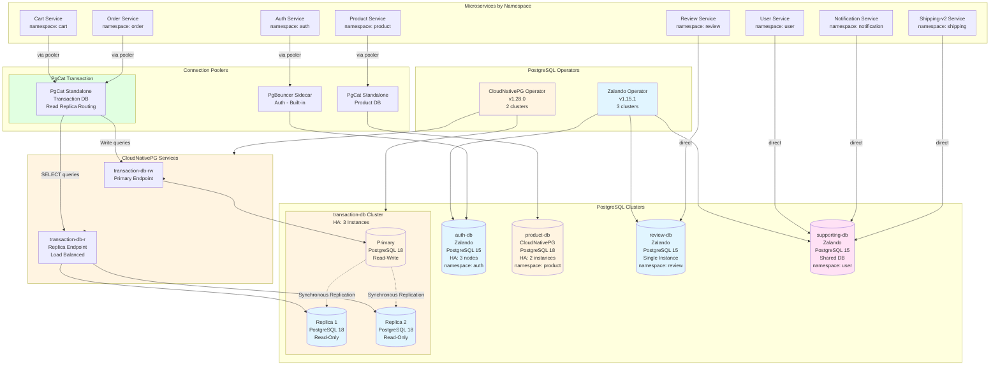
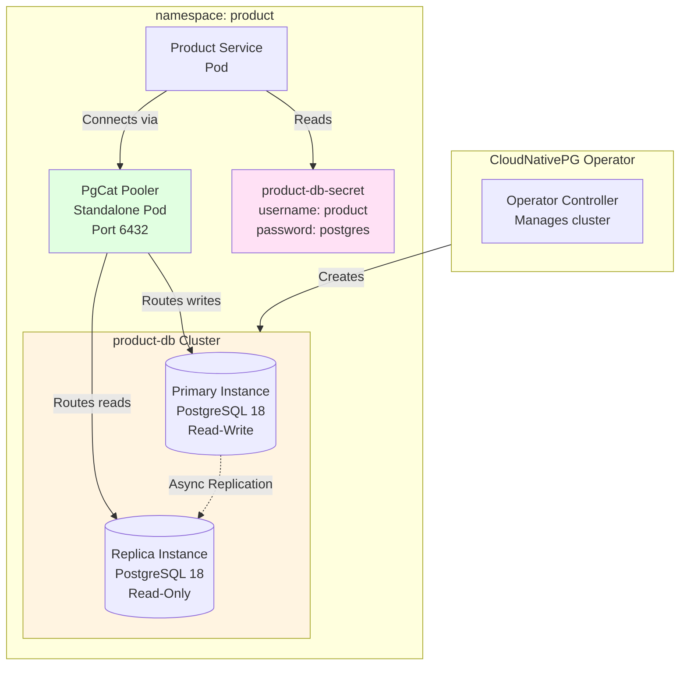
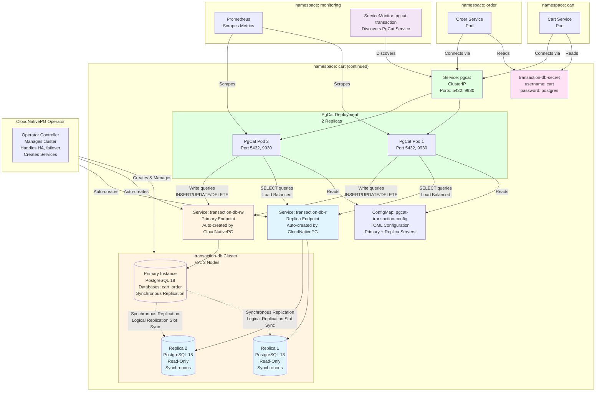
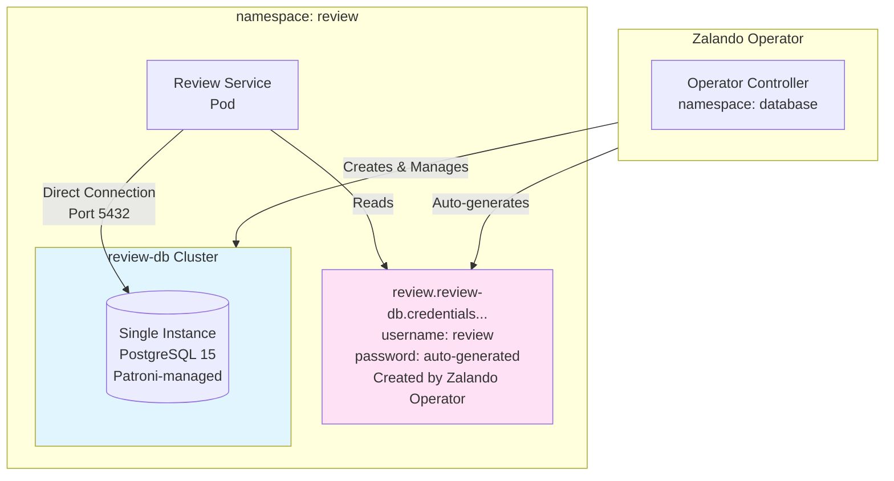
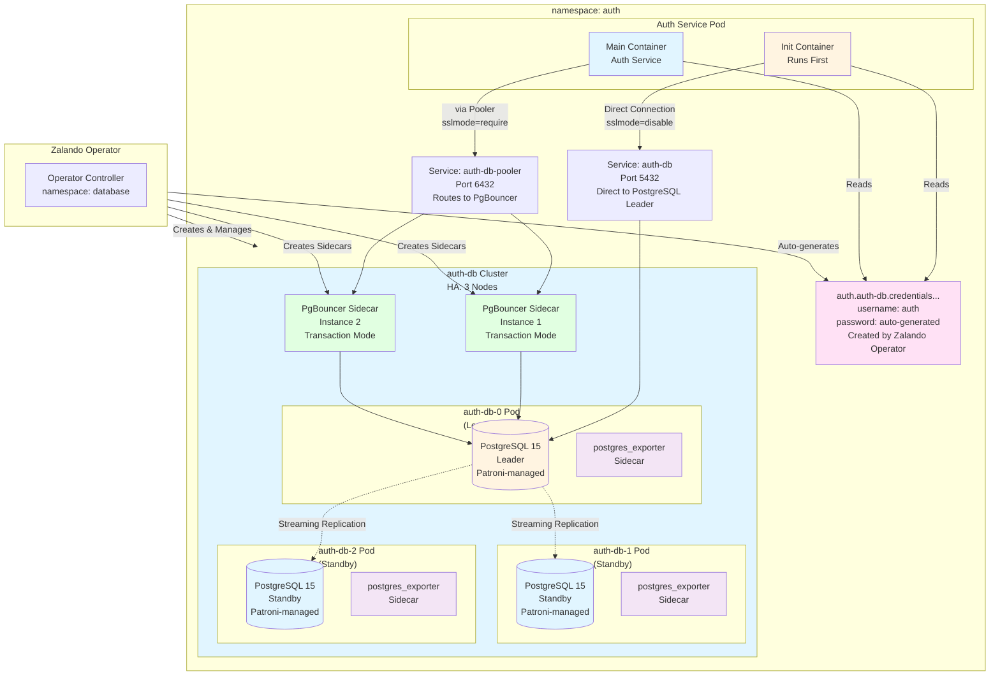
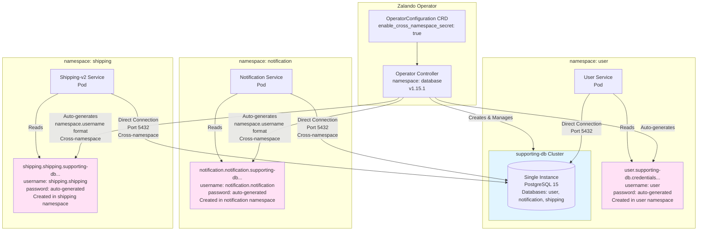

# Database Integration Guide

## Quick Summary

**What is Database Integration?**

PostgreSQL database integration enables microservices to persist data, execute real database queries, and support realistic k6 load testing with data consistency. This implementation uses multiple PostgreSQL operators, connection poolers, and HA patterns as a comprehensive learning platform.

**Key Capabilities:**
- ✅ 5 PostgreSQL clusters with different configurations (operators, poolers, HA patterns)
- ✅ Multiple connection patterns (direct, PgBouncer sidecar, PgCat standalone)
- ✅ High availability with Patroni (all operators use Patroni internally)
- ✅ Connection pooling for performance optimization
- ✅ Separate environment variables (DB_HOST, DB_PORT, etc.) for flexible configuration
- ✅ Full monitoring integration (postgres_exporter sidecars, PodMonitors, Prometheus, Grafana)

**Technologies:**
- **Zalando Postgres Operator**: PostgreSQL management powered by Patroni for 3 clusters (Review, Auth, Supporting)
- **CloudNativePG Operator**: Kubernetes-native PostgreSQL with Patroni for 2 clusters (Product DB, Transaction DB)
- **PgBouncer**: Transaction pooling for Auth service (Zalando built-in sidecar)
- **PgCat**: Modern connection pooler deployed as standalone deployments (2 replicas each) for Product DB and Transaction DB clusters
- **Patroni**: High availability manager (used by both Zalando and CloudNativePG operators via Kubernetes API)
- **Flyway**: Database schema management via init containers (9 init container images, Flyway 11.8.2)
  - **Note**: `shipping-v2` service has migrations disabled (`migrations.enabled: false`) because it shares the `shipping` database with `shipping` service. The schema is already created by `shipping` service, preventing Flyway checksum mismatch errors.

**Note on Patroni:**
- Both Zalando and CloudNativePG operators use **Patroni internally** for HA and leader election
- Patroni uses **Kubernetes API** as the Distributed Configuration Store (DCS) by default
- No separate etcd cluster needed - Kubernetes API serves as the coordination layer

---

## Table of Contents

1. [Database Architecture](#database-architecture) - 5 clusters overview
2. [CloudNativePG Operator](#cloudnativepg-operator) - Product DB, Transaction DB, PgCat, PodMonitor
3. [Zalando Postgres Operator](#zalando-postgres-operator) - Review DB, Auth DB, Supporting DB, PgBouncer, Secrets, Monitoring, Password Rotation, Backup
4. [Shared Topics](#shared-topics) - Environment Variables, Helm Config, Local Dev, Verification, Best Practices

---

## Database Architecture

### Overview

The system uses **5 PostgreSQL clusters** distributed across different operators and connection patterns to demonstrate various database management approaches:



### Operator Distribution

| Cluster | Services | Operator | PostgreSQL Version | Pooler | HA Pattern | Learning Focus |
|---------|----------|----------|-------------------|--------|------------|----------------|
| **Product** | Product | **CloudNativePG** | **18** (default) | **PgCat** (standalone, 2 replicas) | **Patroni HA** (2 instances) | Read scaling, PgCat routing, Patroni failover |
| **Review** | Review | **Zalando** | **15** | **None** (direct) | **Patroni** (single instance) | Simple setup, direct connection, Patroni basics |
| **Auth** | Auth | **Zalando** | **15** | **PgBouncer** (sidecar) | **Patroni HA** (3 instances) | Production-ready HA, transaction pooling, Zalando built-in pooler, Patroni failover |
| **Transaction** | Cart, Order | **CloudNativePG** | **18** (default) | **PgCat** (standalone, 2 replicas) | **Patroni HA** (3 instances) | **Multi-database routing, Patroni failover, synchronous replication, read replica routing** |
| **Supporting** | User, Notification, Shipping-v2 | **Zalando** | **15** | **None** (direct) | **Patroni** (single instance) | **Shared database pattern, Patroni basics** |

### Cluster Details

This section provides a brief overview of all 5 PostgreSQL clusters. For detailed configuration, architecture diagrams, and features, see the operator-specific sections below.

| Cluster | Operator | PostgreSQL Version | Instances | Pooler | HA Pattern | Namespace | Services |
|---------|----------|-------------------|-----------|--------|------------|-----------|----------|
| **Product** | CloudNativePG | 18 | 2 (1 primary + 1 replica) | PgCat (standalone, 2 replicas) | Patroni HA | `product` | Product |
| **Transaction** | CloudNativePG | 18 | 3 (1 primary + 2 replicas) | PgCat (standalone, 2 replicas) | Patroni HA (Synchronous) | `cart` | Cart, Order |
| **Review** | Zalando | 15 | 1 (single instance) | None (direct) | Patroni (single) | `review` | Review |
| **Auth** | Zalando | 15 | 3 (1 leader + 2 standbys) | PgBouncer (sidecar) | Patroni HA | `auth` | Auth |
| **Supporting** | Zalando | 15 | 1 (single instance) | None (direct) | Patroni (single) | `user` | User, Notification, Shipping-v2 |

**Detailed Information:**
- **CloudNativePG Clusters** (Product, Transaction): See [CloudNativePG Operator](#cloudnativepg-operator) section
- **Zalando Clusters** (Review, Auth, Supporting): See [Zalando Postgres Operator](#zalando-postgres-operator) section

### Monitoring Overview

Both operators integrate with Prometheus for metrics collection:

**CloudNativePG Operator:**
- Uses **PodMonitor** CRDs to scrape metrics from `postgres_exporter` sidecars
- PodMonitors located in: `k8s/prometheus/podmonitors/`
- Metrics exposed on port `9187` (named `metrics`)
- See [CloudNativePG Operator - Monitoring](#monitoring) for detailed setup

**Zalando Postgres Operator:**
- Uses **PodMonitor** CRDs to scrape metrics from `postgres_exporter` sidecars
- PodMonitors located in: `k8s/prometheus/podmonitors/`
- Metrics exposed on port `9187` (named `exporter`)
- See [Zalando Postgres Operator - Monitoring](#monitoring) for detailed setup

**Key Metrics:**
- `pg_up` - Database availability
- `pg_stat_database_*` - Database statistics
- `pg_stat_activity_*` - Active connections
- `pg_replication_*` - Replication lag

---

## CloudNativePG Operator

### Overview

**CloudNativePG Operator** (v1.28.0) is a Kubernetes operator for PostgreSQL that uses Patroni internally for high availability management. It provides a declarative, Kubernetes-native approach to managing PostgreSQL clusters.

**Key Features:**
- Kubernetes-native CRDs for cluster management
- Patroni-based HA with automatic failover (< 30 seconds)
- PostgreSQL 18 (default image)
- Built-in `postgres_exporter` sidecar for metrics
- Support for synchronous replication
- Logical replication slot synchronization
- Production-ready performance tuning

**Clusters Managed:**
- **Product Database** (`product-db`) - 2 instances (1 primary + 1 replica)
- **Transaction Database** (`transaction-db`) - 3 instances (1 primary + 2 replicas) with synchronous replication

**Connection Pooler:** PgCat standalone deployment (v1.2.0, 2 replicas each) for both clusters

### Clusters

#### Product Database

- **Operator**: CloudNativePG (v1.28.0) - uses Patroni internally
- **PostgreSQL Version**: 18 (CloudNativePG default image)
- **Instances**: 2 (1 primary + 1 replica)
- **HA**: Patroni via Kubernetes API (automatic failover)
- **Pooler**: PgCat standalone deployment v1.2.0 (`ghcr.io/postgresml/pgcat:v1.2.0`) with 2 replicas for HA
- **Namespace**: `product`
- **CRD**: `k8s/postgres-operator/cloudnativepg/crds/product-db.yaml`
- **Pooler Config**: `k8s/postgres-operator/pgcat/product/configmap.yaml`
- **Pooler Deployment**: `k8s/postgres-operator/pgcat/product/deployment.yaml`

**Architecture Diagram:**



**Features:**
- Patroni HA with automatic failover (< 30 seconds)
- Read replica load balancing via PgCat (primary configured, replicas can be added)
- Async replication (no sync constraints)
- Pool size: 50 connections
- CloudNativePG services: `product-db-rw` (read-write), `product-db-r` (read-only)
- **Secret**: `product-db-secret` in `product` namespace (CloudNativePG requires pre-created secret)

#### Transaction Database

- **Operator**: CloudNativePG (v1.28.0) - uses Patroni internally
- **PostgreSQL Version**: 18 (CloudNativePG default image)
- **Instances**: 3 (1 primary + 2 replicas) - **Production-Ready HA**
- **HA**: Patroni via Kubernetes API (automatic failover < 30 seconds)
- **Replication**: Synchronous replication with logical replication slot synchronization
- **Pooler**: PgCat standalone deployment v1.2.0 (`ghcr.io/postgresml/pgcat:v1.2.0`) with 2 replicas for HA
- **Namespace**: `cart`
- **CRD**: `k8s/postgres-operator/cloudnativepg/crds/transaction-db.yaml`
- **Pooler Config**: `k8s/postgres-operator/pgcat/transaction/configmap.yaml`
- **Pooler Deployment**: `k8s/postgres-operator/pgcat/transaction/deployment.yaml`
- **Production-Ready**: Comprehensive PostgreSQL performance tuning, synchronous replication, logical replication slot sync

**Architecture Diagram:**



**Features:**
- **High Availability**: 3-node HA setup (1 primary + 2 replicas) with automatic failover via Patroni
- **Synchronous Replication**: Zero data loss with synchronous replication (at least 1 synchronous replica required)
- **Logical Replication Slot Synchronization**: Enabled for CDC clients (Debezium, Kafka Connect) - slots synchronized across replicas during failover
- **Production-Ready Configuration**: Comprehensive PostgreSQL performance tuning (memory, WAL, query planner, parallelism, autovacuum, logging)
- **Resource Limits**: Optimized limits (CPU: 500m/1000m, Memory: 1Gi/2Gi - cost-optimized)
- **Security**: Password encryption upgraded to `scram-sha-256`, enhanced logging for security auditing
- Patroni-based HA management with automatic failover (< 30 seconds)
- Multi-database routing (cart + order databases on same cluster)
- Leader election via Kubernetes API (no separate etcd needed)
- Pool size: 30 connections per database
- **CloudNativePG Services** (auto-created by operator):
  - `transaction-db-rw.cart.svc.cluster.local` (read-write endpoint → primary instance)
  - `transaction-db-r.cart.svc.cluster.local` (read-only endpoint → load balances across replicas)
- **PgCat HA Integration**: PgCat routes SELECT queries to `transaction-db-r` (replicas) and writes to `transaction-db-rw` (primary)
- **Secret**: `transaction-db-secret` in `cart` namespace (CloudNativePG requires pre-created secret)
- **Multi-Service**: Both Cart and Order services share the same cluster but use separate databases
- **Monitoring**: PodMonitor CRD for Prometheus metrics collection (postgres_exporter sidecar)

**Note on Patroni:**
- CloudNativePG uses Patroni internally for HA management
- Patroni uses Kubernetes API as Distributed Configuration Store (DCS)
- No separate etcd cluster required - Kubernetes serves as coordination layer
- For learning purposes, CRD includes commented examples of etcd integration (not implemented)

### Features & Capabilities

**High Availability:**
- Patroni-based HA with automatic failover (< 30 seconds)
- Kubernetes API as Distributed Configuration Store (DCS)
- No separate etcd cluster required

**Replication:**
- Async replication (Product DB)
- Synchronous replication (Transaction DB) - zero data loss
- Logical replication slot synchronization for CDC clients

**Performance Tuning:**
- Production-ready PostgreSQL parameters (memory, WAL, query planner, parallelism, autovacuum, logging)
- Optimized resource limits
- SSD-optimized settings

**Multi-Database Support:**
- Transaction DB supports multiple databases (cart, order) on the same cluster
- PgCat provides multi-database routing

### Connection Patterns

#### PgCat Standalone

**When to use**: Read replica routing, multi-database routing, advanced load balancing.

**Configuration:**
```yaml
# Helm values (charts/values/product.yaml)
env:
  - name: DB_HOST
    value: "pgcat-product.product.svc.cluster.local"  # PgCat service
  - name: DB_PORT
    value: "5432"
  - name: DB_NAME
    value: "product"
  - name: DB_USER
    value: "product"
  - name: DB_PASSWORD
    valueFrom:
      secretKeyRef:
        name: product-db-secret
        key: password
```

**PgCat Configuration** (`k8s/postgres-operator/pgcat/product/configmap.yaml`):
```toml
# PgCat Configuration for Product Database
[general]
host = "0.0.0.0"
port = 5432
pool_mode = "transaction"
log_level = "info"
admin_username = "admin"
admin_password = "admin"

[admin]
host = "0.0.0.0"
port = 9930

# Product database pool
[pools.product]
pool_size = 50

[pools.product.users]
product = { username = "product", password = "postgres", pool_size = 50 }

# Primary shard (numbered starting at 0)
[pools.product.shards.0]
database = "product"

[[pools.product.shards.0.servers]]
host = "product-db-rw.product.svc.cluster.local"
port = 5432
user = "product"
password = "postgres"
role = "primary"
```

**Notes:**
- **Image**: `ghcr.io/postgresml/pgcat:v1.2.0` (fixed version, not `latest`)
- **CloudNativePG Services**: CloudNativePG automatically creates services:
  - `{cluster-name}-rw` (read-write endpoint) → `product-db-rw.product.svc.cluster.local`
  - `{cluster-name}-r` (read-only endpoint) → `product-db-r.product.svc.cluster.local` (for future replica routing)
- **Deployment**: `k8s/postgres-operator/pgcat/product/deployment.yaml` with 2 replicas
- Currently configured with primary server only; replicas can be added later for read balancing

**Transaction Database PgCat Configuration** (`k8s/postgres-operator/pgcat/transaction/configmap.yaml`):
```toml
# PgCat Configuration for Transaction Databases (Cart + Order)
[general]
host = "0.0.0.0"
port = 5432
pool_mode = "transaction"
log_level = "info"
admin_username = "admin"
admin_password = "admin"

[admin]
host = "0.0.0.0"
port = 9930

# Cart database pool
[pools.cart]
pool_size = 30

[pools.cart.users]
cart = { username = "cart", password = "postgres", pool_size = 30 }

[pools.cart.shards.0]
database = "cart"

[[pools.cart.shards.0.servers]]
host = "transaction-db-rw.cart.svc.cluster.local"
port = 5432
user = "cart"
password = "postgres"
role = "primary"

# Order database pool (same server, different database)
[pools.order]
pool_size = 30

[pools.order.users]
cart = { username = "cart", password = "postgres", pool_size = 30 }

[pools.order.shards.0]
database = "order"

[[pools.order.shards.0.servers]]
host = "transaction-db-rw.cart.svc.cluster.local"
port = 5432
user = "cart"
password = "postgres"
role = "primary"
```

**Go Code**: Same as direct connection (PgCat transparent).

#### High Availability Integration

**Transaction Database HA Configuration:**

The Transaction Database PgCat pooler is configured with **High Availability (HA)** support, enabling automatic read replica routing and load balancing.

**CloudNativePG Services (Auto-Created):**

CloudNativePG Operator automatically creates two Kubernetes services for each cluster:

1. **`transaction-db-rw`** (Read-Write Service):
   - Format: `{cluster-name}-rw.{namespace}.svc.cluster.local`
   - Points to: Current primary instance
   - Updates automatically during failover/switchover
   - Used by PgCat for: All write queries (INSERT, UPDATE, DELETE, DDL)

2. **`transaction-db-r`** (Read-Only Service):
   - Format: `{cluster-name}-r.{namespace}.svc.cluster.local`
   - Points to: All replica instances (load balanced by Kubernetes)
   - Automatically excludes unhealthy replicas
   - Updates automatically when replicas are added/removed
   - Used by PgCat for: All read queries (SELECT)

**How to Verify Services:**
```bash
# List CloudNativePG services
kubectl get svc -n cart | grep transaction-db

# Check service endpoints
kubectl get endpoints -n cart transaction-db-rw  # Should point to primary pod
kubectl get endpoints -n cart transaction-db-r   # Should point to replica pods
```

**Replica Server Configuration:**

Each database pool (cart, order) includes both primary and replica servers:

```toml
# Primary server (handles writes)
[[pools.cart.shards.0.servers]]
host = "transaction-db-rw.cart.svc.cluster.local"
port = 5432
user = "cart"
password = "postgres"
role = "primary"

# Replica server (handles read queries)
[[pools.cart.shards.0.servers]]
host = "transaction-db-r.cart.svc.cluster.local"
port = 5432
user = "cart"
password = "postgres"
role = "replica"
```

**How It Works:**

1. **Query Routing**: PgCat automatically routes queries based on SQL type:
   - **SELECT queries** → Replica servers (load balanced across available replicas)
   - **INSERT/UPDATE/DELETE/DDL** → Primary server

2. **Load Balancing**: SELECT queries are distributed across healthy replica servers using the default "random" algorithm.

3. **Automatic Failover**: If a replica becomes unhealthy:
   - PgCat automatically bans the unhealthy replica for 60 seconds (default `ban_time`)
   - Queries are routed to remaining healthy replicas + primary
   - When replica recovers, it automatically rejoins the pool

4. **Health Checks**: PgCat performs fast health checks (query `;`) before each query to ensure server availability.

**Monitoring:**

PgCat metrics are exposed via HTTP endpoint (`/metrics` on port 9930) and scraped by Prometheus using a **ServiceMonitor**:

**ServiceMonitor File:**
- `k8s/prometheus/servicemonitors/servicemonitor-pgcat-transaction.yaml`

**Key Metrics:**
- `pgcat_pools_active_connections{pool="cart"}` - Active connections per pool
- `pgcat_pools_waiting_clients{pool="cart"}` - Clients waiting for connections
- `pgcat_servers_health{server_host="...", role="primary|replica"}` - Server health status
- `pgcat_queries_total{pool="cart", server_role="replica"}` - Query count by pool and role
- `pgcat_errors_total{pool="cart"}` - Error count per pool

**Deployment:**
ServiceMonitor is automatically deployed by `scripts/02-deploy-monitoring.sh` (applies all ServiceMonitors from `k8s/prometheus/servicemonitors/`).

**Troubleshooting:**

**Issue: SELECT queries not routing to replicas**
- Check PgCat logs: `kubectl logs -n cart -l app=pgcat-transaction --tail=100 | grep -i "routing\|replica"`
- Verify replica servers are healthy: `kubectl get pods -n cart -l cnpg.io/cluster=transaction-db`
- Check metrics: `pgcat_servers_health{role="replica"}` should show `status="healthy"`

**Issue: Uneven load distribution**
- Expected: 40-60% distribution per replica (not exactly 50/50)
- Monitor over time: `pgcat_queries_total{server_role="replica"}` per server
- Can adjust load balancing algorithm in ConfigMap if needed (default: "random")

**Issue: Replica failover not working**
- Verify CloudNativePG HA is working: `kubectl get cluster transaction-db -n cart`
- Check PgCat ban_time: Default 60 seconds (can be configured in `[general]` section)
- Monitor failover events: `pgcat_servers_health{status="unhealthy"}`

**Issue: Metrics not available in Prometheus**
- Verify ServiceMonitor exists: `kubectl get servicemonitor -n monitoring pgcat-transaction`
- Check Prometheus targets: Port-forward to Prometheus UI and check `/targets` page
- Verify PgCat service has correct labels: `kubectl get svc -n cart pgcat -o yaml | grep -A 5 labels`

### Configuration

**CRD Examples:**

Product DB CRD location: `k8s/postgres-operator/cloudnativepg/crds/product-db.yaml`
Transaction DB CRD location: `k8s/postgres-operator/cloudnativepg/crds/transaction-db.yaml`

**Key Configuration Parameters:**
- `instances`: Number of PostgreSQL instances (2 for Product, 3 for Transaction)
- `postgresql.parameters`: PostgreSQL configuration parameters
- `postgresql.synchronous`: Synchronous replication settings (Transaction DB)
- `replicationSlots.highAvailability.synchronizeLogicalDecoding`: Logical replication slot sync
- `resources`: CPU and memory limits
- `storage.size`: Persistent volume size

**Secret Management:**
- CloudNativePG requires pre-created secrets
- Secrets must be created before cluster deployment
- Secret format: `{cluster-name}-secret` in cluster namespace
- Contains: `username`, `password` keys

### Monitoring

#### PodMonitor Setup

CloudNativePG clusters use **PodMonitor** CRDs to enable Prometheus scraping of `postgres_exporter` sidecars.

**PodMonitor Files:**
- `k8s/prometheus/podmonitors/podmonitor-product-db.yaml` (Product DB)
- `k8s/prometheus/podmonitors/podmonitor-transaction-db.yaml` (Transaction DB)

**Example PodMonitor:**
```yaml
apiVersion: monitoring.coreos.com/v1
kind: PodMonitor
metadata:
  name: product-db
  namespace: product
  labels:
    app: product-db
    operator: cloudnativepg
spec:
  selector:
    matchLabels:
      cnpg.io/cluster: product-db
  podMetricsEndpoints:
  - port: metrics
    interval: 15s
    scrapeTimeout: 10s
    path: /metrics
  podTargetLabels:
    - cnpg.io/cluster
    - cnpg.io/instanceRole
    - cnpg.io/instanceName
```

**Deployment:**
PodMonitors are automatically deployed by `scripts/04-deploy-databases.sh` after database clusters are ready.

**Key Metrics:**
- `pg_up` - Database availability
- `pg_stat_database_*` - Database statistics
- `pg_stat_activity_*` - Active connections
- `pg_replication_*` - Replication lag


## Zalando Postgres Operator

### Overview

**Zalando Postgres Operator** (v1.15.1) is a Kubernetes operator for PostgreSQL that uses Patroni internally for high availability management. It provides comprehensive PostgreSQL cluster management with built-in features like PgBouncer sidecar and automatic secret generation.

**Key Features:**
- Kubernetes-native CRDs for cluster management
- Patroni-based HA with automatic failover (< 30 seconds)
- PostgreSQL 15 (explicitly configured)
- Built-in PgBouncer sidecar for connection pooling
- Automatic secret generation
- Cross-namespace secret support
- Built-in `postgres_exporter` sidecar for metrics

**Clusters Managed:**
- **Review Database** (`review-db`) - 1 instance (single instance)
- **Auth Database** (`auth-db`) - 3 instances (1 leader + 2 standbys) with production-ready HA
- **Supporting Database** (`supporting-db`) - 1 instance (shared database pattern)

**Connection Patterns:** Direct connection and PgBouncer sidecar

### Clusters

#### Review Database

- **Operator**: Zalando Postgres Operator (v1.15.1) - powered by Patroni
- **PostgreSQL Version**: 15 (explicitly configured in CRD)
- **Instances**: 1 (single instance, no HA)
- **HA**: Patroni via Kubernetes API (single instance, no failover needed)
- **Pooler**: None (direct connection)
- **Namespace**: `review` (same namespace as review service - no cross-namespace secrets needed)
- **CRD**: `k8s/postgres-operator/zalando/crds/review-db.yaml`

**Architecture Diagram:**



**Features:**
- Patroni-based management (even for single instance)
- Simple setup for low-traffic service
- Direct PostgreSQL connection (no pooler overhead)
- PostgreSQL 15
- **Secret**: Auto-generated by Zalando operator (`review.review-db.credentials.postgresql.acid.zalan.do`)
- **Note**: Cluster and service are in the same namespace (`review`), so cross-namespace secret feature is not needed

#### Auth Database

- **Operator**: Zalando Postgres Operator (v1.15.1) - powered by Patroni
- **PostgreSQL Version**: 15 (explicitly configured in CRD)
- **Instances**: 3 (HA: 1 leader + 2 standbys)
- **HA**: Patroni HA via Kubernetes API (automatic failover < 30 seconds)
- **Pooler**: PgBouncer sidecar (2 instances, transaction mode)
- **Namespace**: `auth` (same namespace as auth service - no cross-namespace secrets needed)
- **CRD**: `k8s/postgres-operator/zalando/crds/auth-db.yaml`
- **Production-Ready**: Comprehensive PostgreSQL performance tuning, optimized resource limits, enhanced logging

**Architecture Diagram:**



**Features:**
- **High Availability**: 3-node HA setup (1 leader + 2 standbys) with automatic failover via Patroni
- **Production-Ready Configuration**: Comprehensive PostgreSQL performance tuning (memory, WAL, query planner, parallelism, autovacuum, logging)
- **Resource Limits**: Optimized limits (CPU: 1 core, Memory: 2Gi - small, conservative)
- **Security**: Password encryption upgraded to `scram-sha-256`, enhanced logging for security auditing
- Patroni-based HA management with automatic failover (< 30 seconds)
- Built-in PgBouncer sidecar (Zalando operator feature)
- **Dual Connection Pattern**:
  - **Main Container**: Connects via PgBouncer pooler (`auth-db-pooler.auth.svc.cluster.local:6432`) with `sslmode=require` - PgBouncer requires SSL connections from clients
  - **Init Container**: Connects directly (`auth-db.auth.svc.cluster.local:5432`) with `sslmode=disable` - init containers require direct connection, cannot use transaction pooling, and direct PostgreSQL accepts unencrypted connections
- Transaction pooling for short-lived connections (main container)
- Pool size: 25 connections
- **Secret**: Auto-generated by Zalando operator (`auth.auth-db.credentials.postgresql.acid.zalan.do`)
- **Monitoring**: `postgres_exporter` sidecar in each pod for Prometheus metrics collection
- **Note**: Cluster and service are in the same namespace (`auth`), so cross-namespace secret feature is not needed

**Why Two Connection Paths?**
- **PgBouncer Pooler** (`auth-db-pooler`): Used by main container for transaction pooling, reduces connection overhead
- **Direct Connection** (`auth-db`): Used by init container because:
  - Init containers run before main container starts
  - Init containers need full database access and long-running operations
  - Transaction pooling mode doesn't support DDL statements (CREATE TABLE, ALTER TABLE, etc.)

#### Supporting Database

- **Operator**: Zalando Postgres Operator (v1.15.1) - powered by Patroni
- **PostgreSQL Version**: 15 (explicitly configured in CRD)
- **Instances**: 1 (single instance, no HA)
- **HA**: Patroni via Kubernetes API (single instance, no failover needed)
- **Pooler**: None (direct connection)
- **Namespace**: `user` (cluster location)
- **CRD**: `k8s/postgres-operator/zalando/crds/supporting-db.yaml`

**Architecture Diagram:**



**Features:**
- Patroni-based management (even for single instance)
- Shared database pattern (3 databases: user, notification, shipping)
- Direct connection for low-traffic services
- PostgreSQL 15
- Cross-namespace secret management (see [Zalando Postgres Operator - Secret Management](#secret-management) section)

**Cross-Namespace Secret Pattern:**
- Database cluster exists in `user` namespace
- Services deploy in `notification` and `shipping` namespaces
- Zalando operator configured with `enable_cross_namespace_secret: true` via OperatorConfiguration CRD
- Users defined with `namespace.username` format (e.g., `notification.notification`, `shipping.shipping`)
- Secrets created with format: `{namespace}.{username}.{clustername}.credentials.postgresql.acid.zalan.do`
- **User Service**: Uses regular secret `user.supporting-db.credentials.postgresql.acid.zalan.do` in `user` namespace (same namespace)
- **Notification Service**: Uses cross-namespace secret `notification.notification.supporting-db.credentials.postgresql.acid.zalan.do` (should be in `notification` namespace)
- **Shipping Service**: Uses cross-namespace secret `shipping.shipping.supporting-db.credentials.postgresql.acid.zalan.do` (should be in `shipping` namespace)
- **Note**: Operator v1.15.1 automatically creates secrets in target namespaces (`notification`, `shipping`) when `enable_cross_namespace_secret: true` is configured

### Features & Capabilities

**High Availability:**
- Patroni-based HA with automatic failover (< 30 seconds)
- Kubernetes API as Distributed Configuration Store (DCS)
- 3-node HA setup for Auth DB (production-ready)

**Built-in Features:**
- PgBouncer sidecar for connection pooling (Auth DB)
- Automatic secret generation
- Cross-namespace secret support
- Built-in `postgres_exporter` sidecar for metrics

**Production-Ready Configuration:**
- Comprehensive PostgreSQL performance tuning (Auth DB)
- Optimized resource limits
- Enhanced logging for security auditing

### Connection Patterns

#### Direct Connection

**When to use**: Low-traffic services, simple setup, no connection pooling needed.

**Configuration:**
```yaml
# Helm values (charts/values/review.yaml)
env:
  - name: DB_HOST
    value: "review-db.review.svc.cluster.local"  # review-db is in review namespace
  - name: DB_PORT
    value: "5432"
  - name: DB_NAME
    value: "review"
  - name: DB_USER
    value: "review"
  - name: DB_PASSWORD
    valueFrom:
      secretKeyRef:
        name: review.review-db.credentials.postgresql.acid.zalan.do
        key: password
```

**Go Code** (`services/internal/review/core/database.go`):
```go
// Direct connection - no pooler
cfg := &DatabaseConfig{
    Host:     getEnv("DB_HOST", ""),  // review-db.review.svc.cluster.local
    Port:     getEnv("DB_PORT", "5432"),
    Name:     getEnv("DB_NAME", ""),  // review
    User:     getEnv("DB_USER", ""),  // review
    Password: getEnv("DB_PASSWORD", ""),
}
```

**Used by:** Review DB, Supporting DB

#### PgBouncer Sidecar

**When to use**: High connection churn, transaction pooling needed, Zalando operator built-in.

**Configuration:**
```yaml
# Helm values (charts/values/auth.yaml)
env:
  - name: DB_HOST
    value: "auth-db-pooler.auth.svc.cluster.local"  # PgBouncer endpoint - auth-db is in auth namespace
  - name: DB_PORT
    value: "5432"
  - name: DB_NAME
    value: "auth"
  - name: DB_USER
    value: "auth"
  - name: DB_PASSWORD
    valueFrom:
      secretKeyRef:
        name: auth.auth-db.credentials.postgresql.acid.zalan.do
        key: password
  - name: DB_SSLMODE
    value: "require"  # PgBouncer requires SSL connections
  - name: DB_POOL_MODE
    value: "transaction"  # PgBouncer transaction pooling
```

**CRD Configuration** (`k8s/postgres-operator/zalando/crds/auth-db.yaml`):
```yaml
connectionPooler:
  numberOfInstances: 2
  schema: pooler
  user: pooler
  mode: transaction  # Transaction pooling
```

**Go Code**: Same as direct connection (service doesn't know about pooler).

**Used by:** Auth DB

### Secret Management

#### Secret Naming Convention

Zalando Postgres Operator automatically creates secrets for each database user. The naming convention depends on whether cross-namespace secrets are enabled:

**Regular Format** (same namespace):
`{username}.{cluster-name}.credentials.postgresql.acid.zalan.do`

**Cross-Namespace Format** (when `enable_cross_namespace_secret: true`):
`{namespace}.{username}.{cluster-name}.credentials.postgresql.acid.zalan.do`

| Service | Secret Name | Namespace | Format |
|---------|-------------|-----------|--------|
| **User** | `user.supporting-db.credentials.postgresql.acid.zalan.do` | `user` | Regular (same namespace) |
| **Notification** | `notification.notification.supporting-db.credentials.postgresql.acid.zalan.do` | `notification` | Cross-namespace (`namespace.username`) |
| **Shipping** | `shipping.shipping.supporting-db.credentials.postgresql.acid.zalan.do` | `shipping` | Cross-namespace (`namespace.username`) |
| **Review** | `review.review-db.credentials.postgresql.acid.zalan.do` | `review` | Regular (same namespace) |
| **Auth** | `auth.auth-db.credentials.postgresql.acid.zalan.do` | `auth` | Regular (same namespace) |

**Note**: 
- These secrets contain `username` and `password` keys
- Helm charts reference these secrets directly - no manual secret creation needed for Zalando-managed databases
- Cross-namespace secrets use `namespace.username` format in the database CRD (e.g., `notification.notification`)

#### Cross-Namespace Secrets for Shared Supporting Database

The **Supporting Database** (`supporting-db`) cluster uses a **shared database pattern** where multiple services (User, Notification, Shipping-v2) share the same PostgreSQL cluster but use separate databases within that cluster.

**Key Characteristics:**
- **Cluster Location**: `supporting-db` cluster is deployed in the `user` namespace
- **Services**: User (same namespace), Notification (`notification` namespace), Shipping-v2 (`shipping` namespace)
- **Cross-Namespace Secret Management**: Zalando operator configured with `enable_cross_namespace_secret: true`
- **User Format**: `namespace.username` notation (e.g., `notification.notification`, `shipping.shipping`)
- **Secret Names**: `{namespace}.{username}.{clustername}.credentials.postgresql.acid.zalan.do`

**Configuration:**

**OperatorConfiguration CRD** - **Helm-managed CRD (`postgres-operator`) is the active configuration**:

- **CRD Name**: `postgres-operator` (created automatically by Helm chart)
- **Configuration Source**: `k8s/postgres-operator/zalando/values.yaml`:
```yaml
   # Flat structure (NOT nested under config:)
   configKubernetes:
     cluster_name: "kind-cluster"
     enable_cross_namespace_secret: true  # Enable cross-namespace secret creation
   ```
- **Important**: Helm chart expects **flat structure** (`configKubernetes:`, `configPostgresql:`, etc.) as top-level keys, NOT nested under `config:`
- **How Operator Reads It**: Operator reads this CRD via `POSTGRES_OPERATOR_CONFIGURATION_OBJECT: postgres-operator` environment variable (set by Helm chart)
- **To Update Configuration**: Edit `values.yaml` and run `helm upgrade postgres-operator postgres-operator/postgres-operator -n database -f k8s/postgres-operator/zalando/values.yaml`

**Note:** The Helm chart automatically creates the `postgres-operator` OperatorConfiguration CRD from the values file. This is the only configuration method used.

**Database CRD** (`k8s/postgres-operator/zalando/crds/supporting-db.yaml`):
   ```yaml
   databases:
     user: user
     notification: notification.notification  # namespace.username format for cross-namespace secret
     shipping: shipping.shipping  # namespace.username format for cross-namespace secret
   users:
     user:  # Database owner for user database
       - createdb
     notification.notification:  # namespace.username format for cross-namespace secret
       - createdb
    shipping.shipping:  # namespace.username format for cross-namespace secret (used by both shipping and shipping-v2 services)
      - createdb
   ```

**Secret Names Generated**:
   - `notification.notification.supporting-db.credentials.postgresql.acid.zalan.do` (created in `notification` namespace) ✅
   - `shipping.shipping.supporting-db.credentials.postgresql.acid.zalan.do` (created in `shipping` namespace, shared by both `shipping` and `shipping-v2` services) ✅

**Secret Creation:**

The Zalando operator (v1.15.1+) creates secrets with the correct names in the target namespaces when `enable_cross_namespace_secret: true` is configured and Helm values use the correct flat structure. Secrets are automatically created in:
- `notification` namespace: `notification.notification.supporting-db.credentials.postgresql.acid.zalan.do` ✅
- `shipping` namespace: `shipping.shipping.supporting-db.credentials.postgresql.acid.zalan.do` ✅

**Note on shipping-v2 Service:**
- Both `shipping` (v1) and `shipping-v2` (v2) services run in the `shipping` namespace
- Both services use the same user `shipping.shipping` (with namespace prefix) and database `shipping`
- Secret `shipping.shipping.supporting-db.credentials.postgresql.acid.zalan.do` is automatically created in the `shipping` namespace by the operator
- **Migration**: `shipping-v2` service has migrations disabled (`migrations.enabled: false`) because the database schema is already created by `shipping` service. This prevents Flyway checksum mismatch errors when both services share the same database.

**Verification:**

```bash
# Check secrets in target namespaces
kubectl get secret notification.notification.supporting-db.credentials.postgresql.acid.zalan.do -n notification
kubectl get secret shipping.shipping.supporting-db.credentials.postgresql.acid.zalan.do -n shipping

# Verify secret keys
kubectl get secret notification.notification.supporting-db.credentials.postgresql.acid.zalan.do -n notification -o jsonpath='{.data}' | jq 'keys'
```

**Troubleshooting:**

If a service fails to start with "secret not found" error:
1. Verify the operator configuration: `kubectl get operatorconfiguration postgresql-operator-configuration -n database`
2. Check that `enable_cross_namespace_secret: true` is set
3. Verify the database CRD uses namespace notation: `kubectl get postgresql supporting-db -n user -o yaml | grep -A 5 "users:"`
4. Check that secrets exist in target namespaces: `kubectl get secret -n <namespace> | grep supporting-db`
5. Verify Helm values reference the correct secret name: `notification.notification.supporting-db.credentials.postgresql.acid.zalan.do`
6. Check operator logs: `kubectl logs -n database -l app.kubernetes.io/name=postgres-operator | grep -i "secret\|cross\|namespace"`

**Configuration Fix (2025-12-30):**

The cross-namespace secret feature was fixed by correcting the Helm values structure:
- **Issue**: Helm values used nested structure (`config.kubernetes.enable_cross_namespace_secret`) instead of flat structure (`configKubernetes.enable_cross_namespace_secret`)
- **Fix**: Restructured `k8s/postgres-operator/zalando/values.yaml` to use flat top-level keys (`configKubernetes:`, `configPostgresql:`, `configConnectionPooler:`, `configBackup:`, `configGeneral:`)
- **Result**: Operator now correctly reads `enable_cross_namespace_secret: true` and creates secrets in target namespaces automatically ✅

### Configuration

**CRD Examples:**

Review DB CRD location: `k8s/postgres-operator/zalando/crds/review-db.yaml`
Auth DB CRD location: `k8s/postgres-operator/zalando/crds/auth-db.yaml`
Supporting DB CRD location: `k8s/postgres-operator/zalando/crds/supporting-db.yaml`

**Key Configuration Parameters:**
- `numberOfInstances`: Number of PostgreSQL instances (1 for Review/Supporting, 3 for Auth)
- `postgresql.version`: PostgreSQL version (15)
- `connectionPooler`: PgBouncer sidecar configuration (Auth DB)
- `resources`: CPU and memory limits
- `volume.size`: Persistent volume size

**Operator Configuration:**
- Managed via Helm values: `k8s/postgres-operator/zalando/values.yaml`
- OperatorConfiguration CRD: `postgres-operator` (auto-created by Helm)
- Key settings: `enable_cross_namespace_secret: true`

### Monitoring

#### Sidecar Monitoring - Production-Ready Approach

PostgreSQL metrics are exposed via `postgres_exporter` sidecar containers for Zalando-managed clusters (auth-db, review-db, supporting-db).

**Overview:**
`postgres_exporter` runs as a **sidecar container** in each PostgreSQL pod managed by Zalando Postgres Operator. This production-ready approach provides per-cluster isolation, simpler setup, and better reliability.

**Benefits:**
- ✅ **No Infrastructure Roles Needed** - Uses PostgreSQL pod credentials automatically
- ✅ **No Permission Grants Needed** - Uses database owner credentials (has full access)
- ✅ **Per-Cluster Isolation** - Production-ready approach, failure in one cluster doesn't affect others
- ✅ **Simpler Setup** - Just add sidecar to CRD and create PodMonitor
- ✅ **Better Reliability** - Co-located exporter, no network hop, automatic restart

**How It Works:**
1. Add `sidecars` section to PostgreSQL CRD with `postgres_exporter` configuration
2. Sidecar uses PostgreSQL pod's environment variables (`POSTGRES_USER`, `POSTGRES_PASSWORD`) automatically
3. Create `PodMonitor` CRD for each cluster to enable Prometheus Operator scraping
4. Prometheus Operator automatically discovers and scrapes metrics from sidecar exporters

**Configuration:**

**Step 1: Add Sidecar to PostgreSQL CRD**
```yaml
# k8s/postgres-operator/zalando/crds/auth-db.yaml
apiVersion: "acid.zalan.do/v1"
kind: postgresql
metadata:
  name: auth-db
spec:
  # ... existing config ...
  
  sidecars:
    - name: exporter
      image: quay.io/prometheuscommunity/postgres-exporter:v0.18.1
      ports:
        - name: exporter
          containerPort: 9187
          protocol: TCP
      resources:
        limits:
          cpu: 500m
          memory: 256M
        requests:
          cpu: 100m
          memory: 256M
      env:
        - name: "DATA_SOURCE_URI"
          value: "localhost/postgres?sslmode=require"
        - name: "DATA_SOURCE_USER"
          value: "$(POSTGRES_USER)"
        - name: "DATA_SOURCE_PASS"
          value: "$(POSTGRES_PASSWORD)"
        - name: "PG_EXPORTER_AUTO_DISCOVER_DATABASES"
          value: "true"
```

**Step 2: Create PodMonitor per Cluster**
```yaml
# k8s/prometheus/podmonitors/podmonitor-auth-db.yaml
apiVersion: monitoring.coreos.com/v1
kind: PodMonitor
metadata:
  name: postgresql-auth-db
  namespace: auth
spec:
  selector:
    matchLabels:
      application: spilo  # Zalando operator default label
      cluster-name: auth-db  # Cluster-specific label
  podTargetLabels:
    - spilo-role
    - cluster-name
    - team
  podMetricsEndpoints:
    - port: exporter
      interval: 15s
      scrapeTimeout: 10s
```

**Step 3: Verify Sidecar and Metrics**
```bash
# Check sidecar is running (check all 3 pods)
kubectl get pod -n auth auth-db-0 -o jsonpath='{.spec.containers[*].name}'
# Should show: postgres exporter
kubectl get pod -n auth auth-db-1 -o jsonpath='{.spec.containers[*].name}'
kubectl get pod -n auth auth-db-2 -o jsonpath='{.spec.containers[*].name}'

# Check sidecar logs (check all 3 pods)
kubectl logs -n auth auth-db-0 -c exporter
kubectl logs -n auth auth-db-1 -c exporter
kubectl logs -n auth auth-db-2 -c exporter

# Test metrics endpoint (test any pod)
kubectl port-forward -n auth auth-db-0 9187:9187 &
curl http://localhost:9187/metrics | grep pg_up
kill %1

# Check PodMonitors
kubectl get podmonitor -A
```

**Key Configuration Details:**
- **Image**: `quay.io/prometheuscommunity/postgres-exporter:v0.18.1`
- **Connection**: `localhost/postgres?sslmode=require` (same pod network namespace)
- **Credentials**: Uses PostgreSQL pod environment variables automatically
- **Port**: `9187` named `exporter` (for PodMonitor)
- **Resources**: Minimal overhead (`cpu: 500m/100m`, `memory: 256M/256M`)
- **Auto-discovery**: `PG_EXPORTER_AUTO_DISCOVER_DATABASES: "true"` enables automatic database discovery

**Per-Cluster PodMonitors:**
Each cluster needs its own PodMonitor (production-ready approach):
- `k8s/prometheus/podmonitors/podmonitor-auth-db.yaml` in `auth` namespace
- `k8s/prometheus/podmonitors/podmonitor-review-db.yaml` in `review` namespace
- `k8s/prometheus/podmonitors/podmonitor-supporting-db.yaml` in `user` namespace

**Why Per-Cluster PodMonitors?**
- ✅ **Isolation** - Each cluster's metrics are independently scraped
- ✅ **Reliability** - Failure in one cluster doesn't affect others
- ✅ **Granularity** - Can configure different scrape intervals per cluster
- ✅ **Labeling** - Better metric labeling with cluster-specific labels
- ✅ **Troubleshooting** - Easier to identify which cluster has issues

**Deployment:**
PodMonitors are automatically deployed by `scripts/04-deploy-databases.sh` after database clusters are ready.

**Grafana Dashboards:**

PostgreSQL metrics are available in Grafana with key metrics:
- `pg_stat_database_*` - Database statistics
- `pg_stat_activity_*` - Active connections
- `pg_replication_*` - Replication lag
- `pg_up` - Database availability

### Password Rotation

**Purpose:** Secure password rotation procedures for Zalando Postgres Operator-managed database credentials, ensuring zero-downtime updates and compliance with security policies.

#### Overview

Password rotation is a critical security practice for production databases. Zalando Postgres Operator manages passwords via Kubernetes Secrets, and rotation can be performed through:

1. **Native Zalando Approach** - Manual rotation via secret updates (documented below)
2. **External Secrets Operator** - Automatic rotation from Vault/AWS Secrets Manager (future implementation)

**Rotation Schedule:**
- **Infrastructure roles** (monitoring, backup): Every 90 days
- **Application users**: Every 180 days (or per compliance policy)
- **Emergency rotation**: Immediately upon security incident

**Reference:** For detailed procedures and External Secrets Operator integration, see [`specs/active/Zalando-operator/research.md`](../../specs/active/Zalando-operator/research.md#password-rotation-in-kubernetes-secrets).

#### Native Zalando Password Rotation

**How It Works:**
- Zalando operator generates passwords automatically when creating users
- Passwords are stored in Kubernetes Secrets
- Operator watches secrets and updates database passwords when secrets change
- Services using `secretKeyRef` automatically get updated passwords


#### Zero-Downtime Rotation Strategy

**Dual Password Approach:**

1. **Add new password to secret** (keep old password temporarily)
2. **Operator updates database** with new password
3. **Restart services** to pick up new password
4. **Verify all services connected** with new password
5. **Remove old password** from secret

#### External Secrets Operator Integration (Future)

**Architecture:**
```
Vault/AWS Secrets Manager
    ↓ (password rotation)
External Secrets Operator
    ↓ (syncs new password)
Kubernetes Secret (Zalando format)
    ↓ (operator watches)
Zalando Postgres Operator
    ↓ (updates database)
PostgreSQL Database
```

**Benefits:**
- ✅ **Automatic rotation** - No manual intervention needed
- ✅ **Centralized management** - All passwords in Vault
- ✅ **Audit trail** - Vault audit logs track all rotations
- ✅ **Zero-downtime** - ESO syncs before expiration
- ✅ **Compliance** - Meets security policy requirements

**Configuration:** See [`specs/active/Zalando-operator/research.md`](../../specs/active/Zalando-operator/research.md#external-secrets-operator-approach-automatic-rotation) for detailed ESO setup instructions.

**Note:** ESO integration is planned for future implementation. Current setup uses native Zalando password rotation.

#### Rotation Best Practices

**Procedures:**
1. **Document rotation schedule** - Maintain rotation calendar
2. **Test in staging first** - Verify rotation procedure works
3. **Notify stakeholders** - Alert team before rotation
4. **Monitor closely** - Watch for connection failures
5. **Keep old passwords** - Retain for 7 days for rollback
6. **Update documentation** - Document new passwords (if manual)

**Monitoring:**
- **Secret sync status**: `kubectl get externalsecret -A` (if using ESO)
- **Password age**: Track last rotation date
- **Connection failures**: Monitor service logs after rotation
- **Operator logs**: Check Zalando operator for password update events

**Alerts:**
- Secret sync failure (ESO approach)
- Password rotation overdue (>90 days)
- Service connection failures after rotation
- Operator password update errors

### Backup Strategy

**Purpose:** Comprehensive backup and disaster recovery strategy for Zalando Postgres Operator-managed clusters, ensuring data protection and business continuity.

#### Overview

Production databases require robust backup strategies including:
- **Continuous WAL archiving** - Point-in-time recovery (PITR) capability
- **Base backups** - Full database snapshots
- **Backup retention** - Multiple retention policies (daily, weekly, monthly)
- **Disaster recovery** - Recovery procedures and RTO/RPO targets
- **Backup monitoring** - Health checks and alerting

**RTO/RPO Targets:**
- **RTO (Recovery Time Objective)**: 4 hours
- **RPO (Recovery Point Objective)**: 15 minutes (WAL archive frequency)

**Reference:** For detailed backup configuration and procedures, see [`specs/active/Zalando-operator/research.md`](../../specs/active/Zalando-operator/research.md#backup-strategy-for-production-deployment).

#### Zalando Operator Backup Support

**Built-in Backup Options:**

1. **WAL-E / WAL-G** - Continuous WAL archiving to S3/GCS/Azure
2. **Logical backups** - pg_dump via Kubernetes Jobs
3. **Physical backups** - pg_basebackup via sidecar containers

**Current Configuration:**
```yaml
# k8s/postgres-operator/zalando/values.yaml
config:
  backup:
    wal_s3_bucket: ""  # Leave empty for no backup (learning project)
```

**Note:** Backup implementation requires cloud credentials (S3/GCS/Azure). Configuration is documented below for future implementation.

#### WAL-E/WAL-G Backup Configuration (Future Implementation)

**Architecture:**
```
PostgreSQL Cluster
    ↓ (WAL files)
WAL-E/WAL-G Sidecar Container
    ↓ (uploads to S3)
AWS S3 / GCS / Azure Blob Storage
    ↓ (retention policies)
Long-term Storage
```

**Configuration Steps:**

**Step 1: Configure S3 Bucket**
```bash
# Create S3 bucket for backups
aws s3 mb s3://postgres-backups-prod --region us-east-1

# Configure lifecycle policies
aws s3api put-bucket-lifecycle-configuration \
  --bucket postgres-backups-prod \
  --lifecycle-configuration file://lifecycle.json
```

**Step 2: Create S3 Credentials Secret**
```yaml
apiVersion: v1
kind: Secret
metadata:
  name: wal-e-s3-credentials
  namespace: database
type: Opaque
stringData:
  AWS_ACCESS_KEY_ID: "your-access-key"
  AWS_SECRET_ACCESS_KEY: "your-secret-key"
  WALE_S3_PREFIX: "s3://postgres-backups-prod/auth-db/"
```

**Step 3: Configure Database CRD**
```yaml
# In auth-db.yaml (when credentials available)
apiVersion: "acid.zalan.do/v1"
kind: postgresql
metadata:
  name: auth-db
  namespace: auth
spec:
  # ... existing config ...
  
  # Backup configuration
  enableLogicalBackup: true
  logicalBackupSchedule: "30 00 * * *"  # Daily at 00:30 UTC
  
  # WAL-E/WAL-G configuration (via environment variables in Spilo)
  env:
    - name: WAL_S3_BUCKET
      value: "postgres-backups-prod"
    - name: USE_WALG_BACKUP
      value: "true"  # Use WAL-G instead of WAL-E (newer, faster)
    - name: WALG_S3_PREFIX
      value: "s3://postgres-backups-prod/auth-db/"
    - name: AWS_ACCESS_KEY_ID
    valueFrom:
      secretKeyRef:
          name: wal-e-s3-credentials
          key: AWS_ACCESS_KEY_ID
    - name: AWS_SECRET_ACCESS_KEY
      valueFrom:
        secretKeyRef:
          name: wal-e-s3-credentials
          key: AWS_SECRET_ACCESS_KEY
```

#### Backup Retention Policies

**Recommended Retention:**

| Backup Type | Retention | Purpose |
|-------------|-----------|---------|
| **WAL Archives** | 7 days | Point-in-time recovery window |
| **Daily Backups** | 30 days | Recent recovery needs |
| **Weekly Backups** | 12 weeks (3 months) | Medium-term recovery |
| **Monthly Backups** | 12 months (1 year) | Long-term compliance |

**S3 Lifecycle Configuration:**
```json
{
  "Rules": [
    {
      "Id": "WAL-Archives-7Days",
      "Status": "Enabled",
      "Prefix": "wal/",
      "Expiration": {
        "Days": 7
      }
    },
    {
      "Id": "Daily-Backups-30Days",
      "Status": "Enabled",
      "Prefix": "base/daily/",
      "Expiration": {
        "Days": 30
      }
    },
    {
      "Id": "Weekly-Backups-12Weeks",
      "Status": "Enabled",
      "Prefix": "base/weekly/",
      "Expiration": {
        "Days": 84
      }
    },
    {
      "Id": "Monthly-Backups-12Months",
      "Status": "Enabled",
      "Prefix": "base/monthly/",
      "Expiration": {
        "Days": 365
      },
      "Transitions": [
        {
          "Days": 90,
          "StorageClass": "GLACIER"
        }
      ]
    }
  ]
}
```

#### Point-in-Time Recovery (PITR)

**How It Works:**
- WAL files are continuously archived to S3
- Base backups are taken periodically (daily/weekly)
- Recovery restores base backup + replays WAL files to target time

**Recovery Procedure:**

**Step 1: Identify Recovery Point**
```bash
# List available backups
wal-g backup-list --config /etc/wal-g/config.json

# Output:
# name                          last_modified        wal_segment_backup_start
# base_000000010000000000000001 2025-12-29T10:00:00Z 000000010000000000000001
# base_000000010000000000000002 2025-12-29T11:00:00Z 000000010000000000000002
```

**Step 2: Restore Base Backup**
```bash
# Restore to specific time
wal-g backup-fetch base_000000010000000000000001 --config /etc/wal-g/config.json

# Or restore to latest
wal-g backup-fetch LATEST --config /etc/wal-g/config.json
```

**Step 3: Configure Recovery Target**
```bash
# Edit recovery.conf (or postgresql.conf in PG 12+)
recovery_target_time = '2025-12-29 14:30:00 UTC'
recovery_target_action = 'promote'
```

**Step 4: Replay WAL Files**
```bash
# WAL-G automatically replays WAL files up to recovery target
# Monitor recovery progress
tail -f /var/log/postgresql/recovery.log
```

#### Disaster Recovery Plan

**Recovery Scenarios:**

**Scenario 1: Single Cluster Failure**
1. Identify failed cluster
2. Restore from latest backup to new cluster
3. Update service endpoints
4. Verify data integrity

**Scenario 2: Complete Region Failure**
1. Restore from S3 backups in secondary region
2. Provision new Kubernetes cluster
3. Restore all database clusters
4. Update DNS/service endpoints
5. Verify application connectivity

**Scenario 3: Data Corruption**
1. Identify corruption point (via logs/metrics)
2. Restore to point before corruption
3. Replay WAL up to corruption point (exclude corrupted transactions)
4. Verify data integrity

**Recovery Testing:**
- **Monthly**: Test restore from latest backup
- **Quarterly**: Full disaster recovery drill
- **Document**: Update recovery procedures based on test results

#### Backup Monitoring and Health Checks

**Key Metrics:**

1. **Backup Success Rate** - Percentage of successful backups
2. **Backup Age** - Time since last successful backup
3. **Backup Size** - Monitor for anomalies (sudden size changes)
4. **WAL Archive Lag** - Delay in WAL archiving
5. **Restore Test Success** - Periodic restore validation

**Monitoring Queries:**
```sql
-- Check last backup time (if using pg_stat_backup)
SELECT * FROM pg_stat_backup;

-- Check WAL archive status
SELECT * FROM pg_stat_archiver;

-- Check replication lag (for HA setups)
SELECT * FROM pg_stat_replication;
```

**Grafana Dashboard Panels:**
- Last backup timestamp
- Backup size trend
- WAL archive lag
- Backup success/failure rate
- Storage usage (S3 bucket size)

**Alerts:**
- **Backup failed** - Last backup > 24 hours ago
- **WAL archive lag** - Archive lag > 1 hour
- **Backup size anomaly** - Backup size changed > 50%
- **Storage full** - S3 bucket > 90% capacity

#### Backup Best Practices

**Configuration:**
- ✅ **Enable WAL archiving** - Required for PITR
- ✅ **Multiple backup types** - WAL-E + logical backups
- ✅ **Off-site storage** - S3 in different region
- ✅ **Encryption** - Encrypt backups at rest (S3 SSE)
- ✅ **Access control** - Limit backup access (IAM policies)

**Operations:**
- ✅ **Automated backups** - No manual intervention
- ✅ **Regular testing** - Monthly restore tests
- ✅ **Monitoring** - Alert on backup failures
- ✅ **Documentation** - Document recovery procedures
- ✅ **Retention policies** - Balance storage cost vs recovery needs

**Security:**
- ✅ **Encrypted backups** - Use S3 server-side encryption
- ✅ **Access logging** - Enable S3 access logging
- ✅ **IAM roles** - Use IAM roles instead of access keys
- ✅ **Backup verification** - Verify backup integrity

### Troubleshooting

#### Error: "Failed to connect to database"

**Symptoms:**
```
ERROR   Failed to connect to database    {"error": "dial tcp: lookup auth-db-pooler.auth.svc.cluster.local: no such host"}
```

**Diagnosis:**
```bash
# Check if database pod is running
kubectl get pods -n auth -l app=postgres

# Check database service
kubectl get svc -n auth auth-db-pooler

# Check DNS resolution
kubectl run -it --rm debug --image=busybox --restart=Never -- nslookup auth-db-pooler.auth.svc.cluster.local
```

**Solutions:**
1. Verify database cluster is ready: `kubectl get postgresql auth-db -n auth`
2. Check service endpoints: `kubectl get endpoints -n auth auth-db-pooler`
3. Verify namespace: Ensure service is in correct namespace

#### Error: "Database authentication failed"

**Symptoms:**
```
ERROR   Database authentication failed    {"error": "password authentication failed for user \"auth\""}
```

**Diagnosis:**
```bash
# Check Secret exists (Zalando auto-generated secret)
kubectl get secret auth.auth-db.credentials.postgresql.acid.zalan.do -n auth

# Check Secret content (base64 decoded)
kubectl get secret auth.auth-db.credentials.postgresql.acid.zalan.do -n auth -o jsonpath='{.data.password}' | base64 -d && echo ""

# Verify Secret is referenced in Helm values
helm get values auth -n auth | grep -A 5 DB_PASSWORD
```

**Solutions:**
1. Verify Secret exists: `kubectl get secret auth.auth-db.credentials.postgresql.acid.zalan.do -n auth`
2. Check Secret key name matches (`password` vs `username`)
3. **Note**: Zalando operator auto-generates secrets - no manual creation needed. If secret doesn't exist, check Zalando operator logs.

#### Error: "Secret not found" (Cross-Namespace Issue)

**Symptoms:**
```
Error: secret "notification.notification.supporting-db.credentials.postgresql.acid.zalan.do" not found
```

**Root Cause**: 
Services using the shared `supporting-db` cluster (Notification, Shipping-v2) deploy in their own namespaces, but secrets may not be created in target namespaces.

**Solutions:**
1. **Verify Operator Configuration**: Check that `enable_cross_namespace_secret: true` is set in Helm-managed CRD:
   ```bash
   kubectl get operatorconfiguration postgres-operator -n database -o jsonpath='{.configuration.kubernetes.enable_cross_namespace_secret}'
   # Should output: true
   ```
   If false, update `k8s/postgres-operator/zalando/values.yaml` and run:
   ```bash
   helm upgrade postgres-operator postgres-operator/postgres-operator -n database -f k8s/postgres-operator/zalando/values.yaml
   ```

2. **Check Secret Location**: 
   ```bash
   # Check if secret exists in target namespace (should be created automatically)
   kubectl get secret notification.notification.supporting-db.credentials.postgresql.acid.zalan.do -n notification
   kubectl get secret shipping.shipping.supporting-db.credentials.postgresql.acid.zalan.do -n shipping
   ```

3. **Check Operator Logs**: If secrets are not created, check operator logs:
   ```bash
   kubectl logs -n database -l app.kubernetes.io/name=postgres-operator | grep -i "cross\|namespace\|secret"
   ```

4. **Verify Cross-Namespace Secret Configuration**: With Zalando operator v1.15.1+ and correct Helm values structure (flat top-level keys), secrets are automatically created in target namespaces. If secrets are still missing:
   - Verify `configKubernetes.enable_cross_namespace_secret: true` in `k8s/postgres-operator/zalando/values.yaml`
   - Verify Helm values use flat structure (not nested `config:`)
   - Check operator logs for errors: `kubectl logs -n database -l app.kubernetes.io/name=postgres-operator | grep -i "cross\|namespace\|secret"`
   - **Note**: Manual secret copy is no longer needed with correct configuration. Operator automatically creates secrets in target namespaces when using `namespace.username` format.

**See Also**: [Zalando Postgres Operator - Secret Management](#secret-management) section for complete configuration and troubleshooting details.

#### Error: "Connection timeout"

**Symptoms:**
```
ERROR   Failed to ping database    {"error": "context deadline exceeded"}
```

**Diagnosis:**
```bash
# Check database pod status
kubectl get pods -n auth -l app=postgres

# Check database logs
kubectl logs -n auth -l app=postgres --tail=50

# Test connectivity from pod
kubectl run -it --rm test --image=postgres:15-alpine --restart=Never -- psql -h auth-db-pooler.auth.svc.cluster.local -U auth -d auth
```

**Solutions:**
1. Verify database pods are Running: `kubectl get pods -n auth -l application=spilo,cluster-name=auth-db` (should show 3 pods: auth-db-0, auth-db-1, auth-db-2)
2. Check database logs for errors: `kubectl logs -n auth auth-db-0` (leader) or `kubectl logs -n auth auth-db-1` (standby)
3. Verify network policies (if any): `kubectl get networkpolicies -n auth`

#### PgBouncer: "Pool exhausted"

**Symptoms:**
```
ERROR   Database connection pool exhausted
```

**Diagnosis:**
```bash
# Check PgBouncer pool stats
kubectl exec -n auth deployment/auth-db-pooler -- psql -h localhost -U pooler -d pgbouncer -c "SHOW POOLS;"

# Check active connections
kubectl exec -n auth deployment/auth-db-pooler -- psql -h localhost -U pooler -d pgbouncer -c "SHOW CLIENTS;"
```

**Solutions:**
1. Increase pool size: Update `DB_POOL_MAX_CONNECTIONS` in Helm values
2. Check for connection leaks: Review service code for unclosed connections
3. Restart pooler: `kubectl rollout restart deployment/auth-db-pooler -n auth`

#### Error: "No migrations found" or "Migrations not detected"

**Symptoms:**
```
WARNING: No migrations found. Are your locations set up correctly?
1 SQL migrations were detected but not run because they did not follow the filename convention.
```

**Note**: This error occurs in the init container. Init containers run Flyway to execute database schema changes before the main container starts.

**Diagnosis:**

**1. Check SQL files in init container image:**
```bash
# List SQL files in migration image (SQL files are in $FLYWAY_HOME/sql/)
docker run --rm --entrypoint /bin/sh ghcr.io/duynhne/user:v5-init -c "ls -la /opt/flyway/11.8.2/sql/ 2>/dev/null || echo 'Directory not found'; echo '---'; find /opt/flyway -name '*.sql' 2>/dev/null | head -5 || echo 'No SQL files found'"

# Check if files follow naming convention (must be V{version}__{description}.sql)
docker run --rm --entrypoint /bin/sh ghcr.io/duynhne/user:v5-init -c "ls -la /opt/flyway/11.8.2/sql/ && echo '---' && file /opt/flyway/11.8.2/sql/*.sql"

# Verify FLYWAY_LOCATIONS environment variable (should be set in Dockerfile)
docker run --rm --entrypoint /bin/sh ghcr.io/duynhne/user:v5-init -c "echo \$FLYWAY_LOCATIONS"
```

**2. Check init container logs:**
```bash
# Check init container status and errors
kubectl logs -n user -l app=user -c init --tail=50

# View full init container output
kubectl logs -n user -l app=user -c init --tail=100
```

**3. Get database password for manual testing:**
```bash
# Zalando operator secrets (format: {username}.{cluster-name}.credentials.postgresql.acid.zalan.do)
kubectl get secret -n user user.supporting-db.credentials.postgresql.acid.zalan.do -o jsonpath='{.data.password}' | base64 -d && echo ""

# Test database connection manually (Zalando operator)
PASSWORD=$(kubectl get secret -n user user.supporting-db.credentials.postgresql.acid.zalan.do -o jsonpath='{.data.password}' | base64 -d)
kubectl exec -n user supporting-db-0 -- bash -c "PGPASSWORD='$PASSWORD' psql -h 127.0.0.1 -U user -d user -c 'SELECT * FROM flyway_schema_history;'"
```

**4. Check Flyway schema history table:**
```bash
# Get password and check init container execution history (Zalando operator)
PASSWORD=$(kubectl get secret -n user user.supporting-db.credentials.postgresql.acid.zalan.do -o jsonpath='{.data.password}' | base64 -d)
kubectl exec -n user supporting-db-0 -- bash -c "PGPASSWORD='$PASSWORD' psql -h 127.0.0.1 -U user -d user -c 'SELECT version, description, type, installed_on, success FROM flyway_schema_history ORDER BY installed_rank;'"
```

**5. Verify database initialization (check tables and structure):**
```bash
# List all tables in database (Zalando operator)
PASSWORD=$(kubectl get secret -n user user.supporting-db.credentials.postgresql.acid.zalan.do -o jsonpath='{.data.password}' | base64 -d)
kubectl exec -n user supporting-db-0 -- bash -c "PGPASSWORD='$PASSWORD' psql -h 127.0.0.1 -U user -d user -c '\dt'"

# Check table structure (example: user_profiles)
kubectl exec -n user supporting-db-0 -- bash -c "PGPASSWORD='$PASSWORD' psql -h 127.0.0.1 -U user -d user -c '\d user_profiles'"

# Count tables in public schema
kubectl exec -n user supporting-db-0 -- bash -c "PGPASSWORD='$PASSWORD' psql -h 127.0.0.1 -U user -d user -c 'SELECT COUNT(*) as table_count FROM information_schema.tables WHERE table_schema = '\''public'\'' AND table_type = '\''BASE TABLE'\'';'"
```

**Solutions:**
1. **Verify SQL file naming**: Files must follow `V{version}__{description}.sql` format (e.g., `V1__init_schema.sql`)
   - ✅ Correct: `V1__init_schema.sql`, `V2__add_index.sql`
   - ❌ Wrong: `001__init_schema.sql`, `v1__init_schema.sql`, `V1_init_schema.sql`
2. **Verify init container image**: Init container images are built automatically by GitHub Actions on push
   - Images are available at `ghcr.io/duynhne/<service>:v5-init`
   - To rebuild locally for testing (not needed for deployment):
     ```bash
     cd services/migrations/user
     docker build -t ghcr.io/duynhne/user:v5-init .
     ```
   - For deployment, push code to trigger GitHub Actions build workflow
3. **Check FLYWAY_LOCATIONS**: Verify environment variable is set correctly in init container (should be `filesystem:/opt/flyway/11.8.2/sql`)
   ```bash
   # Check FLYWAY_LOCATIONS in init container
   kubectl exec -n user -l app=user -c init -- env | grep FLYWAY
   
   # Expected output: FLYWAY_LOCATIONS=filesystem:/opt/flyway/11.8.2/sql
   # Note: This is set in Dockerfile at build-time, not in Helm template
   ```
4. **Verify SQL files location**: Check if SQL files exist in expected location in init container
   ```bash
   # List SQL files in init container
   kubectl exec -n user -l app=user -c init -- ls -la /opt/flyway/11.8.2/sql/
   
   # Verify WORKDIR (should be /opt/flyway/11.8.2)
   kubectl exec -n user -l app=user -c init -- pwd
   ```

#### Error: "Multiple pods running init containers simultaneously"

**Symptoms:**
```
ERROR: Migration failed - another migration is in progress
```

**Note**: This occurs when multiple pods' init containers try to execute database changes simultaneously.

**Diagnosis:**
```bash
# Check how many pods are running init containers
kubectl get pods -n user -l app=user -o jsonpath='{range .items[*]}{.metadata.name}{"\t"}{.status.initContainerStatuses[*].state}{"\n"}{end}'

# Check Flyway lock table (Flyway uses database locks for concurrency control)
PASSWORD=$(kubectl get secret -n user user.supporting-db.credentials.postgresql.acid.zalan.do -o jsonpath='{.data.password}' | base64 -d)
kubectl exec -n user supporting-db-0 -- bash -c "PGPASSWORD='$PASSWORD' psql -h localhost -U user -d user -c 'SELECT * FROM flyway_schema_history WHERE type='\''MIGRATION'\'' ORDER BY installed_rank DESC LIMIT 5;'"
```

**Solutions:**
1. **Flyway handles concurrency**: Uses database locks, only one init container can execute changes at a time
2. **Other init containers wait**: If one init container is executing, others wait for completion
3. **This is expected behavior**: No action needed, Flyway manages concurrency automatically

#### Patroni: Failover not working

**Symptoms:**
- Primary database fails, but no failover occurs
- Services cannot connect after primary failure
- Cluster status shows unhealthy state

**Diagnosis:**
```bash
# Check cluster status (Zalando)
kubectl get postgresql auth-db -n auth -o yaml | grep -A 10 status

# Check Patroni logs (Zalando - Patroni runs in Spilo image)
# Check leader pod (auth-db-0)
kubectl logs -n auth auth-db-0 --tail=50
# Check standby pods (auth-db-1, auth-db-2)
kubectl logs -n auth auth-db-1 --tail=50
kubectl logs -n auth auth-db-2 --tail=50

# Check which pod is leader
kubectl get pods -n auth -l application=spilo,cluster-name=auth-db -o jsonpath='{range .items[*]}{.metadata.name}{"\t"}{.metadata.labels.spilo-role}{"\n"}{end}'

# Check Kubernetes API connectivity (Patroni uses K8s API as DCS)
kubectl get nodes
kubectl get pods -n auth
```

**Solutions:**
1. **Verify Patroni is running**: Zalando uses Patroni internally
   - Patroni runs in Spilo container (part of Zalando operator)
2. **Check Kubernetes API connectivity**: Patroni uses K8s API as Distributed Configuration Store
   - Verify cluster connectivity: `kubectl cluster-info`
   - Check operator can access K8s API: `kubectl get pods -n database`
3. **Verify cluster configuration**: 
   - Zalando: Check `k8s/postgres-operator/zalando/crds/auth-db.yaml` (should show `numberOfInstances: 3` for HA)
4. **Review operator logs**:
   - Zalando: `kubectl logs -n database -l app.kubernetes.io/name=postgres-operator`
5. **Check for resource constraints**: Insufficient CPU/memory can prevent failover
   - Zalando (auth-db): Check all 3 pods: `kubectl describe pod auth-db-0 -n auth`, `kubectl top pod auth-db-0 -n auth`
6. **Verify HA setup**: For auth-db, ensure all 3 pods are running
   - `kubectl get pods -n auth -l application=spilo,cluster-name=auth-db` (should show 3 pods)
   - Check leader election: `kubectl get pods -n auth -l application=spilo,cluster-name=auth-db -o jsonpath='{range .items[*]}{.metadata.name}{"\t"}{.metadata.labels.spilo-role}{"\n"}{end}'`

**Note**: Patroni uses Kubernetes API (not etcd) for leader election. No separate etcd cluster is needed.

---

## Shared Topics

### Overview

This section covers topics that apply to both CloudNativePG and Zalando operators, including environment variables, Helm chart configuration, local development, database verification, and best practices.

### Environment Variables

#### Database Configuration Variables

All database connections use **separate environment variables** (NOT a single `DATABASE_URL` string) for flexibility and debugging.

| Variable | Type | Default | Description | Required |
|----------|------|---------|-------------|----------|
| `DB_HOST` | string | - | Database host (pooler or direct endpoint) | ✅ Yes |
| `DB_PORT` | string | `"5432"` | Database port | ❌ No |
| `DB_NAME` | string | - | Database name | ✅ Yes |
| `DB_USER` | string | - | Database user | ✅ Yes |
| `DB_PASSWORD` | string | - | Database password (from Secret) | ✅ Yes |
| `DB_SSLMODE` | string | `"disable"` | SSL mode (disable for Kind cluster) | ❌ No |
| `DB_POOL_MAX_CONNECTIONS` | int | `25` | Max connections in pool | ❌ No |
| `DB_POOL_MODE` | string | `"transaction"` | Pool mode (for PgBouncer) | ❌ No |

#### Per-Service Configuration Examples

**Auth Service (PgBouncer):**
```bash
DB_HOST=auth-db-pooler.auth.svc.cluster.local
DB_PORT=5432
DB_NAME=auth
DB_USER=auth
DB_PASSWORD=<from-secret>
DB_SSLMODE=require  # PgBouncer requires SSL connections
DB_POOL_MAX_CONNECTIONS=25
DB_POOL_MODE=transaction
```

**Product Service (PgCat):**
```bash
DB_HOST=pgcat-product.product.svc.cluster.local
DB_PORT=5432
DB_NAME=product
DB_USER=product
DB_PASSWORD=<from-secret>
DB_SSLMODE=disable
DB_POOL_MAX_CONNECTIONS=50
```

**Review Service (Direct):**
```bash
DB_HOST=review-db.review.svc.cluster.local
DB_PORT=5432
DB_NAME=review
DB_USER=review
DB_PASSWORD=<from-secret>
DB_SSLMODE=disable
DB_POOL_MAX_CONNECTIONS=25
```

#### Configuration Validation

Database configuration is validated on service startup. Missing required variables cause the service to fail with a clear error:

```go
// services/internal/{service}/core/database.go
func LoadConfig() (*DatabaseConfig, error) {
    cfg := &DatabaseConfig{
        Host:     getEnv("DB_HOST", ""),
        Port:     getEnv("DB_PORT", "5432"),
        Name:     getEnv("DB_NAME", ""),
        User:     getEnv("DB_USER", ""),
        Password: getEnv("DB_PASSWORD", ""),
        SSLMode:  getEnv("DB_SSLMODE", "disable"),
    }

    // Validate required fields
    if cfg.Host == "" {
        return nil, fmt.Errorf("DB_HOST environment variable is required")
    }
    if cfg.Name == "" {
        return nil, fmt.Errorf("DB_NAME environment variable is required")
    }
    // ... more validation
}
```

### Helm Chart Configuration

#### Database Environment Variables in Helm

Database configuration is included in the `env` section along with other environment variables.

**Pattern:**
```yaml
# charts/values/{service}.yaml
env:
  - name: DB_HOST
    value: "<pooler-or-direct-endpoint>"
  - name: DB_PORT
    value: "5432"
  - name: DB_NAME
    value: "<database-name>"
  - name: DB_USER
    value: "<database-user>"
  - name: DB_PASSWORD
    valueFrom:
      secretKeyRef:
        name: <service>-db-secret
        key: password
  - name: DB_SSLMODE
    value: "disable"
  - name: DB_POOL_MAX_CONNECTIONS
    value: "<pool-size>"
```

#### Secret References

**Never hardcode passwords**. Always use `valueFrom.secretKeyRef`:

```yaml
# ✅ CORRECT: Use Secret reference (Zalando auto-generated secret)
- name: DB_PASSWORD
  valueFrom:
    secretKeyRef:
      name: auth.auth-db.credentials.postgresql.acid.zalan.do
      key: password

# ❌ WRONG: Hardcoded password
- name: DB_PASSWORD
  value: "postgres"  # NEVER DO THIS
```

#### Service-Specific Examples

**Auth Service (PgBouncer):**
```yaml
# charts/values/auth.yaml
env:
  - name: DB_HOST
    value: "auth-db-pooler.auth.svc.cluster.local"  # auth-db is in auth namespace
  - name: DB_PORT
    value: "5432"
  - name: DB_NAME
    value: "auth"
  - name: DB_USER
    value: "auth"
  - name: DB_PASSWORD
    valueFrom:
      secretKeyRef:
        name: auth.auth-db.credentials.postgresql.acid.zalan.do
        key: password
  - name: DB_SSLMODE
    value: "require"  # PgBouncer requires SSL connections
  - name: DB_POOL_MAX_CONNECTIONS
    value: "25"
  - name: DB_POOL_MODE
    value: "transaction"
```

**Product Service (PgCat):**
```yaml
# charts/values/product.yaml
env:
  - name: DB_HOST
    value: "pgcat-product.product.svc.cluster.local"
  - name: DB_PORT
    value: "5432"
  - name: DB_NAME
    value: "product"
  - name: DB_USER
    value: "product"
  - name: DB_PASSWORD
    valueFrom:
      secretKeyRef:
        name: product-db-secret
        key: password
  - name: DB_SSLMODE
    value: "disable"
  - name: DB_POOL_MAX_CONNECTIONS
    value: "50"
```

**Review Service (Direct):**
```yaml
# charts/values/review.yaml
env:
  - name: DB_HOST
    value: "review-db.review.svc.cluster.local"  # review-db is in review namespace
  - name: DB_PORT
    value: "5432"
  - name: DB_NAME
    value: "review"
  - name: DB_USER
    value: "review"
  - name: DB_PASSWORD
    valueFrom:
      secretKeyRef:
        name: review.review-db.credentials.postgresql.acid.zalan.do
        key: password
  - name: DB_SSLMODE
    value: "disable"
  - name: DB_POOL_MAX_CONNECTIONS
    value: "25"
```

### Local Development

#### .env File Setup

Create a `.env` file in `services/` directory for local development:

```bash
# services/.env
SERVICE_NAME=auth
PORT=8080
ENV=development
LOG_LEVEL=debug
LOG_FORMAT=console

# Database configuration (local PostgreSQL or port-forward)
DB_HOST=localhost
DB_PORT=5432
DB_NAME=auth
DB_USER=auth
DB_PASSWORD=postgres
DB_SSLMODE=disable
DB_POOL_MAX_CONNECTIONS=25
DB_POOL_MODE=transaction
```

#### Port-Forwarding Database

To connect to a database in Kubernetes from local machine:

```bash
# Port-forward Auth database (via PgBouncer)
kubectl port-forward -n auth svc/auth-db-pooler 5432:5432

# Port-forward Product database (via PgCat)
kubectl port-forward -n product svc/pgcat-product 5432:5432

# Port-forward Transaction database (via PgCat for Cart+Order)
kubectl port-forward -n cart svc/pgcat 5432:5432

# Port-forward Review database (direct)
kubectl port-forward -n review svc/review-db 5432:5432
```

#### Testing Connection

Test database connection from Go code:

```bash
cd services
go run cmd/auth/main.go
```

Expected output:
```
INFO    Database connection successful    {"host": "localhost:5432", "database": "auth"}
```

#### Connection Testing Script

Test database connection manually:

```bash
# Using psql (if installed)
psql -h localhost -p 5432 -U auth -d auth

# Using kubectl exec (from within cluster)
kubectl exec -it -n auth deployment/auth -- psql -h auth-db-pooler.auth.svc.cluster.local -U auth -d auth
```

### Database Verification

#### Check Cluster Status

**Zalando Clusters:**
```bash
# Check all Zalando clusters
kubectl get postgresql -A

# Check specific cluster status
kubectl get postgresql auth-db -n auth -o yaml | grep -A 10 status
kubectl get postgresql review-db -n review -o yaml | grep -A 10 status
kubectl get postgresql supporting-db -n user -o yaml | grep -A 10 status
```

**CloudNativePG Clusters:**
```bash
# Check all CloudNativePG clusters
kubectl get cluster -A

# Check specific cluster status
kubectl get cluster product-db -n product -o yaml | grep -A 10 status
kubectl get cluster transaction-db -n cart -o yaml | grep -A 10 status
```

#### Verify Databases Exist

**Zalando Clusters:**
```bash
# Get password and connect to database
PASSWORD=$(kubectl get secret -n auth auth.auth-db.credentials.postgresql.acid.zalan.do -o jsonpath='{.data.password}' | base64 -d)
kubectl exec -n auth auth-db-0 -- bash -c "PGPASSWORD='$PASSWORD' psql -h 127.0.0.1 -U auth -d auth -c '\l'"
```

**CloudNativePG Clusters:**
```bash
# Get password and connect to database
PASSWORD=$(kubectl get secret -n product product-db-secret -o jsonpath='{.data.password}' | base64 -d)
kubectl exec -n product product-db-1 -- bash -c "PGPASSWORD='$PASSWORD' psql -h 127.0.0.1 -U product -d product -c '\l'"
```

#### Test Database Connections

**From within cluster:**
```bash
# Test Auth DB connection (via PgBouncer)
kubectl run -it --rm test-auth --image=postgres:15-alpine --restart=Never -- psql -h auth-db-pooler.auth.svc.cluster.local -U auth -d auth

# Test Product DB connection (via PgCat)
kubectl run -it --rm test-product --image=postgres:18-alpine --restart=Never -- psql -h pgcat-product.product.svc.cluster.local -U product -d product
```

**From local machine (with port-forward):**
```bash
# Port-forward first
kubectl port-forward -n auth svc/auth-db-pooler 5432:5432 &

# Then connect
psql -h localhost -p 5432 -U auth -d auth
```

#### Check Order Database (Critical)

The `transaction-db` cluster hosts both `cart` and `order` databases. Verify both exist:

```bash
# Get password
PASSWORD=$(kubectl get secret -n cart transaction-db-secret -o jsonpath='{.data.password}' | base64 -d)

# Check databases exist
kubectl exec -n cart transaction-db-1 -- bash -c "PGPASSWORD='$PASSWORD' psql -h 127.0.0.1 -U cart -d postgres -c '\l' | grep -E '(cart|order)'"

# Verify order database exists
kubectl exec -n cart transaction-db-1 -- bash -c "PGPASSWORD='$PASSWORD' psql -h 127.0.0.1 -U cart -d order -c 'SELECT current_database();'"
```

#### Verify PgCat Poolers

**Product PgCat:**
```bash
# Check PgCat pod status
kubectl get pods -n product -l app=pgcat-product

# Check PgCat service
kubectl get svc -n product pgcat-product

# Test connection via PgCat
kubectl run -it --rm test-pgcat --image=postgres:18-alpine --restart=Never -- psql -h pgcat-product.product.svc.cluster.local -U product -d product
```

**Transaction PgCat:**
```bash
# Check PgCat pod status
kubectl get pods -n cart -l app=pgcat

# Check PgCat service
kubectl get svc -n cart pgcat

# Test connection via PgCat (cart database)
kubectl run -it --rm test-pgcat-cart --image=postgres:18-alpine --restart=Never -- psql -h pgcat.cart.svc.cluster.local -U cart -d cart

# Test connection via PgCat (order database)
kubectl run -it --rm test-pgcat-order --image=postgres:18-alpine --restart=Never -- psql -h pgcat.cart.svc.cluster.local -U cart -d order
```
---

## Related Documentation

- **[Setup Guide](./SETUP.md)** - Complete deployment and configuration guide
- **[Error Handling](./ERROR_HANDLING.md)** - Database error handling patterns
- **[API Reference](./API_REFERENCE.md)** - API endpoints using database

