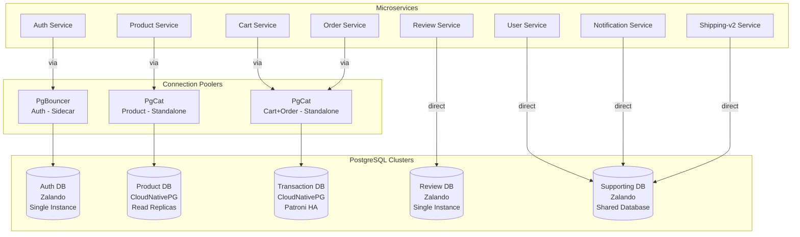
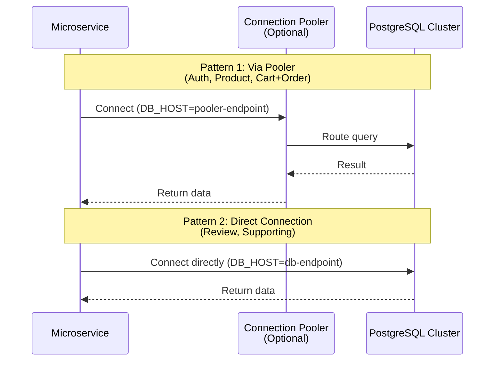

# Database Integration Guide

## Quick Summary

**What is Database Integration?**
PostgreSQL database integration enables microservices to persist data, execute real database queries, and support realistic k6 load testing with data consistency. This implementation uses multiple PostgreSQL operators, connection poolers, and HA patterns as a comprehensive learning platform.

**Key Capabilities:**
- ✅ 5 PostgreSQL clusters with different configurations (operators, poolers, HA patterns)
- ✅ Multiple connection patterns (direct, PgBouncer sidecar, PgCat standalone)
- ✅ High availability with Patroni (all operators use Patroni internally)
- ✅ Connection pooling for performance optimization
- ✅ Separate environment variables (DB_HOST, DB_PORT, etc.) for flexible configuration
- ✅ Full monitoring integration (postgres_exporter, Prometheus, Grafana)

**Technologies:**
- **Zalando Postgres Operator**: PostgreSQL management powered by Patroni for 3 clusters (Review, Auth, Supporting)
- **CloudNativePG Operator**: Kubernetes-native PostgreSQL with Patroni for 2 clusters (Product, Cart+Order)
- **PgBouncer**: Transaction pooling for Auth service (Zalando built-in sidecar)
- **PgCat**: Modern connection pooler for Product and Cart+Order (standalone)
- **Patroni**: High availability manager (used by both Zalando and CloudNativePG operators via Kubernetes API)
- **Flyway**: Database migrations (9 migration images, Flyway 11.8.2)

**Note on Patroni:**
- Both Zalando and CloudNativePG operators use **Patroni internally** for HA and leader election
- Patroni uses **Kubernetes API** as the Distributed Configuration Store (DCS) by default
- No separate etcd cluster needed - Kubernetes API serves as the coordination layer

---

## Table of Contents

1. [Database Architecture](#database-architecture) - 5 clusters overview
2. [Connection Patterns](#connection-patterns) - Direct, PgBouncer, PgCat
3. [Environment Variables](#environment-variables) - DB_* configuration
4. [Helm Chart Configuration](#helm-chart-configuration) - Kubernetes deployment
5. [Local Development](#local-development) - .env setup and testing
6. [Troubleshooting](#troubleshooting) - Common issues and solutions
7. [Monitoring](#monitoring) - postgres_exporter and Grafana integration

---

## Database Architecture

### Overview

The system uses **5 PostgreSQL clusters** distributed across different operators and connection patterns to demonstrate various database management approaches:



### Operator Distribution

| Cluster | Services | Operator | Pooler | HA Pattern | Learning Focus |
|---------|----------|----------|--------|------------|----------------|
| **Product** | Product | **CloudNativePG** | **PgCat** (standalone) | **Patroni HA** (2 instances) | Read scaling, PgCat routing, Patroni failover |
| **Review** | Review | **Zalando** | **None** (direct) | **Patroni** (single instance) | Simple setup, direct connection, Patroni basics |
| **Auth** | Auth | **Zalando** | **PgBouncer** (sidecar) | **Patroni** (single instance) | Transaction pooling, Zalando built-in pooler, Patroni basics |
| **Cart+Order** | Cart, Order | **CloudNativePG** | **PgCat** (standalone) | **Patroni HA** (2 instances) | **Multi-database routing, Patroni failover** |
| **Supporting** | User, Notification, Shipping-v2 | **Zalando** | **None** (direct) | **Patroni** (single instance) | **Shared database pattern, Patroni basics** |

### Zalando Operator Secret Names

Zalando Postgres Operator automatically creates secrets for each database user with the following naming convention:
`{username}.{cluster-name}.credentials.postgresql.acid.zalan.do`

| Service | Secret Name |
|---------|-------------|
| **User** | `user.supporting-db.credentials.postgresql.acid.zalan.do` |
| **Notification** | `notification.supporting-db.credentials.postgresql.acid.zalan.do` |
| **Shipping** | `shipping.supporting-db.credentials.postgresql.acid.zalan.do` |
| **Review** | `review.review-db.credentials.postgresql.acid.zalan.do` |
| **Auth** | `auth.auth-db.credentials.postgresql.acid.zalan.do` |

**Note**: These secrets contain `username` and `password` keys. Helm charts reference these secrets directly - no manual secret creation needed for Zalando-managed databases.

### Cluster Details

#### 1. Product Database (CloudNativePG + PgCat)

- **Operator**: CloudNativePG (v1.28.0) - uses Patroni internally
- **Instances**: 2 (1 primary + 1 replica)
- **HA**: Patroni via Kubernetes API (automatic failover)
- **Pooler**: PgCat standalone v1.2.0 (`ghcr.io/postgresml/pgcat:v1.2.0`)
- **Namespace**: `product`
- **CRD**: `k8s/postgres-operator-cloudnativepg/crds/product-db.yaml`
- **Pooler Config**: `k8s/pgcat/product/configmap.yaml`
- **Pooler Deployment**: `k8s/pgcat/product/deployment.yaml`

**Features:**
- Patroni HA with automatic failover (< 30 seconds)
- Read replica load balancing via PgCat (primary configured, replicas can be added)
- Async replication (no sync constraints)
- Pool size: 50 connections
- CloudNativePG services: `product-db-rw` (read-write), `product-db-r` (read-only)

#### 2. Review Database (Zalando + Direct)

- **Operator**: Zalando Postgres Operator (v1.15.0) - powered by Patroni
- **Instances**: 1 (single instance, no HA)
- **HA**: Patroni via Kubernetes API (single instance, no failover needed)
- **Pooler**: None (direct connection)
- **Namespace**: `review`
- **CRD**: `k8s/postgres-operator-zalando/crds/review-db.yaml`

**Features:**
- Patroni-based management (even for single instance)
- Simple setup for low-traffic service
- Direct PostgreSQL connection (no pooler overhead)
- PostgreSQL 15

#### 3. Auth Database (Zalando + PgBouncer)

- **Operator**: Zalando Postgres Operator (v1.15.0) - powered by Patroni
- **Instances**: 1 (single instance, no HA)
- **HA**: Patroni via Kubernetes API (single instance, no failover needed)
- **Pooler**: PgBouncer sidecar (2 instances, transaction mode)
- **Namespace**: `auth`
- **CRD**: `k8s/postgres-operator-zalando/crds/auth-db.yaml`

**Features:**
- Patroni-based management (even for single instance)
- Built-in PgBouncer sidecar (Zalando operator feature)
- Transaction pooling for short-lived connections
- Pool size: 25 connections
- Service endpoint: `auth-db-pooler.auth.svc.cluster.local` (for main container via pooler)
- Direct endpoint: `auth-db.auth.svc.cluster.local` (for migrations, direct connection)

#### 4. Transaction Database (CloudNativePG + PgCat + Patroni)

- **Operator**: CloudNativePG (v1.28.0) - uses Patroni internally
- **Instances**: 2 (1 primary + 1 replica)
- **HA**: Patroni via Kubernetes API (automatic failover)
- **Pooler**: PgCat standalone v1.2.0 (`ghcr.io/postgresml/pgcat:v1.2.0`)
- **Namespace**: `cart`
- **CRD**: `k8s/postgres-operator-cloudnativepg/crds/transaction-db.yaml`
- **Pooler Config**: `k8s/pgcat/transaction/configmap.yaml`
- **Pooler Deployment**: `k8s/pgcat/transaction/deployment.yaml`

**Features:**
- Patroni HA with automatic failover (< 30 seconds)
- Multi-database routing (cart + order databases on same cluster)
- Leader election via Kubernetes API (no separate etcd needed)
- Pool size: 30 connections per database
- CloudNativePG service: `transaction-db-rw.cart.svc.cluster.local` (read-write)

**Note on Patroni:**
- CloudNativePG uses Patroni internally for HA management
- Patroni uses Kubernetes API as Distributed Configuration Store (DCS)
- No separate etcd cluster required - Kubernetes serves as coordination layer
- For learning purposes, CRD includes commented examples of etcd integration (not implemented)

#### 5. Supporting Database (Zalando + Direct + Shared)

- **Operator**: Zalando Postgres Operator (v1.15.0) - powered by Patroni
- **Instances**: 1 (single instance, no HA)
- **HA**: Patroni via Kubernetes API (single instance, no failover needed)
- **Pooler**: None (direct connection)
- **Namespace**: `user`
- **CRD**: `k8s/postgres-operator-zalando/crds/supporting-db.yaml`

**Features:**
- Patroni-based management (even for single instance)
- Shared database pattern (3 databases: user, notification, shipping)
- Direct connection for low-traffic services
- PostgreSQL 15

---

## Connection Patterns

### Connection Flow



### Pattern 1: Direct Connection (Review, Supporting)

**When to use**: Low-traffic services, simple setup, no connection pooling needed.

**Configuration**:
```yaml
# Helm values (charts/values/review.yaml)
env:
  - name: DB_HOST
    value: "review-db.review.svc.cluster.local"  # review-db is in review namespace
  - name: DB_PORT
    value: "5432"
  - name: DB_NAME
    value: "review"
  - name: DB_USER
    value: "review"
  - name: DB_PASSWORD
    valueFrom:
      secretKeyRef:
        name: review.review-db.credentials.postgresql.acid.zalan.do
        key: password
```

**Go Code** (`services/internal/review/core/database.go`):
```go
// Direct connection - no pooler
cfg := &DatabaseConfig{
    Host:     getEnv("DB_HOST", ""),  // review-db.review.svc.cluster.local
    Port:     getEnv("DB_PORT", "5432"),
    Name:     getEnv("DB_NAME", ""),  // review
    User:     getEnv("DB_USER", ""),  // review
    Password: getEnv("DB_PASSWORD", ""),
}
```

### Pattern 2: PgBouncer Sidecar (Auth)

**When to use**: High connection churn, transaction pooling needed, Zalando operator built-in.

**Configuration**:
```yaml
# Helm values (charts/values/auth.yaml)
env:
  - name: DB_HOST
    value: "auth-db-pooler.auth.svc.cluster.local"  # PgBouncer endpoint - auth-db is in auth namespace
  - name: DB_PORT
    value: "5432"
  - name: DB_NAME
    value: "auth"
  - name: DB_USER
    value: "auth"
  - name: DB_PASSWORD
    valueFrom:
      secretKeyRef:
        name: auth.auth-db.credentials.postgresql.acid.zalan.do
        key: password
  - name: DB_POOL_MODE
    value: "transaction"  # PgBouncer transaction pooling
```

**CRD Configuration** (`k8s/postgres-operator-zalando/crds/auth-db.yaml`):
```yaml
connectionPooler:
  numberOfInstances: 2
  schema: pooler
  user: pooler
  mode: transaction  # Transaction pooling
```

**Go Code**: Same as direct connection (service doesn't know about pooler).

### Pattern 3: PgCat Standalone (Product, Cart+Order)

**When to use**: Read replica routing, multi-database routing, advanced load balancing.

**Configuration**:
```yaml
# Helm values (charts/values/product.yaml)
env:
  - name: DB_HOST
    value: "pgcat-product.product.svc.cluster.local"  # PgCat service
  - name: DB_PORT
    value: "5432"
  - name: DB_NAME
    value: "product"
  - name: DB_USER
    value: "product"
  - name: DB_PASSWORD
    valueFrom:
      secretKeyRef:
        name: product-db-secret
        key: password
```

**PgCat Configuration** (`k8s/pgcat/product/configmap.yaml`):
```toml
# PgCat Configuration for Product Database
[general]
host = "0.0.0.0"
port = 5432
pool_mode = "transaction"
log_level = "info"
admin_username = "admin"
admin_password = "admin"

[admin]
host = "0.0.0.0"
port = 9930

# Product database pool
[pools.product]
pool_size = 50

[pools.product.users]
product = { username = "product", password = "postgres", pool_size = 50 }

# Primary shard (numbered starting at 0)
[pools.product.shards.0]
database = "product"

[[pools.product.shards.0.servers]]
host = "product-db-rw.product.svc.cluster.local"
port = 5432
user = "product"
password = "postgres"
role = "primary"
```

**Notes**:
- **Image**: `ghcr.io/postgresml/pgcat:v1.2.0` (fixed version, not `latest`)
- **CloudNativePG Services**: CloudNativePG automatically creates services:
  - `{cluster-name}-rw` (read-write endpoint) → `product-db-rw.product.svc.cluster.local`
  - `{cluster-name}-r` (read-only endpoint) → `product-db-r.product.svc.cluster.local` (for future replica routing)
- **Deployment**: `k8s/pgcat/product/deployment.yaml` with 2 replicas
- Currently configured with primary server only; replicas can be added later for read balancing

**Transaction Database PgCat Configuration** (`k8s/pgcat/transaction/configmap.yaml`):
```toml
# PgCat Configuration for Transaction Databases (Cart + Order)
[general]
host = "0.0.0.0"
port = 5432
pool_mode = "transaction"
log_level = "info"
admin_username = "admin"
admin_password = "admin"

[admin]
host = "0.0.0.0"
port = 9930

# Cart database pool
[pools.cart]
pool_size = 30

[pools.cart.users]
cart = { username = "cart", password = "postgres", pool_size = 30 }

[pools.cart.shards.0]
database = "cart"

[[pools.cart.shards.0.servers]]
host = "transaction-db-rw.cart.svc.cluster.local"
port = 5432
user = "cart"
password = "postgres"
role = "primary"

# Order database pool (same server, different database)
[pools.order]
pool_size = 30

[pools.order.users]
cart = { username = "cart", password = "postgres", pool_size = 30 }

[pools.order.shards.0]
database = "order"

[[pools.order.shards.0.servers]]
host = "transaction-db-rw.cart.svc.cluster.local"
port = 5432
user = "cart"
password = "postgres"
role = "primary"
```

**Go Code**: Same as direct connection (PgCat transparent).

---

## Environment Variables

### Database Configuration Variables

All database connections use **separate environment variables** (NOT a single `DATABASE_URL` string) for flexibility and debugging.

| Variable | Type | Default | Description | Required |
|----------|------|---------|-------------|----------|
| `DB_HOST` | string | - | Database host (pooler or direct endpoint) | ✅ Yes |
| `DB_PORT` | string | `"5432"` | Database port | ❌ No |
| `DB_NAME` | string | - | Database name | ✅ Yes |
| `DB_USER` | string | - | Database user | ✅ Yes |
| `DB_PASSWORD` | string | - | Database password (from Secret) | ✅ Yes |
| `DB_SSLMODE` | string | `"disable"` | SSL mode (disable for Kind cluster) | ❌ No |
| `DB_POOL_MAX_CONNECTIONS` | int | `25` | Max connections in pool | ❌ No |
| `DB_POOL_MODE` | string | `"transaction"` | Pool mode (for PgBouncer) | ❌ No |

### Per-Service Configuration Examples

#### Auth Service (PgBouncer)
```bash
DB_HOST=auth-db-pooler.auth.svc.cluster.local
DB_PORT=5432
DB_NAME=auth
DB_USER=auth
DB_PASSWORD=<from-secret>
DB_SSLMODE=disable
DB_POOL_MAX_CONNECTIONS=25
DB_POOL_MODE=transaction
```

#### Product Service (PgCat)
```bash
DB_HOST=pgcat-product.product.svc.cluster.local
DB_PORT=5432
DB_NAME=product
DB_USER=product
DB_PASSWORD=<from-secret>
DB_SSLMODE=disable
DB_POOL_MAX_CONNECTIONS=50
```

#### Review Service (Direct)
```bash
DB_HOST=review-db.review.svc.cluster.local
DB_PORT=5432
DB_NAME=review
DB_USER=review
DB_PASSWORD=<from-secret>
DB_SSLMODE=disable
DB_POOL_MAX_CONNECTIONS=25
```

### Configuration Validation

Database configuration is validated on service startup. Missing required variables cause the service to fail with a clear error:

```go
// services/internal/{service}/core/database.go
func LoadConfig() (*DatabaseConfig, error) {
    cfg := &DatabaseConfig{
        Host:     getEnv("DB_HOST", ""),
        Port:     getEnv("DB_PORT", "5432"),
        Name:     getEnv("DB_NAME", ""),
        User:     getEnv("DB_USER", ""),
        Password: getEnv("DB_PASSWORD", ""),
        SSLMode:  getEnv("DB_SSLMODE", "disable"),
    }

    // Validate required fields
    if cfg.Host == "" {
        return nil, fmt.Errorf("DB_HOST environment variable is required")
    }
    if cfg.Name == "" {
        return nil, fmt.Errorf("DB_NAME environment variable is required")
    }
    // ... more validation
}
```

---

## Helm Chart Configuration

### Database Environment Variables in Helm

Database configuration is included in the `env` section along with other environment variables.

**Pattern**:
```yaml
# charts/values/{service}.yaml
env:
  - name: DB_HOST
    value: "<pooler-or-direct-endpoint>"
  - name: DB_PORT
    value: "5432"
  - name: DB_NAME
    value: "<database-name>"
  - name: DB_USER
    value: "<database-user>"
  - name: DB_PASSWORD
    valueFrom:
      secretKeyRef:
        name: <service>-db-secret
        key: password
  - name: DB_SSLMODE
    value: "disable"
  - name: DB_POOL_MAX_CONNECTIONS
    value: "<pool-size>"
```

### Secret References

**Never hardcode passwords**. Always use `valueFrom.secretKeyRef`:

```yaml
# ✅ CORRECT: Use Secret reference (Zalando auto-generated secret)
- name: DB_PASSWORD
  valueFrom:
    secretKeyRef:
      name: auth.auth-db.credentials.postgresql.acid.zalan.do
      key: password

# ❌ WRONG: Hardcoded password
- name: DB_PASSWORD
  value: "postgres"  # NEVER DO THIS
```

### Service-Specific Examples

#### Auth Service (PgBouncer)
```yaml
# charts/values/auth.yaml
env:
  - name: DB_HOST
    value: "auth-db-pooler.auth.svc.cluster.local"  # auth-db is in auth namespace
  - name: DB_PORT
    value: "5432"
  - name: DB_NAME
    value: "auth"
  - name: DB_USER
    value: "auth"
  - name: DB_PASSWORD
    valueFrom:
      secretKeyRef:
        name: auth.auth-db.credentials.postgresql.acid.zalan.do
        key: password
  - name: DB_SSLMODE
    value: "disable"
  - name: DB_POOL_MAX_CONNECTIONS
    value: "25"
  - name: DB_POOL_MODE
    value: "transaction"
```

#### Product Service (PgCat)
```yaml
# charts/values/product.yaml
env:
  - name: DB_HOST
    value: "pgcat-product.product.svc.cluster.local"
  - name: DB_PORT
    value: "5432"
  - name: DB_NAME
    value: "product"
  - name: DB_USER
    value: "product"
  - name: DB_PASSWORD
    valueFrom:
      secretKeyRef:
        name: product-db-secret
        key: password
  - name: DB_SSLMODE
    value: "disable"
  - name: DB_POOL_MAX_CONNECTIONS
    value: "50"
```

#### Review Service (Direct)
```yaml
# charts/values/review.yaml
env:
  - name: DB_HOST
    value: "review-db.review.svc.cluster.local"  # review-db is in review namespace
  - name: DB_PORT
    value: "5432"
  - name: DB_NAME
    value: "review"
  - name: DB_USER
    value: "review"
  - name: DB_PASSWORD
    valueFrom:
      secretKeyRef:
        name: review.review-db.credentials.postgresql.acid.zalan.do
        key: password
  - name: DB_SSLMODE
    value: "disable"
  - name: DB_POOL_MAX_CONNECTIONS
    value: "25"
```

---

## Local Development

### .env File Setup

Create a `.env` file in `services/` directory for local development:

```bash
# services/.env
SERVICE_NAME=auth
PORT=8080
ENV=development
LOG_LEVEL=debug
LOG_FORMAT=console

# Database configuration (local PostgreSQL or port-forward)
DB_HOST=localhost
DB_PORT=5432
DB_NAME=auth
DB_USER=auth
DB_PASSWORD=postgres
DB_SSLMODE=disable
DB_POOL_MAX_CONNECTIONS=25
DB_POOL_MODE=transaction
```

### Port-Forwarding Database

To connect to a database in Kubernetes from local machine:

```bash
# Port-forward Auth database (via PgBouncer)
kubectl port-forward -n auth svc/auth-db-pooler 5432:5432

# Port-forward Product database (via PgCat)
kubectl port-forward -n product svc/pgcat-product 5432:5432

# Port-forward Transaction database (via PgCat for Cart+Order)
kubectl port-forward -n cart svc/pgcat 5432:5432

# Port-forward Review database (direct)
kubectl port-forward -n review svc/review-db 5432:5432
```

### Testing Connection

Test database connection from Go code:

```bash
cd services
go run cmd/auth/main.go
```

Expected output:
```
INFO    Database connection successful    {"host": "localhost:5432", "database": "auth"}
```

### Connection Testing Script

Test database connection manually:

```bash
# Using psql (if installed)
psql -h localhost -p 5432 -U auth -d auth

# Using kubectl exec (from within cluster)
kubectl exec -it -n auth deployment/auth -- psql -h auth-db-pooler.auth.svc.cluster.local -U auth -d auth
```

---

## Troubleshooting

### Connection Failures

#### Error: "Failed to connect to database"

**Symptoms**:
```
ERROR   Failed to connect to database    {"error": "dial tcp: lookup auth-db-pooler.auth.svc.cluster.local: no such host"}
```

**Diagnosis**:
```bash
# Check if database pod is running
kubectl get pods -n auth -l app=postgres

# Check database service
kubectl get svc -n auth auth-db-pooler

# Check DNS resolution
kubectl run -it --rm debug --image=busybox --restart=Never -- nslookup auth-db-pooler.auth.svc.cluster.local
```

**Solutions**:
1. Verify database cluster is ready: `kubectl get postgresql auth-db -n auth`
2. Check service endpoints: `kubectl get endpoints -n auth auth-db-pooler`
3. Verify namespace: Ensure service is in correct namespace

#### Error: "Database authentication failed"

**Symptoms**:
```
ERROR   Database authentication failed    {"error": "password authentication failed for user \"auth\""}
```

**Diagnosis**:
```bash
# Check Secret exists (Zalando auto-generated secret)
kubectl get secret auth.auth-db.credentials.postgresql.acid.zalan.do -n auth

# Check Secret content (base64 decoded)
kubectl get secret auth.auth-db.credentials.postgresql.acid.zalan.do -n auth -o jsonpath='{.data.password}' | base64 -d && echo ""

# Verify Secret is referenced in Helm values
helm get values auth -n auth | grep -A 5 DB_PASSWORD
```

**Solutions**:
1. Verify Secret exists: `kubectl get secret auth.auth-db.credentials.postgresql.acid.zalan.do -n auth`
2. Check Secret key name matches (`password` vs `username`)
3. **Note**: Zalando operator auto-generates secrets - no manual creation needed. If secret doesn't exist, check Zalando operator logs.

#### Error: "Connection timeout"

**Symptoms**:
```
ERROR   Failed to ping database    {"error": "context deadline exceeded"}
```

**Diagnosis**:
```bash
# Check database pod status
kubectl get pods -n auth -l app=postgres

# Check database logs
kubectl logs -n auth -l app=postgres --tail=50

# Test connectivity from pod
kubectl run -it --rm test --image=postgres:15-alpine --restart=Never -- psql -h auth-db-pooler.auth.svc.cluster.local -U auth -d auth
```

**Solutions**:
1. Verify database pod is Running: `kubectl get pods -n auth`
2. Check database logs for errors: `kubectl logs -n auth auth-db-0`
3. Verify network policies (if any): `kubectl get networkpolicies -n auth`

### Pooler Issues

#### PgBouncer: "Pool exhausted"

**Symptoms**:
```
ERROR   Database connection pool exhausted
```

**Diagnosis**:
```bash
# Check PgBouncer pool stats
kubectl exec -n auth deployment/auth-db-pooler -- psql -h localhost -U pooler -d pgbouncer -c "SHOW POOLS;"

# Check active connections
kubectl exec -n auth deployment/auth-db-pooler -- psql -h localhost -U pooler -d pgbouncer -c "SHOW CLIENTS;"
```

**Solutions**:
1. Increase pool size: Update `DB_POOL_MAX_CONNECTIONS` in Helm values
2. Check for connection leaks: Review service code for unclosed connections
3. Restart pooler: `kubectl rollout restart deployment/auth-db-pooler -n auth`

#### PgCat: "Routing error"

**Symptoms**:
```
ERROR   PgCat routing failed    {"error": "no healthy replicas available"}
```

**Diagnosis**:
```bash
# Check PgCat pod status
kubectl get pods -n product -l app=pgcat-product

# Check PgCat logs
kubectl logs -n product -l app=pgcat-product --tail=50

# Check database cluster status
kubectl get cluster product-db -n product
```

**Solutions**:
1. Verify database cluster is Ready: `kubectl get cluster product-db -n product`
2. Check PgCat configmap: `kubectl get configmap pgcat-product-config -n product -o yaml`
3. Restart PgCat: `kubectl rollout restart deployment/pgcat-product -n product`

### Flyway Migration Issues

#### Error: "No migrations found" or "Migrations not detected"

**Symptoms**:
```
WARNING: No migrations found. Are your locations set up correctly?
1 SQL migrations were detected but not run because they did not follow the filename convention.
```

**Diagnosis**:

**1. Check SQL files in migration image:**
```bash
# List SQL files in migration image (SQL files are in $FLYWAY_HOME/sql/)
docker run --rm --entrypoint /bin/sh ghcr.io/duynhne/user:v5-init -c "ls -la /opt/flyway/11.8.2/sql/ 2>/dev/null || echo 'Directory not found'; echo '---'; find /opt/flyway -name '*.sql' 2>/dev/null | head -5 || echo 'No SQL files found'"

# Check if files follow naming convention (must be V{version}__{description}.sql)
docker run --rm --entrypoint /bin/sh ghcr.io/duynhne/user:v5-init -c "ls -la /opt/flyway/11.8.2/sql/ && echo '---' && file /opt/flyway/11.8.2/sql/*.sql"

# Verify FLYWAY_LOCATIONS environment variable (should be set in Dockerfile)
docker run --rm --entrypoint /bin/sh ghcr.io/duynhne/user:v5-init -c "echo \$FLYWAY_LOCATIONS"
```

**2. Check init container logs:**
```bash
# Check for migration errors and status
kubectl logs -n user -l app=user -c init --tail=50

# View full migration output
kubectl logs -n user -l app=user -c init --tail=100
```

**3. Get database password for manual testing:**
```bash
# Zalando operator secrets (format: {username}.{cluster-name}.credentials.postgresql.acid.zalan.do)
kubectl get secret -n user user.supporting-db.credentials.postgresql.acid.zalan.do -o jsonpath='{.data.password}' | base64 -d && echo ""

# CloudNativePG secrets
kubectl get secret -n product product-db-secret -o jsonpath='{.data.password}' | base64 -d && echo ""

# Test database connection manually (Zalando operator)
PASSWORD=$(kubectl get secret -n user user.supporting-db.credentials.postgresql.acid.zalan.do -o jsonpath='{.data.password}' | base64 -d)
kubectl exec -n user supporting-db-0 -- bash -c "PGPASSWORD='$PASSWORD' psql -h 127.0.0.1 -U user -d user -c 'SELECT * FROM flyway_schema_history;'"
```

**4. Check Flyway schema history table:**
```bash
# Get password and check migration history (Zalando operator)
PASSWORD=$(kubectl get secret -n user user.supporting-db.credentials.postgresql.acid.zalan.do -o jsonpath='{.data.password}' | base64 -d)
kubectl exec -n user supporting-db-0 -- bash -c "PGPASSWORD='$PASSWORD' psql -h 127.0.0.1 -U user -d user -c 'SELECT version, description, type, installed_on, success FROM flyway_schema_history ORDER BY installed_rank;'"

# For CloudNativePG clusters (e.g., product-db)
PASSWORD=$(kubectl get secret -n product product-db-secret -o jsonpath='{.data.password}' | base64 -d)
kubectl exec -n product product-db-1 -- bash -c "PGPASSWORD='$PASSWORD' psql -h 127.0.0.1 -U product -d product -c 'SELECT version, description, type, installed_on, success FROM flyway_schema_history ORDER BY installed_rank;'"
```

**5. Verify database initialization (check tables and structure):**
```bash
# List all tables in database (Zalando operator)
PASSWORD=$(kubectl get secret -n user user.supporting-db.credentials.postgresql.acid.zalan.do -o jsonpath='{.data.password}' | base64 -d)
kubectl exec -n user supporting-db-0 -- bash -c "PGPASSWORD='$PASSWORD' psql -h 127.0.0.1 -U user -d user -c '\dt'"

# Check table structure (example: user_profiles)
kubectl exec -n user supporting-db-0 -- bash -c "PGPASSWORD='$PASSWORD' psql -h 127.0.0.1 -U user -d user -c '\d user_profiles'"

# Count tables in public schema
kubectl exec -n user supporting-db-0 -- bash -c "PGPASSWORD='$PASSWORD' psql -h 127.0.0.1 -U user -d user -c 'SELECT COUNT(*) as table_count FROM information_schema.tables WHERE table_schema = '\''public'\'' AND table_type = '\''BASE TABLE'\'';'"

# List all columns in public schema tables
kubectl exec -n user supporting-db-0 -- bash -c "PGPASSWORD='$PASSWORD' psql -h 127.0.0.1 -U user -d user -c 'SELECT table_name, column_name, data_type FROM information_schema.columns WHERE table_schema = '\''public'\'' ORDER BY table_name, ordinal_position;'"

# For CloudNativePG clusters (e.g., product-db)
PASSWORD=$(kubectl get secret -n product product-db-secret -o jsonpath='{.data.password}' | base64 -d)
kubectl exec -n product product-db-1 -- bash -c "PGPASSWORD='$PASSWORD' psql -h 127.0.0.1 -U product -d product -c '\dt'"
```

**Solutions**:
1. **Verify SQL file naming**: Files must follow `V{version}__{description}.sql` format (e.g., `V1__init_schema.sql`)
   - ✅ Correct: `V1__init_schema.sql`, `V2__add_index.sql`
   - ❌ Wrong: `001__init_schema.sql`, `v1__init_schema.sql`, `V1_init_schema.sql`
2. **Verify SQL files are in image**: Migration images are built automatically by GitHub Actions on push
   - Images are available at `ghcr.io/duynhne/<service>:v5-init`
   - To rebuild locally for testing (not needed for deployment):
     ```bash
     cd services/migrations/user
     docker build -t ghcr.io/duynhne/user:v5-init .
     ```
   - For deployment, push code to trigger GitHub Actions build workflow
3. **Check FLYWAY_LOCATIONS**: Verify environment variable is set correctly (should be `filesystem:/opt/flyway/11.8.2/sql`)
   ```bash
   # Check FLYWAY_LOCATIONS in init container
   kubectl exec -n user -l app=user -c init -- env | grep FLYWAY
   
   # Expected output: FLYWAY_LOCATIONS=filesystem:/opt/flyway/11.8.2/sql
   # Note: This is set in Dockerfile at build-time, not in Helm template
   ```
4. **Verify SQL files location**: Check if SQL files exist in expected location
   ```bash
   # List SQL files in init container
   kubectl exec -n user -l app=user -c init -- ls -la /opt/flyway/11.8.2/sql/
   
   # Verify WORKDIR (should be /opt/flyway/11.8.2)
   kubectl exec -n user -l app=user -c init -- pwd
   ```

#### Error: "Multiple pods running migrations simultaneously"

**Symptoms**:
```
ERROR: Migration failed - another migration is in progress
```

**Diagnosis**:
```bash
# Check how many pods are running init containers
kubectl get pods -n user -l app=user -o jsonpath='{range .items[*]}{.metadata.name}{"\t"}{.status.initContainerStatuses[*].state}{"\n"}{end}'

# Check Flyway lock table
PASSWORD=$(kubectl get secret -n user user.supporting-db.credentials.postgresql.acid.zalan.do -o jsonpath='{.data.password}' | base64 -d)
kubectl exec -n user supporting-db-0 -- bash -c "PGPASSWORD='$PASSWORD' psql -h localhost -U user -d user -c 'SELECT * FROM flyway_schema_history WHERE type='\''MIGRATION'\'' ORDER BY installed_rank DESC LIMIT 5;'"
```

**Solutions**:
1. **Flyway handles concurrency**: Uses database locks, only one pod can migrate at a time
2. **Other pods wait**: If one pod is migrating, others wait for completion
3. **This is expected behavior**: No action needed, Flyway manages it automatically

#### PgCat: TOML Configuration Errors

**Symptoms**:
```
TOML parse error at line X, column Y: missing field 'general'
TOML parse error: missing field 'shards'
TOML parse error: Shard 'primary' is not a valid number, shards must be numbered starting at 0
TOML parse error: missing field 'users'
TOML parse error: invalid inline table expected '}'
```

**Common Issues**:

1. **Missing `[general]` section**: PgCat v1.2.0 requires `[general]` section with `admin_username` and `admin_password`
2. **Incorrect shard format**: Shards must be numbered starting at 0: `[pools.<name>.shards.0]` not `[pools.<name>.shards.primary]`
3. **Incorrect servers format**: Servers must be array of tables: `[[pools.<name>.shards.0.servers]]` with `host`, `port`, `user`, `password`, `role` fields
4. **Missing users section**: Each pool needs `[pools.<name>.users]` with inline table format: `username = { username = "...", password = "...", pool_size = ... }`
5. **Wrong service names**: CloudNativePG uses `{cluster-name}-rw` format, not `{cluster-name}-primary`

**Diagnosis**:
```bash
# Check PgCat pod logs for TOML errors
kubectl logs -n product -l app=pgcat-product --tail=50

# Validate configmap format
kubectl get configmap pgcat-product-config -n product -o yaml | grep -A 50 pgcat.toml

# Check for ImagePullBackOff (wrong image)
kubectl get pods -n product -l app=pgcat-product
```

**Solutions**:
1. Verify TOML format matches PgCat v1.2.0 requirements (see config examples in "Pattern 3: PgCat Standalone" section)
2. Check shard numbering (must start at 0): `[pools.<name>.shards.0]` not `[pools.<name>.shards.primary]`
3. Ensure all required sections are present:
   - `[general]` with `admin_username` and `admin_password`
   - `[admin]` with `host` and `port`
   - `[pools.<name>]` with `pool_size`
   - `[pools.<name>.users]` with inline table format
   - `[pools.<name>.shards.0]` with `database`
   - `[[pools.<name>.shards.0.servers]]` array with `host`, `port`, `user`, `password`, `role`
4. Validate service names match CloudNativePG format: `{cluster-name}-rw.{namespace}.svc.cluster.local`
5. Verify image is correct: `ghcr.io/postgresml/pgcat:v1.2.0` (not `postgresml/pgcat:latest`)

#### PgCat: Image Pull Errors

**Symptoms**:
```
Error: ImagePullBackOff
Failed to pull image "postgresml/pgcat:latest": pull access denied
```

**Diagnosis**:
```bash
# Check pod status
kubectl get pods -n product -l app=pgcat-product

# Check image in deployment
kubectl get deployment pgcat-product -n product -o jsonpath='{.spec.template.spec.containers[0].image}'
```

**Solutions**:
1. Verify image is `ghcr.io/postgresml/pgcat:v1.2.0` (not `postgresml/pgcat:latest`)
2. Update deployment: `kubectl set image deployment/pgcat-product pgcat=ghcr.io/postgresml/pgcat:v1.2.0 -n product`
3. Check image exists: `docker pull ghcr.io/postgresml/pgcat:v1.2.0`

### HA Failover Scenarios

#### Patroni: Failover not working

**Symptoms**:
- Primary database fails, but no failover occurs
- Services cannot connect after primary failure
- Cluster status shows unhealthy state

**Diagnosis**:
```bash
# Check cluster status (CloudNativePG)
kubectl get cluster transaction-db -n cart -o yaml | grep -A 10 status

# Check cluster status (Zalando)
kubectl get postgresql auth-db -n auth -o yaml | grep -A 10 status

# Check Patroni logs (CloudNativePG - Patroni runs in main container)
kubectl logs -n cart transaction-db-1 --tail=50

# Check Patroni logs (Zalando - Patroni runs in Spilo image)
kubectl logs -n auth auth-db-0 --tail=50

# Check Kubernetes API connectivity (Patroni uses K8s API as DCS)
kubectl get nodes
kubectl get pods -n cart
```

**Solutions**:
1. **Verify Patroni is running**: Both operators use Patroni internally
   - CloudNativePG: Patroni runs in PostgreSQL container
   - Zalando: Patroni runs in Spilo container (part of Zalando operator)
2. **Check Kubernetes API connectivity**: Patroni uses K8s API as Distributed Configuration Store
   - Verify cluster connectivity: `kubectl cluster-info`
   - Check operator can access K8s API: `kubectl get pods -n database`
3. **Verify cluster configuration**: 
   - CloudNativePG: Check `k8s/postgres-operator-cloudnativepg/crds/transaction-db.yaml`
   - Zalando: Check `k8s/postgres-operator-zalando/crds/auth-db.yaml`
4. **Review operator logs**:
   - CloudNativePG: `kubectl logs -n database -l app.kubernetes.io/name=cloudnative-pg`
   - Zalando: `kubectl logs -n database -l app.kubernetes.io/name=postgres-operator`
5. **Check for resource constraints**: Insufficient CPU/memory can prevent failover
   - `kubectl describe pod transaction-db-1 -n cart`
   - `kubectl top pod transaction-db-1 -n cart`

**Note**: Patroni uses Kubernetes API (not etcd) for leader election. No separate etcd cluster is needed.

#### Replication Lag

**Symptoms**:
- Read queries return stale data
- Replication lag metrics show high values

**Diagnosis**:
```bash
# Check replication lag (from primary)
kubectl exec -n product product-db-1 -- psql -U product -d product -c "SELECT * FROM pg_stat_replication;"

# Check replica status
kubectl get cluster product-db -n product -o jsonpath='{.status.conditions}'
```

**Solutions**:
1. Check network connectivity between primary and replica
2. Verify WAL shipping is working: Check PostgreSQL logs
3. Consider sync replication for critical data (with performance trade-off)

---

## Database Verification

### Quick Verification Script

Run the automated verification script:

```bash
./scripts/04a-verify-databases.sh
```

This script checks:
- ✅ Cluster status (Ready condition)
- ✅ Database pods are running
- ✅ Databases exist and are accessible
- ✅ Connection testing
- ✅ PgCat poolers status

### Manual Verification Commands

#### 1. Check Cluster Status

**Zalando Clusters:**
```bash
# List all Zalando clusters
kubectl get postgresql -A

# Check specific cluster pod
kubectl get pod review-db-0 -n review
kubectl get pod auth-db-0 -n auth
kubectl get pod supporting-db-0 -n user
```

**CloudNativePG Clusters:**
```bash
# List all CloudNativePG clusters
kubectl get cluster -A

# Check cluster details
kubectl get cluster product-db -n product -o yaml
kubectl get cluster transaction-db -n cart -o yaml

# Check cluster pods
kubectl get pods -n product -l cnpg.io/cluster=product-db
kubectl get pods -n cart -l cnpg.io/cluster=transaction-db
```

#### 2. Verify Databases Exist

**Zalando Clusters:**
```bash
# Review database
kubectl exec -n review review-db-0 -- psql -U review -d postgres -c "\l" | grep review

# Auth database
kubectl exec -n auth auth-db-0 -- psql -U auth -d postgres -c "\l" | grep auth

# Supporting database (multiple databases)
kubectl exec -n user supporting-db-0 -- psql -U user -d postgres -c "\l" | grep -E "user|notification|shipping"
```

**CloudNativePG Clusters:**
```bash
# Product database
kubectl exec -n product product-db-1 -- psql -U product -d postgres -c "\l" | grep product

# Transaction database (cart + order)
kubectl exec -n cart transaction-db-1 -- psql -U cart -d postgres -c "\l" | grep -E "cart|order"
```

#### 3. Test Database Connections

**Direct Connection Test:**
```bash
# Test Review database
kubectl run -it --rm test-review --image=postgres:15-alpine --restart=Never -- \
  psql -h review-db.review.svc.cluster.local -U review -d review -c "SELECT 1;"

# Test Auth database (via PgBouncer)
kubectl run -it --rm test-auth --image=postgres:15-alpine --restart=Never -- \
  psql -h auth-db-pooler.auth.svc.cluster.local -U auth -d auth -c "SELECT 1;"

# Test Product database (via PgCat)
kubectl run -it --rm test-product --image=postgres:15-alpine --restart=Never -- \
  psql -h pgcat.product.svc.cluster.local -U product -d product -c "SELECT 1;"

# Test Cart database (via PgCat)
kubectl run -it --rm test-cart --image=postgres:15-alpine --restart=Never -- \
  psql -h pgcat-transaction.cart.svc.cluster.local -U cart -d cart -c "SELECT 1;"

# Test Order database (via PgCat) - IMPORTANT: Verify order database exists
kubectl run -it --rm test-order --image=postgres:15-alpine --restart=Never -- \
  psql -h pgcat-transaction.cart.svc.cluster.local -U cart -d order -c "SELECT 1;"
```

#### 4. Check Order Database (Critical)

**Verify order database exists:**
```bash
# Check if order database was created
kubectl exec -n cart transaction-db-1 -- psql -U cart -d postgres -c "\l" | grep order

# Expected output:
# order | cart | UTF8 | C | C |
```

**If order database doesn't exist:**
```bash
# Check transaction-db cluster status
kubectl get cluster transaction-db -n cart

# Check cluster events for errors
kubectl describe cluster transaction-db -n cart

# Check primary pod logs
kubectl logs -n cart transaction-db-1 --tail=50

# Verify postInitSQL was executed
kubectl get cluster transaction-db -n cart -o yaml | grep -A 5 postInitSQL
```

#### 5. Verify PgCat Poolers

**Check PgCat Pods:**
```bash
# Product PgCat
kubectl get pods -n product -l app=pgcat-product
kubectl logs -n product -l app=pgcat-product --tail=50 | grep -i error

# Transaction PgCat
kubectl get pods -n cart -l app=pgcat-transaction
kubectl logs -n cart -l app=pgcat-transaction --tail=50 | grep -i error
```

**Check PgCat Pool Status (via admin port):**
```bash
# Get PgCat pod name
PGCAT_POD=$(kubectl get pods -n cart -l app=pgcat-transaction -o jsonpath='{.items[0].metadata.name}')

# Check pool status
kubectl exec -n cart $PGCAT_POD -- \
  psql -h localhost -p 9930 -U admin -d pgcat -c "SHOW POOLS;"
```

**Expected PgCat Logs (no errors):**
```
INFO  ThreadId(XX) pgcat::pool: Pool 'cart' validated successfully
INFO  ThreadId(XX) pgcat::pool: Pool 'order' validated successfully
```

**If PgCat shows errors:**
```
ERROR ThreadId(XX) pgcat::pool: Shard 0 down or misconfigured: TimedOut
ERROR ThreadId(XX) pgcat::pool: Could not validate connection pool
```
→ This means database doesn't exist or connection failed. Check database first.

#### 6. Verify Secrets

**Check all database secrets exist:**
```bash
# CloudNativePG secrets
kubectl get secret product-db-secret -n product
kubectl get secret transaction-db-secret -n cart

# Zalando secrets (auto-generated)
kubectl get secret review.review-db.credentials.postgresql.acid.zalan.do -n review
kubectl get secret auth.auth-db.credentials.postgresql.acid.zalan.do -n auth
kubectl get secret user.supporting-db.credentials.postgresql.acid.zalan.do -n user
```

**Verify secret contents:**
```bash
# Check transaction-db-secret (should have cart user)
kubectl get secret transaction-db-secret -n cart -o jsonpath='{.data}' | jq
```

#### 7. Quick Health Check Commands

**All-in-one status check:**
```bash
# Operators
kubectl get pods -n database

# Zalando clusters
kubectl get postgresql -A

# CloudNativePG clusters
kubectl get cluster -A

# PgCat poolers
kubectl get pods -n product -l app=pgcat-product
kubectl get pods -n cart -l app=pgcat-transaction

# Check order database (critical)
kubectl exec -n cart transaction-db-1 -- psql -U cart -d postgres -c "\l" | grep order
```

### Verification Checklist

After deploying databases, verify:

- [ ] All 5 clusters are Ready
- [ ] All database pods are Running
- [ ] Order database exists in transaction-db cluster
- [ ] All databases are accessible (connection test succeeds)
- [ ] PgCat poolers are running and have no errors
- [ ] PgCat can validate all pools (no timeout errors)
- [ ] Secrets exist for all clusters
- [ ] Services can connect via poolers (when deployed)

---

## Monitoring

### postgres_exporter Setup

PostgreSQL metrics are exposed via `postgres_exporter` for all 5 clusters.

**Deployment**:
```bash
# Deploy postgres_exporter (via Helm or manual)
helm upgrade --install postgres-exporter prometheus-community/prometheus-postgres-exporter \
  -f k8s/postgres-exporter/values.yaml \
  -n monitoring
```

**Configuration** (`k8s/postgres-exporter/values.yaml`):
```yaml
config:
  datasource:
    host: auth-db.auth.svc.cluster.local
    port: "5432"
    database: auth
    user: postgres
    password: <from-secret>
```

### ServiceMonitor Configuration

Prometheus auto-discovers postgres_exporter instances via ServiceMonitor:

```yaml
# k8s/prometheus/servicemonitor-postgres.yaml
apiVersion: monitoring.coreos.com/v1
kind: ServiceMonitor
metadata:
  name: postgres-exporter
  namespace: monitoring
spec:
  selector:
    matchLabels:
      app: postgres-exporter
  endpoints:
    - port: http
      path: /metrics
```

### Grafana Dashboards

PostgreSQL metrics are available in Grafana:

**Key Metrics**:
- `pg_stat_database_*` - Database statistics
- `pg_stat_activity_*` - Active connections
- `pg_replication_*` - Replication lag
- `pg_up` - Database availability

**Query Examples**:
```promql
# Active connections per database
pg_stat_database_numbackends{datname=~"$database"}

# Replication lag (for HA clusters)
pg_replication_lag{instance=~"$instance"}

# Database size
pg_database_size_bytes{datname=~"$database"}
```

### Monitoring Checklist

- [ ] postgres_exporter deployed for all 5 clusters
- [ ] ServiceMonitor created for each exporter
- [ ] Metrics visible in Prometheus (`/metrics` endpoint)
- [ ] Grafana dashboards configured
- [ ] Alerts configured for critical metrics (connection count, replication lag)

---

## Best Practices

### Connection Management

1. **Always use connection pooling** for production workloads
2. **Set appropriate pool sizes** based on service load
3. **Monitor connection pool usage** via metrics
4. **Close connections properly** in Go code (use `defer db.Close()`)

### Configuration

1. **Never hardcode credentials** - Always use Kubernetes Secrets
2. **Use separate env vars** - Don't use `DATABASE_URL` string
3. **Validate configuration** - Fail fast on startup if misconfigured
4. **Document endpoints** - Keep Helm values documented

### High Availability

1. **Test failover scenarios** - Verify automatic failover works
2. **Monitor replication lag** - Set up alerts for high lag
3. **Plan for failover** - Document failover procedures
4. **Use sync replication** for critical data (with performance trade-off)

### Security

1. **Rotate passwords regularly** - Update Secrets periodically
2. **Use SSL in production** - Set `DB_SSLMODE=require` (not `disable`)
3. **Limit database access** - Use least privilege principle
4. **Audit database access** - Enable PostgreSQL logging

---

## Related Documentation

- **[Configuration Guide](./CONFIGURATION.md)** - Complete configuration management
- **[Error Handling](./ERROR_HANDLING.md)** - Database error handling patterns
- **[Setup Guide](./SETUP.md)** - Database deployment steps
- **[API Reference](./API_REFERENCE.md)** - API endpoints using database

---

**Created:** December 20, 2025  
**Last Updated:** December 20, 2025  
**Status:** Production  
**Related Spec:** [`specs/active/postgres-database-integration/spec.md`](../../specs/active/postgres-database-integration/spec.md)

