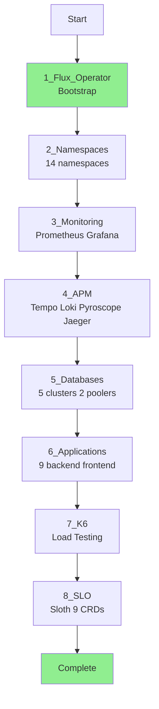
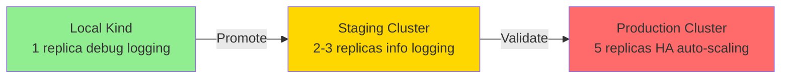

# Setup Guide - GitOps with Flux Operator

Complete guide to deploy microservices platform using **GitOps**, **Flux Operator**, and **Kustomize** on Kind (Kubernetes in Docker).

---

## Quick Start (5 Minutes)

### Prerequisites Check

```bash
make prereqs
```

### Three-Command Deployment

```bash
# 1. Create Kind cluster + OCI registry
./scripts/kind-up.sh

# 2. Bootstrap Flux Operator
./scripts/flux-up.sh  # or: make flux-up

# 3. Deploy all infrastructure and applications
./scripts/flux-push.sh  # or: make flux-push
```

Wait 5-10 minutes for reconciliation. Then access:

```
Flux Web UI:  http://localhost:9080 (make flux-ui)
Grafana:      http://localhost:3000 (./scripts/08-setup-access.sh)
Prometheus:   http://localhost:9090
Frontend:     http://localhost:3000
```

**Done!** Skip to [Accessing Services](#accessing-services) section.

---

## What is GitOps?

**GitOps** is a modern operational framework that applies DevOps best practices (version control, collaboration, CI/CD) to infrastructure automation.

### Traditional vs GitOps Deployment

**Traditional Script-Based (Old Method):**
- Manual execution of scripts (`./scripts/01-08.sh`)
- No drift detection (manual changes persist)
- No rollback mechanism
- Environment parity issues (local ≠ staging ≠ production)
- No declarative state management
- Operator installation via shell commands

**GitOps with Flux Operator (Current Method):**
- Declarative state stored in OCI registry (`localhost:5050`)
- Automatic drift detection and correction
- Built-in rollback (change OCI artifact tag)
- Multi-environment promotion path (local → staging → production)
- Kubernetes-native (CRDs, operators, reconciliation loops)
- Single source of truth for cluster state

**Result:** 
- **67-89% YAML reduction** (Kustomize base/overlay pattern)
- **Production-ready architecture** (follows ControlPlane.io best practices)
- **Career-enhancing knowledge** (Senior DevOps/SRE skills)

---

## Architecture Overview

### GitOps Flow

```mermaid
flowchart LR
    subgraph Developer
        LocalChanges[Local Changes]
    end
    
    subgraph OCIRegistry[OCI Registry localhost:5050]
        ClusterSync[flux-cluster-sync]
        InfraSync[flux-infra-sync]
        AppsSync[flux-apps-sync]
    end
    
    subgraph FluxOperator[Flux Operator flux-system]
        FluxInstance[FluxInstance CRD]
        Reconciliation[Reconciliation Loop]
    end
    
    subgraph KubernetesCluster[Kubernetes Cluster mop]
        Infrastructure[Infrastructure<br/>Monitoring APM DB]
        Applications[Applications<br/>9 backend frontend k6]
        SLOSystem[SLO Sloth Operator]
    end
    
    LocalChanges -->|make_flux_push| OCIRegistry
    OCIRegistry -->|Pull| FluxOperator
    FluxOperator -->|Deploy| Infrastructure
    Infrastructure -->|Dependencies| Applications
    Applications -->|Observe| SLOSystem
```



**How it works:**
1. Developer runs `make flux-push` to push manifests to local OCI registry
2. Flux Operator pulls manifests from OCI registry every 10 minutes (or on-demand)
3. Flux reconciles desired state (OCI artifacts) with actual state (cluster)
4. Infrastructure components deploy first (monitoring, APM, databases)
5. Applications deploy after infrastructure (dependency management)
6. SLO system observes everything (Sloth Operator)

### Deployment Order



**Why this order matters:**
- **Flux first:** GitOps engine must exist before anything else
- **Monitoring → APM → Databases:** Infrastructure before applications
- **Applications after infrastructure:** Services need databases and observability
- **K6 after apps:** Load testing requires running services
- **SLO last:** Observes everything after deployment

---

## Project Structure

### Directory Layout

```
monitoring/
├── kubernetes/
│   ├── base/                          # Base manifests (environment-agnostic)
│   │   ├── apps/                      # 11 HelmReleases (9 backend + frontend + k6)
│   │   └── infrastructure/            # Infrastructure components
│   │       ├── monitoring/            # Prometheus, Grafana, Metrics Server
│   │       ├── apm/                   # Tempo, Pyroscope, Loki, Jaeger
│   │       ├── databases/             # 2 operators, 5 clusters, 2 poolers
│   │       └── slo/                   # Sloth Operator + 9 PrometheusServiceLevel CRDs
│   │
│   ├── overlays/                      # Environment-specific overlays
│   │   ├── local/                     # Local Kind cluster (ACTIVE)
│   │   │   ├── apps/patches/          # Local app patches (reduced resources)
│   │   │   └── infrastructure/
│   │   ├── staging/                   # Staging environment (TODO)
│   │   └── production/                # Production environment (TODO)
│   │
│   └── clusters/                      # Flux cluster configurations
│       ├── local/                     # Local Kind cluster (ACTIVE)
│       │   ├── flux-system/           # FluxInstance CRD
│       │   ├── sources/               # OCI & Helm repositories
│       │   ├── infrastructure.yaml    # Infrastructure Kustomization
│       │   ├── monitoring.yaml        # Monitoring Kustomization
│       │   ├── apm.yaml               # APM Kustomization
│       │   ├── databases.yaml         # Database Kustomization
│       │   ├── slo.yaml               # SLO Kustomization
│       │   └── apps.yaml              # Apps Kustomization
│       ├── staging/                   # Staging cluster config (TODO)
│       └── production/                # Production cluster config (TODO)
│
├── Makefile                           # GitOps automation
├── charts/mop/                        # Helm chart for all services
└── scripts/                           # Cluster creation & troubleshooting
```

**Key concepts:**
- **Base:** Shared manifests used across all environments
- **Overlays:** Environment-specific patches (local/staging/production)
- **Clusters:** Flux configuration per environment

**YAML Reduction:** 67-89% less duplication using Kustomize base/overlay pattern.

---

## Technology Stack & Benefits

### Core Technologies

| Technology | Purpose | Benefits |
|------------|---------|----------|
| **Flux Operator** | GitOps engine | Declarative Flux CD installation, ResourceSet CRDs, dependency management |
| **Kustomize** | Configuration management | 67-89% YAML reduction, strategic merge patches, clear env separation |
| **OCI Registry** | Manifest storage | Version control for manifests, simpler than Git, localhost:5050 |
| **Helm Charts** | Package management | Single chart reused for 9 services, no Deployment/Service duplication |
| **Kind** | Local K8s | Docker-based, multi-node cluster, port mapping |

### Why Flux Operator (vs Traditional Flux CD)?

**Flux Operator advantages:**
- **Operator-heavy architecture:** Better for Kubernetes-native workflows
- **FluxInstance CRD:** Declarative Flux installation (no shell scripts)
- **ResourceSet CRDs:** Advanced templating + dependency management
- **Flux Web UI:** Built-in visualization (Dec 2025 release)
- **OCI-first:** Native OCI artifact support

**Traditional Flux CD:**
- Git repository required
- CLI-based installation (`flux bootstrap`)
- Limited templating (Kustomize or Helm, not both)
- No native Web UI

**Our choice:** Flux Operator for production-ready, operator-heavy, OCI-based GitOps.

### Why OCI Artifacts (vs Git)?

**OCI Artifacts advantages:**
- **Simpler:** No Git repository configuration
- **Versioned:** Tag-based versioning (`latest`, `v1.0.0`)
- **Faster:** No Git clone/pull overhead
- **Local-friendly:** `localhost:5050` for development

**Git repositories:**
- Requires Git server (GitHub, GitLab, Gitea)
- SSH/HTTPS authentication complexity
- Clone/pull latency

**Our choice:** OCI artifacts for local development simplicity. Git for production.

### Kustomize Base/Overlay Pattern

**Problem:** How to manage same application across 3 environments without duplicating YAML?

**Solution:** Base + Overlay pattern

- **Base** (`kubernetes/base/`): Shared manifests (HelmReleases, CRDs)
- **Overlay** (`kubernetes/overlays/local/`): Environment-specific patches

**Example: Auth Service**

Base (`kubernetes/base/apps/auth/helmrelease.yaml`):
```yaml
replicaCount: 2
env:
  - name: LOG_LEVEL
    value: "info"
```

Local Overlay (`kubernetes/overlays/local/apps/patches/helmreleases.yaml`):
```yaml
replicaCount: 1  # Override
env:
  - name: LOG_LEVEL
    value: "debug"  # Override
```

**Result:** 67-89% less duplication. Single source of truth (base). Clear environment differences (overlay).

### Multi-Environment Promotion Path



**Workflow:**
1. **Develop** in `local` overlay (Kind cluster)
2. **Promote** to `staging` overlay (update image tags, test integration)
3. **Deploy** to `production` overlay (final validation, gradual rollout)

**Benefits:** Consistent deployment across environments, clear promotion path, environment parity.

---

## Prerequisites

### Required Software

1. **Docker** - Container runtime
   ```bash
   # Verify
   docker --version
   # Expected: Docker version 20.10+
   ```

2. **kubectl** - Kubernetes CLI
   ```bash
   # Install
   curl -LO "https://dl.k8s.io/release/$(curl -L -s https://dl.k8s.io/release/stable.txt)/bin/darwin/amd64/kubectl"
   chmod +x kubectl
   sudo mv kubectl /usr/local/bin/
   
   # Verify
   kubectl version --client
   ```

3. **Kind** - Kubernetes in Docker
   ```bash
   # Install
   brew install kind
   # or
   curl -Lo ./kind https://kind.sigs.k8s.io/dl/v0.20.0/kind-darwin-amd64
   chmod +x ./kind
   sudo mv ./kind /usr/local/bin/kind
   
   # Verify
   kind --version
   ```

4. **Helm** - Kubernetes package manager (v3.14+)
   ```bash
   # Install
   curl https://raw.githubusercontent.com/helm/helm/main/scripts/get-helm-3 | bash
   
   # Verify
   helm version
   ```

5. **Flux CLI** - Flux Operator CLI
   ```bash
   # Install
   brew install fluxcd/tap/flux
   # or
   curl -s https://fluxcd.io/install.sh | sudo bash
   
   # Verify
   flux --version
   ```

### System Requirements

- **RAM**: 8GB+ recommended (Kind cluster + monitoring stack)
- **CPU**: 4+ cores recommended (parallel reconciliation)
- **Disk**: 10GB+ free space (Docker images, OCI registry)

### Check Prerequisites

```bash
make prereqs
```

**Expected output:**
```
✓ flux CLI
✓ kubectl
✓ kind
✓ docker
ℹ kustomize (using kubectl kustomize)
```

---

## Step-by-Step Deployment

### Step 1: Create Kind Cluster

```bash
./scripts/kind-up.sh
```

**What it does:**
- Starts local OCI registry (`localhost:5050`)
- Creates 4-node Kubernetes cluster (`mop`)
  - 1 control-plane node
  - 3 worker nodes
- Connects registry to Kind network
- Uses Kubernetes v1.33.7 (kindest/node:v1.33.7)

**Verify:**
```bash
kubectl cluster-info
kubectl get nodes
# Expected: 4 nodes (Ready status)

docker ps | grep mop-registry
# Expected: Registry running on 5050
```

**Technical details:**
- Cluster name: `mop` (configurable via `CLUSTER_NAME` env var)
- Registry: `localhost:5050` (Docker container)
- Pattern: Based on `flux-operator-local-dev/scripts/kind-up.sh`

---

### Step 2: Bootstrap Flux Operator

```bash
./scripts/flux-up.sh
# or: make flux-up
```

**What it does:**
1. Checks if Kind cluster is running
2. Starts local OCI registry (`localhost:5050`)
3. Installs Flux Operator via Helm:
   ```bash
   helm install flux-operator oci://ghcr.io/controlplaneio-fluxcd/charts/flux-operator \
     --namespace flux-system \
     --create-namespace \
     --wait
   ```
4. Applies FluxInstance CRD (`kubernetes/clusters/local/flux-system/instance.yaml`)
5. Waits for Flux controllers to be ready

**Verify:**
```bash
kubectl get pods -n flux-system
# Expected: flux-operator, source-controller, kustomize-controller, helm-controller, notification-controller
```

**What is FluxInstance?**
- FluxInstance CRD: Declarative way to install Flux CD
- Replaces `flux bootstrap` CLI command
- Configured via `kubernetes/clusters/local/flux-system/instance.yaml`

**Technical details:**
- Flux Operator chart: `oci://ghcr.io/controlplaneio-fluxcd/charts/flux-operator`
- FluxInstance pulls from: `oci://localhost:5050/flux-cluster-sync`
- Insecure mode for local registry (no TLS)

---

### Step 3: Deploy All Infrastructure and Applications

```bash
./scripts/flux-push.sh
# or: make flux-push
```

**What it does:**
1. Pushes 3 OCI artifacts to `localhost:5050`:
   - `flux-cluster-sync` (from `kubernetes/clusters/local/`)
   - `flux-infra-sync` (from `kubernetes/overlays/local/infrastructure/`)
   - `flux-apps-sync` (from `kubernetes/overlays/local/apps/`)

2. Flux Operator pulls artifacts and reconciles:
   - **Infrastructure** (Monitoring, APM, Databases)
   - **Applications** (9 backend + 1 frontend + 1 k6)
   - **SLO** (Sloth Operator + 9 PrometheusServiceLevel CRDs)

**Verify reconciliation:**
```bash
make flux-ls
# Expected: All Kustomizations in "Applied" status
```

**Watch reconciliation in real-time:**
```bash
flux get kustomizations --watch
```

**Deployment timeline:**
- Infrastructure: 3-5 minutes
- Applications: 2-3 minutes
- SLO: 1-2 minutes
- **Total: 5-10 minutes**

---

### Step 4: Verify Deployment

```bash
make flux-status
```

**Check specific components:**

```bash
# Flux system
kubectl get pods -n flux-system

# Infrastructure
kubectl get helmrelease -n monitoring
kubectl get helmrelease -n apm
kubectl get postgresql -A
kubectl get cluster -A

# Applications
kubectl get pods -A | grep -E "(auth|user|product|cart|order|review|notification|shipping)"
kubectl get helmrelease -A

# SLO
kubectl get prometheusservicelevel -n monitoring
kubectl get prometheusrules -n monitoring
```

**Expected:**
- **14 namespaces** created
- **7 Helm repositories** configured
- **20+ HelmReleases** reconciled
- **5 PostgreSQL clusters** running
- **9 PrometheusServiceLevel CRDs** applied

---

### Step 5: Access Services

```bash
./scripts/08-setup-access.sh
```

**What it does:**
- Sets up port-forwarding for all services
- Runs in background (detached processes)

**Access points:**

| Service | URL | Credentials |
|---------|-----|-------------|
| Grafana | http://localhost:3000 | admin/admin |
| Prometheus | http://localhost:9090 | - |
| Flux Web UI | http://localhost:9080 | - |
| Frontend | http://localhost:3000 | - |
| Tempo | http://localhost:3200 | - |
| Pyroscope | http://localhost:4040 | - |
| Loki | http://localhost:3100 | - |

**Flux Web UI:**
```bash
make flux-ui
# Opens http://localhost:9080 (port-forward)
```

**Manual port-forward:**
```bash
kubectl port-forward -n monitoring svc/grafana-service 3000:3000
kubectl port-forward -n monitoring svc/kube-prometheus-stack-prometheus 9090:9090
kubectl port-forward -n flux-system svc/flux-operator 9080:9080
```

---

## Makefile Command Reference

### Flux Operations

| Command | Purpose |
|---------|---------|
| `make flux-up` | Bootstrap Flux Operator (checks cluster, starts registry, installs Flux) |
| `make flux-install` | Install Flux Operator via Helm and apply FluxInstance |
| `make flux-push` | Push manifests to OCI registry (`localhost:5050`) |
| `make flux-sync` | Push manifests + trigger reconciliation |
| `make flux-ls` | List all Flux resources (Kustomizations, Sources) |
| `make flux-status` | Show Flux reconciliation status (pods, resources) |
| `make flux-ui` | Open Flux Web UI (port-forward to `localhost:9080`) |
| `make flux-logs` | Show Flux controller logs (last 10 minutes) |
| `make flux-down` | Delete Flux Operator (keeps cluster and registry) |

### Cluster Operations

| Command | Purpose |
|---------|---------|
| `make cluster-check` | Check if Kind cluster `mop` is running |
| `make cluster-up` | Create Kind cluster (if not exists) |

**Note:** Use `./scripts/01-create-kind-cluster.sh` for first-time cluster creation.

### Registry Operations

| Command | Purpose |
|---------|---------|
| `make registry-up` | Start local OCI registry (`localhost:5050`) |
| `make registry-down` | Stop and remove local OCI registry |
| `make registry-status` | Check OCI registry status |

### Development

| Command | Purpose |
|---------|---------|
| `make kustomize-build-infra` | Build infrastructure Kustomize overlay locally |
| `make kustomize-build-apps` | Build apps Kustomize overlay locally |
| `make validate` | Validate all Kubernetes manifests (dry-run) |

### Cleanup

| Command | Purpose |
|---------|---------|
| `make clean` | Clean Flux + registry (keeps cluster) |
| `make clean-all` | Clean everything (cluster + Flux + registry) |

**Legacy script:**
```bash
./scripts/cleanup.sh  # Complete cleanup (equivalent to make clean-all)
```

### Utilities

| Command | Purpose |
|---------|---------|
| `make prereqs` | Check prerequisites (flux, kubectl, kind, docker) |
| `make info` | Show current configuration (cluster, registry, git) |
| `make help` | Display all Makefile commands |

---

## Deployment Stack Details

### Infrastructure Components

**Phase 3: Monitoring Stack**
- **Prometheus Operator** (`kube-prometheus-stack`)
- **Grafana Operator** (dashboards, datasources)
- **Metrics Server** (kubectl top, HPA)

**Phase 4: APM Stack**
- **Tempo** (distributed tracing)
- **Pyroscope** (continuous profiling)
- **Loki** (log aggregation)
- **Jaeger** (trace visualization)

**Phase 5: Database Infrastructure**
- **Zalando Postgres Operator** (v1.15.1) - 3 clusters
  - `review-db` (Review service)
  - `auth-db` (Auth service)
  - `supporting-db` (User, Notification, Shipping-v2)
- **CloudNativePG Operator** (v1.28.0) - 2 clusters
  - `product-db` (Product service)
  - `transaction-db` (Cart, Order services)
- **Connection Poolers**
  - PgBouncer (Auth database)
  - PgCat (Product, Transaction databases)

### Application Components

**Phase 2 & 6: Applications**
- **9 Backend Services** (HelmRelease pattern):
  - `auth`, `user`, `product`, `cart`, `order`, `review`, `notification`, `shipping`, `shipping-v2`
- **1 Frontend Service** (ResourceSet pattern):
  - React + Vite SPA
- **1 K6 Load Testing** (HelmRelease pattern):
  - Multiple scenarios (baseline, peak, burst)

**Phase 7: SLO System**
- **Sloth Operator** (v0.15.0)
- **9 PrometheusServiceLevel CRDs** (one per backend service)
- Automatic Prometheus recording rules generation
- Error budget tracking

### Dependency Order

**Why infrastructure comes first:**
1. **Monitoring** → APM needs Prometheus for metrics
2. **APM** → Databases need logging/tracing infrastructure
3. **Databases** → Applications need databases to connect
4. **Applications** → K6 needs running services to test
5. **K6** → SLO needs load to measure
6. **SLO** → Observes everything after deployment

**Flux manages dependencies:**
- `dependsOn` field in Flux Kustomization CRDs
- Example: `apps.yaml` depends on `databases.yaml`

---

## Multi-Environment Guide

### Current Environments

**Local (Active):**
- Cluster: Kind `mop` (4 nodes)
- Registry: `localhost:5050`
- Resources: Reduced (1 replica, 32Mi memory, 25m CPU)
- Logging: Debug level (`LOG_LEVEL=debug`)
- Tracing: 100% sampling (`OTEL_SAMPLE_RATE=1.0`)
- SSL: Disabled (`DB_SSLMODE=require`)

**Staging (Placeholder):**
- Cluster: TBD (AWS EKS / GKE / self-hosted)
- Registry: TBD (ghcr.io / ECR / GCR)
- Resources: Moderate (2-3 replicas, 64Mi memory, 50m CPU)
- Logging: Info level (`LOG_LEVEL=info`)
- Tracing: 10% sampling (`OTEL_SAMPLE_RATE=0.1`)
- SSL: Enabled (`DB_SSLMODE=verify-full`)

**Production (Placeholder):**
- Cluster: TBD (AWS EKS / GKE / self-hosted)
- Registry: TBD (ghcr.io / ECR / GCR)
- Resources: High (5+ replicas, 128Mi memory, 100m CPU)
- Logging: Warn level (`LOG_LEVEL=warn`)
- Tracing: 1% sampling (`OTEL_SAMPLE_RATE=0.01`)
- SSL: Required (`DB_SSLMODE=verify-full`)
- Auto-scaling: HPA enabled
- Network policies: Enforced

### Promotion Workflow

1. **Develop in Local:**
   ```bash
   # Make changes to kubernetes/overlays/local/
   make flux-push
   make flux-sync
   ```

2. **Promote to Staging:**
   ```bash
   # Copy local overlay to staging, adjust values
   cp -r kubernetes/overlays/local/ kubernetes/overlays/staging/
   # Edit kubernetes/overlays/staging/apps/patches/helmreleases.yaml
   # Update replicaCount, resources, LOG_LEVEL, etc.
   
   # Push to staging OCI registry
   flux push artifact oci://staging-registry/flux-apps-sync:latest \
     --path=kubernetes/overlays/staging/apps
   ```

3. **Deploy to Production:**
   ```bash
   # Create production overlay, increase resources
   cp -r kubernetes/overlays/staging/ kubernetes/overlays/production/
   # Edit kubernetes/overlays/production/apps/patches/helmreleases.yaml
   # Set production values (5 replicas, HA, auto-scaling)
   
   # Push to production OCI registry (with approval)
   flux push artifact oci://production-registry/flux-apps-sync:v1.0.0 \
     --path=kubernetes/overlays/production/apps
   ```

**See:** [`kubernetes/overlays/README.md`](../../kubernetes/overlays/README.md) for detailed multi-environment guide.

---

## Verification & Troubleshooting

### Flux Status

```bash
# Quick status
make flux-ls

# Detailed status
make flux-status

# Watch reconciliation
flux get kustomizations --watch

# Check Flux logs
make flux-logs
```

### Infrastructure

```bash
# Monitoring
kubectl get helmrelease -n monitoring
kubectl get pods -n monitoring

# APM
kubectl get helmrelease -n apm
kubectl get pods -n apm

# Databases
kubectl get postgresql -A  # Zalando clusters
kubectl get cluster -A     # CloudNativePG clusters
kubectl get pods -n auth -n review -n user -n product -n cart
```

### Applications

```bash
# All HelmReleases
kubectl get helmrelease -A

# Specific services
kubectl get pods -n auth
kubectl get pods -n product
kubectl get pods -n default  # Frontend

# Service status
kubectl get svc -A | grep -E "(auth|user|product)"
```

### SLO

```bash
# PrometheusServiceLevel CRDs
kubectl get prometheusservicelevel -n monitoring

# Generated Prometheus rules
kubectl get prometheusrules -n monitoring

# Sloth Operator logs
kubectl logs -n monitoring deployment/sloth
```

### Common Issues

**Issue: Flux controllers not ready**
```bash
# Check Flux Operator installation
kubectl get pods -n flux-system

# Reinstall if needed
make flux-down
make flux-up
```

**Issue: OCI registry not accessible**
```bash
# Check registry status
make registry-status

# Restart registry
make registry-down
make registry-up
```

**Issue: Kustomizations stuck in "Progressing"**
```bash
# Check reconciliation errors
flux get kustomizations -A

# View detailed logs
flux logs --all-namespaces --since=10m

# Force reconciliation
flux reconcile kustomization apps-local --with-source
```

**Issue: HelmReleases failed**
```bash
# Check HelmRelease status
kubectl get helmrelease -A

# Describe failed release
kubectl describe helmrelease <name> -n <namespace>

# Check Helm controller logs
kubectl logs -n flux-system deployment/helm-controller
```

---

## Configuration

### Environment Variables

Configuration priority (lowest to highest):
1. Helm chart defaults (`charts/mop/values.yaml`)
2. Base HelmRelease values (`kubernetes/base/apps/*/helmrelease.yaml`)
3. Overlay patches (`kubernetes/overlays/local/apps/patches/helmreleases.yaml`)

**Example: Auth Service**

```yaml
# Chart default (charts/mop/values/auth.yaml)
replicaCount: 2
env:
  - name: LOG_LEVEL
    value: "info"

# Local overlay patch (kubernetes/overlays/local/apps/patches/helmreleases.yaml)
replicaCount: 1  # Override
env:
  - name: LOG_LEVEL
    value: "debug"  # Override
```

**See:** [`docs/guides/API_REFERENCE.md`](./API_REFERENCE.md) for complete environment variable reference.

### Database Configuration

**Connection patterns:**
- **Direct:** Apps → PostgreSQL (simple, no pooling)
- **PgBouncer:** Apps → PgBouncer → PostgreSQL (transaction pooling)
- **PgCat:** Apps → PgCat → PostgreSQL (multi-database routing, read replicas)

**See:** [`docs/guides/DATABASE.md`](./DATABASE.md) for database architecture details.

---

## Cleanup

### Partial Cleanup

```bash
# Remove Flux + registry (keep cluster)
make clean
```

**What it does:**
- Deletes Flux Operator (`flux-system` namespace)
- Stops and removes OCI registry
- Keeps Kind cluster running

### Complete Cleanup

```bash
# Remove everything (cluster + Flux + registry)
make clean-all
```

**What it does:**
- Deletes Kind cluster (`mop`)
- Stops and removes OCI registry
- Frees up Docker resources

**Legacy script:**
```bash
./scripts/cleanup.sh
```

**Verify cleanup:**
```bash
kind get clusters
# Expected: Empty (no clusters)

docker ps | grep mop-registry
# Expected: No registry container
```

---

## Next Steps

After successful deployment:

1. **Explore Grafana Dashboards**
   - Access: http://localhost:3000 (admin/admin)
   - Dashboard: `microservices-monitoring-001`
   - Check all 32 panels (see [METRICS.md](../monitoring/METRICS.md))

2. **Review SLO Metrics**
   - Prometheus: http://localhost:9090
   - Query: `slo:sli_error:ratio_rate5m`
   - Check error budgets and burn rates

3. **Configure Staging Environment**
   - Create `kubernetes/overlays/staging/` structure
   - Define staging-specific patches
   - Set up staging Kubernetes cluster
   - Configure staging OCI registry

4. **Customize Kustomize Overlays**
   - Adjust resource limits
   - Change environment variables
   - Modify replica counts
   - Test promotion workflow

5. **Explore Flux Web UI**
   ```bash
   make flux-ui
   # Open http://localhost:9080
   ```
   - Visualize GitOps state
   - View reconciliation status
   - Check dependency tree

---

## Additional Resources

### Documentation

- **GitOps Migration:** [`specs/active/flux-gitops-migration/IMPLEMENTATION_COMPLETE.md`](../../specs/active/flux-gitops-migration/IMPLEMENTATION_COMPLETE.md)
- **Multi-Environment:** [`kubernetes/overlays/README.md`](../../kubernetes/overlays/README.md)
- **Helm + Kustomize:** [`kubernetes/HELM_KUSTOMIZE_HYBRID.md`](../../kubernetes/HELM_KUSTOMIZE_HYBRID.md)
- **Flux Installation:** [`kubernetes/clusters/local/FLUX_OPERATOR_INSTALLATION.md`](../../kubernetes/clusters/local/FLUX_OPERATOR_INSTALLATION.md)
- **API Reference:** [`docs/guides/API_REFERENCE.md`](./API_REFERENCE.md)
- **Database Guide:** [`docs/guides/DATABASE.md`](./DATABASE.md)
- **Metrics Guide:** [`docs/monitoring/METRICS.md`](../monitoring/METRICS.md)
- **SLO Guide:** [`docs/slo/README.md`](../slo/README.md)

### External Resources

- **Flux Operator:** https://github.com/controlplaneio-fluxcd/flux-operator
- **Flux CD:** https://fluxcd.io/
- **Kustomize:** https://kustomize.io/
- **Kind:** https://kind.sigs.k8s.io/
- **Helm:** https://helm.sh/

---

**Ready for production-ready GitOps!** 🚀

For detailed API documentation, see [API_REFERENCE.md](./API_REFERENCE.md).  
For database architecture, see [DATABASE.md](./DATABASE.md).  
For complete GitOps migration details, see [`specs/active/flux-gitops-migration/IMPLEMENTATION_COMPLETE.md`](../../specs/active/flux-gitops-migration/IMPLEMENTATION_COMPLETE.md).
