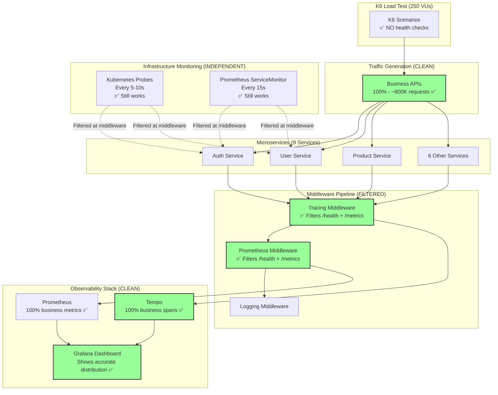

# k6 Load Testing

## Overview

k6 runs as a **continuous load generator** with realistic user journey functions to create traffic for all microservices (V1, V2) for monitoring and distributed tracing. The k6 deployment is managed via Helm.

## Architecture

### System Architecture (v0.6.14+)



**Key Design Principles:**
- ✅ K6 only calls business APIs - realistic traffic simulation
- ✅ Prometheus middleware filters infrastructure endpoints - defense in depth
- ✅ Tracing middleware filters infrastructure endpoints - cleaner traces
- ✅ Grafana shows 100% business traffic - accurate metrics
- ✅ Tempo has 0% health check spans - 79% storage savings
- ✅ Kubernetes probes still work - filtered at middleware, not blocked

**Traffic Flow:**
```
k6 → Business APIs → Microservices → Middleware (filters /health, /metrics) → Observability Stack
                                                                              ↓
                                          Kubernetes Probes → /health → Filtered (not recorded)
```

### Deployment Architecture

k6 is deployed using:
- **Helm Chart**: Reuses the same generic chart (`charts/`) used for microservices
- **Docker Image**: `ghcr.io/duynhne/k6:scenarios` (built from `k6/Dockerfile`)
- **Namespace**: Dedicated `k6` namespace
- **GitHub Actions**: Automated image builds via `.github/workflows/build-k6-images.yml`

### Request Flow Comparison

**Business Traffic (Recorded):**
```
k6 → /api/v1/users → Gin Handler → Prometheus Middleware ✅ Records metrics
                                  → Tracing Middleware ✅ Creates span
                                  → Logging Middleware ✅ Logs request
                                  → Response
```

**Infrastructure Traffic (Filtered):**
```
Kubernetes Probe → /health → Gin Handler → Prometheus Middleware ⏭️ SKIPS (early return)
                                          → Tracing Middleware ⏭️ SKIPS (filtered)
                                          → Logging Middleware ⏭️ Optional skip
                                          → Response ✅ Still returns 200 OK
```

**Result:**
- Business APIs: Full observability (metrics + traces + logs)
- Infrastructure endpoints: Still functional, just not recorded
- Storage: 75% reduction in datapoints
- Accuracy: 100% business traffic in metrics

---

## Files

- **k6/Dockerfile** - Dockerfile for k6 image
- **k6/load-test-multiple-scenarios.js** - Test script with 5 user personas and journey functions
- **charts/values/k6-scenarios.yaml** - Helm values
- **scripts/06-deploy-k6.sh** - Deployment script

## Deployment

```bash
./scripts/06-deploy-k6.sh
```

**Result:**
- 1 pod running in `k6` namespace
- 5 user personas with realistic journey functions
- Peak: 100 VUs (40 browser + 30 shopping + 15 registered + 10 API + 5 admin)
- Duration: 21 minutes per cycle (auto-restart)

## Verify

```bash
# Check pod
kubectl get pods -n k6

# View logs
kubectl logs -n k6 -l app=k6-scenarios -f

# Check Helm release
helm list -n k6
```

## Load Test Details

### Professional High-Volume Test Configuration

**Duration:** 6.5 hours (390 minutes) - Extended overnight soak test

**Peak Load:**
- 250 VUs total (100 browser + 75 shopping + 37 registered + 25 API + 13 admin)
- 250-1000 RPS sustained (avg ~400 RPS)
- 3-4 million total requests

**Load Pattern (Production Simulation):**
1. Morning Ramp-Up (45m): 0% → 60% load
2. Morning Peak (90m): 60% → 100% load (peak traffic)
3. Lunch Dip (45m): 100% → 70% load (reduced activity)
4. Afternoon Recovery (45m): 70% → 90% load
5. Evening Peak (90m): 90% → 100% load (second peak)
6. Evening Wind-Down (45m): 100% → 50% load
7. Night Low (22m): 50% → 20% load (minimal traffic)
8. Graceful Shutdown (8m): 20% → 0% load

**Journey Types (8 total):**
- 5 realistic user journeys (existing)
- 3 edge case journeys (new in v0.6.12):
  - Timeout/Retry Journey - Tests resilience
  - Concurrent Operations Journey - Tests race conditions
  - Error Handling Journey - Tests invalid inputs

**Traffic Focus (NEW in v0.6.14):**
- **Business traffic only** - No health checks or metrics endpoints
- **Separation of concerns**: 
  - Load testing → Simulates realistic user behavior
  - Infrastructure monitoring → Handled by Kubernetes probes
- **Why this matters**:
  - Metrics reflect actual user experience (not polluted by health checks)
  - APM traces show only business transactions
  - Storage efficiency (~75% reduction in Prometheus data)
  - Accurate SLO tracking

**Use Cases:**
- Production readiness validation
- Memory leak detection (6.5-hour extended soak test)
- Monitoring/tracing validation at scale
- Performance baseline establishment
- SLO compliance verification
- Overnight testing (conservative resource usage)

**Resource Requirements:**
- Cluster resources: 250 VUs requires ~4GB RAM, 2 CPU cores for k6 pod
- Microservices: 9 services * 3 replicas * (500MB RAM + 200m CPU) = ~13.5GB RAM, 5.4 CPU cores
- Total: ~17.5GB RAM, ~7.5 CPU cores for duration of test

---

### Multiple Scenarios Test (`load-test-multiple-scenarios.js`)

**Overview:**
- **5 user personas** with different behaviors and traffic distribution
- **8 user journey functions** for realistic multi-service traces (5 existing + 3 edge cases NEW in v0.6.12)
- **Total: 250 VUs peak** (100 browser + 75 shopping + 37 registered + 25 API + 13 admin) - Conservative configuration

---

#### User Journey Functions

**Purpose:** Create deeper, more realistic distributed traces spanning multiple microservices, including edge case testing for resilience and error handling.

**Journey Types:**

1. **E-commerce Shopping Journey** (9 services)
   - **Flow**: Auth → User → Product → Cart → Shipping-v2 → Order → Notification
   - **Steps**: Login → Profile → Browse catalog → View product → Add to cart → View cart → Estimate shipping (POST) → Create order → Send notification
   - **Duration**: ~7 seconds per journey
   - **Features**:
     - Covers complete purchase flow
     - **Fixes shipping-v2**: Uses POST with JSON body `{origin, destination, weight}`
     - Session tracking (`session_id`, `user_id` tags)
     - Flow step tags (`1_login`, `2_profile`, ..., `9_notification`)

2. **Product Review Journey** (5 services)
   - **Flow**: Auth → User → Product → Review
   - **Steps**: Login → Profile → View product → Read reviews → Write review
   - **Duration**: ~4 seconds per journey

3. **Order Tracking Journey** (6 services)
   - **Flow**: Auth → User → Order → Shipping → Notification
   - **Steps**: Login → Profile → View orders → Order details → Track shipment → Check notifications
   - **Duration**: ~5 seconds per journey

4. **Quick Browse Journey** (4 services)
   - **Flow**: Product → Shipping-v2 → Cart (abandoned)
   - **Steps**: Browse catalog → View product → Check shipping (POST) → Add to cart (abandon)
   - **Duration**: ~4 seconds per journey

5. **API Monitoring Journey** (7 services)
   - **Flow**: Auth, User, Product, Cart, Order, Review, Notification
   - **Steps**: Sequential health checks and data fetching across all services
   - **Duration**: ~1 second per journey (fast API client)

6. **Timeout/Retry Journey** (NEW in v0.6.12) - Edge Case
   - **Flow**: Product service with slow response + retries
   - **Steps**: Slow request → Retry 1 → Retry 2 → Retry 3 (exponential backoff)
   - **Duration**: ~5 seconds per journey
   - **Purpose**: Test system resilience with timeouts and retry logic

7. **Concurrent Operations Journey** (NEW in v0.6.12) - Edge Case
   - **Flow**: Cart service with parallel operations
   - **Steps**: Add item 1 + Add item 2 + View cart (simultaneous) → Verify cart
   - **Duration**: ~2 seconds per journey
   - **Purpose**: Test race conditions and deadlock scenarios

8. **Error Handling Journey** (NEW in v0.6.12) - Edge Case
   - **Flow**: Product → Cart → Order (all with invalid inputs)
   - **Steps**: Invalid product ID (404) → Invalid cart (400) → Invalid order (400)
   - **Duration**: ~1 second per journey
   - **Purpose**: Test error handling and validation

---

#### User Persona Integration

**1. Browser User (40%)** - Browse products, read reviews
   - 60% Quick Browse Journey (4 services)
   - 40% Simple browsing (legacy behavior)

**2. Shopping User (30%)** - Complete shopping flow (cart → checkout)
   - 80% E-commerce Shopping Journey (9 services)
   - 10% Concurrent Operations Journey (edge case)
   - 10% Simple shopping (legacy behavior)

**3. Registered User (15%)** - Authenticated actions (profile, orders)
   - 50% Order Tracking Journey (6 services)
   - 30% Product Review Journey (5 services)
   - 15% Error Handling Journey (edge case)
   - 5% Simple authenticated flow (legacy behavior)

**4. API Client (10%)** - High-volume API calls
   - 70% API Monitoring Journey (7 services)
   - 10% Timeout/Retry Journey (edge case)
   - 20% Fast endpoint testing (legacy behavior)

**5. Admin User (5%)** - Management operations
   - Management operations (unchanged from legacy)

---

#### Virtual Users & Stages

- Same stages as legacy test (peak: 100 VUs total)
- Ramp-up: 1m→20, 2m→50, 5m→100 VUs
- Sustained: 10m at 100 VUs
- Ramp-down: 2m→50, 1m→0
- **Duration: 21 minutes** (auto-restart)
- Distribution: 40 + 30 + 15 + 10 + 5 VUs

**Traffic:**
- Journey-based traffic (80% multi-service journeys, 20% legacy behavior)
- Think times: 10-15 seconds between journeys (realistic user pauses)
- Health checks: Only 10% of iterations per scenario (monitoring, not load testing)
  - Prometheus/Kubernetes probes already handle health monitoring
  - Reduces noise in Grafana metrics by 90%
  - Focuses load testing on actual business API endpoints
- Note: `/metrics` endpoint is NOT tested by k6 (only Prometheus scrapes it)

**Thresholds:**
- Per-scenario thresholds (API client: p95 < 300ms)
- Shopping flow: p95 < 1000ms (có thể chậm hơn)

## Metrics Flow

1. **k6** → Generates HTTP traffic
2. **Go apps** → Export metrics (duration, RPS, errors, etc.)
3. **Prometheus** → Scrapes metrics mỗi 15s
4. **Grafana** → Visualizes trong dashboard (32 panels)

## Troubleshooting

**Pod not running:**
```bash
kubectl logs -n k6 -l app=k6-scenarios
kubectl describe pod -n k6
```

**No traffic in Grafana:**
- Check pods are running: `kubectl get pods -n k6`
- Check service URLs in test scripts
- Check Prometheus scrape config
- Verify microservices are running in their respective namespaces

**Traces not appearing in Tempo:**
- **Check if services are receiving k6 requests**:
  ```bash
  # Check shipping-v2 logs for POST requests:
  kubectl logs -n shipping -l app=shipping-v2 --tail=50 | grep "POST.*estimate"
  
  # Check trace_id in logs (confirms tracing is enabled):
  kubectl logs -n shipping -l app=shipping-v2 --tail=20 | grep "trace_id"
  ```
- **Verify service name detection**:
  - Services with hyphens (e.g., `shipping-v2`) must be detected correctly
  - Check `services/pkg/middleware/resource.go` for pod name parsing logic
  - Expected: `shipping-v2-xxx-yyy` → `shipping-v2` (not `shipping`)
- **Check Tempo for traces**:
  ```bash
  # Grafana Explore → Tempo → TraceQL queries:
  {resource.service.name="shipping-v2"}  # Should return traces
  {.session_id=~".+"}                    # View all journey traces
  {.journey="ecommerce_purchase"}        # View specific journey type
  ```
- **Verify k6 journey execution**:
  - Journeys execute based on probability (80% journeys, 20% legacy)
  - May take a few minutes before journeys start (ramp-up period)
  - Check k6 logs for journey console.log messages (if k6 outputs them)

**shipping-v2 showing 400 errors:**
- **Symptom**: Logs show "Invalid request" (EOF error) with 400 status
- **Cause**: Endpoint expects POST with JSON body, but k6 is sending GET
- **Solution**: Use journey functions (e.g., `ecommerceShoppingJourney()`) which send POST requests
- **Verify**: `kubectl logs -n shipping -l app=shipping-v2 --tail=20 | grep "method\":\"`
  - Should see `"method":"POST"` for `/api/v2/shipments/estimate`

**High resource usage:**
- Reduce VUs in test scripts (edit `k6/*.js`)
- Scale down specific deployment:
  - `kubectl scale deployment k6-legacy --replicas=0 -n k6`
  - `kubectl scale deployment k6-scenarios --replicas=0 -n k6`
- Or uninstall specific release:
  - `helm uninstall k6-legacy -n k6`
  - `helm uninstall k6-scenarios -n k6`

## Best Practices (v0.6.14+)

### What to Include in Load Tests

✅ **DO include**:
- Business API endpoints (`/api/v1/*`, `/api/v2/*`)
- Realistic user journeys (multi-service flows)
- Edge cases (timeouts, retries, errors)
- Different user personas (browser, API, admin)
- Production-like load patterns

❌ **DO NOT include**:
- Health check endpoints (`/health`, `/readiness`, `/liveness`)
- Metrics endpoints (`/metrics`)
- Infrastructure monitoring endpoints

### Why Separate Infrastructure from Load Testing?

**Kubernetes Handles Infrastructure Monitoring:**
- Liveness probes check container health
- Readiness probes check service availability
- Load balancers perform health checks
- Prometheus scrapes `/metrics` automatically

**Load Testing Should Simulate Users:**
- Real users don't call `/health` endpoints
- Health checks create misleading metrics (79% traffic in v0.6.13!)
- APM traces get polluted with infrastructure calls
- Storage costs increase (millions of unnecessary datapoints)

**Result:**
- Metrics reflect actual user experience
- Accurate response time percentiles (P50, P95, P99)
- Clean APM traces (only business transactions)
- Lower storage costs (~75% reduction)
- Accurate SLO tracking

### Middleware Filtering (v0.6.14+)

Even if infrastructure endpoints are accidentally called, they are filtered at the middleware level:

```go
// services/pkg/middleware/prometheus.go
func shouldCollectMetrics(path string) bool {
    infrastructurePaths := []string{
        "/health", "/metrics", "/readiness", "/liveness",
    }
    for _, skipPath := range infrastructurePaths {
        if strings.HasPrefix(path, skipPath) {
            return false
        }
    }
    return true
}
```

**Benefits:**
- Prevents metric pollution at collection time
- Consistent with distributed tracing filtering
- Efficient (early return, no overhead)
- Easy to extend (add new paths to filter)

---

## Update Test Scripts

1. Edit `k6/load-test.js` or `k6/load-test-multiple-scenarios.js`
2. Rebuild k6 images: `./scripts/04-build-microservices.sh` (includes k6 builds)
3. Redeploy: `./scripts/06-deploy-k6.sh`
4. Pods will automatically use new images (ImagePullPolicy: Never for local images)
