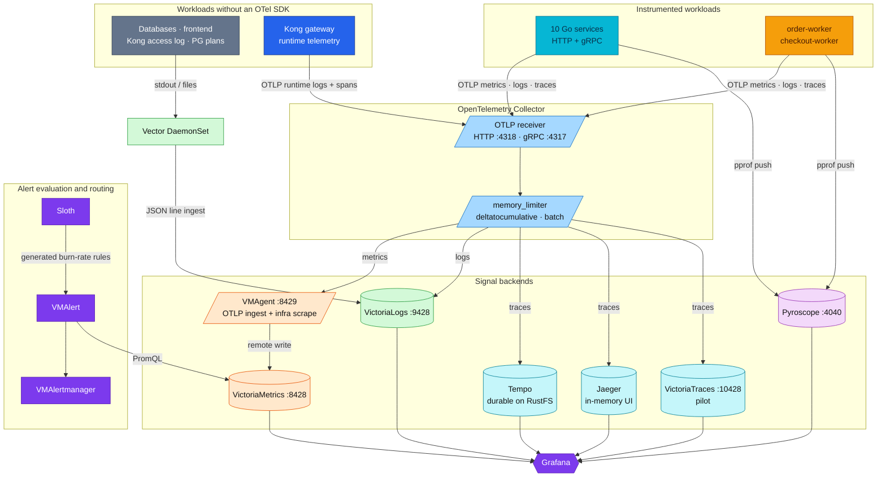
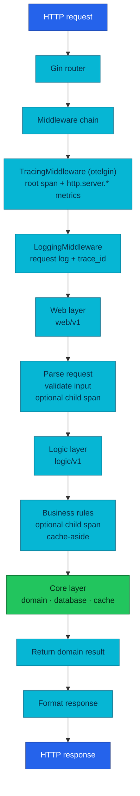
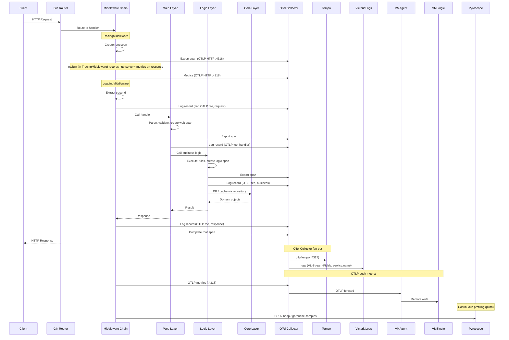
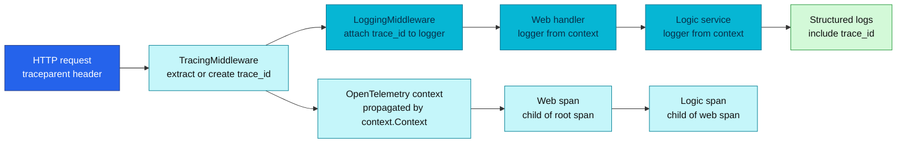
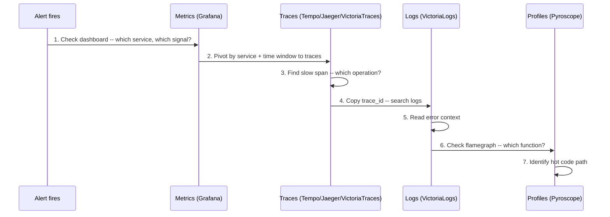

# Observability Documentation

Comprehensive observability for the `duynhlab` microservices platform -- 10 Go
services, 2 workers, and 5 PostgreSQL clusters running on Kubernetes with
GitOps (Flux).

> **New to the stack?** Start with the [RFC-0014 explainer](opentelemetry/rfc-0014-explainer.md) — old-vs-new, plain-language, diagrams.

## Architecture

Since RFC-0014 the 10 Go services plus order-worker and checkout-worker
**push** all three signals over OTLP to one OpenTelemetry Collector, which fans
each out to its backend. Vector
is the side path for everything without an OTel SDK (databases, Kong access log,
Postgres query plans, the frontend). Profiles push straight to Pyroscope.

```mermaid
graph LR
    subgraph Legend["Observability diagram legend"]
        Edge["Edge / gateway"]:::edge
        Service["Go service"]:::service
        Worker["Worker"]:::worker
        Collector["Collector / processor"]:::collector
        Metric["Metrics path"]:::metric
        Log["Logs path"]:::log
        Trace["Traces path"]:::trace
        Profile["Profiles path"]:::profile
        Platform["Control / query plane"]:::platform
        External["External / non-SDK workload"]:::external
    end

    classDef edge fill:#2563eb,color:#fff,stroke:#1e3a8a;
    classDef service fill:#06b6d4,color:#082f49,stroke:#0e7490;
    classDef worker fill:#f59e0b,color:#451a03,stroke:#b45309;
    classDef platform fill:#7c3aed,color:#fff,stroke:#5b21b6;
    classDef external fill:#64748b,color:#fff,stroke:#334155;
    classDef metric fill:#ffe8cc,color:#111,stroke:#e8590c;
    classDef log fill:#d3f9d8,color:#111,stroke:#2f9e44;
    classDef trace fill:#c5f6fa,color:#111,stroke:#0c8599;
    classDef profile fill:#f3d9fa,color:#111,stroke:#9c36b5;
    classDef collector fill:#a5d8ff,color:#111,stroke:#1971c2;
```





## 3-Layer Service Architecture & APM Integration

Each Go service is structured as **web → logic → core**. APM data is emitted at every layer so a single trace-id correlates traces, logs, metrics, and profiles end-to-end.

### Code Structure



### End-to-End Request with APM

Tracing and profiling are out-of-band: spans go through the OTel Collector before reaching Tempo/Jaeger, app logs are teed to OTLP (Vector still ships the non-instrumented pods), and app metrics are pushed over OTLP (SDK → OTel Collector → VMAgent OTLP ingest → VMSingle) — VMAgent still scrapes the infra exporters (kube-state, cAdvisor, pg_exporter, …).



### Layer Responsibilities

#### Web Layer (`web/v1/`)

- HTTP request/response handling, validation, status code mapping, error formatting
- Creates spans with `layer=web`; logs request/response as JSON on stdout with trace-id

```go
func Login(c *gin.Context) {
    ctx, span := middleware.StartSpan(c.Request.Context(), "http.request",
        trace.WithAttributes(attribute.String("layer", "web")))
    defer span.End()

    logger := middleware.GetLoggerFromContext(c, baseLogger)

    var req domain.LoginRequest
    if err := c.ShouldBindJSON(&req); err != nil {
        logger.Error("Invalid request", zap.Error(err))
        c.JSON(http.StatusBadRequest, gin.H{"error": err.Error()})
        return
    }

    result, err := authService.Login(ctx, req)
    // ... handle response
}
```

#### Logic Layer (`logic/v1/`)

- Business logic, validation, transformation, rule enforcement
- Cache-Aside against Valkey for read-heavy paths
- Creates spans with `layer=logic`; custom business metrics emitted via the OTel Meter API and pushed over OTLP; appears in CPU/heap profiles pushed to Pyroscope

```go
func (s *AuthService) Login(ctx context.Context, req domain.LoginRequest) (*domain.AuthResponse, error) {
    ctx, span := middleware.StartSpan(ctx, "auth.login",
        trace.WithAttributes(attribute.String("layer", "logic")))
    defer span.End()

    if req.Username == "admin" && req.Password == "password" {
        span.SetAttributes(attribute.Bool("auth.success", true))
        return response, nil
    }

    span.SetAttributes(attribute.Bool("auth.success", false))
    return nil, errors.New("invalid credentials")
}
```

#### Core Layer (`core/`)

- Domain models (`core/domain/`), DB connection (`core/database.go`, PostgreSQL via PgBouncer / PgDog), cache client (`core/cache/`, Valkey)
- **No business logic** — pure data structures + thin infra adapters. DB/cache spans bubble up via instrumentation; pool / hit-rate metrics pushed over OTLP.

### Trace-ID Propagation



> Note: `prometheus-operator-crds` is installed only so VictoriaMetrics Operator can transparently consume `ServiceMonitor` / `PodMonitor` / `PrometheusRule` resources — there is no Prometheus server running.

## The Four Pillars

| Pillar | Tool | Question It Answers | Docs |
|--------|------|---------------------|------|
| **Metrics** | VMSingle + VMAgent | "Is something wrong?" | [metrics/](metrics/README.md) |
| **Traces** | Tempo + Jaeger (+ VictoriaTraces pilot) via OTel Collector | "Where is it slow?" | [tracing/](tracing/README.md) |
| **Logs** | VictoriaLogs (OTLP tee; Vector for infra) | "Why is it broken?" | [logging/](logging/README.md) |
| **Profiles** | Pyroscope | "Which code line is the bottleneck?" | [profiling/](profiling/README.md) |

## Documentation Map

```
docs/observability/
├── README.md                     # This file: index + 3-layer architecture + APM integration
├── opentelemetry/                 # OTel instrumentation, transport, and migration
│   ├── README.md                  # Canonical policy + current platform behavior
│   └── rfc-0014-explainer.md     # Beginner old-vs-new walkthrough
│
├── metrics/                      # Pillar 1: Metrics collection & storage
│   ├── README.md                 # Hub: fundamentals, stack, architecture, coverage
│   ├── metrics-apps.md           # Application + gRPC east-west metrics (RED)
│   ├── metrics-infra.md          # Cluster / infrastructure metrics (USE)
│   ├── victoriametrics.md        # VictoriaMetrics Operator stack
│   ├── vmauth.md                 # VMAuth/vmauth HTTP proxy (auth.config, CRs)
│   ├── promql-guide.md           # PromQL reference
│   ├── streaming-aggregation.md  # At-scale playbook: in-flight aggregation (RFC-0013)
│   └── postgresql/               # PostgreSQL-specific metrics (databases layer)
│       ├── monitoring.md          # Monitoring overview
│       ├── custom-metrics.md      # Custom pg_exporter queries
│       ├── pg-exporter-dashboards.md
│       └── pg-exporter-mapping.md
│
├── tracing/                      # Pillar 2: Distributed tracing
│   ├── README.md                 # Tracing guide (Tempo + OTel)
│   ├── architecture.md           # Triple backend (Tempo + Jaeger + VictoriaTraces pilot)
│   ├── jaeger.md                 # Jaeger UI guide
│   ├── backends-comparison.md    # Tempo vs Jaeger vs VictoriaTraces
│   └── victoriatraces.md         # VictoriaTraces pilot (3rd backend)
│
├── logging/                      # Pillar 3: Structured logging
│   ├── README.md                 # Architecture, why-this-stack, scaling
│   └── victorialogs.md           # VictoriaLogs backend & Vector pipeline ops
│
├── profiling/                    # Pillar 4: Continuous profiling
│   └── README.md                 # Pyroscope (CPU, heap, goroutine)
│
├── grafana/                      # Visualization layer
│   ├── README.md                 # Grafana overview + plugin management
│   ├── rbac-multi-team.md        # Org roles, Teams, anonymous vs named users
│   ├── datasources.md            # Dual datasource strategy (case study)
│   ├── dashboard-reference.md    # Microservices dashboard (40 panels, 6 rows)
│   └── variables.md              # Dashboard variables & regex
│
├── alerting/                     # Alerting rules
│   ├── README.md                 # 2-layer alerting strategy
│   ├── alert-catalog.md          # Full alert reference (149 rules) + coverage gaps
│   ├── slo-burn-rate-alerts.md   # SLO burn-rate methodology + config
│   └── dashboard-comparison.md   # Alerting/dashboard tooling comparison
│
├── slo/                          # Service Level Objectives
│   ├── README.md                 # Sloth Operator + SLO targets
│   ├── fundamentals.md           # SLI/SLO/error-budget concepts
│   ├── error_budget_policy.md    # Error budget management
│   ├── getting_started.md        # Enable SLOs for a service
│   └── annotation-driven-slo-controller.md  # Future design
│   # Burn-rate alert config lives in alerting/slo-burn-rate-alerts.md
│
└── runbooks/                     # Operational runbooks
    ├── README.md                 # Runbook index
    ├── observability-deep-dive.md  # Theory + interview prep
    ├── infrastructure-alerts.md    # Infra/platform alert investigation guide
    └── microservices-alerts.md     # Per-alert investigation guide
```

## Component Inventory

The VictoriaMetrics-owned components move as one reviewed release set. Core
metrics and logs use the defaults embedded in the pinned operator; the pre-GA
trace pilot remains explicit so a future operator bump cannot move it silently.

| Layer | Version | Pin source |
|-------|---------|------------|
| VM Operator | chart `0.66.2`, app `v0.73.1` | Flux `OCIRepository` |
| VictoriaMetrics (`VMSingle`, `VMAgent`, `VMAlert`) | `v1.147.0` | operator defaults; single-node image explicit in local-stack |
| VictoriaLogs (`VLSingle`) | `v1.51.0` | operator defaults; single-node image explicit in local-stack |
| VictoriaTraces (`VTSingle`) | `v0.9.4` | explicit CR and local-stack image |
| Grafana VM / VL datasources | `v0.25.2` / `v0.29.0` | Grafana CR and datasource CRs |
| VM / VL MCP charts | `0.3.0` / `0.1.0` | Flux `OCIRepository` |

The standalone `victoria-metrics-operator-crds` chart `0.13.1` targets the
same operator `v0.73.1`, but is not installed here: the operator chart already
renders and upgrades its matching CRDs. Two Helm owners for the same
cluster-scoped CRDs would make upgrades ambiguous.

| Component | Namespace | Service | Port | Purpose |
|-----------|-----------|---------|------|---------|
| VMSingle | monitoring | `vmsingle-victoria-metrics` | 8428 | Metrics storage + Prometheus-compatible API |
| VMAgent | monitoring | `vmagent-victoria-metrics` | 8429 | OTLP metrics ingest (app push) + infra scraping (replaces Prometheus scraper) |
| VMAlert | monitoring | `vmalert-victoria-metrics` | 8080 | Rule evaluation (alerting + recording rules) |
| VMAlertmanager | monitoring | `vmalertmanager-victoria-metrics` | 9093 | Alert routing and notification |
| Grafana | monitoring | `grafana-service` | 3000 | Dashboards and visualization |
| Tempo | monitoring | `tempo` | 3200 | Trace storage (OTLP receiver) |
| Jaeger | monitoring | `jaeger-query` | 16686 | Trace query UI (alternative to Tempo) |
| VictoriaTraces | monitoring | `vtsingle-victoria-traces` | 10428 | Trace storage pilot (`v0.9.4`, OTLP HTTP + Jaeger query API) |
| OTel Collector | monitoring | `otel-collector-opentelemetry-collector` | 4318 | OTLP/HTTP ingress — metrics (→ vmagent), logs (app tee + Kong runtime), trace fan-out |
| VictoriaLogs | monitoring | `vlsingle-victoria-logs` | 9428 | Log storage and query (LogsQL, sole log backend) |
| Vector | kube-system | DaemonSet | -- | Log shipping for **non-instrumented** pods (DBs, Kong access log, PG plans, frontend); app logs go OTLP |
| Pyroscope | monitoring | `pyroscope` | 4040 | Continuous profiling |
| Sloth | monitoring | operator | -- | SLO-to-PrometheusRule generator |

## Correlation: Connecting the Pillars

The investigation flow from alert to root cause:



**Key correlation mechanisms:**

- **Metrics → Traces**: exemplars are **not available** (VictoriaMetrics won't-fix, RFC-0014 D-14) — pivot from a metric to traces by service + time window, or via the `trace_id` field now carried on logs (below)
- **Traces → Logs**: `trace_id` injected into every structured log line by LoggingMiddleware
- **Logs → Traces**: VictoriaLogs datasource derived field extracts `trace_id` and links back to Tempo
- **Traces → Profiles**: Pyroscope labels match service name for time-correlated flamegraphs

## Deployment

All components deploy via **Flux GitOps**:

```bash
make up              # Full deployment (Kind + Flux + everything)
make flux-push       # Push OCI artifacts to registry
make flux-sync       # Trigger reconciliation
make flux-status     # Check status
```

Flux reconciliation order:
1. **Controllers** -- operators, CRDs (VictoriaMetrics Operator, Prometheus CRDs, Grafana Operator, Sloth)
2. **Configs** -- monitoring stack (VMSingle, VMAgent, VMAlert, Grafana, VictoriaLogs, etc.)
3. **Tracing / Profiling** -- Tempo (`tracing-local`) and Pyroscope (`profiling-local`), each split out of the controllers wave and `dependsOn: [secrets-local, storage-local]` because they need the RustFS credentials Secret (ESO-managed) and RustFS running before they can start
4. **Apps** -- microservices (push OTLP metrics to the collector; no ServiceMonitor scrape for app services)

## Quick Start: Accessing the Stack

```bash
# Grafana (dashboards, alerts, explore)
kubectl port-forward svc/grafana-service -n monitoring 3000:3000

# VMSingle (metrics API, VMUI)
kubectl port-forward svc/vmsingle-victoria-metrics -n monitoring 8428:8428

# Jaeger (trace search UI)
kubectl port-forward svc/jaeger-query -n monitoring 16686:16686

# Pyroscope (flamegraphs)
kubectl port-forward svc/pyroscope -n monitoring 4040:4040
```

## Related Documentation

- [OpenTelemetry guide](opentelemetry/README.md) -- OTel concepts, policy, SDK, Collector, and platform operations
- [RFC-0014 explainer](opentelemetry/rfc-0014-explainer.md) -- beginner old-vs-new migration walkthrough
- [Metrics: RED/USE/Golden Signals](metrics/README.md) -- metrics methodology
- [VictoriaMetrics Operator](metrics/victoriametrics.md) -- migration from kube-prometheus-stack
- [Grafana Datasources](grafana/datasources.md) -- VictoriaMetrics plugin metrics datasource
- [Alerting Strategy](alerting/README.md) -- 2-layer alerting (threshold + SLO burn-rate)
- [Alert Catalog](alerting/alert-catalog.md) -- full reference of all deployed alerts + coverage-gap analysis
- [SLO System](slo/README.md) -- Sloth Operator and burn-rate alerts
- [Interview Prep](runbooks/observability-deep-dive.md) -- RED/USE/Golden Signals theory + structured answers

---

_Last updated: 2026-07-14_
