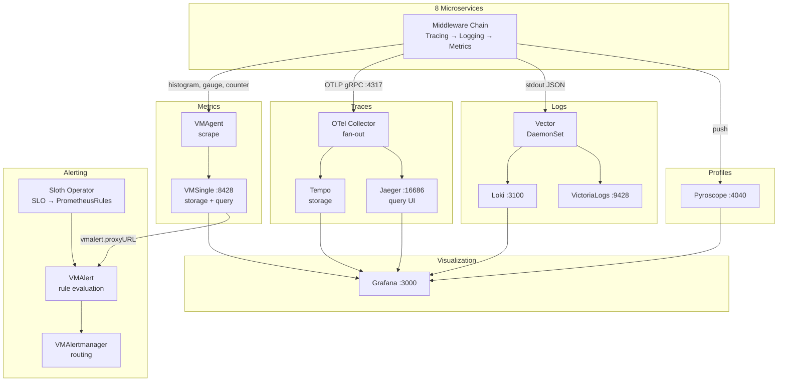
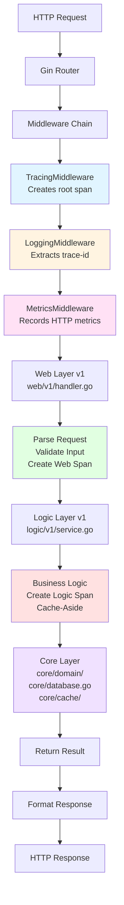
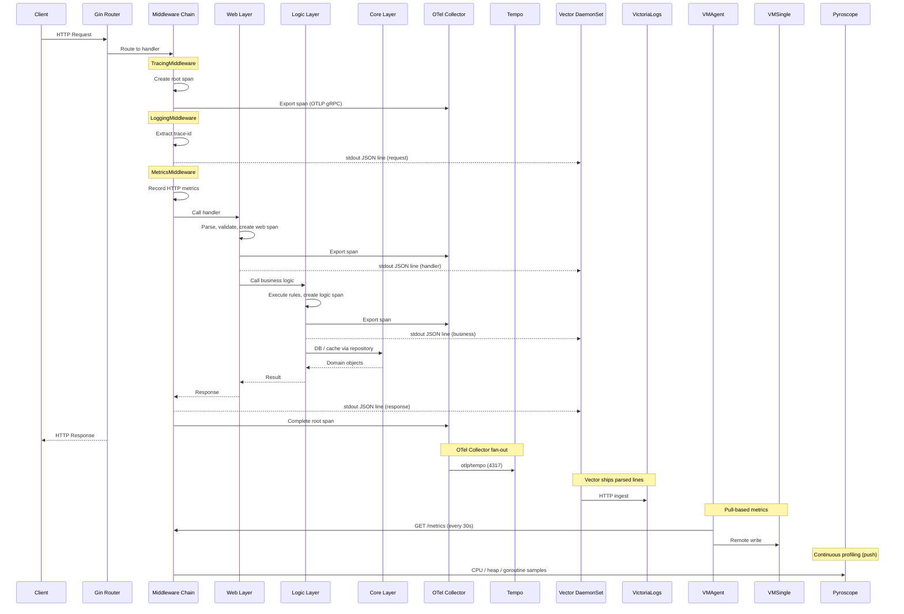
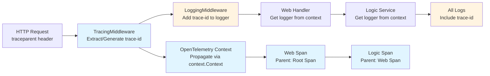
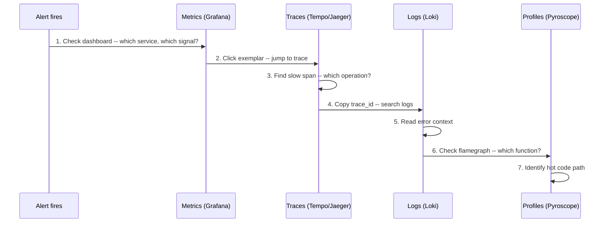

# Observability Documentation

Comprehensive observability for the `duynhlab` microservices platform -- 8 Go services, 4 PostgreSQL clusters, all running on Kubernetes with GitOps (Flux).

## Architecture



## 3-Layer Service Architecture & APM Integration

Each Go service is structured as **web → logic → core**. APM data is emitted at every layer so a single trace-id correlates traces, logs, metrics, and profiles end-to-end.

### Code Structure



### End-to-End Request with APM

Tracing and profiling are out-of-band: spans go through the OTel Collector before reaching Tempo/Jaeger, log lines hit stdout and are picked up by the Vector DaemonSet, and metrics are pull-based via VMAgent scrapes.



### Layer Responsibilities

#### Web Layer (`web/v1/`)

- HTTP request/response handling, validation, status code mapping, error formatting
- Creates spans with `layer=web`; logs request/response as JSON on stdout with trace-id

```go
func Login(c *gin.Context) {
    ctx, span := middleware.StartSpan(c.Request.Context(), "http.request",
        trace.WithAttributes(attribute.String("layer", "web")))
    defer span.End()

    logger := middleware.GetLoggerFromContext(c, baseLogger)

    var req domain.LoginRequest
    if err := c.ShouldBindJSON(&req); err != nil {
        logger.Error("Invalid request", zap.Error(err))
        c.JSON(http.StatusBadRequest, gin.H{"error": err.Error()})
        return
    }

    result, err := authService.Login(ctx, req)
    // ... handle response
}
```

#### Logic Layer (`logic/v1/`)

- Business logic, validation, transformation, rule enforcement
- Cache-Aside against Valkey for read-heavy paths
- Creates spans with `layer=logic`; custom business metrics exposed on `/metrics` (scraped by VMAgent); appears in CPU/heap profiles pushed to Pyroscope

```go
func (s *AuthService) Login(ctx context.Context, req domain.LoginRequest) (*domain.AuthResponse, error) {
    ctx, span := middleware.StartSpan(ctx, "auth.login",
        trace.WithAttributes(attribute.String("layer", "logic")))
    defer span.End()

    if req.Username == "admin" && req.Password == "password" {
        span.SetAttributes(attribute.Bool("auth.success", true))
        return response, nil
    }

    span.SetAttributes(attribute.Bool("auth.success", false))
    return nil, errors.New("invalid credentials")
}
```

#### Core Layer (`core/`)

- Domain models (`core/domain/`), DB connection (`core/database.go`, PostgreSQL via PgBouncer / PgDog), cache client (`core/cache/`, Valkey)
- **No business logic** — pure data structures + thin infra adapters. DB/cache spans bubble up via instrumentation; pool / hit-rate metrics exposed on `/metrics`.

### Trace-ID Propagation



> Note: `prometheus-operator-crds` is installed only so VictoriaMetrics Operator can transparently consume `ServiceMonitor` / `PodMonitor` / `PrometheusRule` resources — there is no Prometheus server running.

## The Four Pillars

| Pillar | Tool | Question It Answers | Docs |
|--------|------|---------------------|------|
| **Metrics** | VMSingle + VMAgent | "Is something wrong?" | [metrics/](metrics/README.md) |
| **Traces** | Tempo + Jaeger via OTel Collector | "Where is it slow?" | [tracing/](tracing/README.md) |
| **Logs** | Loki + VictoriaLogs via Vector | "Why is it broken?" | [logging/](logging/README.md) |
| **Profiles** | Pyroscope | "Which code line is the bottleneck?" | [profiling/](profiling/README.md) |

## Documentation Map

```
docs/observability/
├── README.md                     # This file: index + 3-layer architecture + APM integration
│
├── metrics/                      # Pillar 1: Metrics collection & storage
│   ├── README.md                 # RED/USE/Golden Signals methodology
│   ├── victoriametrics.md        # VictoriaMetrics Operator stack
│   ├── vmauth.md                 # VMAuth/vmauth HTTP proxy (auth.config, CRs)
│   ├── promql-guide.md           # PromQL reference
│   └── postgresql/               # PostgreSQL-specific metrics
│       ├── monitoring.md          # Monitoring overview
│       ├── custom-metrics.md      # Custom pg_exporter queries
│       ├── pg-exporter-dashboards.md
│       └── pg-exporter-mapping.md
│
├── tracing/                      # Pillar 2: Distributed tracing
│   ├── README.md                 # Tracing guide (Tempo + OTel)
│   ├── architecture.md           # Dual backend (Tempo + Jaeger)
│   └── jaeger.md                 # Jaeger UI guide
│
├── logging/                      # Pillar 3: Structured logging
│   ├── README.md                 # Zap + Vector + Loki
│   └── victorialogs.md           # VictoriaLogs backend
│
├── profiling/                    # Pillar 4: Continuous profiling
│   └── README.md                 # Pyroscope (CPU, heap, goroutine)
│
├── grafana/                      # Visualization layer
│   ├── README.md                 # Grafana overview + plugin management
│   ├── rbac-multi-team.md        # Org roles, Teams, anonymous vs named users
│   ├── datasources.md            # Dual datasource strategy (case study)
│   ├── dashboard-reference.md    # Microservices dashboard (34 panels)
│   └── variables.md              # Dashboard variables & regex
│
├── alerting/                     # Alerting rules
│   └── README.md                 # 2-layer alerting strategy
│
├── slo/                          # Service Level Objectives
│   ├── README.md                 # Sloth Operator + SLO targets
│   ├── alerting.md               # Multi-window burn-rate alerts
│   ├── error_budget_policy.md    # Error budget management
│   ├── getting_started.md        # Enable SLOs for a service
│   └── annotation-driven-slo-controller.md  # Future design
│
└── runbooks/                     # Operational runbooks
    ├── README.md                 # Runbook index
    ├── observability-deep-dive.md  # Theory + interview prep
    └── microservices-alerts.md     # Per-alert investigation guide
```

## Component Inventory

| Component | Namespace | Service | Port | Purpose |
|-----------|-----------|---------|------|---------|
| VMSingle | monitoring | `vmsingle-victoria-metrics` | 8428 | Metrics storage + Prometheus-compatible API |
| VMAgent | monitoring | `vmagent-victoria-metrics` | 8429 | Metrics scraping (replaces Prometheus scraper) |
| VMAlert | monitoring | `vmalert-victoria-metrics` | 8080 | Rule evaluation (alerting + recording rules) |
| VMAlertmanager | monitoring | `vmalertmanager-victoria-metrics` | 9093 | Alert routing and notification |
| Grafana | monitoring | `grafana-service` | 3000 | Dashboards and visualization |
| Tempo | monitoring | `tempo` | 3200 | Trace storage (OTLP receiver) |
| Jaeger | monitoring | `jaeger-query` | 16686 | Trace query UI (alternative to Tempo) |
| OTel Collector | monitoring | `otel-collector` | 4317 | Trace fan-out (OTLP gRPC ingress) |
| Loki | monitoring | `loki` | 3100 | Log storage and query (LogQL) |
| VictoriaLogs | monitoring | `vlsingle-victoria-logs` | 9428 | Log storage (LogsQL, alternative to Loki) |
| Vector | kube-system | DaemonSet | -- | Log collection from all pods |
| Pyroscope | monitoring | `pyroscope` | 4040 | Continuous profiling |
| Sloth | monitoring | operator | -- | SLO-to-PrometheusRule generator |

## Correlation: Connecting the Pillars

The investigation flow from alert to root cause:



**Key correlation mechanisms:**

- **Metrics → Traces**: Exemplars on `request_duration_seconds` histogram link to trace IDs
- **Traces → Logs**: `trace_id` injected into every structured log line by LoggingMiddleware
- **Logs → Traces**: Loki derived field extracts `trace_id` and links back to Tempo
- **Traces → Profiles**: Pyroscope labels match service name for time-correlated flamegraphs

## Deployment

All components deploy via **Flux GitOps**:

```bash
make up              # Full deployment (Kind + Flux + everything)
make flux-push       # Push OCI artifacts to registry
make flux-sync       # Trigger reconciliation
make flux-status     # Check status
```

Flux reconciliation order:
1. **Controllers** -- operators, CRDs (VictoriaMetrics Operator, Prometheus CRDs, Grafana Operator, Sloth)
2. **Configs** -- monitoring stack (VMSingle, VMAgent, VMAlert, Grafana, Tempo, Loki, etc.)
3. **Apps** -- microservices (auto-discovered by VMAgent via ServiceMonitor)

## Quick Start: Accessing the Stack

```bash
# Grafana (dashboards, alerts, explore)
kubectl port-forward svc/grafana-service -n monitoring 3000:3000

# VMSingle (metrics API, VMUI)
kubectl port-forward svc/vmsingle-victoria-metrics -n monitoring 8428:8428

# Jaeger (trace search UI)
kubectl port-forward svc/jaeger-query -n monitoring 16686:16686

# Pyroscope (flamegraphs)
kubectl port-forward svc/pyroscope -n monitoring 4040:4040
```

## Related Documentation

- [Metrics: RED/USE/Golden Signals](metrics/README.md) -- metrics methodology
- [VictoriaMetrics Operator](metrics/victoriametrics.md) -- migration from kube-prometheus-stack
- [Grafana Datasources](grafana/datasources.md) -- VictoriaMetrics plugin metrics datasource
- [Alerting Strategy](alerting/README.md) -- 2-layer alerting (threshold + SLO burn-rate)
- [SLO System](slo/README.md) -- Sloth Operator and burn-rate alerts
- [Interview Prep](runbooks/observability-deep-dive.md) -- RED/USE/Golden Signals theory + structured answers
