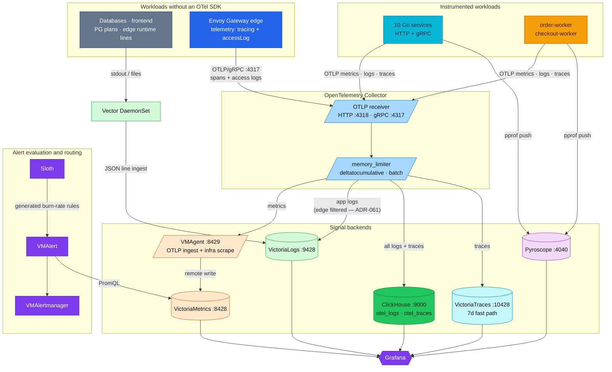
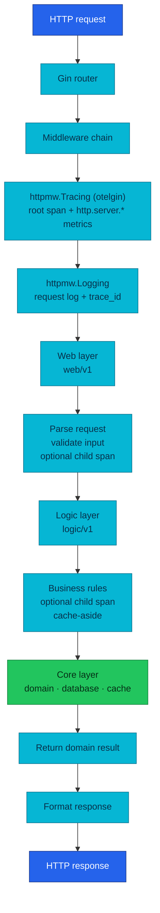
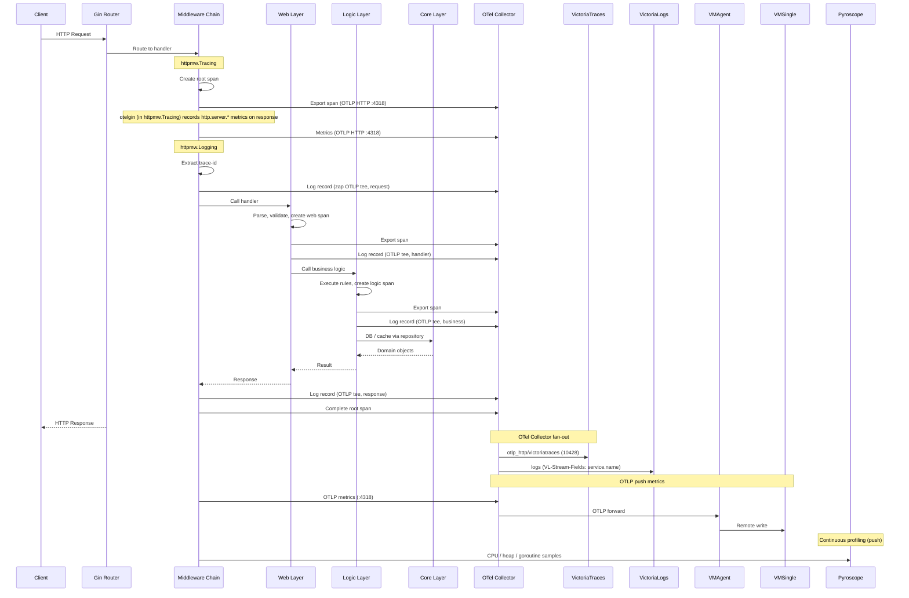
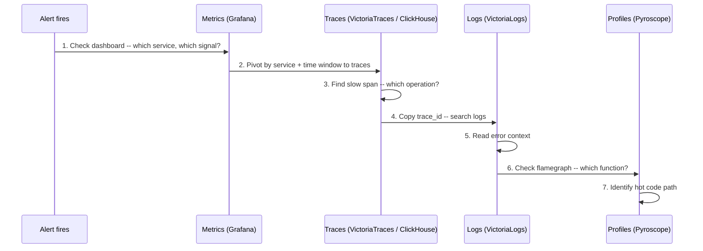

# Observability Documentation

Comprehensive observability for the `duynhlab` microservices platform -- 10 Go
services, 2 workers, and 5 PostgreSQL clusters running on Kubernetes with
GitOps (Flux).

> **Service authors:** normative observability contracts live in
> [Application observability](../api/observability.md) and the pillar files
> ([logs](../api/logs.md), [metrics](../api/metrics.md),
> [tracing](../api/tracing.md), [profiling](../api/profiling.md)). This hub
> covers **platform** backends, alerts, Grafana, and runbooks.

> **New to the stack?** Start with [OTel fundamentals](opentelemetry/fundamentals.md) — plain-language concepts plus the RFC-0014 old-vs-new migration story, in diagrams.

## Architecture

Since RFC-0014 the 10 Go services plus order-worker and checkout-worker
**push** all three signals over OTLP to one OpenTelemetry Collector, which fans
each out to its backend. Vector
is the side path for everything without an OTel SDK (databases,
Postgres query plans, the frontend). Profiles push straight to Pyroscope.


```mermaid
flowchart TB
    subgraph workloads["Instrumented workloads"]
        Services["10 Go services<br/>HTTP + gRPC"]
        Workers["order-worker<br/>checkout-worker"]
    end

    subgraph nonSdk["Workloads without an OTel SDK"]
        Infra["Databases · frontend<br/>PG plans · edge runtime lines"]
        Edge["Envoy Gateway edge<br/>telemetry: tracing + accessLog"]
    end

    subgraph collectorNode["OpenTelemetry Collector"]
        Receiver[/"OTLP receiver<br/>HTTP :4318 · gRPC :4317"/]
        Processors[/"memory_limiter<br/>deltatocumulative · batch"/]
        Receiver --> Processors
    end

    Vector["Vector DaemonSet"]

    subgraph backends["Signal backends"]
        VMAgent[/"VMAgent :8429<br/>OTLP ingest + infra scrape"/]
        VMSingle[("VictoriaMetrics :8428")]
        VLogs[("VictoriaLogs :9428")]
        VT[("VictoriaTraces :10428<br/>7d fast path")]
        CH[("ClickHouse :9000<br/>otel_logs · otel_traces")]
        Pyro[("Pyroscope :4040")]
    end

    subgraph alerting["Alert evaluation and routing"]
        Sloth["Sloth"]
        VMAlert["VMAlert"]
        VMAM["VMAlertmanager"]
        Sloth -->|"generated burn-rate rules"| VMAlert
        VMAlert --> VMAM
    end

    Grafana{{"Grafana"}}

    Services & Workers -->|"OTLP metrics · logs · traces"| Receiver
    Services & Workers -->|"pprof push"| Pyro
    Infra -->|"stdout / files"| Vector
    Edge -->|"OTLP/gRPC :4317<br/>spans + access logs"| Receiver
    Processors -->|"metrics"| VMAgent
    Processors -->|"app logs<br/>(edge filtered — ADR-061)"| VLogs
    Processors -->|"all logs + traces"| CH
    Processors -->|"traces"| VT
    Vector -->|"JSON line ingest"| VLogs
    VMAgent -->|"remote write"| VMSingle
    VMAlert -->|"PromQL"| VMSingle

    VMSingle --> Grafana
    VLogs --> Grafana
    VT --> Grafana
    CH --> Grafana
    Pyro --> Grafana

    classDef edge fill:#2563eb,color:#fff,stroke:#1e3a8a;
    classDef service fill:#06b6d4,color:#082f49,stroke:#0e7490;
    classDef worker fill:#f59e0b,color:#451a03,stroke:#b45309;
    classDef platform fill:#7c3aed,color:#fff,stroke:#5b21b6;
    classDef external fill:#64748b,color:#fff,stroke:#334155;
    classDef metric fill:#ffe8cc,color:#111,stroke:#e8590c;
    classDef log fill:#d3f9d8,color:#111,stroke:#2f9e44;
    classDef trace fill:#c5f6fa,color:#111,stroke:#0c8599;
    classDef profile fill:#f3d9fa,color:#111,stroke:#9c36b5;
    classDef collector fill:#a5d8ff,color:#111,stroke:#1971c2;
    classDef data fill:#22c55e,color:#052e16,stroke:#15803d;
    class Services service;
    class Workers worker;
    class Receiver,Processors collector;
    class VMAgent,VMSingle metric;
    class Vector,VLogs log;
    class VT trace;
    class CH data;
    class Pyro profile;
    class Sloth,VMAlert,VMAM,Grafana platform;
    class Edge edge;
    class Infra external;
```

```mermaid
graph LR
    subgraph Legend["Observability diagram legend"]
        Edge["Edge / gateway"]:::edge
        Service["Go service"]:::service
        Worker["Worker"]:::worker
        Collector["Collector / processor"]:::collector
        Metric["Metrics path"]:::metric
        Log["Logs path"]:::log
        Trace["Traces path"]:::trace
        Profile["Profiles path"]:::profile
        Platform["Control / query plane"]:::platform
        External["External / non-SDK workload"]:::external
        Data["Multi-signal store"]:::data
    end

    classDef edge fill:#2563eb,color:#fff,stroke:#1e3a8a;
    classDef service fill:#06b6d4,color:#082f49,stroke:#0e7490;
    classDef worker fill:#f59e0b,color:#451a03,stroke:#b45309;
    classDef platform fill:#7c3aed,color:#fff,stroke:#5b21b6;
    classDef external fill:#64748b,color:#fff,stroke:#334155;
    classDef metric fill:#ffe8cc,color:#111,stroke:#e8590c;
    classDef log fill:#d3f9d8,color:#111,stroke:#2f9e44;
    classDef trace fill:#c5f6fa,color:#111,stroke:#0c8599;
    classDef profile fill:#f3d9fa,color:#111,stroke:#9c36b5;
    classDef collector fill:#a5d8ff,color:#111,stroke:#1971c2;
    classDef data fill:#22c55e,color:#052e16,stroke:#15803d;
```


## 3-Layer Service Architecture & APM Integration

Each Go service is structured as **web → logic → core**. APM data is emitted at every layer so a single trace-id correlates traces, logs, metrics, and profiles end-to-end.

### Code Structure


```mermaid
graph TD
    A["HTTP request"] --> B["Gin router"]
    B --> C["Middleware chain"]

    C --> D["httpmw.Tracing (otelgin)<br/>root span + http.server.* metrics"]
    D --> E["httpmw.Logging<br/>request log + trace_id"]

    E --> H["Web layer<br/>web/v1"]
    H --> J["Parse request<br/>validate input<br/>optional child span"]
    J --> L["Logic layer<br/>logic/v1"]
    L --> N["Business rules<br/>optional child span<br/>cache-aside"]
    N --> O["Core layer<br/>domain · database · cache"]

    O --> P["Return domain result"]
    P --> Q["Format response"]
    Q --> R["HTTP response"]

    classDef edge fill:#2563eb,color:#fff,stroke:#1e3a8a;
    classDef service fill:#06b6d4,color:#082f49,stroke:#0e7490;
    classDef data fill:#22c55e,color:#052e16,stroke:#15803d;
    class A,R edge;
    class B,C,D,E,H,J,L,N,P,Q service;
    class O data;
```

The middleware pair is shared code: `httpmw.Tracing(serviceName)` and
`httpmw.Logging(logger)` in **`pkg/httpmw`** (`httpmw/v0.1.0`), with the
`logic/v1` span helpers in **`pkg/obsx`** (`obsx/v0.37.1`). Migration off the
per-service `<svc>-service/middleware/` copies is **in progress**; the shared
packages are the contract for new and migrated code. Details:
[Application observability § Middleware and interceptors](../api/observability.md#middleware-and-interceptors).

### End-to-End Request with APM

Tracing and profiling are out-of-band: spans go through the OTel Collector before reaching VictoriaTraces and ClickHouse, app logs are teed to OTLP (Vector still ships the non-instrumented pods), and app metrics are pushed over OTLP (SDK → OTel Collector → VMAgent OTLP ingest → VMSingle) — VMAgent still scrapes the infra exporters (kube-state, cAdvisor, pg_exporter, …).


```mermaid
sequenceDiagram
    participant Client
    participant Gin as Gin Router
    participant MW as Middleware Chain
    participant Web as Web Layer
    participant Logic as Logic Layer
    participant Core as Core Layer
    participant OTel as OTel Collector
    participant VictoriaTraces
    participant VLogs as VictoriaLogs
    participant VMAgent
    participant VMSingle
    participant Pyro as Pyroscope

    Client->>Gin: HTTP Request
    Gin->>MW: Route to handler

    Note over MW: httpmw.Tracing
    MW->>MW: Create root span
    MW->>OTel: Export span (OTLP HTTP :4318)

    Note over MW: otelgin (in httpmw.Tracing) records http.server.* metrics on response
    MW->>OTel: Metrics (OTLP HTTP :4318)

    Note over MW: httpmw.Logging
    MW->>MW: Extract trace-id
    MW->>OTel: Log record (zap OTLP tee, request)

    MW->>Web: Call handler
    Web->>Web: Parse, validate, create web span
    Web->>OTel: Export span
    Web->>OTel: Log record (OTLP tee, handler)
    Web->>Logic: Call business logic

    Logic->>Logic: Execute rules, create logic span
    Logic->>OTel: Export span
    Logic->>OTel: Log record (OTLP tee, business)
    Logic->>Core: DB / cache via repository
    Core-->>Logic: Domain objects

    Logic-->>Web: Result
    Web-->>MW: Response
    MW->>OTel: Log record (OTLP tee, response)
    MW->>OTel: Complete root span
    Gin-->>Client: HTTP Response

    Note over OTel,VictoriaTraces: OTel Collector fan-out
    OTel->>VictoriaTraces: otlp_http/victoriatraces (10428)
    OTel->>VLogs: logs (VL-Stream-Fields: service.name)

    Note over OTel,VMSingle: OTLP push metrics
    MW->>OTel: OTLP metrics (:4318)
    OTel->>VMAgent: OTLP forward
    VMAgent->>VMSingle: Remote write

    Note over Pyro: Continuous profiling (push)
    MW->>Pyro: CPU / heap / goroutine samples
```

### Layer responsibilities (app contract)

Per-layer span/logging patterns, Go handler examples, and trace-id propagation
rules for service authors are canonical in
[**Application observability**](../api/observability.md) (3-layer architecture,
middleware order, correlation fields). This hub keeps the **platform diagrams**
above (code structure, end-to-end APM sequence) without duplicating normative
handler examples.

> Note: `prometheus-operator-crds` is installed only so VictoriaMetrics Operator can transparently consume `ServiceMonitor` / `PodMonitor` / `PrometheusRule` resources — there is no Prometheus server running.

## The Four Pillars

| Pillar | Tool | Question It Answers | Platform docs | App contract |
|--------|------|---------------------|---------------|--------------|
| **Metrics** | VMSingle + VMAgent | "Is something wrong?" | [metrics/](metrics/README.md) | [api/metrics.md](../api/metrics.md) |
| **Traces** | **Two sinks** via OTel Collector: VictoriaTraces (7d, fast path) + ClickHouse `otel_traces` (90d SQL). Tempo and Jaeger retired — [RFC-0027](../proposals/rfc/RFC-0027/README.md) | "Where is it slow?" | [tracing/](tracing/README.md) | [api/tracing.md](../api/tracing.md) |
| **Logs** | VictoriaLogs 7d (OTLP tee; Vector for infra) **+ ClickHouse `otel_logs` 90d** | "Why is it broken?" | [logging/](logging/README.md) | [api/logs.md](../api/logs.md) |
| **Profiles** | Pyroscope | "Which code line is the bottleneck?" | [profiling/](profiling/README.md) | [api/profiling.md](../api/profiling.md) |

## Documentation Map

```
docs/observability/
├── README.md                     # This file: index + 3-layer architecture + APM integration
├── opentelemetry/                 # OTel collector topology, sampling, operations
│   ├── README.md                  # Platform deployment doc (policy → api/observability.md)
│   ├── fundamentals.md           # OTel primer: API vs SDK, signals, OTLP, propagation + RFC-0014 migration story
│   └── collector.md              # Collector deep dive: components, patterns, deployed pipelines
│
├── metrics/                      # Pillar 1: Metrics collection & storage
│   ├── README.md                 # Hub: fundamentals, stack, architecture, coverage
│   ├── metrics-apps.md           # Platform view: alert map, dashboards, ops (authoring → api/metrics.md)
│   ├── metrics-catalog.md        # Metric family catalog
│   ├── metrics-infra.md          # Cluster / infrastructure metrics (USE)
│   ├── victoriametrics.md        # VictoriaMetrics Operator stack (incl. VMAuth planned)
│   ├── promql-guide.md           # PromQL reference
│   ├── histograms.md             # Histogram & temporality fundamentals (explicit vs exponential)
│   ├── streaming-aggregation.md  # At-scale playbook: in-flight aggregation (RFC-0013)
│   └── postgresql/               # PostgreSQL metrics + learning hub
│       ├── README.md             # Hub: architecture, learning path, runbook links
│       ├── builtin-metrics.md    # CNPG built-in metric inventory
│       ├── custom-metrics.md     # Custom query reference
│       └── signals/              # Dashboard-only signal guides
│
├── tracing/                      # Pillar 2: Distributed tracing
│   ├── README.md                 # Tracing guide (VictoriaTraces + OTel)
│   ├── architecture.md           # Two-sink fan-out (VictoriaTraces + ClickHouse)
│   ├── jaeger.md                 # Jaeger — archived (retired, RFC-0027)
│   ├── service-graph.md          # Who calls whom + per-edge RED (ADR-059)
│   ├── backends-comparison.md    # Why VictoriaTraces + ClickHouse won
│   ├── tempo.md                  # Tempo — archived (retired, RFC-0027)
│   └── victoriatraces.md         # VictoriaTraces — the fast trace path
│
├── logging/                      # Pillar 3: Structured logging
│   ├── README.md                 # Hub: the two log paths, architecture, edge, why VictoriaLogs
│   ├── victorialogs.md           # The store: streams model, VLSingle, ingest contracts, retention
│   ├── vector.md                 # The infra pipeline: DaemonSet, transforms, PG plans/pgaudit
│   └── logsql-guide.md           # LogsQL: streams on this platform, filters, pipes, recipes
│
├── profiling/                    # Pillar 4: Continuous profiling
│   └── README.md                 # Pyroscope (CPU, heap, goroutine)
│
├── clickhouse/                   # ClickHouse OTel logs+traces OLAP (deployed)
│   └── README.md                 # MergeTree, deployed architecture, ops, playground
│
├── grafana/                      # Visualization layer
│   ├── README.md                 # Grafana overview: 31 dashboards / 9 folders, delivery patterns, plugins
│   ├── rbac-multi-team.md        # Staff-SSO group→role mapping (ADR-062), Teams, folder permissions
│   ├── datasources.md            # Dual datasource strategy (case study)
│   ├── dashboard-reference.md    # Microservices dashboard (40 panels, 6 rows)
│   └── variables.md              # Dashboard variables & regex
│
├── alerting/                     # Alerting rules
│   ├── README.md                 # 2-layer alerting strategy
│   ├── alert-catalog.md          # Full alert reference (198 static + 68 SLO burn-rate) + coverage gaps
│   ├── slo-burn-rate-alerts.md   # SLO burn-rate methodology + config
│   └── dashboard-comparison.md   # Alerting/dashboard tooling comparison
│
├── slo/                          # Service Level Objectives
│   ├── README.md                 # Sloth Operator + SLO targets
│   ├── fundamentals.md           # SLI/SLO/error-budget concepts
│   ├── error_budget_policy.md    # Error budget management
│   ├── getting_started.md        # Enable SLOs for a service
│   └── annotation-driven-slo-controller.md  # Future design
│   # Burn-rate alert config lives in alerting/slo-burn-rate-alerts.md
│
└── runbooks/                     # Operational runbooks
    ├── README.md                 # Runbook index
    ├── _TEMPLATE.md              # Canonical per-alert runbook template
    ├── envoy-gateway/              # Edge per-alert runbooks (10 files)
    ├── microservices/              # Per-alert runbooks (51 files)
    ├── postgresql/                 # CNPG per-alert runbooks (34 files)
    ├── kubernetes/                 # K8s infra per-alert runbooks (22 files)
    └── valkey/                     # Cache per-alert runbooks (8 files)
```

The compose stack has its own observability plane — vmagent/vmalert, the
ClickHouse engine-health slice, the Temporal server scrape, and file-provisioned
dashboard twins. It is documented in
[`local-stack/docs/observability.md`](../../local-stack/docs/observability.md)
(cluster ↔ local parity matrix included), not in this tree.

## Component Inventory

The VictoriaMetrics-owned components move as one reviewed release set. Core
metrics and logs use the defaults embedded in the pinned operator; the pre-GA
trace pilot remains explicit so a future operator bump cannot move it silently.

| Layer | Version | Pin source |
|-------|---------|------------|
| VM Operator | chart `0.67.2`, app `v0.74.0` | Flux `OCIRepository` |
| VictoriaMetrics (`VMSingle`, `VMAgent`, `VMAlert`) | cluster `v1.148.0`, local-stack `v1.150.0` | operator defaults on the cluster; the three compose images are pinned explicitly and still run **ahead** — see the skew note below |
| VictoriaLogs (`VLSingle`) | `v1.52.0` in both places | operator default on the cluster now matches the explicit compose image |
| VictoriaTraces (`VTSingle`) | `v0.11.0` | explicit CR and local-stack image |
| Grafana VM / VL datasources | `v0.25.2` / `v0.29.0` | Grafana CR and datasource CRs |
| VM / VL MCP charts | `0.3.0` / `0.1.0` | Flux `OCIRepository` |

**The local-stack VM images run ahead of the cluster on purpose.** The compose
pins take upstream bugfixes as soon as they are gated here (v1.150.0 carries a
vmagent persistent-queue corruption fix); the cluster follows whenever the VM
operator's defaults move — which is exactly how VictoriaLogs converged: the
operator bump to v0.74.0 moved the cluster's default to v1.52.0 (the LogsQL
bare-filter-pipe fix local-stack had pinned since v1.51.0 rejected them), so
VL now matches in both places while VM remains ahead. The trace pilot stays in
lockstep instead — `VTSingle` is pinned by an explicit CR, so `v0.11.0` is the
version in both places regardless of the operator's own default (v0.10.0 as of
v0.74.0).

The standalone `victoria-metrics-operator-crds` chart targets the same
operator version as the operator chart, but is not installed here: the operator chart already
renders and upgrades its matching CRDs. Two Helm owners for the same
cluster-scoped CRDs would make upgrades ambiguous.

| Component | Namespace | Service | Port | Purpose |
|-----------|-----------|---------|------|---------|
| VMSingle | monitoring | `vmsingle-victoria-metrics` | 8428 | Metrics storage + Prometheus-compatible API |
| VMAgent | monitoring | `vmagent-victoria-metrics` | 8429 | OTLP metrics ingest (app push) + infra scraping (replaces Prometheus scraper) |
| VMAlert | monitoring | `vmalert-victoria-metrics` | 8080 | Rule evaluation (alerting + recording rules) |
| VMAlertmanager | monitoring | `vmalertmanager-victoria-metrics` | 9093 | Alert routing and notification |
| Grafana | monitoring | `grafana-service` | 3000 | Dashboards and visualization |
| VictoriaTraces | monitoring | `vtsingle-victoria-traces` | 10428 | Trace store, 7d — OTLP HTTP ingest + the **Jaeger query API** Grafana reads |
| OTel Collector | monitoring | `otel-collector-opentelemetry-collector` | 4317/4318 | OTLP ingress (gRPC + HTTP) — metrics (→ vmagent), logs (app tee → VictoriaLogs + ClickHouse), trace fan-out (VictoriaTraces + ClickHouse, incl. the edge's gRPC spans) — see [collector.md](opentelemetry/collector.md) |
| VictoriaLogs | monitoring | `vlsingle-victoria-logs` | 9428 | Log storage and query (LogsQL, 7d ops tier — ClickHouse `otel_logs` is the 90d second store) |
| Vector | kube-system | DaemonSet | -- | Log shipping for **non-instrumented** pods (DBs, PG plans, frontend) **+ the edge's runtime lines** ([ADR-061](../proposals/adr/ADR-061-edge-log-routing/)); app logs go OTLP, and the edge's access log is **ClickHouse-only** |
| Pyroscope | monitoring | `pyroscope` | 4040 | Continuous profiling |
| Sloth | monitoring | operator | -- | SLO-to-PrometheusRule generator |

## Correlation: Connecting the Pillars

The investigation flow from alert to root cause:


```mermaid
sequenceDiagram
    participant A as Alert fires
    participant M as Metrics (Grafana)
    participant T as Traces (VictoriaTraces / ClickHouse)
    participant L as Logs (VictoriaLogs)
    participant P as Profiles (Pyroscope)

    A->>M: 1. Check dashboard -- which service, which signal?
    M->>T: 2. Pivot by service + time window to traces
    T->>T: 3. Find slow span -- which operation?
    T->>L: 4. Copy trace_id -- search logs
    L->>L: 5. Read error context
    L->>P: 6. Check flamegraph -- which function?
    P->>P: 7. Identify hot code path
```

**Key correlation mechanisms:**

- **Metrics → Traces**: exemplars are **not available** (VictoriaMetrics won't-fix, RFC-0014 D-14) — pivot from a metric to traces by service + time window, or via the `trace_id` field now carried on logs (below)
- **Traces → Logs**: `trace_id` injected into every structured log line by `httpmw.Logging`
- **Logs → Traces**: **not wired** — the VictoriaLogs datasource carries no derived field, so copy the `trace_id` from the log line and search the trace store ([details](logging/victorialogs.md#grafana-datasource--trace-correlation))
- **Traces → Profiles**: Pyroscope labels match service name for time-correlated flamegraphs

## Deployment

All components deploy via **Flux GitOps**:

```bash
make up              # Full deployment (Kind + Flux + everything)
make flux-push       # Push OCI artifacts to registry
make flux-sync       # Trigger reconciliation
make flux-status     # Check status
```

Flux reconciliation order:
1. **Controllers** -- operators, CRDs (VictoriaMetrics Operator, Prometheus CRDs, Grafana Operator, Sloth)
2. **Configs** -- monitoring stack (VMSingle, VMAgent, VMAlert, Grafana, VictoriaLogs, etc.)
3. **Tracing / Profiling** -- the OTel Collector (`tracing-local`) and Pyroscope (`profiling-local`), each split out of the controllers wave to avoid a dependency deadlock. Pyroscope needs the ESO-managed RustFS credentials Secret and RustFS itself; the collector needs **ClickHouse** up first — not to create tables (the `clickhouse-schema` Job owns the DDL since RFC-0028) but because its ClickHouse sink has nowhere to write until the schema exists, and the *Secret*, since `CLICKHOUSE_PASSWORD` comes from a non-optional `secretKeyRef` on the ESO-managed `clickhouse-credentials`. It does **not** need RustFS: that edge went with Tempo
4. **Apps** -- microservices (push OTLP metrics to the collector; no ServiceMonitor scrape for app services)

## Quick Start: Accessing the Stack

```bash
# Grafana (dashboards, alerts, explore)
kubectl port-forward svc/grafana-service -n monitoring 3000:3000

# VMSingle (metrics API, VMUI)
kubectl port-forward svc/vmsingle-victoria-metrics -n monitoring 8428:8428

# VictoriaTraces (trace store; Jaeger query API under /select/jaeger)
kubectl port-forward svc/vtsingle-victoria-traces -n monitoring 10428:10428

# Pyroscope (flamegraphs)
kubectl port-forward svc/pyroscope -n monitoring 4040:4040
```

## Related Documentation

- [OpenTelemetry (platform)](opentelemetry/README.md) -- Collector topology, sampling, operations (app policy → [api/observability.md](../api/observability.md))
- [OpenTelemetry fundamentals](opentelemetry/fundamentals.md) -- API vs SDK, signals and when to use each, OTLP transport, propagation & baggage, plus the RFC-0014 old-vs-new migration story in diagrams
- [OpenTelemetry Collector](opentelemetry/collector.md) -- component model, deployment patterns, the deployed pipelines walked end to end
- [Metrics: RED/USE/Golden Signals](metrics/README.md) -- metrics methodology
- [Histograms & temporality](metrics/histograms.md) -- bucket mechanics, explicit vs exponential, delta vs cumulative
- [VictoriaMetrics Operator](metrics/victoriametrics.md) -- migration from kube-prometheus-stack
- [Grafana Datasources](grafana/datasources.md) -- VictoriaMetrics plugin metrics datasource
- [Alerting Strategy](alerting/README.md) -- 2-layer alerting (threshold + SLO burn-rate)
- [Alert Catalog](alerting/alert-catalog.md) -- full reference of all deployed alerts + coverage-gap analysis
- [SLO System](slo/README.md) -- Sloth Operator and burn-rate alerts
- [ClickHouse OTel logs+traces OLAP](clickhouse/README.md) -- deployed supplementary OLAP; long-retention SQL + trace_id JOIN ([RFC-0019](../proposals/rfc/RFC-0019/) · [ADR-023](../proposals/adr/ADR-023-clickhouse-observability-olap/))
- [ClickHouse fundamentals](clickhouse/fundamentals.md) -- OLAP vs search, MergeTree, 1×3 vs VLDB paper
- [ClickHouse schema and queries](clickhouse/schema-and-queries.md) -- ORDER BY → EXPLAIN granules → codecs
- [ClickHouse materialized views](clickhouse/materialized-views.md) -- incremental `TO` trace-id table
- [Grafana on ClickHouse](clickhouse/README.md#grafana) -- datasource OTel mapping, Explore + trace-log linking, dashboard grammar, and the standard suite (Overview → Logs Explorer → Trace Explorer with in-dashboard waterfall)

---

_Last updated: 2026-08-25 — ADR-061: the edge's access log is ClickHouse-only
(filtered from the VictoriaLogs pipeline) and its runtime lines are now collected
by a dedicated Vector source; the topology diagram also stops drawing the edge
access log through Vector (stale since ADR-060). Earlier the same day: VM Operator
bumped to chart 0.67.2 / app v0.74.0 — cluster VictoriaLogs converges with
local-stack at v1.52.0, VTSingle's explicit v0.11.0 pin unaffected._
