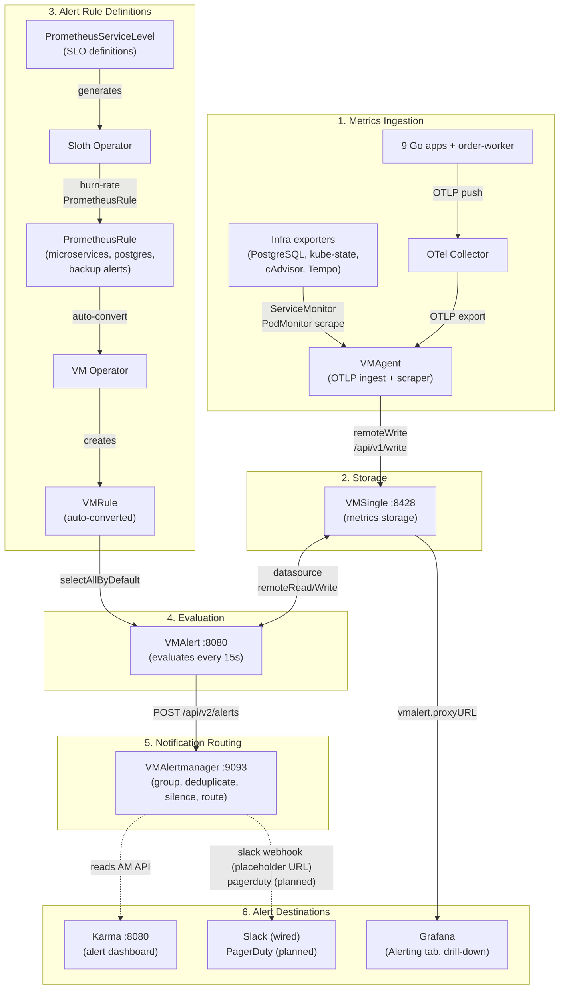
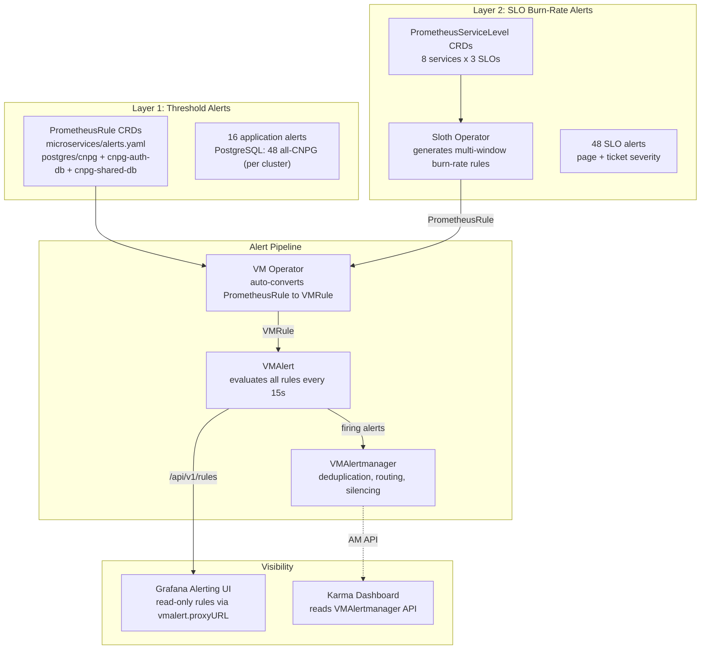
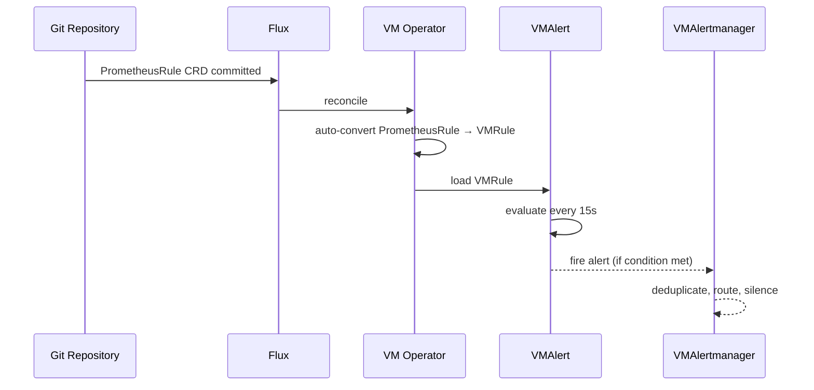

# Alerting Strategy

Two-layer alerting approach combining immediate threshold detection with SLO-based burn-rate alerts.

## Full Alerting Pipeline

End-to-end view of how metrics become alerts, from ingestion through evaluation to notification and visibility.



### Current State

- Stages 1-4 are fully operational (163 static alerts, 48 Sloth SLO burn-rate alerts — see the [alert catalog](alert-catalog.md)).
- Stage 5 (VMAlertmanager) routes by severity to `slack-default` (`#alerts`) and `slack-critical` (`#alerts-critical`), with `watchdog-null` for the Watchdog and inhibition rules to suppress cascades. **Caveat:** `slack_api_url` is a committed placeholder (`<SLACK_WEBHOOK_URL>`), so no notifications actually deliver until it is set — ideally injected via External Secrets / OpenBAO rather than inlined in `configRawYaml`.
- Stage 6: Grafana provides read-only rule visibility via `vmalert.proxyURL`. **Karma** is the dedicated alert dashboard (reads VMAlertmanager API directly). Slack receivers are wired (webhook URL pending injection); PagerDuty is planned.

## VictoriaMetrics vs Prometheus: Terminology Mapping

This project uses the **VictoriaMetrics stack** instead of Prometheus. VM Operator auto-converts Prometheus CRDs, so you write standard Prometheus resources but they run on VM components.

| Prometheus Ecosystem | VictoriaMetrics Equivalent | What It Does | Deployed? |
|---|---|---|---|
| Prometheus server | **VMSingle** `:8428` | Stores metrics, exposes PromQL-compatible API | Yes |
| Prometheus scraper | **VMAgent** | Scrapes targets via ServiceMonitor/PodMonitor | Yes |
| Prometheus rule evaluator | **VMAlert** `:8080` | Evaluates alert and recording rules | Yes |
| Alertmanager | **VMAlertmanager** `:9093` | Groups, deduplicates, silences, and routes alerts | Yes |
| PrometheusRule CRD | **VMRule** (auto-converted) | Defines alert/recording rules; VM Operator converts PrometheusRule to VMRule automatically | Yes |
| PrometheusServiceLevel | (Sloth generates PrometheusRule) | SLO definitions; Sloth only supports PrometheusRule format, VM Operator converts the output | Yes |

**Why write PrometheusRule instead of VMRule?** Sloth Operator only generates `PrometheusRule` CRDs. VM Operator's `disable_prometheus_converter: false` setting auto-converts all Prometheus CRDs to VM equivalents. This gives compatibility with the broader ecosystem while running entirely on VictoriaMetrics.

## Architecture



## Two-Layer Approach

### Layer 1: Threshold Alerts (Immediate Detection)

Direct metric threshold checks. Fire immediately when a condition is met.

**Application alerts** (`microservices/alerts.yaml`, 16 alerts, 5 groups — OTLP push pipeline, RFC-0014 P3):

| Group | Alerts | Examples |
|-------|--------|----------|
| Availability | 3 | `MicroserviceDown`, `MicroserviceAllInstancesDown` (both D-4 heartbeat-absence), `OtelMetricsPipelineExportFailures` |
| Errors | 4 | `MicroserviceHighErrorRate`, `MicroserviceErrorRateCritical`, `MicroserviceNoSuccessfulRequests`, `GrpcServerHighErrorRate` |
| Latency | 4 | `MicroserviceHighLatencyP95`, `MicroserviceHighLatencyP99`, `MicroserviceLatencyCritical`, `GrpcServerHighLatencyP95` |
| Traffic | 2 | `MicroserviceNoTraffic`, `MicroserviceApdexCritical` |
| Runtime | 3 | `MicroserviceGoroutineLeak`, `MicroserviceHighMemoryUsage`, `MicroserviceGCThrash` |

> The scrape-era **Saturation** group (`MicroserviceHighRequestsInFlight` / `…Critical`) retired with the cutover — otelgin v0.69 emits no `http.server.active_requests`. The two GC-pause alerts collapsed into `MicroserviceGCThrash` (no OTel GC-pause metric). `MicroserviceDown`/`…AllInstancesDown` moved from `up{}` scrape liveness to a `go_goroutine_count` heartbeat-absence check (D-4).

**PostgreSQL alerts** ([`prometheusrules/postgres/`](../../../kubernetes/infra/configs/monitoring/prometheusrules/postgres/README.md)): all CloudNativePG, chart-aligned rules deployed per cluster — `postgres/cnpg/` (`product-db` full set + operator-health singleton), `postgres/cnpg-auth-db/` (`auth-db` full HA set), `postgres/cnpg-shared-db/` (`shared-db` single-node subset). Backup alerts remain in `postgres/backup-alerts.yaml`. 48 rules total.

**Recording rules** (`microservices/recording-rules.yaml`):

Pre-aggregated metrics for dashboard and alert performance (records live under
the `app:` prefix — no `job` on the OTLP push path):
- `app:http_server_request_duration_seconds:rate5m` (per-service RPS)
- `app:http_server_request_duration_seconds:error_rate5m` (per-service 5xx rate)
- `app:http_server_request_duration_seconds:p95_5m` / `p99_5m` (latency percentiles)
- `app:http_server_request_duration_seconds:apdex5m` (Apdex score)
- `app_route:http_server_request_duration_seconds:rate5m` (per-endpoint breakdown)
- `app:rpc_server_call_duration_seconds:rate5m` / `:error_rate5m` / `:p95_5m` (gRPC east-west RED — new in RFC-0014)

> The scrape-era `job_app:request_in_flight:sum` in-flight record is **removed** — there is no OTel `http.server.active_requests` to aggregate.

### Layer 2: SLO Burn-Rate Alerts (Error Budget)

Multi-window multi-burn-rate methodology from Google SRE Workbook. Generated by **Sloth Operator** from `PrometheusServiceLevel` CRDs.

**Coverage**: 8 services x 3 SLOs = 24 SLOs, 48 alerts

SLO targets and SLI definitions are owned by the SLO docs (rendered from the mop
Helm chart defaults). All three SLIs are **ratio-based** (no `up{job=...}` probe).
See [SLO Targets](../slo/README.md#slo-targets) for the canonical table — in
summary: Availability 99.5% (non-5xx ratio), Latency 95.0% (requests < 500ms
ratio), Error Rate 99.0% (non-4xx/5xx ratio).

Each SLO generates 2 alerts:

| Alert | Window | Burn Rate | Severity | Action |
|-------|--------|-----------|----------|--------|
| Page | 5m/1h | 14.4x | critical | Wake someone up |
| Ticket | 30m/6h | 6x | warning | Fix within business hours |

**Why two layers?**

- Layer 1 catches **obvious failures** immediately (service down, error spike, disk full)
- Layer 2 catches **slow degradation** that burns error budget over time (slightly elevated latency, gradual error increase)
- Together they provide both **fast incident response** and **proactive SLO protection**

## Alert Flow



## Grafana Visibility

**VMAlert** holds the rules; **VMSingle** proxies `/api/v1/rules` to VMAlert via `vmalert.proxyURL`. Whether **Grafana > Alerting > Alert rules** lists them as **data source–managed (read-only)** depends on Grafana’s integration with the **metrics datasource type** (VictoriaMetrics plugin vs optional `prometheus` type). With **only** the VM plugin, that page may be **empty or incomplete** even when rules are firing — this is a **UI** limitation, not missing rules.

See [Grafana Alerting and datasource types](../grafana/datasources.md#grafana-alerting-and-datasource-types) for details and alternatives (VMAlert UI, Karma, `kubectl`).

## Manifest Locations

```
kubernetes/infra/configs/monitoring/
├── prometheusrules/
│   ├── microservices/
│   │   ├── alerts.yaml                     # Layer 1: application threshold alerts
│   │   └── recording-rules.yaml            # Pre-aggregated recording rules
│   └── postgres/                           # Layer 1: all-CNPG PrometheusRules (cnpg/ + cnpg-auth-db/ + cnpg-shared-db/)
└── victoriametrics/
    ├── vmalert.yaml                        # VMAlert (rule evaluator)
    └── vmalertmanager.yaml                 # VMAlertmanager (notification router)
```

**Layer 2 (SLO) definitions are not stored in this repo.** There is no
`configs/monitoring/slo/` tree. Each service's `PrometheusServiceLevel` CRD is
rendered by the **mop Helm chart** (`mop-chart-oci`, `ghcr.io/duynhlab`) when the
service's HelmRelease sets `slo.enabled: true`. Sloth then generates the
burn-rate `PrometheusRule`s from those CRDs. See [SLO System](../slo/README.md).

> **Collection configs** (what is collected, as opposed to *what fires*) live
> with the metrics docs: apps **push OTLP** (no ServiceMonitor); infra exporters
> are **scraped** via `ServiceMonitor` / `PodMonitor`. See
> [application metrics](../metrics/metrics-apps.md) and
> [infrastructure metrics](../metrics/metrics-infra.md). This page and the
> [Alert Catalog](./alert-catalog.md) are the source of truth for the alert and
> recording rules those metrics feed.

## Alert Dashboard: Karma

[Karma](https://github.com/prymitive/karma) is the dedicated alert dashboard, reading directly from VMAlertmanager's Alertmanager-compatible API.

**Why Karma:**

- Industry-standard Alertmanager dashboard used widely in production SRE teams
- Reads VMAlertmanager API natively (zero config on AM side)
- Silence management from the UI (create/expire silences for maintenance windows)
- Multi-instance aggregation (production HA Alertmanager support)
- Alert history visualization (24h trend blocks for incident review)

**Deployment:** Raw K8s manifest in `kubernetes/infra/configs/monitoring/karma/`.

**Configuration:** Single environment variable pointing to VMAlertmanager:

```
ALERTMANAGER_URI=http://vmalertmanager-victoria-metrics.monitoring.svc:9093
```

For a detailed comparison of Karma against other alert dashboard tools (Alerta, UAR, Siren), see [Alert Dashboard Comparison](dashboard-comparison.md).

## Future Roadmap

| Phase | Scope | Status |
|-------|-------|--------|
| Layer 1: Application alerts | 16 alerts (RED + gRPC + Golden Signals) | Implemented |
| Layer 1: PostgreSQL alerts | 48 alerts (all CNPG: product-db + auth-db + shared-db per-cluster, + backups) | Implemented |
| Layer 2: SLO alerts | 48 alerts (8 services x 3 SLOs x 2 severities) | Implemented |
| Alert dashboard | Karma reading VMAlertmanager API | Implemented |
| Layer 1: Database connection pool | PgDog pooler saturation alerts | Planned |
| Layer 1: Infrastructure | Node memory/disk/PID pressure, NotReady, unschedulable | Implemented (`kubernetes/node-alerts.yaml`) |
| Layer 1: Kubernetes | Pod OOM, CrashLoopBackOff, pending pods | Implemented (`kubernetes/pod-resources-alerts.yaml`, `workload-alerts.yaml`) |
| Integration | Slack routing in VMAlertmanager (severity-based receivers) | Wired (webhook URL placeholder — inject via secret) |
| Integration | PagerDuty routing in VMAlertmanager | Planned |

## Related Documentation

- [Alert Catalog](./alert-catalog.md) -- every deployed alert (163 rules + SLO burn-rate) by domain, with metric, impact, and coverage-gap analysis
- [Application metrics (RED)](../metrics/metrics-apps.md) -- the metrics these alerts fire on + the microservices OTLP push pipeline
- [Infrastructure metrics (USE)](../metrics/metrics-infra.md) -- the USE coverage these Kubernetes/Valkey alerts back
- [Alert Dashboard Comparison](dashboard-comparison.md) -- deep-dive tool comparison (Karma, Alerta, UAR, Siren, Grafana)
- [Microservices Alerts Runbook](../runbooks/microservices-alerts.md) -- per-alert investigation and resolution
- [SLO System](../slo/README.md) -- Sloth Operator, SLO targets, error budgets
- [SLO Burn-Rate Alerts](./slo-burn-rate-alerts.md) -- burn-rate methodology details
- [SLO Fundamentals](../slo/fundamentals.md) -- SLA/SLO/SLI/Error Budget primer
- [Grafana Datasources](../grafana/datasources.md) -- how read-only rules display works
- [Observability Deep Dive](../runbooks/observability-deep-dive.md) -- theory and interview prep

---

_Last updated: 2026-07-11 — Zalando→CNPG migration: PostgreSQL is all-CNPG (48 alerts per-cluster); totals aligned with the alert catalog (163 static + 48 Sloth)._
