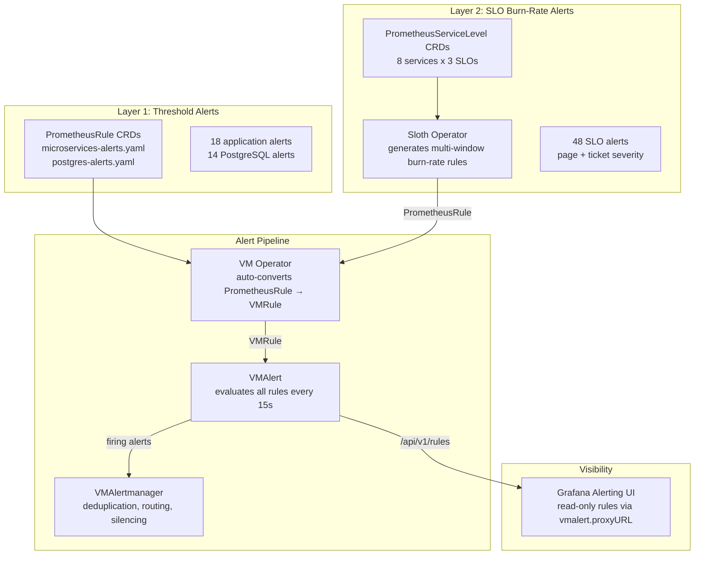
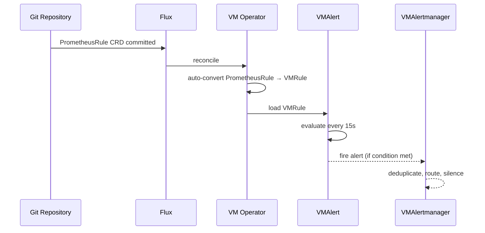

# Alerting Strategy

Two-layer alerting approach combining immediate threshold detection with SLO-based burn-rate alerts.

## Architecture



## Two-Layer Approach

### Layer 1: Threshold Alerts (Immediate Detection)

Direct metric threshold checks. Fire immediately when a condition is met.

**Application alerts** (`microservices-alerts.yaml`, 18 alerts, 6 groups):

| Group | Alerts | Examples |
|-------|--------|----------|
| Availability | 3 | `MicroserviceDown`, `MicroserviceHighRestartRate`, `MicroserviceAllReplicasDown` |
| Errors | 3 | `MicroserviceHighErrorRate`, `MicroserviceErrorRateSpike`, `MicroserviceHighClientErrorRate` |
| Latency | 3 | `MicroserviceHighP95Latency`, `MicroserviceHighP99Latency`, `MicroserviceLatencyDegradation` |
| Traffic | 3 | `MicroserviceNoTraffic`, `MicroserviceTrafficDrop`, `MicroserviceHighTraffic` |
| Saturation | 3 | `MicroserviceHighInFlightRequests`, `MicroserviceHighBandwidth`, `MicroserviceConnectionPoolSaturation` |
| Go Runtime | 3 | `MicroserviceHighGoroutineCount`, `MicroserviceHighMemoryUsage`, `MicroserviceFrequentGC` |

**PostgreSQL alerts** (`postgres-alerts.yaml`, 14 alerts, 5 groups):

| Group | Alerts | Examples |
|-------|--------|----------|
| Availability | 5 | `PostgresDown`, `CnpgDown`, `PostgresReplicationLagHigh` |
| Performance | 3 | `PostgresHighConnectionUsage`, `PostgresSlowQueries` |
| Storage | 2 | `PostgresDiskSpaceLow`, `PostgresWALSizeHigh` |
| Backup | 2 | `PostgresBackupFailed`, `PostgresBackupStale` |
| Maintenance | 2 | `PostgresHighDeadTuples`, `PostgresLongRunningTransactions` |

**Recording rules** (`microservices-recording-rules.yaml`):

Pre-aggregated metrics for dashboard and alert performance:
- `job_app:request_duration_seconds:rate5m` (per-service RPS)
- `job_app:request_duration_seconds:error_rate5m` (per-service error rate)
- `job_app:request_duration_seconds:p95_5m` / `p99_5m` (latency percentiles)
- `job_app:apdex:ratio_rate5m` (Apdex score)
- `job_app:request_in_flight:sum` (in-flight requests)

### Layer 2: SLO Burn-Rate Alerts (Error Budget)

Multi-window multi-burn-rate methodology from Google SRE Workbook. Generated by **Sloth Operator** from `PrometheusServiceLevel` CRDs.

**Coverage**: 8 services x 3 SLOs = 24 SLOs, 48 alerts

| SLO Type | Target | SLI Query |
|----------|--------|-----------|
| Availability | 99.5% | `up{job="microservices"}` |
| Latency (P95) | 99.5% (< 500ms) | `request_duration_seconds_bucket{le="0.5"}` |
| Error Rate | 99.0% | `request_duration_seconds_count{code!~"5.."}` |

Each SLO generates 2 alerts:

| Alert | Window | Burn Rate | Severity | Action |
|-------|--------|-----------|----------|--------|
| Page | 5m/1h | 14.4x | critical | Wake someone up |
| Ticket | 30m/6h | 6x | warning | Fix within business hours |

**Why two layers?**

- Layer 1 catches **obvious failures** immediately (service down, error spike, disk full)
- Layer 2 catches **slow degradation** that burns error budget over time (slightly elevated latency, gradual error increase)
- Together they provide both **fast incident response** and **proactive SLO protection**

## Alert Flow



## Grafana Visibility

All rules appear in **Grafana > Alerting > Alert rules** as **data source-managed (read-only)**. This works because VMSingle proxies `/api/v1/rules` to VMAlert via `vmalert.proxyURL`.

See [Grafana Datasources](../grafana/datasources.md) for technical details.

## Manifest Locations

```
kubernetes/infra/configs/monitoring/
├── prometheusrules/
│   ├── microservices-alerts.yaml           # Layer 1: 18 application alerts
│   ├── microservices-recording-rules.yaml  # Pre-aggregated recording rules
│   └── postgres-alerts.yaml                # Layer 1: 14 PostgreSQL alerts
├── slo/
│   ├── auth.yaml                           # Layer 2: SLO definitions per service
│   ├── user.yaml
│   ├── product.yaml
│   ├── cart.yaml
│   ├── order.yaml
│   ├── review.yaml
│   ├── notification.yaml
│   └── shipping.yaml
└── victoriametrics/
    ├── vmalert.yaml                        # VMAlert (rule evaluator)
    └── vmalertmanager.yaml                 # VMAlertmanager (notification router)
```

## Future Roadmap

| Phase | Scope | Status |
|-------|-------|--------|
| Layer 1: Application alerts | 18 alerts (RED + Golden Signals) | Implemented |
| Layer 1: PostgreSQL alerts | 14 alerts (availability, performance, storage) | Implemented |
| Layer 2: SLO alerts | 48 alerts (8 services x 3 SLOs x 2 severities) | Implemented |
| Layer 1: Database connection pool | PgBouncer/PgCat saturation alerts | Planned |
| Layer 1: Infrastructure | Node CPU/memory/disk pressure | Planned |
| Layer 1: Kubernetes | Pod OOM, CrashLoopBackOff, pending pods | Planned |
| Integration | PagerDuty/Slack routing in VMAlertmanager | Planned |

## Related Documentation

- [Microservices Alerts Runbook](../runbooks/microservices-alerts.md) -- per-alert investigation and resolution
- [SLO System](../slo/README.md) -- Sloth Operator, SLO targets, error budgets
- [SLO Alerting](../slo/alerting.md) -- burn-rate methodology details
- [Grafana Datasources](../grafana/datasources.md) -- how read-only rules display works
- [Observability Deep Dive](../runbooks/observability-deep-dive.md) -- theory and interview prep
