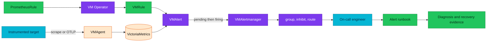
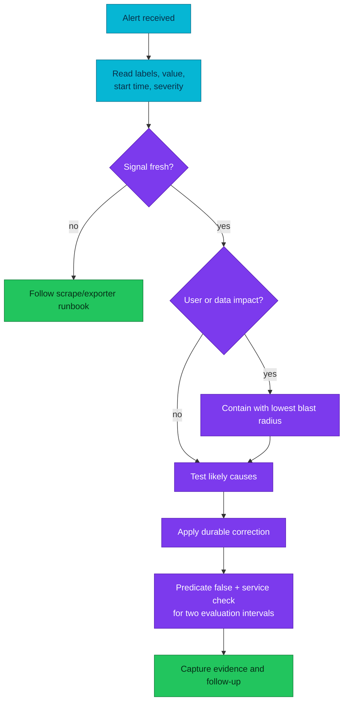

# Alert lifecycle and runbook engineering

An alert is useful only when its signal is trustworthy, its impact is clear,
and an on-call engineer can take a safe next step.

| Quick facts | |
|---|---|
| **Status** | Deployed operating model for VictoriaMetrics alerting |
| **Rule API** | `PrometheusRule`; VM Operator converts it to `VMRule` |
| **Evaluator** | VMAlert, using VictoriaMetrics as its datasource |
| **Router** | VMAlertmanager; grouping, inhibition, silencing, and receivers |
| **Runbook source** | [`docs/observability/runbooks/`](../runbooks/README.md) |
| **Rule catalog** | [Alert catalog](alert-catalog.md) |
| **Core principle** | Page on symptoms; use lower-severity signals to explain causes |

## Overview

Alerting is a chain, not a YAML expression. A rule may parse while selecting no
series. A metric may exist while its labels make aggregation wrong. A predicate
may be true while `for` prevents firing. A firing alert may never reach a human
because routing or receiver delivery is broken.

Each arrow is a separate failure domain. Debug the chain in order; do not jump
from “no notification” directly to changing the alert threshold.

## Alert states

| State | Meaning | What it proves |
|---|---|---|
| Inactive | Predicate is false, or the query returns no matching vector | Nothing about scrape coverage by itself |
| Pending | Predicate is true but has not satisfied `for` | Signal and expression are currently active |
| Firing | Predicate stayed true for `for` | VMAlert evaluation completed |
| Resolved | A previously firing alert became inactive | Recovery at the rule layer, not necessarily user recovery |
| Silenced | Alert matches a VMAlertmanager silence | Notification suppressed; condition still exists |
| Inhibited | A higher-level alert suppresses it | Dependency/cascade policy is working |

An empty vector and a healthy zero are not equivalent. Use explicit absence
guards when losing the exporter would otherwise make a critical rule disappear.

## Build a trustworthy alert

### 1. Start from impact

Write one sentence that a user or operator would notice. Examples:

- Long-retention log/trace SQL is unavailable.
- PostgreSQL writes are unavailable.
- Telemetry is being dropped after retry exhaustion.

If the sentence describes an internal cause such as high CPU, it normally
belongs at warning/info severity or on a dashboard unless it predicts a known,
near-term impact.

### 2. Define the signal contract

Before writing PromQL/MetricsQL, record:

- Producer and scrape/ingest path.
- Metric type: counter, gauge, histogram, or recording rule.
- Expected labels and number of series.
- Reset and missing-series behaviour.
- Unit and safe aggregation.

For a counter, use `rate` or `increase` over a window. For a gauge, do not apply
`rate` merely because the value changes. Aggregate only after deciding which
labels identify independent failure domains.

### 3. Test the query in layers

Evaluate in this order:

1. Metric name without filters.
2. Label discovery.
3. Filtered selector.
4. Each aggregation or binary-operation side.
5. Full expression without threshold.
6. Full predicate.

This catches silent failures such as a wrong `job` value, many-to-many joins,
or an aggregation that merges replicas which should page independently.

### 4. Choose severity and `for`

| Severity | Use | Expected response |
|---|---|---|
| critical | Active or imminent service/data-loss impact | Page and act immediately |
| warning | Degradation, reduced redundancy, or capacity runway | Investigate during the defined response window |
| info | Context or early signal that should not wake anyone | Correlate, dashboard, or create a ticket |

`for` is a noise filter, not a substitute for a stable query. Choose it from
the shortest harmful duration and the normal recovery time. A data-loss
counter can justify a short window; a transient reconcile error normally needs
longer persistence.

### 5. Design missing-signal behaviour

For every rule, ask what happens if its scrape target disappears:

- A dedicated `absent()` rule may own the blind spot.
- A data rule may intentionally stay silent while the scrape-health alert fires.
- An expression may use a zero fallback only when absence truly means zero.

Do not add `OR vector(0)` mechanically. It can turn missing telemetry into a
false healthy state or erase the labels needed for routing.

## Validation levels

Use a precise level in catalogs, runbooks, and audit evidence:

| Level | Required evidence | Claim allowed |
|---|---|---|
| `static-valid` | Manifest renders, rule parses, runbook URL resolves | Definition is structurally valid |
| `live-signal` | Runtime selector returns expected labels/cardinality | The rule has data to evaluate |
| `predicate-exercised` | Safe, bounded drill makes the full predicate true | Query semantics match the intended condition |
| `alert-observed` | Pending/firing state and Alertmanager receipt observed | Evaluation and routing work through Alertmanager |

Receiver delivery is a fifth, environment-specific check. A configured Slack
route with a placeholder webhook is not verified notification delivery.

## Runbook contract

The canonical template is [`runbooks/_TEMPLATE.md`](../runbooks/_TEMPLATE.md).
A runbook is an executable decision aid, not a duplicate of the alert catalog.

### Quick facts

Include alert name, severity, rule source, full expression or an exact link to
it, `for`, dashboard, affected component, and last live verification. State
whether the procedure applies to local Kind, production, or both.

### Meaning and impact

Explain:

- What condition the query actually detects.
- What it does not detect.
- Immediate impact and the next failure if it persists.
- Whether redundancy remains.

### Diagnosis

Order checks by safety and information value:

1. Confirm the alert labels, value, start time, and current state.
2. Confirm scrape/signal freshness.
3. Identify the affected failure domain.
4. Correlate metrics with logs, traces, Kubernetes events, and controller state.
5. Test competing hypotheses with bounded queries.

Every command must name its namespace/context assumptions and avoid unbounded
log or database scans.

### Mitigation and recovery

Separate immediate containment from the durable fix. For every state-changing
step, state:

- Blast radius.
- Preconditions.
- Rollback or stop condition.
- Verification query.

Restarting a pod is not root-cause resolution. Use it only when the evidence
shows the process is wedged and the data/control plane can safely tolerate the
restart.

### Escalation

Define a measurable boundary: elapsed time, data-loss evidence, number of
failed replicas, remaining disk runway, or inability to restore redundancy.
List the sanitized evidence the next responder needs.

## On-call workflow

After the metric predicate clears, perform the service-level check. A resolved
database alert can coexist with queued work, stale telemetry, or replicas still
catching up.

## Safe command classes

| Class | Examples | Documentation requirement |
|---|---|---|
| Read-only | `get`, bounded logs, catalog queries, PromQL | Timeout, namespace, expected result |
| Reversible local Kind | Temporary table, bounded test traffic | Unique prefix, cleanup, rollback |
| Destructive incident-only | Failover, partition drop, PVC/object deletion | Explicit danger, approval, backup and recovery prerequisites |

Never execute destructive snippets as a documentation test. Validate their
syntax and decision gates; rehearse only in a dedicated disaster-recovery drill.

## Alert-to-runbook audit

For each deployed rule, the audit checks:

- Rule name matches the runbook title or documented shared-runbook mapping.
- `runbook_url` resolves to the canonical file.
- Severity, expression, `for`, labels, and dashboard agree.
- Commands query the current component names and namespaces.
- Current/planned/historical wording matches manifests and design records.
- Kind evidence supports the declared validation level.

Manual workflows without an alert remain valid, but their index row must say
`manual` rather than inflating deployed alert coverage.

## Domain entry points

- [ClickHouse alerts and runbooks](../runbooks/clickhouse/README.md)
- [PostgreSQL alerts and runbooks](../runbooks/postgresql/README.md)
- [Runbook index](../runbooks/README.md)
- [SLO burn-rate alerts](slo-burn-rate-alerts.md)
- [Alert catalog](alert-catalog.md)

## References

- [VictoriaMetrics alerting](https://docs.victoriametrics.com/victoriametrics/vmalert/)
- [Prometheus alerting rules](https://prometheus.io/docs/prometheus/latest/configuration/alerting_rules/)
- [Prometheus alerting practices](https://prometheus.io/docs/practices/alerting/)
- [Alertmanager concepts](https://prometheus.io/docs/alerting/latest/alertmanager/)

---
_Last updated: 2026-09-09 — validation levels and the alert-to-runbook contract were made explicit._
