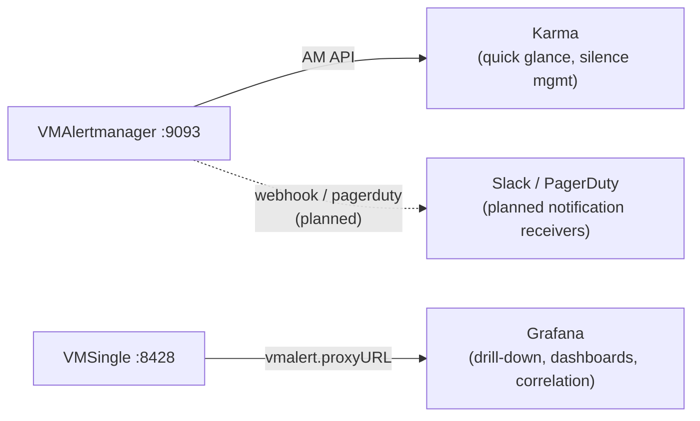

# Alert Dashboard Tool Comparison

Deep-dive comparison of alert dashboard and receiver tools evaluated for this project. This document serves as a reference for future re-evaluation when requirements change.

**Decision date:** March 2026
**Chosen tool:** Karma
**Stack context:** VictoriaMetrics (VMAlert + VMAlertmanager), local Kind cluster, GitOps via Flux

---

## Tools Evaluated

| Tool | Type | Language | License | Latest Version | Active? |
|------|------|----------|---------|----------------|---------|
| [Karma](https://github.com/prymitive/karma) | Alertmanager API dashboard | Go + TypeScript | Apache-2.0 | v0.128 (Mar 2026) | Very active |
| [Alerta](https://github.com/alerta/alerta) | Full alert aggregation platform | Python | Apache-2.0 | v9.0.4 (Sep 2024) | Slowing |
| [UAR](https://github.com/jamesread/uncomplicated-alert-receiver) | Webhook receiver + UI | Go | AGPL-3.0 | v1.2.0 | Small project |
| [Siren](https://github.com/shamubernetes/siren) | Lightweight AM dashboard | TypeScript (Bun) | GPL-3.0 | v1.4.26 (Mar 2026) | Active, new |
| Grafana built-in | Alerting tab (already deployed) | -- | AGPL-2.0 | -- | N/A |

---

## Feature Matrix

| Feature | Karma | Alerta | UAR | Siren | Grafana |
|---------|-------|--------|-----|-------|---------|
| Reads Alertmanager API directly | Yes | No (webhook) | No (webhook) | Yes | Via proxyURL |
| Requires VMAlertmanager config change | No | Yes (add webhook receiver) | Yes (add webhook receiver) | No | No |
| Silence management (create/expire) | Yes | Yes | No | No | Yes |
| Multi-Alertmanager instance | Yes | Yes (multi-source) | No | Yes | No |
| Alert history / trends | Yes (24h blocks) | Yes (full history) | No | No | Limited |
| Label-based filtering | Yes | Yes | No | Severity + state | Yes |
| Alert grouping | Yes (AM group_by) | Yes | Severity only | By name | By folder/rule |
| Requires external database | No | Yes (Postgres/MongoDB) | No | No | No |
| Helm chart available | Yes (wiremind) | Yes (alerta-web) | No | No | N/A |
| K8s health probes | Yes | Yes | No | Yes (/livez, /readyz) | N/A |
| Dark mode | Yes | Partial | No | Yes | Yes |
| Mobile responsive | Partial | Yes | No | Yes | Yes |
| Production adoption | Widespread | Niche | Minimal | None yet | Widespread |

---

## Detailed Assessments

### Karma (Selected)

- **Website:** https://karma-dashboard.io/
- **Repo:** https://github.com/prymitive/karma
- **Helm:** `helm repo add wiremind https://wiremind.github.io/wiremind-helm-charts`

**Architecture:** Stateless Go binary that polls Alertmanager API endpoints. No database, no persistent storage. Renders a real-time dashboard showing all firing/silenced/inhibited alerts with grouping and filtering.

**Key strengths:**

- Industry standard for Alertmanager dashboards in production SRE teams
- VMAlertmanager exposes the same Alertmanager API, so Karma works out of the box
- Silence management directly from the UI (critical for maintenance windows)
- Multi-instance aggregation supports production HA Alertmanager setups
- 24-hour alert history blocks visualize firing patterns for incident review
- Single env var configuration: `ALERTMANAGER_URI`

**Key weaknesses:**

- Wiremind Helm chart lags behind upstream (app v0.83 vs latest v0.128); deploy via raw manifest or pin image tag
- Read-only for alert data (cannot acknowledge or assign alerts to team members)

**Production relevance:** High. Karma is what most SRE teams use alongside Alertmanager. Learning it translates directly to production work.

### Alerta

- **Website:** https://alerta.io/
- **Repo:** https://github.com/alerta/alerta
- **Helm:** `helm repo add alerta-web https://hayk96.github.io/alerta-web`
- **Docs:** https://docs.alerta.io/

**Architecture:** Full-stack platform with its own API server, web console, and database (PostgreSQL or MongoDB). Receives alerts via webhooks from multiple sources (Prometheus, Nagios, Zabbix, CloudWatch, custom). Provides its own deduplication, correlation, and escalation logic independent of Alertmanager.

**Key strengths:**

- Multi-source alert aggregation (heterogeneous monitoring environments)
- User management with OAuth, SAML2, LDAP
- Plugin ecosystem for forwarding alerts (Slack, PagerDuty, HipChat)
- Alert correlation and de-duplication across different monitoring systems
- Customer/multi-tenant views

**Key weaknesses:**

- Requires its own database (PostgreSQL or MongoDB) -- adds operational complexity
- Last release Sep 2024 (v9.0.4), development activity has slowed significantly
- Overkill for single-source environments (this project only has VictoriaMetrics)
- Requires adding a webhook receiver to VMAlertmanager config
- Heavier deployment footprint (app + DB + config)

**Production relevance:** Medium. Useful in organizations with heterogeneous monitoring (Nagios + Prometheus + CloudWatch). Less relevant for VictoriaMetrics/Prometheus-only environments.

### UAR (Uncomplicated Alert Receiver)

- **Website:** https://jamesread.github.io/uncomplicated-alert-receiver/
- **Repo:** https://github.com/jamesread/uncomplicated-alert-receiver
- **Image:** `ghcr.io/jamesread/uncomplicated-alert-receiver:1.2.0`

**Architecture:** Single Go binary that acts as a webhook receiver. Alertmanager sends POST requests to `/alerts`. UAR renders alerts in a minimal web UI with auto-refresh, designed for TV/heads-up displays.

**Key strengths:**

- Zero configuration, zero storage, zero external dependencies
- Auto-refresh progress bar (proves the page hasn't frozen on a TV display)
- "Last result" indicator (shows if Alertmanager stopped sending)
- Severity color-coding (critical, severe, warning, important, info)
- Works without internet access

**Key weaknesses:**

- No silence management, no advanced filtering
- No Helm chart (need to write K8s manifest manually)
- AGPL-3.0 license (copyleft)
- Very small project (single contributor, limited community)
- Requires adding a webhook receiver to VMAlertmanager config

**Production relevance:** Low. Useful as a NOC/TV display supplement, but no team collaboration or operational features.

### Siren

- **Repo:** https://github.com/shamubernetes/siren
- **Image:** Container available on GHCR

**Architecture:** Lightweight TypeScript (Bun) application that polls Alertmanager API. Renders a modern, responsive dashboard with severity filtering and alert grouping.

**Key strengths:**

- Modern, clean UI with dark mode and mobile responsive design
- Smart filtering by severity and state (firing/silenced/inhibited)
- Alert grouping by name
- Stable deep links to individual alerts (good for PagerDuty/runbook integration)
- K8s health probes (/livez, /readyz with AM connectivity check)
- Watchdog monitoring

**Key weaknesses:**

- Very new project (Dec 2025, ~19 stars)
- No silence management (read-only dashboard)
- No Helm chart
- GPL-3.0 license (copyleft)
- Unproven in production environments

**Production relevance:** Low currently. Could grow into a Karma alternative, but too early to adopt for production.

### Grafana Built-in (Already Deployed)

**Architecture:** Already running in the cluster. VMSingle proxies `/api/v1/rules` and `/api/v1/alerts` to VMAlert via `vmalert.proxyURL`. Alerts appear as data-source-managed (read-only) rules in the Grafana Alerting tab.

**Key strengths:**

- Already deployed, zero additional work
- Silence management available
- Integrated with dashboards for drill-down correlation
- Familiar UI for most engineers

**Key weaknesses:**

- Not optimized as an alert dashboard (requires navigating through menus)
- Not suitable as a heads-up display or quick-glance dashboard
- Alert list UI is less focused than dedicated tools (mixed with Grafana-managed alerts)

**Production relevance:** High as a complementary tool for drill-down, but not as a primary alert dashboard.

---

## Decision Rationale

**Why Karma over alternatives:**

1. **Zero AM config change** -- Karma reads VMAlertmanager API directly. No need to add webhook receivers. UAR and Alerta both require modifying VMAlertmanager `configRawYaml`.
2. **Silence management** -- Creating and expiring silences from the dashboard is essential in production (planned maintenance, known issues). Only Karma and Grafana offer this. UAR and Siren do not.
3. **Production skill transfer** -- Karma is the de facto standard Alertmanager dashboard in SRE teams. Learning it on a homelab translates directly to production work.
4. **Lightweight** -- Single stateless container, no database, single env var. Same complexity as UAR/Siren but with significantly more features.
5. **Multi-instance ready** -- When moving to production with HA Alertmanager (multiple replicas), Karma aggregates them automatically. This is a skill and architecture that scales.
6. **Active maintenance** -- v0.128 (Mar 2026), frequent releases, healthy community.

**Karma + Grafana complementary setup:**

Karma is the "quick glance + operate" tool. Grafana is the "investigate + correlate" tool. They serve different purposes and complement each other.

---

## When to Reconsider

Re-evaluate this decision if any of the following conditions change:

| Trigger | Consider | Reason |
|---------|----------|--------|
| Multi-source monitoring (add Nagios, CloudWatch, Datadog) | **Alerta** | Alerta excels at aggregating alerts from heterogeneous monitoring systems |
| Need TV/NOC display with auto-refresh indicator | **UAR** or **Siren** | Purpose-built for heads-up display use cases |
| Team collaboration (assign alerts, add comments, acknowledge) | **Notificator** ([repo](https://github.com/SoulKyu/notificator)) | Real-time team collaboration features that Karma lacks |
| Siren matures (1000+ stars, silence support, production adoption) | **Siren** | Modern UI, lighter weight; currently too new |
| VMAlertmanager adds native UI | **Built-in** | Eliminate external dependency entirely |

---

## References

| Tool | Repository | Documentation | Helm Chart |
|------|-----------|---------------|------------|
| Karma | [prymitive/karma](https://github.com/prymitive/karma) | [karma-dashboard.io](https://karma-dashboard.io/) | [wiremind/karma](https://artifacthub.io/packages/helm/wiremind/karma) |
| Alerta | [alerta/alerta](https://github.com/alerta/alerta) | [docs.alerta.io](https://docs.alerta.io/) | [alerta-web](https://hayk96.github.io/alerta-web/) |
| UAR | [jamesread/uncomplicated-alert-receiver](https://github.com/jamesread/uncomplicated-alert-receiver) | [Docs](https://jamesread.github.io/uncomplicated-alert-receiver/) | N/A |
| Siren | [shamubernetes/siren](https://github.com/shamubernetes/siren) | README | N/A |
| Notificator | [SoulKyu/notificator](https://github.com/SoulKyu/notificator) | README | N/A |
