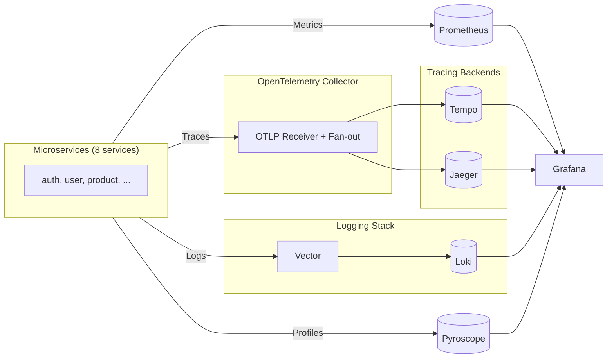

# APM (Application Performance Monitoring) Documentation

## Quick Summary

**Objectives:**
- Understand the complete APM stack (Metrics, Tracing, Logging, Profiling)
- Learn how to deploy and configure all APM components
- Integrate APM into microservices for comprehensive observability

**Learning Outcomes:**
- 4 pillars of observability: Metrics, Traces, Logs, Profiles
- How APM components work together (correlation)
- Service integration patterns with middleware
- Accessing and querying APM data in Grafana

**Keywords:**
APM, Observability, Metrics, Distributed Tracing, Structured Logging, Continuous Profiling, Correlation, Trace-ID, OpenTelemetry, Tempo, Loki, Vector, Pyroscope, Grafana

**Technologies:**
- Grafana Tempo (distributed tracing)
- Jaeger (distributed tracing - alternative UI)
- OpenTelemetry Collector (trace fan-out)
- Vector + Loki (log aggregation)
- Pyroscope (continuous profiling)
- OpenTelemetry (tracing standard)
- Zap (structured logging)
- Prometheus (metrics - already implemented)

## Overview

This project implements a comprehensive APM solution with four pillars:

1. **Metrics** - Prometheus metrics (already implemented)
2. **Distributed Tracing** - Grafana Tempo with OpenTelemetry
3. **Structured Logging** - JSON logs with trace-id correlation via Vector → Loki
4. **Continuous Profiling** - Pyroscope for CPU, heap, lock, and goroutine profiling

## Deployment (GitOps)

**APM stack is deployed automatically via Flux Operator:**

**Flux Kustomization:** `configs-local` ([kubernetes/clusters/local/configs.yaml](../../../kubernetes/clusters/local/configs.yaml))
- **Source:** OCI artifact `mop-registry:5000/flux-infra-sync:local`
- **Manifests:** `kubernetes/infra/configs/apm/`
- **Reconciliation:** Every 10 minutes (automatic)
- **Dependencies:** `controllers-local` must be ready first (operators/CRDs)

**Components deployed:**
- Tempo (raw manifests) - Distributed tracing backend
- Pyroscope (raw manifests) - Continuous profiling
- Loki (raw manifests) - Log aggregation
- Jaeger (HelmRelease) - Alternative tracing UI
- Vector (HelmRelease) - Log collection agent (DaemonSet)
- OpenTelemetry Collector (HelmRelease) - Trace fan-out

**Manual reconciliation (if needed):**
```bash
# Trigger Flux reconciliation
flux reconcile kustomization configs-local --with-source

# Check deployment status
flux get kustomizations
kubectl get pods -n monitoring  # Tempo, Jaeger, OTel, Loki, Pyroscope
kubectl get pods -n kube-system  # Vector DaemonSet

# Check HelmReleases
kubectl get helmreleases -n monitoring
kubectl get helmreleases -n kube-system
```

**Verification:**
```bash
# Check all APM pods are running
kubectl get pods -n monitoring | grep -E "tempo|jaeger|loki|pyroscope|otel"
kubectl get pods -n kube-system | grep vector

# Check ServiceMonitors (Prometheus scraping)
kubectl get servicemonitors -n monitoring
```

**Legacy deployment:** Removed. APM stack is managed via Flux GitOps in this repository.

## Architecture



**Key Points:**
- Applications send traces to OpenTelemetry Collector
- OTel Collector fans out traces to both Tempo and Jaeger
- Both tracing backends are accessible via Grafana datasources
- Jaeger also has its own standalone UI at http://localhost:16686

## Components

### 1. Distributed Tracing (Tempo + Jaeger)

**Purpose**: End-to-end request tracing across microservices

**Technology**: 
- Grafana Tempo - Primary tracing backend with TraceQL
- Jaeger - Alternative UI with service dependency graph
- OpenTelemetry Collector - Trace fan-out layer

**Features**:
- Automatic span creation for HTTP requests
- W3C Trace Context propagation
- Trace-to-logs correlation
- Trace-to-metrics correlation
- Dual backend support (Tempo + Jaeger)

**Configuration**:
- OTel Collector endpoint: `otel-collector-opentelemetry-collector.monitoring.svc.cluster.local:4318`
- OTLP HTTP protocol
- Service name: auto-detected from Kubernetes pod
- Sampling: 10% (production), 100% (development)
- Request filtering: health/metrics endpoints skipped
- Graceful shutdown: automatic span flushing

**Environment Variables**:
- `OTEL_SAMPLE_RATE`: Sampling rate (0.0-1.0, default: 0.1)
- `ENV`: Environment (development=100% sampling, others=10%)
- `OTEL_COLLECTOR_ENDPOINT`: OTel Collector endpoint (not Tempo directly)

**Deployment**:
- Deployed automatically via Flux HelmRelease
- Files: `kubernetes/infra/configs/apm/tempo/`
- Manual reconciliation: `flux reconcile kustomization configs-local --with-source`

**Access**:
- Tempo via Grafana: http://localhost:3000 (Explore > Tempo)
- Jaeger UI: http://localhost:16686

📖 See [jaeger.md](./jaeger.md) for Jaeger-specific documentation

### 2. Structured Logging (Vector + Loki)

**Purpose**: Centralized log aggregation with trace-id correlation

**Technology**: Vector (log collection) + Loki v3.6.2 (log storage with pattern ingestion)

**Features**:
- JSON log parsing
- Trace-id extraction and enrichment
- Service name and namespace labels
- Log-to-trace correlation
- Pattern ingestion for Grafana Logs Drilldown
- Automatic log level detection

**Configuration**:
- Vector collects logs from all pods
- Parses JSON logs and extracts trace-id
- Sends to Loki with labels for correlation
- Loki v3.6.2 with pattern ingestion and level detection enabled

**Deployment**:
- Deployed automatically via Flux (Loki: Deployment, Vector: HelmRelease DaemonSet)
- Files: `kubernetes/infra/configs/apm/loki/`, `kubernetes/infra/configs/apm/vector/`
- Manual reconciliation: `flux reconcile kustomization configs-local --with-source`

### 3. Continuous Profiling (Pyroscope)

**Purpose**: CPU, heap, lock contention, and goroutine profiling

**Technology**: Pyroscope

**Features**:
- CPU profiling
- Heap profiling (allocations, in-use)
- Goroutine profiling
- Mutex and block profiling
- Flamegraph visualization

**Configuration**:
- Pyroscope endpoint: `http://pyroscope.monitoring.svc.cluster.local:4040`
- Service name and namespace tags

**Deployment**:
- Deployed automatically via Flux (Deployment + ConfigMap)
- Files: `kubernetes/infra/configs/apm/pyroscope/`
- Manual reconciliation: `flux reconcile kustomization configs-local --with-source`

## Quick Start

Deploy all APM components (GitOps):

```bash
make flux-push
make flux-sync
```

APM components are part of `kubernetes/infra/configs/apm/` and are applied by `configs-local`.

## Service Integration

All services automatically include:

1. **Tracing Middleware**: Creates spans for HTTP requests
2. **Logging Middleware**: Structured JSON logs with trace-id
3. **Profiling**: Continuous profiling enabled on startup

### Middleware Order

```go
// Tracing middleware (must be first for context propagation)
r.Use(middleware.TracingMiddleware())

// Logging middleware
r.Use(middleware.LoggingMiddleware(logger))

// Prometheus middleware
r.Use(middleware.PrometheusMiddleware())
```

## Trace-ID Propagation

Trace-IDs are propagated via:
- **W3C Trace Context**: `traceparent` header (primary)
- **X-Trace-ID**: Custom header (fallback)

Trace-IDs are:
- Generated if not present in request
- Included in all log entries
- Stored in spans
- Added to response headers

## Correlation

### Trace-to-Logs
- Logs include `trace_id` field
- Grafana can search logs by trace-id
- Tempo datasource configured with Loki correlation

### Trace-to-Metrics
- Spans include service name and operation
- Prometheus metrics can be correlated with traces
- Tempo datasource configured with Prometheus correlation

### Trace-to-Profiles
- Profiles tagged with service name
- Can filter profiles by trace-id (future enhancement)

## Accessing APM Data

### Grafana
```bash
kubectl port-forward -n monitoring svc/grafana-service 3000:3000
# Open http://localhost:3000
```

**Datasources**:
- Prometheus (metrics)
- Tempo (traces)
- Jaeger (traces - alternative)
- Loki (logs)
- Pyroscope (profiles)

### Direct Access
```bash
# Tempo
kubectl port-forward -n monitoring svc/tempo 3200:3200

# Jaeger UI
kubectl port-forward -n monitoring svc/jaeger-all-in-one 16686:16686

# Pyroscope
kubectl port-forward -n monitoring svc/pyroscope 4040:4040

# Loki
kubectl port-forward -n monitoring svc/loki 3100:3100
```

## Documentation

- [Architecture Guide](./architecture.md) - ⭐ **3-layer architecture & APM integration diagrams**
- [Tracing Guide](./tracing.md) - Distributed tracing details
- [Jaeger Guide](./jaeger.md) - Jaeger UI usage, comparison with Tempo
- [Logging Guide](./logging.md) - Structured logging guide
- [Profiling Guide](./profiling.md) - Continuous profiling guide

## Troubleshooting

### Traces not appearing
- Check OTel Collector pod logs: `kubectl logs -n monitoring -l app.kubernetes.io/name=opentelemetry-collector`
- Check Tempo pod logs: `kubectl logs -n monitoring deployment/tempo`
- Check Jaeger pod logs: `kubectl logs -n monitoring -l app.kubernetes.io/name=jaeger`
- Verify service has `OTEL_COLLECTOR_ENDPOINT` pointing to OTel Collector
- Check OpenTelemetry initialization in service logs

### Logs not appearing in Loki
- Check Vector pod logs: `kubectl logs -n monitoring -l app=vector`
- Verify Loki is running: `kubectl get pods -n monitoring -l app=loki`
- Check Vector configmap for correct Loki endpoint

### Profiles not appearing
- Check Pyroscope pod logs: `kubectl logs -n monitoring deployment/pyroscope`
- Verify service has `PYROSCOPE_ENDPOINT` env var or default is correct
- Check profiling initialization in service logs

## Next Steps

1. ✅ **3-Layer Architecture Refactor** - Completed: Services refactored into web/logic/core layers
2. **APM Dashboard** - Create comprehensive Grafana dashboard
3. **Alerting** - Set up alerts based on traces and profiles
4. **Performance Optimization** - Use profiling data to optimize services

