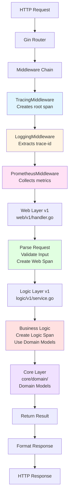
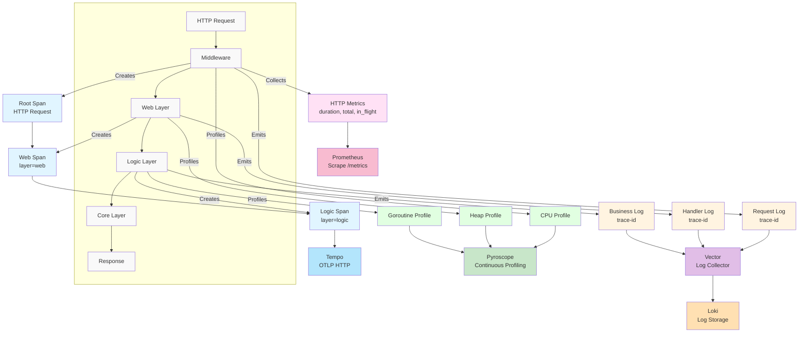
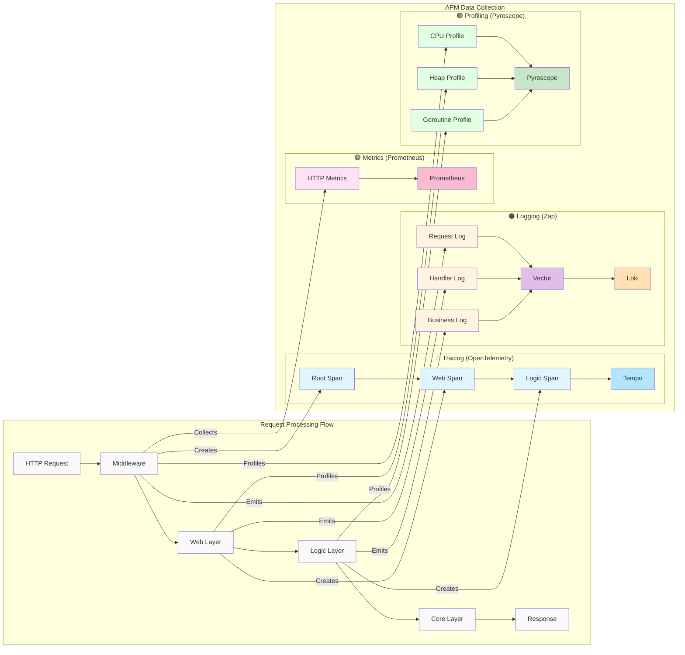
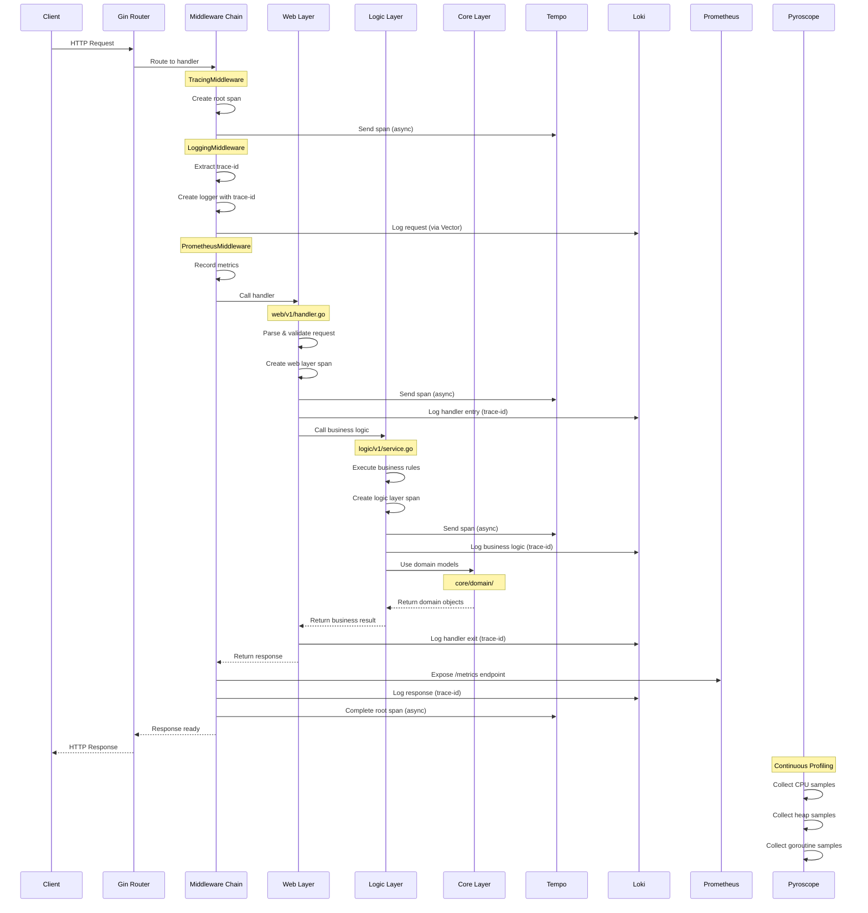
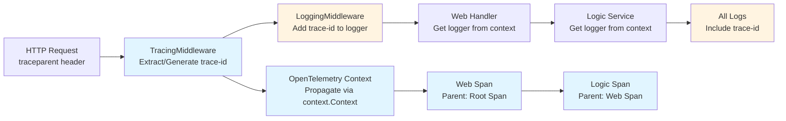
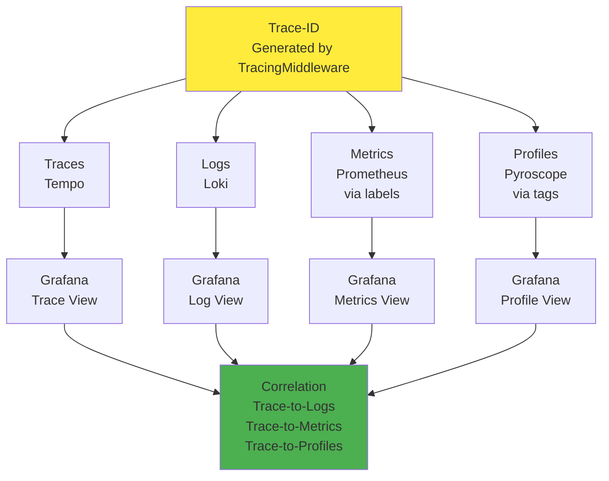

# 3-Layer Architecture & APM Integration

## Quick Summary

**Objectives:**
- Understand the 3-layer architecture (web → logic → core)
- Learn how APM integrates at each layer
- Visualize data flow and correlation patterns

**Learning Outcomes:**
- Clean architecture principles (separation of concerns)
- Middleware chain ordering and responsibilities
- APM data flow through layers
- Trace, log, metric, and profile correlation
- Mermaid diagram creation for architecture visualization

**Keywords:**
3-Layer Architecture, Clean Architecture, Web Layer, Logic Layer, Core Layer, Middleware Chain, APM Integration, Data Flow, Correlation, Mermaid Diagrams

**Technologies:**
- Gin (HTTP framework)
- OpenTelemetry (tracing)
- Zap (logging)
- Prometheus (metrics)
- Pyroscope (profiling)
- Mermaid (diagram syntax)

## Overview

This document visualizes the 3-layer architecture (web → logic → core) and how APM (Application Performance Monitoring) integrates with each layer to provide comprehensive observability.

## 3-Layer Architecture

### Code Structure

The codebase follows a clean 3-layer architecture pattern:



## APM Integration

### Observability Data Collection

APM collects four types of observability data at different layers:

1. **Traces** - Distributed tracing with spans at each layer
2. **Logs** - Structured JSON logs with trace-id correlation
3. **Metrics** - HTTP and business metrics
4. **Profiles** - Continuous CPU, heap, goroutine profiling

### Mermaid Diagram: APM Data Flow

#### Option 1: Top-Bottom Central Flow

Request flow goes top to bottom in center, APM components branch out to the right.



#### Option 2: Two-Column Layout (Recommended)

Left column shows request processing flow, right column shows APM data collection with clear horizontal connections.



## Complete System Flow

### End-to-End Request with APM

This diagram shows the complete flow from HTTP request to APM data collection:



## Layer Responsibilities

### Web Layer (`web/v1/`)

**Responsibilities:**
- HTTP request/response handling
- Input validation and parsing
- HTTP status code mapping
- Error formatting
- Create web layer spans for tracing
- Log HTTP-level events with trace-id

**APM Integration:**
- **Traces**: Creates spans with `layer=web` attribute
- **Logs**: Logs request/response with trace-id
- **Metrics**: HTTP metrics collected by middleware (not in web layer)

**Example:**
```go
func Login(c *gin.Context) {
    // Create span for web layer
    ctx, span := middleware.StartSpan(c.Request.Context(), "http.request", 
        trace.WithAttributes(attribute.String("layer", "web")))
    defer span.End()
    
    // Get logger with trace-id
    logger := middleware.GetLoggerFromContext(c, baseLogger)
    
    // Parse request
    var req domain.LoginRequest
    if err := c.ShouldBindJSON(&req); err != nil {
        logger.Error("Invalid request", zap.Error(err))
        c.JSON(http.StatusBadRequest, gin.H{"error": err.Error()})
        return
    }
    
    // Call logic layer
    result, err := authService.Login(ctx, req)
    // ... handle response
}
```

### Logic Layer (`logic/v1/`)

**Responsibilities:**
- Business logic implementation
- Data validation and transformation
- Business rule enforcement
- Create logic layer spans for tracing
- Log business-level events with trace-id

**APM Integration:**
- **Traces**: Creates spans with `layer=logic` attribute
- **Logs**: Logs business logic execution with trace-id
- **Metrics**: Can create custom business metrics
- **Profiles**: Business logic appears in CPU/heap profiles

**Example:**
```go
func (s *AuthService) Login(ctx context.Context, req domain.LoginRequest) (*domain.AuthResponse, error) {
    // Create span for business logic layer
    ctx, span := middleware.StartSpan(ctx, "auth.login", 
        trace.WithAttributes(attribute.String("layer", "logic")))
    defer span.End()
    
    // Business logic
    if req.Username == "admin" && req.Password == "password" {
        // ... authentication logic
        span.SetAttributes(attribute.Bool("auth.success", true))
        return response, nil
    }
    
    span.SetAttributes(attribute.Bool("auth.success", false))
    return nil, errors.New("invalid credentials")
}
```

### Core Layer (`core/domain/`)

**Responsibilities:**
- Domain models (entities, value objects)
- Domain interfaces
- Domain constants
- **No business logic** (pure data structures)

**APM Integration:**
- **Traces**: Not directly (used by logic layer)
- **Logs**: Not directly (used by logic layer)
- **Metrics**: Not directly
- **Profiles**: Memory allocations visible in heap profiles

**Example:**
```go
// Domain model (pure data structure)
type User struct {
    ID       string `json:"id"`
    Username string `json:"username"`
    Email    string `json:"email"`
}

type LoginRequest struct {
    Username string `json:"username"`
    Password string `json:"password"`
}
```

## Trace-ID Propagation

Trace-IDs are propagated through all layers using context:



## APM Data Correlation

All APM data is correlated via trace-id:



## Benefits of 3-Layer Architecture with APM

1. **Clear Separation of Concerns**
   - Web layer: HTTP handling
   - Logic layer: Business rules
   - Core layer: Domain models

2. **Observability at Each Layer**
   - Traces show request flow through layers
   - Logs show what happens at each layer
   - Metrics show performance at each layer
   - Profiles show resource usage at each layer

3. **Easy Debugging**
   - Trace-id correlates all observability data
   - Can trace a request from HTTP to domain model
   - Can see which layer has performance issues

4. **Single API Version**
   - v1 is the canonical API (frontend-aligned)
   - Same domain models (core layer)
   - APM correlates traces, logs, and metrics per request

## Related Documentation

- [APM Overview](./README.md) - Complete APM system overview
- [Tracing Guide](./tracing.md) - Distributed tracing details
- [Logging Guide](./logging.md) - Structured logging guide
- [Profiling Guide](./profiling.md) - Continuous profiling guide

