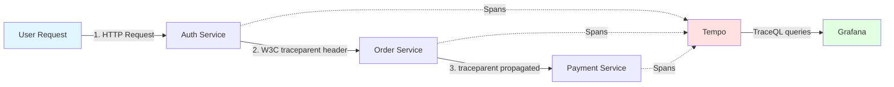

# Distributed Tracing Guide

## Quick Summary

**What is Distributed Tracing?**
Track requests as they flow through multiple microservices to understand performance bottlenecks, debug errors, and visualize service dependencies.

**Key Capabilities:**
- ✅ Track request journey across 8 microservices
- ✅ Identify slow services and bottlenecks
- ✅ Debug cross-service errors with full context
- ✅ Correlate traces with logs (via trace_id)
- ✅ 10% sampling (configurable) for cost-effectiveness

**Technologies:**
- **OpenTelemetry**: Industry-standard tracing instrumentation
- **Grafana Tempo**: Distributed tracing backend (v2.9.0 with metrics-generator)
- **W3C Trace Context**: Standard for trace propagation between services

---

## Table of Contents

1. [Why Distributed Tracing?](#why-distributed-tracing) - Real-world use cases
2. [How It Works](#how-it-works) - System architecture
3. [Configuration](#configuration) - Setup and tuning
4. [Usage Patterns](#usage-patterns) - When to use what
5. [Best Practices](#best-practices) - Production guidelines
6. [Troubleshooting](#troubleshooting) - Common issues

---

## Why Distributed Tracing?

### Real-World Use Cases

#### 1. **Debugging Cross-Service Issues** 🔍
**Problem**: User reports "checkout is slow" but you have 8 microservices involved.

**Without Tracing**: Check logs of all 8 services manually, guess which service is slow.

**With Tracing**: 
- See the entire request flow: `Gateway → Order → Payment → Inventory → Shipping`
- Identify bottleneck: **Payment service took 2000ms** (everything else < 100ms)
- Jump to Payment logs using `trace_id` to see exact error

#### 2. **Performance Optimization** ⚡
**Scenario**: Dashboard shows `/api/v1/orders` P95 latency = 800ms (SLO target: 500ms).

**With Tracing**:
- Find slowest spans: Database query (600ms), External API call (150ms)
- Add database index → latency drops to 300ms
- Verify improvement with trace comparison

#### 3. **Error Budget Investigation** 🚨
**Alert**: `order` service SLO burn rate critical (1.5% error rate, budget: 1%).

**With Tracing**:
- Filter traces with `http.status_code=500`
- See error pattern: `Order → Inventory → TIMEOUT`
- Root cause: Inventory service timeout (30s → need circuit breaker)

#### 4. **Service Dependency Mapping** 🗺️
**Question**: "If I update `payment` service, which services will be affected?"

**With Tracing (Service Graph)**:
- Visualize dependencies: `Order → Payment`, `Shipping → Payment`
- Plan deployment order: Update `Payment` last
- Monitor impact with trace sampling

---

## How It Works

### Architecture



### Trace Flow

1. **Request arrives** → Auth service creates **root span** with `trace_id`
2. **W3C Trace Context** header (`traceparent`) propagated to downstream services
3. Each service creates **child spans** for its operations
4. **10% sampling** decision made at root span (statistically significant)
5. Spans exported to **Tempo** via OTLP HTTP (batch export every 5s)
6. **Grafana** queries Tempo for trace visualization

### Automatic Features

| Feature | What It Does | Benefit |
|---------|--------------|---------|
| **10% Sampling** | Only trace 10% of requests | Cost-effective, production-ready |
| **Request Filtering** | Skip `/health`, `/metrics` | Reduces noise by 30-40% |
| **Service Detection** | Auto-detect service name from pod name | No manual config needed |
| **Graceful Shutdown** | Flush pending spans on SIGTERM | Zero data loss during rollouts |
| **Error Recording** | Automatically mark error spans | Easy error filtering in Grafana |

### Accessing Traces

**Grafana Explore:**
```bash
kubectl port-forward -n monitoring svc/grafana-service 3000:3000
# Open http://localhost:3000 → Explore → Tempo datasource
```

**Search Options:**
- By service: `{resource.service.name="auth"}`
- By trace ID: `trace_id` from logs
- By status: `{status=error}`
- By duration: `{duration > 500ms}`

---

## Configuration

### Quick Configuration via Helm

All tracing configuration is managed via HelmRelease values (`kubernetes/apps/*.yaml`):

```yaml
# kubernetes/apps/auth.yaml (values section)
env:
  - name: SERVICE_NAME
    value: "auth"
  - name: OTEL_COLLECTOR_ENDPOINT
    value: "otel-collector-opentelemetry-collector.monitoring.svc.cluster.local:4318"
  - name: OTEL_SAMPLE_RATE
    value: "0.1"  # 10% sampling (0.0-1.0)
  - name: TRACING_ENABLED
    value: "true"
```

**Deploy with custom sampling:**
```bash
make sync  # Push manifests and trigger Flux reconciliation
```

### Environment Variables

| Variable | Default | Description |
|----------|---------|-------------|
| `OTEL_COLLECTOR_ENDPOINT` | `otel-collector-opentelemetry-collector.monitoring.svc.cluster.local:4318` | OTel Collector OTLP HTTP endpoint |
| `OTEL_SAMPLE_RATE` | `0.1` (10%) | Trace sampling rate (0.0-1.0) |
| `ENV` | `production` | Auto-adjust sampling: `development`=100%, others=10% |

### Sampling Strategy

| Environment | Sample Rate | Use Case | Cost Impact |
|-------------|-------------|----------|-------------|
| **Production** | 10% | Cost-effective, statistically valid | Low |
| **Staging** | 50% | More coverage for testing | Medium |
| **Development** | 100% | Full debugging visibility | High |

**Why 10% is enough:**
- Statistically significant for performance analysis
- Sufficient for error pattern detection
- Reduces storage cost by 90%
- Still captures ~144 traces/hour at 400 RPS

### Request Filtering (Automatic)

These endpoints are **never traced** (reduces volume by 30-40%):

| Path | Reason |
|------|--------|
| `/health`, `/healthz`, `/readyz`, `/livez` | High frequency, low value |
| `/metrics` | Prometheus scrape endpoint |
| `/favicon.ico` | Browser noise |

### Service Auto-Detection

Service name and namespace are **auto-detected** from:

1. `OTEL_SERVICE_NAME` env var (highest priority)
2. Pod name pattern: `auth-75c98b4b9c-kdv2n` → `auth`
3. Hostname (fallback)
4. Namespace from: `/var/run/secrets/kubernetes.io/serviceaccount/namespace`

**No manual configuration needed!**

---

## Usage Patterns

### When to Use Tracing

| Scenario | How Tracing Helps |
|----------|-------------------|
| 🔍 **Debugging slow requests** | See which service/operation is slow |
| ⚠️ **Investigating errors** | Full context of error flow across services |
| 📊 **SLO budget burn** | Find root cause of latency/error spikes |
| 🗺️ **Dependency mapping** | Understand service call patterns |
| ⚡ **Performance optimization** | Identify bottlenecks (DB queries, external APIs) |

### What Traces Automatically Capture

Every traced HTTP request includes:

**Automatic Attributes:**
- Service name, namespace, pod name
- HTTP method, path, status code
- Request duration (start → end)
- Parent span ID (for service correlation)

**From Middleware:**
- User-Agent, Remote IP
- Error status and messages
- W3C Trace Context propagation

### Helper Functions (Optional Enhancement)

Use these to **add business context** to traces:

```go
// Record errors for debugging
middleware.RecordError(ctx, err)
    
// Add business context
    middleware.AddSpanAttributes(ctx,
        attribute.String("user.id", userID),
        attribute.String("order.id", orderID),
    )
    
// Mark important events
middleware.AddSpanEvent(ctx, "payment.approved")

// Create child spans for complex operations
    ctx, span := middleware.StartSpan(ctx, "validate-inventory")
    defer span.End()
```

**When to use:**
- ✅ Recording errors (always do this!)
- ✅ Adding user/order IDs for filtering
- ✅ Marking state transitions (payment approved, inventory reserved)
- ❌ Don't trace in tight loops (performance impact)
- ❌ Don't add sensitive data (passwords, credit cards)

---

## Best Practices

### Production Recommendations

| Practice | Why | Implementation |
|----------|-----|----------------|
| **10% sampling** | Balance cost vs visibility | `tracing.sampleRate: "0.1"` (Helm) |
| **Auto-filter health checks** | Reduce noise by 30-40% | Automatic (middleware) |
| **Always record errors** | Critical for debugging | `RecordError(ctx, err)` |
| **Graceful shutdown** | Zero lost spans during rollouts | Automatic (all services) |
| **Correlate with logs** | Jump from trace to logs via `trace_id` | Automatic (logging middleware) |

### Do's ✅

1. **Record all errors** for debugging context
2. **Add business IDs** (user_id, order_id) for filtering
3. **Use child spans** for distinct operations (DB queries, external API calls)
4. **Monitor trace volume** with Prometheus: `rate(tempo_spans_received_total[5m])`

### Don'ts ❌

1. **Don't trace in loops** (creates span explosion)
2. **Don't add sensitive data** (passwords, tokens, PII)
3. **Don't sample 100% in production** (cost/performance impact)
4. **Don't skip error recording** (loses debugging context)

### Correlation with Logs

**Automatic correlation** via `trace_id` in structured logs:

**Example log:**
```json
{
  "level": "error",
  "msg": "Payment failed",
  "trace_id": "4bf92f3577b34da6a3ce929d0e0e4736",
  "user_id": "123",
  "error": "timeout"
}
```

**Find trace in Grafana:**
- Copy `trace_id` from log
- Grafana Explore → Tempo → Search by Trace ID
- See full request flow across all services

---

## Troubleshooting

### Problem: No traces appearing in Grafana

**Possible Causes:**
1. **Sampling too low** → Temporarily increase to 100% for debugging:
   ```bash
   kubectl set env deployment/auth OTEL_SAMPLE_RATE=1.0 -n auth
   ```

2. **Tempo not running**:
   ```bash
   kubectl get pods -n monitoring -l app=tempo
   kubectl logs -n monitoring deployment/tempo
   ```

3. **Service not sending traces**:
   ```bash
   kubectl logs -n auth -l app=auth | grep -i "trace\|tempo"
   ```

### Problem: Trace volume too low

**Expected:** `trace_count ≈ request_count * sample_rate`

**Check:**
1. **Verify sampling rate**:
   ```bash
   kubectl get deployment auth -n auth -o yaml | grep OTEL_SAMPLE_RATE
   ```

2. **Check request filtering** (health checks automatically skipped)

3. **Monitor Tempo ingestion**:
   ```promql
   rate(tempo_spans_received_total[5m])
   ```

### Problem: High memory usage

**Solutions:**
1. **Reduce sampling**: `OTEL_SAMPLE_RATE=0.05` (5%)
2. **Verify no tracing in loops**: `grep -r "StartSpan.*for.*range" ~/Working/duynhne/*-service`
3. **Check batch timeout** (default 5s is optimal)

### Problem: Missing traces during pod restarts

**Solution:** Graceful shutdown is already configured (automatic span flushing). If still missing:

1. **Check shutdown logs**:
   ```bash
   kubectl logs -n auth <pod> | grep -i shutdown
   ```

2. **Increase shutdown timeout** (if needed):
   ```go
   shutdownCtx, cancel := context.WithTimeout(context.Background(), 20*time.Second)
   ```

### Debugging Commands

```bash
# View traces in Grafana
kubectl port-forward -n monitoring svc/grafana-service 3000:3000

# Check Tempo metrics
kubectl port-forward -n monitoring svc/tempo 9090:9090
curl http://localhost:9090/metrics | grep tempo_spans

# View service logs with trace IDs
kubectl logs -n auth -l app=auth | jq '.trace_id'

# Check sampling config
kubectl describe deployment auth -n auth | grep -A 5 "Environment"
```

---

## Reference

### Key Concepts

| Term | Definition |
|------|------------|
| **Trace** | Complete journey of a request across services |
| **Span** | Single operation within a trace (e.g., HTTP request, DB query) |
| **Trace ID** | Unique identifier for entire trace (128-bit) |
| **Span ID** | Unique identifier for single span (64-bit) |
| **W3C Trace Context** | Standard header format: `traceparent: 00-<trace-id>-<span-id>-<flags>` |
| **Sampling** | Percentage of requests to trace (10% = 1 in 10 requests) |

### Semantic Conventions (OpenTelemetry)

**HTTP Attributes:**
```go
attribute.String("http.method", "POST")
attribute.String("http.route", "/api/v1/orders")
attribute.Int("http.status_code", 200)
```

**Database Attributes:**
```go
attribute.String("db.system", "postgresql")
attribute.String("db.operation", "SELECT")
attribute.String("db.table", "users")
```

### Performance Characteristics

| Metric | Value | Notes |
|--------|-------|-------|
| Sampling overhead | < 1% CPU | At 10% sampling |
| Memory overhead | < 50MB | Per service |
| Export latency | < 100ms P99 | To Tempo |
| Trace volume reduction | 90% | vs 100% sampling |
| Request filtering reduction | 30-40% | Health/metrics skipped |

### External Resources

- [OpenTelemetry Go SDK](https://opentelemetry.io/docs/instrumentation/go/)
- [Grafana Tempo Docs](https://grafana.com/docs/tempo/latest/)
- [W3C Trace Context Spec](https://www.w3.org/TR/trace-context/)
- [OpenTelemetry Semantic Conventions](https://opentelemetry.io/docs/specs/semconv/)

---

**Last Updated**: December 9, 2025 - Tempo v2.9.0 with metrics-generator (v0.6.9)
