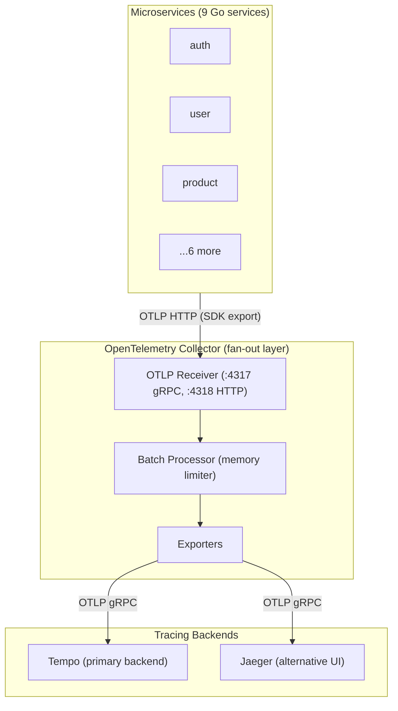

# Distributed Tracing Architecture

## Overview

This document explains the distributed tracing architecture used in this project, including the dual backend strategy (Jaeger + Tempo), OpenTelemetry Collector fan-out pattern, and SDK-based instrumentation approach.

## Architecture

### High-Level Flow



### Component Details

**1. Microservices (SDK Approach)**
- **Technology**: Go OpenTelemetry SDK
- **Export Protocol**: OTLP HTTP
- **Endpoint**: `otel-collector-opentelemetry-collector.monitoring.svc.cluster.local:4318`
- **Sampling**: 10% in production, 100% in development
- **Implementation**: `middleware/tracing.go` in each service repository (polyrepo)

**2. OpenTelemetry Collector**
- **Deployment**: Kubernetes Deployment (1 replica, scalable)
- **Function**: Fan-out layer, receives traces and distributes to backends
- **Configuration**: `kubernetes/infra/controllers/tracing/otel-collector/otel-collector.yaml`
- **Ports**: 4317 (gRPC), 4318 (HTTP), 8888 (metrics)

**3. Tempo (Primary Backend)**
- **Purpose**: Production tracing backend
- **Storage**: Object storage (S3/GCS compatible)
- **Query**: Via Grafana (TraceQL)
- **Integration**: Grafana datasource

**4. Jaeger v2 (Alternative Backend)**
- **Purpose**: Alternative UI, migration testing
- **Storage**: In-memory (100k traces max)
- **Query**: Built-in Jaeger UI (port 16686)
- **Integration**: Grafana datasource

## Why Dual Backends?

### Use Cases

1. **Migration Strategy**
   - Running both during transition from Jaeger to Tempo
   - Validate Tempo meets all requirements
   - Gradual cutover without service disruption

2. **A/B Testing**
   - Compare backend performance
   - Evaluate features (UI, query language)
   - Cost analysis

3. **Redundancy**
   - Backup for critical traces
   - Different retention policies
   - Compliance requirements

### Current Status

This is a **POC/learning project**, so dual backends allow:
- Learning both systems
- Comparing approaches
- Understanding trade-offs

## SDK vs Sidecar: Why SDK?

### Current Approach: OpenTelemetry SDK

**Implementation:**
```go
// middleware/tracing.go (in each service repository)
exporter, _ := otlptracehttp.New(ctx,
    otlptracehttp.WithEndpoint(cfg.Tracing.Endpoint),
    otlptracehttp.WithInsecure(),
    otlptracehttp.WithCompression(otlptracehttp.GzipCompression),
)

tracerProvider := sdktrace.NewTracerProvider(
    sdktrace.WithBatcher(exporter,
        sdktrace.WithBatchTimeout(5*time.Second),
        sdktrace.WithExportTimeout(30*time.Second),
    ),
    sdktrace.WithResource(res),
    sdktrace.WithSampler(sdktrace.TraceIDRatioBased(cfg.Tracing.SampleRate)),
)
```

**Advantages:**
- ✅ **Full Control**: Custom instrumentation, sampling, attributes
- ✅ **Resource Efficient**: No sidecar container overhead
- ✅ **Language Optimized**: Go-specific optimizations
- ✅ **Simple Deployment**: No additional containers per pod
- ✅ **Learning Value**: Better understanding of OpenTelemetry internals

**Disadvantages:**
- ❌ **Code Changes**: Requires instrumentation in code
- ❌ **Language Specific**: Need SDK for each language
- ❌ **Application Overhead**: Export processing in app process

### Alternative: Sidecar Collector

**How it works:**
- OTel Collector runs as sidecar container in same pod
- Applications send traces to localhost collector
- Collector handles export to backends

**When to use:**
- Polyglot environments (Java, Python, Node.js, Go)
- Zero-code instrumentation needed
- Large-scale production (100+ services)
- Centralized collector management

**Why we don't use it:**
- All services are Go (homogeneous stack)
- Need custom instrumentation
- Resource efficiency is important
- Learning/POC environment

## Configuration

### Microservices Configuration

All microservices use consistent configuration via Helm values:

```yaml
# charts/mop/values/*.yaml
env:
  - name: OTEL_COLLECTOR_ENDPOINT
    value: "otel-collector-opentelemetry-collector.monitoring.svc.cluster.local:4318"
  - name: OTEL_SAMPLE_RATE
    value: "0.1"  # 10% sampling
  - name: TRACING_ENABLED
    value: "true"
```

**Key Points:**
- All services point to OTel Collector (not directly to backends)
- Single endpoint simplifies configuration
- Easy to change backends without app changes

### OpenTelemetry Collector Configuration

**Fan-out Configuration:**
```yaml
# kubernetes/infra/controllers/tracing/otel-collector/otel-collector.yaml (conceptual example)
exporters:
  otlp/tempo:
    endpoint: tempo.monitoring.svc.cluster.local:4317
  otlp/jaeger:
    endpoint: jaeger-collector.monitoring.svc.cluster.local:4317

service:
  pipelines:
    traces:
      receivers: [otlp]
      processors: [memory_limiter, batch]
      exporters: [otlp/tempo, otlp/jaeger]
```

**Benefits:**
- Single configuration point
- Easy to add/remove backends
- Consistent processing (batching, memory limiting)

## Data Flow

### Trace Lifecycle

1. **Request arrives** at microservice
2. **SDK creates span** via Gin middleware
3. **Span attributes** added (service name, HTTP method, path)
4. **Span ends** and queued for export
5. **Batch export** every 5 seconds (or when batch full)
6. **OTLP HTTP** sent to OTel Collector
7. **Collector processes** (memory limit, batch)
8. **Fan-out** to Tempo and Jaeger via OTLP gRPC
9. **Backends store** traces
10. **Query** via Grafana (Tempo) or Jaeger UI

### Sampling Strategy

**Current:**
- **Production**: 10% sampling (`OTEL_SAMPLE_RATE=0.1`)
- **Development**: 100% sampling (`OTEL_SAMPLE_RATE=1.0`)

**Rationale:**
- Reduces storage and processing overhead
- Still captures representative sample
- Errors typically sampled at higher rate

**Future Improvements:**
- Adaptive sampling based on error rate
- Head-based sampling in collector
- Tail-based sampling for errors

## Production Considerations

### Current Limitations

1. **Jaeger Storage**: In-memory only (data lost on restart)
2. **Collector HA**: Single replica (no redundancy)
3. **Monitoring**: Limited collector metrics visibility
4. **Security**: No TLS between components

### Recommended Improvements

**1. Persistent Storage for Jaeger:**
```yaml
# kubernetes/infra/controllers/tracing/jaeger/jaeger.yaml (conceptual example)
storage:
  type: badger
  badger:
    ephemeral: false
    directory: /badger
```
- Requires PVC
- Data survives pod restarts
- Suitable for POC/small deployments

**2. High Availability:**
```yaml
# kubernetes/infra/controllers/tracing/otel-collector/otel-collector.yaml (conceptual example)
replicaCount: 2
```
- Multiple collector replicas
- Load balancer for service
- Health checks and auto-restart

**3. Monitoring:**
- Expose collector metrics (port 8888)
- Create Grafana dashboard
- Alert on export failures
- Track trace volume and latency

**4. Security:**
- Enable TLS between collector and backends
- Network policies for pod communication
- Authentication for query endpoints

## Deployment Methods: Helm vs Operator

### Current Approach: Helm Chart

**What we use:**
- Jaeger Helm chart (`jaegertracing/jaeger`)
- GitOps-managed HelmRelease in this repo: `kubernetes/infra/controllers/tracing/jaeger/jaeger.yaml`
- Reconciled by Flux (`controllers-local` → `configs-local` → `apps-local`)

**Why Helm:**
- ✅ Simple and straightforward
- ✅ No operator overhead
- ✅ Direct control over configuration
- ✅ Perfect for POC/learning environments
- ✅ Easy to understand and modify

### Alternative: OpenTelemetry Operator

**What it is:**
- Kubernetes Operator for managing OpenTelemetry Collectors
- CRD-based deployment (`OpenTelemetryCollector`)
- Can deploy Jaeger v2 as OTel Collector

**When to use:**
- Production with 10+ services
- Need auto-instrumentation (zero-code)
- GitOps workflow
- Multiple collectors across namespaces
- Dynamic scaling requirements

**Example CRD:**
```yaml
apiVersion: opentelemetry.io/v1beta1
kind: OpenTelemetryCollector
metadata:
  name: jaeger-instance
spec:
  image: jaegertracing/jaeger:latest
  ports:
  - name: jaeger
    port: 16686
  config:
    service:
      extensions: [jaeger_storage, jaeger_query]
      pipelines:
        traces:
          receivers: [otlp]
          exporters: [jaeger_storage_exporter]
    # ... rest of config
```

### Jaeger Operator v1 (Deprecated for v2)

**Status:**
- ❌ **Deprecated** for Jaeger v2
- Only for Jaeger v1 deployments
- Uses CRD: `apiVersion: jaegertracing.io/v1`

**Note:** Jaeger v2 uses OpenTelemetry Operator, not Jaeger Operator.

### Comparison

| Feature | Helm Chart (Current) | OpenTelemetry Operator |
|---------|---------------------|------------------------|
| **Complexity** | Low | Medium |
| **Setup** | Simple | Requires cert-manager |
| **Auto-instrumentation** | No | Yes |
| **Scaling** | Manual | Automatic |
| **GitOps** | Manual | Native CRD |
| **Best For** | POC, Dev | Production |

### Recommendation

**Current Setup (Helm):**
- ✅ **Perfect for current needs** - POC/learning project
- ✅ **No need to change** - Works well
- ✅ **Simple to maintain** - Easy to understand

**Consider Operator When:**
- Moving to production
- Need auto-instrumentation
- Want GitOps workflow
- Multiple services and namespaces

## Related Documentation

- OpenTelemetry Collector manifests: `kubernetes/infra/controllers/tracing/otel-collector/otel-collector.yaml`
- Jaeger manifests: `kubernetes/infra/controllers/tracing/jaeger/jaeger.yaml`
- [APM Overview](./README.md)
- [Tracing Guide](./tracing.md)
- [Jaeger Guide](./jaeger.md)

## References

- [OpenTelemetry Documentation](https://opentelemetry.io/docs/)
- [Jaeger Documentation](https://www.jaegertracing.io/docs/)
- [Grafana Tempo Documentation](https://grafana.com/docs/tempo/)
- [CNCF Observability Best Practices](https://www.cncf.io/blog/)
- [Jaeger v2 Deployment Guide](https://www.jaegertracing.io/docs/2.13/deployment/kubernetes/)
- [OpenTelemetry Operator](https://opentelemetry.io/docs/platforms/kubernetes/operator/)
