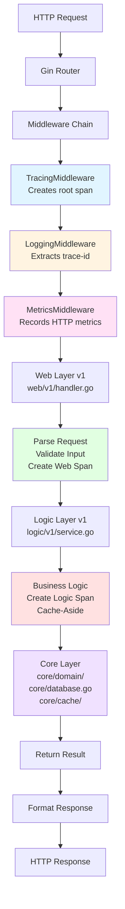
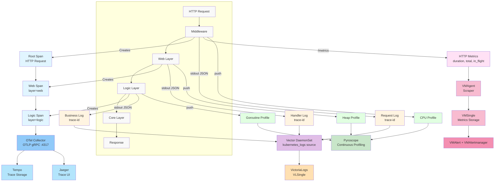
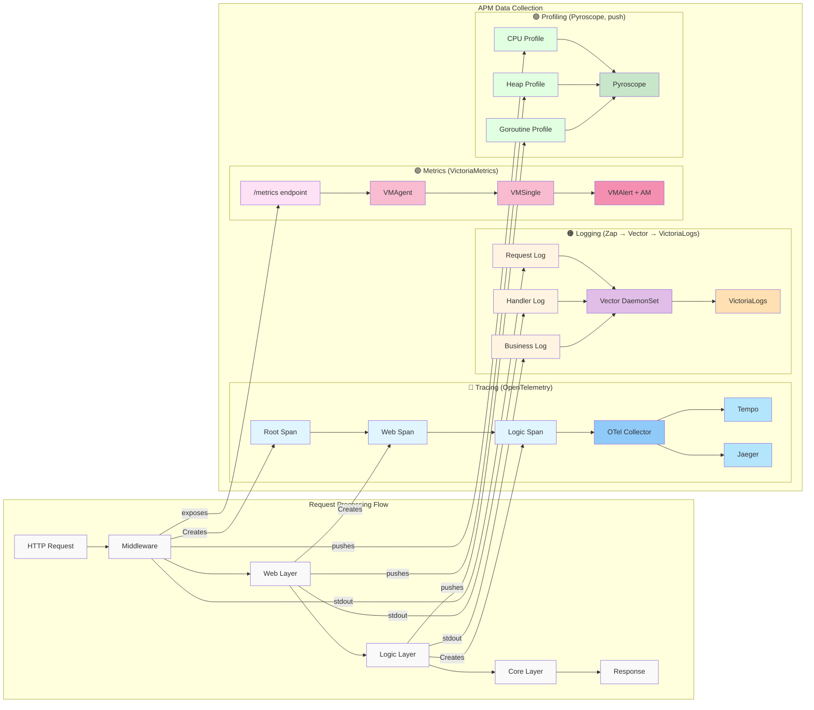
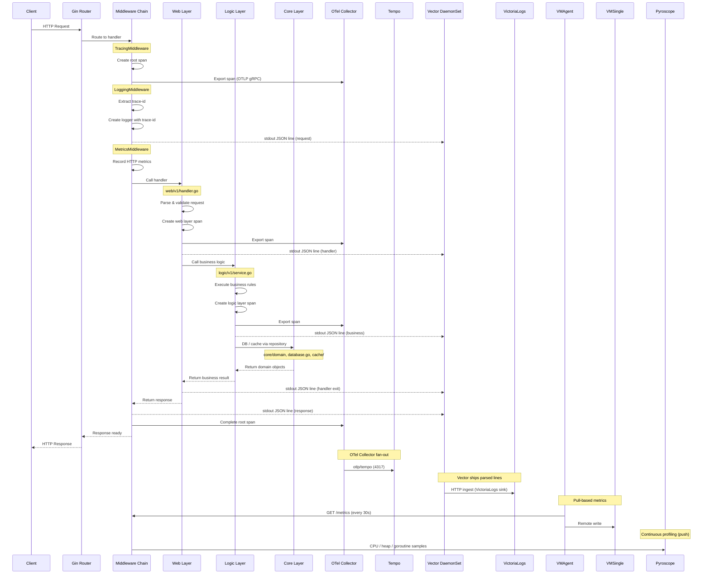
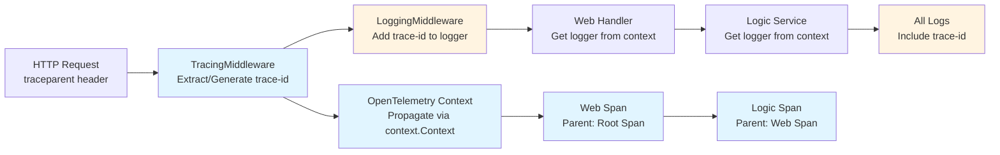
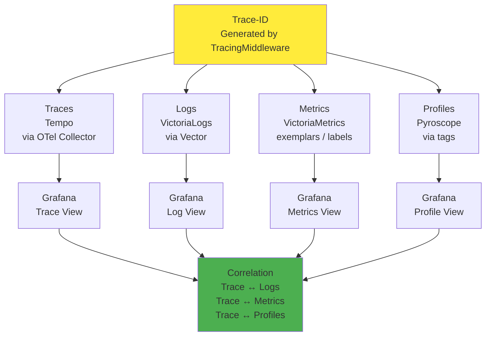

# 3-Layer Architecture & APM Integration

## Quick Summary

**Objectives:**
- Understand the 3-layer architecture (web → logic → core)
- Learn how APM integrates at each layer
- Visualize data flow and correlation patterns

**Learning Outcomes:**
- Clean architecture principles (separation of concerns)
- Middleware chain ordering and responsibilities
- APM data flow through layers
- Trace, log, metric, and profile correlation
- Mermaid diagram creation for architecture visualization

**Keywords:**
3-Layer Architecture, Clean Architecture, Web Layer, Logic Layer, Core Layer, Middleware Chain, APM Integration, Data Flow, Correlation, Mermaid Diagrams

**Technologies (current stack):**
- Gin (HTTP framework)
- OpenTelemetry SDK + OTel Collector (tracing pipeline)
- Tempo (trace storage, queried by Grafana)
- Jaeger (secondary trace UI, fed from OTel Collector)
- Zap (structured JSON logging)
- Vector (DaemonSet log shipper)
- VictoriaLogs / VLSingle (log storage, replaces Loki)
- VictoriaMetrics — VMAgent (scrape) + VMSingle (storage) + VMAlert + VMAlertmanager (replaces Prometheus)
- Pyroscope (continuous profiling, push-based from services)
- Grafana (single UI for traces, logs, metrics, profiles)
- Mermaid (diagram syntax)

> Note: `prometheus-operator-crds` is installed only so VictoriaMetrics Operator can transparently consume `ServiceMonitor` / `PodMonitor` / `PrometheusRule` resources — there is no Prometheus server running.

## Overview

This document visualizes the 3-layer architecture (web → logic → core) and how APM (Application Performance Monitoring) integrates with each layer to provide comprehensive observability.

## 3-Layer Architecture

### Code Structure

The codebase follows a clean 3-layer architecture pattern:



## APM Integration

### Observability Data Collection

APM collects four types of observability data at different layers:

1. **Traces** - OTLP spans at each layer, exported to OTel Collector → Tempo (+ Jaeger)
2. **Logs** - Structured JSON logs to stdout, scraped by Vector DaemonSet → VictoriaLogs
3. **Metrics** - `/metrics` endpoint scraped by VMAgent → VMSingle
4. **Profiles** - Continuous CPU / heap / goroutine profiles pushed from the Go SDK → Pyroscope

### Mermaid Diagram: APM Data Flow

#### Option 1: Top-Bottom Central Flow

Request flow goes top to bottom in center, APM components branch out to the right.



#### Option 2: Two-Column Layout (Recommended)

Left column shows request processing flow, right column shows APM data collection with clear horizontal connections.



## Complete System Flow

### End-to-End Request with APM

This diagram shows the complete flow from HTTP request to APM data collection. Tracing and profiling are out-of-band: spans go through the OTel Collector before reaching Tempo/Jaeger, log lines hit stdout and are picked up by the Vector DaemonSet, and metrics are pull-based via VMAgent scrapes.



## Layer Responsibilities

### Web Layer (`web/v1/`)

**Responsibilities:**
- HTTP request/response handling
- Input validation and parsing
- HTTP status code mapping
- Error formatting
- Create web layer spans for tracing
- Log HTTP-level events with trace-id

**APM Integration:**
- **Traces**: Creates spans with `layer=web` attribute (exported via OTel Collector → Tempo)
- **Logs**: Logs request/response as JSON on stdout with trace-id (collected by Vector → VictoriaLogs)
- **Metrics**: HTTP metrics collected by middleware and scraped by VMAgent (not in web layer)

**Example:**
```go
func Login(c *gin.Context) {
    // Create span for web layer
    ctx, span := middleware.StartSpan(c.Request.Context(), "http.request",
        trace.WithAttributes(attribute.String("layer", "web")))
    defer span.End()

    // Get logger with trace-id
    logger := middleware.GetLoggerFromContext(c, baseLogger)

    // Parse request
    var req domain.LoginRequest
    if err := c.ShouldBindJSON(&req); err != nil {
        logger.Error("Invalid request", zap.Error(err))
        c.JSON(http.StatusBadRequest, gin.H{"error": err.Error()})
        return
    }

    // Call logic layer
    result, err := authService.Login(ctx, req)
    // ... handle response
}
```

### Logic Layer (`logic/v1/`)

**Responsibilities:**
- Business logic implementation
- Data validation and transformation
- Business rule enforcement
- Cache-Aside pattern against Valkey for read-heavy paths
- Create logic layer spans for tracing
- Log business-level events with trace-id

**APM Integration:**
- **Traces**: Creates spans with `layer=logic` attribute
- **Logs**: Logs business logic execution with trace-id
- **Metrics**: Can create custom business metrics (exposed on the same `/metrics` endpoint scraped by VMAgent)
- **Profiles**: Business logic appears in CPU/heap profiles pushed to Pyroscope

**Example:**
```go
func (s *AuthService) Login(ctx context.Context, req domain.LoginRequest) (*domain.AuthResponse, error) {
    // Create span for business logic layer
    ctx, span := middleware.StartSpan(ctx, "auth.login",
        trace.WithAttributes(attribute.String("layer", "logic")))
    defer span.End()

    // Business logic
    if req.Username == "admin" && req.Password == "password" {
        // ... authentication logic
        span.SetAttributes(attribute.Bool("auth.success", true))
        return response, nil
    }

    span.SetAttributes(attribute.Bool("auth.success", false))
    return nil, errors.New("invalid credentials")
}
```

### Core Layer (`core/`)

**Responsibilities:**
- Domain models (entities, value objects) in `core/domain/`
- Database connection in `core/database.go` (PostgreSQL via PgBouncer / PgDog)
- Cache client in `core/cache/` (Valkey, Redis-compatible)
- Domain interfaces and constants
- **No business logic** (pure data structures + thin infra adapters)

**APM Integration:**
- **Traces**: Not directly (used by logic layer; DB/cache spans bubble up via instrumentation)
- **Logs**: Not directly (used by logic layer)
- **Metrics**: DB pool / cache hit-rate metrics exposed on `/metrics`
- **Profiles**: Memory allocations visible in heap profiles

**Example:**
```go
// Domain model (pure data structure)
type User struct {
    ID       string `json:"id"`
    Username string `json:"username"`
    Email    string `json:"email"`
}

type LoginRequest struct {
    Username string `json:"username"`
    Password string `json:"password"`
}
```

## Trace-ID Propagation

Trace-IDs are propagated through all layers using context:



## APM Data Correlation

All APM data is correlated via trace-id. Grafana is the single pane of glass for traces, logs, metrics, and profiles.



## Benefits of 3-Layer Architecture with APM

1. **Clear Separation of Concerns**
   - Web layer: HTTP handling
   - Logic layer: Business rules + caching
   - Core layer: Domain models + DB/cache adapters

2. **Observability at Each Layer**
   - Traces show request flow through layers
   - Logs show what happens at each layer
   - Metrics show performance at each layer
   - Profiles show resource usage at each layer

3. **Easy Debugging**
   - Trace-id correlates all observability data
   - Can trace a request from HTTP to domain model
   - Can see which layer has performance issues

4. **Single API Version**
   - v1 is the canonical API (frontend-aligned)
   - Same domain models (core layer)
   - APM correlates traces, logs, and metrics per request

## Related Documentation

- [APM Overview](./README.md) — complete APM system overview
- [Tracing Guide](./tracing/README.md) — distributed tracing details (OTel Collector → Tempo + Jaeger)
- [Tracing Architecture](./tracing/architecture.md) — middleware chain ordering
- [Logging Guide](./logging/README.md) — Vector → VictoriaLogs pipeline
- [VictoriaLogs Reference](./logging/victorialogs.md)
- [Metrics Guide](./metrics/README.md) — VMAgent / VMSingle / VMAlert
- [VictoriaMetrics Reference](./metrics/victoriametrics.md)
- [Profiling Guide](./profiling/README.md) — Pyroscope (push-based)
- [MCP Servers](../platform/mcp-servers.md) — VM-MCP, VL-MCP, Flux-MCP for AI agents
