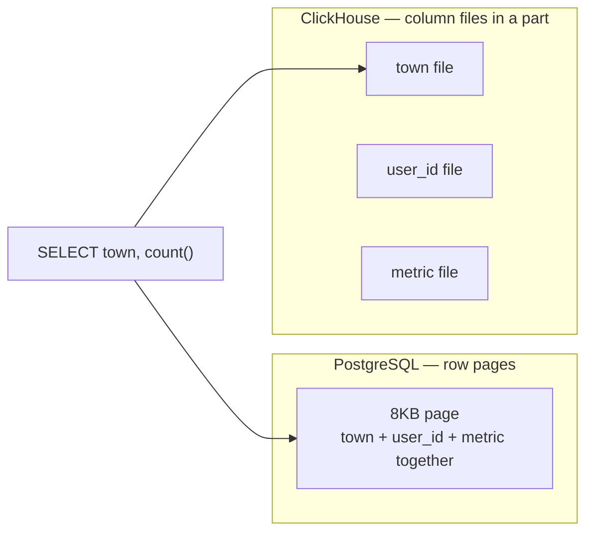
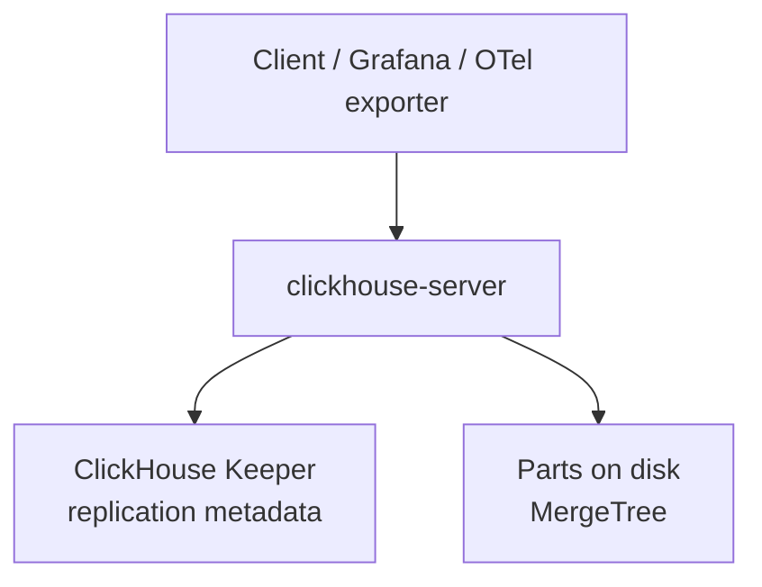
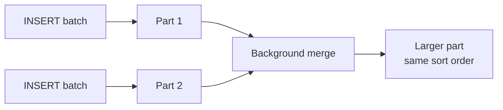
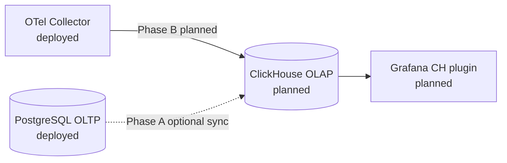
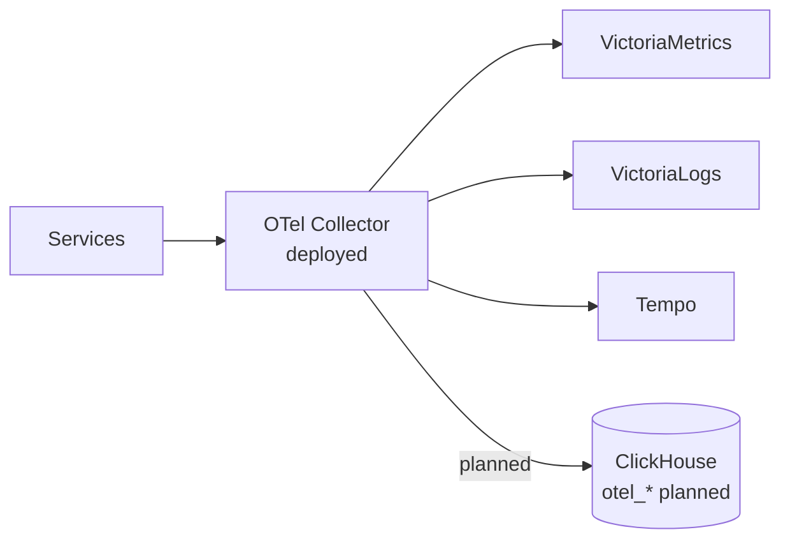

# ClickHouse — learning guide (planned)

Open-source columnar OLAP for real-time aggregation over large event volumes —
**under evaluation** on this homelab, **not deployed**.

| | |
|---|---|
| **Status** | **Planned** — no Kubernetes manifests, no Grafana datasource |
| **Purpose** | Mechanisms, PostgreSQL comparison, operators, Grafana plugin, OTel logs/traces SQL (no ClickStack), and optional **commerce analytics** |
| **Current stack** | VictoriaMetrics (metrics) · VictoriaLogs (logs) · Tempo (traces) · Pyroscope (profiles) |
| **Role if added** | Supplementary backend — Phase B OTel logs/traces SQL analytics; Phase A optional business facts from Postgres. **Does not replace** PostgreSQL or the primary observability stack |
| **Proposal** | [RFC-0019](../../proposals/rfc/RFC-0019/) |

> Homelab GitOps already runs PostgreSQL (CloudNativePG) for OLTP and Victoria* + Tempo for ops signals. ClickHouse here is a **candidate**, not a live component.

---

## Table of contents

1. [Reading path](#reading-path)
2. [What ClickHouse is](#what-clickhouse-is)
3. [Core components](#core-components)
4. [MergeTree mechanism](#mergetree-mechanism)
5. [Glossary](#glossary)
6. [ClickHouse vs PostgreSQL](#clickhouse-vs-postgresql)
7. [Kubernetes operators](#kubernetes-operators)
8. [Grafana datasource (no ClickStack)](#grafana-datasource-no-clickstack)
9. [OTel pipeline (Phase B — planned primary)](#otel-pipeline-phase-b--planned-primary)
10. [Commerce analytics (Phase A — optional)](#commerce-analytics-phase-a--optional)
11. [Homelab fit](#homelab-fit)
12. [Vs current observability stack](#vs-current-observability-stack)
13. [FAQ](#faq)
14. [References](#references)

---

## Reading path

1. **Foundations** — [What ClickHouse is](#what-clickhouse-is) → [MergeTree](#mergetree-mechanism) → [vs PostgreSQL](#clickhouse-vs-postgresql)
2. **Deploy later** — [Operators](#kubernetes-operators)
3. **Query path** — [Grafana plugin](#grafana-datasource-no-clickstack)
4. **Platform use** — [OTel Phase B](#otel-pipeline-phase-b--planned-primary) → [Commerce Phase A (optional)](#commerce-analytics-phase-a--optional) → [Homelab fit](#homelab-fit)
5. **Lookup** — [FAQ](#faq)

Pair with [`docs/databases/001-postgresql-internals.md`](../../databases/001-postgresql-internals.md) if you already know Postgres heap / WAL / B-tree.

---

## What ClickHouse is

**ClickHouse** is an open-source **OLAP** (Online Analytical Processing) database built for:

- Aggregation queries (`GROUP BY`, `COUNT`, percentiles) over huge row counts
- Time-series and event analytics
- Near-real-time dashboards after append ingest

It is **not** a replacement for PostgreSQL orders, payments, or user accounts — those are **OLTP** workloads already on CNPG (`product-db`, `platform-db`).

### OLAP vs OLTP

| | OLTP (PostgreSQL on this platform) | OLAP (ClickHouse — candidate) |
|---|---|---|
| Typical question | "Order #123 for user X?" | "GMV by day for the last 90 days?" |
| Write pattern | Frequent UPDATE/DELETE, ACID | Append INSERT, read-heavy aggregation |
| Indexing | B-tree on heap | Sparse index on sort key + skipping indexes |
| Read scale | Point lookup, moderate joins | Column scans, large aggregations |

> **In plain terms:** aggregation folds many rows into a few meaningful numbers — `COUNT` failures by service, `SUM` revenue by day. OLTP answers *"what is this row?"*; OLAP answers *"how does the whole set look?"*.

Recommended pattern from ClickHouse docs: **OLTP → Postgres; analytics → ClickHouse; sync/stream** between them when reports need transactional data.

### Columnar storage

PostgreSQL is **row-oriented** (a page holds many columns of the same row). ClickHouse is **column-oriented** (each column is its own file inside a **part**). `SELECT town, count()` reads only the `town` column files.



---

## Core components

| Piece | Role |
|-------|------|
| **clickhouse-server** | Query engine + storage |
| **ClickHouse Keeper** | Coordination for replication/sharding (ZooKeeper replacement) |
| **Table engine** | Storage semantics — **MergeTree** is the analytics default |
| **Part** | Immutable on-disk chunk produced by an insert batch |
| **Granule** | ~8192-row read unit; sparse index points at the first row of each granule |



---

## MergeTree mechanism

MergeTree is **not** a Postgres B-tree row store.

| | PostgreSQL B-tree | ClickHouse MergeTree |
|---|---|---|
| Primary purpose | Point lookup / range on heap | Sort + prune granules for scans |
| Write path | Update pages / WAL | Append new **parts** |
| Background | Autovacuum / checkpoints | **Merges** combining parts |

**Insert → part → merge (simplified):**



Sparse primary index stores **one entry per granule** (first row of the granule), not a min/max per granule. Skipping indexes (minmax, set, bloom) are optional secondary pruning.

> Examples in this doc are for **learning syntax**. Homelab does **not** run ClickHouse yet.

```sql
CREATE TABLE events
(
    event_date Date,
    town String,
    user_id UInt32,
    metric Float64
)
ENGINE = MergeTree
PARTITION BY toYYYYMM(event_date)
ORDER BY (town, user_id);
```

---

## Glossary

| Term | Meaning |
|------|---------|
| **Part** | Immutable insert batch on disk |
| **Merge** | Background job that combines parts |
| **Granule** | Default ~8192-row read block |
| **Sparse index** | Index of first-row keys per granule |
| **Skipping index** | Extra prune aid (minmax / set / bloom) |
| **Keeper** | ClickHouse coordination service |
| **Mutation** | Async ALTER UPDATE/DELETE rewrite |

---

## ClickHouse vs PostgreSQL

| Dimension | PostgreSQL (deployed) | ClickHouse (planned) |
|-----------|----------------------|----------------------|
| Workload | OLTP — orders, users, payments | OLAP — commerce facts and/or OTel SQL |
| Consistency | Full ACID | OLAP tradeoffs; not a money ledger |
| Updates | First-class | Prefer append; mutations are expensive |
| Joins | Strength | Prefer denormalized facts / star schema |

**Where each belongs on this platform:**

| Need | Store |
|------|-------|
| Order/payment source of truth | PostgreSQL (`product-db` / `platform-db`) |
| RED metrics, alerting | VictoriaMetrics |
| Ops log/trace search | VictoriaLogs / Tempo |
| Cross-day GMV, checkout funnel, capture rate | ClickHouse (Phase A — optional) |
| Long-retention SQL on OTel logs/traces | ClickHouse (Phase B — planned primary) |



---

## Kubernetes operators

| | Official (`ClickHouse/clickhouse-operator`) | Altinity (`Altinity/clickhouse-operator`) |
|---|---|---|
| CRD | `ClickHouseCluster`, `KeeperCluster` | `ClickHouseInstallation` |
| Maturity on Kind | Newer / Cloud-aligned | Long community history |
| Homelab default (RFC-0019) | Alternative | **Recommended for Kind pilot** |

Operator choice is recorded in [RFC-0019](../../proposals/rfc/RFC-0019/); no CR is deployed yet.

---

## Grafana datasource (no ClickStack)

Prefer the official **Grafana ClickHouse datasource** over a separate ClickStack/HyperDX deploy.

| | |
|---|---|
| Plugin | `grafana-clickhouse-datasource` |
| Status | **Planned** — not in `GF_INSTALL_PLUGINS` today |
| Use | Ad-hoc SQL + panels over fact tables / `otel_*` |

See current datasources: [`docs/observability/grafana/README.md`](../grafana/README.md).

---

## OTel pipeline (Phase B — planned primary)

**No ClickStack.** Fan-out from the existing OTel Collector to ClickHouse exporters for `otel_logs` / `otel_traces` tables; query via Grafana. VictoriaLogs / Tempo remain day-to-day ops primaries. Metrics stay on **VictoriaMetrics**.



---

## Commerce analytics (Phase A — optional)

Optional later: mirror **read-only commerce facts** into ClickHouse for business panels. No new public analytics HTTP routes. PostgreSQL remains authoritative. Contracts: [`docs/api/`](../../api/README.md).

| Fact table (planned) | Source of truth | Minimum columns | Example questions |
|----------------------|-----------------|-----------------|-------------------|
| `fact_orders` | [order.md](../../api/order.md) | `order_id`, anon/`user_id`, `status`, `total_minor`, `created_at` | GMV / day; counts by `pending` / `confirmed` / `failed` |
| `fact_order_items` | order line items | `order_id`, `product_id`, `qty`, `line_subtotal_minor` | Top products by revenue / qty |
| `fact_payments` | [payments.md](../../api/payments.md) | `order_id`, `status`, `amount_minor`, `refunded_minor`, `created_at` | Capture rate; refund volume |
| `fact_checkout_sessions` | [checkout.md](../../api/checkout.md) | `session_id`, `status`, `total_minor`, optional promo, timestamps | Funnel open → completed vs expired |
| `fact_reviews` (thin) | [review.md](../../api/review.md) | `product_id`, `rating`, `created_at` | Avg rating / product over time |

**Ingest:** nightly or on-demand **batch SQL export** from `product-db` / `platform-db` via PgDog — not CDC.

**Query:** Grafana ClickHouse panels only — no new SQL-proxy microservice.

**Out of Phase A:** auth/user PII analytics; cart abandonment warehouse; reconciliation discrepancy store; real-time CDC; writing business state into ClickHouse; new `/{service}/v1/...` analytics APIs.

Design decision: [RFC-0019](../../proposals/rfc/RFC-0019/).

---

## Homelab fit

| Area | Today | If ClickHouse is added |
|------|-------|------------------------|
| cert-manager | Deployed | Needed for Official operator TLS |
| OTel Collector | Deployed | Extra exporter config (Phase B — primary) |
| RustFS / S3 | Tempo, Pyroscope | Optional long-term CH disks |
| ClickHouse server | **Absent** | Operator + CR (future PR) |

---

## Vs current observability stack

| Signal | Primary today | ClickHouse role if added |
|--------|---------------|--------------------------|
| Metrics | VictoriaMetrics | Keep VM; CH not required for RED |
| Logs | VictoriaLogs | VL stays ops primary; CH = SQL / long retention (Phase B) |
| Traces | Tempo (+ Jaeger ephemeral) | Long-retention SQL search (Phase B) |
| Business facts | Postgres only | Optional Phase A facts + Grafana |

---

## FAQ

**Can ClickHouse replace PostgreSQL here?**  
No. Postgres is the ACID source of truth. ClickHouse is supplementary OLAP for OTel SQL (primary path) and optional commerce facts.

**Does ClickHouse UPDATE/DELETE like Postgres?**  
Prefer append. Lightweight deletes/updates exist but are not OLTP-grade; mutations rewrite parts asynchronously.

**Is the primary key the same as Postgres?**  
No. `ORDER BY` defines sort and sparse-index pruning, not a unique B-tree PK.

**Replace VictoriaLogs / Tempo?**  
No by default. They remain day-to-day ops backends.

---

## References

- [ClickHouse docs — MergeTree](https://clickhouse.com/docs/engines/table-engines/mergetree-family/mergetree)
- [Postgres → ClickHouse overview](https://clickhouse.com/docs/cloud/onboard/migrate/postgres/overview)
- [Altinity clickhouse-operator](https://github.com/Altinity/clickhouse-operator)
- [Official ClickHouse operator](https://github.com/ClickHouse/clickhouse-operator)
- [Grafana ClickHouse datasource](https://grafana.com/docs/plugins/grafana-clickhouse-datasource/latest/)
- Platform API contracts: [`docs/api/README.md`](../../api/README.md)
- Proposal: [RFC-0019](../../proposals/rfc/RFC-0019/)

---

_Last updated: 2026-07-17_
