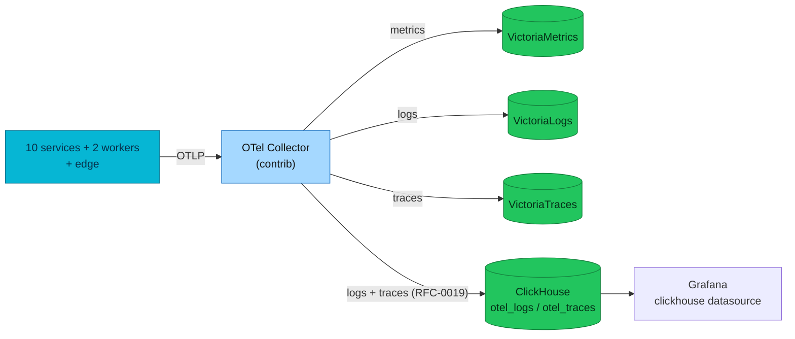

# ClickHouse — OTel logs+traces OLAP

Open-source columnar OLAP giving the platform **long-retention SQL over
OpenTelemetry logs and traces** — the cross-day analytics the 7-day,
LogsQL/TraceQL-only ops primaries can't, plus the `otel_logs`↔`otel_traces`
`trace_id` JOIN in one store (**RFC-0019 Phase B**).

| | |
|---|---|
| **Status** | **Deployed** — local-stack + cluster (RFC-0019 Phase B) |
| **Role** | **Supplementary** OLAP for logs+traces SQL. Runs **alongside** VictoriaLogs / VictoriaTraces (day-to-day ops primaries), which are **unchanged** |
| **Engine** | `clickhouse/clickhouse-server:26.7`, ReplicatedMergeTree, **1 shard × 3 replicas** on a 3-node ClickHouse Keeper quorum |
| **Operator** | Altinity `clickhouse-operator` `0.27.3` + a `ClickHouseInstallation` CR and a `ClickHouseKeeperInstallation` CR |
| **Ingest** | OTel Collector contrib `clickhouse` exporter — fan-out on the **traces + logs** pipelines (metrics stay on VictoriaMetrics — **never** here) |
| **Tables** | `otel.otel_logs`, `otel.otel_traces` (+ `otel_traces_trace_id_ts` MV), created by the **`clickhouse-schema` Job** from DDL committed in git; the exporter only INSERTs |
| **Retention** | `otel.*`: **TTL 90 days** (`ttl_only_drop_parts`) vs 7d on the ops primaries — the long-retention payoff; `otel_logs` / `otel_traces` parts older than **7 days move to the RustFS cold tier** first ([details](#cold-tier-on-rustfs)). The engine's own `system.*` log tables run [7–30 days from three different owners](#the-engines-own-log-tables) |
| **Storage** | hot: local PVC `standard` `10Gi` **per replica** (cluster) + small keeper PVCs; cold: RustFS bucket `clickhouse-otel/{replica}/` behind a 1Gi local cache (policy `hot_cold`); a named `clickhouse-data` volume and no tier (local-stack, which stays single-node) |
| **Query** | Grafana `grafana-clickhouse-datasource` **4.20.0** (`uid: clickhouse`, native `:9000`) + 5 provisioned dashboards in the **ClickHouse** folder (suite Overview→Logs→Traces, service deep dive, platform SQL) |
| **App code** | **Unchanged** — `pkg/obsx` / `pkg/grpcx` untouched; adding ClickHouse is a Collector-exporter change |
| **Design** | [RFC-0019](../../proposals/rfc/RFC-0019/) · [ADR-023](../../proposals/adr/ADR-023-clickhouse-observability-olap/) · [RFC-0028](../../proposals/rfc/RFC-0028/) · [ADR-065](../../proposals/adr/ADR-065-clickhouse-replicated-topology/) |

> **In one line:** the same OTel telemetry, a second sink. Because everything is
> instrumented with OpenTelemetry (the vendor-neutral "narrow waist"), a new
> backend is a Collector-exporter change — not an application change.

---

## Table of contents

1. [Overview](#overview)
2. [Reading path](#reading-path)
3. [What ClickHouse is](#what-clickhouse-is)
4. [Core components](#core-components)
5. [Architecture](#architecture)
6. [How it works in this platform](#how-it-works-in-this-platform)
7. [Operations](#operations)
8. [Grafana](#grafana) — datasource, Explore, dashboard grammar, the standard suite
9. [Metrics & alerting](#metrics--alerting) — engine-health scrape, alert catalog, runbook stubs
10. [Playground — MergeTree by hand](#playground--mergetree-by-hand)
11. [Glossary](#glossary)
12. [Where each store belongs](#where-each-store-belongs)
13. [Commerce analytics (Phase A — not deployed)](#commerce-analytics-phase-a--not-deployed)
14. [FAQ](#faq)
15. [References](#references)

---

## Overview

VictoriaLogs and VictoriaTraces both cap at **7-day** retention and answer
**LogsQL / the Jaeger query API only**. There is no cross-day **SQL/OLAP** over
structured log/trace fields (errors by service over weeks, duration percentiles,
status mixes) and no way to **JOIN** logs↔traces on `trace_id` in one store. RED
metrics on VictoriaMetrics do not substitute for log/trace search.

ClickHouse fills exactly that gap as a **supplementary** backend: the OTel
Collector dual-writes logs and traces to it while the ops primaries keep running
untouched. It is **not** a replacement for CloudNativePG (OLTP source of truth)
or for the primary observability stack.

---

## Reading path

1. **Engine** — [fundamentals](fundamentals.md) (OLAP, columnar, MergeTree, 1×3 vs the VLDB paper)
2. **Junior skill** — [schema-and-queries](schema-and-queries.md) (`ORDER BY` → `EXPLAIN` granules → codecs last)
3. **Trace-id lookup** — [materialized-views](materialized-views.md) (incremental `TO`, not a Postgres index)
4. **This platform** — [Architecture](#architecture) → [How it works here](#how-it-works-in-this-platform) → [Operations](#operations) → [Grafana](#grafana)
5. **Hands-on** — [Playground](#playground--mergetree-by-hand)
6. **Lookup** — [Glossary](#glossary) · [FAQ](#faq)

Pair with the PostgreSQL [storage and WAL fundamentals](../../databases/fundamentals/storage-and-wal.md)
if you already know Postgres heap / WAL / B-tree.

---

## What ClickHouse is

**ClickHouse** is an open-source **OLAP** database: append ingest, columnar
parts, SQL aggregation. On this platform it is the **90-day** store for
`GROUP BY`, percentiles, and `trace_id` correlation — not LogsQL "find this
line", and not a replacement for PostgreSQL OLTP.

Full engine lesson (OLAP vs OLTP vs search, columnar files, MergeTree,
VLDB figures, 1 shard × 3 vs the paper's 2×2): **[fundamentals.md](fundamentals.md)**.
Making `otel_*` queries cheap: **[schema-and-queries.md](schema-and-queries.md)**.

---

## Core components

| Piece | Role |
|-------|------|
| **clickhouse-server** | Query engine + storage (native TCP `:9000`, HTTP `:8123`) |
| **clickhouse-operator** | Altinity operator; reconciles a `ClickHouseInstallation` CR into a StatefulSet |
| **Table engine** | Storage semantics — **MergeTree** is the analytics default |
| **Part** | Immutable on-disk chunk produced by an insert batch |
| **Granule** | ~8192-row read unit; the sparse index points at the first row of each granule |
| **Materialized view** | Incremental `TO` table `otel_traces_trace_id_ts` — [materialized-views.md](materialized-views.md) |

MergeTree parts, sparse granules, and skipping indexes: [fundamentals](fundamentals.md).
Prove prune on the live tables: [Playground](#playground--mergetree-by-hand).

---

## Architecture

The Collector fans telemetry out to every backend in parallel. ClickHouse is the
5th trace sink and the 2nd log sink; a failure there cannot stall the ops
primaries (`sending_queue` + `retry_on_failure` isolate it).


```mermaid
flowchart LR
  Apps["10 services + 2 workers<br/>+ edge"] -->|OTLP| Col["OTel Collector<br/>(contrib)"]
  Col -->|metrics| VM[("VictoriaMetrics")]
  Col -->|logs| VL[("VictoriaLogs")]
  Col -->|traces| VT[("VictoriaTraces")]
  Col -->|"logs + traces (RFC-0019)"| CH[("ClickHouse<br/>otel_logs / otel_traces")]
  CH --> Graf["Grafana<br/>clickhouse datasource"]

  classDef service fill:#06b6d4,color:#082f49,stroke:#0e7490;
  classDef data fill:#22c55e,color:#052e16,stroke:#15803d;
  classDef collector fill:#a5d8ff,color:#111,stroke:#1971c2;
  class Apps service;
  class Col collector;
  class VM,VL,VT,CH data;
```

**Logs-first analytics.** Traces are head-sampled at the edge (50% cluster baseline / 100% local), so
`otel_traces` counts undercount real traffic; `otel_logs` is **100% unsampled**
and is the counting workhorse. Traces are exemplars joined back on `trace_id`.

---

## How it works in this platform

| Aspect | Detail |
|--------|--------|
| **Engine** | `clickhouse/clickhouse-server:26.7`, ReplicatedMergeTree, 1 shard × 3 replicas ([ADR-065](../../proposals/adr/ADR-065-clickhouse-replicated-topology/)) |
| **Operator** | Altinity `altinity-clickhouse-operator` `0.27.3` (HelmRelease in the `controllers` wave, ns `monitoring`); CRDs health-checked before the CHI applies (`kubernetes/infra/controllers/clickhouse-operator/`) |
| **Instance** | `ClickHouseInstallation` `clickhouse` (cluster `otel`) → StatefulSets `chi-clickhouse-otel-0-{0,1,2}`, one per node (host anti-affinity); own Flux Kustomization `clickhouse-local` `dependsOn [controllers-local, secrets-local]`, health-checking **all three** (`kubernetes/infra/configs/clickhouse/`) |
| **Coordination** | `ClickHouseKeeperInstallation` `keeper`, 3 replicas, referenced by name (`zookeeper.keeper.name`); holds the replication metadata. A replica that loses its Keeper session serves reads and refuses writes |
| **Storage** | PVC `standard` `10Gi` per replica (`volumeClaimTemplates`) + keeper data `2Gi` (no log PVC — the operator's keeper logs to console); S3 disk `s3` on RustFS + cache disk `s3_cache` + policy `hot_cold` from `03-storage-rustfs.xml` on the CHI, credentials via `from_env` from `clickhouse-rustfs-credentials`; local-stack uses a named `clickhouse-data` volume |
| **Credentials** | `default` user password from OpenBAO `secret/local/infra/clickhouse/admin` via the `clickhouse-credentials` `ClusterExternalSecret` → Secret in `monitoring` (selector label `platform.duynhlab/clickhouse`); local-stack uses an inline dev password |
| **Ingest** | Collector contrib `clickhouse` exporter appended to the `traces` + `logs` pipelines, **INSERT-only** (`create_schema: false`); `async_insert`, `sending_queue`, `retry_on_failure`; password via `${env:CLICKHOUSE_PASSWORD}` (`extraEnvs` secretKeyRef) |
| **Schema owner** | The `clickhouse-schema` **Job**, SQL committed in `kubernetes/infra/configs/clickhouse-schema/` ([ADR-065](../../proposals/adr/ADR-065-clickhouse-replicated-topology/)). It creates the `otel` database with `ENGINE = Replicated` on each replica, then the tables once; the database's Keeper log propagates them. TTL 90d and the 7-day `TO VOLUME 'cold'` move live in that DDL. Fresh-only: there is no migration path, a pre-tier cluster is rebuilt by `make up` |
| **Security** | `runAsNonRoot`, `runAsUser: 101`, `fsGroup: 101`, `allowPrivilegeEscalation: false`, drop `ALL` caps, `seccompProfile: RuntimeDefault`; `/ping` liveness+readiness; pinned image (PSS-baseline + no-latest) |
| **Access** | Grafana datasource `uid: clickhouse` (`clickhouse-clickhouse.monitoring.svc.cluster.local:9000`, native, password via `valuesFrom`); **not** on any public Ingress; the `default` password is the access control (no NetworkPolicy — `monitoring` has no default-deny and netpol is inert on kindnet; a `:9000`/`:8123` NetworkPolicy is a follow-up for an enforcing CNI) |
| **Startup ordering** | `clickhouse-local` → `clickhouse-schema-local` (the Job, `wait: true`) → `tracing-local`. The collector runs no DDL, so it must not start before the schema exists — it can no longer create what it is missing. In local-stack, which is single-node, the exporter still creates its own schema via `depends_on: service_healthy` |
| **Why the store's wave has no `wait`** | `wait` and `healthChecks` are mutually exclusive in Flux and `wait` wins. `configs/clickhouse` applies only custom resources, whose status kstatus cannot assess, so `wait: true` made that wave report Ready in **371ms with zero pods** and released downstream early. It gates on the six operator-created StatefulSets instead. The schema wave is the opposite case — it applies a Job, which kstatus does assess, so it uses `wait: true` |
| **Why the Job, not the exporter** | Exporter-owned `ON CLUSTER` DDL cannot reach a replica that joins the distributed-DDL queue later, and `IF NOT EXISTS` blocks every repair. Measured twice: schema on 1 of 3, then 2 of 3 replicas after the ordering fix. The Job sidesteps the queue entirely — database per replica, tables once inside a `Replicated` database |
| **Dashboards** | 5 provisioned boards in the **ClickHouse** Grafana folder — see [Grafana](#grafana); local-stack via file provider, cluster via `configMapGenerator` → `GrafanaDashboard` CRs |
| **local-stack** | `clickhouse` compose service (`:8123` HTTP, `:9000` native), collector `clickhouse` exporter, Grafana plugin + provisioned datasource; e2e audit check **C6** (`SELECT count() FROM otel.otel_traces/otel_logs`) |

The Collector's other sinks are untouched: VictoriaLogs and VictoriaTraces
keep receiving, and the metrics pipeline never routes to ClickHouse.

---

## Operations

### Deployed schema (real DDL)

This DDL is **committed**, in
`kubernetes/infra/configs/clickhouse-schema/configmap-schema.yaml`, and applied
by the `clickhouse-schema` Job. It was captured with `SHOW CREATE TABLE` from a
cluster the exporter itself had built, so it matches what the exporter expects
to INSERT into — note the replicated engine, the sort key, day-partitioning,
90-day TTL, per-column codecs, and skipping indexes:

```sql
CREATE TABLE IF NOT EXISTS otel.otel_traces
(
    `Timestamp` DateTime64(9) CODEC(Delta(8), ZSTD(1)),
    `TraceId` String CODEC(ZSTD(1)),
    `ServiceName` LowCardinality(String) CODEC(ZSTD(1)),
    `SpanName` LowCardinality(String) CODEC(ZSTD(1)),
    `Duration` UInt64 CODEC(ZSTD(1)),
    `StatusCode` LowCardinality(String) CODEC(ZSTD(1)),
    -- … ResourceAttributes / SpanAttributes maps, Events.*, Links.* …
    INDEX idx_trace_id TraceId TYPE bloom_filter(0.001) GRANULARITY 1,
    INDEX idx_duration Duration TYPE minmax GRANULARITY 1
)
ENGINE = ReplicatedMergeTree
PARTITION BY toDate(Timestamp)
ORDER BY (ServiceName, SpanName, toDateTime(Timestamp))
TTL toDateTime(Timestamp) + toIntervalDay(7) TO VOLUME 'cold', toDateTime(Timestamp) + toIntervalDay(90)
SETTINGS index_granularity = 8192, ttl_only_drop_parts = 1, storage_policy = 'hot_cold';
```

- **`ORDER BY (ServiceName, SpanName, …)`** — the sparse index; filtering by
  `ServiceName` prunes granules (proven in the [Playground](#playground--mergetree-by-hand)).
  Why that prefix, and how to read `EXPLAIN`: [schema-and-queries](schema-and-queries.md).
- **`PARTITION BY toDate(Timestamp)`** + **`ttl_only_drop_parts = 1`** — TTL drops
  whole day-partitions, so 90-day expiry is a cheap `DROP PARTITION`, not a rewrite.
- **`TTL … + 7 days TO VOLUME 'cold'`** + **`storage_policy = 'hot_cold'`** — a
  day's parts move to the RustFS cold tier once every row in them is a week old,
  and are dropped from there at 90 days. Mechanics: [Cold tier on RustFS](#cold-tier-on-rustfs).
- **`bloom_filter` on `TraceId`** + the `otel_traces_trace_id_ts` materialized view
  make single-trace lookups fast despite the service-first sort key —
  [materialized-views](materialized-views.md).
- **`ENGINE = ReplicatedMergeTree`** with no arguments — the server's
  `default_replica_path` (`/clickhouse/tables/{uuid}/{shard}`) and
  `default_replica_name` (`{replica}`) apply, so every `CREATE` mints a fresh
  Keeper znode and a drop-and-recreate can never collide with a stale replica
  path ([ADR-065](../../proposals/adr/ADR-065-clickhouse-replicated-topology/)).
- **No `ON CLUSTER`, on purpose.** The database is `ENGINE = Replicated`, so DDL
  run on one replica propagates through the database's own Keeper log. That is
  what makes the bootstrap immune to the failure that `ON CLUSTER` caused: a host
  joining the distributed-DDL queue late skips earlier entries forever. A replica
  added later initialises its own tables.
- **The database is created per replica** (`00-database.sql`, applied by the Job
  to each host in turn), which is the one statement that cannot be replicated by
  the thing it creates.

### Retention & compression

| Table | Retention | Measured compression (local-stack) |
|-------|-----------|-----------------------------------|
| `otel_traces` | 90d | **10.5×** (1.20 MiB → 117 KiB) |
| `otel_logs` | 90d | **8×** (2.06 MiB → 262 KiB) |

Retention is **90 days** here vs **7 days** on VictoriaLogs/VictoriaTraces — the reason
ClickHouse exists on this platform.

#### Cold tier on RustFS

Since 2026-09-07 (owner decision, no RFC) `otel_logs` and `otel_traces` run a
two-volume storage policy: **hot** is the `default` disk (the PVC), **cold** is a
1Gi local cache in front of an `s3` disk on the in-cluster RustFS object store
(`http://rustfs-svc.rustfs.svc.cluster.local:9000/clickhouse-otel/{replica}/`,
plain HTTP, path style). The table TTL has two clauses: `+ 7 days TO VOLUME
'cold'`, `+ 90 days` delete. `otel_traces_trace_id_ts` stays hot — three narrow
columns and the random-access lookup every trace-by-id query starts with, so S3
would cost a RustFS round-trip per lookup for no space gain.

| Piece | Where | What it does |
|---|---|---|
| Disks `s3`, `s3_cache`; policy `hot_cold` | CHI `spec.configuration.files` `03-storage-rustfs.xml` | `move_factor 0` (only TTL moves — the hot disk is the quota-less node filesystem, so free-space-driven moves would fire at node <10 % and write to that same filesystem); `perform_ttl_move_on_insert false` (an INSERT never waits on RustFS); zero-copy replication explicitly off |
| Credentials | `clickhouse-rustfs-credentials` (ClusterExternalSecret from the OpenBAO RustFS keys) → container env `CLICKHOUSE_S3_*` → `from_env` in the XML | Never written into the manifest; not named `AWS_*` so the SDK's default chain cannot pick them up for unrelated `s3()` calls |
| Bucket | `clickhouse-otel`, created by the RustFS `mc` Job and 30-minute CronJob (two lists, `make validate` keeps them equal) | `clickhouse-local` `dependsOn: storage-local` because the `s3` disk runs an access check at server start |
| DDL | `configmap-schema.yaml` (tiered CREATEs, in the server's normalised form) | Fresh `make up` creates the tiered form directly; no migration path by decision. The schema Job refuses to start until every replica has the policy and verifies two tiered tables plus both S3 disks |

**How a part moves.** TTL is applied by background merges, so a part crosses to
cold once *every* row in it is older than 7 days — with daily partitions that is
the day after its partition turns a week old — and each of the three replicas
uploads its own copy (no zero-copy). The object names are random; what ties them
to a table is the **metadata file** ClickHouse keeps on the PVC under
`/var/lib/clickhouse/disks/s3/`, one per column file, listing blob keys and sizes.

**What this buys on Kind, honestly: the production shape, not capacity.** The
`default` disk, the cache, the S3 metadata and RustFS's own PV are all hostPath
directories on the same node filesystem, and cold bytes exist three times. The
rehearsal — TTL moves, a second disk in every alert, an object store that can be
down — is the point.

**The engine deletes; the bucket never expires.** The RustFS bucket carries no
lifecycle rule and must never get one: an object removed behind ClickHouse's back
leaves a metadata file pointing at nothing, and the part it belongs to becomes
unreadable with no self-heal short of re-fetching from a peer. On a real object
store, a lifecycle rule may exist only as an orphan backstop set well after the
table TTL (the post that prompted this work says 30 vs 32 days), never as the
retention mechanism.

**When RustFS is down** (it is one pod): INSERTs land hot; queries pruned to the
last 7 days succeed; anything touching a cold partition fails with `S3_ERROR`
(alert `ClickHouseS3Errors`); moves, cold merges and cold-part TTL drops retry
with no loss; a ClickHouse pod that restarts during the outage stays down on the
disk access check until RustFS returns.

**Orphans.** Objects under a replica's `{replica}/` prefix are deleted by hand
only when that replica's PVC is being rebuilt from its peers — never otherwise.

```sql
-- where the parts are
SELECT table, disk_name, count() AS parts, formatReadableSize(sum(bytes_on_disk)) AS on_disk,
       min(min_date), max(max_date)
FROM system.parts WHERE database = 'otel' AND active
GROUP BY table, disk_name ORDER BY table, disk_name;

-- moves in flight, and parts that should have moved but did not (expect 0 rows)
SELECT * FROM system.moves;
SELECT table, partition FROM system.parts
WHERE database = 'otel' AND active AND disk_name = 'default' AND max_date < today() - 8;

-- local metadata -> S3 key mapping, and the cache fill against its 1Gi
SELECT * FROM system.remote_data_paths LIMIT 5;
SELECT cache_name, formatReadableSize(sum(size)) FROM system.filesystem_cache GROUP BY cache_name;
```

Rollback is data-safe but ordered: `MODIFY TTL` back to delete-only, then
`ALTER TABLE … MOVE PARTITION '<day>' TO VOLUME 'hot'` per cold partition, then
`MODIFY SETTING storage_policy = 'default'` (refused while parts sit on
`s3_cache`). Never remove `03-storage-rustfs.xml` while any part is cold.

#### The engine's own log tables

`otel.*` is only half the disk story. ClickHouse writes its own operational
history into `system.*` log tables, and the retention on them comes from three
different places — two of which this platform does not own.

| `system.*` table | Partition | TTL | Owner of the TTL |
|---|---|---|---|
| `query_log`, `part_log` | daily (`event_date`) | 30 d | Altinity operator, via `config.d/01-clickhouse-0{3,4}-*.xml` |
| `trace_log` | daily (`event_date`) | **7 d** | operator sets 30 d; **this repo overrides it** — `02-` loads after `01-`, see below |
| `processors_profile_log`, `aggregated_zookeeper_log`, `zookeeper_connection_log`, `blob_storage_log` | **daily** (`event_date`) | 30 d | upstream ships the TTL and a **monthly** partition; **this repo** re-partitions them by merging `partition_by` / `ttl` / `settings` into upstream's block (no `replace`, no `<engine>`, so the sorting key and intervals stay upstream's) |
| `metric_log`, `asynchronous_metric_log`, `text_log`, `error_log`, `background_schedule_pool_log`, `query_views_log` | **daily** | **7 d** | **this repo** — `configuration.files` on the `ClickHouseInstallation` |
| `query_metric_log` | — | — | **removed** by this repo (`<query_metric_log remove="1"/>`, 2026-09-07): upstream ships it with no TTL, 1,391 columns, and nothing here reads it |

Every repo-managed engine string also carries `SETTINGS ttl_only_drop_parts = 1`
(2026-09-07). With a daily partition and a day-granular TTL every row in a part
expires at the same instant, so expiry is a whole-part drop instead of a rewrite
that reads the part to produce an empty one. `query_log` and `part_log` are the
exception: operator-owned, still at the default `0`, a follow-up once their
operator XML has been read off a pod. `text_log` runs at `level` **information**
since the same date — at `trace` it was the largest `system.*` table (~60 k
rows/hour, measured flat after the merge retry storm ended, so the storm was not
the cause). `metric_log` uses `schema_type` **`transposed_with_wide_view`**: one
row per metric instead of ~1,900 columns. On ClickHouse 26.7 this mode does not
expose the old wide columns through a compatibility view; that is safe here
because nothing on the platform queries `system.metric_log`. Merge memory scales
with column count, and one merge peaked at 1.27 GiB of a 1.80 GiB self-cap.

Before the last row existed, those five had **no expiry at all** and grew for the
life of the cluster: ~59 % of all system-log bytes at 46 minutes uptime.
`metric_log` is the one that matters — roughly 1,900 columns and one row per
second whether or not anything is querying, a fixed cost that does not scale down
when idle. `system.*` tables are ordinary local `MergeTree`, not replicated, so
that growth is **per replica**, on each node's own filesystem.

`query_thread_log` is absent by design — the same operator config removes it.

##### `trace_log`: the biggest table, and it is not query traffic

Measured on a 14-hour-old cluster (2026-09-06): **6.3 million rows, 145 MiB**, the
largest `system.*` table by a wide margin and still climbing at roughly 1.2 M
rows/hour. At the operator's 30-day TTL that projects to **7.3 GiB per replica**,
22 GiB across the three — and `system.*` tables are local, not replicated, so each
node pays in full. Nothing would have stopped it: the PVCs are 10 Gi but
local-path enforces no quota, so `df` inside the pod reports the *node* filesystem
(299 GiB free here) and ClickHouse sizes itself against that.

The surprise is the source. `query_log` recorded **2–40 queries** in the same
hours, so this is not query profiling. In a 10-minute sample:

| `trace_type` | rows |
|---|---|
| `Memory` | 89,082 |
| `MemoryPeak` | 89,032 |
| `Real` | 9,675 |
| `CPU` | 388 |

**95 % is the memory profiler**, which samples a stack every
`memory_profiler_step` (4 MiB) of allocation by *any* thread — merges and inserts
included. An idle ClickHouse still allocates constantly, so the table grows
whether or not anyone queries it.

This repo therefore overrides the operator and sets `trace_log` to **7 days**
(≈1.7 GiB per replica). Disabling the profiler was the alternative and was
rejected: this cluster runs a 1.12 GiB self-cap that has already refused ad-hoc
admin queries, so memory samples are worth keeping — just not for a month. The
override works because `config.d` loads lexicographically and this repo's file is
`02-system-log-retention.xml` against the operator's
`01-clickhouse-05-trace_log.xml`; everything but the TTL is copied verbatim,
including `ORDER BY event_time`. **The cost of that override:** a future operator
change to its own `trace_log` template is silently ignored here, so re-read that
file on operator bumps.

**Why the partition key moves with the TTL.** All five shipped monthly
(`toYYYYMM`). A 7-day TTL on a monthly partition is the misaligned case in
[Partitions and TTL](fundamentals.md#the-alignment-rule): at the default
`ttl_only_drop_parts = 0` expiry deletes rows, which means rewriting
month-sized parts to trim 7-day-old data. Daily partitions make each expiry a
bounded one-day rewrite, and `ttl_only_drop_parts = 1` (set 2026-09-07) turns
that rewrite into a drop. The operator reached the same conclusion for its own
three tables.

> Count these yourself rather than trusting the table. ClickHouse creates a
> system log table **lazily**, on its first write, so a freshly built cluster
> shows fewer of them than one that has been running for days —
> `query_views_log`, `asynchronous_insert_log` and `blob_storage_log` all arrive
> later. What is stable is the shape: which tables the operator manages, which
> upstream manages, and which this repo manages.
>
> **That warning was right and still not enough** (2026-09-06). It said the late
> arrivals carry "upstream defaults", which quietly assumes a default *exists*.
> For `asynchronous_insert_log` (3 d) and `blob_storage_log` (30 d) it does. For
> **`query_views_log` it does not** — upstream ships that one with no TTL at all,
> and on this platform it is written by our own materialized view
> (`otel.otel_traces_trace_id_ts_mv`), one row per trace-insert batch, so it grows
> with ingestion for the life of the cluster. It is now the sixth table in the
> repo-owned row above. The lesson generalises past ClickHouse: **an audit that
> enumerates what exists cannot see what has not been created yet.** Enumerate
> the declaration, not the instance.

```sql
-- (1) what EXISTS, with the real retention rather than a yes/no. Extract the
--     number: a presence check cannot tell 7 d from the operator's 30 d, and
--     reading "has TTL" as "ours" is how the sixth table stayed missing.
SELECT name, partition_key,
       extractAll(create_table_query, 'toIntervalDay\\((\\d+)\\)')[1] AS ttl_days,
       formatReadableSize(total_bytes) AS size
FROM system.tables
WHERE database = 'system' AND engine LIKE '%MergeTree'
ORDER BY total_bytes DESC;
```

```bash
# (2) what is DECLARED — the authoritative list, including tables not yet born.
#     Diff this against (1): anything declared, absent, and without a TTL in the
#     effective config is a table that will arrive unbounded.
kubectl exec -n monitoring chi-clickhouse-otel-0-0-0 -c clickhouse -- \
  sh -c "grep -oE '<[a-z_]+_log>' /etc/clickhouse-server/config.xml | tr -d '<>' | sort -u"
```

Measured 2026-09-06: **24 declared, 13 born.** Of the eleven not yet created,
`crash_log` is deliberately left alone — a crash record is the last thing to
expire — and the rest (`backup_log`, `session_log`, `opentelemetry_span_log`,
the lake-format logs, `instrumentation_trace_log`) belong to features this
platform does not use. `query_metric_log` was in that list and then appeared on
the 2026-09-07 audit as the seventh table with no TTL — it is now removed from
the config outright. Revisit this list when one of them appears.

**Do not shorten that predicate.** Neither `'TTL'` nor `' TTL '` works:
`metric_log` has ~1,900 columns and one of their *comments* reads `"... TTL
remove requests successfully enqueued"`, so both forms report a TTL the table
does not have. Match the clause, or read what follows `ORDER BY`.

##### Writing this config: XML forbids `--` inside a comment

Learned by crash-looping the cluster on 2026-09-06. `spec.configuration.files`
carries raw XML inside a YAML string, and **nothing in the repo parsed it**:
kustomize, kubeconform and the CRD schema all see a string. ClickHouse is the
first reader, at startup, and it does not degrade — a malformed file is
`SAXParseException: Invalid token`, the server refuses to boot, and the operator
walks that into `CrashLoopBackOff` one replica at a time.

The trigger was an em-dash typed as `--` inside an `<!-- … -->` block, which XML
does not allow. `make validate` passed and the sync went out.

Two things came out of it. Keep explanatory prose in the **YAML** comments above
`files:`, where the existing block already lives, and leave the XML minimal. And
`scripts/flux-validate.sh` now parses every entry in `configuration.files`, so the
same mistake fails locally instead of on the cluster.

##### After changing a system table's engine: drop the `_N` leftovers

Observed end to end on 2026-09-06, when `trace_log` and `query_views_log` were
added to the block. The rename is **per replica and per table, at that table's
first write after the config change**, so the two behaved completely differently
on the same cluster at the same moment:

| Replica | `trace_log` | `query_views_log` |
|---|---|---|
| 0 | renamed at once — `trace_log_0` (147.9 MiB, 30 d) beside a fresh 7 d table | not renamed yet |
| 1 | renamed — `trace_log_0` (140.3 MiB) | renamed — `query_views_log_0` (190 KiB) |
| 2 | renamed — `trace_log_0` (113.1 MiB) | not renamed yet |

`trace_log` flipped instantly on every replica because the memory profiler writes
to it constantly; `query_views_log` only flipped where a materialized-view insert
happened to land. **A cleanup pass straight after the apply will therefore miss
tables**, which is why this is a step to repeat rather than a one-shot.

> **The suffix increments, and matching only `_0` hides the rest.** That first
> cleanup reported "401 MiB reclaimed, 0 leftovers remaining" and was wrong on the
> second half: it selected `name LIKE '%_0'`, and so did the check that confirmed
> it, so a query that could not see `_1` was used to prove `_1` did not exist. A
> later config edit found **`trace_log_1` holding 153 MiB at the original 30-day
> TTL** on one replica, plus `query_views_log_0`, `_1` and `_2` — three
> generations of the same table. Across the three replicas **~430 MiB** was still
> there. Every engine change mints another generation, so match the number, not
> the digit zero: `match(name, '_log_[0-9]+$')`, which is what the query below
> already did and the drop example below did not.

Changing the engine definition does **not** ALTER the table. ClickHouse renames
the old one to `<name>_N` and creates a fresh one. The renamed copy keeps its old
engine, including its old TTL, so it self-drains when the former table already
had retention. Dropping it is optional immediate reclamation. The exception is
an old `query_metric_log`: it had no TTL, and `remove="1"` prevents new writes
without deleting the table, so an upgraded cluster must drop that leftover
explicitly after review.

The rename is **lazy** — measured on 26.7.3.19, it happens at each table's first
write after the config change, not at startup. So this cannot be a single pass
straight after apply: re-run it until nothing is returned.

```sql
-- Run interactively on each replica with clickhouse-client --ask-password.
SELECT name, formatReadableSize(total_bytes), engine_full
FROM system.tables
WHERE database = 'system' AND match(name, '_log_[0-9]+$');
```

Drop what that lists — `DROP TABLE system.<name> SYNC` for **each** name it
returns, `_1` and `_2` included — then repeat after a few hours to catch the
tables that had not been written to yet. Verify with the same `match(...)`
pattern you dropped with; a narrower check will happily report success.

### Query examples

Run from Grafana Explore (datasource **ClickHouse**) or `clickhouse-client`:

```sql
-- Error rate by service, last 7 days (SQL the ops primaries can't express)
SELECT ServiceName,
       100.0 * countIf(StatusCode = 'STATUS_CODE_ERROR') / count() AS err_pct
FROM otel.otel_traces
WHERE Timestamp > now() - INTERVAL 7 DAY
GROUP BY ServiceName ORDER BY err_pct DESC;

-- p95 latency by operation
SELECT ServiceName, SpanName, round(quantile(0.95)(Duration)/1e6, 2) AS p95_ms
FROM otel.otel_traces GROUP BY ServiceName, SpanName ORDER BY p95_ms DESC LIMIT 20;

-- Cross-signal: correlate logs to traces on trace_id (one store, one query)
SELECT t.ServiceName AS service,
       count(DISTINCT t.TraceId) AS traces,
       count(l.TraceId)          AS correlated_logs
FROM otel.otel_traces t
ANY LEFT JOIN otel.otel_logs l ON t.TraceId = l.TraceId
WHERE t.TraceId != '' GROUP BY service ORDER BY traces DESC;
```

### Dashboard

All five provisioned dashboards are documented in [Grafana](#grafana) below —
the standard suite (Overview → Logs → Traces), the service deep dive, and the
platform-wide *OTel logs+traces SQL* board.

### Runbook — data not appearing

1. **Drive traffic**, then wait **~30–45s** (OTLP export + batch lag).
2. Collector export errors: `otelcol_exporter_send_failed_*` for the `clickhouse`
   exporter, or `kubectl logs -n monitoring deploy/otel-collector | grep -i clickhouse`.
3. ClickHouse reachable? `SELECT 1` (see [Playground](#playground--mergetree-by-hand)).
4. Tables exist? `SHOW TABLES FROM otel` — created by the `clickhouse-schema`
   Job, not by the exporter. If they are missing, read
   `kubectl -n monitoring logs job/clickhouse-schema`: a wrong password or an
   unreachable replica fails the Job loudly rather than leaving a partial schema.
5. VictoriaLogs/VictoriaTraces still receiving? They are independent sinks — ClickHouse being
   down must not affect them (`sending_queue` isolates backpressure).

---

## Grafana

Grafana turns the `otel` tables into an explorable logs/traces UI and a SQL
dashboard surface. Two ideas carry everything below:

1. **The plugin maps columns, it does not ingest** — Grafana only ever runs
   `SELECT`s; the OTel mapping tells it which columns mean *time*, *severity*,
   *body*, *trace id*, *duration*.
2. **The table's `ORDER BY` decides what is cheap** — service-first filters fly;
   bare trace-id lookups ride the `bloom_filter` index + the
   `otel_traces_trace_id_ts` MV (see [Deployed schema](#deployed-schema-real-ddl)).

### The datasource, as deployed

Plugin `grafana-clickhouse-datasource` **4.20.0** (pinned in the cluster
`GF_INSTALL_PLUGINS` and the local-stack compose). Both environments provision
the same shape (cluster: [`datasource-clickhouse.yaml`](../../../kubernetes/infra/configs/observability/grafana/datasource-clickhouse.yaml),
password from the ESO-managed `clickhouse-credentials` Secret; local-stack:
[`clickhouse.yaml`](../../../local-stack/observability/grafana/provisioning/datasources/clickhouse.yaml)):

```yaml
jsonData:
  host: clickhouse-clickhouse.monitoring.svc.cluster.local   # local: clickhouse
  port: 9000
  protocol: native
  defaultDatabase: otel
  username: default
  logs:    { defaultDatabase: otel, defaultTable: otel_logs,   otelEnabled: true }
  traces:  { defaultDatabase: otel, defaultTable: otel_traces, otelEnabled: true }
```

`otelEnabled: true` unlocks the Logs/Traces query builders, the Explore views,
and trace↔log navigation — without it the datasource is a plain SQL connection.

### OTel schema versions

The DDL is owned by the `clickhouse-schema` Job, but its *shape* still tracks
**0.151.0** (the `TimestampTime` helper column left `otel_logs`):

| Schema | Exporter | `otel_logs` shape |
|--------|----------|-------------------|
| 1.2.9 | contrib < 0.151.0 | has `TimestampTime` |
| **1.3.0** | contrib ≥ 0.151.0 | no `TimestampTime` — what both environments write (contrib `0.159.0`) |

Plugin ≥ 4.20.0 **auto-detects the logs schema from the table's columns** when
the version selector is on auto (latest); our provisioning deliberately does not
pin a version. After any collector bump, `DESCRIBE otel.otel_logs` tells you
which shape a table has — the Job's `CREATE TABLE IF NOT EXISTS` is create-if-absent, so an old table
keeps its old shape until dropped.

### Explore & trace↔log linking

- **Logs** query type generates the column mapping (`Timestamp AS timestamp,
  Body AS body, SeverityText AS level … ORDER BY Timestamp DESC LIMIT 1000`);
  our tables use the default OTel column names, so no custom mapping is needed.
  Builder filters become `WHERE` clauses — `ServiceName` is the cheap one
  (first `ORDER BY` key).
- **Traces** query type maps `TraceId`/`ServiceName`/`SpanName`/`Timestamp`/
  `Duration`; the waterfall detail view resolves a trace id to its time range
  via `otel_traces_trace_id_ts`, sidestepping the service-first sort key.
  `Duration` is nanoseconds — raw SQL panels divide by `1e6` for ms.
- **Linking**, both directions, rides the shared `TraceId` column: log line →
  "View trace"; span → logs filtered `WHERE TraceId = '<id>'`. One store, one
  key — no derived-fields bridge, which is exactly what the VictoriaLogs↔VictoriaTraces
  pair lacks (see [logging](../logging/README.md)).

### Dashboard grammar (raw SQL panels)

Time series: return a datetime aliased `time` plus numerics. Multi-line: field
order matters — time, then the string group, then the value:

```sql
SELECT $__timeInterval(Timestamp) AS time, ServiceName, count() AS spans
FROM otel.otel_traces
WHERE $__timeFilter(Timestamp)
GROUP BY time, ServiceName ORDER BY time
```

| Macro | Expands to |
|-------|------------|
| `$__timeFilter(col)` | `col >= <from> AND col <= <to>` — dashboard time picker |
| `$__timeInterval(col)` | `toStartOfInterval(col, INTERVAL <auto> second)` — adaptive bucketing |
| `$__fromTime` / `$__toTime` | picker edges as `DateTime` scalars — for subqueries/denominators |
| `$__conditionalAll(expr, $var)` | `expr` when the variable has a selection, `1=1` on *All* or an empty textbox |

Recipes live in the shipped dashboards — copy from there instead of reinventing:
error-rate % (`countIf(StatusCode = 'Error') / count()`), latency quantiles
(`quantile(0.95)(Duration)/1e6`), the trace↔log correlation JOIN.

### The standard dashboard suite — Overview → Logs → Traces

Three dashboards, one navigation story — each answers exactly one question:

| Tier | Dashboard (uid) | Question it answers |
|------|-----------------|---------------------|
| 1 | **OTel — Overview** (`clickhouse-otel-overview`) | *Which service is in trouble?* — the triage landing page |
| 2 | **OTel — Logs Explorer** (`clickhouse-logs-explorer`) | *What errors are happening?* |
| 3 | **OTel — Trace Explorer** (`clickhouse-traces-explorer`) | *Where did the request go and which span broke?* |

Overview's "who is in trouble" tables link a service into the Logs Explorer or
the [service deep dive](#the-service-deep-dive-dashboard); every `TraceId` cell
in the suite links into the Trace Explorer, which loads an **in-dashboard trace
waterfall** (`format: 3`, Jaeger-style aliases, window via the MV) with a
**"Logs for this trace"** panel underneath — logs↔traces on one screen.

Design decisions, all verified against live data:

- **Trace-level semantics**: per-trace panels group by `TraceId`; a trace is
  *failed* if ANY span has `StatusCode = 'Error'`; the root span is
  `ParentSpanId = ''` (exactly one per trace). The *Trace status* filter applies
  to that classification — never to member spans — and the volume-row stats
  ignore it by design (they ARE the status summary).
- **Native panels**: logs panels are `format: 2` (SQL aliases
  `timestamp`/`body`/`level`); the waterfall is `format: 3`; multi-line
  timeseries are `format: 0`. Only `format` is load-bearing.
- **Variables**: `$severity` is lowercase (`error,warn,info,notice,debug` — what
  the services actually emit); `$environment` reads
  `deployment.environment.name` (`local` locally, `production` in-cluster) and
  binds to member spans (the edge's own spans carry `deployment.environment.name: local`
  locally via a `customTags` literal, but the cluster CR tags pod identity
  instead and has no `deployment.environment.name`); textbox vars run through
  `$__conditionalAll`.
- **Duration heatmap**: raw `(time, duration_ms)` rows, panel-side bucketing,
  log₂ y-scale, `$sample_mod` constant (1 = no sampling; raise ~500 at volume).
  Span `Events.*` are not populated here — error text comes from `StatusMessage`.

### The service deep-dive dashboard

*ClickHouse — Service deep dive* (`clickhouse-service-deepdive`) applies the
same machinery to **one service at a time**; the platform-wide view stays in
*ClickHouse — OTel logs+traces SQL* (`clickhouse-otel-sql`). Seven rows:

| Row | Panels |
|-----|--------|
| Overview | req/s, error %, p95 (server spans), error-log count, distinct operations |
| Traffic & latency | rate by operation, p50/p95/p99, error % trend, log volume by severity |
| HTTP endpoints | route × method table (calls, 5xx, p95) + status classes — attributes `http.request.method` / `http.route` / `http.response.status_code` |
| gRPC methods | `rpc.method` split into Service/Method (calls, errors, p95) |
| Dependencies | who calls the service (client spans matching `<service>.v1.%`) · what it calls (gRPC callees + `postgresql`/`redis` client spans) |
| Slow & failing | slowest + error spans, TraceId → Explore data links |
| Logs | severity-filtered logs, top error messages, error-traces↔logs JOIN |

Two verified facts every new panel must respect: enum spellings are the short
ones (`StatusCode` `Ok`/`Error`/`Unset`, `SpanKind` `Server`/`Client`/`Internal`
— and Go-SDK success spans are `Unset`, so error-rate is `countIf(Error)/count()`),
and proto packages are named after the owning service, so "who calls product" is
just client spans where `rpc.method LIKE 'product.v1.%'`.

### Plugin-bundled dashboards (manual import — not GitOps)

The datasource ships 7 reference dashboards (datasource config page →
**Dashboards** tab). A UI import lives **only in that Grafana's database** — not
in git, never on the cluster, wiped when the local volume is recreated:

| Dashboard (uid) | Group | What it is |
|---|---|---|
| ClickHouse - Query Analysis (`w5Q2Otank`) | **Server admin** | Query performance over `system.query_log` |
| ClickHouse - Data Analysis (`-B3tt7a7z`) | Server admin | Table/parts/disk usage, compression |
| ClickHouse - Cluster Analysis (`_hAsuzBnz`) | Server admin | Replication/distributed health (mostly N/A single-node) |
| Advanced ClickHouse Monitoring (`e336c8cd-…`) | Server admin | Memory, merges, mark cache, background pools |
| OpenTelemetry Logs Explorer (`otel-logs-explorer`) | **OTel reference** | Upstream generic version of our Logs Explorer |
| OpenTelemetry Traces Explorer (`otel-traces-explorer`) | OTel reference | Upstream Trace Explorer — its heatmap hard-codes `% 500` sampling (near-empty at our volume) |
| OpenTelemetry Service Dashboard (`otel-service-dashboard`) | OTel reference | Upstream per-service view — the deep dive covers this with verified enums/keys |

The server-admin group watches ClickHouse *itself* (`system.*`) — a niche the
in-repo suite doesn't cover; promote one to a provisioned JSON + CR if it earns
a permanent place. Provisioned ClickHouse dashboards live in the **ClickHouse**
Grafana folder on both environments (local: file provider
`foldersFromFilesStructure` + `dashboards/ClickHouse/`; cluster: the CR
`folder:` field).

### Query performance rules

1. **Filter `ServiceName` first** — first `ORDER BY` key; granule pruning does
   the work (proven in the [Playground](#playground--mergetree-by-hand)).
2. **Always `$__timeFilter`** — day partitions make the picker a partition prune.
3. **`ORDER BY Timestamp DESC LIMIT n`** on log queries — never unbounded.
4. **Bare `TraceId` lookups** are for Explore/the trace panel, not per-refresh
   dashboard panels.
5. **Don't `SELECT *`** — name the `Map` keys you need
   (`ResourceAttributes['k8s.pod.name']`).

Integration checks: plugin version via `GET /api/plugins/grafana-clickhouse-datasource`
(→ `4.20.0`); datasource health via *Save & test* or `SELECT 1` in Explore; data
not appearing → [Runbook](#runbook--data-not-appearing).

---

## Metrics & alerting

> **Planned** — the manifests below are merged; the first scrape, the alert
> load into VMAlert, and the expression tuning all happen at the Kind gate.
> local-stack does not run the operator, so nothing here is exercisable on
> compose.

The five dashboards above watch the **data** (OTel rows over the SQL
datasource). This chapter is the **engine**: is the server up, is the disk
filling, are merges keeping pace with inserts. Before this landed the engine
view was blind — no scrape, no alert. A dead ClickHouse used to surface in the
worst possible way too: the collector's `create_schema` startup step blocked
every restart until the store returned. Since RFC-0028 it does not — the
collector owns no DDL, so a dead store costs the ClickHouse sink and nothing
else.

### Metric sources

| Endpoint | Producer | Families | Use |
|---|---|---|---|
| operator Service `:8888/metrics` | Altinity operator | `clickhouse_operator_chi_reconciles_*`, `clickhouse_operator_host_reconciles_*`, pod events | Control-plane health |
| operator Service `:8888/chi` | metrics-exporter sidecar | `chi_clickhouse_metric_*` (system.metrics), `chi_clickhouse_event_*` (system.events), `chi_clickhouse_async_metric_*`, disks, parts, `chi_clickhouse_system_errors_*` | Engine health per CHI |
| CHI pod `:9363/metrics` (`settings.prometheus/*`) | `clickhouse-server` itself | `ClickHouseMetrics_*`, `ClickHouseProfileEvents_*`, `ClickHouseAsyncMetrics_*`, `ClickHouseErrorMetric_*` | Per-replica granularity |

Both operator endpoints are scraped by the **chart's ServiceMonitor**
(`serviceMonitor.enabled` in `controllers/clickhouse-operator/helmrelease.yaml`).

**The third source was enabled with replication** ([RFC-0028](../../proposals/rfc/RFC-0028/)),
and the reason is worth keeping: at 1×1 the exporter's `/chi` carried every
engine signal the alerts needed and a per-pod scrape would only have duplicated
it. Three replicas change the question the metrics have to answer. The exporter
aggregates by CHI, so it cannot say *which* replica is sick, and
`ClickHouseMetrics_ReadonlyReplica` — a replica that lost its Keeper session and
silently stopped accepting writes while still serving reads — has no equivalent
in the exporter's view at all. It is scraped per pod by
`podmonitors/clickhouse-server.yaml` (`job="clickhouse-server"`, label
`replica`); a PodMonitor rather than a ServiceMonitor because the
operator-generated Services carry only the native, HTTP and interserver ports.

### Alerts

Rules live in
`configs/observability/metrics/prometheusrules/observability/clickhouse-alerts.yaml`,
catalogued in [alert-catalog § 8b](../alerting/alert-catalog.md#8b-clickhouse-otel-olap-engine).
Three of the twelve this section once claimed were deleted on 2026-08-22 for
naming series the exporter does not publish — count the file, not the prose. The
file holds **22** since the 2026-09-08 awesome-prometheus-alerts audit added
seven.

The spine: the **reachability pair** — `ClickHouseReplicaUnreachable` (warning:
one of three cannot be fetched, its peers still serve) escalating to
`ClickHouseAllReplicasUnreachable` (critical: the store is down and the
edge access log, which lives nowhere else, is being dropped); the **replication pair**
— `ClickHouseZooKeeperExceptions` and `ClickHouseReadonlyReplica`, which catch
the failure nothing else notices, because a replica that lost its quorum keeps
answering reads while falling behind; the **disk pair** (<15% warn, <5%
critical, now counting data stored three times, pinned to `disk="default"` since
the cold tier gave the exporter `s3` / `s3_cache` series too); the **cold-tier
signal** `ClickHouseS3Errors` (a replica failing S3 requests against RustFS —
hot-window reads and INSERTs survive, cold reads and moves do not); the
**insert-pressure ladder** (too-many-parts → delayed → rejected, with
`ClickHouseTooManyPartsPerPartition` covering the dimension the guards actually
enforce and `ClickHouseInsertsFailing` catching every other INSERT error); and
the consumer-side **ExporterUnhealthy** (the collector's
`send_failed_*{exporter="clickhouse"}` — the collector can be up while its
ClickHouse exporter backpressures).

The 2026-09-08 audit added a **replication trio** the group had no equivalent
for — `ClickHouseReplicationLag` (a replica five minutes behind serves stale
data to a third of Grafana queries with no error anywhere),
`ClickHouseKeeperSessionLost` (the gauge that drops the instant a Keeper session
goes, unlike the exceptions rate or the readonly end state) and
`ClickHouseReplicatedDataLoss` (critical at the first increment) — plus
`ClickHouseServerNotScraped`, the `absent()` guard on the `:9363` PodMonitor
that ten of these rules depend on and would have gone silent with.

### Dashboard

`ClickHouse Server / Engine` (folder ClickHouse, VictoriaMetrics datasource —
not the SQL one): up/uptime, query and insert rates, the insert-pressure
ladder, parts and merges, disk and memory, a `system.errors` top-N table, and
the operator's reconcile counters.

### Runbook stubs

- **ClickHouseReplicaUnreachable / ClickHouseAllReplicasUnreachable** —
  `kubectl -n monitoring get po -l clickhouse.altinity.com/chi=clickhouse`, then
  pod logs. If the pod is up but fetch fails, check the
  `clickhouse-credentials` Secret sync (ESO). Remember the blast radius:
  a collector restart no longer blocks on DDL (`create_schema: false`), so
  bouncing collectors is safe — but the ClickHouse sink will backpressure and
  then drop until the store returns.
- **A table that reports fewer replicas than the topology has** — historically
  this meant the exporter's `ON CLUSTER` DDL had run before every replica joined
  the distributed-DDL queue, which no retry could repair. Since the schema moved
  to the `clickhouse-schema` Job that path is gone, and the repair is to re-run
  the Job rather than to drop anything:

  ```bash
  kubectl -n monitoring delete job clickhouse-schema
  flux -n flux-system reconcile kustomization clickhouse-schema-local
  kubectl -n monitoring logs job/clickhouse-schema
  ```
  The Job asserts `total_replicas` on every replica before exiting 0, so a green
  Job is now evidence rather than a guess. Confirm with:

  ```sql
  -- the symptom, read on EVERY replica (loop the pods; see § Playground)
  SELECT table, is_readonly, total_replicas, active_replicas FROM system.replicas;
  -- the database must be Replicated; Atomic means table DDL will not propagate
  SELECT name, engine FROM system.databases WHERE name = 'otel';
  -- should be EMPTY for schema objects: the bootstrap deliberately avoids
  -- ON CLUSTER, so an entry here means someone reintroduced it
  SELECT entry, host, status, exception_code FROM system.distributed_ddl_queue ORDER BY entry, host;
  ```

  Verify any repair with a cross-replica read, never with pod status: insert on
  one replica, read from another. Every other signal — pod readiness, engine
  name, quorum health — stayed green through the original failure, which is why
  it survived two bring-ups unnoticed.

  Dropping the database is **no longer** part of this procedure. If it is ever
  necessary, remember it must be dropped on each replica (`DROP DATABASE IF
  EXISTS otel SYNC` per pod) and then re-created by the Job — the collector will
  not rebuild it.
- **ClickHouseDiskCritical** — `SELECT sum(bytes_on_disk) FROM system.parts
  GROUP BY table` to find the eater, then drop the oldest partitions
  (`ALTER TABLE … DROP PARTITION …`) or free space on the node. **Growing the
  PVC is not an option on Kind**: the `standard` StorageClass is
  `rancher.io/local-path`, whose PVs are hostPath directories with no quota and
  no `allowVolumeExpansion` — which is also why the disk alerts measure the
  *node* filesystem rather than the 10Gi request. The 90-day TTL cannot rescue
  a same-day spike. If the eater is a `system.*` table rather than `otel.*`,
  see [Retention & compression](#retention--compression).
- **ClickHouseTooManyParts** — inserts too small or merges starved. Check the
  collector's batch processor settings first (bigger, fewer inserts), then
  merge failures on the dashboard.
- **ClickHouseExporterUnhealthy** — engine-side cause fires alongside it if
  CH is the problem; alone, it points at the collector's exporter config or
  the network path. VictoriaLogs/VictoriaTraces hold their own copies, so
  loss is scoped to the OLAP store.

---

## Playground — MergeTree by hand

Explore the **live** engine. All output below is from the running local-stack
instance — reproduce it to see MergeTree's write→part→merge→TTL lifecycle.

### Connect

```bash
# local-stack — HTTP (:8123) or interactive client (:9000)
curl -s 'http://localhost:8123/' -u default:otel --data-binary 'SELECT version()'
docker compose exec clickhouse clickhouse-client --password otel

# cluster — exec into one of the three operator-managed pods.
# Pod name is chi-<chi>-<cluster>-<shard>-<replica>-<ordinal>, so the replicas
# are ...-0-0-0, ...-0-1-0 and ...-0-2-0. Which one you land on matters for any
# system.* question: system.parts, system.replicas and system.replication_queue
# are per-replica views, and the round-robin Service will not tell you who
# answered. Loop over the pods when comparing them.
PW=$(kubectl get secret -n monitoring clickhouse-credentials -o jsonpath='{.data.password}' | base64 -d)
kubectl exec -it -n monitoring chi-clickhouse-otel-0-0-0 -- clickhouse-client --password "$PW"

# all three, e.g. to confirm a table really has three live replicas
for p in $(kubectl -n monitoring get po -l clickhouse.altinity.com/chi=clickhouse -o name); do
  echo "== $p"
  kubectl -n monitoring exec "${p#pod/}" -- clickhouse-client --password "$PW" -q \
    "SELECT table, is_readonly, total_replicas, active_replicas, absolute_delay
     FROM system.replicas WHERE database='otel' FORMAT PrettyCompact"
done
```

### 1. Parts, rows, and compression

```sql
SELECT table, count() AS parts, sum(rows) AS rows,
       formatReadableSize(sum(data_compressed_bytes))   AS comp,
       formatReadableSize(sum(data_uncompressed_bytes)) AS uncomp,
       round(sum(data_uncompressed_bytes)/sum(data_compressed_bytes),1) AS ratio
FROM system.parts WHERE database='otel' AND active GROUP BY table;
```
```
┌─table───────┬─parts─┬─rows─┬─comp───────┬─uncomp───┬─ratio─┐
│ otel_logs   │     5 │ 8328 │ 262.59 KiB │ 2.06 MiB │     8 │
│ otel_traces │     1 │ 4287 │ 117.09 KiB │ 1.20 MiB │  10.5 │
└─────────────┴───────┴──────┴────────────┴──────────┴───────┘
```
Each INSERT batch from the Collector becomes a **part**; background **merges**
combine them (here `otel_traces` has already merged down to a single active part).
Columnar + ZSTD gives 8–10× compression.

### 2. Watch merges happen

```sql
-- how many background merges have run recently
SELECT count() FROM system.part_log
WHERE database='otel' AND event_type='MergeParts' AND event_time > now() - 3600;
-- → 1431

-- force it yourself and re-check part count
OPTIMIZE TABLE otel.otel_logs FINAL;
SELECT count() FROM system.parts WHERE database='otel' AND table='otel_logs' AND active;
```

### 3. See the sparse index prune granules

```sql
EXPLAIN indexes = 1
SELECT count() FROM otel.otel_traces WHERE ServiceName = 'platform.envoy-gateway-system';
```
```
ReadFromMergeTree (otel.otel_traces)
Indexes:
  PrimaryKey
    Keys:  ServiceName
    Condition: (ServiceName in ['platform.envoy-gateway-system', 'platform.envoy-gateway-system'])
    Parts: 1/5          -- 4 parts skipped outright
    Granules: 1/5       -- only 1 granule read
```
Because `ServiceName` is the first `ORDER BY` key, ClickHouse reads **1 of 5
granules** instead of scanning everything — the payoff of the sort key.
`platform.envoy-gateway-system` is the edge's `service.name` as **derived** by
Envoy Gateway (`<gateway>.<namespace>`, locally `platform` in
`envoy-gateway-system`) — not configured, and environment-dependent since it
embeds the namespace.

How to turn that `Granules: a/b` line into a habit on `otel_logs` too:
[schema-and-queries](schema-and-queries.md).

### 4. Inspect partitions & TTL

```sql
SELECT partition, count() AS parts, min(min_time) AS oldest, max(max_time) AS newest
FROM system.parts WHERE database='otel' AND table='otel_traces' AND active
GROUP BY partition;
-- one partition per day (PARTITION BY toDate(Timestamp)); TTL 90d drops whole
-- partitions (ttl_only_drop_parts = 1) — cheap, no row rewrite.
```

### 5. The trace_id materialized view

```sql
SHOW CREATE TABLE otel.otel_traces_trace_id_ts_mv;
-- MATERIALIZED VIEW … AS SELECT TraceId, min(Timestamp) AS Start, max(Timestamp) AS End
-- FROM otel.otel_traces WHERE TraceId != '' GROUP BY TraceId
-- → a compact TraceId → time-range index so single-trace lookups don't scan the
--   service-sorted main table.
```

Inspect `system.parts` on the **target** table `otel_traces_trace_id_ts`, then
`EXPLAIN` both tables: [materialized-views](materialized-views.md).

> **Safe to experiment:** local-stack storage is ephemeral. `CREATE TABLE playground …`,
> insert rows, `OPTIMIZE`, and `DROP` freely — you cannot hurt the ops primaries.

---

## Glossary

| Term | Meaning |
|------|---------|
| **Part** | Immutable insert batch on disk |
| **Merge** | Background job that combines parts |
| **Granule** | Default ~8192-row read block |
| **Sparse index** | Index of first-row keys per granule (from `ORDER BY`) |
| **Skipping index** | Extra prune aid (minmax / set / bloom) |
| **Materialized view** | Incremental `TO` table (here: `trace_id` time range) — [materialized-views.md](materialized-views.md) |
| **TTL** | Time-based expiry; here drops whole day-partitions |
| **CHI** | `ClickHouseInstallation` — the Altinity operator's CR |
| **Keeper** | ClickHouse Keeper quorum — replica metadata; lost session → replica read-only |
| **`TO` table** | Storage target of an incremental MV; `system.parts` is inspected here, not on the view |
| **Sparse primary index** | One mark per granule from `ORDER BY` — see [fundamentals](fundamentals.md) |

---

## Where each store belongs

Engine contrast (Postgres B-tree vs MergeTree, VL vs CH): [fundamentals](fundamentals.md).
On this platform:

| Need | Store |
|------|-------|
| Order/payment source of truth | PostgreSQL (`product-db` / `platform-db`) |
| RED metrics, alerting | VictoriaMetrics |
| Live ops log/trace triage (7d) | VictoriaLogs / VictoriaTraces |
| Long-retention SQL, `GROUP BY`, `trace_id` JOIN (90d) | **ClickHouse** |

---

## Commerce analytics (Phase A — not deployed)

RFC-0019 also sketched an **optional** Phase A: batch-sync read-only commerce
facts (orders, payments, checkout sessions) from Postgres into ClickHouse fact
tables for GMV / funnel panels. **This is out of scope for the current
implementation** (observability-only) and is **not deployed**. If revived it would
be a nightly batch SQL export from `product-db` / `platform-db` via PgDog — never
CDC, never new public analytics APIs, and Postgres stays authoritative. See
[RFC-0019](../../proposals/rfc/RFC-0019/).

---

## FAQ

**Does this replace VictoriaLogs / VictoriaTraces?**
No. They remain the day-to-day ops primaries; ClickHouse is supplementary
long-retention SQL. All backends run in parallel by design.

**Does adding ClickHouse change any service code?**
No. `pkg/obsx` / `pkg/grpcx` are untouched; it is a Collector-exporter change.

**Do metrics go to ClickHouse?**
Never. Metrics stay on VictoriaMetrics; only the traces + logs pipelines fan out here.

**Why do trace counts look low?**
Traces are head-sampled at the edge (50% cluster baseline, 100% on Kind), so a trace count is a floor on real traffic rather than a total — and the gap is about 2x in the cluster baseline, not the 10x it used to be. Use `otel_logs` (100%) for counting; treat
`otel_traces` as exemplars joined on `trace_id`.

**Can ClickHouse replace PostgreSQL?**
No. Postgres is the ACID source of truth; ClickHouse is analytics-only.

**How is the password managed?**
OpenBAO → `clickhouse-credentials` `ClusterExternalSecret` in-cluster; an inline
dev password in local-stack.

---

## References

- Learning: [fundamentals](fundamentals.md) · [schema and queries](schema-and-queries.md) · [materialized views](materialized-views.md)
- [Architecture overview (VLDB 2024)](https://clickhouse.com/docs/concepts/core-concepts/academic-overview)
- [ClickHouse docs — MergeTree](https://clickhouse.com/docs/engines/table-engines/mergetree-family/mergetree)
- [Altinity clickhouse-operator](https://github.com/Altinity/clickhouse-operator)
- [OpenTelemetry Collector — ClickHouse exporter](https://github.com/open-telemetry/opentelemetry-collector-contrib/tree/main/exporter/clickhouseexporter)
- [Grafana ClickHouse datasource](https://grafana.com/docs/plugins/grafana-clickhouse-datasource/latest/) · [ClickHouse docs — Using Grafana](https://clickhouse.com/docs/observability/grafana)
- Design: [RFC-0019](../../proposals/rfc/RFC-0019/) · [ADR-023](../../proposals/adr/ADR-023-clickhouse-observability-olap/)
- Observability hub: [`docs/observability/README.md`](../README.md)

---

_Last updated: 2026-09-04 — the five unmanaged `system.*` log tables now carry a **7-day TTL owned by this repo**, with `PARTITION BY` moved to daily in the same change because a short TTL on a monthly partition is the misaligned case; a new sub-section covers the lazy `_0` rename the change leaves behind. The audit predicate was also corrected — neither `'TTL'` nor `' TTL '` is safe, both match a column comment in `metric_log`. Earlier the same day: Retention began auditing the engine's own `system.*` log tables: six carry a TTL (three from an Altinity operator override that also re-partitions them daily), five carry none, and the fix is constrained by monthly partitioning plus the `*_0` table left behind when an engine definition changes. The `ClickHouseDiskCritical` runbook no longer says "grow the PVC", which its own alert calls impossible on local-path. Earlier the same day: engine learning split into fundamentals / schema-and-queries / materialized-views; this hub stays platform + Grafana + alerts + playground._
