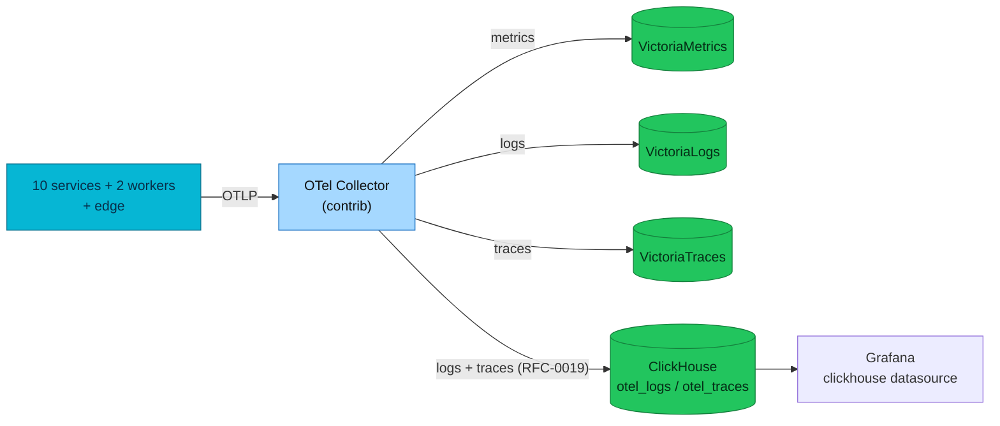

# ClickHouse — OTel logs+traces OLAP

Open-source columnar OLAP giving the platform **long-retention SQL over
OpenTelemetry logs and traces** — the cross-day analytics the 7-day,
LogsQL/TraceQL-only ops primaries can't, plus the `otel_logs`↔`otel_traces`
`trace_id` JOIN in one store (**RFC-0019 Phase B**).

| | |
|---|---|
| **Status** | **Deployed** — local-stack + cluster (RFC-0019 Phase B) |
| **Role** | **Supplementary** OLAP for logs+traces SQL. Runs **alongside** VictoriaLogs / VictoriaTraces (day-to-day ops primaries), which are **unchanged** |
| **Engine** | `clickhouse/clickhouse-server:26.7`, ReplicatedMergeTree, **1 shard × 3 replicas** on a 3-node ClickHouse Keeper quorum |
| **Operator** | Altinity `clickhouse-operator` `0.27.3` + a `ClickHouseInstallation` CR and a `ClickHouseKeeperInstallation` CR |
| **Ingest** | OTel Collector contrib `clickhouse` exporter — fan-out on the **traces + logs** pipelines (metrics stay on VictoriaMetrics — **never** here) |
| **Tables** | `otel.otel_logs`, `otel.otel_traces` (+ `otel_traces_trace_id_ts` MV), created by the **`clickhouse-schema` Job** from DDL committed in git; the exporter only INSERTs |
| **Retention** | `otel.*`: **TTL 90 days** (`ttl_only_drop_parts`) vs 7d on the ops primaries — the long-retention payoff. The engine's own `system.*` log tables are a [separate, partly unmanaged story](#the-engines-own-log-tables) |
| **Storage** | local PVC `standard` `10Gi` **per replica** (cluster) + small keeper PVCs; a named `clickhouse-data` volume (local-stack, which stays single-node) |
| **Query** | Grafana `grafana-clickhouse-datasource` **4.20.0** (`uid: clickhouse`, native `:9000`) + 5 provisioned dashboards in the **ClickHouse** folder (suite Overview→Logs→Traces, service deep dive, platform SQL) |
| **App code** | **Unchanged** — `pkg/obsx` / `pkg/grpcx` untouched; adding ClickHouse is a Collector-exporter change |
| **Design** | [RFC-0019](../../proposals/rfc/RFC-0019/) · [ADR-023](../../proposals/adr/ADR-023-clickhouse-observability-olap/) · [RFC-0028](../../proposals/rfc/RFC-0028/) · [ADR-065](../../proposals/adr/ADR-065-clickhouse-replicated-topology/) |

> **In one line:** the same OTel telemetry, a second sink. Because everything is
> instrumented with OpenTelemetry (the vendor-neutral "narrow waist"), a new
> backend is a Collector-exporter change — not an application change.

---

## Table of contents

1. [Overview](#overview)
2. [Reading path](#reading-path)
3. [What ClickHouse is](#what-clickhouse-is)
4. [Core components](#core-components)
5. [Architecture](#architecture)
6. [How it works in this platform](#how-it-works-in-this-platform)
7. [Operations](#operations)
8. [Grafana](#grafana) — datasource, Explore, dashboard grammar, the standard suite
9. [Metrics & alerting](#metrics--alerting) — engine-health scrape, alert catalog, runbook stubs
10. [Playground — MergeTree by hand](#playground--mergetree-by-hand)
11. [Glossary](#glossary)
12. [Where each store belongs](#where-each-store-belongs)
13. [Commerce analytics (Phase A — not deployed)](#commerce-analytics-phase-a--not-deployed)
14. [FAQ](#faq)
15. [References](#references)

---

## Overview

VictoriaLogs and VictoriaTraces both cap at **7-day** retention and answer
**LogsQL / the Jaeger query API only**. There is no cross-day **SQL/OLAP** over
structured log/trace fields (errors by service over weeks, duration percentiles,
status mixes) and no way to **JOIN** logs↔traces on `trace_id` in one store. RED
metrics on VictoriaMetrics do not substitute for log/trace search.

ClickHouse fills exactly that gap as a **supplementary** backend: the OTel
Collector dual-writes logs and traces to it while the ops primaries keep running
untouched. It is **not** a replacement for CloudNativePG (OLTP source of truth)
or for the primary observability stack.

---

## Reading path

1. **Engine** — [fundamentals](fundamentals.md) (OLAP, columnar, MergeTree, 1×3 vs the VLDB paper)
2. **Junior skill** — [schema-and-queries](schema-and-queries.md) (`ORDER BY` → `EXPLAIN` granules → codecs last)
3. **Trace-id lookup** — [materialized-views](materialized-views.md) (incremental `TO`, not a Postgres index)
4. **This platform** — [Architecture](#architecture) → [How it works here](#how-it-works-in-this-platform) → [Operations](#operations) → [Grafana](#grafana)
5. **Hands-on** — [Playground](#playground--mergetree-by-hand)
6. **Lookup** — [Glossary](#glossary) · [FAQ](#faq)

Pair with the PostgreSQL [storage and WAL fundamentals](../../databases/fundamentals/storage-and-wal.md)
if you already know Postgres heap / WAL / B-tree.

---

## What ClickHouse is

**ClickHouse** is an open-source **OLAP** database: append ingest, columnar
parts, SQL aggregation. On this platform it is the **90-day** store for
`GROUP BY`, percentiles, and `trace_id` correlation — not LogsQL "find this
line", and not a replacement for PostgreSQL OLTP.

Full engine lesson (OLAP vs OLTP vs search, columnar files, MergeTree,
VLDB figures, 1 shard × 3 vs the paper's 2×2): **[fundamentals.md](fundamentals.md)**.
Making `otel_*` queries cheap: **[schema-and-queries.md](schema-and-queries.md)**.

---

## Core components

| Piece | Role |
|-------|------|
| **clickhouse-server** | Query engine + storage (native TCP `:9000`, HTTP `:8123`) |
| **clickhouse-operator** | Altinity operator; reconciles a `ClickHouseInstallation` CR into a StatefulSet |
| **Table engine** | Storage semantics — **MergeTree** is the analytics default |
| **Part** | Immutable on-disk chunk produced by an insert batch |
| **Granule** | ~8192-row read unit; the sparse index points at the first row of each granule |
| **Materialized view** | Incremental `TO` table `otel_traces_trace_id_ts` — [materialized-views.md](materialized-views.md) |

MergeTree parts, sparse granules, and skipping indexes: [fundamentals](fundamentals.md).
Prove prune on the live tables: [Playground](#playground--mergetree-by-hand).

---

## Architecture

The Collector fans telemetry out to every backend in parallel. ClickHouse is the
5th trace sink and the 2nd log sink; a failure there cannot stall the ops
primaries (`sending_queue` + `retry_on_failure` isolate it).


```mermaid
flowchart LR
  Apps["10 services + 2 workers<br/>+ edge"] -->|OTLP| Col["OTel Collector<br/>(contrib)"]
  Col -->|metrics| VM[("VictoriaMetrics")]
  Col -->|logs| VL[("VictoriaLogs")]
  Col -->|traces| VT[("VictoriaTraces")]
  Col -->|"logs + traces (RFC-0019)"| CH[("ClickHouse<br/>otel_logs / otel_traces")]
  CH --> Graf["Grafana<br/>clickhouse datasource"]

  classDef service fill:#06b6d4,color:#082f49,stroke:#0e7490;
  classDef data fill:#22c55e,color:#052e16,stroke:#15803d;
  classDef collector fill:#a5d8ff,color:#111,stroke:#1971c2;
  class Apps service;
  class Col collector;
  class VM,VL,VT,CH data;
```

**Logs-first analytics.** Traces are head-sampled at the edge (50% cluster baseline / 100% local), so
`otel_traces` counts undercount real traffic; `otel_logs` is **100% unsampled**
and is the counting workhorse. Traces are exemplars joined back on `trace_id`.

---

## How it works in this platform

| Aspect | Detail |
|--------|--------|
| **Engine** | `clickhouse/clickhouse-server:26.7`, ReplicatedMergeTree, 1 shard × 3 replicas ([ADR-065](../../proposals/adr/ADR-065-clickhouse-replicated-topology/)) |
| **Operator** | Altinity `altinity-clickhouse-operator` `0.27.3` (HelmRelease in the `controllers` wave, ns `monitoring`); CRDs health-checked before the CHI applies (`kubernetes/infra/controllers/clickhouse-operator/`) |
| **Instance** | `ClickHouseInstallation` `clickhouse` (cluster `otel`) → StatefulSets `chi-clickhouse-otel-0-{0,1,2}`, one per node (host anti-affinity); own Flux Kustomization `clickhouse-local` `dependsOn [controllers-local, secrets-local]`, health-checking **all three** (`kubernetes/infra/configs/clickhouse/`) |
| **Coordination** | `ClickHouseKeeperInstallation` `keeper`, 3 replicas, referenced by name (`zookeeper.keeper.name`); holds the replication metadata. A replica that loses its Keeper session serves reads and refuses writes |
| **Storage** | PVC `standard` `10Gi` per replica (`volumeClaimTemplates`) + keeper data `2Gi` (no log PVC — the operator's keeper logs to console); local-stack uses a named `clickhouse-data` volume |
| **Credentials** | `default` user password from OpenBAO `secret/local/infra/clickhouse/admin` via the `clickhouse-credentials` `ClusterExternalSecret` → Secret in `monitoring` (selector label `platform.duynhlab/clickhouse`); local-stack uses an inline dev password |
| **Ingest** | Collector contrib `clickhouse` exporter appended to the `traces` + `logs` pipelines, **INSERT-only** (`create_schema: false`); `async_insert`, `sending_queue`, `retry_on_failure`; password via `${env:CLICKHOUSE_PASSWORD}` (`extraEnvs` secretKeyRef) |
| **Schema owner** | The `clickhouse-schema` **Job**, SQL committed in `kubernetes/infra/configs/clickhouse-schema/` ([ADR-065](../../proposals/adr/ADR-065-clickhouse-replicated-topology/)). It creates the `otel` database with `ENGINE = Replicated` on each replica, then the tables once; the database's Keeper log propagates them. TTL 90d lives in that DDL |
| **Security** | `runAsNonRoot`, `runAsUser: 101`, `fsGroup: 101`, `allowPrivilegeEscalation: false`, drop `ALL` caps, `seccompProfile: RuntimeDefault`; `/ping` liveness+readiness; pinned image (PSS-baseline + no-latest) |
| **Access** | Grafana datasource `uid: clickhouse` (`clickhouse-clickhouse.monitoring.svc.cluster.local:9000`, native, password via `valuesFrom`); **not** on any public Ingress; the `default` password is the access control (no NetworkPolicy — `monitoring` has no default-deny and netpol is inert on kindnet; a `:9000`/`:8123` NetworkPolicy is a follow-up for an enforcing CNI) |
| **Startup ordering** | `clickhouse-local` → `clickhouse-schema-local` (the Job, `wait: true`) → `tracing-local`. The collector runs no DDL, so it must not start before the schema exists — it can no longer create what it is missing. In local-stack, which is single-node, the exporter still creates its own schema via `depends_on: service_healthy` |
| **Why the store's wave has no `wait`** | `wait` and `healthChecks` are mutually exclusive in Flux and `wait` wins. `configs/clickhouse` applies only custom resources, whose status kstatus cannot assess, so `wait: true` made that wave report Ready in **371ms with zero pods** and released downstream early. It gates on the six operator-created StatefulSets instead. The schema wave is the opposite case — it applies a Job, which kstatus does assess, so it uses `wait: true` |
| **Why the Job, not the exporter** | Exporter-owned `ON CLUSTER` DDL cannot reach a replica that joins the distributed-DDL queue later, and `IF NOT EXISTS` blocks every repair. Measured twice: schema on 1 of 3, then 2 of 3 replicas after the ordering fix. The Job sidesteps the queue entirely — database per replica, tables once inside a `Replicated` database |
| **Dashboards** | 5 provisioned boards in the **ClickHouse** Grafana folder — see [Grafana](#grafana); local-stack via file provider, cluster via `configMapGenerator` → `GrafanaDashboard` CRs |
| **local-stack** | `clickhouse` compose service (`:8123` HTTP, `:9000` native), collector `clickhouse` exporter, Grafana plugin + provisioned datasource; e2e audit check **C6** (`SELECT count() FROM otel.otel_traces/otel_logs`) |

The Collector's other sinks are untouched: VictoriaLogs and VictoriaTraces
keep receiving, and the metrics pipeline never routes to ClickHouse.

---

## Operations

### Deployed schema (real DDL)

This DDL is **committed**, in
`kubernetes/infra/configs/clickhouse-schema/configmap-schema.yaml`, and applied
by the `clickhouse-schema` Job. It was captured with `SHOW CREATE TABLE` from a
cluster the exporter itself had built, so it matches what the exporter expects
to INSERT into — note the replicated engine, the sort key, day-partitioning,
90-day TTL, per-column codecs, and skipping indexes:

```sql
CREATE TABLE IF NOT EXISTS otel.otel_traces
(
    `Timestamp` DateTime64(9) CODEC(Delta(8), ZSTD(1)),
    `TraceId` String CODEC(ZSTD(1)),
    `ServiceName` LowCardinality(String) CODEC(ZSTD(1)),
    `SpanName` LowCardinality(String) CODEC(ZSTD(1)),
    `Duration` UInt64 CODEC(ZSTD(1)),
    `StatusCode` LowCardinality(String) CODEC(ZSTD(1)),
    -- … ResourceAttributes / SpanAttributes maps, Events.*, Links.* …
    INDEX idx_trace_id TraceId TYPE bloom_filter(0.001) GRANULARITY 1,
    INDEX idx_duration Duration TYPE minmax GRANULARITY 1
)
ENGINE = ReplicatedMergeTree
PARTITION BY toDate(Timestamp)
ORDER BY (ServiceName, SpanName, toDateTime(Timestamp))
TTL toDateTime(Timestamp) + toIntervalDay(90)
SETTINGS index_granularity = 8192, ttl_only_drop_parts = 1;
```

- **`ORDER BY (ServiceName, SpanName, …)`** — the sparse index; filtering by
  `ServiceName` prunes granules (proven in the [Playground](#playground--mergetree-by-hand)).
  Why that prefix, and how to read `EXPLAIN`: [schema-and-queries](schema-and-queries.md).
- **`PARTITION BY toDate(Timestamp)`** + **`ttl_only_drop_parts = 1`** — TTL drops
  whole day-partitions, so 90-day expiry is a cheap `DROP PARTITION`, not a rewrite.
- **`bloom_filter` on `TraceId`** + the `otel_traces_trace_id_ts` materialized view
  make single-trace lookups fast despite the service-first sort key —
  [materialized-views](materialized-views.md).
- **`ENGINE = ReplicatedMergeTree`** with no arguments — the server's
  `default_replica_path` (`/clickhouse/tables/{uuid}/{shard}`) and
  `default_replica_name` (`{replica}`) apply, so every `CREATE` mints a fresh
  Keeper znode and a drop-and-recreate can never collide with a stale replica
  path ([ADR-065](../../proposals/adr/ADR-065-clickhouse-replicated-topology/)).
- **No `ON CLUSTER`, on purpose.** The database is `ENGINE = Replicated`, so DDL
  run on one replica propagates through the database's own Keeper log. That is
  what makes the bootstrap immune to the failure that `ON CLUSTER` caused: a host
  joining the distributed-DDL queue late skips earlier entries forever. A replica
  added later initialises its own tables.
- **The database is created per replica** (`00-database.sql`, applied by the Job
  to each host in turn), which is the one statement that cannot be replicated by
  the thing it creates.

### Retention & compression

| Table | Retention | Measured compression (local-stack) |
|-------|-----------|-----------------------------------|
| `otel_traces` | 90d | **10.5×** (1.20 MiB → 117 KiB) |
| `otel_logs` | 90d | **8×** (2.06 MiB → 262 KiB) |

Retention is **90 days** here vs **7 days** on VictoriaLogs/VictoriaTraces — the reason
ClickHouse exists on this platform.

#### The engine's own log tables

`otel.*` is only half the disk story. ClickHouse writes its own operational
history into `system.*` log tables, and **this repository configures no
retention for any of them**. What TTL exists arrives from two places we do not
own — upstream server defaults, and three config files the Altinity operator
injects (`/etc/clickhouse-server/config.d/01-clickhouse-0{3,4,5}-*.xml`).

Audited on the deployed cluster:

| `system.*` table | Partition | TTL | Source of the TTL |
|---|---|---|---|
| `query_log`, `part_log`, `trace_log` | daily (`event_date`) | 30 d | Altinity operator override |
| `processors_profile_log`, `aggregated_zookeeper_log`, `zookeeper_connection_log` | monthly | 30 d | upstream default |
| `metric_log`, `asynchronous_metric_log`, `text_log`, `error_log`, `background_schedule_pool_log` | monthly | **none** | — |

The last row is an **open gap**: those tables grow for the life of the cluster.
`metric_log` is the one to watch — it carries roughly 1,900 columns and writes
a row every second whether or not anything is querying, so it is a fixed cost
that does not scale down with idle traffic. `system.*` tables are ordinary
local `MergeTree` (not replicated), so the growth is per replica, on each
node's own filesystem.

Two things make the fix less trivial than adding a `<ttl>`:

1. Those tables are **monthly-partitioned**, so a short TTL on them lands in
   the misaligned case described in
   [Partitions and TTL](fundamentals.md#the-alignment-rule) — partition and TTL
   have to move together.
2. Changing a system table's engine definition does **not** alter the existing
   table. ClickHouse renames it (`metric_log` → `metric_log_0`) and creates a
   new one; the renamed table keeps its rows and inherits **no** TTL. Any fix
   has to drop the `_0` leftovers, per replica, or it frees nothing.

`query_thread_log` is absent by design — the same operator config removes it.

> Count these yourself rather than trusting the table. ClickHouse creates a
> system log table **lazily**, on its first write, so a freshly built cluster
> shows fewer of them than one that has been running for days —
> `query_views_log`, `asynchronous_insert_log` and `blob_storage_log` all
> arrive later. The audit above is a fresh cluster; the shape of the finding
> (which tables the operator manages, which upstream manages, which nobody
> does) is what is stable.

```sql
-- the audit, re-run: which engine log tables have an expiry, and on what grain
SELECT name, partition_key,
       if(position(create_table_query, ' TTL ') = 0, 'NONE', 'has TTL') AS ttl
FROM system.tables
WHERE database = 'system' AND engine = 'MergeTree'
ORDER BY ttl, name;
```

Watch the `' TTL '` spacing in that predicate: `metric_log` has ~1,900 columns
and one of their *comments* contains the word TTL, so a bare
`position(create_table_query,'TTL')` reports a TTL the table does not have.

### Query examples

Run from Grafana Explore (datasource **ClickHouse**) or `clickhouse-client`:

```sql
-- Error rate by service, last 7 days (SQL the ops primaries can't express)
SELECT ServiceName,
       100.0 * countIf(StatusCode = 'STATUS_CODE_ERROR') / count() AS err_pct
FROM otel.otel_traces
WHERE Timestamp > now() - INTERVAL 7 DAY
GROUP BY ServiceName ORDER BY err_pct DESC;

-- p95 latency by operation
SELECT ServiceName, SpanName, round(quantile(0.95)(Duration)/1e6, 2) AS p95_ms
FROM otel.otel_traces GROUP BY ServiceName, SpanName ORDER BY p95_ms DESC LIMIT 20;

-- Cross-signal: correlate logs to traces on trace_id (one store, one query)
SELECT t.ServiceName AS service,
       count(DISTINCT t.TraceId) AS traces,
       count(l.TraceId)          AS correlated_logs
FROM otel.otel_traces t
ANY LEFT JOIN otel.otel_logs l ON t.TraceId = l.TraceId
WHERE t.TraceId != '' GROUP BY service ORDER BY traces DESC;
```

### Dashboard

All five provisioned dashboards are documented in [Grafana](#grafana) below —
the standard suite (Overview → Logs → Traces), the service deep dive, and the
platform-wide *OTel logs+traces SQL* board.

### Runbook — data not appearing

1. **Drive traffic**, then wait **~30–45s** (OTLP export + batch lag).
2. Collector export errors: `otelcol_exporter_send_failed_*` for the `clickhouse`
   exporter, or `kubectl logs -n monitoring deploy/otel-collector | grep -i clickhouse`.
3. ClickHouse reachable? `SELECT 1` (see [Playground](#playground--mergetree-by-hand)).
4. Tables exist? `SHOW TABLES FROM otel` — created by the `clickhouse-schema`
   Job, not by the exporter. If they are missing, read
   `kubectl -n monitoring logs job/clickhouse-schema`: a wrong password or an
   unreachable replica fails the Job loudly rather than leaving a partial schema.
5. VictoriaLogs/VictoriaTraces still receiving? They are independent sinks — ClickHouse being
   down must not affect them (`sending_queue` isolates backpressure).

---

## Grafana

Grafana turns the `otel` tables into an explorable logs/traces UI and a SQL
dashboard surface. Two ideas carry everything below:

1. **The plugin maps columns, it does not ingest** — Grafana only ever runs
   `SELECT`s; the OTel mapping tells it which columns mean *time*, *severity*,
   *body*, *trace id*, *duration*.
2. **The table's `ORDER BY` decides what is cheap** — service-first filters fly;
   bare trace-id lookups ride the `bloom_filter` index + the
   `otel_traces_trace_id_ts` MV (see [Deployed schema](#deployed-schema-real-ddl)).

### The datasource, as deployed

Plugin `grafana-clickhouse-datasource` **4.20.0** (pinned in the cluster
`GF_INSTALL_PLUGINS` and the local-stack compose). Both environments provision
the same shape (cluster: [`datasource-clickhouse.yaml`](../../../kubernetes/infra/configs/observability/grafana/datasource-clickhouse.yaml),
password from the ESO-managed `clickhouse-credentials` Secret; local-stack:
[`clickhouse.yaml`](../../../local-stack/observability/grafana/provisioning/datasources/clickhouse.yaml)):

```yaml
jsonData:
  host: clickhouse-clickhouse.monitoring.svc.cluster.local   # local: clickhouse
  port: 9000
  protocol: native
  defaultDatabase: otel
  username: default
  logs:    { defaultDatabase: otel, defaultTable: otel_logs,   otelEnabled: true }
  traces:  { defaultDatabase: otel, defaultTable: otel_traces, otelEnabled: true }
```

`otelEnabled: true` unlocks the Logs/Traces query builders, the Explore views,
and trace↔log navigation — without it the datasource is a plain SQL connection.

### OTel schema versions

The DDL is owned by the `clickhouse-schema` Job, but its *shape* still tracks
**0.151.0** (the `TimestampTime` helper column left `otel_logs`):

| Schema | Exporter | `otel_logs` shape |
|--------|----------|-------------------|
| 1.2.9 | contrib < 0.151.0 | has `TimestampTime` |
| **1.3.0** | contrib ≥ 0.151.0 | no `TimestampTime` — what both environments write (contrib `0.159.0`) |

Plugin ≥ 4.20.0 **auto-detects the logs schema from the table's columns** when
the version selector is on auto (latest); our provisioning deliberately does not
pin a version. After any collector bump, `DESCRIBE otel.otel_logs` tells you
which shape a table has — the Job's `CREATE TABLE IF NOT EXISTS` is create-if-absent, so an old table
keeps its old shape until dropped.

### Explore & trace↔log linking

- **Logs** query type generates the column mapping (`Timestamp AS timestamp,
  Body AS body, SeverityText AS level … ORDER BY Timestamp DESC LIMIT 1000`);
  our tables use the default OTel column names, so no custom mapping is needed.
  Builder filters become `WHERE` clauses — `ServiceName` is the cheap one
  (first `ORDER BY` key).
- **Traces** query type maps `TraceId`/`ServiceName`/`SpanName`/`Timestamp`/
  `Duration`; the waterfall detail view resolves a trace id to its time range
  via `otel_traces_trace_id_ts`, sidestepping the service-first sort key.
  `Duration` is nanoseconds — raw SQL panels divide by `1e6` for ms.
- **Linking**, both directions, rides the shared `TraceId` column: log line →
  "View trace"; span → logs filtered `WHERE TraceId = '<id>'`. One store, one
  key — no derived-fields bridge, which is exactly what the VictoriaLogs↔VictoriaTraces
  pair lacks (see [logging](../logging/README.md)).

### Dashboard grammar (raw SQL panels)

Time series: return a datetime aliased `time` plus numerics. Multi-line: field
order matters — time, then the string group, then the value:

```sql
SELECT $__timeInterval(Timestamp) AS time, ServiceName, count() AS spans
FROM otel.otel_traces
WHERE $__timeFilter(Timestamp)
GROUP BY time, ServiceName ORDER BY time
```

| Macro | Expands to |
|-------|------------|
| `$__timeFilter(col)` | `col >= <from> AND col <= <to>` — dashboard time picker |
| `$__timeInterval(col)` | `toStartOfInterval(col, INTERVAL <auto> second)` — adaptive bucketing |
| `$__fromTime` / `$__toTime` | picker edges as `DateTime` scalars — for subqueries/denominators |
| `$__conditionalAll(expr, $var)` | `expr` when the variable has a selection, `1=1` on *All* or an empty textbox |

Recipes live in the shipped dashboards — copy from there instead of reinventing:
error-rate % (`countIf(StatusCode = 'Error') / count()`), latency quantiles
(`quantile(0.95)(Duration)/1e6`), the trace↔log correlation JOIN.

### The standard dashboard suite — Overview → Logs → Traces

Three dashboards, one navigation story — each answers exactly one question:

| Tier | Dashboard (uid) | Question it answers |
|------|-----------------|---------------------|
| 1 | **OTel — Overview** (`clickhouse-otel-overview`) | *Which service is in trouble?* — the triage landing page |
| 2 | **OTel — Logs Explorer** (`clickhouse-logs-explorer`) | *What errors are happening?* |
| 3 | **OTel — Trace Explorer** (`clickhouse-traces-explorer`) | *Where did the request go and which span broke?* |

Overview's "who is in trouble" tables link a service into the Logs Explorer or
the [service deep dive](#the-service-deep-dive-dashboard); every `TraceId` cell
in the suite links into the Trace Explorer, which loads an **in-dashboard trace
waterfall** (`format: 3`, Jaeger-style aliases, window via the MV) with a
**"Logs for this trace"** panel underneath — logs↔traces on one screen.

Design decisions, all verified against live data:

- **Trace-level semantics**: per-trace panels group by `TraceId`; a trace is
  *failed* if ANY span has `StatusCode = 'Error'`; the root span is
  `ParentSpanId = ''` (exactly one per trace). The *Trace status* filter applies
  to that classification — never to member spans — and the volume-row stats
  ignore it by design (they ARE the status summary).
- **Native panels**: logs panels are `format: 2` (SQL aliases
  `timestamp`/`body`/`level`); the waterfall is `format: 3`; multi-line
  timeseries are `format: 0`. Only `format` is load-bearing.
- **Variables**: `$severity` is lowercase (`error,warn,info,notice,debug` — what
  the services actually emit); `$environment` reads
  `deployment.environment.name` (`local` locally, `production` in-cluster) and
  binds to member spans (the edge's own spans carry `deployment.environment.name: local`
  locally via a `customTags` literal, but the cluster CR tags pod identity
  instead and has no `deployment.environment.name`); textbox vars run through
  `$__conditionalAll`.
- **Duration heatmap**: raw `(time, duration_ms)` rows, panel-side bucketing,
  log₂ y-scale, `$sample_mod` constant (1 = no sampling; raise ~500 at volume).
  Span `Events.*` are not populated here — error text comes from `StatusMessage`.

### The service deep-dive dashboard

*ClickHouse — Service deep dive* (`clickhouse-service-deepdive`) applies the
same machinery to **one service at a time**; the platform-wide view stays in
*ClickHouse — OTel logs+traces SQL* (`clickhouse-otel-sql`). Seven rows:

| Row | Panels |
|-----|--------|
| Overview | req/s, error %, p95 (server spans), error-log count, distinct operations |
| Traffic & latency | rate by operation, p50/p95/p99, error % trend, log volume by severity |
| HTTP endpoints | route × method table (calls, 5xx, p95) + status classes — attributes `http.request.method` / `http.route` / `http.response.status_code` |
| gRPC methods | `rpc.method` split into Service/Method (calls, errors, p95) |
| Dependencies | who calls the service (client spans matching `<service>.v1.%`) · what it calls (gRPC callees + `postgresql`/`redis` client spans) |
| Slow & failing | slowest + error spans, TraceId → Explore data links |
| Logs | severity-filtered logs, top error messages, error-traces↔logs JOIN |

Two verified facts every new panel must respect: enum spellings are the short
ones (`StatusCode` `Ok`/`Error`/`Unset`, `SpanKind` `Server`/`Client`/`Internal`
— and Go-SDK success spans are `Unset`, so error-rate is `countIf(Error)/count()`),
and proto packages are named after the owning service, so "who calls product" is
just client spans where `rpc.method LIKE 'product.v1.%'`.

### Plugin-bundled dashboards (manual import — not GitOps)

The datasource ships 7 reference dashboards (datasource config page →
**Dashboards** tab). A UI import lives **only in that Grafana's database** — not
in git, never on the cluster, wiped when the local volume is recreated:

| Dashboard (uid) | Group | What it is |
|---|---|---|
| ClickHouse - Query Analysis (`w5Q2Otank`) | **Server admin** | Query performance over `system.query_log` |
| ClickHouse - Data Analysis (`-B3tt7a7z`) | Server admin | Table/parts/disk usage, compression |
| ClickHouse - Cluster Analysis (`_hAsuzBnz`) | Server admin | Replication/distributed health (mostly N/A single-node) |
| Advanced ClickHouse Monitoring (`e336c8cd-…`) | Server admin | Memory, merges, mark cache, background pools |
| OpenTelemetry Logs Explorer (`otel-logs-explorer`) | **OTel reference** | Upstream generic version of our Logs Explorer |
| OpenTelemetry Traces Explorer (`otel-traces-explorer`) | OTel reference | Upstream Trace Explorer — its heatmap hard-codes `% 500` sampling (near-empty at our volume) |
| OpenTelemetry Service Dashboard (`otel-service-dashboard`) | OTel reference | Upstream per-service view — the deep dive covers this with verified enums/keys |

The server-admin group watches ClickHouse *itself* (`system.*`) — a niche the
in-repo suite doesn't cover; promote one to a provisioned JSON + CR if it earns
a permanent place. Provisioned ClickHouse dashboards live in the **ClickHouse**
Grafana folder on both environments (local: file provider
`foldersFromFilesStructure` + `dashboards/ClickHouse/`; cluster: the CR
`folder:` field).

### Query performance rules

1. **Filter `ServiceName` first** — first `ORDER BY` key; granule pruning does
   the work (proven in the [Playground](#playground--mergetree-by-hand)).
2. **Always `$__timeFilter`** — day partitions make the picker a partition prune.
3. **`ORDER BY Timestamp DESC LIMIT n`** on log queries — never unbounded.
4. **Bare `TraceId` lookups** are for Explore/the trace panel, not per-refresh
   dashboard panels.
5. **Don't `SELECT *`** — name the `Map` keys you need
   (`ResourceAttributes['k8s.pod.name']`).

Integration checks: plugin version via `GET /api/plugins/grafana-clickhouse-datasource`
(→ `4.20.0`); datasource health via *Save & test* or `SELECT 1` in Explore; data
not appearing → [Runbook](#runbook--data-not-appearing).

---

## Metrics & alerting

> **Planned** — the manifests below are merged; the first scrape, the alert
> load into VMAlert, and the expression tuning all happen at the Kind gate.
> local-stack does not run the operator, so nothing here is exercisable on
> compose.

The five dashboards above watch the **data** (OTel rows over the SQL
datasource). This chapter is the **engine**: is the server up, is the disk
filling, are merges keeping pace with inserts. Before this landed the engine
view was blind — no scrape, no alert. A dead ClickHouse used to surface in the
worst possible way too: the collector's `create_schema` startup step blocked
every restart until the store returned. Since RFC-0028 it does not — the
collector owns no DDL, so a dead store costs the ClickHouse sink and nothing
else.

### Metric sources

| Endpoint | Producer | Families | Use |
|---|---|---|---|
| operator Service `:8888/metrics` | Altinity operator | `clickhouse_operator_chi_reconciles_*`, `clickhouse_operator_host_reconciles_*`, pod events | Control-plane health |
| operator Service `:8888/chi` | metrics-exporter sidecar | `chi_clickhouse_metric_*` (system.metrics), `chi_clickhouse_event_*` (system.events), `chi_clickhouse_async_metric_*`, disks, parts, `chi_clickhouse_system_errors_*` | Engine health per CHI |
| CHI pod `:9363/metrics` (`settings.prometheus/*`) | `clickhouse-server` itself | `ClickHouseMetrics_*`, `ClickHouseProfileEvents_*`, `ClickHouseAsyncMetrics_*`, `ClickHouseErrorMetric_*` | Per-replica granularity |

Both operator endpoints are scraped by the **chart's ServiceMonitor**
(`serviceMonitor.enabled` in `controllers/clickhouse-operator/helmrelease.yaml`).

**The third source was enabled with replication** ([RFC-0028](../../proposals/rfc/RFC-0028/)),
and the reason is worth keeping: at 1×1 the exporter's `/chi` carried every
engine signal the alerts needed and a per-pod scrape would only have duplicated
it. Three replicas change the question the metrics have to answer. The exporter
aggregates by CHI, so it cannot say *which* replica is sick, and
`ClickHouseMetrics_ReadonlyReplica` — a replica that lost its Keeper session and
silently stopped accepting writes while still serving reads — has no equivalent
in the exporter's view at all. It is scraped per pod by
`podmonitors/clickhouse-server.yaml` (`job="clickhouse-server"`, label
`replica`); a PodMonitor rather than a ServiceMonitor because the
operator-generated Services carry only the native, HTTP and interserver ports.

### Alerts

Rules live in
`configs/observability/metrics/prometheusrules/observability/clickhouse-alerts.yaml`,
catalogued in [alert-catalog § 8b](../alerting/alert-catalog.md#8b-clickhouse-otel-olap-engine).
Three of the twelve this section once claimed were deleted on 2026-08-22 for
naming series the exporter does not publish — count the file, not the prose.

The spine: the **reachability pair** — `ClickHouseReplicaUnreachable` (warning:
one of three cannot be fetched, its peers still serve) escalating to
`ClickHouseAllReplicasUnreachable` (critical: the store is down and the
edge access log, which lives nowhere else, is being dropped); the **replication pair**
— `ClickHouseZooKeeperExceptions` and `ClickHouseReadonlyReplica`, which catch
the failure nothing else notices, because a replica that lost its quorum keeps
answering reads while falling behind; the **disk pair** (<15% warn, <5%
critical, now counting data stored three times); the **insert-pressure ladder**
(delayed → too-many-parts); and the consumer-side **ExporterUnhealthy** (the
collector's `send_failed_*{exporter="clickhouse"}` — the collector can be up
while its ClickHouse exporter backpressures).

### Dashboard

`ClickHouse Server / Engine` (folder ClickHouse, VictoriaMetrics datasource —
not the SQL one): up/uptime, query and insert rates, the insert-pressure
ladder, parts and merges, disk and memory, a `system.errors` top-N table, and
the operator's reconcile counters.

### Runbook stubs

- **ClickHouseReplicaUnreachable / ClickHouseAllReplicasUnreachable** —
  `kubectl -n monitoring get po -l clickhouse.altinity.com/chi=clickhouse`, then
  pod logs. If the pod is up but fetch fails, check the
  `clickhouse-credentials` Secret sync (ESO). Remember the blast radius:
  a collector restart no longer blocks on DDL (`create_schema: false`), so
  bouncing collectors is safe — but the ClickHouse sink will backpressure and
  then drop until the store returns.
- **A table that reports fewer replicas than the topology has** — historically
  this meant the exporter's `ON CLUSTER` DDL had run before every replica joined
  the distributed-DDL queue, which no retry could repair. Since the schema moved
  to the `clickhouse-schema` Job that path is gone, and the repair is to re-run
  the Job rather than to drop anything:

  ```bash
  kubectl -n monitoring delete job clickhouse-schema
  flux -n flux-system reconcile kustomization clickhouse-schema-local
  kubectl -n monitoring logs job/clickhouse-schema
  ```
  The Job asserts `total_replicas` on every replica before exiting 0, so a green
  Job is now evidence rather than a guess. Confirm with:

  ```sql
  -- the symptom, read on EVERY replica (loop the pods; see § Playground)
  SELECT table, is_readonly, total_replicas, active_replicas FROM system.replicas;
  -- the database must be Replicated; Atomic means table DDL will not propagate
  SELECT name, engine FROM system.databases WHERE name = 'otel';
  -- should be EMPTY for schema objects: the bootstrap deliberately avoids
  -- ON CLUSTER, so an entry here means someone reintroduced it
  SELECT entry, host, status, exception_code FROM system.distributed_ddl_queue ORDER BY entry, host;
  ```

  Verify any repair with a cross-replica read, never with pod status: insert on
  one replica, read from another. Every other signal — pod readiness, engine
  name, quorum health — stayed green through the original failure, which is why
  it survived two bring-ups unnoticed.

  Dropping the database is **no longer** part of this procedure. If it is ever
  necessary, remember it must be dropped on each replica (`DROP DATABASE IF
  EXISTS otel SYNC` per pod) and then re-created by the Job — the collector will
  not rebuild it.
- **ClickHouseDiskCritical** — `SELECT sum(bytes_on_disk) FROM system.parts
  GROUP BY table` to find the eater, then drop the oldest partitions
  (`ALTER TABLE … DROP PARTITION …`) or free space on the node. **Growing the
  PVC is not an option on Kind**: the `standard` StorageClass is
  `rancher.io/local-path`, whose PVs are hostPath directories with no quota and
  no `allowVolumeExpansion` — which is also why the disk alerts measure the
  *node* filesystem rather than the 10Gi request. The 90-day TTL cannot rescue
  a same-day spike. If the eater is a `system.*` table rather than `otel.*`,
  see [Retention & compression](#retention--compression).
- **ClickHouseTooManyParts** — inserts too small or merges starved. Check the
  collector's batch processor settings first (bigger, fewer inserts), then
  merge failures on the dashboard.
- **ClickHouseExporterUnhealthy** — engine-side cause fires alongside it if
  CH is the problem; alone, it points at the collector's exporter config or
  the network path. VictoriaLogs/VictoriaTraces hold their own copies, so
  loss is scoped to the OLAP store.

---

## Playground — MergeTree by hand

Explore the **live** engine. All output below is from the running local-stack
instance — reproduce it to see MergeTree's write→part→merge→TTL lifecycle.

### Connect

```bash
# local-stack — HTTP (:8123) or interactive client (:9000)
curl -s 'http://localhost:8123/' -u default:otel --data-binary 'SELECT version()'
docker compose exec clickhouse clickhouse-client --password otel

# cluster — exec into one of the three operator-managed pods.
# Pod name is chi-<chi>-<cluster>-<shard>-<replica>-<ordinal>, so the replicas
# are ...-0-0-0, ...-0-1-0 and ...-0-2-0. Which one you land on matters for any
# system.* question: system.parts, system.replicas and system.replication_queue
# are per-replica views, and the round-robin Service will not tell you who
# answered. Loop over the pods when comparing them.
PW=$(kubectl get secret -n monitoring clickhouse-credentials -o jsonpath='{.data.password}' | base64 -d)
kubectl exec -it -n monitoring chi-clickhouse-otel-0-0-0 -- clickhouse-client --password "$PW"

# all three, e.g. to confirm a table really has three live replicas
for p in $(kubectl -n monitoring get po -l clickhouse.altinity.com/chi=clickhouse -o name); do
  echo "== $p"
  kubectl -n monitoring exec "${p#pod/}" -- clickhouse-client --password "$PW" -q \
    "SELECT table, is_readonly, total_replicas, active_replicas, absolute_delay
     FROM system.replicas WHERE database='otel' FORMAT PrettyCompact"
done
```

### 1. Parts, rows, and compression

```sql
SELECT table, count() AS parts, sum(rows) AS rows,
       formatReadableSize(sum(data_compressed_bytes))   AS comp,
       formatReadableSize(sum(data_uncompressed_bytes)) AS uncomp,
       round(sum(data_uncompressed_bytes)/sum(data_compressed_bytes),1) AS ratio
FROM system.parts WHERE database='otel' AND active GROUP BY table;
```
```
┌─table───────┬─parts─┬─rows─┬─comp───────┬─uncomp───┬─ratio─┐
│ otel_logs   │     5 │ 8328 │ 262.59 KiB │ 2.06 MiB │     8 │
│ otel_traces │     1 │ 4287 │ 117.09 KiB │ 1.20 MiB │  10.5 │
└─────────────┴───────┴──────┴────────────┴──────────┴───────┘
```
Each INSERT batch from the Collector becomes a **part**; background **merges**
combine them (here `otel_traces` has already merged down to a single active part).
Columnar + ZSTD gives 8–10× compression.

### 2. Watch merges happen

```sql
-- how many background merges have run recently
SELECT count() FROM system.part_log
WHERE database='otel' AND event_type='MergeParts' AND event_time > now() - 3600;
-- → 1431

-- force it yourself and re-check part count
OPTIMIZE TABLE otel.otel_logs FINAL;
SELECT count() FROM system.parts WHERE database='otel' AND table='otel_logs' AND active;
```

### 3. See the sparse index prune granules

```sql
EXPLAIN indexes = 1
SELECT count() FROM otel.otel_traces WHERE ServiceName = 'platform.envoy-gateway-system';
```
```
ReadFromMergeTree (otel.otel_traces)
Indexes:
  PrimaryKey
    Keys:  ServiceName
    Condition: (ServiceName in ['platform.envoy-gateway-system', 'platform.envoy-gateway-system'])
    Parts: 1/5          -- 4 parts skipped outright
    Granules: 1/5       -- only 1 granule read
```
Because `ServiceName` is the first `ORDER BY` key, ClickHouse reads **1 of 5
granules** instead of scanning everything — the payoff of the sort key.
`platform.envoy-gateway-system` is the edge's `service.name` as **derived** by
Envoy Gateway (`<gateway>.<namespace>`, locally `platform` in
`envoy-gateway-system`) — not configured, and environment-dependent since it
embeds the namespace.

How to turn that `Granules: a/b` line into a habit on `otel_logs` too:
[schema-and-queries](schema-and-queries.md).

### 4. Inspect partitions & TTL

```sql
SELECT partition, count() AS parts, min(min_time) AS oldest, max(max_time) AS newest
FROM system.parts WHERE database='otel' AND table='otel_traces' AND active
GROUP BY partition;
-- one partition per day (PARTITION BY toDate(Timestamp)); TTL 90d drops whole
-- partitions (ttl_only_drop_parts = 1) — cheap, no row rewrite.
```

### 5. The trace_id materialized view

```sql
SHOW CREATE TABLE otel.otel_traces_trace_id_ts_mv;
-- MATERIALIZED VIEW … AS SELECT TraceId, min(Timestamp) AS Start, max(Timestamp) AS End
-- FROM otel.otel_traces WHERE TraceId != '' GROUP BY TraceId
-- → a compact TraceId → time-range index so single-trace lookups don't scan the
--   service-sorted main table.
```

Inspect `system.parts` on the **target** table `otel_traces_trace_id_ts`, then
`EXPLAIN` both tables: [materialized-views](materialized-views.md).

> **Safe to experiment:** local-stack storage is ephemeral. `CREATE TABLE playground …`,
> insert rows, `OPTIMIZE`, and `DROP` freely — you cannot hurt the ops primaries.

---

## Glossary

| Term | Meaning |
|------|---------|
| **Part** | Immutable insert batch on disk |
| **Merge** | Background job that combines parts |
| **Granule** | Default ~8192-row read block |
| **Sparse index** | Index of first-row keys per granule (from `ORDER BY`) |
| **Skipping index** | Extra prune aid (minmax / set / bloom) |
| **Materialized view** | Incremental `TO` table (here: `trace_id` time range) — [materialized-views.md](materialized-views.md) |
| **TTL** | Time-based expiry; here drops whole day-partitions |
| **CHI** | `ClickHouseInstallation` — the Altinity operator's CR |
| **Keeper** | ClickHouse Keeper quorum — replica metadata; lost session → replica read-only |
| **`TO` table** | Storage target of an incremental MV; `system.parts` is inspected here, not on the view |
| **Sparse primary index** | One mark per granule from `ORDER BY` — see [fundamentals](fundamentals.md) |

---

## Where each store belongs

Engine contrast (Postgres B-tree vs MergeTree, VL vs CH): [fundamentals](fundamentals.md).
On this platform:

| Need | Store |
|------|-------|
| Order/payment source of truth | PostgreSQL (`product-db` / `platform-db`) |
| RED metrics, alerting | VictoriaMetrics |
| Live ops log/trace triage (7d) | VictoriaLogs / VictoriaTraces |
| Long-retention SQL, `GROUP BY`, `trace_id` JOIN (90d) | **ClickHouse** |

---

## Commerce analytics (Phase A — not deployed)

RFC-0019 also sketched an **optional** Phase A: batch-sync read-only commerce
facts (orders, payments, checkout sessions) from Postgres into ClickHouse fact
tables for GMV / funnel panels. **This is out of scope for the current
implementation** (observability-only) and is **not deployed**. If revived it would
be a nightly batch SQL export from `product-db` / `platform-db` via PgDog — never
CDC, never new public analytics APIs, and Postgres stays authoritative. See
[RFC-0019](../../proposals/rfc/RFC-0019/).

---

## FAQ

**Does this replace VictoriaLogs / VictoriaTraces?**
No. They remain the day-to-day ops primaries; ClickHouse is supplementary
long-retention SQL. All backends run in parallel by design.

**Does adding ClickHouse change any service code?**
No. `pkg/obsx` / `pkg/grpcx` are untouched; it is a Collector-exporter change.

**Do metrics go to ClickHouse?**
Never. Metrics stay on VictoriaMetrics; only the traces + logs pipelines fan out here.

**Why do trace counts look low?**
Traces are head-sampled at the edge (50% cluster baseline, 100% on Kind), so a trace count is a floor on real traffic rather than a total — and the gap is about 2x in the cluster baseline, not the 10x it used to be. Use `otel_logs` (100%) for counting; treat
`otel_traces` as exemplars joined on `trace_id`.

**Can ClickHouse replace PostgreSQL?**
No. Postgres is the ACID source of truth; ClickHouse is analytics-only.

**How is the password managed?**
OpenBAO → `clickhouse-credentials` `ClusterExternalSecret` in-cluster; an inline
dev password in local-stack.

---

## References

- Learning: [fundamentals](fundamentals.md) · [schema and queries](schema-and-queries.md) · [materialized views](materialized-views.md)
- [Architecture overview (VLDB 2024)](https://clickhouse.com/docs/concepts/core-concepts/academic-overview)
- [ClickHouse docs — MergeTree](https://clickhouse.com/docs/engines/table-engines/mergetree-family/mergetree)
- [Altinity clickhouse-operator](https://github.com/Altinity/clickhouse-operator)
- [OpenTelemetry Collector — ClickHouse exporter](https://github.com/open-telemetry/opentelemetry-collector-contrib/tree/main/exporter/clickhouseexporter)
- [Grafana ClickHouse datasource](https://grafana.com/docs/plugins/grafana-clickhouse-datasource/latest/) · [ClickHouse docs — Using Grafana](https://clickhouse.com/docs/observability/grafana)
- Design: [RFC-0019](../../proposals/rfc/RFC-0019/) · [ADR-023](../../proposals/adr/ADR-023-clickhouse-observability-olap/)
- Observability hub: [`docs/observability/README.md`](../README.md)

---

_Last updated: 2026-09-04 — Retention now audits the engine's own `system.*` log tables: six carry a TTL (three from an Altinity operator override that also re-partitions them daily), five carry none, and the fix is constrained by monthly partitioning plus the `*_0` table left behind when an engine definition changes. The `ClickHouseDiskCritical` runbook no longer says "grow the PVC", which its own alert calls impossible on local-path. Earlier the same day: engine learning split into fundamentals / schema-and-queries / materialized-views; this hub stays platform + Grafana + alerts + playground._
