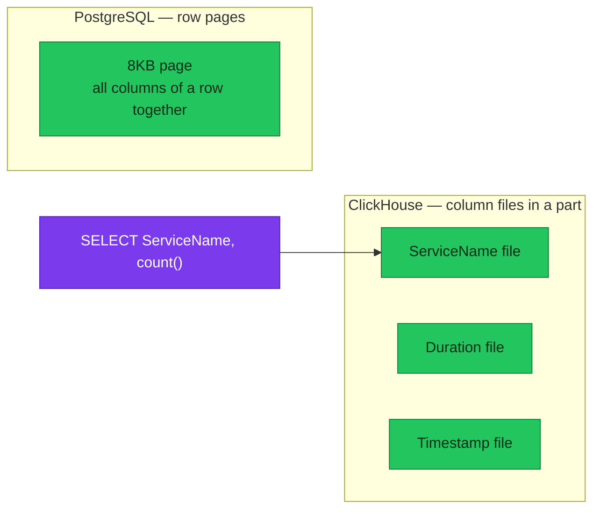
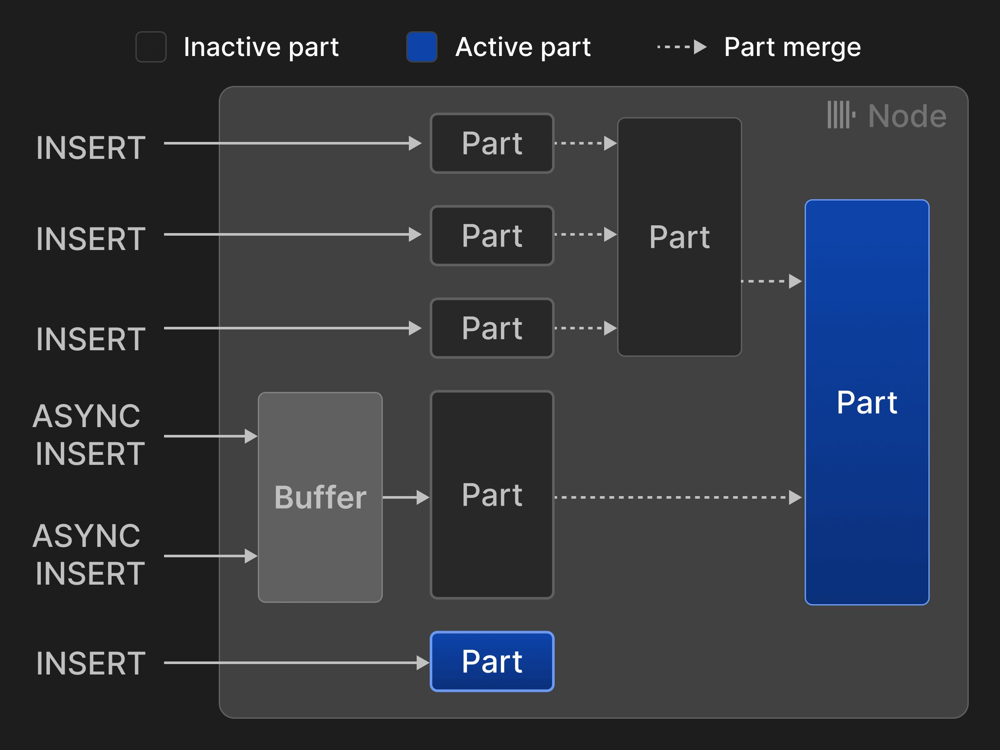
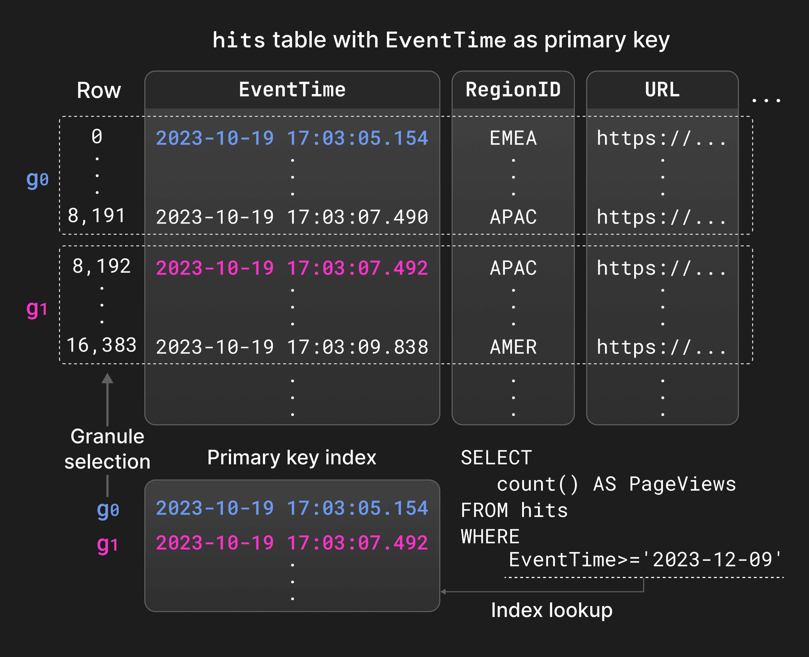
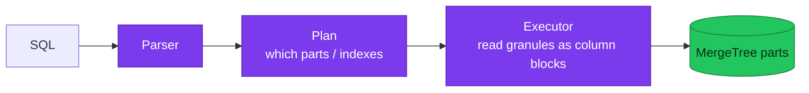
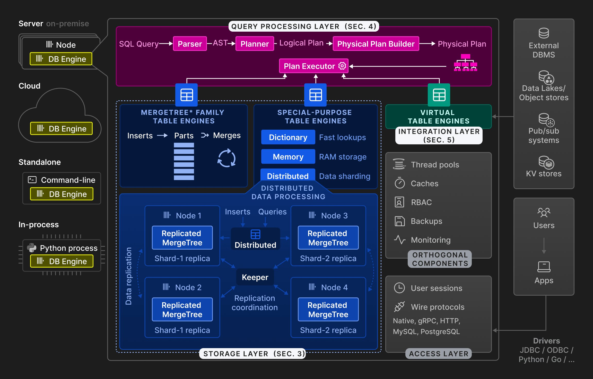
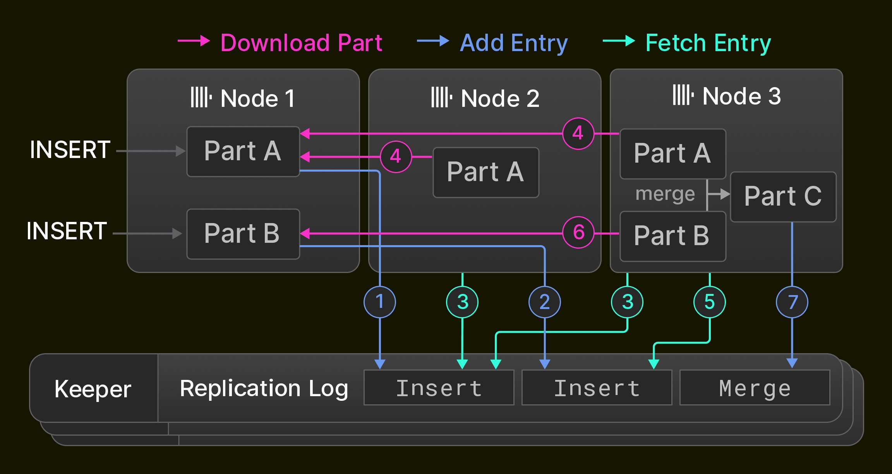
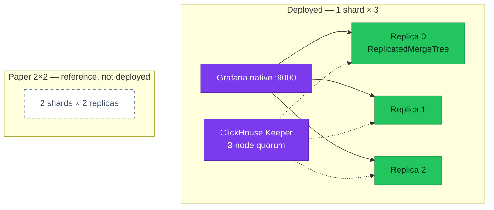

# ClickHouse fundamentals — why this OLAP store exists

The engine behind the 90-day `otel_logs` / `otel_traces` SQL store: why
**columnar OLAP** is a different job from LogsQL or Postgres, how **MergeTree**
prunes granules, and how this cluster maps onto the published architecture
(1 shard × 3 replicas — not the paper's 2×2).

| | |
|---|---|
| **Status** | Learning companion to the [platform hub](README.md) — engine concepts, not ops runbooks |
| **Tables in scope** | `otel.otel_logs`, `otel.otel_traces` (+ the [trace-id MV](materialized-views.md)) |
| **Topology here** | **1 shard × 3 replicas**, ClickHouse Keeper quorum ([ADR-065](../../proposals/adr/ADR-065-clickhouse-replicated-topology/)) |
| **Not this page** | Grafana, alerts, Flux waves → [README](README.md). Schema skill → [schema-and-queries](schema-and-queries.md) |

---

## Overview

VictoriaLogs and VictoriaTraces answer *find this line / this trace* inside a
**7-day** window. ClickHouse answers *how does the whole set look?* over **90
days**: `GROUP BY`, percentiles, and a `trace_id` JOIN in one store. Those are
different questions. High-scale logging platforms pick ClickHouse when the job
is **aggregation, GROUP BY, correlation, and analytics over very large
volumes** — not when the job is full-text search. This Kind cluster is not
petabytes; the **granule prune** is the same idea at a smaller row count.

It is **not** a replacement for CloudNativePG (OLTP source of truth) or for
LogsQL / the Jaeger query API.

---

## Why OLAP (and why still ClickHouse next to VictoriaLogs)

| | OLTP (PostgreSQL here) | Search / triage (VL / VT) | OLAP (ClickHouse here) |
|---|---|---|---|
| Typical question | "Order #123 for user X?" | "Find this error line / this trace" | "Error rate by service over 30 days?" |
| Language | SQL (row lookup, ACID) | LogsQL / Jaeger API | SQL (`GROUP BY`, `quantile`, JOIN) |
| Write pattern | UPDATE/DELETE | Append streams | Append INSERT |
| Retention on this platform | Durable business data | **7 days** | **90 days** |

**In plain terms:** OLTP answers *what is this row?*; search answers *where is
this event?*; OLAP answers *how does the whole set look?*

ClickHouse does **not** replace LogsQL. Use VictoriaLogs to find and triage.
Use ClickHouse when the dashboard needs a histogram, a status mix, or a
correlation across days — the same reason the edge **access log** is
ClickHouse-only ([ADR-061](../../proposals/adr/ADR-061-edge-log-routing/)):
attributes-only records whose real questions are SQL. The junior skill of
making those queries cheap is [schema-and-queries](schema-and-queries.md).

### Columnar vs row pages

PostgreSQL stores **rows** on a page (all columns of one tuple together).
ClickHouse stores **columns** as separate files inside a **part**.
`SELECT ServiceName, count()` reads only the `ServiceName` files, and those
files compress well because neighbouring values are alike.



Measured compression on local-stack (see the hub [Operations](README.md#operations)):
`otel_traces` ~**10.5×**, `otel_logs` ~**8×**.

---

## MergeTree: parts, partitions, merges, sparse index

MergeTree is **not** a Postgres B-tree heap. Writes append **immutable parts**.
Background **merges** combine parts while keeping the table's `ORDER BY`.
**Partitions** here are calendar days (`PARTITION BY toDate(Timestamp)`); TTL
drops whole parts (`ttl_only_drop_parts = 1`) instead of rewriting rows.

| | PostgreSQL B-tree | ClickHouse MergeTree |
|---|---|---|
| Primary purpose | Point lookup / range on heap | Sort + prune **granules** for scans |
| Write path | Update pages / WAL | Append new parts |
| Background | Autovacuum / checkpoints | Merges combining parts |
| Index grain | One entry per row (typical) | One sparse entry **per granule** (~8192 rows) |

**Insert → part → merge** (vendor Figure 3):



*Source: [Architecture overview](https://clickhouse.com/docs/concepts/core-concepts/academic-overview), Figure 3 (VLDB 2024).*

**Sparse primary index** (vendor Figure 4): the index stores the first row's
sort key of each granule, not every row. A `WHERE` that matches the `ORDER BY`
prefix can skip granules. A filter on a column that is *not* a prefix (for
example a bare `TraceId` on `otel_traces`) does **not** get that prune — that
is why traces also have a bloom skip index and a [materialized view](materialized-views.md).



*Source: [Architecture overview](https://clickhouse.com/docs/concepts/core-concepts/academic-overview), Figure 4 (VLDB 2024).*

**Skipping indexes** (minmax, set, bloom, text) are extra prune aids on columns
that are not the primary sort. **Projections** are an alternative extra
`ORDER BY` stored beside the table. This platform uses skip indexes + one MV
instead of projections.

**Mutations / lightweight delete / AggregatingMergeTree rollups** are for
workloads that rewrite or pre-aggregate in place. OTel ingest here is
**append-only**; those engines are not this workload.

Hands-on: [Playground](README.md#playground--mergetree-by-hand) (`system.parts`,
`EXPLAIN indexes = 1`).

---

## Query layer (short)

A `SELECT` is parsed, planned, then executed by reading **granules** in
vectorized blocks — many values of one column at a time, not one row at a
time. Parallelism is across parts and granules on a replica. This page does
not cover the query compiler; the SRE skill is reading `EXPLAIN indexes = 1`
until `Granules: a/b` is small. That loop lives in
[schema-and-queries](schema-and-queries.md).



**Distributed tables / extra shards** are **planned** ([ADR-065](../../proposals/adr/ADR-065-clickhouse-replicated-topology/)
out of scope for a second shard). Do not treat a `Distributed` engine as
installed.

---

## Architecture overview (VLDB) vs what is deployed

Vendor Figure 2 is the published engine layering (client protocol, query
pipeline, storage, coordination). Grafana on this platform talks **native
`:9000`**, not the HTTP `:8123` path used by `curl` in the playground.



*Source: [Architecture overview](https://clickhouse.com/docs/concepts/core-concepts/academic-overview), Figure 2 (VLDB 2024).*

**Deployed replication** is **1 shard × 3 replicas** with **ClickHouse Keeper**
holding replica metadata. A replica that loses its Keeper session serves
reads and refuses writes. Vendor Figure 6 shows replication + Keeper; the
paper's **2 shard × 2 replica** drawing is **reference, not deployed**.



*Source: [Architecture overview](https://clickhouse.com/docs/concepts/core-concepts/academic-overview), Figure 6 (VLDB 2024).*



Ingest topology (Collector fan-out, metrics never land here) stays on the
[hub Architecture](README.md#architecture). S3 TTL-move of cold parts is
**planned** for cloud; Kind uses PVC + TTL **drop**.

---

## How it works on this platform

| Store | Job |
|-------|-----|
| PostgreSQL (`product-db` / `platform-db`) | OLTP source of truth |
| VictoriaMetrics | RED metrics, alerting |
| VictoriaLogs / VictoriaTraces | Live ops find/triage, 7d |
| **ClickHouse** | Long-retention SQL, `GROUP BY`, `trace_id` JOIN, 90d |

Schema DDL is owned by the `clickhouse-schema` Job (`create_schema: false` on
the exporter). Details: [README — how it works here](README.md#how-it-works-in-this-platform).

---

## Operations snippets

```sql
-- parts + compression (run on one replica; system.parts is local)
SELECT table, count() AS parts, sum(rows) AS rows,
       formatReadableSize(sum(data_compressed_bytes)) AS comp,
       round(sum(data_uncompressed_bytes)/sum(data_compressed_bytes),1) AS ratio
FROM system.parts WHERE database='otel' AND active GROUP BY table;

-- prune proof — ServiceName is the first ORDER BY key on otel_traces
EXPLAIN indexes = 1
SELECT count() FROM otel.otel_traces WHERE ServiceName = 'platform.envoy-gateway-system';
```

Connect commands: [Playground](README.md#playground--mergetree-by-hand).

---

## References

- [Architecture overview (academic / VLDB 2024)](https://clickhouse.com/docs/concepts/core-concepts/academic-overview)
- [MergeTree](https://clickhouse.com/docs/engines/table-engines/mergetree-family/mergetree)
- [Choosing a primary key](https://clickhouse.com/docs/best-practices/choosing-a-primary-key)
- Platform: [ClickHouse hub](README.md) · [schema-and-queries](schema-and-queries.md) · [materialized views](materialized-views.md)
- Postgres contrast: [storage and WAL](../../databases/fundamentals/storage-and-wal.md)

---

_Last updated: 2026-09-04_
