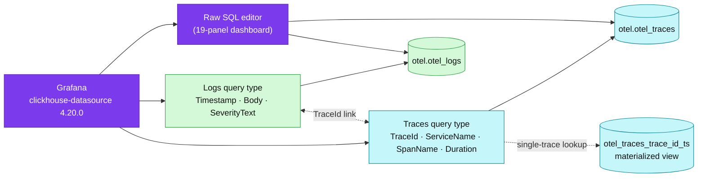

# Grafana on ClickHouse — logs + traces deep dive

Grafana turns the `otel` MergeTree tables into an explorable logs/traces UI and a SQL dashboard surface — this guide covers the datasource contract, the OTel schema versions, Explore, trace↔log linking, and how to build panels that stay fast.

| | |
|---|---|
| **Plugin** | `grafana-clickhouse-datasource` **4.20.0** (pinned — cluster `GF_INSTALL_PLUGINS`, local-stack compose) |
| **Datasource** | `uid: clickhouse`, native protocol `:9000`, database `otel` |
| **Tables** | `otel.otel_logs`, `otel.otel_traces` (+ `otel_traces_trace_id_ts` MV) |
| **OTel mapping** | `logs.otelEnabled` + `traces.otelEnabled` in provisioning — query builders, Explore views, trace↔log links |
| **Schema version** | auto (latest) — detected from table columns; both environments write **1.3.0** (collector contrib `0.152.0`) |
| **Dashboard** | *ClickHouse — OTel logs+traces SQL* (`uid: clickhouse-otel-sql`, 19 panels, raw SQL) |
| **Design record** | [RFC-0019](../../proposals/rfc/RFC-0019/) · [ADR-023](../../proposals/adr/ADR-023-clickhouse-observability-olap/) |

## Overview

VictoriaLogs and Tempo stay the operational primaries (7-day hot path); ClickHouse
is the 90-day SQL tier ([hub](./README.md)). The Grafana plugin is what makes that
tier usable by humans: it understands the OpenTelemetry table shape, so instead of
hand-writing every query it can render a logs panel, a trace waterfall, and jump
between a span and its log lines — while still accepting raw SQL when the query
builder runs out of road (our 19-panel dashboard is 100 % raw SQL).

Two ideas carry this whole page:

1. **The plugin maps columns, it does not ingest.** Grafana only ever runs
   `SELECT`s; the OTel mapping tells it which columns mean *time*, *severity*,
   *body*, *trace id*, *duration*.
2. **The table's `ORDER BY` decides what is cheap.** `otel_traces` is sorted
   `(ServiceName, SpanName, toDateTime(Timestamp))` — service-first filters fly,
   bare trace-id lookups need the bloom-filter index + the
   `otel_traces_trace_id_ts` materialized view.

## The datasource, as deployed

Both environments provision the same shape (cluster:
[`datasource-clickhouse.yaml`](../../../kubernetes/infra/configs/observability/grafana/datasource-clickhouse.yaml)
as a `GrafanaDatasource` CR with the password from the ESO-managed
`clickhouse-credentials` Secret; local-stack:
[`clickhouse.yaml`](../../../local-stack/observability/grafana/provisioning/datasources/clickhouse.yaml)):

```yaml
jsonData:
  host: clickhouse-clickhouse.monitoring.svc.cluster.local   # local: clickhouse
  port: 9000
  protocol: native
  defaultDatabase: otel
  username: default
  logs:
    defaultDatabase: otel
    defaultTable: otel_logs
    otelEnabled: true
  traces:
    defaultDatabase: otel
    defaultTable: otel_traces
    otelEnabled: true
```

`otelEnabled: true` is the switch that unlocks everything below: the **Logs** and
**Traces** query types in the builder, the Explore log/trace views, and the
trace↔log navigation. Without it the datasource is a plain SQL connection.
`protocol: native` (`:9000`) is marginally faster than HTTP `:8123`; both hit the
same server.

## OTel schema versions — why 4.20.0 matters

The collector's `clickhouse` exporter owns the DDL (`create_schema: true`), and
its table shape changed at **contrib 0.151.0**: the `TimestampTime DateTime`
helper column was dropped from `otel_logs`. The plugin tracks this as OTel schema
versions:

| Schema | Exporter | `otel_logs` shape |
|--------|----------|-------------------|
| 1.2.9 | contrib < 0.151.0 | has `TimestampTime` |
| **1.3.0** | contrib ≥ 0.151.0 | no `TimestampTime` — **what both our environments write** (contrib `0.152.0`) |

Plugin 4.20.0 points the **latest** selector at 1.3.0 and — the part that removes
a whole failure mode — **auto-detects the logs schema from the table's columns**
when the selector is on auto (latest). Our provisioning does not pin a version,
so the selector stays on auto and the plugin reads whatever schema the table
actually has. Datasources that *pin* a version keep it until manually updated;
we deliberately do not pin.

> Local-stack was on contrib `0.140.0` (old schema) until this bump — the two
> environments sat on opposite sides of the 0.151.0 boundary. Both now run
> `0.152.0`. An existing local `otel_logs` table keeps its old shape
> (`create_schema` is create-if-absent); drop the `otel` tables or reset volumes
> to get the 1.3.0 DDL.

## Architecture



## Logs in Explore

Pick datasource **ClickHouse**, query type **Logs**. The builder generates the
column mapping for you — conceptually:

```sql
SELECT Timestamp AS timestamp, Body AS body, SeverityText AS level
FROM otel.otel_logs
WHERE $__timeFilter(Timestamp)
ORDER BY Timestamp DESC
LIMIT 1000
```

- `timestamp`/`body`/`level` are the three aliases the logs panel requires; the
  OTel mapping supplies them because our tables use the default OTel column
  names (`Timestamp`, `Body`, `SeverityText`) — zero custom mapping needed.
- Filters added in the builder (service, severity, attribute) become `WHERE`
  clauses — `ServiceName` filters are the cheap ones (first `ORDER BY` key).
- Because `TraceId` exists on every log row, each log line renders a **View
  trace** link (below).

## Traces in Explore

Query type **Traces** maps `TraceId`, `ServiceName`, `SpanName`, `Timestamp`,
`Duration` and renders the span table; clicking a trace opens the waterfall
detail view. Two platform facts to know:

- **Single-trace lookup goes through the materialized view.** The detail view
  resolves a trace id to its time range via `otel_traces_trace_id_ts`, then
  reads spans in that window — this sidesteps the service-first sort key, which
  would otherwise make "find one TraceId across all services" a scan. The
  `bloom_filter(0.001)` index on `TraceId` covers the residual filtering
  ([hub § Deployed schema](./README.md#operations)).
- `Duration` is stored in **nanoseconds** (`UInt64`); the trace view handles the
  unit, but raw SQL panels must divide (`/1e6` → ms) — every latency panel in
  the shipped dashboard does this.

## Trace ↔ log linking

Both directions ride the shared `TraceId` column:

- **Log → trace:** a log line with a non-empty `TraceId` gets a link that opens
  the Traces view for that id (via the MV lookup above).
- **Trace → logs:** from a span, "logs for this span" runs the logs query
  filtered by the trace id: `WHERE TraceId = '<id>'` on `otel_logs`.

This is the payoff of one store for both signals — the equivalent
cross-navigation between VictoriaLogs and Tempo needs the derived-fields
bridge; here it is a same-database key lookup, and the cross-signal JOIN panel
in the dashboard (`otel_traces ANY LEFT JOIN otel_logs ON TraceId`) is the
SQL statement of the same idea.

## Building dashboards

The shipped dashboard (*ClickHouse — OTel logs+traces SQL*, files:
[cluster](../../../kubernetes/infra/configs/observability/grafana/dashboards/clickhouse-otel-sql.json) ·
[local-stack](../../../local-stack/observability/grafana/dashboards/clickhouse-otel-sql.json))
is the worked example — 19 panels, all raw SQL. The grammar it uses:

**Time series** — return a datetime aliased `time` plus numerics; Grafana plots
each numeric column:

```sql
SELECT $__timeInterval(Timestamp) AS time, count() AS spans
FROM otel.otel_traces
WHERE $__timeFilter(Timestamp)
GROUP BY time ORDER BY time
```

**Multi-line** (one line per group) — field order matters: time, then the string
group, then the value:

```sql
SELECT $__timeInterval(Timestamp) AS time, ServiceName, count() AS spans
FROM otel.otel_traces
WHERE $__timeFilter(Timestamp)
GROUP BY time, ServiceName ORDER BY time
```

**Macros** the plugin expands before the query reaches ClickHouse:

| Macro | Expands to |
|-------|------------|
| `$__timeFilter(col)` | `col >= toDateTime(<from>) AND col <= toDateTime(<to>)` — dashboard time picker |
| `$__timeInterval(col)` | `toStartOfInterval(col, INTERVAL <auto> second)` — adaptive bucketing (the dashboard's "adaptive time bucketing") |
| `$__fromTime` / `$__toTime` | The picker edges as `DateTime` scalars — for subqueries/rate denominators |
| `$__conditionalAll(expr, $var)` | `expr` when the variable has a selection, `1=1` when it is *All* — how `$service` stays optional |

**Variables** — the dashboard defines `$ds` (datasource) and `$service`
(`SELECT DISTINCT ServiceName FROM otel.otel_traces`), applied as
`$__conditionalAll(ServiceName IN ($service), $service)`. Numeric-returning
variable queries resolve correctly as of 4.20.0 (earlier versions failed with
"couldn't find any field of type string").

**Recipes already in the dashboard** worth copying instead of reinventing:
error-rate % (`countIf(StatusCode = 'STATUS_CODE_ERROR') / count()`), latency
quantiles (`quantile(0.95)(Duration)/1e6`), severity distribution
(`SeverityText` piechart), top operations by p95, recent warn+ logs table, and
the trace↔log correlation JOIN — see [hub § Query examples](./README.md#operations).

## Query performance rules

Ordered by how often they save you:

1. **Filter `ServiceName` first** — first key of `ORDER BY (ServiceName,
   SpanName, toDateTime(Timestamp))`; granule pruning does the work
   (proven in the [hub Playground](./README.md#playground--mergetree-by-hand)).
2. **Always `$__timeFilter`** — day partitions (`PARTITION BY toDate(Timestamp)`)
   make the picker range a partition prune.
3. **`ORDER BY Timestamp DESC LIMIT n` for log tables** — never unbounded; the
   Explore default is `LIMIT 1000` for a reason.
4. **Bare `TraceId` lookups** — fine ad-hoc (bloom filter + MV), but don't build
   a per-refresh dashboard panel on one; that is Explore's job.
5. **Don't `SELECT *`** — the attribute `Map` columns are the wide ones; name
   the keys you need (`ResourceAttributes['k8s.pod.name']`).

## Operations

- **Verify plugin version:** Grafana → Administration → Plugins →
  *ClickHouse* shows 4.20.0, or `GET /api/plugins/grafana-clickhouse-datasource`
  → `"info": {"version": "4.20.0"}`.
- **Verify datasource health:** the datasource page's *Save & test*, or query
  `SELECT 1` from Explore. Password comes from ESO (`clickhouse-credentials`)
  in-cluster; `otel` dev password in local-stack.
- **Schema check after collector bumps:** `DESCRIBE otel.otel_logs` — presence
  of `TimestampTime` means the table pre-dates contrib 0.151.0; auto-detect
  handles either, but a mixed fleet of tables is worth cleaning up (drop +
  let `create_schema` recreate).
- **Data not appearing:** the [hub runbook](./README.md#runbook--data-not-appearing)
  (traffic → collector export errors → reachability → tables exist).

## References

- ClickHouse docs — *Using Grafana* (observability visualization guide)
- Grafana ClickHouse datasource — configuration/provisioning reference; v4.20.0 release notes (OTel 1.3.0 schema, auto-detect, macro fixes)
- OpenTelemetry Collector contrib — `clickhouseexporter` (schema owner, `create_schema`)
- Internal: [ClickHouse hub](./README.md) · [RFC-0019](../../proposals/rfc/RFC-0019/) · [ADR-023](../../proposals/adr/ADR-023-clickhouse-observability-olap/) · [Observability hub](../README.md)

_Last updated: 2026-07-22_
