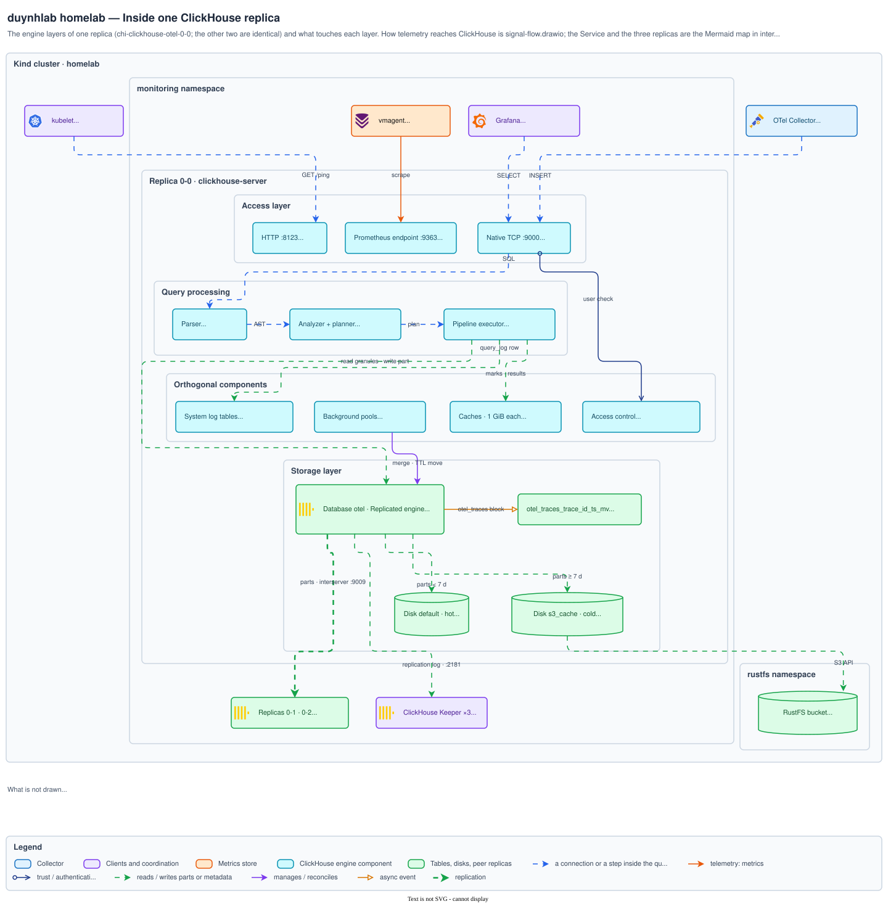
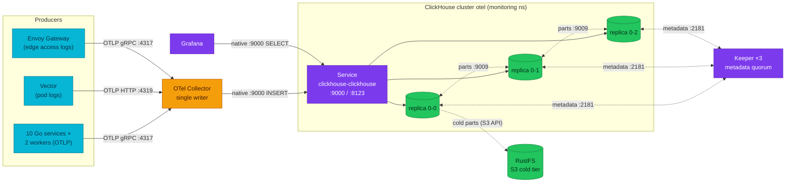

# ClickHouse in this platform — how telemetry reaches and leaves the engine

Every log line and span this platform keeps for more than a moment ends up as
rows inside ClickHouse; when a Grafana panel is slow or a table stops growing,
the first question is always *which of the co-operating processes between the
producer and the panel is involved* — and this chapter gives you that map.

| Quick facts | |
|---|---|
| **Page type** | Explanation-first learning chapter |
| **Audience** | Foundation entry point |
| **Prerequisites** | Basic SQL and `kubectl`; the [learning hub](README.md) safety rules |
| **Deployment status** | Deployed |
| **Platform scope** | `monitoring` namespace: ClickHouse cluster `otel`, Keeper ensemble, OpenTelemetry Collector, Grafana; `rustfs` namespace for the cold tier |
| **Evidence context** | Live Kind cluster `kind-homelab`, 2026-09-30 11:18–11:20 UTC, ClickHouse 26.7.17.7 — read-only lab below; other rows are labelled by evidence class |
| **This page owns** | Where ClickHouse sits, and how telemetry reaches and leaves it |
| **Not this page** | Deployed component inventory and Grafana wiring — [ClickHouse platform hub](../README.md); engine mechanics — chapters [03](03-mergetree.md)–[04](04-parts-and-merges.md); coordination — chapter [06](06-keeper.md) |
| **Previous / next** | [Learning hub](README.md) / [Query pipeline](02-query-pipeline.md) |

## Questions this chapter answers

- Which processes run between a service emitting a span and Grafana rendering it?
- Which port and protocol does each hop use, and why does the choice matter?
- What does the Altinity operator actually create when the CHI or CHK manifest changes?
- Why do the write path and the read path enter ClickHouse through the same Service but behave differently?

## Mental model

One ClickHouse **cluster** named `otel` stores this platform's logs and traces.
It has one shard and three **replicas** — three separate `clickhouse-server`
processes, each with a complete copy of the data, each on its own Kubernetes
node. Writers and readers do not talk to "the cluster"; every connection lands
on exactly one replica, and that replica does all the work for that connection.

Around the engine sit four other actors:

1. **Producers** — the microservices, Vector (pod logs), and Envoy Gateway
   (edge access logs) emit OpenTelemetry data. None of them speak to ClickHouse
   directly.
2. **The OpenTelemetry Collector** — the single writer. It batches telemetry
   and INSERTs it over the native protocol.
3. **Keeper** — a three-member quorum service that replicas use to agree on
   what data exists. It stores metadata, never table rows
   ([chapter 06](06-keeper.md) owns it).
4. **Grafana** — the main reader, querying over the same native protocol.

An analogy: the replicas are three librarians keeping identical card catalogues
in three rooms. The Collector hands new cards to whichever librarian answers
the door; the librarians then copy cards to each other by agreement recorded in
a shared ledger (Keeper). The analogy stops here: librarians copy *cards*,
while replicas copy immutable *parts* — whole boxes of sorted rows — and never
individual rows ([chapter 05](05-replication.md)).

### Essential terms

| Term | Meaning here |
|---|---|
| `replica` | One `clickhouse-server` process with its own complete local copy of the data (see the [shared glossary](README.md#shared-glossary)) |
| `native protocol` | ClickHouse's binary client protocol on TCP port 9000, used by the Collector and Grafana |
| `interserver HTTP` | The replica-to-replica port (9009) used to fetch data parts during replication |
| `CHI` / `CHK` | `ClickHouseInstallation` / `ClickHouseKeeperInstallation` — the Altinity operator's custom resources that declare the cluster |

## How it works internally

### Invariants

- Every client connection is served entirely by one replica; there is no
  coordinator process in front of the replicas. *(Upstream invariant —
  [ClickHouse architecture overview](https://clickhouse.com/docs/resources/develop-contribute/introduction/architecture).)*
- A single `clickhouse-server` process serves all interfaces at once: native
  TCP 9000, HTTP 8123, interserver HTTP 9009, and the Prometheus endpoint
  ([ports reference](https://clickhouse.com/docs/concepts/features/security/tls/configuring-tls),
  [Prometheus endpoint](https://clickhouse.com/docs/concepts/features/interfaces/prometheus)).
  There is no separate "ingest daemon" or "query daemon". *(Upstream
  invariant.)*
- The engine does not guarantee that two consecutive connections land on the
  same replica. Load balancing happens outside ClickHouse, in the Kubernetes
  Service. *(Repository fact — see below.)*

### Inside one replica — the engine's layers

This picture answers *what sits inside one replica and what touches each
layer*; the Mermaid map further down answers *how telemetry reaches and leaves
the cluster*. The layers are the ones ClickHouse's own architecture overview
names (access, query processing, storage, orthogonal components, replication
through Keeper), filled with what this deployment actually runs.

<p align="center"><a href="../../../architecture/observability/clickhouse-engine.svg"></a></p>
<p align="center"><sub>Source <a href="../../../architecture/observability/clickhouse-engine.drawio"><code>observability/clickhouse-engine.drawio</code></a> · <a href="../../../architecture/observability/img/clickhouse-engine.png">PNG</a></sub></p>

What the picture leaves out is as deliberate as what it shows: no Distributed
table, dictionary, or second shard exists here ([chapter 07](07-sharding.md)
treats them as reference), and no backup mechanism is deployed. Every box is
*Observed* on 2026-09-30 from `system.tables`, `system.disks`,
`system.storage_policies`, `system.server_settings`, and `system.users` on
`chi-clickhouse-otel-0-0-0`.

### The single process behind four ports

`clickhouse-server` is one process with four externally relevant listeners:

| Port | Protocol | Who uses it here |
|---|---|---|
| 9000 | Native TCP (binary, compressed) | Collector INSERTs, Grafana queries, `clickhouse-client` |
| 8123 | HTTP | Kubernetes liveness/readiness probes (`/ping`) |
| 9009 | Interserver HTTP | The other two replicas, fetching data parts |
| 9363 | HTTP `/metrics` | Prometheus scrapes via a PodMonitor |

The native protocol carries typed columnar blocks and is what the phrase
"ClickHouse connection" means in the rest of this path. HTTP 8123 accepts SQL
too, but in this deployment its only steady consumer is the kubelet probing
`/ping` *(Repository fact —
[CHI pod template](../../../../kubernetes/infra/configs/clickhouse/clickhouseinstallation.yaml))*.
Port 9009 is invisible to clients yet is where replication actually moves
bytes; [chapter 05](05-replication.md) walks that flow.

Observed difference (2026-09-30 11:40 UTC, listening sockets in
`chi-clickhouse-otel-0-0-0`): the process also listens on MySQL **9004** and
PostgreSQL **9005**, because the image's `config.xml` enables both by default.
Neither is a Service port and no client uses them; gRPC (9100) and HTTPS (8443)
are commented out. The four listeners above are the ones this platform relies on.

### What the operator turns manifests into

The Altinity operator watches two custom resources and renders them into
ordinary Kubernetes objects — one StatefulSet **per replica**, not one
StatefulSet with three Kubernetes replicas:

| Declared (Git) | Created on the cluster |
|---|---|
| CHI `clickhouse`, cluster `otel`, `shardsCount: 1`, `replicasCount: 3` | StatefulSets `chi-clickhouse-otel-0-0`, `chi-clickhouse-otel-0-1`, `chi-clickhouse-otel-0-2`, each with one pod and one 10Gi PVC |
| CHK `keeper`, 3 replicas | StatefulSets `chk-keeper-keeper-0-{0,1,2}`, each with a 2Gi PVC |
| CHI service template | Service `clickhouse-clickhouse` (ports 9000, 8123) that selects **all three** ClickHouse pods |

*(Repository facts —
[`clickhouseinstallation.yaml`](../../../../kubernetes/infra/configs/clickhouse/clickhouseinstallation.yaml),
[`clickhousekeeperinstallation.yaml`](../../../../kubernetes/infra/configs/clickhouse-keeper/clickhousekeeperinstallation.yaml).)*

The per-replica StatefulSet naming is the operator's design: each replica has
its own identity, its own storage, and can be reconciled independently. The
name encodes `chi-{installation}-{cluster}-{shard}-{replica}`, so
`chi-clickhouse-otel-0-2` reads as "installation `clickhouse`, cluster `otel`,
shard 0, replica 2". A required pod anti-affinity on `kubernetes.io/hostname`
pins one replica per node *(Repository fact — CHI pod template)*.

### Write path and read path — same door, different journeys



Legend: cyan = telemetry producers, amber = the collector (single writer),
purple = platform plumbing (Service, Keeper, Grafana), green = data-bearing
stores. Dotted edges are internal flows a client never sees: part fetches over
interserver 9009, Keeper metadata sessions, and cold-tier movement to RustFS
(replica 0-0 drawn as representative; all three replicas behave identically).

### What to notice

- Both the INSERT and the SELECT arrive through the **same Service**, and the
  Service spreads connections across all three replicas. The write path and
  read path differ in what happens *after* landing, not in how they enter.
- The Collector is the **only writer**. Producers never hold a ClickHouse
  connection, so ingestion pressure and query pressure meet the engine through
  one predictable client each.
- Replication (dotted, 9009) and coordination (dotted, 2181) are separate
  channels: Keeper carries agreements about parts, the interserver port
  carries the parts themselves. Losing one is not losing the other.
- The diagram does **not** imply the INSERT is replicated by the Collector
  writing three times. It writes once; the replicas copy from each other
  ([chapter 05](05-replication.md)).

After an INSERT lands on one replica, that replica writes a new immutable part
locally, records it in Keeper, and the other two fetch it over 9009
([chapters 04](04-parts-and-merges.md) and [05](05-replication.md)). After a
SELECT lands on one replica, that single replica parses, plans, and executes
the whole query against its local parts ([chapter 02](02-query-pipeline.md))
— it does not fan the query out to the other replicas, because with one shard
every replica already has everything.

## How homelab uses it

| Upstream mechanism | Homelab setting or behavior | Evidence | Class/status |
|---|---|---|---|
| Cluster topology (shards × replicas) | `otel`: 1 shard × 3 replicas | [CHI](../../../../kubernetes/infra/configs/clickhouse/clickhouseinstallation.yaml) `shardsCount: 1`, `replicasCount: 3`; decision in [ADR-065](../../../proposals/adr/ADR-065-clickhouse-replicated-topology/README.md) | Repository fact |
| Server image | `clickhouse/clickhouse-server:26.7` (floating patch tag — record `SELECT version()` per observation) | CHI pod template | Repository fact |
| Native protocol ingest | Collector exporter → `tcp://clickhouse-clickhouse.monitoring.svc.cluster.local:9000` | [Collector manifest](../../../../kubernetes/infra/controllers/tracing/otel-collector/otel-collector.yaml) | Repository fact |
| Prometheus endpoint | `:9363` per pod, scraped by a PodMonitor (operator Services do not carry the port) | CHI settings and pod-template comment | Repository fact |
| Replica placement | Required anti-affinity, one replica per node | CHI pod template | Repository fact |
| Coordination service | External Keeper ensemble `keeper`, 3 members, port 2181 | [CHK](../../../../kubernetes/infra/configs/clickhouse-keeper/clickhousekeeperinstallation.yaml) | Repository fact |
| Tiered storage | Cold volume on RustFS (S3 API), bucket `clickhouse-otel` | CHI storage config; owned by [chapter 10](10-storage-s3.md) | Repository fact |
| Bring-up ordering | Flux: keeper → clickhouse → schema Job → collector | `kubernetes/clusters/local/` Kustomizations | Repository fact |

The single-shard choice is why this chapter's read path is so short: any
replica can answer any query alone. The moment a second shard existed, a query
would need fan-out and merge — that difference is
[chapter 07](07-sharding.md)'s owning question. The full component inventory,
versions, and Grafana wiring live in the
[platform hub](../README.md#core-components); this page only explains why the
pieces are arranged this way.

## Observe it on the live cluster

### Prerequisites and safety

- Use the [secure ClickHouse client pattern](../operations.md#secure-client-pattern).
- Confirm the current context and the replica you will query.
- Run only the read-only commands shown below.

### Query

First, what Kubernetes runs (one StatefulSet per replica, per Keeper member):

```bash
kubectl get statefulsets -n monitoring -l clickhouse.altinity.com/chi=clickhouse
kubectl get statefulsets -n monitoring -l clickhouse-keeper.altinity.com/chk=keeper
```

Then, what the engine believes its own cluster looks like, and which replica
answered:

```sql
SELECT DISTINCT
    cluster,
    shard_num,
    replica_num,
    host_name,
    port
FROM system.clusters
WHERE cluster = 'otel'
ORDER BY shard_num, replica_num
LIMIT 10;
```

```sql
SELECT
    hostName() AS answering_replica,
    version() AS server_version
LIMIT 1;
```

### Observed example

```text
$ kubectl -n monitoring get sts -l clickhouse.altinity.com/chi=clickhouse
NAME                      READY   AGE
chi-clickhouse-otel-0-0   1/1     9h
chi-clickhouse-otel-0-1   1/1     9h
chi-clickhouse-otel-0-2   1/1     8h
$ kubectl -n monitoring get sts -l clickhouse-keeper.altinity.com/chk=keeper
chk-keeper-keeper-0-0   1/1     9h
chk-keeper-keeper-0-1   1/1     9h
chk-keeper-keeper-0-2   1/1     9h

cluster  shard_num  replica_num  host_name                port
otel     1          1            chi-clickhouse-otel-0-0  9000
otel     1          2            chi-clickhouse-otel-0-1  9000
otel     1          3            chi-clickhouse-otel-0-2  9000

answering_replica          server_version
chi-clickhouse-otel-0-0-0  26.7.17.7
```

Observation context:

| Field | Value |
|---|---|
| **Observed at** | 2026-09-30 11:18–11:20 UTC |
| **Repository** | `docs/clickhouse-internals-chapters` at `423a1c04` (main merged at `f326a367`) |
| **Cluster/context** | `kind-homelab` — Kind 1.35.8, cluster rebuilt 2026-09-30 ≈02:10 UTC |
| **ClickHouse** | `26.7.17.7` (image tag `clickhouse/clickhouse-server:26.7`); Keeper `v26.7.17.7-stable` |
| **Database/table** | `system.clusters` (cluster `otel`) |
| **Replica** | `chi-clickhouse-otel-0-0-0` |

Declared versus observed: the CHI pins the floating tag
`clickhouse/clickhouse-server:26.7`; the running patch release was
**26.7.17.7** (2026-09-30 11:20 UTC). Keeper reports the same build. The tag
alone never tells you the patch — a pod restart can move it.

### How to read the result

| Field or relationship | Interpretation | What it cannot prove |
|---|---|---|
| Six StatefulSets, each `1/1` | The operator rendered the CHI/CHK into per-replica StatefulSets and all pods are ready | Ready pods do not prove the replicas agree on data — that is `system.replicas` ([chapter 05](05-replication.md)) |
| `system.clusters` rows for `otel` | The cluster definition this replica would use for distributed queries: expect shard 1, replicas 1–3 | The definition is published asynchronously by the operator and can lag reality; the schema Job was rewritten because a fresh bring-up listed 2 hosts while 3 pods ran, and it returns duplicate rows per host (hence `DISTINCT`) — see the [schema Job header](../../../../kubernetes/infra/configs/clickhouse-schema/job.yaml) |
| `hostName()` | The pod that served *this* connection | It says nothing about which replica will serve the next connection — the Service balances each one independently |
| `version()` | The actual patch release behind the floating `26.7` image tag | The tag in Git alone cannot tell you this |

### What to notice

- The mapping declared-manifest → StatefulSet-per-replica is visible directly:
  the names encode installation, cluster, shard, and replica.
- `system.clusters` is the engine's *belief*, not Kubernetes' state — the
  known lag between them (Inference from the schema Job's recorded failures)
  is exactly why the schema Job asserts against declared intent instead.
- `hostName()` output is an observed example; treating one answer as "the"
  server is the most common early mistake with this topology.

## Failure modes and trade-offs

| Trigger | Internal reaction | User-visible symptom | Evidence | Recovery boundary or cost |
|---|---|---|---|---|
| One replica pod lost | Service stops routing to it; other replicas keep serving; the returning replica catches up from the others | Brief connection errors for clients that had landed on it | `kubectl get pods -n monitoring`; `system.replicas` on survivors | Self-healing; capacity −⅓ meanwhile *(Inference from topology; drills recorded in [ADR-065](../../../proposals/adr/ADR-065-clickhouse-replicated-topology/README.md))* |
| Keeper quorum lost | Replicas keep answering SELECTs; replicated INSERTs stop | Reads fine, writes fail | `system.zookeeper_connection` | Owned by [chapter 06](06-keeper.md) *(Upstream invariant)* |
| Collector down | No writer exists at all; producers buffer or drop per their own configuration | Tables stop growing; queries unaffected | Freshness checks in [operations](../operations.md) | Owned by [chapter 08](08-ingestion-pipeline.md) |
| RustFS unavailable | Hot-tier reads and writes continue; cold-tier reads and TTL moves fail | Queries over data older than the move boundary error or stall | `system.errors` (S3), [chapter 10](10-storage-s3.md) | Hot path is insulated from the cold tier |

During any single failure above, the invariant "each connection is served by
one replica using its local data" still holds for the surviving replicas; what
is temporarily lost is either write availability (Keeper), freshness
(Collector), or history depth (RustFS). Diagnosis order across layers is
[chapter 11](11-failure-recovery.md)'s job; recovery procedures live in
[operations](../operations.md).

## Misconceptions and challenge questions

### "The Collector writes to the primary, and Grafana reads from secondaries"

There is no primary. All three replicas accept writes and reads; the Service
routes each connection to any of them. Multi-writer safety at the storage
level is provided by the replication log, not by role assignment
([chapter 05](05-replication.md)). The CHI declares no role labels at all
*(Repository fact)*.

### "Three replicas means the Collector's INSERT is sent three times"

The Collector writes once, to one replica. Replication is the *engine's*
work, asynchronous, done by the other replicas fetching the new part over
interserver 9009 after seeing it announced in Keeper. *(Upstream invariant —
see [chapter 05](05-replication.md) for the mechanism and its citations.)*

### Challenge: a colleague port-forwards to `clickhouse-clickhouse:9000`, runs the same `SELECT count() FROM otel.otel_logs` twice, and gets two slightly different numbers. Broken replication?

**Model answer:** Not necessarily. The two connections likely landed on two
different replicas (`hostName()` would show it), and replication is
asynchronous — the replica that most recently received inserts can be
momentarily ahead. Convergence, lag measurement, and when a difference *is* a
problem are [chapter 05](05-replication.md)'s subject. The check that settles
it: `system.replicas` queue depth and delay on each replica.

## Teach-back checklist

Before continuing, explain these without rereading the chapter:

- [ ] The five actors between a service emitting a span and Grafana rendering
      it, and which port each hop uses.
- [ ] What the operator creates from `replicasCount: 3`, and where each
      replica's data lives.
- [ ] Why the write path and read path enter through the same Service, and
      what differs after landing.
- [ ] One reason `system.clusters` output must not be treated as ground truth
      for replica count.
- [ ] The cost accepted by having no coordinator in front of the replicas.

## Related documentation

- [ClickHouse platform hub](../README.md) — component inventory, versions, Grafana wiring
- [ClickHouse fundamentals](../fundamentals.md) — why OLAP, and the VLDB-paper view of this architecture
- [ADR-065 — replicated topology](../../../proposals/adr/ADR-065-clickhouse-replicated-topology/README.md) — why 1×3 and not 3×1
- [OpenTelemetry Collector](../../opentelemetry/collector.md) — the single writer's own page
- Next: [Query pipeline](02-query-pipeline.md)

## References

- [ClickHouse architecture overview](https://clickhouse.com/docs/resources/develop-contribute/introduction/architecture)
- [Architecture overview — layers of the engine](https://clickhouse.com/docs/concepts/core-concepts/academic-overview)
- [Network ports and interfaces](https://clickhouse.com/docs/concepts/features/security/tls/configuring-tls)
- [Prometheus metrics endpoint](https://clickhouse.com/docs/concepts/features/interfaces/prometheus)
- [Altinity ClickHouse operator](https://github.com/Altinity/clickhouse-operator)

---
_Last updated: 2026-09-30 — engine-layers Draw.io diagram added; MySQL/PostgreSQL listeners recorded as an observed difference. Earlier the same day: live lab verified: 3 replicas + 3 Keeper members, patch 26.7.17.7 behind the `26.7` tag. Earlier: 2026-09-29 — first published version of the architecture chapter; live lab pending verification._
