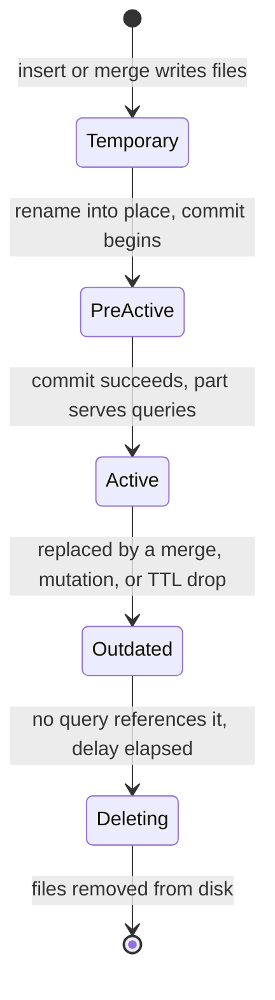

# Parts and merges — how an insert becomes immutable parts that evolve

Two parts observed in the same partition of `otel.otel_logs` on this cluster —
`20260930_0_2977_18` with 1,374,649 rows and `20260930_7093_7093_0` with 528
rows — look like arbitrary file names until you can read them. This chapter teaches the write lifecycle
that produced them: how a batch of telemetry becomes an immutable part, and how
background merges rewrite parts without ever modifying one.

| Quick facts | |
|---|---|
| **Page type** | Explanation-first learning chapter |
| **Audience** | Practitioner — the write path and its evolution |
| **Prerequisites** | [MergeTree layout](03-mergetree.md); the [shared glossary](README.md#shared-glossary) terms block, granule, part, partition, merge |
| **Deployment status** | Deployed — `otel.otel_logs`, `otel.otel_traces`, `otel.otel_traces_trace_id_ts` on the Kind cluster |
| **Platform scope** | Database `otel`, all three replicated tables; write path from the OpenTelemetry Collector |
| **Evidence context** | Live Kind cluster `kind-homelab`, 2026-09-30 11:18:22 (snapshot A) and 11:48:30 UTC (snapshot B), ClickHouse 26.7.17.7 — read-only lab below; other rows are labelled by evidence class |
| **This page owns** | How an insert becomes immutable parts, how those parts evolve, and the live two-part case study |
| **Not this page** | Merge pressure thresholds, partitions, and TTL mechanics — [Parts, merges, partitions, and TTL](../parts-merges-and-ttl.md); replica convergence — [Replication](05-replication.md) |
| **Previous / next** | [MergeTree layout](03-mergetree.md) / [Replication](05-replication.md) |

## Questions this chapter answers

- What sequence of states does data pass through between an INSERT and an
  immutable part on disk?
- What do the four fields of a part name like `20260930_0_2977_18` record, and
  what can each field not prove?
- When does the deployed asynchronous-insert buffer flush, and what does the
  client acknowledgement mean at each setting?
- Which `system.part_log` event types distinguish an insert from a merge, a
  fetch, a TTL move, and a cleanup?
- How does a mutation differ from a merge when both rewrite parts?

## Mental model

An insert never edits a file. ClickHouse collects the incoming rows into one or
more in-memory [blocks](README.md#shared-glossary), sorts each block by the
table's sorting key, and writes it out as a brand-new directory of column
files — a **part**. The part is immutable from that moment: no later insert,
update, or delete will ever open it for writing.

Because every insert creates at least one new part, a table would decay into
thousands of tiny sorted files if nothing pushed back. Background **merges**
are that pushback: a merge reads several existing parts, streams their rows
into one larger sorted part, publishes the result, and marks the inputs as
outdated. The table's visible content never changes during a merge — only its
physical arrangement does. Think of a librarian who never edits a book but
periodically rebinds several thin pamphlets into one volume; the analogy stops
at ordering, because the librarian's rebinding also re-sorts every page
globally by the sorting key, which pamphlets on a shelf never do.

### Essential terms

| Term | Meaning here |
|---|---|
| `block number` | A monotonically increasing integer the table allocates to each inserted block; part names record the range of block numbers they cover |
| `level` | How many merge generations produced a part; an insert writes level 0, and a merge writes max(input levels) + 1 |
| `mutation` | An `ALTER TABLE ... UPDATE/DELETE` that rewrites affected parts into new parts with the same block range and a mutation version suffix |
| `active part` | A part that serves queries; merges demote their inputs to inactive (outdated) without deleting them immediately |
| `asynchronous insert` | A server-side buffer that collects many small INSERT statements and flushes them as one block, trading immediate durability for fewer parts |

## How it works internally

### Invariants

- A part, once written, is never modified in place. Every change to physical
  layout happens by writing new parts and retiring old ones. (Upstream
  invariant — [MergeTree parts](https://clickhouse.com/docs/concepts/core-concepts/parts).)
- A merge only combines parts from the same partition, and the result stays in
  that partition. (Upstream invariant.)
- The set of active parts always represents exactly the table's visible rows;
  a query lists active parts once at start and reads a consistent snapshot even
  while merges retire those parts underneath it. (Upstream invariant.)
- A merge does not guarantee when it runs. Part count is allowed to rise under
  insert pressure; only the guard thresholds are firm — see
  [part pressure](../parts-merges-and-ttl.md#part-pressure-and-the-two-guard-dimensions).

### Lifecycle or sequence

The write path, in causal order:

1. **Arrival.** An INSERT arrives with rows in some order. With asynchronous
   insert enabled, the rows first land in a per-shape in-memory buffer instead
   of being processed immediately.
2. **Flush decision (async insert only).** The buffer flushes when the first
   threshold is reached: accumulated data size, elapsed time
   (`async_insert_busy_timeout_ms`), or number of buffered insert queries.
   (Upstream invariant —
   [asynchronous inserts](https://clickhouse.com/docs/optimize/asynchronous-inserts).)
3. **Block formation.** The flushed data is squashed into one or more blocks.
   One INSERT (or one flush) can produce several blocks when it is large or
   spans several partitions, and several client requests can collapse into one
   block. This is why counting client requests from part names fails.
4. **Sort and write.** Each block is sorted by the sorting key and written as a
   new directory: column files, marks, the sparse primary index, checksums —
   the anatomy [chapter 03](03-mergetree.md) owns. The part is first written
   under a temporary name, then committed.
5. **Naming.** The table allocates the next block number(s) and names the part
   `<partition-id>_<min-block>_<max-block>_<level>`. A freshly inserted part
   covers one block number and has level 0. For the replicated tables here,
   block numbers are allocated through Keeper so they are unique across
   replicas — [chapter 05](05-replication.md) owns that path.
6. **Activation.** The part becomes active and visible to new queries.
7. **Merge.** A background thread selects a group of active parts in one
   partition and rewrites them into one part whose name spans the inputs'
   block-number range with level = max(input levels) + 1. Inputs become
   outdated.
8. **Cleanup.** Outdated parts are removed after a delay, once no query still
   reads them.

The part's state machine, as exposed by `system.parts.state` and the part
metrics in [`system.metrics`](https://clickhouse.com/docs/reference/system-tables/metrics):



### What to notice

- Immutability is what makes the transitions safe: a query holding `Active`
  parts keeps reading them even after they become `Outdated`, because nothing
  rewrites their bytes.
- `Outdated` is not an error state. Seeing inactive parts in `system.parts`
  right after heavy merging is the lifecycle working, not leftover corruption.

### Reading a part name

`<partition-id>_<min-block>_<max-block>_<level>` — and after a mutation, a
fifth field `_<mutation-version>`. ClickHouse ships an introspection function,
[`mergeTreePartInfo`](https://clickhouse.com/docs/reference/functions/regular-functions/introspection),
that unpacks exactly these fields. Applied to the two case-study parts
(`otel.otel_logs`, partition `2026-09-30`, observed 2026-09-30 11:18–11:28 UTC;
`mergeTreePartInfo` returned `('20260930','','',0,2977,18,0)` and
`('20260930','','',7093,7093,0,0)`):

| Field | `20260930_0_2977_18` | `20260930_7093_7093_0` | Meaning |
|---|---|---|---|
| Partition ID | `20260930` | `20260930` | `PARTITION BY toDate(...)` renders one day as `YYYYMMDD` |
| Min block | `0` | `7093` | Lowest block number the part covers |
| Max block | `2977` | `7093` | Highest block number the part covers |
| Level | `18` | `0` | Merge depth: 18 generations of merging vs. a raw insert |

The big part is the merged history of every block from 0 through 2977 of that
day that still has surviving rows. `system.part_log` shows how it was born: one
merge at 05:58:51 that took 20.3 s and read seven inputs at levels 16, 17, 16,
16, 14, 12 and 8 — so its level is 17 + 1 = 18. The small part is one freshly
inserted block (min = max = 7093) that no merge had touched: level 0.

Its whole life is in the logs of two replicas. `chi-clickhouse-otel-0-2-0`
wrote it (`NewPart`, 528 rows, 25 ms, 11:09:29); `chi-clickhouse-otel-0-0-0`
fetched it in the same second (`DownloadPart`) and 17 s later merged it with
four neighbours into `20260930_7093_7097_1` (level 1). That part fed
`20260930_7054_7101_7` (level 7 = max(6, 1, 0) + 1), and the level-0 part was
physically removed at 11:21:14 on one replica and 11:22:15 on the other — about
twelve minutes after it stopped being active.

The issue that commissioned this chapter named two other parts,
`20260929_0_456_17` and `20260929_457_457_0`, observed on 2026-09-29. They no
longer exist anywhere: the cluster was destroyed and rebuilt on 2026-09-30, and
neither `system.parts` nor `system.part_log` (whose earliest event is
2026-09-30 02:17 UTC) has a row for them. Absence plus the start of the log is
the only evidence left, so the case study moved to parts that can still be
queried. Their names read exactly as the table above teaches.

**What the name cannot prove** — the limits of inference required by this case
study:

- **Level 18 records merge depth, not a count of 18 merge operations.** Level
  is max(input levels) + 1 per merge, along one deepest path. On this replica
  alone `otel_logs` ran 163 merges in the hour before the snapshot; the seven
  inputs of `20260930_0_2977_18` each carried their own histories. Far more
  than 18 merges lie behind it.
- **Max block 456 is not proof of 457 client INSERT requests.** The deployed
  collector inserts with `async_insert=true` (repository fact —
  [`otel-collector.yaml`](../../../../kubernetes/infra/controllers/tracing/otel-collector/otel-collector.yaml)),
  so one block typically aggregates many buffered insert queries; conversely a
  large flush can split into several blocks. Block numbers count blocks, not
  requests — and not rows. Measured: block numbers advanced from 7054 to 7210
  between 11:08 and 11:18 UTC (≈ 157 blocks in 10 minutes) while the inserting
  replica logged 200 INSERT queries in 15 minutes (≈ 133 per 10 minutes) — close
  to one block per ~5 s flush, but not one per request.
- **1,374,649 rows is not the total ever ingested for that day.** At the same
  moment the partition held 3.25 M rows across seven active parts. Merges keep
  only surviving rows, and delete-TTL drops whole expired parts
  (`ttl_only_drop_parts = 1` in the
  [DDL](https://github.com/duynhlab/images/blob/main/images/clickhouse-ddl/sql/10-otel_logs.sql)). Rows in
  active parts are a floor for "visible at this moment", not a counter of "ever
  written".
- **The name says nothing about which replica created it.** On a replicated
  table the same part name exists on every replica, whether it was written
  locally or fetched — `20260930_7093_7093_0` was `NewPart` on one replica and
  `DownloadPart` on another. [Chapter 05](05-replication.md) owns that
  distinction.

### Merge selection, and mutations versus merges

The scheduler picks the next background task under the
`background_merges_mutations_scheduling_policy` server setting, `round_robin`
by default (upstream invariant —
[server settings](https://clickhouse.com/docs/reference/settings/server-settings/settings)).
Which parts form a good merge is a separate heuristic that favors groups of
similar-sized neighbors and, since the 26.x series, automatically lowers the
maximum number of parts merged at once as a partition fills (upstream —
[2026 changelog](https://clickhouse.com/docs/resources/changelogs/oss/2026)).
The consequence worth keeping: merges are opportunistic and unordered, so two
replicas or two days of the same workload can hold different intermediate part
sets while representing identical rows.

A **mutation** (`ALTER TABLE ... UPDATE/DELETE`) also rewrites parts, but with
opposite semantics: a merge combines many parts into one and never changes row
content, while a mutation rewrites each affected part one-for-one with changed
content, appending a mutation version to the name (upstream —
[updates overview](https://clickhouse.com/docs/concepts/features/operations/update/overview)).
Mutations are forbidden on this shared cluster
([observation safety](README.md#observation-safety)); they appear here only so
you can recognize a five-field part name if one ever shows up in evidence.

## How homelab uses it

| Upstream mechanism | Homelab setting or behavior | Evidence | Class/status |
|---|---|---|---|
| Async-insert buffering before block formation | The ClickHouse exporter sets `async_insert: true` on its connection; batching upstream of it is 512–1024 items or 5 s | [`otel-collector.yaml`](../../../../kubernetes/infra/controllers/tracing/otel-collector/otel-collector.yaml) | Repository fact |
| Acknowledgement mode `wait_for_async_insert` | Not set in the exporter config, so the server default applies: acknowledge only after the buffer flushes to a part | [Async inserts](https://clickhouse.com/docs/optimize/asynchronous-inserts); live `system.settings`: `wait_for_async_insert = 1`, `changed = 0` (2026-09-30) | Observed |
| One part per flushed block, per partition | Daily partitions (`PARTITION BY toDate(...)`) mean a flush spanning midnight writes at least two parts | [`10-otel_logs.sql`](https://github.com/duynhlab/images/blob/main/images/clickhouse-ddl/sql/10-otel_logs.sql) | Repository fact |
| Whole-part TTL drops | `ttl_only_drop_parts = 1` on all three `otel` tables — expired data leaves as `RemovePart` of whole parts, never as row rewrites | [`10-otel_logs.sql`](https://github.com/duynhlab/images/blob/main/images/clickhouse-ddl/sql/10-otel_logs.sql), [`30-otel_traces_trace_id_ts.sql`](https://github.com/duynhlab/images/blob/main/images/clickhouse-ddl/sql/30-otel_traces_trace_id_ts.sql) | Repository fact |
| Part-count guardrails | Alerts fire at 300 active parts (total and per partition) | [Part pressure](../parts-merges-and-ttl.md#part-pressure-and-the-two-guard-dimensions), [`ClickHouseTooManyParts` runbook](../../runbooks/clickhouse/ClickHouseTooManyParts.md) | Repository fact |
| `part_log` retention | The operator-owned `system.part_log` keeps 30 days in daily partitions, so lineage evidence is available that far back | [Engine log tables](../README.md#the-engines-own-log-tables) | Repository fact |

The deployed shape means part creation here is calm by design: the collector's
batching plus the server's async-insert buffer turn thousands of telemetry
writes per minute into a few blocks, and daily partitions keep every merge
local to one day. When part counts still climb, the causes and responses are
owned by [Parts, merges, partitions, and TTL](../parts-merges-and-ttl.md).

## Observe it on the live cluster

This lab lists today's parts of `otel_logs`, decodes one from its name, and
reads its lineage from `system.part_log`. The parts it names are the ones
observed on 2026-09-30; on your run, pick the highest-level active part and
any recent level-0 part from the first query and substitute their names. It is
read-only. Do not run `OPTIMIZE` to force the pending merge — the hub
Playground demonstrates `OPTIMIZE` on a scratch basis, but the
[safety boundary](README.md#observation-safety) forbids it here; if you want to
see the merge, take a second snapshot later and let background activity happen
naturally.

### Prerequisites and safety

- Use the [secure ClickHouse client pattern](../operations.md#secure-client-pattern).
- Confirm the current kubeconfig context and note which replica you connect to;
  `system.parts` and `system.part_log` are replica-local.
- Run only the read-only queries below.

### Query

Today's partition, active and recently outdated parts together — outdated
parts linger for a few minutes after a merge, which is what makes lineage
visible here:

```sql
SELECT
    name,
    rows,
    marks,
    level,
    formatReadableSize(bytes_on_disk) AS on_disk,
    part_type,
    disk_name,
    modification_time
FROM system.parts
WHERE database = 'otel'
  AND table = 'otel_logs'
  AND partition = toString(today())
ORDER BY min_block_number, level
LIMIT 40;
```

Decode a name with the engine's own parser:

```sql
SELECT mergeTreePartInfo('20260930_0_2977_18') AS big,
       mergeTreePartInfo('20260930_7093_7093_0') AS small;
```

Then the lineage of both parts — how each was born and what consumed it:

```sql
SELECT event_time, event_type, part_name, rows, length(merged_from) AS inputs, merged_from
FROM system.part_log
WHERE database = 'otel'
  AND table = 'otel_logs'
  AND (part_name IN ('20260930_0_2977_18', '20260930_7093_7093_0')
       OR has(merged_from, '20260930_7093_7093_0'))
ORDER BY event_time
LIMIT 20;
```

### Observed example

```text
-- lost sample parts (issue, 2026-09-29) on chi-clickhouse-otel-0-0-0
system.parts 0 rows · system.part_log 0 rows · earliest part_log event 2026-09-30 02:17:39

-- snapshot A 11:18:22 UTC, otel.otel_logs partition 2026-09-30, active parts
name                   rows     marks level on_disk     part_type
20260930_0_2977_18     1374649  180   18    103.21 MiB  Wide
20260930_2978_5708_18  1201717  158   18    91.19 MiB   Wide
20260930_5709_6180_16  214208   30    16    16.51 MiB   Wide
20260930_6181_6861_16  304614   41    16    23.49 MiB   Wide
20260930_6862_7053_14  87716    12    14    6.94 MiB    Wide
20260930_7054_7205_11  69105    10    11    5.48 MiB    Wide
... plus inactive 7054_7073_3 → 7054_7078_4 → ... → 7054_7151_10 (active = 0)

-- mergeTreePartInfo
big:   ('20260930','','',0,2977,18,0)
small: ('20260930','','',7093,7093,0,0)

-- lineage (part_log)
05:58:51  MergeParts    20260930_0_2977_18    1374649 rows  20288 ms  7 inputs
          0_728_16, 729_1484_17, 1485_1870_16, 1871_2636_16,
          2637_2804_14, 2805_2933_12, 2934_2977_8
11:09:29  NewPart       20260930_7093_7093_0  528 rows (on -0-2-0, the logs inserter)
11:09:29  DownloadPart  20260930_7093_7093_0  (on -0-0-0)
11:09:46  MergeParts    20260930_7093_7097_1  2512 rows   5 inputs
11:10:02  MergeParts    20260930_7054_7101_7  21684 rows  6 inputs
11:10:47  MergeParts    20260930_7054_7111_8  → 11:11:32 20260930_7054_7121_9
11:21:14  RemovePart    20260930_7093_7093_0  (-0-0-0; 11:22:15 on -0-2-0)

-- snapshot B 11:48:30 UTC, same partition, active parts
20260930_0_2977_18     1374649  180  18  Wide      (unchanged)
20260930_2978_5708_18  1201717  158  18  Wide      (unchanged)
20260930_5709_6180_16  214208   30   16  Wide
20260930_6181_6861_16  304614   41   16  Wide
20260930_6862_7344_15  221283   30   15  Wide      11:28:42
20260930_7345_7526_12  80470    11   12  Wide      11:42:07
20260930_7527_7599_11  32476    5    11  Wide      11:47:43
20260930_7600_7608_2   3857     2    2   Compact
20260930_7609_7609_0   520      2    0   Compact

-- merges between the snapshots (part_log, -0-0-0)
11:28:42  20260930_6862_7344_15  ← 6862_7053_14, 7054_7205_11, 7206_7316_12, 7317_7344_5
11:42:07  20260930_7345_7526_12  ← 7345_7444_11, 7445_7513_11, 7514_7522_2, 7523..7526 (level 0)
11:18:22–11:48:30 event counts: MergeParts 83 · DownloadPart 398 · RemovePart 489 · NewPart 0
```

Observation context:

| Field | Value |
|---|---|
| **Observed at** | 2026-09-30 11:18:22 (snapshot A) and 11:48:30 UTC (snapshot B) |
| **Repository** | `docs/clickhouse-internals-chapters` at `423a1c04` (main merged at `f326a367`) |
| **Cluster/context** | `kind-homelab` — Kind 1.35.8, cluster rebuilt 2026-09-30 ≈02:10 UTC |
| **ClickHouse** | `26.7.17.7` (image tag `clickhouse/clickhouse-server:26.7`); Keeper `v26.7.17.7-stable` |
| **Database/table** | `otel.otel_logs` partition `2026-09-30` |
| **Replica** | `chi-clickhouse-otel-0-0-0` (the `NewPart` row for `7093` from `chi-clickhouse-otel-0-2-0`) |

Snapshot B, thirty minutes after snapshot A and with no `OPTIMIZE`, shows
merges happening on their own. Two level-18 parts sat untouched. The level-14 and
level-11 parts from snapshot A were folded into `20260930_6862_7344_15`, whose
inputs were at levels 14, 11, 12, and 5, so its level is 15, one more than the
highest input. `20260930_7345_7526_12` repeats the rule: 11, 11, 2, 0 → 12.
Both are **Observed** on `chi-clickhouse-otel-0-0-0`. That replica shows
`NewPart` 0 because every logs insert lands on `-0-2-0` and this replica only
downloads them ([chapter 08](08-ingestion-pipeline.md)). Yet it ran 83 merges
of its own: merges are computed locally ([chapter 05](05-replication.md)).

### How to read the result

| Field or relationship | Interpretation | What it cannot prove |
|---|---|---|
| `active = 0` rows between active ones | Outdated inputs of a recent merge, kept until cleanup — each run of them is a merge you can reconstruct | How long they will stay: removal is asynchronous (about twelve minutes in the 2026-09-30 run) |
| `level` vs. `rows` | High level + many rows = accumulated merge history; level 0 + few rows = one raw insert block | Level does not count merge operations, and rows do not count ingested rows |
| `min_block_number`..`max_block_number` ranges tiling the partition | Active parts cover disjoint block ranges; gaps mean those blocks' rows now live inside a wider merged part or were dropped by TTL | A missing range is not evidence of data loss |
| `part_type` | `Wide` or `Compact` representation ([chapter 03](03-mergetree.md)) | — |
| `disk_name` | `default` = hot local volume; `s3_cache`/`s3` = the part crossed the 7-day move TTL — owned by [Tiered storage](10-storage-s3.md) | — |
| `part_log.event_type` | `NewPart` = written by insert (or merge result on this replica), `MergeParts` = merge executed here, `DownloadPart` = fetched from another replica, `MovePart` = TTL/volume move, `RemovePart` = cleanup of an outdated or expired part | An empty result only bounds the last 30 days of lineage on **this replica**; other replicas hold their own `part_log` |
| A later `MergeParts` naming a wider part | The pending merge happened naturally between snapshots | When the next merge will run |

### What to notice

- Every value above is an **observed example**, not a platform constant. Part
  names, row counts, and levels change with every flush and merge; a level-0
  part is typically merged within seconds and removed within minutes, and the
  2026-09-29 parts named in the issue were gone entirely after one rebuild.
- If query 1 returns rows from more than one replica's perspective (or none),
  that is itself evidence: parts exist per replica, and lineage differs per
  replica even when content converges.

## Failure modes and trade-offs

| Trigger | Internal reaction | User-visible symptom | Evidence | Recovery boundary or cost |
|---|---|---|---|---|
| Insert rate outruns merge throughput | Active parts accumulate; the guard thresholds begin delaying, then rejecting inserts | Slower inserts, then `TOO_MANY_PARTS` errors | `system.parts` count, [`ClickHouseTooManyParts`](../../runbooks/clickhouse/ClickHouseTooManyParts.md) / [`ClickHouseInsertsRejected`](../../runbooks/clickhouse/ClickHouseInsertsRejected.md) | Fix the insert shape (batching) first; forcing merges spends the same I/O the backlog lacks — response order owned by [part pressure](../parts-merges-and-ttl.md#correct-response-order) |
| Server restart while async buffer holds data | The in-memory async-insert buffer is lost; with flush-acknowledged mode the client never got an ack for the lost rows, with fire-and-forget mode it did | A gap in telemetry with no ClickHouse error | Collector retry logs; [ingestion pipeline](08-ingestion-pipeline.md) owns the end-to-end boundary | Trade-off inherent to async insert: fewer parts for a wider unacknowledged window (upstream — [async inserts](https://clickhouse.com/docs/optimize/asynchronous-inserts)) |
| Merge fails midway (out of memory, disk full) | The temporary part is discarded; inputs stay active; the merge retries later | Merge-error entries; part count stops falling | `system.part_log` rows with non-empty `error`; `system.merges` | Immutability makes failure cheap — no torn state to repair; cost is repeated I/O on retry |
| Disk fills faster than TTL frees it | TTL drops need a background pass; whole-part drops wait for every row in the part to expire | Disk alerts before data ages out | [`ClickHouseDiskAlmostFull`](../../runbooks/clickhouse/ClickHouseDiskAlmostFull.md); TTL mechanics in [TTL is merge work](../parts-merges-and-ttl.md#ttl-is-merge-work-not-a-scheduler) | `ttl_only_drop_parts=1` trades row-precise expiry for cheap whole-part drops |

During every failure above, the immutability invariant holds: no committed
part is ever half-written. What is temporarily unavailable is the *compaction*
guarantee — part counts and disk usage may exceed their steady state until
background work catches up.

## Misconceptions and challenge questions

### "Part `20260930_0_2977_18` was produced by 18 merges of 2,978 inserts"

Both numbers are misread. Level 18 means the deepest merge chain behind this
part is 18 generations — the total number of merge operations in the partition
is neither 18 nor derivable from the name. Block range 0–2977 counts *blocks*
allocated in the partition, and with the deployed `async_insert: true` one
block usually aggregates many client insert requests, while one large flush
can also produce several blocks. The name proves coverage and depth; it counts
neither requests nor operations.

### Challenge: midnight flush

The collector flushes one async-insert buffer at 00:00:02 containing log rows
timestamped between 23:59:58 and 00:00:01. `otel_logs` partitions by
`toDate(Timestamp)`. Predict the minimum number of new parts, their levels,
and their partition IDs.

**Model answer:** At least two level-0 parts — the block splits per partition,
so one part lands in yesterday's partition ID and one in today's. Each gets
the next block number in *its own* partition's sequence, because block numbers
and merges never cross partition boundaries (see
[lifecycle](#lifecycle-or-sequence)).

## Teach-back checklist

Before continuing, explain these without rereading the chapter:

- [ ] The write path from INSERT to active part, in your own words, including
      where the async-insert buffer sits and what makes a part immutable.
- [ ] What each of the four fields in `20260930_0_2977_18` records, where that
      metadata lives (part directory name and `system.parts`), and which
      component allocates block numbers.
- [ ] What happens to buffered rows if the server restarts before a flush,
      under each `wait_for_async_insert` mode.
- [ ] One row of the case-study evidence and the strongest claim it does *not*
      support.
- [ ] The trade-off merges buy: what gets cheaper, and what pays for it.

## Related documentation

- [Parts, merges, partitions, and TTL](../parts-merges-and-ttl.md) — merge
  pressure, guard dimensions, TTL mechanics
- [ClickHouse platform hub — Playground](../README.md#playground--mergetree-by-hand) —
  hands-on part-name anatomy (its `OPTIMIZE` step is not usable under this
  path's safety boundary)
- [MergeTree layout](03-mergetree.md) — what is inside the part this chapter
  creates
- [Replication](05-replication.md) — how the same parts appear on three
  replicas
- [ClickHouse runtime audits](../audits/README.md) — dated part evidence

## References

- [Parts — core concepts](https://clickhouse.com/docs/concepts/core-concepts/parts)
- [Asynchronous inserts](https://clickhouse.com/docs/optimize/asynchronous-inserts)
- [Introspection functions — `mergeTreePartInfo`](https://clickhouse.com/docs/reference/functions/regular-functions/introspection)
- [`system.parts`](https://clickhouse.com/docs/reference/system-tables/parts) and [`system.part_log`](https://clickhouse.com/docs/reference/system-tables/part_log)
- [Server settings — background merges scheduling](https://clickhouse.com/docs/reference/settings/server-settings/settings)
- [ClickHouse 2026 OSS changelog — merge selector, insert deduplication](https://clickhouse.com/docs/resources/changelogs/oss/2026)

---
_Last updated: 2026-10-01 — DDL links point at the duynhlab/images repository. Earlier: 2026-09-30 — case study re-anchored on live parts
`20260930_0_2977_18` / `20260930_7093_7093_0` with their full `part_log`
lineage across two replicas and a second snapshot; the issue's 2026-09-29 parts
were lost with the cluster rebuild. Earlier: 2026-09-29 — first draft._
