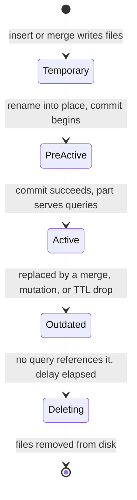

# Parts and merges — how an insert becomes immutable parts that evolve

Two parts observed in the same partition on this cluster — `20260929_0_456_17`
with 202,237 rows and `20260929_457_457_0` with 555 rows — look like arbitrary
file names until you can read them. This chapter teaches the write lifecycle
that produced them: how a batch of telemetry becomes an immutable part, and how
background merges rewrite parts without ever modifying one.

| Quick facts | |
|---|---|
| **Page type** | Explanation-first learning chapter |
| **Audience** | Practitioner — the write path and its evolution |
| **Prerequisites** | [MergeTree layout](03-mergetree.md); the [shared glossary](README.md#shared-glossary) terms block, granule, part, partition, merge |
| **Deployment status** | Deployed — `otel.otel_logs`, `otel.otel_traces`, `otel.otel_traces_trace_id_ts` on the Kind cluster |
| **Platform scope** | Database `otel`, all three replicated tables; write path from the OpenTelemetry Collector |
| **Evidence context** | Repository facts only — live lab pending verification on the Ubuntu Kind cluster |
| **This page owns** | How an insert becomes immutable parts, how those parts evolve, and the live two-part case study |
| **Not this page** | Merge pressure thresholds, partitions, and TTL mechanics — [Parts, merges, partitions, and TTL](../parts-merges-and-ttl.md); replica convergence — [Replication](05-replication.md) |
| **Previous / next** | [MergeTree layout](03-mergetree.md) / [Replication](05-replication.md) |

## Questions this chapter answers

- What sequence of states does data pass through between an INSERT and an
  immutable part on disk?
- What do the four fields of a part name like `20260929_0_456_17` record, and
  what can each field not prove?
- When does the deployed asynchronous-insert buffer flush, and what does the
  client acknowledgement mean at each setting?
- Which `system.part_log` event types distinguish an insert from a merge, a
  fetch, a TTL move, and a cleanup?
- How does a mutation differ from a merge when both rewrite parts?

## Mental model

An insert never edits a file. ClickHouse collects the incoming rows into one or
more in-memory [blocks](README.md#shared-glossary), sorts each block by the
table's sorting key, and writes it out as a brand-new directory of column
files — a **part**. The part is immutable from that moment: no later insert,
update, or delete will ever open it for writing.

Because every insert creates at least one new part, a table would decay into
thousands of tiny sorted files if nothing pushed back. Background **merges**
are that pushback: a merge reads several existing parts, streams their rows
into one larger sorted part, publishes the result, and marks the inputs as
outdated. The table's visible content never changes during a merge — only its
physical arrangement does. Think of a librarian who never edits a book but
periodically rebinds several thin pamphlets into one volume; the analogy stops
at ordering, because the librarian's rebinding also re-sorts every page
globally by the sorting key, which pamphlets on a shelf never do.

### Essential terms

| Term | Meaning here |
|---|---|
| `block number` | A monotonically increasing integer the table allocates to each inserted block; part names record the range of block numbers they cover |
| `level` | How many merge generations produced a part; an insert writes level 0, and a merge writes max(input levels) + 1 |
| `mutation` | An `ALTER TABLE ... UPDATE/DELETE` that rewrites affected parts into new parts with the same block range and a mutation version suffix |
| `active part` | A part that serves queries; merges demote their inputs to inactive (outdated) without deleting them immediately |
| `asynchronous insert` | A server-side buffer that collects many small INSERT statements and flushes them as one block, trading immediate durability for fewer parts |

## How it works internally

### Invariants

- A part, once written, is never modified in place. Every change to physical
  layout happens by writing new parts and retiring old ones. (Upstream
  invariant — [MergeTree parts](https://clickhouse.com/docs/concepts/core-concepts/parts).)
- A merge only combines parts from the same partition, and the result stays in
  that partition. (Upstream invariant.)
- The set of active parts always represents exactly the table's visible rows;
  a query lists active parts once at start and reads a consistent snapshot even
  while merges retire those parts underneath it. (Upstream invariant.)
- A merge does not guarantee when it runs. Part count is allowed to rise under
  insert pressure; only the guard thresholds are firm — see
  [part pressure](../parts-merges-and-ttl.md#part-pressure-and-the-two-guard-dimensions).

### Lifecycle or sequence

The write path, in causal order:

1. **Arrival.** An INSERT arrives with rows in some order. With asynchronous
   insert enabled, the rows first land in a per-shape in-memory buffer instead
   of being processed immediately.
2. **Flush decision (async insert only).** The buffer flushes when the first
   threshold is reached: accumulated data size, elapsed time
   (`async_insert_busy_timeout_ms`), or number of buffered insert queries.
   (Upstream invariant —
   [asynchronous inserts](https://clickhouse.com/docs/optimize/asynchronous-inserts).)
3. **Block formation.** The flushed data is squashed into one or more blocks.
   One INSERT (or one flush) can produce several blocks when it is large or
   spans several partitions, and several client requests can collapse into one
   block. This is why counting client requests from part names fails.
4. **Sort and write.** Each block is sorted by the sorting key and written as a
   new directory: column files, marks, the sparse primary index, checksums —
   the anatomy [chapter 03](03-mergetree.md) owns. The part is first written
   under a temporary name, then committed.
5. **Naming.** The table allocates the next block number(s) and names the part
   `<partition-id>_<min-block>_<max-block>_<level>`. A freshly inserted part
   covers one block number and has level 0. For the replicated tables here,
   block numbers are allocated through Keeper so they are unique across
   replicas — [chapter 05](05-replication.md) owns that path.
6. **Activation.** The part becomes active and visible to new queries.
7. **Merge.** A background thread selects a group of active parts in one
   partition and rewrites them into one part whose name spans the inputs'
   block-number range with level = max(input levels) + 1. Inputs become
   outdated.
8. **Cleanup.** Outdated parts are removed after a delay, once no query still
   reads them.

The part's state machine, as exposed by `system.parts.state` and the part
metrics in [`system.metrics`](https://clickhouse.com/docs/reference/system-tables/metrics):



### What to notice

- Immutability is what makes the transitions safe: a query holding `Active`
  parts keeps reading them even after they become `Outdated`, because nothing
  rewrites their bytes.
- `Outdated` is not an error state. Seeing inactive parts in `system.parts`
  right after heavy merging is the lifecycle working, not leftover corruption.

### Reading a part name

`<partition-id>_<min-block>_<max-block>_<level>` — and after a mutation, a
fifth field `_<mutation-version>`. ClickHouse ships an introspection function,
[`mergeTreePartInfo`](https://clickhouse.com/docs/reference/functions/regular-functions/introspection),
that unpacks exactly these fields. Applied to the two observed parts
(partition `2026-09-29`, table identity **pending live verification**):

| Field | `20260929_0_456_17` | `20260929_457_457_0` | Meaning |
|---|---|---|---|
| Partition ID | `20260929` | `20260929` | `PARTITION BY toDate(...)` renders one day as `YYYYMMDD` |
| Min block | `0` | `457` | Lowest block number the part covers |
| Max block | `456` | `457` | Highest block number the part covers |
| Level | `17` | `0` | Merge depth: 17 generations of merging vs. a raw insert |

The big part is the merged history of every block from 0 through 456 in that
day's partition that still has surviving rows; the small part is a single
freshly inserted block (min = max = 457) that no merge has touched yet
(level 0). The natural next step for the engine is a future merge producing
something like `20260929_0_457_18`. (Inference — from the naming rule; whether
that merge has happened is a live observation to capture, not a promise.)

**What the name cannot prove** — the limits of inference required by this case
study:

- **Level 17 records merge depth, not a count of 17 merge operations.** Level
  is max(input levels) + 1 per merge, along one deepest path. Many more (or
  fewer) total merge operations across the partition can lie behind a level-17
  part than 17.
- **Max block 456 is not proof of 457 client INSERT requests.** The deployed
  collector inserts with `async_insert=true` (repository fact —
  [`otel-collector.yaml`](../../../../kubernetes/infra/controllers/tracing/otel-collector/otel-collector.yaml)),
  so one block typically aggregates many buffered insert queries; conversely a
  large flush can split into several blocks. Block numbers count blocks, not
  requests — and not rows.
- **202,237 rows is not the total ever ingested for that day.** Merges keep
  only surviving rows, and delete-TTL drops whole expired parts
  (`ttl_only_drop_parts = 1` in the
  [DDL](../../../../images/clickhouse-ddl/sql/10-otel_logs.sql)). Rows in
  active parts are a floor for "visible at this moment", not a counter of "ever
  written".
- **The name says nothing about which replica created it.** On a replicated
  table the same part name exists on every replica, whether it was written
  locally or fetched — [chapter 05](05-replication.md) owns that distinction.

### Merge selection, and mutations versus merges

The scheduler picks the next background task under the
`background_merges_mutations_scheduling_policy` server setting, `round_robin`
by default (upstream invariant —
[server settings](https://clickhouse.com/docs/reference/settings/server-settings/settings)).
Which parts form a good merge is a separate heuristic that favors groups of
similar-sized neighbors and, since the 26.x series, automatically lowers the
maximum number of parts merged at once as a partition fills (upstream —
[2026 changelog](https://clickhouse.com/docs/resources/changelogs/oss/2026)).
The consequence worth keeping: merges are opportunistic and unordered, so two
replicas or two days of the same workload can hold different intermediate part
sets while representing identical rows.

A **mutation** (`ALTER TABLE ... UPDATE/DELETE`) also rewrites parts, but with
opposite semantics: a merge combines many parts into one and never changes row
content, while a mutation rewrites each affected part one-for-one with changed
content, appending a mutation version to the name (upstream —
[updates overview](https://clickhouse.com/docs/concepts/features/operations/update/overview)).
Mutations are forbidden on this shared cluster
([observation safety](README.md#observation-safety)); they appear here only so
you can recognize a five-field part name if one ever shows up in evidence.

## How homelab uses it

| Upstream mechanism | Homelab setting or behavior | Evidence | Class/status |
|---|---|---|---|
| Async-insert buffering before block formation | The ClickHouse exporter sets `async_insert: true` on its connection; batching upstream of it is 512–1024 items or 5 s | [`otel-collector.yaml`](../../../../kubernetes/infra/controllers/tracing/otel-collector/otel-collector.yaml) | Repository fact |
| Acknowledgement mode `wait_for_async_insert` | Not set in the exporter config, so the server default applies; upstream default acknowledges only after the buffer flushes to a part | [Async inserts](https://clickhouse.com/docs/optimize/asynchronous-inserts); live value pending | Upstream invariant + Inference (verify `system.settings` live) |
| One part per flushed block, per partition | Daily partitions (`PARTITION BY toDate(...)`) mean a flush spanning midnight writes at least two parts | [`10-otel_logs.sql`](../../../../images/clickhouse-ddl/sql/10-otel_logs.sql) | Repository fact |
| Whole-part TTL drops | `ttl_only_drop_parts = 1` on all three `otel` tables — expired data leaves as `RemovePart` of whole parts, never as row rewrites | [`10-otel_logs.sql`](../../../../images/clickhouse-ddl/sql/10-otel_logs.sql), [`30-otel_traces_trace_id_ts.sql`](../../../../images/clickhouse-ddl/sql/30-otel_traces_trace_id_ts.sql) | Repository fact |
| Part-count guardrails | Alerts fire at 300 active parts (total and per partition) | [Part pressure](../parts-merges-and-ttl.md#part-pressure-and-the-two-guard-dimensions), [`ClickHouseTooManyParts` runbook](../../runbooks/clickhouse/ClickHouseTooManyParts.md) | Repository fact |
| `part_log` retention | The operator-owned `system.part_log` keeps 30 days in daily partitions, so lineage evidence is available that far back | [Engine log tables](../README.md#the-engines-own-log-tables) | Repository fact |

The deployed shape means part creation here is calm by design: the collector's
batching plus the server's async-insert buffer turn thousands of telemetry
writes per minute into a few blocks, and daily partitions keep every merge
local to one day. When part counts still climb, the causes and responses are
owned by [Parts, merges, partitions, and TTL](../parts-merges-and-ttl.md).

## Observe it on the live cluster

This lab identifies the two case-study parts, decodes them from
`system.parts`, and reads their lineage from `system.part_log`. It is
read-only. Do not run `OPTIMIZE` to force the pending merge — the hub
Playground demonstrates `OPTIMIZE` on a scratch basis, but the
[safety boundary](README.md#observation-safety) forbids it here; if you want to
see the merge, take a second snapshot later and let background activity happen
naturally.

### Prerequisites and safety

- Use the [secure ClickHouse client pattern](../operations.md#secure-client-pattern).
- Confirm the current kubeconfig context and note which replica you connect to;
  `system.parts` and `system.part_log` are replica-local.
- Run only the read-only queries below.

### Query

Identify the case-study parts wherever they live, then decode the partition's
active set:

```sql
SELECT database, table, name, rows, level, active, disk_name
FROM system.parts
WHERE name IN ('20260929_0_456_17', '20260929_457_457_0')
ORDER BY name
LIMIT 10;
```

```sql
SELECT
    name,
    rows,
    marks,
    level,
    formatReadableSize(bytes_on_disk) AS on_disk,
    part_type,
    disk_name,
    modification_time
FROM system.parts
WHERE database = 'otel'
  AND partition = '2026-09-29'      -- adjust table/partition to the first query's answer
  AND active
ORDER BY min_block_number
LIMIT 20;
```

```sql
SELECT event_time, event_type, part_name, rows, merge_reason, error
FROM system.part_log
WHERE database = 'otel'
  AND part_name IN ('20260929_0_456_17', '20260929_457_457_0')
ORDER BY event_time
LIMIT 20;
```

### Observed example

```text
PENDING VERIFICATION — capture on the Ubuntu Kind cluster; see the verification worksheet in the pull request.
```

Observation context:

| Field | Value |
|---|---|
| **Observed at** | _pending_ |
| **Repository** | _pending_ |
| **Cluster/context** | _pending_ |
| **ClickHouse** | _pending_ |
| **Database/table** | _pending_ |
| **Replica** | _pending_ |

### How to read the result

| Field or relationship | Interpretation | What it cannot prove |
|---|---|---|
| `database`, `table` from query 1 | The case-study parts' owner; the issue supplied only names, so this is the identification step | Nothing about which replica first wrote them |
| `level` vs. `rows` | High level + many rows = accumulated merge history; level 0 + few rows = one raw insert block | Level does not count merge operations, and rows do not count ingested rows |
| `min_block_number`..`max_block_number` ranges tiling the partition | Active parts cover disjoint block ranges; gaps mean those blocks' rows now live inside a wider merged part or were dropped by TTL | A missing range is not evidence of data loss |
| `part_type` | `Wide` or `Compact` representation ([chapter 03](03-mergetree.md)) | — |
| `disk_name` | `default` = hot local volume; `s3_cache`/`s3` = the part crossed the 7-day move TTL — owned by [Tiered storage](10-storage-s3.md) | — |
| `part_log.event_type` | `NewPart` = written by insert (or merge result on this replica), `MergeParts` = merge executed here, `DownloadPart` = fetched from another replica, `MovePart` = TTL/volume move, `RemovePart` = cleanup of an outdated or expired part | An empty result only bounds the last 30 days of lineage on **this replica**; other replicas hold their own `part_log` |
| A later `MergeParts` naming a wider part | The pending merge happened naturally between snapshots | When the next merge will run |

### What to notice

- Every value above is an **observed example**, not a platform constant. Part
  names, row counts, and levels change with every flush and merge; the two
  case-study parts may already be `Outdated` or gone when you look.
- If query 1 returns rows from more than one replica's perspective (or none),
  that is itself evidence: parts exist per replica, and lineage differs per
  replica even when content converges.

## Failure modes and trade-offs

| Trigger | Internal reaction | User-visible symptom | Evidence | Recovery boundary or cost |
|---|---|---|---|---|
| Insert rate outruns merge throughput | Active parts accumulate; the guard thresholds begin delaying, then rejecting inserts | Slower inserts, then `TOO_MANY_PARTS` errors | `system.parts` count, [`ClickHouseTooManyParts`](../../runbooks/clickhouse/ClickHouseTooManyParts.md) / [`ClickHouseInsertsRejected`](../../runbooks/clickhouse/ClickHouseInsertsRejected.md) | Fix the insert shape (batching) first; forcing merges spends the same I/O the backlog lacks — response order owned by [part pressure](../parts-merges-and-ttl.md#correct-response-order) |
| Server restart while async buffer holds data | The in-memory async-insert buffer is lost; with flush-acknowledged mode the client never got an ack for the lost rows, with fire-and-forget mode it did | A gap in telemetry with no ClickHouse error | Collector retry logs; [ingestion pipeline](08-ingestion-pipeline.md) owns the end-to-end boundary | Trade-off inherent to async insert: fewer parts for a wider unacknowledged window (upstream — [async inserts](https://clickhouse.com/docs/optimize/asynchronous-inserts)) |
| Merge fails midway (out of memory, disk full) | The temporary part is discarded; inputs stay active; the merge retries later | Merge-error entries; part count stops falling | `system.part_log` rows with non-empty `error`; `system.merges` | Immutability makes failure cheap — no torn state to repair; cost is repeated I/O on retry |
| Disk fills faster than TTL frees it | TTL drops need a background pass; whole-part drops wait for every row in the part to expire | Disk alerts before data ages out | [`ClickHouseDiskAlmostFull`](../../runbooks/clickhouse/ClickHouseDiskAlmostFull.md); TTL mechanics in [TTL is merge work](../parts-merges-and-ttl.md#ttl-is-merge-work-not-a-scheduler) | `ttl_only_drop_parts=1` trades row-precise expiry for cheap whole-part drops |

During every failure above, the immutability invariant holds: no committed
part is ever half-written. What is temporarily unavailable is the *compaction*
guarantee — part counts and disk usage may exceed their steady state until
background work catches up.

## Misconceptions and challenge questions

### "Part `20260929_0_456_17` was produced by 17 merges of 457 inserts"

Both numbers are misread. Level 17 means the deepest merge chain behind this
part is 17 generations — the total number of merge operations in the partition
is neither 17 nor derivable from the name. Block range 0–456 counts *blocks*
allocated in the partition, and with the deployed `async_insert: true` one
block usually aggregates many client insert requests, while one large flush
can also produce several blocks. The name proves coverage and depth; it counts
neither requests nor operations.

### Challenge: midnight flush

The collector flushes one async-insert buffer at 00:00:02 containing log rows
timestamped between 23:59:58 and 00:00:01. `otel_logs` partitions by
`toDate(Timestamp)`. Predict the minimum number of new parts, their levels,
and their partition IDs.

**Model answer:** At least two level-0 parts — the block splits per partition,
so one part lands in yesterday's partition ID and one in today's. Each gets
the next block number in *its own* partition's sequence, because block numbers
and merges never cross partition boundaries (see
[lifecycle](#lifecycle-or-sequence)).

## Teach-back checklist

Before continuing, explain these without rereading the chapter:

- [ ] The write path from INSERT to active part, in your own words, including
      where the async-insert buffer sits and what makes a part immutable.
- [ ] What each of the four fields in `20260929_0_456_17` records, where that
      metadata lives (part directory name and `system.parts`), and which
      component allocates block numbers.
- [ ] What happens to buffered rows if the server restarts before a flush,
      under each `wait_for_async_insert` mode.
- [ ] One row of the case-study evidence and the strongest claim it does *not*
      support.
- [ ] The trade-off merges buy: what gets cheaper, and what pays for it.

## Related documentation

- [Parts, merges, partitions, and TTL](../parts-merges-and-ttl.md) — merge
  pressure, guard dimensions, TTL mechanics
- [ClickHouse platform hub — Playground](../README.md#playground--mergetree-by-hand) —
  hands-on part-name anatomy (its `OPTIMIZE` step is not usable under this
  path's safety boundary)
- [MergeTree layout](03-mergetree.md) — what is inside the part this chapter
  creates
- [Replication](05-replication.md) — how the same parts appear on three
  replicas
- [ClickHouse runtime audits](../audits/README.md) — dated part evidence

## References

- [Parts — core concepts](https://clickhouse.com/docs/concepts/core-concepts/parts)
- [Asynchronous inserts](https://clickhouse.com/docs/optimize/asynchronous-inserts)
- [Introspection functions — `mergeTreePartInfo`](https://clickhouse.com/docs/reference/functions/regular-functions/introspection)
- [`system.parts`](https://clickhouse.com/docs/reference/system-tables/parts) and [`system.part_log`](https://clickhouse.com/docs/reference/system-tables/part_log)
- [Server settings — background merges scheduling](https://clickhouse.com/docs/reference/settings/server-settings/settings)
- [ClickHouse 2026 OSS changelog — merge selector, insert deduplication](https://clickhouse.com/docs/resources/changelogs/oss/2026)

---
_Last updated: 2026-09-29 — first draft: write lifecycle, part-name case study
for `20260929_0_456_17` / `20260929_457_457_0`, and the async-insert
acknowledgement boundary; live lab pending verification._
