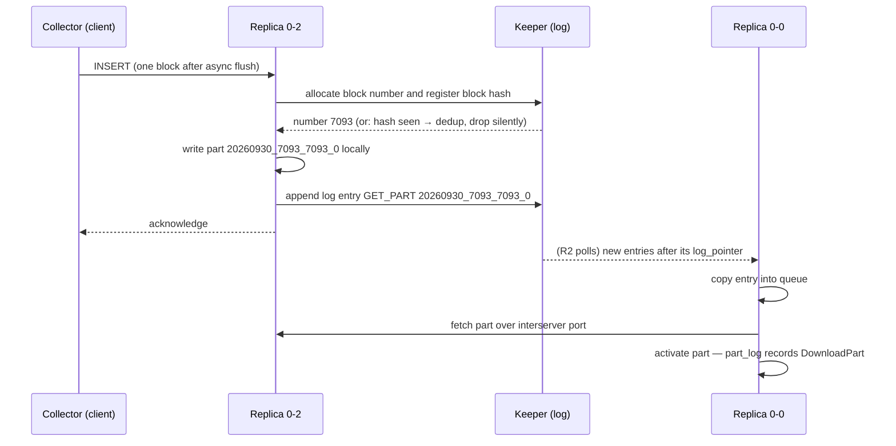

# Replication — what replicas exchange and how they converge

When the collector inserts a batch of spans into one replica, the other two
replicas do not receive rows — they receive an instruction. This chapter
explains the log-and-queue machinery behind ReplicatedMergeTree: what is
actually replicated, how a replica that was offline for two hours catches up,
and why a retried insert usually does not duplicate data.

| Quick facts | |
|---|---|
| **Page type** | Explanation-first learning chapter |
| **Audience** | Practitioner to operator — convergence and its evidence |
| **Prerequisites** | [Parts and merges](04-parts-and-merges.md); the [shared glossary](README.md#shared-glossary) terms part, replica, merge |
| **Deployment status** | Deployed — one shard, three replicas, all `otel` tables on ReplicatedMergeTree |
| **Platform scope** | Database `otel` on cluster `otel` (`chi-clickhouse-otel-0-{0,1,2}`) |
| **Evidence context** | Live Kind cluster `kind-homelab`, 2026-09-30 11:20–11:24 UTC, ClickHouse 26.7.17.7 — read-only lab below; other rows are labelled by evidence class |
| **This page owns** | The replication log/queue mechanism, part exchange, insert deduplication, and convergence after downtime |
| **Not this page** | Keeper consensus and session mechanics — [Keeper](06-keeper.md); the decision to run 1×3 — [ADR-065](../../../proposals/adr/ADR-065-clickhouse-replicated-topology/README.md) |
| **Previous / next** | [Parts and merges](04-parts-and-merges.md) / [Keeper](06-keeper.md) |

## Questions this chapter answers

- Are rows, blocks, or parts replicated between the three replicas?
- What happens when a client retries the same INSERT, or two replicas receive
  the same logical INSERT?
- How does a replica discover and fetch what it missed after two hours
  offline?
- During a merge, does each replica compute the result or fetch it, and what
  keeps the results identical?
- Which `system.replicas` and `system.replication_queue` fields prove a
  replica is converging rather than stuck?

## Mental model

Each replica keeps its own complete copy of every part and does its own local
work. Coordination happens through a shared, ordered **replication log** that
lives in Keeper, not on any replica. Whoever performs an action — accepting an
insert, deciding a merge — appends a log entry describing it. Every replica
consumes the log independently, copies pending entries into its private
**queue**, and executes them at its own pace.

So the unit of replication is the **part**, and the medium is the **log
entry**. An entry says "part `20260930_7093_7093_0` now exists — get it" or
"merge these six parts into that one". Rows travel between replicas only when
a replica downloads a part it does not have. A replica two hours behind is not
broken; it is a consumer with a large unread backlog. (Upstream invariant —
[replication](https://clickhouse.com/docs/reference/engines/table-engines/mergetree-family/replication),
[architecture overview](https://clickhouse.com/docs/concepts/core-concepts/academic-overview).)

The postal analogy: replicas are offices that each keep a full archive and read
a shared bulletin board of "documents published" notices. The analogy stops at
ordering and arithmetic — unlike offices, replicas verify convergence by
checksums, and the board (Keeper) refuses to accept two conflicting notices
for the same block number.

### Essential terms

| Term | Meaning here |
|---|---|
| `replication log` | The shared, ordered list of entries in Keeper describing every insert, merge, and mutation for one table |
| `queue` | A replica's private to-do list: log entries copied locally but not yet executed (`system.replication_queue`) |
| `log_pointer` | The index of the last log entry a replica has copied into its queue; the gap to the log head measures how far behind it is |
| `GET_PART` | Queue entry type: obtain this part — usually by downloading it from a replica that has it |
| `MERGE_PARTS` | Queue entry type: produce this merged part — by merging locally or by fetching the finished result |
| `block hash` | A checksum of an inserted block used to deduplicate retried inserts within a sliding window |

## How it works internally

### Invariants

- Every replica applies the same log; after applying entry *N*, replicas'
  active part sets for entries ≤ *N* are identical by name and checksum.
  Convergence is eventual, not synchronous. (Upstream invariant —
  [academic overview](https://clickhouse.com/docs/concepts/core-concepts/academic-overview).)
- SELECT never waits on replication: reads use only local active parts and do
  not contact Keeper, so a lagging replica serves consistent-but-stale data.
  (Upstream invariant —
  [replication](https://clickhouse.com/docs/reference/engines/table-engines/mergetree-family/replication).)
- Replication does not guarantee that an acknowledged insert is on more than
  one replica at acknowledgement time, unless a quorum setting demands it —
  and none is configured here (Repository fact: no `insert_quorum` anywhere in
  the [CHI](../../../../kubernetes/infra/configs/clickhouse/clickhouseinstallation.yaml)
  or the DDL; the upstream default leaves it off).
- Deduplication protects against *retries of the same block*, not against
  logically duplicate data inserted as different blocks.

### Lifecycle or sequence

An insert into `otel.otel_logs`, from acceptance to three copies (the
platform-context version of this walk, with component names, is the
[RFC-0028 research sequence](../../../proposals/rfc/RFC-0028/research.md#how-a-replicated-insert-travels)):



Step by step, naming what is read, written, and acknowledged:

1. **Block number and hash.** The accepting replica asks Keeper for the next
   block number and registers the block's hash. If the hash already sits in
   the recent-blocks window, the insert is a retry: it is acknowledged as
   successful and written nowhere. This is what makes client retries safe.
   (Upstream —
   [deduplicating inserts on retries](https://clickhouse.com/docs/concepts/features/operations/insert/deduplicating-inserts-on-retries).)
   The window is finite (`replicated_deduplication_window`, a table setting),
   so deduplication is a recency guarantee, not an archive: the same block
   resubmitted much later, or into a different table, inserts again. In the
   26.x series deduplication is on by default for all inserts, including
   asynchronous inserts and materialized-view targets, and hashes the whole
   inserted block (upstream —
   [2026 changelog](https://clickhouse.com/docs/resources/changelogs/oss/2026)).
2. **Local write, then log.** The part is committed locally
   ([chapter 04's](04-parts-and-merges.md) lifecycle), then a log entry
   announces it. The acknowledgement to the client needs neither other
   replica.
3. **Queues drain independently.** Each other replica advances its
   `log_pointer`, copies the entry into its queue, and executes it — for
   `GET_PART`, by downloading the part from a replica that has it, recorded as
   `DownloadPart` in its own `system.part_log`.
4. **Merges are log entries too.** A merge is decided once and announced as a
   `MERGE_PARTS` entry naming exact inputs and the result. Each replica either
   performs the identical deterministic merge locally or fetches the finished
   part from a replica that already has it — a configurable trade of CPU
   against network I/O; checksums registered in Keeper verify both routes
   produce the same part. (Upstream —
   [academic overview](https://clickhouse.com/docs/concepts/core-concepts/academic-overview).)
   Either way, replicas converge on the same part name and content;
   `part_log` tells you which route each replica took (`MergeParts` vs.
   `DownloadPart`).
5. **Mutations** ride the same machinery as `MUTATE_PART` entries — forbidden
   to execute here, but recognizable in queue evidence.

### What to notice

- The client acknowledgement happens before any second copy exists. Durability
  at ack time is one replica's disk — the end-to-end consequence is owned by
  [Ingestion pipeline](08-ingestion-pipeline.md).
- Keeper appears twice with different jobs: allocator/dedup ledger at insert
  time, and log transport afterwards. It never carries row data.

### Catching up after two hours offline

A returning replica reconnects its Keeper session, compares its `log_pointer`
with the log head, and copies every missed entry into its queue — there is no
special "recovery mode" for ordinary downtime, only a longer queue. Draining
it, the replica skips work the log already made redundant: if parts A, B, and
C were later merged into D, fetching D satisfies all four entries' outcome.
Two bounded exceptions:

- **Log truncation.** The log is pruned; a replica offline longer than what
  the log retains clones state from a live replica instead of replaying
  entry-by-entry. (Upstream —
  [academic overview](https://clickhouse.com/docs/concepts/core-concepts/academic-overview):
  new or far-behind nodes copy state directly.)
- **Lost parts.** If a part is gone everywhere (every holder lost it before
  anyone fetched it), the table records the gap and moves on;
  `system.replicas.lost_part_count` is cumulative and persisted in Keeper
  (upstream —
  [`system.replicas`](https://clickhouse.com/docs/reference/system-tables/replicas)).
  A non-zero value is the durable fingerprint of past data loss — the
  [`ClickHouseReplicatedDataLoss` runbook](../../runbooks/clickhouse/ClickHouseReplicatedDataLoss.md)
  owns the response.

## How homelab uses it

| Upstream mechanism | Homelab setting or behavior | Evidence | Class/status |
|---|---|---|---|
| ReplicatedMergeTree per table | All three `otel` tables; engine takes no explicit path arguments — the `Replicated` database supplies them | [`10-otel_logs.sql`](https://github.com/duynhlab/images/blob/main/images/clickhouse-ddl/sql/10-otel_logs.sql), [`00-database.sql`](https://github.com/duynhlab/images/blob/main/images/clickhouse-ddl/sql/00-database.sql) | Repository fact |
| DDL replication (no `ON CLUSTER`) | Database `otel` is `ENGINE = Replicated('/clickhouse/databases/otel','{shard}','{replica}')`; table DDL propagates through the database's own Keeper log, so a replaced replica recreates its tables itself | [`00-database.sql`](https://github.com/duynhlab/images/blob/main/images/clickhouse-ddl/sql/00-database.sql); [Replicated database engine](https://clickhouse.com/docs/engines/database-engines/replicated) | Repository fact |
| Replica identity via macros | `{shard}`/`{replica}` come from operator-supplied macros per StatefulSet pod | [ADR-065 — Decision](../../../proposals/adr/ADR-065-clickhouse-replicated-topology/README.md#decision) | Repository fact |
| Quorum writes | Not configured — acknowledgement is single-replica; the schema job instead gates on `system.replicas` health (`total_replicas`, `active_replicas`, `is_readonly`) at bootstrap | [`job.yaml`](../../../../kubernetes/infra/configs/clickhouse-schema/job.yaml) | Repository fact |
| Interserver part exchange | Three replicas forced onto distinct nodes by required anti-affinity, so a fetch always crosses nodes | [CHI pod template](../../../../kubernetes/infra/configs/clickhouse/clickhouseinstallation.yaml) | Repository fact |
| Lag and readonly alerting | `ClickHouseReplicationLag` (max absolute delay > 300 s) and `ClickHouseReadonlyReplica` watch the two convergence failure axes | [Alert catalog — ClickHouse group](../../alerting/alert-catalog.md); runbooks below | Repository fact |

## Observe it on the live cluster

Read one replica's convergence state, then its queue. Empty queues on a
healthy cluster are the expected observation — that emptiness *is* the
evidence of convergence.

### Prerequisites and safety

- Use the [secure ClickHouse client pattern](../operations.md#secure-client-pattern).
- Both tables below are replica-local: record which replica you queried, and
  ideally repeat on a second replica to see per-replica divergence.
- Run only the read-only queries below.

### Query

```sql
SELECT
    table,
    replica_name,
    is_leader,
    is_readonly,
    total_replicas,
    active_replicas,
    queue_size,
    inserts_in_queue,
    merges_in_queue,
    absolute_delay,
    log_pointer,
    lost_part_count
FROM system.replicas
WHERE database = 'otel'
ORDER BY table
LIMIT 10;
```

```sql
SELECT type, count() AS entries, min(create_time) AS oldest, max(num_tries) AS max_tries
FROM system.replication_queue
WHERE database = 'otel'
GROUP BY type
ORDER BY entries DESC
LIMIT 10;
```

### Observed example

```text
-- system.replicas on chi-clickhouse-otel-0-0-0 (11:24 UTC)
table                    is_leader  is_readonly  total  active  queue_size  absolute_delay  log_pointer  lost_part_count
otel_logs                1          0            3      3       0           0               8716         0
otel_traces              1          0            3      3       0           0               2086         0
otel_traces_trace_id_ts  1          0            3      3       0           0               2047         0

-- system.replication_queue: no rows (queue fully drained)

-- the same row on every replica, 11:24:27 UTC
replica                    table      is_leader  log_pointer  queue  delay
chi-clickhouse-otel-0-0-0  otel_logs  1          8721         0      0
chi-clickhouse-otel-0-1-0  otel_logs  1          8721         0      0
chi-clickhouse-otel-0-2-0  otel_logs  1          8721         0      0

-- system.part_log, otel_logs, last hour, per replica
replica  NewPart  DownloadPart  MergeParts  RemovePart
0-2      798      0             163         974
0-0      0        796           163         973
0-1      0        796           162         973
```

Observation context:

| Field | Value |
|---|---|
| **Observed at** | 2026-09-30 11:20–11:24 UTC |
| **Repository** | `docs/clickhouse-internals-chapters` at `423a1c04` (main merged at `f326a367`) |
| **Cluster/context** | `kind-homelab` — Kind 1.35.8, cluster rebuilt 2026-09-30 ≈02:10 UTC |
| **ClickHouse** | `26.7.17.7` (image tag `clickhouse/clickhouse-server:26.7`); Keeper `v26.7.17.7-stable` |
| **Database/table** | `otel.otel_logs`, `otel.otel_traces`, `otel.otel_traces_trace_id_ts` (`system.replicas`, `system.replication_queue`, `system.part_log`) |
| **Replica** | `chi-clickhouse-otel-0-0-0`; cross-replica rows from all three |

What this evidence adds (2026-09-30):

- **Every replica is a leader.** `is_leader = 1` on all three — current
  releases allow several merge-assigning leaders, so "the leader" is not a
  single node here.
- **Inserts landed on one replica, parts reached all three.** In that hour only
  `chi-clickhouse-otel-0-2-0` wrote new `otel_logs` parts (`NewPart` 798); the
  other two recorded ~796 `DownloadPart` each — the `GET_PART` path above.
- **Merged parts were computed, not fetched.** All three replicas executed
  ~163 `MergeParts`, and no replica downloaded a merged part (`DownloadPart`
  ≈ `NewPart`, i.e. only level-0 parts crossed the wire). Each replica ran the
  same assigned merge locally; fetching the result remains the fallback, not
  what happened in this window.

### How to read the result

| Field or relationship | Interpretation | What it cannot prove |
|---|---|---|
| `total_replicas` = `active_replicas` = 3 | Every registered replica holds a live Keeper session right now | Nothing about yesterday; sessions are ephemeral ([chapter 06](06-keeper.md)) |
| `is_readonly` = 0 | This replica can accept inserts; 1 means its Keeper session is gone and it serves reads only | — |
| `queue_size`, `absolute_delay` ≈ 0 | This replica has consumed the log and executed it — converged | Not that all replicas are converged; each has its own queue |
| `log_pointer` | Position in the shared log this replica has copied up to; compare across replicas for relative lag | Its absolute value means nothing — only gaps do |
| `is_leader` | This replica may assign merges; leadership is an internal role, not a write master — inserts go to any replica | — |
| `lost_part_count` = 0 | No part has ever been abandoned as unrecoverable on this table | It cannot rule out rows lost *before* a part existed (async buffer, collector queue — [chapter 08](08-ingestion-pipeline.md)) |
| Queue rows with high `num_tries` or old `create_time` | An entry is stuck (source replica down, network, disk), not merely pending | — |

### What to notice

- Every number is an **observed example** — queue sizes and delays change per
  second. What must hold on a healthy cluster is the *shape*: readonly 0,
  active = total, near-empty queues.
- If `absolute_delay` is large on exactly one replica while the others are
  current, you are looking at the offline-catch-up story in real time.

## Failure modes and trade-offs

| Trigger | Internal reaction | User-visible symptom | Evidence | Recovery boundary or cost |
|---|---|---|---|---|
| One replica down (pod eviction, node loss) | Its queue accumulates in Keeper; the other two keep accepting inserts and merging | None at the edge; capacity −1/3 | `active_replicas` drops to 2; grows `absolute_delay` on return | Self-healing on restart — the catch-up walk above; cost is a fetch burst |
| Accepting replica dies after ack, before any fetch | The only copy of the newest parts is on its disk; entries wait | Recent rows missing from queries served by other replicas until it returns | `queue_size` > 0 with `GET_PART` stuck; `last_exception` names the source | If its disk never returns, those parts are lost → `lost_part_count`; the no-quorum trade-off accepted by [ADR-065](../../../proposals/adr/ADR-065-clickhouse-replicated-topology/README.md) |
| Keeper session lost on one replica | Table goes read-only on that replica; inserts fail there, reads continue | Insert errors from one backend | `is_readonly` = 1; [`ClickHouseReadonlyReplica`](../../runbooks/clickhouse/ClickHouseReadonlyReplica.md) | Automatic reconnect restores writes ([chapter 06](06-keeper.md) owns the session mechanics) |
| Client retries an insert after a timeout | Same block hash within the dedup window → acknowledged, not re-written | None — this is the mechanism working | Nothing new in `part_log`; dedup is silent | Window-bounded: a very late retry, or a retry whose batch content differs, inserts again — duplicates become possible ([chapter 08](08-ingestion-pipeline.md)) |
| Replica lag exceeds 300 s | Nothing internal changes — lag is a queue length | Stale reads from that replica behind the round-robin Service | [`ClickHouseReplicationLag`](../../runbooks/clickhouse/ClickHouseReplicationLag.md) | Reads stay consistent-but-stale by design; forcing sync waits is a query-level choice not used here |

Through all of these, the log invariant holds: entries are never reordered or
lost while Keeper has quorum. What is temporarily unavailable is freshness
(lag) or write acceptance (readonly) — never read consistency of local parts.

## Misconceptions and challenge questions

### "The insert is safe once ClickHouse acknowledges it"

Acknowledgement here proves one replica committed the part (or deduplicated
the retry). No quorum is configured, so between the ack and the first fetch by
another replica, exactly one disk holds those rows. Losing that disk in the
window loses the rows, and `lost_part_count` will say so forever. The
platform accepts this window deliberately — see the trade-off rows above and
[ADR-065's consequences](../../../proposals/adr/ADR-065-clickhouse-replicated-topology/README.md#consequences).

### Challenge: the double-received batch

The collector times out waiting for an ack from replica 0-0 (which actually
committed the block) and retries the identical batch against replica 0-1.
Predict the outcome — and then predict it again for the case where the retry
happens a week later.

**Model answer:** The retry's block hash is registered in Keeper, shared by
all replicas — 0-1 sees it in the dedup window, acknowledges, writes nothing:
one copy total. A week later the hash has left the
`replicated_deduplication_window`; the same batch inserts again and the rows
are duplicated. Deduplication is per-table, shared via Keeper, and
recency-bounded (see [lifecycle step 1](#lifecycle-or-sequence)).

## Teach-back checklist

Before continuing, explain these without rereading the chapter:

- [ ] What travels between replicas (parts and log entries — not rows), in
      your own words.
- [ ] Where the replication log and the dedup hashes are persisted, and which
      component owns them.
- [ ] The precise fate of a retried insert inside vs. outside the dedup
      window.
- [ ] One `system.replicas` row and the strongest claim it cannot support.
- [ ] The durability window this platform accepts by not configuring quorum
      writes, and what evidence would show it was hit.

## Related documentation

- [Keeper](06-keeper.md) — the coordination service this chapter treats as a
  given
- [Parts and merges](04-parts-and-merges.md) — the local lifecycle each queue
  entry triggers
- [RFC-0028 research — how a replicated insert travels](../../../proposals/rfc/RFC-0028/research.md#how-a-replicated-insert-travels)
- [ADR-065 — ClickHouse replicated topology](../../../proposals/adr/ADR-065-clickhouse-replicated-topology/README.md)
- [ClickHouse operations — replica and Keeper state](../operations.md#health-ladder)

## References

- [Data replication — ReplicatedMergeTree](https://clickhouse.com/docs/reference/engines/table-engines/mergetree-family/replication)
- [Academic overview — data replication](https://clickhouse.com/docs/concepts/core-concepts/academic-overview)
- [Deduplicating inserts on retries](https://clickhouse.com/docs/concepts/features/operations/insert/deduplicating-inserts-on-retries)
- [`system.replicas`](https://clickhouse.com/docs/reference/system-tables/replicas) and [`system.replication_queue`](https://clickhouse.com/docs/reference/system-tables/replication_queue)
- [Replicated database engine](https://clickhouse.com/docs/engines/database-engines/replicated)
- [ClickHouse 2026 OSS changelog — insert deduplication defaults](https://clickhouse.com/docs/resources/changelogs/oss/2026)

---
_Last updated: 2026-10-01 — DDL links point at the duynhlab/images repository. Earlier: 2026-09-30 — live lab verified: every replica a leader, inserts on one replica, level-0 parts fetched, merges computed locally on all three. Earlier: 2026-09-29 — first draft: log/queue mechanism, dedup window,
merge fetch-vs-execute, offline catch-up, and the single-replica durability
window; live lab pending verification._
