# Keeper — why replication needs quorum coordination

Chapter 05 kept saying "Keeper allocates", "Keeper stores", "the log lives in
Keeper" — this chapter opens that box. It explains why replication needs a
separate quorum service at all, what actually lives in the three
`chk-keeper-keeper` pods, and exactly which abilities the cluster loses (and
keeps) when quorum goes away.

| Quick facts | |
|---|---|
| **Page type** | Explanation-first learning chapter |
| **Audience** | Practitioner to operator — coordination and outage reasoning |
| **Prerequisites** | [Replication](05-replication.md); the [shared glossary](README.md#shared-glossary) terms replica, part, Keeper |
| **Deployment status** | Deployed — external 3-member ClickHouseKeeperInstallation `keeper` in `monitoring` |
| **Platform scope** | Coordination for database `otel` and all ReplicatedMergeTree tables; Keeper cluster `keeper` (`chk-keeper-keeper-0-{0,1,2}`) |
| **Evidence context** | Repository facts only — live lab pending verification on the Ubuntu Kind cluster |
| **This page owns** | The quorum mental model, what state Keeper holds, session lifecycle, and outage behavior |
| **Not this page** | What the replication log entries *do* — [Replication](05-replication.md); per-alert recovery — [Keeper runbooks](../../runbooks/clickhouse/README.md) |
| **Previous / next** | [Replication](05-replication.md) / [Sharding and Distributed tables](07-sharding.md) |

## Questions this chapter answers

- Why can three replicas not coordinate among themselves, without a separate
  quorum service?
- Which state lives in Keeper (and which pointedly does not)?
- What is a session, what is an ephemeral node, and how does losing a session
  turn a replica read-only?
- With 3 Keeper members, exactly how many can fail before writes stop — and
  what still works afterwards?
- Which read-only commands prove quorum health from outside ClickHouse?

## Mental model

Replication needs a small set of facts that every replica must agree on with
no ambiguity: the next block number, the order of log entries, which replicas
are alive, who assigns merges. Letting the three data replicas vote among
themselves fails in the interesting cases — a network split leaves two groups
each believing they may allocate block 458. The standard fix is to move
agreement into a dedicated service that uses a consensus algorithm: a write is
accepted only when a **majority (quorum)** of its members have durably logged
it, and a majority can exist on only one side of any split.

ClickHouse Keeper is that service — a from-scratch, wire-compatible
replacement for ZooKeeper using the Raft consensus algorithm (upstream
invariant —
[ClickHouse Keeper guide](https://clickhouse.com/docs/guides/oss/deployment-and-scaling/keeper)).
It stores a small filesystem-like tree of **znodes** (named nodes holding a few
bytes each) and gives ClickHouse three primitives: totally ordered writes,
unique sequential numbers, and liveness detection through sessions. Keeper is
a notary's ledger, not a warehouse: it records *that* part
`20260929_457_457_0` exists and *who* must fetch it, never the part's bytes.
The analogy stops at scale — a notary is one person, while Keeper is itself a
replicated system whose availability is governed by quorum arithmetic.

### Essential terms

| Term | Meaning here |
|---|---|
| `quorum` | The majority of Keeper members (2 of 3 here) that must durably log a write before it is acknowledged |
| `znode` | One named node in Keeper's tree, holding small metadata bytes and/or children |
| `session` | A client's authenticated, heartbeat-maintained connection context; Keeper state can be tied to a session's lifetime |
| `ephemeral node` | A znode that Keeper deletes automatically when its owning session ends — the liveness primitive |
| `leader` | The Raft member that orders writes for the current term; followers replicate its log and can serve reads |

## How it works internally

### Invariants

- A write acknowledged by Keeper is durably logged on a majority and will
  survive any minority failure. (Upstream invariant — Raft, per the
  [Keeper guide](https://clickhouse.com/docs/guides/oss/deployment-and-scaling/keeper).)
- Without a quorum, Keeper accepts no writes at all — there is no "best
  effort" mode; recovery from a lost majority is a deliberate manual
  reconfiguration, never automatic. (Upstream invariant — same source.)
- An ephemeral node exists if and only if its owning session is alive; a
  replica's registration under `.../replicas/.../is_active` disappearing is
  definitive evidence its session ended.
- Keeper guarantees ordering and liveness — it does not guarantee your data:
  table rows never pass through it, so Keeper backups alone cannot restore a
  table.

### What lives in the tree

For this deployment, two families of paths (Repository fact for the roots —
[`00-database.sql`](../../../../images/clickhouse-ddl/sql/00-database.sql);
upstream for their contents —
[replication](https://clickhouse.com/docs/reference/engines/table-engines/mergetree-family/replication),
[Replicated database](https://clickhouse.com/docs/engines/database-engines/replicated)):

| Path family | Contents | Lifetime |
|---|---|---|
| `/clickhouse/databases/otel/...` | The `Replicated` database's DDL log and per-replica pointers — how `CREATE TABLE` reached all three replicas with no `ON CLUSTER` | Persistent |
| per-table paths (UUID-based for tables in a `Replicated` database) | Table metadata and columns hash; the replication **log**; per-replica **queues** and `log_pointer`s; block-hash dedup window; merge assignments; checksums | Persistent |
| `.../replicas/<replica>/is_active` | Registration of a live replica | **Ephemeral** — vanishes with the session |

Everything [chapter 05](05-replication.md) called "shared" resolves to znodes
here: the log is a sequence of numbered children, block numbers come from
Keeper's sequential-node counter, and `active_replicas` in `system.replicas`
is a count of live ephemeral registrations.

### Lifecycle or sequence

A replica's relationship with Keeper is a session state machine:

```mermaid
stateDiagram-v2
    [*] --> Connected : session established, is_active created
    Connected --> Connected : heartbeats within timeout
    Connected --> Expired : heartbeats missed / Keeper unreachable / quorum lost
    Expired --> ReadOnly : ephemeral nodes deleted; table refuses INSERTs
    ReadOnly --> Recovering : connectivity returns, new session
    Recovering --> Connected : state re-checked against Keeper, queue resumes
```



1. **Connect.** At startup each replica opens a session to the ensemble
   (`keeper-svc:2181` here) and creates its ephemeral `is_active` node.
2. **Work.** Every replication action from chapter 05 — allocate, append,
   advance a pointer — is a Keeper write, acknowledged only after a quorum of
   members logs it.
3. **Expire.** If heartbeats stop (replica dead, network partition, or Keeper
   itself has no quorum), the session times out. Keeper deletes the ephemeral
   node; the other replicas can now observe this one as gone.
4. **Read-only transition.** A replica that cannot maintain its session must
   assume any coordination it performs may conflict, so its replicated tables
   switch to read-only: INSERTs fail fast, SELECTs continue from local parts.
   The same happens at startup when Keeper is unreachable. (Upstream —
   [recovery after failures](https://clickhouse.com/docs/reference/engines/table-engines/mergetree-family/replication).)
5. **Reconnect.** The server retries in the background; on a new session it
   verifies its local state against Keeper (parts set, queue position) and
   resumes as the returning-replica walk in
   [chapter 05](05-replication.md#catching-up-after-two-hours-offline).
   No operator action is required for an ordinary session blip.

### What to notice

- Read-only is a *protective* state entered by the data replica, not an error
  pushed by Keeper. Keeper being briefly unreachable and a replica being
  read-only are one event seen from two sides.
- Recovery is re-verification, not replay from scratch — a reconnecting
  replica keeps all local parts and only reconciles metadata.

### Quorum arithmetic and outage behavior

With 3 members, quorum is 2: the ensemble tolerates exactly one member down.
Losing two halts all Keeper writes — and with them, everything on the
coordination path:

| Capability during full quorum loss | Available? | Why |
|---|---|---|
| SELECT on all replicas | Yes | Reads never touch Keeper (chapter 05 invariant) |
| INSERT into replicated tables | No | Block allocation and log append are Keeper writes; tables go read-only |
| Background merges of replicated tables | No | Merge assignment is a log entry |
| Already-queued local work, TTL drops on non-replicated data | Yes (bounded) | Local-only actions need no coordination |
| DDL in database `otel` | No | The `Replicated` database's DDL log is in Keeper |

So a Keeper outage degrades this platform to a frozen-but-queryable state:
telemetry ingestion stops (the collector's retry/queue behavior —
[chapter 08](08-ingestion-pipeline.md) — decides what is lost), while Grafana
keeps reading existing data. (Inference — from the invariants above and the
deployed topology; not failure-injected on this cluster, per the
[audit's scope](../audits/2026-09-10-kind.md#scope-and-safety).)

## How homelab uses it

| Upstream mechanism | Homelab setting or behavior | Evidence | Class/status |
|---|---|---|---|
| Standalone Keeper ensemble | CHK `keeper`: 3 members, one per node, `clickhouse/clickhouse-keeper:26.7`, 2Gi PVC each — external to the database pods so a database restart never destabilizes quorum | [`clickhousekeeperinstallation.yaml`](../../../../kubernetes/infra/configs/clickhouse-keeper/clickhousekeeperinstallation.yaml) | Repository fact |
| Client / Raft / metrics ports | `keeper-svc` exposes 2181 (ZooKeeper-compatible client), 9444 (Raft), 7000 (Prometheus) | same manifest | Repository fact |
| Four-letter-word admin commands | Whitelist narrowed to `ruok,mntr,srvr,stat,conf` (upstream default allows more) | same manifest; [Keeper guide — 4lw](https://clickhouse.com/docs/guides/oss/deployment-and-scaling/keeper) | Repository fact |
| CHI→CHK by-name reference | The CHI names `keeper`; the operator resolves endpoints **once** and fails open — an empty `<zookeeper>` section reconciles "successfully" if Keeper pods are absent. The Flux wave `clickhouse-local` dependsOn `clickhouse-keeper-local` exists precisely to prevent that ordering | [CHI keeper comment](../../../../kubernetes/infra/configs/clickhouse/clickhouseinstallation.yaml) | Repository fact |
| Quorum health alerting | `ClickHouseKeeperNoLeader` (critical), `ClickHouseKeeperQuorumDegraded`, `ClickHouseKeeperSessionLost`, `ClickHouseZooKeeperExceptions` | [Keeper runbooks](../../runbooks/clickhouse/README.md) | Repository fact |
| Bootstrap gate on session health | The schema job refuses to run DDL while any replica reports `is_readonly != 0` or missing active replicas | [`job.yaml`](../../../../kubernetes/infra/configs/clickhouse-schema/job.yaml) | Repository fact |

Why external and why three: one Keeper member per node means the loss of any
single node costs at most one database replica *and* one Keeper member — both
survivable. Two members would be strictly worse than one (quorum 2 of 2
tolerates zero failures); the reasoning is owned by
[ADR-065](../../../proposals/adr/ADR-065-clickhouse-replicated-topology/README.md#decision)
and the manifest header.

## Observe it on the live cluster

Two views of the same health: what a database replica knows about its session,
and what the tree for database `otel` looks like.

### Prerequisites and safety

- Use the [secure ClickHouse client pattern](../operations.md#secure-client-pattern).
- `system.zookeeper` requires a `path` predicate and is served by Keeper —
  keep it bounded as written.
- Record which database replica you queried; connection state is per replica.
- Run only the read-only commands below.

### Query

```sql
SELECT name, host, port, index, connected_time, is_expired, keeper_api_version
FROM system.zookeeper_connection
ORDER BY name
LIMIT 10;
```

```sql
SELECT name, czxid, mzxid, numChildren
FROM system.zookeeper
WHERE path = '/clickhouse/databases/otel'
ORDER BY name
LIMIT 20;
```

Quorum state from Keeper itself (read-only four-letter commands, run via
`kubectl exec` against one keeper pod; `mntr` reports role and synced
followers, `ruok` only proves the process is up — it does **not** prove the
member joined quorum):

```bash
kubectl exec -n monitoring chk-keeper-keeper-0-0-0 -- \
  sh -c 'echo mntr | nc -w 2 127.0.0.1 2181' | grep -E 'zk_server_state|zk_synced_followers|zk_znode_count'
```

### Observed example

```text
PENDING VERIFICATION — capture on the Ubuntu Kind cluster; see the verification worksheet in the pull request.
```

Observation context:

| Field | Value |
|---|---|
| **Observed at** | _pending_ |
| **Repository** | _pending_ |
| **Cluster/context** | _pending_ |
| **ClickHouse** | _pending_ |
| **Database/table** | _pending_ |
| **Replica** | _pending_ |

### How to read the result

| Field or relationship | Interpretation | What it cannot prove |
|---|---|---|
| `zookeeper_connection.is_expired` = 0 | This replica holds a live session at observation time | Nothing about the other two replicas' sessions |
| `host`/`index` | Which ensemble member this replica is talking to; members are interchangeable for clients | — |
| Children under `/clickhouse/databases/otel` | The `Replicated` database's coordination state (DDL log, replica pointers) exists and is populated | Child names are engine internals — their exact set varies by version and is an observed example, not an interface |
| `mzxid` | Last transaction that modified a znode — global, totally ordered write IDs, Raft's ordering made visible | — |
| `mntr: zk_server_state` | `leader` on exactly one member, `follower` on the rest = healthy Raft | A healthy snapshot says nothing about flapping; the alerts watch that |
| `mntr: zk_synced_followers` = 2 (on the leader) | Full ensemble in sync — the strongest single quorum-health signal | — |
| `ruok` → `imok` | Process alive and listening | **Not** quorum membership — use `stat`/`mntr` for that ([Keeper guide](https://clickhouse.com/docs/guides/oss/deployment-and-scaling/keeper)) |

### What to notice

- The znode tree you see is the physical form of every abstraction in
  chapter 05 — find the log and the per-replica pointers among the children.
- All counts and IDs are **observed examples**; `zk_znode_count` in particular
  grows and shrinks with the dedup window and log cleanup.

## Failure modes and trade-offs

| Trigger | Internal reaction | User-visible symptom | Evidence | Recovery boundary or cost |
|---|---|---|---|---|
| One Keeper member down | Raft continues on 2/3; if the leader died, a re-election pause of seconds | Usually none; brief insert latency blip during election | `mntr` role changes; [`ClickHouseKeeperQuorumDegraded`](../../runbooks/clickhouse/ClickHouseKeeperQuorumDegraded.md) | Zero remaining failure budget — restore the member before anything else fails |
| Two members down (quorum lost) | Keeper stops accepting writes; sessions expire; every replicated table on every replica goes read-only | All ingestion stops; dashboards still serve existing data | `mntr` shows no leader; [`ClickHouseKeeperNoLeader`](../../runbooks/clickhouse/ClickHouseKeeperNoLeader.md); `is_readonly` = 1 everywhere | Restore members to recover automatically; forcing a single-node quorum rebuild is a last-resort manual act (upstream — [recovering after losing quorum](https://clickhouse.com/docs/guides/oss/deployment-and-scaling/keeper)) and is out of bounds here |
| One replica's session blips (network, GC pause) | Ephemeral node deleted; that replica read-only until reconnect; others unaffected | Insert failures from one backend for seconds | [`ClickHouseKeeperSessionLost`](../../runbooks/clickhouse/ClickHouseKeeperSessionLost.md); `is_expired` = 1 momentarily | Self-healing; repeated blips point at node pressure, not Keeper |
| Keeper disk full / slow fsync | Write latency rises; sessions time out cluster-wide in the worst case | Widespread readonly flapping with all pods "Running" | Keeper Prometheus metrics on :7000; `system.errors` `KEEPER_EXCEPTION` | Keeper's 2Gi PVC is small by design — its dataset is metadata; monitor it, never co-locate it with data volumes |
| CHI applied while Keeper absent | Operator renders empty `<zookeeper>` and reports success; replicas start uncoordinated | Replicated tables cannot initialize | CHI comment (fail-open); Flux `dependsOn` prevents it | Ordering is the defense — this is why the Keeper wave gates the database wave |

During any Keeper outage the data invariants of chapters 03–05 all hold: no
part is corrupted, no committed row disappears, reads stay consistent. The
guarantee that is unavailable is *progress* — nothing new may be agreed.

## Misconceptions and challenge questions

### "Keeper is where ClickHouse stores replicated data, so its 2Gi disk must grow with the tables"

Keeper stores coordination metadata only: logs, pointers, hashes, checksums,
registrations — bytes per part, not the part. Table data lives on each
replica's 10Gi data volume and the RustFS cold tier
([chapter 10](10-storage-s3.md)). Keeper's footprint scales with *activity*
(log length, dedup window, part count), not with stored terabytes. That is
also why backing up Keeper alone restores nothing a user cares about.

### Challenge: the two-way split

A network fault isolates node A (holding Keeper member 1 + database replica
0-0) from nodes B and C (members 2 and 3 + replicas 0-1, 0-2). Predict insert
behavior on both sides, and what happens when the fault heals.

**Model answer:** B+C retain quorum (2 of 3): their replicas keep full
service. A's member cannot reach a majority, so replica 0-0's session
expires → read-only; SELECTs on 0-0 keep answering from local (increasingly
stale) parts. On heal, member 1 rejoins Raft as a follower and catches up;
0-0 opens a new session, leaves read-only, and drains its queue per
[chapter 05](05-replication.md#catching-up-after-two-hours-offline). No manual
step, no split-brain — block numbers were only ever allocated on the majority
side (see [quorum arithmetic](#quorum-arithmetic-and-outage-behavior)).

## Teach-back checklist

Before continuing, explain these without rereading the chapter:

- [ ] Why replicas cannot self-coordinate through a split, and how majority
      quorum resolves it — in your own words.
- [ ] Which state lives in Keeper, which does not, and which single znode type
      encodes liveness.
- [ ] The full path from missed heartbeats to a read-only table and back.
- [ ] One line of `mntr` output and the health claim it cannot make.
- [ ] The failure budget of a 3-member ensemble and what exactly stops when it
      is exceeded.

## Related documentation

- [Replication](05-replication.md) — the consumer of everything Keeper stores
- [Keeper runbooks index](../../runbooks/clickhouse/README.md) — per-alert
  response procedures
- [ADR-065 — ClickHouse replicated topology](../../../proposals/adr/ADR-065-clickhouse-replicated-topology/README.md) —
  why an external 3-member ensemble
- [ClickHouse operations — health ladder](../operations.md#health-ladder)
- [Failure reasoning](11-failure-recovery.md) — Keeper's place in the
  diagnosis order

## References

- [ClickHouse Keeper guide](https://clickhouse.com/docs/guides/oss/deployment-and-scaling/keeper) — Raft, 4lw commands, quorum recovery
- [Data replication — recovery after failures](https://clickhouse.com/docs/reference/engines/table-engines/mergetree-family/replication)
- [Replicated database engine](https://clickhouse.com/docs/engines/database-engines/replicated)
- [`system.zookeeper`](https://clickhouse.com/docs/reference/system-tables/zookeeper) and [`system.zookeeper_connection`](https://clickhouse.com/docs/reference/system-tables/zookeeper_connection)

---
_Last updated: 2026-09-29 — first draft: quorum mental model, znode inventory,
session→read-only lifecycle, outage capability matrix, and the deployed
3-member CHK; live lab pending verification._
