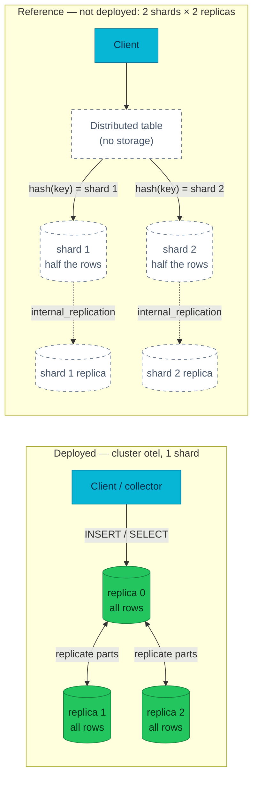

# Sharding and Distributed tables — what one shard means here

Every row in `otel.otel_logs` exists three times on this cluster, yet the
cluster can never hold more data than one node's disk. That asymmetry — full
copies, no horizontal split — is the difference between replication and
sharding, and confusing the two is the fastest way to scale the wrong axis.

| Quick facts | |
|---|---|
| **Page type** | Explanation-first learning chapter |
| **Audience** | Practitioner — read after the replication and Keeper chapters |
| **Prerequisites** | [Replication](05-replication.md), [Keeper](06-keeper.md) |
| **Deployment status** | Deployed: one shard × three replicas. Everything multi-shard on this page is **Reference — not deployed** |
| **Platform scope** | Cluster `otel` in the `clickhouse` installation; `system.clusters` |
| **Evidence context** | Repository facts only — live lab pending verification on the Ubuntu Kind cluster |
| **This page owns** | How replication, sharding, distributed reads, and distributed INSERTs differ |
| **Not this page** | Replica convergence ([Replication](05-replication.md)); coordination ([Keeper](06-keeper.md)); when to scale which axis ([Scaling decisions](12-scaling.md)) |
| **Previous / next** | [Keeper](06-keeper.md) / [Ingestion pipeline](08-ingestion-pipeline.md) |

## Questions this chapter answers

- What does a `system.clusters` row prove about where a table's data lives?
- Where does a Distributed INSERT store data first, and what can be lost there?
- Which failures does a replica absorb, and which failures would a shard turn
  into missing data?
- Why does this deployment have no `Distributed` table at all?

## Mental model

Replication and sharding both mean "more servers", but they answer opposite
questions. **Replication** gives every server the *same* data, so any one
server can vanish and nothing is lost — it buys availability and read
capacity, never storage capacity. **Sharding** gives every server a
*different* slice of the data, so the dataset can outgrow one machine — it
buys capacity and pays for it with a new failure mode: lose a shard's last
replica and that slice is gone.

A **Distributed table** is the router that makes shards usable. It stores no
rows itself. On read it fans the query out, one replica per shard, and merges
the partial results. On write it splits the batch by a **sharding key** and
forwards each slice to the shard that owns it.

This platform runs one shard with three replicas ([Repository fact —
`shardsCount: 1`, `replicasCount: 3` in the
CHI](../../../../kubernetes/infra/configs/clickhouse/clickhouseinstallation.yaml)),
so there is nothing to route: every replica holds everything, and no
`Distributed` table exists in the
[committed DDL](../../../../images/clickhouse-ddl/sql/10-otel_logs.sql).

### Essential terms

| Term | Meaning here |
|---|---|
| `shard` | A horizontal subset of a table's data; see the [shared glossary](README.md#shared-glossary) |
| `Distributed table` | A storage-less table engine that routes reads and writes to the local tables on each shard |
| `sharding key` | The expression a Distributed INSERT hashes to pick the owning shard |
| `internal_replication` | Cluster flag: when true, a Distributed INSERT writes one replica per shard and lets `ReplicatedMergeTree` copy the rest |
| `fan-out` | Sending one query to one replica of every shard and merging the partial results |

## How it works internally

### Invariants

- A Distributed table never owns rows. Dropping it loses routing, not data
  ([Upstream invariant — Distributed engine](https://clickhouse.com/docs/engines/table-engines/special/distributed)).
- Replication multiplies copies of the same rows; sharding partitions rows.
  The two compose: a production cluster is usually *N* shards × *M* replicas.
- A distributed read touches exactly one replica per shard. A shard whose
  replicas are all unreachable makes the whole query fail or return partial
  data, depending on settings — the failure boundary moves from "a server"
  to "a slice of the dataset".
- Nothing rebalances automatically. Adding a shard changes where *new* rows
  hash to; existing parts stay where they were written ([Reference — not
  deployed; RFC-0028 owns the trigger analysis](../../../proposals/rfc/RFC-0028/research.md#what-replication-and-sharding-are)).

### Lifecycle or sequence

**Distributed read** (Reference — not deployed): the server that receives the
query — the *initiator* — rewrites it against the local table name, sends it
to one healthy replica per shard, streams back partial states (for example,
partial aggregates), merges them, and returns the final result. Only the merge
runs on the initiator; filtering and aggregation run shard-side.

**Distributed INSERT** (Reference — not deployed): the initiator hashes the
sharding key of each row, groups rows per shard, and — by default — writes
each group to a queue directory on its own disk, acknowledging the client
before the data reaches any shard. A background thread then ships the queued
files. `SYSTEM FLUSH DISTRIBUTED` forces the shipment, and the
`distributed_foreground_insert` setting makes the whole INSERT synchronous:
the client is only acknowledged after every shard has the data ([Upstream
invariant — distributed
settings](https://clickhouse.com/docs/reference/settings/session-settings/distributed)).

**Where replication joins in**: with `internal_replication = true` in the
cluster definition, the Distributed INSERT writes to *one* replica per shard
and the shard's `ReplicatedMergeTree` tables copy the part to the others —
the mechanism [chapter 05](05-replication.md) explains. With it false, the
Distributed table writes every replica itself, and part-level deduplication
no longer protects against divergence ([Upstream invariant — scaling
example](https://clickhouse.com/docs/guides/oss/deployment-and-scaling/examples/1-shard-2-replicas)).

### The four operations side by side

| | What is copied or split | Who does the work | Failure boundary | What it buys |
|---|---|---|---|---|
| **Replication** (deployed) | Whole parts, copied to every replica of the shard | `ReplicatedMergeTree` + Keeper ([05](05-replication.md), [06](06-keeper.md)) | One replica — others keep serving | Availability, read capacity |
| **Sharding** (reference — not deployed) | Rows, split by sharding key across shards | Table layout + Distributed INSERT routing | One shard — its slice of data | Storage and write capacity |
| **Distributed read** (reference — not deployed) | The query, fanned to one replica per shard | Initiator + shard-local executors | Any shard with zero healthy replicas | One SQL endpoint over split data |
| **Distributed INSERT** (reference — not deployed) | The batch, split and queued per shard | Initiator's background sender (or foreground with `distributed_foreground_insert`) | The initiator's queue directory until shipped | Writers need not know the layout |



### What to notice

- In the deployed shape, the client talks to a replica directly and every
  replica is interchangeable; in the reference shape, only the Distributed
  table knows which shard owns a row.
- The diagram does **not** imply the reference shape is a planned upgrade —
  it is drawn to make the deployed shape's simplicity visible. No accepted
  record proposes shards ([ADR-065 lists sharding as a
  non-goal](../../../proposals/adr/ADR-065-clickhouse-replicated-topology/README.md)).

## How homelab uses it

| Upstream mechanism | Homelab setting or behavior | Evidence | Class/status |
|---|---|---|---|
| Cluster topology | `shardsCount: 1`, `replicasCount: 3` for cluster `otel` | [CHI manifest](../../../../kubernetes/infra/configs/clickhouse/clickhouseinstallation.yaml) | Repository fact |
| Distributed table engine | Absent — no DDL file creates one | [Committed DDL directory](../../../../images/clickhouse-ddl/sql/00-database.sql) | Repository fact |
| Sharding decision | Deliberately not built; re-evaluation triggers documented | [ADR-065 non-goals](../../../proposals/adr/ADR-065-clickhouse-replicated-topology/README.md); [RFC-0028 trigger analysis](../../../proposals/rfc/RFC-0028/research.md#integration-paths) | Repository fact |
| `optimize_skip_unused_shards` | Not applicable without a Distributed table | [Session settings](https://clickhouse.com/docs/reference/settings/session-settings/optimize-skip) | Reference — not deployed |
| DDL fan-out across replicas | Owned by the `Replicated` database engine, not `ON CLUSTER` | [Database DDL](../../../../images/clickhouse-ddl/sql/00-database.sql) | Repository fact |

The one-shard choice is why this platform's write path
([chapter 08](08-ingestion-pipeline.md)) has no routing step and why every
read is complete on whichever replica answers it. The conditions under which
that stops being enough belong to [Scaling decisions](12-scaling.md).

## Observe it on the live cluster

### Prerequisites and safety

- Use the [secure ClickHouse client pattern](../operations.md#secure-client-pattern).
- Confirm the current kubeconfig context and the replica you will query.
- Run only the read-only command shown below.

### Query

The schema bootstrap Job notes that `system.clusters` can report duplicate
rows per host on this operator version, so the query deduplicates:

```sql
SELECT DISTINCT
    cluster,
    shard_num,
    replica_num,
    host_name,
    is_local
FROM system.clusters
WHERE cluster = 'otel'
ORDER BY shard_num, replica_num
LIMIT 10;
```

### Observed example

```text
PENDING VERIFICATION — capture on the Ubuntu Kind cluster; see the verification worksheet in the pull request.
```

Observation context:

| Field | Value |
|---|---|
| **Observed at** | _pending_ |
| **Repository** | _pending_ |
| **Cluster/context** | _pending_ |
| **ClickHouse** | _pending_ |
| **Database/table** | _pending_ |
| **Replica** | _pending_ |

### How to read the result

| Field or relationship | Interpretation | What it cannot prove |
|---|---|---|
| `shard_num` all equal to 1 | Every host belongs to the same shard: full copies, no split | Not that the copies are in sync at observation time — that is `system.replicas` ([05](05-replication.md)) |
| `replica_num` 1..3 | Three replicas are *declared* in the cluster map | Not that all three pods are up or reachable right now |
| `is_local = 1` on one row | Which member answered your query | Nothing about which replica ingest traffic lands on |
| Three distinct `host_name` values | The operator generated one entry per StatefulSet pod | Not that anti-affinity actually placed them on distinct nodes — that is a `kubectl get pod -o wide` check |

### What to notice

- `system.clusters` describes the *map*, not the *territory*: it is
  configuration the server was handed, refreshed by the operator, and it
  stays the same while a replica is down.
- The absence of any second `shard_num` is the whole sharding story of this
  platform in one column.

## Failure modes and trade-offs

| Trigger | Internal reaction | User-visible symptom | Evidence | Recovery boundary or cost |
|---|---|---|---|---|
| One replica lost (deployed) | Remaining replicas keep serving; returning replica catches up via the replication queue | Briefly reduced read capacity; no data loss | `system.replicas.active_replicas` | Bounded by replication catch-up ([05](05-replication.md)) |
| All replicas of one shard lost (reference — not deployed) | Distributed reads fail or silently skip the shard, depending on settings | Missing rows or failed queries for that slice | Shard-local `system.replicas` | Restore from the shard's own backup; other shards cannot help |
| Initiator dies with a queued distributed INSERT (reference — not deployed) | Queue files on the initiator's disk are not shipped until it returns | Acknowledged data invisible on shards | Distributed queue directory metrics | Data survives on the initiator's disk but is unavailable; foreground insert trades this for latency |
| Skewed sharding key (reference — not deployed) | One shard receives most rows and merges | Hot shard: slow inserts and queries there | Per-shard part and size counts | Re-sharding requires rewriting data; keys are hard to change later |

During a replica failure the deployed invariant — every surviving replica
holds the complete dataset — still holds. The guarantee sharding would
surrender is exactly that one: completeness of any single node.

## Misconceptions and challenge questions

### “Adding a replica increases how much data the cluster can hold”

It does not. A replica is a full copy, so three replicas store the dataset
three times and the capacity ceiling stays one node's disk. Only sharding —
splitting rows across shards — raises the ceiling, at the price of a new
failure boundary and routing layer. Capacity pressure on this platform is
handled first by TTL and the cold tier ([Tiered storage](10-storage-s3.md)).

### Challenge: telemetry volume grows tenfold

The `otel_logs` table starts missing its 90-day retention target on 10Gi
volumes. Is the next step a second shard?

**Model answer:** Not first. The deployed levers — shorter hot-tier TTL,
more cold-tier offload, bigger PVCs, vertical resources — all avoid a routing
layer and a second failure domain. A shard becomes the answer only when a
single node can no longer hold even the hot slice or sustain the write rate;
the concrete trigger conditions are owned by
[RFC-0028](../../../proposals/rfc/RFC-0028/research.md#integration-paths) and
weighed in [Scaling decisions](12-scaling.md).

## Teach-back checklist

Before continuing, explain these without rereading the chapter:

- [ ] Replication vs sharding in one sentence each, naming what each one buys.
- [ ] Where a background Distributed INSERT's data lives between client ack
      and shard delivery, and who owns that directory.
- [ ] What happens to a distributed read when one shard has no healthy
      replica, and why the deployed topology cannot have that failure.
- [ ] What a `system.clusters` row proves and what it cannot prove.
- [ ] The cost sharding adds that three replicas do not have.

## Related documentation

- [Replication](05-replication.md) — how parts converge inside the one shard
- [Keeper](06-keeper.md) — the coordination sharding would also depend on
- [Scaling decisions](12-scaling.md) — when to pull which axis
- [RFC-0028 research](../../../proposals/rfc/RFC-0028/research.md) — replication vs sharding analysis and re-evaluation triggers
- [ADR-065](../../../proposals/adr/ADR-065-clickhouse-replicated-topology/README.md) — the accepted one-shard, three-replica decision

## References

- [Distributed table engine](https://clickhouse.com/docs/engines/table-engines/special/distributed)
- [Distributed session settings, including `distributed_foreground_insert`](https://clickhouse.com/docs/reference/settings/session-settings/distributed)
- [`optimize_skip_unused_shards` settings](https://clickhouse.com/docs/reference/settings/session-settings/optimize-skip)
- [Scaling example: one shard, two replicas, `internal_replication`](https://clickhouse.com/docs/guides/oss/deployment-and-scaling/examples/1-shard-2-replicas)
- [`SYSTEM` statements for managing distributed tables](https://clickhouse.com/docs/sql-reference/statements/system)

---
_Last updated: 2026-09-29 — first published version; live observation pending
verification on the Ubuntu Kind cluster._
