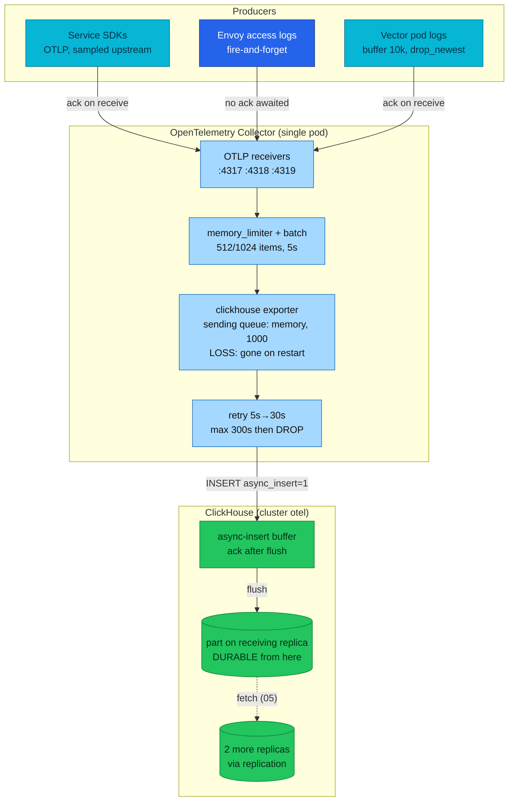

# Ingestion pipeline — delivery guarantees from producer to durable part

A log line you read in Grafana crossed at least five buffers to get into
`otel.otel_logs`, and each buffer answers "what if this restarts right now?"
differently. This chapter walks the deployed path hop by hop and names the
exact points where telemetry can be lost, duplicated, or delayed.

| Quick facts | |
|---|---|
| **Page type** | Explanation-first learning chapter |
| **Audience** | Practitioner and operator — read after the parts and replication chapters |
| **Prerequisites** | [Parts and merges](04-parts-and-merges.md), [Replication](05-replication.md), [Keeper](06-keeper.md) |
| **Deployment status** | Deployed (OTLP → Collector → ClickHouse); the Kafka comparison is **Reference — not deployed** |
| **Platform scope** | Producers → OpenTelemetry Collector → `otel.otel_logs` and `otel.otel_traces` |
| **Evidence context** | Live Kind cluster `kind-homelab`, 2026-09-30 11:20–11:23 UTC, ClickHouse 26.7.17.7 — read-only lab below; other rows are labelled by evidence class |
| **This page owns** | The delivery-guarantee analysis: acknowledgement and durability boundary at every hop |
| **Not this page** | Collector deployment and pipeline inventory ([Collector](../../opentelemetry/collector.md)); how a flushed insert becomes parts ([04](04-parts-and-merges.md)); replica convergence ([05](05-replication.md)) |
| **Previous / next** | [Sharding and Distributed tables](07-sharding.md) / [Materialized views](09-materialized-views.md) |

## Questions this chapter answers

- At which hop is a log line first *durable* — safe across any single restart?
- What exactly is lost when the Collector pod restarts, and how much can that be?
- When can the same span appear twice in `otel_traces`, and why does
  deduplication not always prevent it?
- Which requirement would justify putting Kafka in front of this path?

## Mental model

Think of the pipeline as a chain of hand-offs. Every hop holds data in a
buffer and follows an **acknowledgement policy**: either it confirms receipt
*before* the data is safe (fast, lossy) or *after* (slow, safe). The
guarantee of the whole chain is its weakest hop — one fire-and-forget link
makes the end-to-end promise fire-and-forget, no matter how careful the rest
is.

This platform's chain is deliberately availability-biased: when a buffer
fills or a downstream stalls, hops **drop** telemetry rather than block the
services producing it. Telemetry loss is a degraded dashboard; blocked
services are an outage. Durability begins only where
[chapter 04](04-parts-and-merges.md) begins: a part written to a replica's
disk, then copied by replication.

### Essential terms

| Term | Meaning here |
|---|---|
| `acknowledgement (ack) boundary` | The point where a sender is told "received" — everything before it is the sender's problem, everything after is the receiver's |
| `durability boundary` | The first point where data survives a process restart |
| `at-most-once` | A hop that may drop but never duplicates (fire-and-forget) |
| `at-least-once` | A hop that may duplicate but never silently drops (retry until ack) |
| `sending queue` | The Collector exporter's in-memory buffer of pending requests |
| `async insert` | Server-side batching: ClickHouse buffers small inserts and flushes them as one block ([04](04-parts-and-merges.md)) |

## How it works internally

### Invariants

- No hop in this chain offers replay after acknowledgement: once a producer,
  Vector, or the Collector has handed data off and dropped its copy, only the
  next hop has it. There is no durable log to rewind (contrast the Kafka
  section below).
- The Collector's sending queue is memory-only unless a file-storage
  extension is configured; the exporter's own documentation states queued
  batches survive a crash only with `sending_queue.storage` set
  ([Upstream invariant — ClickHouse exporter README](https://github.com/open-telemetry/opentelemetry-collector-contrib/blob/main/exporter/clickhouseexporter/README.md)). This deployment sets no storage extension ([Repository fact — collector manifest](../../../../kubernetes/infra/controllers/tracing/otel-collector/otel-collector.yaml)).
- With `wait_for_async_insert = 1` — the server default — ClickHouse
  acknowledges an async insert only after the buffer holding it is flushed to
  a part ([Upstream invariant — async inserts](https://clickhouse.com/docs/concepts/features/operations/insert/asyncinserts)).
  The exporter's `async_insert: true` changes *batching*, not the ack policy.
- Retry after a lost ack is indistinguishable from retry after a lost insert,
  so any at-least-once hop can create duplicates downstream of it.

### Lifecycle or sequence

The hops, in delivery order. "Loss window" names what vanishes if that hop
dies at that moment.

| # | Hop | Buffer and ack policy | Loss window | Class |
|---|---|---|---|---|
| 1 | Service SDK → Collector (OTLP gRPC/HTTP) | SDK batch processor; ack from Collector receiver | Spans/logs batched in a crashing service pod; anything the SDK sampler dropped never enters | Repository fact (SDK config lives in service repos) |
| 2 | Envoy access logs → Collector (OTLP :4317) | Proxy-internal buffer, fire-and-forget | Access-log records in a restarting proxy | Repository fact — [EnvoyProxy manifest](../../../../kubernetes/infra/configs/envoy-gateway/envoyproxy.yaml), [ADR-060](../../../proposals/adr/ADR-060-envoy-access-log-transport/README.md) |
| 3 | Vector pod logs → Collector (OTLP HTTP :4319) | Memory buffer, 10 000 events, `when_full: drop_newest` | Buffered events on Vector restart; newest events during a Collector stall | Repository fact — [Vector manifest](../../../../kubernetes/infra/controllers/logging/vector/vector.yaml) |
| 4 | Collector receiver → processors | `memory_limiter` (800 MiB limit) refuses data when tripped, pushing the error back to the sender; `batch` holds up to 5 s / 1024 items | One in-flight batch per pipeline on crash | Repository fact — collector manifest |
| 5 | ClickHouse exporter sending queue | In-memory, 1000 requests, 4 consumers; accepts from the pipeline immediately | **Up to 1000 queued requests on Collector restart** | Repository fact — collector manifest |
| 6 | Retry loop toward ClickHouse | 5 s → 30 s backoff, `max_elapsed_time: 300s`, then the batch is **permanently dropped** | Any batch that cannot be delivered within 5 minutes | Repository fact — collector manifest; retry semantics per [exporter README](https://github.com/open-telemetry/opentelemetry-collector-contrib/blob/main/exporter/clickhouseexporter/README.md) |
| 7 | Native INSERT with `SETTINGS async_insert=1` | ClickHouse server buffer; ack after flush (default `wait_for_async_insert=1`) | Nothing after ack; before ack, the insert fails visibly and hop 6 retries | Upstream invariant — [async inserts](https://clickhouse.com/docs/concepts/features/operations/insert/asyncinserts) |
| 8 | Flush → immutable part on the receiving replica | First durability boundary | — | Upstream invariant ([04](04-parts-and-merges.md)) |
| 9 | Replication to the other two replicas | Keeper log + fetch ([05](05-replication.md)) | A window where only one replica holds the part | Repository fact — 3-replica CHI |



### What to notice

- Every node left of the part is a volatile buffer; the first database-grade
  durability is the part itself. The whole Collector, including its queue and
  retry state, lives in one pod's memory.
- The diagram does **not** imply that an acked OTLP request is safe: the
  Collector acks producers at the receiver (hop 4), *before* the sending
  queue and retry loop that can still drop the data.

### Logs and traces do not take the same road

The Collector fans out per signal ([Repository fact — pipelines in the
collector manifest](../../../../kubernetes/infra/controllers/tracing/otel-collector/otel-collector.yaml);
inventory owned by [the Collector page](../../opentelemetry/collector.md#the-deployed-pipelines)):

- **Traces** go to ClickHouse *and* VictoriaTraces *and* the span-metrics
  connector. Each exporter has its own queue and retry: ClickHouse can lose a
  batch VictoriaTraces kept, and vice versa — the stores may disagree.
- **Logs** split into two pipelines from one receiver: `logs` (VictoriaLogs,
  with edge access logs filtered out per
  [ADR-061](../../../proposals/adr/ADR-061-edge-log-routing/README.md)) and
  `logs/clickhouse` (everything). Edge access logs therefore exist *only* in
  ClickHouse.
- **Vector's leg** (`:4319`) feeds only ClickHouse, so pod-stdout logs reach
  `otel_logs` once even though Vector also ships them to VictoriaLogs itself.
- Sampling happens *before* this chain: the edge samples a share of traces
  and services use parent-based samplers, owned by
  [the tracing architecture page](../../tracing/architecture.md). What the
  sampler drops never appears in any hop below it.

### Duplicates: the price of hop 6

If ClickHouse flushes an insert but the ack is lost (timeout at 10 s, network
blip), the exporter retries a batch that is already stored.
`ReplicatedMergeTree` deduplicates *identical* inserted blocks by checksum
([05](05-replication.md)), but under async insert the server coalesces
concurrent inserts into shared buffer flushes, so the retried batch does not
necessarily reproduce the original block byte-for-byte — the checksum
differs, and the rows land twice (Inference: from the block-dedup mechanism
plus the async-insert flush model; the limit is that the exact dedup outcome
depends on buffer timing, which only a live incident would show). Queries on
`otel_traces` must therefore tolerate occasional duplicate spans.

### Kafka — Reference, not deployed

No Kafka broker, topic, or table engine exists anywhere in this repository's
manifests (Repository fact — the deployed path is OTLP direct to the
Collector). What a Kafka hop would change, per the
[Kafka table engine documentation](https://clickhouse.com/docs/integrations/connectors/data-ingestion/kafka/kafka-table-engine):

- **A durable, replayable buffer.** Consumer offsets mean a bad deploy or a
  ClickHouse outage longer than 300 s no longer drops data — the consumer
  resumes where it stopped. This directly removes loss windows 5 and 6.
- **Multiple independent consumers.** A second system could re-read the same
  telemetry stream without touching ClickHouse.
- **Still at-least-once.** The Kafka engine itself delivers at-least-once;
  duplicates on rebalance or reconnect remain possible, so the duplicate
  tolerance above is not bought back.

The cost is a broker quorum to operate, one more schema boundary to keep
compatible, and consumer lag as a new failure mode. The requirement that
would justify it here is concrete: *needing replay* (outages longer than the
retry budget with zero telemetry loss) or *a second consumer* of the raw
stream. Today's platform accepts the 5-minute retry budget instead.

## How homelab uses it

| Upstream mechanism | Homelab setting or behavior | Evidence | Class/status |
|---|---|---|---|
| Exporter batching input | External `batch` processor: 512 target / 1024 max / 5 s | [Collector manifest](../../../../kubernetes/infra/controllers/tracing/otel-collector/otel-collector.yaml) | Repository fact |
| Exporter queue | `sending_queue`: enabled, 1000, 4 consumers, no storage extension | Collector manifest | Repository fact |
| Retry budget | 5 s → 30 s, `max_elapsed_time: 300s` | Collector manifest | Repository fact |
| Server-side batching | `async_insert: true` on the exporter; DDL and schema owned by the bootstrap Job, `create_schema: false` | Collector manifest; [ADR-065](../../../proposals/adr/ADR-065-clickhouse-replicated-topology/README.md) | Repository fact |
| Producer buffers | Vector memory buffer 10 000 / `drop_newest`; Envoy OTLP access-log sink | [Vector manifest](../../../../kubernetes/infra/controllers/logging/vector/vector.yaml); [EnvoyProxy manifest](../../../../kubernetes/infra/configs/envoy-gateway/envoyproxy.yaml) | Repository fact |
| Durable buffer (Kafka) | Absent | No manifest declares it | Reference — not deployed |

The batch shape matters to [chapter 04](04-parts-and-merges.md): each flush
of the async-insert buffer becomes at least one part, so the Collector's
batching directly controls this platform's part-creation rate and merge
pressure.

## Observe it on the live cluster

### Prerequisites and safety

- Use the [secure ClickHouse client pattern](../operations.md#secure-client-pattern).
- Confirm the current kubeconfig context and the replica you will query.
  `system.asynchronous_insert_log` is replica-local: it records flushes on
  the replica that received the inserts.
- Run only the read-only command shown below.

### Query

```sql
SELECT
    table,
    status,
    count() AS buffer_entries,
    sum(bytes) AS bytes_buffered,
    max(flush_time) AS last_flush
FROM system.asynchronous_insert_log
WHERE database = 'otel'
  AND event_time > now() - INTERVAL 15 MINUTE
GROUP BY table, status
ORDER BY table, status
LIMIT 20;
```

### Observed example

```text
-- the chapter query on chi-clickhouse-otel-0-0-0 (11:20 UTC, last 15 min)
table        status  buffer_entries  bytes_buffered  last_flush
otel_traces  Ok      48              108566          2026-09-30 11:20:16

-- follow-up: who received INSERTs in the last 15 min (11:22 UTC)
replica                    table        inserts_15m  rows    async_insert_log
chi-clickhouse-otel-0-0-0  otel_traces  46           140     46 × Ok
chi-clickhouse-otel-0-1-0  —            0            0       —
chi-clickhouse-otel-0-2-0  otel_logs    200          91580   200 × Ok

-- server settings seen by the collector's user (system.settings)
async_insert = 1   wait_for_async_insert = 1   async_insert_busy_timeout_ms = 200
async_insert_deduplicate = 0   insert_deduplicate = 1
```

Observation context:

| Field | Value |
|---|---|
| **Observed at** | 2026-09-30 11:20–11:23 UTC |
| **Repository** | `docs/clickhouse-internals-chapters` at `423a1c04` (main merged at `f326a367`) |
| **Cluster/context** | `kind-homelab` — Kind 1.35.8, cluster rebuilt 2026-09-30 ≈02:10 UTC |
| **ClickHouse** | `26.7.17.7` (image tag `clickhouse/clickhouse-server:26.7`); Keeper `v26.7.17.7-stable` |
| **Database/table** | `system.asynchronous_insert_log`, `system.query_log` (database `otel`) |
| **Replica** | `chi-clickhouse-otel-0-0-0`; follow-up on all three replicas |

What the live run changed in this chapter's picture (2026-09-30):

- **Each signal was pinned to one replica.** The ClickHouse exporter keeps
  long-lived native connections, and the Service balances *connections*, not
  queries — so for this window every logs INSERT went to
  `chi-clickhouse-otel-0-2-0`, every traces INSERT to `-0-0-0`, and `-0-1-0`
  received none. The "both signals on this replica" row below therefore depends
  on which replica you ask; run the query on all three before reading absence
  as a stall. The other replicas still hold every part — they fetch them
  ([replication](05-replication.md)).
- **`wait_for_async_insert = 1` is the live default**, so the collector's
  acknowledgement arrives only after the buffer is flushed into a part — the
  durability boundary this chapter draws at hop 7 holds as observed. The value
  is the server default (`changed = 0`), not an exporter override.

### How to read the result

| Field or relationship | Interpretation | What it cannot prove |
|---|---|---|
| Rows exist at all | The exporter's `async_insert=1` is reaching the server: inserts pass through the async buffer | Nothing about VictoriaLogs/VictoriaTraces legs of the fan-out |
| `status = 'Ok'` | Those buffer entries were flushed into a part and acknowledged | Not that *every* producer batch arrived — drops at hops 1–6 leave no trace here |
| `buffer_entries` vs part count in the window ([04](04-parts-and-merges.md)) | Several exporter inserts coalesce into fewer flushes — server-side batching working | The exact coalescing ratio is timing-dependent; an observed example, never a constant |
| `last_flush` recent for both `otel_logs` and `otel_traces` | Both signals are flowing on this replica at observation time | Not that this replica receives *all* traffic — the Service load-balances across replicas |

If the query fails because the table does not exist, no async insert has been
logged on this replica since the log table's last recreation — check another
replica before concluding ingest is broken. The collector's own health is
read from its self-telemetry (`otelcol_*` series, exporter queue size and
failed sends), owned by [the Collector page](../../opentelemetry/collector.md#operations).

### What to notice

- The log shows the *server's* half of the hand-off. A quiet
  `asynchronous_insert_log` with healthy producers means the loss is upstream
  — exactly the diagnosis order [chapter 11](11-failure-recovery.md) builds.
- Counts and byte totals here are observed examples tied to the 15-minute
  window, not platform constants.

## Failure modes and trade-offs

| Trigger | Internal reaction | User-visible symptom | Evidence | Recovery boundary or cost |
|---|---|---|---|---|
| Collector pod restarts | Sending queue (≤1000 requests) and in-flight batches vanish | A gap of minutes in logs and traces; no error anywhere in ClickHouse | `otelcol_exporter_queue_size` drops to 0; gap in `otel_logs` timestamps | Accepted loss; a storage extension or Kafka would be needed to remove it |
| ClickHouse unreachable > 300 s | Retry budget exhausted; batches permanently dropped, exporter keeps accepting | Telemetry gap exactly matching the outage minus 5 minutes | `otelcol_exporter_send_failed_*` counters | Loss bounded by outage length; replication cannot help — data never arrived |
| Producer burst into Vector | Buffer full → newest events dropped silently | Missing pod logs during the burst | Vector's own component metrics | `drop_newest` chosen so Vector never blocks or OOMs |
| ClickHouse slow (merge pressure, [04](04-parts-and-merges.md)) | Insert latency rises; queue fills; `memory_limiter` pushes errors back to producers | Delayed dashboards, then SDK-side drops | Queue size and limiter refusals in `otelcol_*` | Backpressure protects the Collector at the producers' expense |
| Ack lost after successful flush | Exporter retries an already-stored batch | Duplicate rows in `otel_logs`/`otel_traces` | Duplicate `SpanId` for one `TraceId` | Queries tolerate duplicates; dedup is not guaranteed under async insert |

During any of these, the invariant that survives is: **data acknowledged by
ClickHouse is durable** (part on disk, then replicated). The guarantee that
is temporarily unavailable is completeness — the stores hold what got
through, with no marker for what did not.

## Misconceptions and challenge questions

### “`async_insert: true` on the exporter means fire-and-forget into ClickHouse”

No. The flag makes the exporter add `SETTINGS async_insert=1` to its INSERT,
which moves *batching* into the server. The acknowledgement policy is
controlled by `wait_for_async_insert`, whose default of 1 means the server
answers only after the buffer flushes to a part
([async inserts](https://clickhouse.com/docs/concepts/features/operations/insert/asyncinserts)).
The exporter therefore still gets a real success or a real error to retry on
— the lossy hops are the Collector's own memory queue and retry budget, not
the insert.

### Challenge: the Collector pod is OOM-killed at 14:00:00 exactly

ClickHouse was healthy the whole time. Which data is lost, which is safe, and
which producers notice?

**Model answer:** Lost: everything in the sending queue (up to 1000 pending
requests), plus batches sitting in the `batch` processor (≤5 s worth per
pipeline). Safe: every insert ClickHouse already acknowledged — parts exist
and replicate regardless of the Collector's fate. Producers: SDKs and Vector
see connection errors and retry briefly (Vector's buffer absorbs ~10 000
events, then drops newest); Envoy's access-log sink does not wait and loses
its in-flight records silently. Nothing rewinds: the gap is permanent because
no hop before ClickHouse keeps a replayable copy.

## Teach-back checklist

Before continuing, explain these without rereading the chapter:

- [ ] The chain of hops in order, naming each buffer and its ack policy.
- [ ] Where the durability boundary sits, what is persisted there, and which
      component owns everything before it.
- [ ] What is lost in a Collector restart vs a 10-minute ClickHouse outage,
      and why the two differ.
- [ ] One field of the async-insert-log result and the limit of what it
      proves about end-to-end delivery.
- [ ] The trade-off this pipeline makes (drop over block) and the concrete
      requirement that would justify adding Kafka.

## Related documentation

- [OpenTelemetry Collector](../../opentelemetry/collector.md) — deployed pipelines, processors, and operations
- [Vector](../../logging/vector.md) — the pod-log leg into `:4319`
- [Parts and merges](04-parts-and-merges.md) — what happens after the flush
- [Replication](05-replication.md) — how the part reaches the other replicas
- [Failure reasoning](11-failure-recovery.md) — diagnosing which hop failed

## References

- [ClickHouse exporter README (OpenTelemetry Collector contrib)](https://github.com/open-telemetry/opentelemetry-collector-contrib/blob/main/exporter/clickhouseexporter/README.md)
- [Asynchronous inserts](https://clickhouse.com/docs/concepts/features/operations/insert/asyncinserts)
- [Kafka table engine](https://clickhouse.com/docs/reference/engines/table-engines/integrations/kafka)
- [Kafka table engine integration guide (delivery semantics, consumer groups)](https://clickhouse.com/docs/integrations/connectors/data-ingestion/kafka/kafka-table-engine)

---
_Last updated: 2026-09-30 — live lab verified: `wait_for_async_insert = 1`; logs and traces each pinned to one replica by long-lived exporter connections. Earlier: 2026-09-29 — first published version; live observation pending
verification on the Ubuntu Kind cluster._
