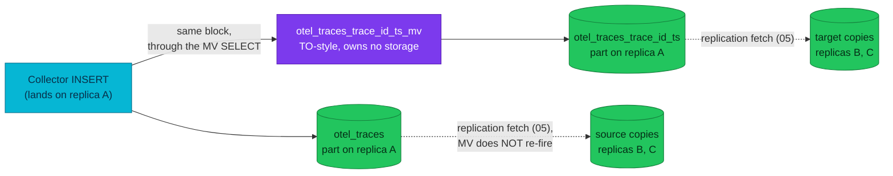

# Materialized views — when the trace-ID view runs and what it sees

Looking up a trace by ID in Grafana is fast because every insert into
`otel.otel_traces` pays a small tax at write time: a materialized view copies
`(TraceId, Start, End)` into a lookup table. Understanding *when* that view
runs — and, more importantly, what data it can and cannot see — is what
separates it from a stored query or a Postgres index.

| Quick facts | |
|---|---|
| **Page type** | Explanation-first learning chapter |
| **Audience** | Practitioner — read after the parts and ingestion chapters |
| **Prerequisites** | [MergeTree layout](03-mergetree.md), [Parts and merges](04-parts-and-merges.md), [Ingestion pipeline](08-ingestion-pipeline.md) |
| **Deployment status** | Deployed: `otel.otel_traces_trace_id_ts_mv`; refreshable views are **Reference — not deployed** |
| **Platform scope** | `otel.otel_traces` → MV → `otel.otel_traces_trace_id_ts` |
| **Evidence context** | Live Kind cluster `kind-homelab`, 2026-09-30 11:20 UTC, ClickHouse 26.7.17.7 — read-only lab below; other rows are labelled by evidence class |
| **This page owns** | When an incremental materialized view runs and what data it sees |
| **Not this page** | The deployed view's operational description and lookup query pattern ([Materialized views platform page](../materialized-views.md)); part lifecycle of the target table ([04](04-parts-and-merges.md)) |
| **Previous / next** | [Ingestion pipeline](08-ingestion-pipeline.md) / [Tiered storage](10-storage-s3.md) |

## Questions this chapter answers

- What event causes the view's SELECT to execute, and over which rows?
- Why can the target table hold several rows for one `TraceId`, and why is
  that still correct for lookups?
- What happens to the client's INSERT when the view's query throws?
- Which replicas run the view, and how does its output reach the others?

## Mental model

An incremental materialized view is an **insert trigger**, not a stored
result. Creating one changes nothing about existing data and computes nothing
on a schedule. From that moment on, every block of rows inserted into the
*source* table is also fed through the view's SELECT, and the SELECT's output
is inserted into a *target* table. Reading "the view" means reading the
target table — an ordinary table that accumulated those per-insert outputs
([Upstream invariant — incremental materialized
views](https://clickhouse.com/docs/concepts/features/materialized-views/incremental-materialized-view)).

Two contrasts sharpen the model:

- **Not a Postgres index.** An index is maintained inside the same
  transaction as the write and is always exactly consistent with its table.
  The view's target is a separate table, written by a separate insert, with
  observable in-between states.
- **Not a stored query.** A regular ClickHouse `VIEW` re-runs its SELECT over
  the whole source at read time. The materialized view never reads the whole
  source — after creation it sees *only* what is being inserted, and
  pre-existing rows are invisible to it forever unless backfilled by hand.

### Essential terms

| Term | Meaning here |
|---|---|
| `source table` | The table whose inserts fire the view — `otel.otel_traces` |
| `target table` | The ordinary table the view writes into — `otel.otel_traces_trace_id_ts` (the `TO` clause) |
| `insert block` | The batch of rows one insert delivers; the unit the view's SELECT runs over (see the [shared glossary](README.md#shared-glossary)) |
| `backfill` | A manual `INSERT INTO target SELECT ... FROM source` to cover rows that predate the view |

## How it works internally

### Invariants

- The view fires only on inserts into its source table, and its SELECT reads
  only the freshly inserted block — never the rest of the table
  ([Upstream invariant](https://clickhouse.com/docs/concepts/features/materialized-views/incremental-materialized-view)).
- Transformations such as `GROUP BY` apply *within each block* independently
  ([Upstream invariant — CREATE VIEW](https://clickhouse.com/docs/reference/statements/create/view)).
  Cross-block aggregation, if needed, is the target table engine's job — or
  the reader's.
- The source write and the view's target write are not atomic: a concurrent
  reader can see the source updated before the target, or the reverse
  ([Upstream invariant — knowledge base on MV
  atomicity](https://clickhouse.com/docs/resources/support-center/knowledge-base/materialized-views/are-materialized-views-inserted-asynchronously)).
- By default an exception inside any dependent view propagates and fails the
  parent INSERT; `materialized_views_ignore_errors` (default off) downgrades
  that to a logged warning ([Upstream invariant — settings
  reference](https://clickhouse.com/docs/reference/settings/session-settings/materialized-views)).
- Multiple views on one source run sequentially in UUID order unless
  `parallel_view_processing` is enabled ([Upstream
  invariant](https://clickhouse.com/docs/concepts/features/materialized-views/incremental-materialized-view)).
  This platform has one view, so ordering does not arise.

### Lifecycle or sequence

For one Collector insert into `otel_traces` (the write path of
[chapter 08](08-ingestion-pipeline.md)):

1. The insert arrives on whichever replica the Service routed it to and — via
   the async-insert flush — becomes one or more blocks.
2. Each block is written to `otel_traces` as a part, **and** handed to the
   view. The view runs `SELECT TraceId, min(Timestamp) AS Start,
   max(Timestamp) AS End ... GROUP BY TraceId` over *that block only*,
   dropping empty trace IDs (`WHERE TraceId != ''`).
3. The declared `DateTime64(9)` output is cast to the target's `DateTime`
   columns on insert — a deliberate, reproduced-from-as-built asymmetry
   ([Repository fact — MV DDL](https://github.com/duynhlab/images/blob/main/images/clickhouse-ddl/sql/40-otel_traces_trace_id_ts_mv.sql)).
4. The result rows are inserted into `otel_traces_trace_id_ts` **on the same
   replica**, forming a part in the target table.
5. Both new parts — source and target — replicate to the other two replicas
   through the ordinary `ReplicatedMergeTree` mechanism
   ([05](05-replication.md)). The view itself plays no role in replication:
   a replica that *fetches* a source part never re-fires the view, which is
   exactly why the target must be a replicated table too.



### What to notice

- Only replica A — the one that executed the INSERT — runs the view. The
  other replicas receive *finished parts* for both tables and never see the
  block.
- The diagram does not imply the two dotted fetches are coordinated: source
  and target replicate independently, so a reader on replica B can briefly
  see a span in `otel_traces` whose trace ID is not yet in the lookup table.

### Why several rows per trace ID is correct

A trace's spans arrive over seconds and across many Collector batches, so
they land in many blocks. Each block's `GROUP BY TraceId` produces one
`(TraceId, Start, End)` row covering *that block's* spans — the target
accumulates one row per (trace, block) pair, each holding a partial time
range. That is still correct for the lookup's purpose: the reader asks "in
which time range must I scan `otel_traces` for this ID?", takes
`min(Start)`/`max(End)` across the rows (or lets the primary key
`(TraceId, Start)` narrow the scan), and background merges of the target may
collapse rows without being required to. The lookup query pattern itself is
owned by [the platform page](../materialized-views.md#3-lookup-then-explain-both-tables).

## How homelab uses it

| Upstream mechanism | Homelab setting or behavior | Evidence | Class/status |
|---|---|---|---|
| `TO`-style view (no inner storage) | Required here: keeps the view legal inside the `Replicated` database `otel` | [MV DDL](https://github.com/duynhlab/images/blob/main/images/clickhouse-ddl/sql/40-otel_traces_trace_id_ts_mv.sql) | Repository fact |
| Per-block trigger | Fires on every async-insert flush of `otel_traces`, on the receiving replica | MV DDL; [Collector exporter config](../../../../kubernetes/infra/controllers/tracing/otel-collector/otel-collector.yaml) | Repository fact |
| Target table lifecycle | `ReplicatedMergeTree`, `ORDER BY (TraceId, Start)`, bloom-filter index, delete-only TTL at 90 days, **default storage policy — no cold tier** | [Target DDL](https://github.com/duynhlab/images/blob/main/images/clickhouse-ddl/sql/30-otel_traces_trace_id_ts.sql) | Repository fact |
| Creation order dependency | The view must be created after both tables; a missing view silently loses trace-ID lookups | [Schema bootstrap Job](../../../../kubernetes/infra/configs/clickhouse-schema/job.yaml); MV DDL header | Repository fact |
| Refreshable materialized views | Absent — no `REFRESH EVERY` view exists | [Refreshable views](https://clickhouse.com/docs/concepts/features/materialized-views/refreshable-materialized-view) | Reference — not deployed |

The target's storage divergence is worth pausing on: unlike `otel_logs` and
`otel_traces`, the lookup table never moves to RustFS — it is small, hot, and
delete-only at 90 days, so tiering it would buy nothing
([Tiered storage](10-storage-s3.md) owns that reasoning).

## Observe it on the live cluster

### Prerequisites and safety

- Use the [secure ClickHouse client pattern](../operations.md#secure-client-pattern).
- Confirm the current kubeconfig context and the replica you will query.
  `system.query_views_log` is replica-local: it records view executions on
  the replica that ran the INSERT, so an idle replica may legitimately have
  few or no rows.
- Run only the read-only command shown below.

### Query

```sql
SELECT
    event_time,
    view_name,
    view_type,
    status,
    read_rows,
    written_rows,
    exception
FROM system.query_views_log
WHERE view_name = 'otel.otel_traces_trace_id_ts_mv'
  AND event_time > now() - INTERVAL 1 HOUR
ORDER BY event_time DESC
LIMIT 10;
```

### Observed example

```text
event_time           view_name                        view_type     status       read_rows  written_rows
2026-09-30 11:20:16  otel.otel_traces_trace_id_ts_mv  Materialized  QueryFinish  0          0
2026-09-30 11:20:16  otel.otel_traces_trace_id_ts_mv  Materialized  QueryFinish  1          1
2026-09-30 11:20:11  otel.otel_traces_trace_id_ts_mv  Materialized  QueryFinish  0          0
2026-09-30 11:20:11  otel.otel_traces_trace_id_ts_mv  Materialized  QueryFinish  1          1
2026-09-30 11:19:01  otel.otel_traces_trace_id_ts_mv  Materialized  QueryFinish  2          2
… (10 rows shown; exception empty on every row)
```

Observation context:

| Field | Value |
|---|---|
| **Observed at** | 2026-09-30 11:20 UTC |
| **Repository** | `docs/clickhouse-internals-chapters` at `423a1c04` (main merged at `f326a367`) |
| **Cluster/context** | `kind-homelab` — Kind 1.35.8, cluster rebuilt 2026-09-30 ≈02:10 UTC |
| **ClickHouse** | `26.7.17.7` (image tag `clickhouse/clickhouse-server:26.7`); Keeper `v26.7.17.7-stable` |
| **Database/table** | `system.query_views_log` (view `otel.otel_traces_trace_id_ts_mv`) |
| **Replica** | `chi-clickhouse-otel-0-0-0` |

Two things the live run shows that the prose does not predict:

- **At this traffic, `written_rows` equals `read_rows`.** Each block on
  this replica carried one or two spans per trace (it was the traces inserter
  in that window — see [chapter 08](08-ingestion-pipeline.md)), so the
  per-block `GROUP BY TraceId` had nothing to collapse. The `≪` relationship below
  appears only under load with many spans per trace in one block.
- **Executions come in pairs with the same timestamp, one of them empty.**
  Recorded as a knowledge gap for the owner interview rather than explained
  here; the view's own definition filters `TraceId != ''`, which is one
  candidate, not a verified cause.

### How to read the result

| Field or relationship | Interpretation | What it cannot prove |
|---|---|---|
| One row per execution | The view ran once per insert block on this replica — the per-block model made visible | Nothing about blocks inserted on the *other* replicas |
| `read_rows` | Spans in the triggering block that the view's SELECT scanned | Not the block's total size — `WHERE TraceId != ''` filters before counting is settled by the plan |
| `written_rows` ≪ `read_rows` | The per-block `GROUP BY TraceId` collapsed many spans into few range rows | Not that one trace equals one target row — the same trace may appear in other executions |
| `status = 'QueryFinish'`, empty `exception` | The view completed; the parent INSERT was not failed by it | A past failure window — this query only covers one hour |

If the table does not exist, the engine has not created it yet: this
platform's `query_views_log` is born on first use after the log-table
configuration, so an absent table on a fresh replica means "no view has
executed here since then", not "the view is broken" ([Repository fact —
system-log configuration in the
CHI](../../../../kubernetes/infra/configs/clickhouse/clickhouseinstallation.yaml)).
Confirm the view exists via `system.tables` before drawing any conclusion.

### What to notice

- Executions cluster at the async-insert flush cadence, not at the producer
  span rate — the view's tempo is [chapter 08](08-ingestion-pipeline.md)'s
  batching made visible.
- `read_rows` and `written_rows` are observed examples tied to traffic at
  capture time, never platform constants.

## Failure modes and trade-offs

| Trigger | Internal reaction | User-visible symptom | Evidence | Recovery boundary or cost |
|---|---|---|---|---|
| View query throws during an insert | Error propagates; the parent INSERT fails (default `materialized_views_ignore_errors = 0`); already-written source data is not rolled back | Collector sees insert errors and retries — possible duplicates in the source ([08](08-ingestion-pipeline.md)) | `exception` in `system.query_views_log`; failed INSERTs in `system.query_log` | Not atomic: source and target can diverge around the failure |
| View accidentally dropped or never created | Inserts into `otel_traces` succeed normally; the target stops growing | Trace-ID lookups silently degrade to full scans — no error anywhere | Target table's newest `Start` goes stale | Recreate the view (schema Job re-run); the gap needs manual backfill |
| View created (or recreated) while data exists | No backfill happens: pre-existing spans are invisible to the view forever | Lookups miss traces from before the (re)creation | Compare min timestamps of source and target | Manual `INSERT INTO target SELECT ...` on an isolated lab only — writes are forbidden on the shared cluster |
| Target replica lag | Target parts replicate independently of source parts | A lookup on a lagging replica misses a trace already visible in `otel_traces` | `system.replication_queue` for the target ([05](05-replication.md)) | Converges with replication; readers must tolerate the window |
| Insert amplification | Every source insert also writes target parts | More parts, more merge work for a tiny table | Part counts per table ([04](04-parts-and-merges.md)) | The accepted cost of write-time indexing |

During every failure above, one invariant holds: the view never corrupts data
it already wrote — parts are immutable. The guarantee that is unavailable is
*completeness of the target*: nothing reconciles it against the source
automatically.

## Misconceptions and challenge questions

### “The materialized view recomputes from the whole table, so the target has exactly one row per trace”

Both halves are wrong. The view never reads the whole table — only each
freshly inserted block — and `GROUP BY` runs within that block alone
([CREATE VIEW](https://clickhouse.com/docs/reference/statements/create/view)).
A trace whose spans span multiple blocks therefore owns multiple target rows,
each a partial `(Start, End)` range, and that remains correct because readers
aggregate or range-scan rather than expecting uniqueness.

### Challenge: replica C was offline for two hours of heavy tracing

It comes back and catches up ([05](05-replication.md)). Does replica C's copy
of the view now re-process the fetched `otel_traces` parts into its lookup
table?

**Model answer:** No. The view fires only on *inserts executed on that
replica*, and catch-up is part *fetching*, not insertion. Replica C fetches
the missed source parts **and** the missed target parts as two independent
replication streams — the lookup table converges because it is itself
replicated, not because the view re-runs. This is precisely why a `TO` target
inside this topology must be a `ReplicatedMergeTree` table.

## Teach-back checklist

Before continuing, explain these without rereading the chapter:

- [ ] The trigger model in your own words — what event runs the SELECT and
      over which rows.
- [ ] What is persisted where: the view definition, the target parts, and
      which replica writes them.
- [ ] The predicted outcome of a view exception during a Collector insert,
      including what the Collector does next.
- [ ] One `query_views_log` row and the limit of what its `written_rows`
      proves.
- [ ] The trade-off of write-time indexing versus a read-time scan, and when
      a refreshable view would fit better.

## Related documentation

- [Materialized views platform page](../materialized-views.md) — the deployed view's operational description and lookup pattern
- [Ingestion pipeline](08-ingestion-pipeline.md) — the inserts that fire the view
- [Parts and merges](04-parts-and-merges.md) — what the target's parts do next
- [Replication](05-replication.md) — how both tables' parts converge
- [Tiered storage](10-storage-s3.md) — why the target skips the cold tier

## References

- [Incremental materialized views](https://clickhouse.com/docs/concepts/features/materialized-views/incremental-materialized-view)
- [CREATE VIEW — per-block SELECT behavior](https://clickhouse.com/docs/reference/statements/create/view)
- [Are materialized-view inserts atomic? (knowledge base)](https://clickhouse.com/docs/resources/support-center/knowledge-base/materialized-views/are-materialized-views-inserted-asynchronously)
- [`materialized_views_ignore_errors` setting](https://clickhouse.com/docs/reference/settings/session-settings/materialized-views)
- [Refreshable materialized views](https://clickhouse.com/docs/concepts/features/materialized-views/refreshable-materialized-view)

---
_Last updated: 2026-10-01 — DDL links point at the duynhlab/images repository. Earlier: 2026-09-30 — live lab verified: per-block executions; at low traffic written = read, paired executions left as a knowledge gap. Earlier: 2026-09-29 — first published version; live observation pending
verification on the Ubuntu Kind cluster._
