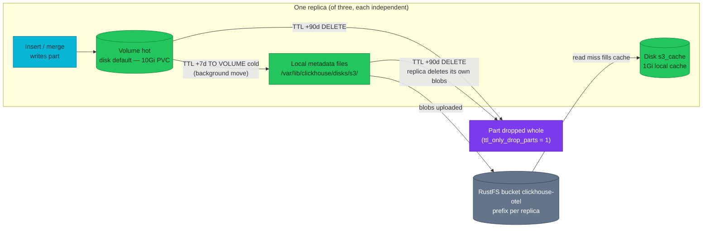

# Tiered storage — where bytes live across hot, cold, cache, and retention

A log row written today sits on a replica's local PVC; the same row read back in
three weeks is fetched from RustFS through a local cache, and at ninety days the
part that holds it is dropped whole. This chapter explains who moves those
bytes, where each copy lives, and which layer owns deletion.

| Quick facts | |
|---|---|
| **Page type** | Explanation-first learning chapter |
| **Audience** | Operator |
| **Prerequisites** | [Parts and merges](04-parts-and-merges.md), [Keeper](06-keeper.md) |
| **Deployment status** | Deployed (`hot_cold` policy on `otel_logs` and `otel_traces`; the trace-ID lookup table stays local) |
| **Platform scope** | `otel.otel_logs`, `otel.otel_traces`, `otel.otel_traces_trace_id_ts`; disks `default`, `s3`, `s3_cache`; RustFS bucket `clickhouse-otel` |
| **Evidence context** | Repository facts only — live lab pending verification on the Ubuntu Kind cluster |
| **This page owns** | Where bytes live across hot, cold, cache, and retention boundaries, and which layer owns each move and each delete |
| **Not this page** | Why TTL is merge work and how partitions bound it — [Parts, merges, partitions, and TTL](../parts-merges-and-ttl.md); day-2 disk and cold-tier procedures — [ClickHouse operations](../operations.md#disk-and-cold-tier) |
| **Previous / next** | [Materialized views](09-materialized-views.md) / [Failure reasoning](11-failure-recovery.md) |

## Questions this chapter answers

- When a part moves to the cold volume, which bytes leave the PVC and which
  bytes stay?
- What does the `s3_cache` disk store, and when does a read hit RustFS?
- Which mechanism deletes expired data, and why must an S3 lifecycle rule never
  do it?
- Why does the same cold part exist three times in the bucket, and what was
  bought by paying that cost?
- Which durability does this platform have when a PVC dies — and which it does
  not have when the bucket dies?

## Mental model

Think of each replica as owning a two-shelf archive. The near shelf is its own
PVC: fast, small, and where every new part is born. The far shelf is a RustFS
bucket reached over HTTP: slower, larger on paper, and shared by all three
replicas — but each replica files its papers under its own prefix and never
reads another replica's. A part older than seven days is carried to the far
shelf; what stays on the near shelf is only an index card (a metadata file)
saying which far-shelf objects now hold the part. At ninety days the card is
torn up and the objects it points to are deleted by ClickHouse itself.

The analogy stops at the cache: reads from the far shelf pass through a small
local scratch area (`s3_cache`) that keeps recently used fragments on the PVC,
so a repeated dashboard scan does not re-download the same column data. A
physical archive has no such automatic scratch copy.

### Essential terms

| Term | Meaning here |
|---|---|
| `volume` | An ordered group of disks inside a storage policy; here `hot` (disk `default`) and `cold` (disk `s3_cache`) |
| `metadata file` | A small local file under `metadata_path` mapping one local part file to the remote blob objects that hold its bytes |
| `blob` | A randomly named object in the RustFS bucket holding column data for a part on the `s3` disk |
| `cache disk` | A disk of `type: cache` layered over `s3`; it stores downloaded blob fragments on the local PVC |
| `move TTL` | A table TTL clause `TO VOLUME 'cold'` that relocates expired parts; distinct from a delete TTL |

The shared meanings of *part*, *partition*, and *merge* are in the
[learning-path glossary](README.md#shared-glossary).

## How it works internally

### Invariants

- A part lives on exactly one volume of its table's storage policy at a time;
  moving it is a copy to the target disk followed by an atomic switch and
  cleanup, never an in-place rewrite (upstream invariant —
  [MergeTree multiple volumes](https://clickhouse.com/docs/engines/table-engines/mergetree-family/mergetree)).
- On an object-storage disk, ClickHouse keeps the part's directory structure
  locally as metadata files and stores the column bytes as remote blobs; the
  mapping is visible in `system.remote_data_paths` (upstream invariant —
  [system.remote_data_paths](https://clickhouse.com/docs/reference/system-tables/remote_data_paths)).
- Deletion of expired data is TTL merge work executed by ClickHouse; the engine
  assumes nothing else removes its blobs. It provides no guarantee of
  correctness if an external process deletes objects underneath it.
- With zero-copy replication disabled — the default in ClickHouse 22.8 and
  later, and explicitly set to `0` here — replicas never share blobs: each
  replica uploads and owns a full copy of every cold part (upstream invariant —
  [external disks: zero-copy replication](https://clickhouse.com/docs/concepts/features/configuration/server-config/storing-data)).
- The cache disk accelerates reads; it does not add durability. Losing the
  cache loses nothing but warm-up time.

### Lifecycle or sequence

1. **Birth, hot.** An insert or merge writes a part to volume `hot`, which is
   the `default` disk on the replica's 10Gi PVC. Because
   `perform_ttl_move_on_insert` is `false` on the `cold` volume, even a
   late-arriving row whose move TTL has already expired lands hot first and is
   relocated in the background; an INSERT never waits on RustFS (repository
   fact — [CHI storage policy](../../../../kubernetes/infra/configs/clickhouse/clickhouseinstallation.yaml)).
2. **Move at seven days.** The table TTL
   `toDateTime(Timestamp) + toIntervalDay(7) TO VOLUME 'cold'` marks the part
   for relocation (repository fact —
   [`10-otel_logs.sql`](../../../../images/clickhouse-ddl/sql/10-otel_logs.sql),
   [`20-otel_traces.sql`](../../../../images/clickhouse-ddl/sql/20-otel_traces.sql)).
   A background move uploads the part's column files as blobs under the
   replica's bucket prefix, writes local metadata files under
   `/var/lib/clickhouse/disks/s3/`, switches the part to the `cold` volume, and
   frees the hot copy. Only TTL drives moves here: `move_factor` is `0`, so the
   fill level of the hot disk never triggers one (repository fact — same CHI
   file; the manifest comment explains that the default `0.1` would misfire on
   a quota-less node filesystem).
3. **Reads through the cache.** A query touching a cold part opens the local
   metadata files, then reads blob ranges through the `s3_cache` disk. Cache
   hits are served from the 1Gi local cache path; misses download from RustFS
   and populate the cache, with background eviction reclaiming space (upstream
   invariant — [external disks: filesystem cache](https://clickhouse.com/docs/concepts/features/configuration/server-config/storing-data)).
4. **Drop at ninety days.** The delete TTL
   `toDateTime(Timestamp) + toIntervalDay(90)` expires the part. With
   `ttl_only_drop_parts = 1` and daily partitions, the whole part is dropped:
   metadata files are removed and the replica deletes its own blobs. Why this
   is merge work, and why whole-part drops are cheap, is owned by
   [TTL is merge work, not a scheduler](../parts-merges-and-ttl.md#ttl-is-merge-work-not-a-scheduler).
5. **The exception.** `otel.otel_traces_trace_id_ts` names no storage policy,
   so it uses the default policy and never moves: its parts live their whole
   90-day life on the PVC (repository fact —
   [`30-otel_traces_trace_id_ts.sql`](../../../../images/clickhouse-ddl/sql/30-otel_traces_trace_id_ts.sql)).



### What to notice

- Two different TTL clauses drive two different transitions: the 7-day clause
  moves a part (bytes change disk, the part stays queryable), the 90-day clause
  destroys it. A part that is already cold is deleted from the cold volume; it
  never moves back.
- The diagram shows one replica. Because zero-copy replication is off, the
  bucket receives this fan-out three times — nothing in the diagram is shared
  between replicas except the bucket itself.

## How homelab uses it

| Upstream mechanism | Homelab setting or behavior | Evidence | Class/status |
|---|---|---|---|
| S3-type disk with local metadata | Disk `s3` → `http://rustfs-svc.rustfs.svc.cluster.local:9000/clickhouse-otel/{replica}/`, metadata under `/var/lib/clickhouse/disks/s3/` | [CHI `03-storage-rustfs.xml`](../../../../kubernetes/infra/configs/clickhouse/clickhouseinstallation.yaml) | Repository fact |
| `{replica}` macro in a disk endpoint | Intended to give each replica its own bucket prefix; the manifest itself flags macro expansion in a disk endpoint as **unverified** | CHI comment above `03-storage-rustfs.xml` | Repository fact about intent; expansion is a verification item for the live lab below |
| Cache disk over object storage | `s3_cache`, `max_size` 1Gi on the PVC path | Same CHI file | Repository fact |
| Storage policy volumes and `move_factor` | Policy `hot_cold`: `hot` = disk `default`, `cold` = disk `s3_cache`, `move_factor: 0`, `perform_ttl_move_on_insert: false` | Same CHI file | Repository fact |
| Move TTL and delete TTL | `+7d TO VOLUME 'cold'`, `+90d` delete, `ttl_only_drop_parts = 1` on `otel_logs` and `otel_traces` | [DDL](../../../../images/clickhouse-ddl/sql/10-otel_logs.sql) | Repository fact |
| Default policy (no tiering) | `otel_traces_trace_id_ts`: delete-only TTL at 90d, local disk for life | [DDL](../../../../images/clickhouse-ddl/sql/30-otel_traces_trace_id_ts.sql) | Repository fact |
| Zero-copy replication | `allow_remote_fs_zero_copy_replication: 0` — each replica uploads and deletes its own blobs | Same CHI file; [upstream default and DR advice](https://clickhouse.com/docs/concepts/features/configuration/server-config/storing-data) | Repository fact |
| Object store capacity | RustFS runs standalone with `dataStorageSize: 1Gi` | [RustFS HelmRelease](../../../../kubernetes/infra/controllers/storage/rustfs/helmrelease.yaml) | Repository fact |

Two of these rows deserve emphasis. First, the CHI's own commentary is candid
that on Kind the tiering buys the **production shape**, not capacity: the hot
disk, the cache path, and RustFS's volume are all directories on the same node
filesystem, so no byte actually changes physical media
(repository fact — the rationale block above `03-storage-rustfs.xml`; summarized
in [Cold tier on RustFS](../README.md#cold-tier-on-rustfs), which owns the
operational story). Second, the RustFS data volume is declared at 1Gi while
three replicas each upload a full copy of every cold part. Inference: the cold
tier's real ceiling is far below the 3 × 10Gi hot budget, and cold moves could
fail on bucket exhaustion long before hot disks fill — the limit of this
inference is that neither the effective RustFS capacity nor the actual cold
byte volume has been measured on the live cluster; the lab below and
[chapter 12](12-scaling.md) pick this up.

**Deletion ownership.** ClickHouse TTL owns every delete: parts on the hot
volume, metadata files, and blobs in the bucket. Do **not** attach a generic S3
lifecycle or bucket-expiry rule to `clickhouse-otel`. A lifecycle rule deletes
blobs by age of the object, but a blob's age is the *upload* time (seven days
after the newest row in the part at the earliest), not the data's age — and
ClickHouse would keep metadata files pointing at objects that no longer exist,
turning every cold read into an error. The engine assumes exclusive ownership
of its remote paths (upstream invariant — the S3-disk model in
[external disks](https://clickhouse.com/docs/concepts/features/configuration/server-config/storing-data)).

**Durability boundary.** The only durability is three independent replica
copies plus each replica's own cold objects; there is no backup tool. Barman in
this repository backs up PostgreSQL only, and no `clickhouse-backup` deployment
exists (repository fact — absence across `kubernetes/`; the accepted scope is
recorded in
[ADR-065 § out of scope](../../../proposals/adr/ADR-065-clickhouse-replicated-topology/README.md#out-of-scope)).
`clickhouse-backup` as a pattern is **Reference — not deployed**
([Altinity clickhouse-backup](https://github.com/Altinity/clickhouse-backup)).
Consequence: a fault that destroys all three replicas' disks *and* the bucket —
on Kind, one node filesystem — is unrecoverable data loss, accepted for
telemetry with a 90-day life. [Chapter 11](11-failure-recovery.md) owns the
diagnosis order when a storage layer fails.

## Observe it on the live cluster

### Prerequisites and safety

- Use the [secure ClickHouse client pattern](../operations.md#secure-client-pattern).
- Confirm the current context and the replica you will query; `system.parts`
  and disk state are per-replica views.
- Run only the read-only commands shown below.

### Query

```sql
SELECT
    name,
    type,
    path,
    formatReadableSize(total_space)       AS total,
    formatReadableSize(unreserved_space)  AS unreserved
FROM system.disks
ORDER BY name
LIMIT 10;
```

```sql
SELECT
    policy_name,
    volume_name,
    volume_priority,
    disks,
    move_factor,
    perform_ttl_move_on_insert
FROM system.storage_policies
WHERE policy_name IN ('default', 'hot_cold')
ORDER BY policy_name, volume_priority
LIMIT 10;
```

```sql
SELECT
    table,
    disk_name,
    countIf(active)                                   AS active_parts,
    formatReadableSize(sumIf(bytes_on_disk, active))  AS active_bytes,
    min(partition)                                    AS oldest_partition
FROM system.parts
WHERE database = 'otel'
GROUP BY table, disk_name
ORDER BY table, disk_name
LIMIT 20;
```

The third query is the tiering proof: once any partition of `otel_logs` or
`otel_traces` is older than seven days, rows with `disk_name = 's3_cache'`
should appear, while `otel_traces_trace_id_ts` should only ever show
`disk_name = 'default'`. To check whether the `{replica}` macro expanded in the
endpoint, list the bucket from outside ClickHouse (for example `mc ls` against
`clickhouse-otel/`) and record whether the top-level prefixes are replica names
or a literal `{replica}/` — the manifest marks this unverified.

### Observed example

```text
PENDING VERIFICATION — capture on the Ubuntu Kind cluster; see the verification worksheet in the pull request.
```

Observation context:

| Field | Value |
|---|---|
| **Observed at** | _pending_ |
| **Repository** | _pending_ |
| **Cluster/context** | _pending_ |
| **ClickHouse** | _pending_ |
| **Database/table** | _pending_ |
| **Replica** | _pending_ |

### How to read the result

| Field or relationship | Interpretation | What it cannot prove |
|---|---|---|
| `system.disks.name` = `default`, `s3`, `s3_cache` | The three declared disks are live on this replica | Nothing about the other two replicas; disks are per-server state |
| `unreserved_space` on `default` | Free space the mover and merges can still claim on the PVC path | On Kind the number reflects the shared node filesystem, not a 10Gi quota — treat it as an upper bound, not the hot budget |
| `hot_cold` row order (`volume_priority`) | `hot` before `cold`: new parts land hot | That any part has actually moved — only `system.parts.disk_name` shows placement |
| `disk_name = 's3_cache'` in `system.parts` | The part's bytes are remote (cache disks report the wrapped placement); its metadata is local | That the bytes are cached at this moment; cache residency lives in `system.filesystem_cache`, not here |
| `otel_traces_trace_id_ts` only on `default` | The lookup table is not tiered, matching its DDL | That this was a deliberate choice versus an omission — the DDL and this chapter record the intent |
| Bucket prefixes from `mc ls` | Whether `{replica}` expanded (three replica-named prefixes) or not (one literal `{replica}/` prefix) | Either way, nothing about correctness of the data — objects are randomly named; this is an ownership/cleanup convenience only |

### What to notice

- Whether the oldest partitions of `otel_logs` sit on `s3_cache` — the first
  time you see it, the 7-day move TTL stops being a manifest claim and becomes
  an observed behavior.
- Every byte count and part count here is an observed example tied to the
  timestamp above, not a platform constant; ingest volume changes daily.

## Failure modes and trade-offs

| Trigger | Internal reaction | User-visible symptom | Evidence | Recovery boundary or cost |
|---|---|---|---|---|
| RustFS down, replica restarts | The `s3` disk's startup access check fails (`skip_access_check` default `false`); the pod stays down until RustFS returns | One replica missing; queries keep working on the others | Pod events; [`ClickHouseS3Errors` runbook](../../runbooks/clickhouse/ClickHouseS3Errors.md) | Deliberate trade-off declared in the CHI comment: fail loud at start instead of failing the first TTL move a week later |
| RustFS down, replicas running | Cold reads and TTL moves to `cold` fail and retry; hot ingest continues | Queries over data older than 7 days error or stall; recent-data dashboards fine | `system.errors` (S3 error codes), `ClickHouseS3Errors` alert | Invariant held: hot ingest and recent reads. Guarantee unavailable: access to cold bytes. No data is lost while hot parts await their move |
| Bucket fills (1Gi data volume) | Uploads for TTL moves fail; expired-but-unmoved parts stay hot and retry | Hot disk usage climbs past what the 7-day window predicts | `system.parts` oldest partitions still on `default`; [`ClickHouseOtelTTLLagging` runbook](../../runbooks/clickhouse/ClickHouseOtelTTLLagging.md) | Inference (not yet observed here): capacity must be raised or retention shortened; the move backlog clears itself once space exists |
| Cache thrash (working set ≫ 1Gi) | Constant eviction and re-download of blob ranges | Cold-range dashboard queries slow; RustFS traffic high | `system.filesystem_cache` churn between two bounded reads | Performance only — correctness is unaffected; cost of a bigger cache is hot-PVC space, which the CHI comment refuses to spend |
| External lifecycle rule deletes blobs | Metadata files point at missing objects | Cold reads fail with object-not-found errors; TTL cleanup may also error | `system.errors`, S3 error responses in logs | **Do not recover by re-pointing; the data is gone.** Prevention is the rule: ClickHouse TTL is the only deleter of `clickhouse-otel` objects |
| All three PVCs and the bucket lost together | Nothing to converge from | All telemetry in ClickHouse lost | — | Accepted boundary: no backup exists; on Kind one node filesystem is exactly this blast radius (repository fact — CHI comment) |

During every failure above except the last two, the replication invariant from
[chapter 5](05-replication.md) still holds: each replica's local parts remain
intact and consistent, and ingest into hot storage continues. What becomes
unavailable is the cold tier — reads over old data and the move pipeline — not
the truth of the data already stored. These rows describe engine behavior
(upstream invariants) applied to this topology (inference); none of them has
been induced on the shared cluster.

## Misconceptions and challenge questions

### "Once a part is on S3, the PVC no longer matters for it"

Incorrect. The blobs hold the bytes, but the part's *identity* — its directory
of metadata files mapping local names to remote objects — lives under
`metadata_path` on the local disk (upstream invariant —
[system.remote_data_paths](https://clickhouse.com/docs/reference/system-tables/remote_data_paths)).
Lose the PVC and the replica loses its cold parts too, even though the objects
still sit in the bucket; recovery is a fetch from another replica, not from the
bucket. The bucket alone is not a restorable copy of the table.

### "Three copies in the bucket is waste — turn on zero-copy replication"

That trade was considered and refused. Zero-copy replicates only metadata and
shares one set of blobs between replicas, but it is disabled by default since
ClickHouse 22.8 and not recommended for production; shared object ownership
makes disaster recovery reasoning harder — which replica may delete what?
(upstream invariant —
[external disks: zero-copy replication](https://clickhouse.com/docs/concepts/features/configuration/server-config/storing-data)).
Here `allow_remote_fs_zero_copy_replication: 0` is explicit: each replica owns
its prefix, and a lost replica's leftovers are one prefix removal (repository
fact — CHI comment). The 3× bucket usage is the price of unambiguous ownership.

### Challenge: a Grafana panel scanning 30 days of logs runs at 09:00 and again at 09:05. Predict the storage traffic of the second run

**Model answer:** The first run reads recent partitions from the hot PVC and
older partitions through `s3_cache`, downloading blob ranges from RustFS on
cache misses and populating the 1Gi cache. The second run re-reads the same
ranges; whatever still fits in the cache is served locally, so RustFS traffic
drops — possibly to near zero if the scanned column ranges fit in 1Gi, or only
partially if they exceed it and eviction already reclaimed some
([filesystem cache](https://clickhouse.com/docs/concepts/features/configuration/server-config/storing-data)).
The hot-partition portion of the query never touched RustFS in either run.

## Teach-back checklist

Before continuing, explain these without rereading the chapter:

- [ ] The journey of one `otel_logs` part from insert to deletion, naming the
      disk it sits on at each stage and which TTL clause causes each move.
- [ ] What is persisted where for a cold part: which bytes are in the bucket,
      what stays on the PVC, and which replica owns which objects.
- [ ] What happens to ingest, recent reads, and cold reads while RustFS is
      down — and which of those three recovers by itself.
- [ ] One row of the `system.parts`-by-disk query and what `disk_name`
      does and does not prove about cache residency.
- [ ] Why an S3 lifecycle rule on `clickhouse-otel` would corrupt reads even
      though it "only deletes old objects".

## Related documentation

- [Cold tier on RustFS](../README.md#cold-tier-on-rustfs) — the platform hub's
  operational account of the same disks
- [TTL is merge work, not a scheduler](../parts-merges-and-ttl.md#ttl-is-merge-work-not-a-scheduler) —
  why moves and drops ride the merge machinery
- [ClickHouse operations — disk and cold tier](../operations.md#disk-and-cold-tier)
- [Failure reasoning](11-failure-recovery.md) — the next chapter, where these
  failure rows join the full diagnosis tree
- [ADR-065 — replicated topology](../../../proposals/adr/ADR-065-clickhouse-replicated-topology/README.md)

## References

- [ClickHouse: external disks for storing data](https://clickhouse.com/docs/concepts/features/configuration/server-config/storing-data)
- [ClickHouse: MergeTree — multiple block devices and storage policies](https://clickhouse.com/docs/engines/table-engines/mergetree-family/mergetree)
- [ClickHouse: manage data with TTL](https://clickhouse.com/docs/concepts/features/operations/delete/ttl)
- [ClickHouse: `system.remote_data_paths`](https://clickhouse.com/docs/reference/system-tables/remote_data_paths)

---
_Last updated: 2026-09-29 — first draft of the tiered-storage chapter; live
observation pending verification on the Ubuntu Kind cluster._
