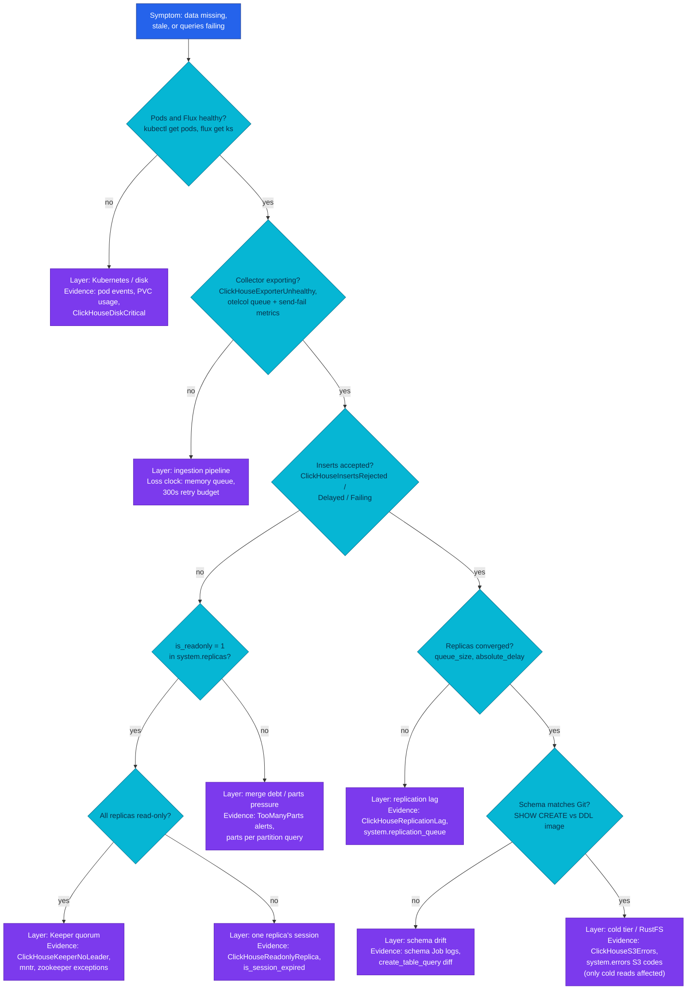

# Failure reasoning — which layer failed and what evidence proves it

"Grafana shows no logs for the last hour" has at least six distinct causes,
and the ones that page loudest are rarely the ones losing data. This chapter
gives you the diagnosis order: from a symptom, walk the layers in a fixed
sequence, and let one piece of read-only evidence eliminate each layer before
you touch anything.

| Quick facts | |
|---|---|
| **Page type** | Explanation-first learning chapter |
| **Audience** | Operator |
| **Prerequisites** | Chapters [01](01-architecture.md)–[10](10-storage-s3.md); this chapter assumes the mechanisms and only adds the reasoning order |
| **Deployment status** | Deployed topology; the failure behaviors themselves are upstream invariants and inferences — none was induced on this cluster |
| **Platform scope** | The whole ingestion-to-query path: Collector → ClickHouse (3 replicas) → Keeper (3 members) → RustFS → Grafana |
| **Evidence context** | Repository facts only — live lab pending verification on the Ubuntu Kind cluster |
| **This page owns** | The propagation model: symptom → failing layer → evidence, and which invariant survives each failure |
| **Not this page** | Recovery *procedures* — [ClickHouse operations](../operations.md#recovery-checklist) and the [per-alert runbooks](../../runbooks/clickhouse/README.md) own every command that changes state |
| **Previous / next** | [Tiered storage](10-storage-s3.md) / [Scaling decisions](12-scaling.md) |

## Questions this chapter answers

- Given "data stopped appearing", which layer do you check first, and what
  single query eliminates it?
- Which failures lose data, which delay it, and which only degrade reads?
- What still works while Keeper has no quorum, and what does not?
- When a replica is read-only, why do dashboards mostly keep working?
- What can be restored after each failure — and what is the one failure with
  no restore path?

## Mental model

Telemetry flows through a chain of buffers and stores, and each link fails
differently: some links *drop* (the Collector's in-memory queue), some *hold
and retry* (TTL moves to a dead RustFS), some *degrade to read-only* (a replica
that lost Keeper). Diagnosis is not guessing which link broke — it is knowing
that each link leaves a distinct fingerprint in a system table, a metric, or an
alert, and reading fingerprints in an order that eliminates the cheapest-to-check
layers first.

Think of it as a water system: a dry tap (no data in Grafana) may mean the
pump stopped (Collector), the pipe burst (insert path), the reservoir is
sealed for maintenance (read-only replicas), or the water table itself is gone
(data loss). You do not dig up the garden first; you check the gauges in order.
The analogy stops here: unlike pipes, this system has three parallel reservoirs
that keep serving reads while their refill is broken — absence of *new* data
and absence of *data* are different symptoms.

### Essential terms

| Term | Meaning here |
|---|---|
| `read-only replica` | A replicated table whose replica lost its Keeper session or failed reinitialization; it serves SELECTs but refuses INSERTs ([system.replicas](https://clickhouse.com/docs/reference/system-tables/replicas)) |
| `merge debt` | Active parts accumulating faster than merges reduce them; pressure is per partition |
| `absolute_delay` | Seconds a replica's applied log position lags the newest known entry; the lag evidence in `system.replicas` |
| `schema drift` | A difference between the DDL shipped in the schema image and the live `CREATE TABLE` on a replica |

Shared meanings of *part*, *merge*, *replica*, and *Keeper* are in the
[learning-path glossary](README.md#shared-glossary).

## How it works internally

### Invariants

- A failure in one layer surfaces in that layer's own evidence *and* as a
  symptom one or two layers downstream; the skill is attributing the symptom
  upstream, not treating it where it appears.
- Replicated tables degrade, they do not corrupt: losing Keeper makes them
  read-only, never inconsistent (upstream invariant —
  [replication: recovery after failures](https://clickhouse.com/docs/reference/engines/table-engines/mergetree-family/replication)).
- Local reads survive coordination loss: a read-only replica still answers
  SELECTs from its local parts.
- No layer in this platform guarantees delivery end-to-end: the Collector's
  queue is memory-only and its retry budget is 300 seconds, after which data is
  dropped (repository fact — the exporter config walked through in
  [chapter 8](08-ingestion-pipeline.md)). "No new data" therefore has a clock
  on it: an insert-path outage longer than the retry budget is loss, not delay.

### Lifecycle or sequence

The diagnosis order below is fixed on purpose: each step needs only read-only
evidence, and each eliminates every layer above it before you reason about the
ones below. It compresses the operational
[triage order](../operations.md#triage-order) and
[health ladder](../operations.md#health-ladder) into a decision tree; those
pages own the step-by-step procedures and the recovery commands.



### What to notice

- The tree branches on *evidence you can read*, never on plausibility. Every
  decision node names its query or alert; if you cannot answer a node, collect
  its evidence rather than skipping ahead.
- The most alarming-sounding layer (Keeper quorum) is reached only after
  cheaper eliminations, because its symptom — every replica read-only at once —
  is unmistakable, while its false positives (one flaky session) are common.
  The tempting conclusion the tree does not support: "no data in Grafana"
  usually being ClickHouse's fault at all. The first two branches exonerate it.

### What survives each failure

The engine's promise during degradation is specific. Every row below is an
upstream invariant of the mechanisms explained in chapters 4–10, applied to
this topology as an inference; **none of these failures has been induced on the
shared cluster** — the [2026-09-10 audit](../audits/2026-09-10-kind.md)
deliberately observed only naturally occurring behavior.

| Failure | Still guaranteed | Temporarily unavailable | Lost forever |
|---|---|---|---|
| Collector pod restart | ClickHouse state untouched | — | Whatever sat in the memory queue (up to 1000 batches) |
| Insert-path outage > 300s | Data already in parts | New ingest | Telemetry produced during the outage beyond the retry budget |
| One replica read-only | Its local reads; ingest via the other two (the Service routes around it) | Its share of insert traffic | Nothing — it catches up from the replication log ([chapter 5](05-replication.md)) |
| Keeper quorum lost | All local reads on all replicas | All ingest into replicated tables; merges assignment | Nothing, if quorum returns before the Collector's retry budgets expire upstream |
| Replica lag | Reads on the lagging replica return older data | Read-your-write consistency across replicas | Nothing — convergence is the design ([chapter 5](05-replication.md)) |
| Merge debt (too many parts) | Committed data | Insert throughput (delayed at 1000 parts/partition, rejected at 3000 — upstream defaults: [parts_to_delay_insert, parts_to_throw_insert](https://clickhouse.com/docs/reference/settings/merge-tree-settings/parts-to)) | Inserts rejected at the hard limit, if the client gave up |
| RustFS down | Hot ingest, reads over recent (< 7d) partitions | Cold reads, TTL moves | Nothing while hot disks hold the move backlog ([chapter 10](10-storage-s3.md)) |
| One PVC lost | Two replicas serve everything | Third replica until it refetches | Nothing — parts refetch from peers; cold metadata rebuilds by fetch, not from the bucket |
| All three PVCs + bucket | — | — | Everything: **no backup exists** (repository fact — [ADR-065 § out of scope](../../../proposals/adr/ADR-065-clickhouse-replicated-topology/README.md#out-of-scope)); on Kind one node filesystem is exactly this blast radius |

## How homelab uses it

| Upstream mechanism | Homelab setting or behavior | Evidence | Class/status |
|---|---|---|---|
| Alert-to-layer mapping | 23 alert rules in group `observability-clickhouse`, each with a runbook, covering every layer in the tree | [Alert rules](../../../../kubernetes/infra/configs/observability/metrics/prometheusrules/observability/clickhouse-alerts.yaml); [runbook index](../../runbooks/clickhouse/README.md) | Repository fact |
| Read-only detection | `ClickHouseReadonlyReplica` on `ReadonlyReplica > 0` for 5m | Same rules file | Repository fact |
| Lag detection | `ClickHouseReplicationLag` on max absolute delay > 300s for 10m | Same rules file | Repository fact |
| Parts-pressure detection | `ClickHouseTooManyParts*` at 300 — a tenth of the upstream delay threshold, so the alert leads the engine's own throttle by design | Same rules file; [upstream defaults](https://clickhouse.com/docs/reference/settings/merge-tree-settings/parts-to) | Repository fact + upstream invariant |
| Schema as code | DDL ships as a digest-pinned image; drift is a diff between `SHOW CREATE TABLE` and the [SQL files](../../../../images/clickhouse-ddl/sql/00-database.sql) | [Schema Job](../../../../kubernetes/infra/configs/clickhouse-schema/job.yaml) | Repository fact |
| Data-loss signal | `ClickHouseReplicatedDataLoss` (critical, 1m) watches lost-part counters | Same rules file | Repository fact |
| No restore path | No `clickhouse-backup`; durability = 3 replicas + per-replica cold objects | Absence across `kubernetes/`; [chapter 10](10-storage-s3.md#how-homelab-uses-it) | Repository fact |

The deliberate asymmetry is worth stating: the platform invests in *detection*
(23 alerts, one runbook each) and in *redundancy* (three replicas, quorum
coordination), and explicitly not in *restore* (no backups). For 90-day
telemetry that trade is coherent — but it means the diagnosis tree's job is to
keep small failures from compounding into its one unrecoverable leaf.

## Observe it on the live cluster

This lab is the healthy-baseline sweep: run the tree's core evidence queries
when nothing is wrong, so you know each fingerprint's normal shape before an
incident distorts it.

### Prerequisites and safety

- Use the [secure ClickHouse client pattern](../operations.md#secure-client-pattern).
- Confirm the current context and the replica you will query; `system.replicas`
  and `system.errors` are per-replica views — sweep all three pods for a full
  picture.
- Run only the read-only commands shown below.

### Query

```sql
SELECT
    database,
    table,
    is_readonly,
    is_session_expired,
    queue_size,
    inserts_in_queue,
    merges_in_queue,
    absolute_delay,
    total_replicas,
    active_replicas
FROM system.replicas
WHERE database = 'otel'
ORDER BY table
LIMIT 10;
```

```sql
SELECT
    table,
    partition,
    count()          AS active_parts,
    sum(rows)        AS rows
FROM system.parts
WHERE database = 'otel' AND active
GROUP BY table, partition
ORDER BY active_parts DESC
LIMIT 10;
```

```sql
SELECT
    name,
    code,
    value            AS occurrences,
    last_error_time
FROM system.errors
WHERE value > 0
ORDER BY last_error_time DESC
LIMIT 20;
```

### Observed example

```text
PENDING VERIFICATION — capture on the Ubuntu Kind cluster; see the verification worksheet in the pull request.
```

Observation context:

| Field | Value |
|---|---|
| **Observed at** | _pending_ |
| **Repository** | _pending_ |
| **Cluster/context** | _pending_ |
| **ClickHouse** | _pending_ |
| **Database/table** | _pending_ |
| **Replica** | _pending_ |

### How to read the result

| Field or relationship | Interpretation | What it cannot prove |
|---|---|---|
| `is_readonly = 0`, `is_session_expired = 0` | This replica holds a live Keeper session and accepts inserts | Nothing about the other two replicas — sweep each pod |
| `queue_size`, `absolute_delay` near zero | The replica has applied the shared log; converged at this instant | Convergence a second later; both values are a snapshot, not a state |
| `active_replicas = total_replicas = 3` | All replicas hold live sessions as seen via Keeper | That all three are *serving* — a pod can hold a session and still be failing probes |
| `active_parts` per partition ≪ 1000 | Ample headroom before the engine delays inserts (upstream default) | Tomorrow's headroom; ingest bursts and paused merges move this hourly |
| `system.errors` rows | Which error codes have fired since server start, and how recently | That an old counter is a live problem — `value` never resets between restarts; weigh `last_error_time`, and treat a healthy baseline's rows as the noise floor |

### What to notice

- The baseline is not "all zeros": a running system accumulates benign error
  codes and transient queue entries. What the tree keys on is *change from this
  baseline correlated with a symptom*, which is why capturing the healthy shape
  matters.
- Every number here is an observed example bound to the context table above —
  queue sizes and part counts are the most volatile values in this whole
  learning path.

## Failure modes and trade-offs

The failure tables of chapters [4](04-parts-and-merges.md),
[5](05-replication.md), [6](06-keeper.md), [8](08-ingestion-pipeline.md), and
[10](10-storage-s3.md) each own their layer's rows; this chapter's failure mode
is a failure of *diagnosis itself*.

| Trigger | Internal reaction | User-visible symptom | Evidence | Recovery boundary or cost |
|---|---|---|---|---|
| Treating the symptom's layer instead of the cause's | For example restarting ClickHouse for missing data whose cause is the Collector queue | Symptom persists or worsens; queue contents are lost in the restart | The tree's earlier branches were never eliminated | Cost is paid in data: restarts destroy in-memory buffers upstream and force session re-establishment downstream |
| Running recovery commands to "see if it helps" | `SYSTEM RESTART REPLICA` and friends mutate replica state | A recoverable state can become a diverged one | — | Boundary is absolute on the shared cluster: recovery commands belong to the [runbooks](../../runbooks/clickhouse/README.md) with their preconditions, never to exploration |
| Alert fatigue on info-level signals | `ClickHouseInsertsDelayed` (info) fires under natural bursts | Real pressure buildup is ignored | Alert history vs the parts-pressure query | The delayed/rejected pair is a two-stage warning: delayed is the cheap early signal, rejected is data on the floor ([part pressure](../parts-merges-and-ttl.md#part-pressure-and-the-two-guard-dimensions)) |

During a diagnosis mis-step, the engine's own invariants keep holding — the
cost of a wrong turn is time and upstream buffer loss, not ClickHouse
consistency. The one exception is issuing state-changing commands without their
runbook preconditions, which can convert a self-healing state into one needing
manual convergence.

## Misconceptions and challenge questions

### "The dashboard is empty, so ClickHouse lost the data"

The tree's first two branches exist because this claim is usually wrong twice.
Empty panels most often mean data never *arrived* (Collector backlog or drop —
[chapter 8](08-ingestion-pipeline.md)) or arrived but the panel's time range or
replica answered before convergence (lag — [chapter 5](05-replication.md)).
Data ClickHouse acknowledged is in an immutable part on three replicas;
absence of new points and loss of stored points have entirely different
fingerprints, and only `system.parts` plus `system.replicas` distinguishes
them.

### "Keeper is down, so our data is at risk"

Quorum loss stops *coordination*: inserts into replicated tables and merge
assignment. Every part already on disk stays intact and every replica keeps
serving reads from its local state; tables reconnect and resume automatically
when quorum returns (upstream invariant —
[recovery after failures](https://clickhouse.com/docs/reference/engines/table-engines/mergetree-family/replication)).
The data actually at risk during a long outage is *upstream*: telemetry the
Collector cannot deliver past its 300-second retry budget. The urgent clock in
a Keeper incident ticks in the ingestion pipeline, not in ClickHouse.

### Challenge: at 14:00, traces are queryable but logs stopped at 13:40. All pods are Running. Walk the tree

**Model answer:** One signal flowing and the other stalled eliminates
Kubernetes, Keeper, and replica state wholesale — those failures are not
signal-selective. The split points at the ingestion pipeline, where logs and
traces travel different routes into the same exporter
([chapter 8](08-ingestion-pipeline.md)): check the Collector's log-pipeline
metrics and the Vector edge first (`ClickHouseExporterUnhealthy`, queue and
send-failure counters), then per-table inserts (`system.query_log` INSERT rows
for `otel_logs` vs `otel_traces`). A table-specific insert failure — schema
drift on `otel_logs`, or its parts pressure — is the remaining branch:
`system.errors` and the parts-per-partition query decide. The 20-minute gap is
already past the 300s retry budget, so whatever the cause, expect a permanent
hole in logs for most of that window.

## Teach-back checklist

Before continuing, explain these without rereading the chapter:

- [ ] The diagnosis order and why its sequence is cheapest-elimination-first,
      in your own words.
- [ ] For a read-only replica: what state it is in, where that state is
      recorded (`system.replicas` fields), and who owns the recovery decision.
- [ ] The prediction for a 10-minute Keeper quorum loss: what stops, what
      keeps working, and where the only permanent loss happens.
- [ ] One row from your healthy-baseline `system.errors` sweep and why its
      presence is not an incident.
- [ ] The trade-off this platform made between redundancy and restore, and the
      one failure it cannot come back from.

## Related documentation

- [ClickHouse operations](../operations.md) — triage order, health ladder, and
  the recovery checklist this chapter deliberately does not copy
- [Alert runbooks index](../../runbooks/clickhouse/README.md) — one runbook per
  alert, with validation levels and investigation workflows
- [ClickHouse runtime audits](../audits/README.md) — dated, timestamped proof
  of past healthy baselines
- [Ingestion pipeline](08-ingestion-pipeline.md) — the loss clock upstream of
  every ClickHouse symptom
- [Scaling decisions](12-scaling.md) — the next chapter: when the recurring
  fingerprint is capacity, not fault

## References

- [ClickHouse: data replication — recovery after failures](https://clickhouse.com/docs/reference/engines/table-engines/mergetree-family/replication)
- [ClickHouse: `system.replicas`](https://clickhouse.com/docs/reference/system-tables/replicas)
- [ClickHouse: MergeTree settings — `parts_to_delay_insert`, `parts_to_throw_insert`](https://clickhouse.com/docs/reference/settings/merge-tree-settings/parts-to)

---
_Last updated: 2026-09-29 — first draft of the failure-reasoning chapter; live
observation pending verification on the Ubuntu Kind cluster._
