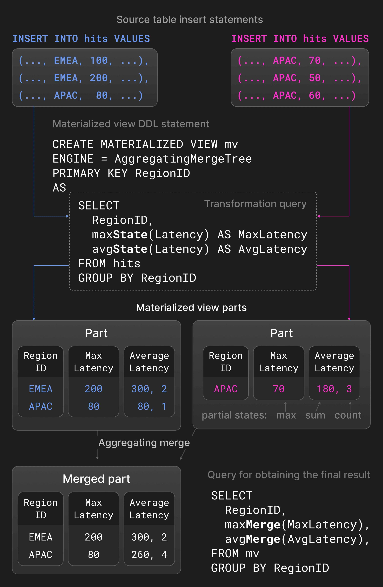

# Materialized views — incremental `TO` tables, not a Postgres index

On this platform a materialized view is an **insert trigger**: each new part
written to `otel_traces` runs the view's `SELECT` **on that part** and
appends the result to a **target table**. There is no nightly full refresh.

| | |
|---|---|
| **Deployed MV** | `otel.otel_traces_trace_id_ts_mv` → table `otel.otel_traces_trace_id_ts` |
| **Job** | Compact `TraceId → [Start, End]` so a single-trace lookup can bound time on the large `otel_traces` table |
| **Not used** | Refreshable MVs, cascading MV chains, AggregatingMergeTree `-State` rollups as the trace-id index |
| **Hands-on** | Hub [Playground §5](README.md#5-the-trace_id-materialized-view) |

---

## Overview

`otel_traces` is sorted `(ServiceName, SpanName, time)`. Grafana still needs
"open this `TraceId`". A second, small table sorted `(TraceId, Start)` holds
the min/max timestamp per id. The MV keeps that table current as spans
arrive.

Do not expect `EXPLAIN` on `otel_traces` to "see" the MV the way Postgres
uses an index. The MV is **another table**. You query it (or Grafana does),
then restrict `otel_traces` with the time window it returns.

---

## Incremental `TO` (what we run)

Vendor docs call this a materialized view with an explicit **`TO`** table.
The view **owns no storage** — required inside a `ENGINE = Replicated`
database (an inner engine on the view itself is the shape we avoided).

From git (`40-otel_traces_trace_id_ts_mv.sql`):

```sql
CREATE MATERIALIZED VIEW IF NOT EXISTS otel.otel_traces_trace_id_ts_mv
TO otel.otel_traces_trace_id_ts
AS SELECT
    TraceId,
    min(Timestamp) AS Start,
    max(Timestamp) AS End
FROM otel.otel_traces
WHERE TraceId != ''
GROUP BY TraceId;
```

On each insert into `otel_traces`, ClickHouse evaluates that aggregate
**against the new block**, not the whole history. Rows land in
`otel_traces_trace_id_ts` (`ORDER BY (TraceId, Start)`). `Start`/`End` on
the view are `DateTime64(9)` and the target columns are `DateTime` — the
Job comments that ClickHouse casts on insert; do not "fix" it.

**Refreshable** materialized views (periodic `SELECT` over the full source)
and **cascading** MVs (view on view) are ClickHouse features this cluster
does **not** use. Skip them until a design record says otherwise.

---

## Figure 5 is a different pattern

Vendor Figure 5 shows **aggregating** materialized views: `-State` /
`-Merge` combinators and AggregatingMergeTree merging partial aggregates.
That is a real observability **rollup** pattern (pre-aggregated metrics from
spans). It is **not** `otel_traces_trace_id_ts`, which stores min/max
timestamps per `TraceId` on an ordinary ReplicatedMergeTree.



---

## How an SRE inspects it

### 1. Confirm `TO`, not inner storage

```sql
SHOW CREATE TABLE otel.otel_traces_trace_id_ts_mv;
```

You should see `TO otel.otel_traces_trace_id_ts` and the `SELECT` above.
Full DDL: [`configmap-schema.yaml`](../../../kubernetes/infra/configs/clickhouse-schema/configmap-schema.yaml).

### 2. Health lives on the **target** table

`system.parts` on the **view name** is the wrong place. Count parts, rows,
and compression on `otel_traces_trace_id_ts`:

```sql
SELECT table, count() AS parts, sum(rows) AS rows,
       formatReadableSize(sum(data_compressed_bytes)) AS comp,
       round(sum(data_uncompressed_bytes)/sum(data_compressed_bytes),1) AS ratio
FROM system.parts
WHERE database = 'otel' AND table = 'otel_traces_trace_id_ts' AND active
GROUP BY table;
```

If inserts into `otel_traces` succeed but this table stays empty, the MV was
created late or is missing — the Job comment says lookups fail **with no
error**. Recreate order: traces table → target table → MV.

### 3. Lookup, then EXPLAIN both tables

Typical path: filter `TraceId` on the small table, take `Start`/`End`, query
`otel_traces` in that window (Grafana's waterfall does this). Prove prune on
**both**:

```sql
EXPLAIN indexes = 1
SELECT Start, End FROM otel.otel_traces_trace_id_ts
WHERE TraceId = '00000000000000000000000000000000';  -- replace with a real id

EXPLAIN indexes = 1
SELECT count() FROM otel.otel_traces
WHERE TraceId = '00000000000000000000000000000000'
  AND Timestamp >= now() - INTERVAL 1 HOUR
  AND Timestamp <= now();
```

On the main table, `TraceId` rides the **bloom** skip index, not the
primary key. A tight time window still helps partitions (`toDate(Timestamp)`).
How to read `Granules: a/b`: [schema-and-queries](schema-and-queries.md).

Playground copy-paste: [§5](README.md#5-the-trace_id-materialized-view).

---

## How it works on this platform

Grafana Trace Explorer resolves a trace id to a time range via this table,
then loads the waterfall from `otel_traces` — documented in
[README Grafana](README.md#explore--tracelog-linking). The MV is
observability **lookup**, not a metrics rollup.

---

## References

- [Materialized views](https://clickhouse.com/docs/concepts/features/materialized-views) (incremental `TO`)
- [Architecture overview](https://clickhouse.com/docs/concepts/core-concepts/academic-overview) — Figure 5 (aggregating contrast)
- [Fundamentals](fundamentals.md) · [Schema and queries](schema-and-queries.md) · [Hub](README.md)

---

_Last updated: 2026-09-04_
