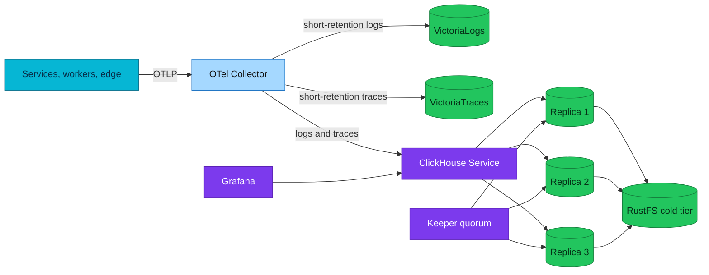

# Operating ClickHouse for OpenTelemetry data

Start with the failing user-visible signal, prove which layer is unhealthy, and
change only the layer that owns the failure.

| Quick facts | |
|---|---|
| **Status** | Deployed day-2 guide for the local cluster |
| **Topology** | One shard, three ClickHouse replicas, three Keeper members |
| **Primary stores** | VictoriaLogs and VictoriaTraces remain the short-retention operational stores |
| **ClickHouse role** | Supplementary 90-day SQL and log↔trace correlation |
| **Alert entry** | [ClickHouse alert runbooks](../runbooks/clickhouse/README.md) |
| **Lifecycle** | [Parts, merges, partitions, and TTL](parts-merges-and-ttl.md) |

## Overview

The operational path has five independently failing layers: telemetry
producers, Collector fan-out, ClickHouse ingest, replicated storage, and the SQL
query surface. A green pod proves only that the process is running. It does not
prove the schema exists on every replica, inserts succeed, replicas agree, TTL
is progressing, or Grafana can query the datasource.



## Triage order

Use the same order for an alert, failed dashboard, or missing telemetry:

1. Establish impact: ClickHouse-only analytics, or all logs/traces?
2. Confirm signal freshness in VictoriaLogs/VictoriaTraces before blaming the
   producer.
3. Check Collector queue, send-failure, and retry metrics for the ClickHouse
   exporter.
4. Check server scrape coverage and query every replica directly.
5. Check Keeper, replica queues, read-only state, parts, merges, and disks.
6. Check schema compatibility and materialized-view progress.
7. Validate recovery across two scrape intervals and with one bounded query.

If VictoriaLogs and VictoriaTraces are current while ClickHouse is stale, keep
the incident scoped to the supplementary sink. Do not restart the Collector in
a way that risks the healthy pipelines.

## Secure client pattern

Never print the ClickHouse password or build a shell command that exposes it in
logs or process arguments. Let the client prompt on the terminal:

```bash
CH_USER="$(kubectl -n monitoring get secret clickhouse-credentials \
  -o jsonpath='{.data.username}' | base64 -d)"
kubectl -n monitoring exec -it chi-clickhouse-otel-0-0-0 -- \
  clickhouse-client --user="$CH_USER" --ask-password \
  --query "SELECT version()"
unset CH_USER
```

Enter the Secret's password only at the prompt. For several SQL statements,
omit `--query` and keep one interactive client open. Automation should read the
Secret in a protected process environment; it must not echo it or interpolate
it into a recorded command line.

## Health ladder

### 1. Kubernetes and Flux

```bash
kubectl -n monitoring get clickhouseinstallation,clickhousekeeperinstallation
kubectl -n monitoring get statefulset,pod -l app.kubernetes.io/name=clickhouse
flux get kustomizations clickhouse-local clickhouse-schema-local tracing-local
```

For Flux, require both `Ready=True` and an observed generation matching the
current generation. The ClickHouse wave must also wait for the operator-created
StatefulSets; a Ready custom resource alone is insufficient.

### 2. Scrape coverage

Query VictoriaMetrics before trusting any server alert:

```promql
up{job="clickhouse-server"}
```

Expect one healthy series per replica. Missing all series makes every alert
based on `ClickHouseMetrics_*`, `ClickHouseAsyncMetrics_*`,
`ClickHouseProfileEvents_*`, or `ClickHouseErrorMetric_*` blind. Follow
[ClickHouseServerNotScraped](../runbooks/clickhouse/ClickHouseServerNotScraped.md).

### 3. Replica and Keeper state

```sql
SELECT
    database,
    table,
    is_readonly,
    is_session_expired,
    absolute_delay,
    queue_size,
    inserts_in_queue,
    merges_in_queue,
    lost_part_count
FROM system.replicas
ORDER BY database, table;
```

Interpret the fields together:

- `is_readonly=1` with an expired session points to Keeper connectivity.
- Queue growth with a live session points to fetch/merge throughput or a sick
  peer.
- `lost_part_count` is a data-integrity signal, not routine lag.
- A zero queue on one replica does not prove the other replicas agree.

### 4. Schema agreement

Run these checks on every replica:

```sql
SELECT database, name, engine, storage_policy
FROM system.tables
WHERE database = 'otel'
ORDER BY name;

SHOW CREATE TABLE otel.otel_logs;
SHOW CREATE TABLE otel.otel_traces;
SHOW CREATE TABLE otel.otel_traces_trace_id_ts;
```

The Collector runs with `create_schema: false`. A version bump can therefore
leave the exporter INSERT statement incompatible with committed DDL. Treat
unknown-column/type errors as a schema contract failure; do not enable exporter
DDL as an incident workaround.

### 5. Data freshness

```sql
SELECT 'logs' AS signal, count() AS rows, max(Timestamp) AS newest
FROM otel.otel_logs
UNION ALL
SELECT 'traces', count(), max(Timestamp)
FROM otel.otel_traces;
```

Compare the newest timestamp with a known request, allowing for Collector batch
and retry delay. Traces are sampled, so absence of one trace is not proof of a
broken pipeline. Logs are the better completeness signal.

## Capacity and merge debt

Read capacity as a flow problem:

```text
incoming parts per minute - merged parts per minute = part debt
```

Track active parts per partition, merge throughput, failed merges, disk bytes,
and Collector queue growth on the same time window. CPU alone cannot explain
whether the system is catching up.

Use [ClickHouseTooManyParts](../runbooks/clickhouse/ClickHouseTooManyParts.md)
for server-wide growth and
[ClickHouseTooManyPartsPerPartition](../runbooks/clickhouse/ClickHouseTooManyPartsPerPartition.md)
for the insert-guard dimension.

## Disk and cold tier

The local-path PVC does not provide a hard 10 GiB quota. Server disk metrics may
describe the Kind node filesystem, while `du` describes ClickHouse data. Capture
both before choosing a mitigation.

```sql
SELECT
    name,
    type,
    formatReadableSize(total_space) AS total,
    formatReadableSize(free_space) AS free
FROM system.disks
ORDER BY name;
```

For cold data, also inspect active parts by `disk_name` and
`system.remote_data_paths`. Do not add an independent RustFS lifecycle deletion
policy; ClickHouse metadata owns those objects.

## Alert response contract

Every ClickHouse alert is validated at one of four levels:

| Level | Proves | Does not prove |
|---|---|---|
| `static-valid` | Rule parses, URL resolves, runbook exists | Metric exists |
| `live-signal` | Selector and labels exist on Kind | Predicate can become true |
| `predicate-exercised` | A safe drill makes the full expression true | `for` duration and routing completed |
| `alert-observed` | VMAlert state and Alertmanager route were observed | Production paging destination delivered |

The dated [Kind audit](audits/2026-09-10-kind.md) records the level per rule. A
`VERIFY-AT-KIND` marker remains until its stated contract is met.

## Recovery checklist

- The affected rule expression is false for two evaluation intervals.
- All three server scrape targets are present.
- Replica sessions are writable and queues are draining.
- OTel log and trace freshness advances after a known request.
- Collector ClickHouse queue and send-failure rate return to baseline.
- No new replicated-data-loss or S3 errors appear.
- Temporary drill objects are gone.

## Escalation evidence

Capture timestamps and sanitized output for:

- Base Git SHA and ClickHouse/Operator/Collector versions.
- Affected replica, table, and partition.
- Full alert expression and label set.
- `system.replicas`, `system.parts`, `system.merges`, and relevant
  `system.part_log` rows.
- Collector queue/retry counters and server error codes.
- Last known good and first known bad telemetry timestamps.

Do not attach Secret objects, environment dumps, DSNs, or command lines that
contain credentials.

## References

- [ClickHouse platform hub](README.md)
- [Parts, merges, partitions, and TTL](parts-merges-and-ttl.md)
- [ClickHouse runbooks](../runbooks/clickhouse/README.md)
- [Alert catalog](../alerting/alert-catalog.md#8b-clickhouse-otel-olap-engine)
- [Kind end-to-end audit](../../platform/kind-e2e-audit.md)

---
_Last updated: 2026-09-10 — added credential-safe client use and linked the live Kind evidence._
