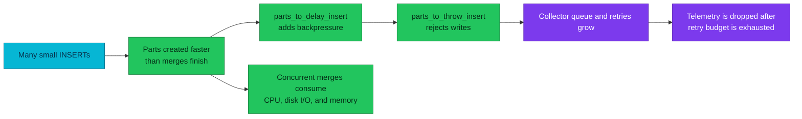

# ClickHouse parts, merges, partitions, and TTL

One OpenTelemetry batch becomes an immutable part; background merges make that
write pattern affordable, and TTL merges eventually move or remove it.

| Quick facts | |
|---|---|
| **Status** | Deployed learning and operations guide |
| **Scope** | `otel.otel_logs`, `otel.otel_traces`, and the MergeTree lifecycle they use |
| **Write path** | OTel Collector batch (`512`, maximum `1024`, `5s`) → ClickHouse exporter with `async_insert: true` |
| **Layout** | Daily partitions, service-first sorting keys, approximately 8,192 rows per granule |
| **Retention** | Move eligible parts to RustFS after 7 days; drop data after 90 days |
| **Safety rule** | Fix insert cadence or merge capacity before changing a part guard |
| **Operations** | [ClickHouse operations](operations.md) and [alert runbooks](../runbooks/clickhouse/README.md) |

## Overview

MergeTree does not append rows to one mutable table file. Each INSERT produces
one or more immutable **parts**. A part contains sorted column files, marks, and
metadata. Background merges replace several small parts with a larger part.
Partitions group parts for lifecycle management; they are not a second index.
TTL is executed by merges, not by a cron job.

That model explains a common incident chain:



The first operational question is therefore not “how do I raise the limit?” It
is “why are parts arriving faster than this replica can merge them?”

## From a value to a part

The storage hierarchy is easiest to learn from the inside out:

| Unit | Meaning | Operational consequence |
|---|---|---|
| Value | One typed cell | Similar neighbouring values compress well |
| Block | In-memory column batch moving through a query pipeline | An INSERT may be split into blocks before it reaches storage |
| Granule | Smallest normal read unit, approximately `index_granularity` rows | Sparse-index pruning saves granules, not individual rows |
| Mark | Offset connecting the sparse index to compressed column data | More marks improve pruning but add metadata and seeks |
| Part | Immutable, sorted set of column files and metadata | Small INSERTs create small parts and future merge work |
| Partition | Set of parts sharing the `PARTITION BY` value | DROP and whole-part TTL decisions operate at this boundary |

For the OTel tables, the sparse index follows the table `ORDER BY`. Filtering
on the leading columns can skip granules. Filtering only on a trailing column
may still read many granules even when the result is small. See
[schema and queries](schema-and-queries.md) for `EXPLAIN indexes = 1` examples.

### One INSERT is not necessarily one network request

The Collector's `batch` processor and the ClickHouse exporter's async-insert
buffer are separate stages:

```mermaid
flowchart LR
  SDK["OTel SDKs"] --> Receiver["Collector OTLP receiver"]
  Receiver --> Batch["batch processor<br/>512 / 1024 / 5s"]
  Batch --> Exporter["ClickHouse exporter<br/>async_insert=true"]
  Exporter --> Server["ClickHouse async-insert buffer"]
  Server --> Part["Sorted immutable part"]
  Part --> Merge["Background merge"]

  classDef service fill:#06b6d4,color:#082f49,stroke:#0e7490;
  classDef collector fill:#a5d8ff,color:#111,stroke:#1971c2;
  classDef data fill:#22c55e,color:#052e16,stroke:#15803d;
  class SDK service;
  class Receiver,Batch,Exporter collector;
  class Server,Part,Merge data;
```



The Collector values are batching limits, not a promise that every server-side
part contains exactly 512 or 1,024 rows. Concurrent consumers, signal volume,
timeouts, async-insert coalescing, and materialized views all affect the final
part shape. Measure `system.part_log`; do not infer it from configuration.

## What a merge does

A normal merge reads compatible parts from one partition, merges their already
sorted streams, writes a replacement part, then marks the inputs inactive.
Readers continue to see a consistent snapshot during the replacement.

Merges spend four resources at once:

- CPU for comparisons, codecs, expressions, and TTL work.
- Disk reads for input parts and writes for the replacement.
- Memory for merge buffers and per-column state.
- Background-pool slots shared with mutations and some TTL work.

Wide tables deserve special attention. Merge memory depends on the number and
shape of columns being processed, not only on compressed bytes. A system table
with many columns can therefore fail merges while a larger, narrower OTel table
merges successfully. Use `peak_memory_usage` and `error` from `system.part_log`
instead of estimating from table size.

```sql
SELECT
    table,
    count() AS merge_events,
    countIf(error != 0) AS failed,
    formatReadableSize(max(peak_memory_usage)) AS peak_memory
FROM system.part_log
WHERE event_type = 'MergeParts'
  AND event_time >= now() - INTERVAL 1 HOUR
GROUP BY table
ORDER BY failed DESC, max(peak_memory_usage) DESC;
```

An inactive input part is not immediately evidence of leaked data. It is a
normal merge artifact and is removed after the configured cleanup delay.

## Part pressure and the two guard dimensions

This platform watches two related but different dimensions:

- `ClickHouseTooManyParts` tracks the server-wide active-part trend.
- `ClickHouseTooManyPartsPerPartition` tracks the hottest partition, which is
  the dimension used by `parts_to_delay_insert` and
  `parts_to_throw_insert`.

The alert threshold is an early-warning policy; it is not necessarily equal to
the server guard. Read the live settings on the affected replica:

```sql
SELECT name, value, changed
FROM system.merge_tree_settings
WHERE name IN (
    'parts_to_delay_insert',
    'parts_to_throw_insert',
    'max_parts_in_total',
    'max_delay_to_insert'
)
ORDER BY name;
```

Then find the real hot partition:

```sql
SELECT
    database,
    table,
    partition,
    count() AS active_parts,
    sum(rows) AS rows,
    formatReadableSize(sum(bytes_on_disk)) AS bytes
FROM system.parts
WHERE active
GROUP BY database, table, partition
ORDER BY active_parts DESC
LIMIT 20;
```

Treat these results separately. A large server-wide count spread across many
healthy partitions is different from one current-day partition approaching an
insert guard.

### Correct response order

1. Confirm whether the pressure is global or isolated to one partition.
2. Check whether merges are active, queued, failing, or starved of memory/disk.
3. Check the producer's insert cadence and Collector queue/retry metrics.
4. Reduce tiny inserts or restore merge capacity.
5. Re-evaluate part growth over at least two scrape intervals.

Do not raise `parts_to_throw_insert` during first response. The guard protects
the server from accepting more merge debt than it can pay. Raising it without
fixing the arrival/service-rate imbalance moves the failure to memory, disk, or
a longer telemetry outage.

## Partitions are lifecycle boundaries

`PARTITION BY` should group data at a grain that makes lifecycle operations
cheap without creating excessive independent merge queues. The OTel tables use
calendar-day partitions because the retention policy is expressed in days.

A partition is not a substitute for the sorting key:

- Partition pruning removes whole partitions.
- Primary-key pruning removes granules inside the remaining parts.
- Data-skipping indexes may avoid additional granules.
- None of them turns ClickHouse into a row-oriented point-lookup database.

Partitioning too finely creates more small part sets and more metadata.
Partitioning too coarsely makes TTL rewrite partial parts for longer. Align the
partition grain with the expected delete/move boundary, then prove the result
with `system.parts`.

## TTL is merge work, not a scheduler

The deployed OTel tables have two TTL actions:

1. Move parts whose rows are older than 7 days to the `cold` volume backed by
   RustFS.
2. Remove rows after 90 days.

`ttl_only_drop_parts = 1` lets ClickHouse drop a whole expired part when every
row in it has expired. Daily partitions make that outcome common, but it is not
instantaneous: the action waits for an eligible TTL merge.


Check data age and TTL evidence independently:

```sql
SELECT
    database,
    table,
    min(partition) AS oldest_partition,
    uniqExact(partition) AS partition_count,
    dateDiff('day', toDate(min(partition)), today()) AS age_days
FROM system.parts
WHERE active AND database = 'otel'
GROUP BY database, table
ORDER BY table;

SELECT merge_reason, count()
FROM system.part_log
WHERE event_type = 'MergeParts'
  AND event_time >= now() - INTERVAL 7 DAY
GROUP BY merge_reason
ORDER BY merge_reason;
```

An old partition does not prove that the TTL expression is wrong. First check
read-only replicas, disk headroom, merge failures, background-pool pressure,
and the TTL merge timeout.

## RustFS cold-tier ownership

ClickHouse owns the object lifecycle. RustFS stores bytes but must not expire
objects independently with a bucket lifecycle rule. ClickHouse metadata can
still reference those objects; deleting them behind the server creates missing
parts and possible replicated data loss.

For each moved part, verify all three layers:

1. `system.parts.disk_name` reports the expected cold/cache disk.
2. `system.remote_data_paths` maps local metadata to a remote object.
3. RustFS and ClickHouse expose no S3 errors while the object is read.

Cache presence proves that an object was cached; it does not prove a cache-hit
ratio. Use query logs and repeated, bounded reads when hit behaviour matters.

## Failure patterns

| Symptom | Likely question | First evidence |
|---|---|---|
| Active parts rise monotonically | Are inserts outrunning merges? | `system.parts`, `system.merges`, Collector batch rate |
| Delayed inserts | Which partition crossed the delay guard? | Live merge-tree settings and max parts per partition |
| Rejected inserts | Is part pressure the cause or a different insert error? | `RejectedInserts`, `FailedInsertQuery`, server error log |
| Merge retry storm | Which table/error dominates? | `system.part_log.error`, `exception`, `peak_memory_usage` |
| Data remains past TTL | Are TTL merges starved or replicas read-only? | oldest partition, TTL merge history, Keeper/session health |
| Hot disk remains full | Did move TTL execute, and is RustFS healthy? | `disk_name`, remote paths, S3 errors |
| Missing cold data | Was an object removed outside ClickHouse? | remote path, RustFS object, replicated-data-loss counter |

## Safe practice lab

Run experiments only in a disposable database on local Kind. Use a unique
database prefix, bounded row counts, explicit timeouts, and cleanup. Do not use
`OPTIMIZE FINAL` on the OTel tables: it bypasses the scheduler's normal evidence
and can create the load being investigated.

The audited procedure and results live in the dated
[Kind evidence directory](audits/README.md).

## References

- [ClickHouse parts](https://clickhouse.com/docs/concepts/core-concepts/parts)
- [ClickHouse merges](https://clickhouse.com/docs/concepts/core-concepts/merges)
- [Selecting an insert strategy](https://clickhouse.com/docs/concepts/best-practices/selecting-an-insert-strategy)
- [Manage data with TTL](https://clickhouse.com/docs/guides/developer/ttl)
- [MergeTree settings](https://clickhouse.com/docs/operations/settings/merge-tree-settings)
- [Platform ClickHouse architecture](README.md)
- [ClickHouse operations](operations.md)

---
_Last updated: 2026-09-14 — lifecycle guide synthesized from repository
manifests and a local learning note; runtime-sensitive values remain
evidence-labelled._
