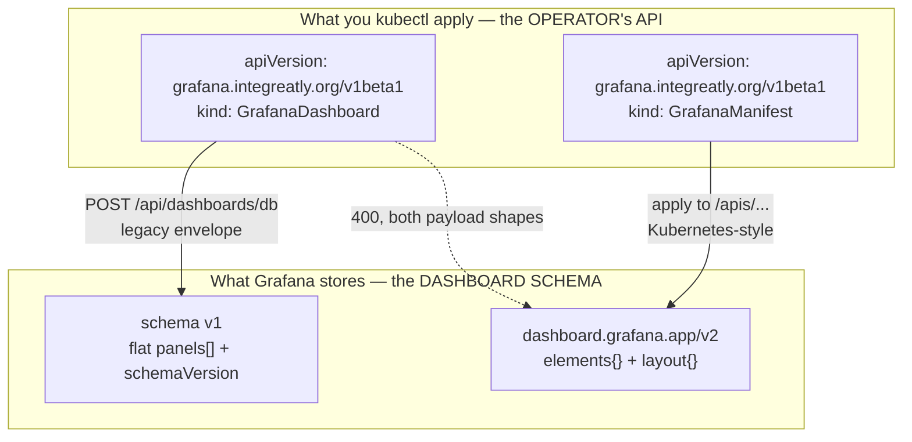
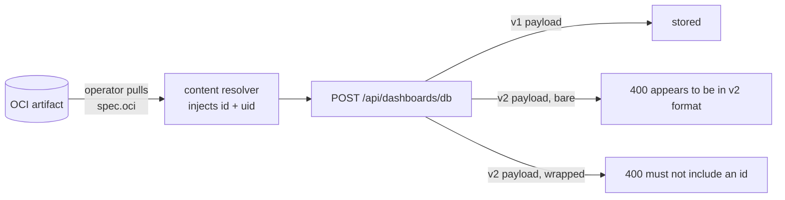
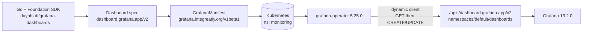
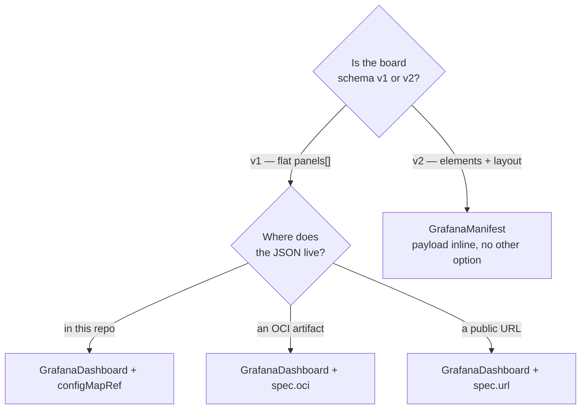
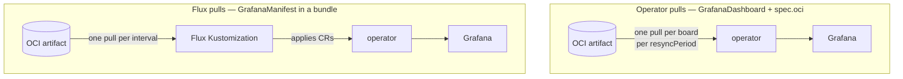
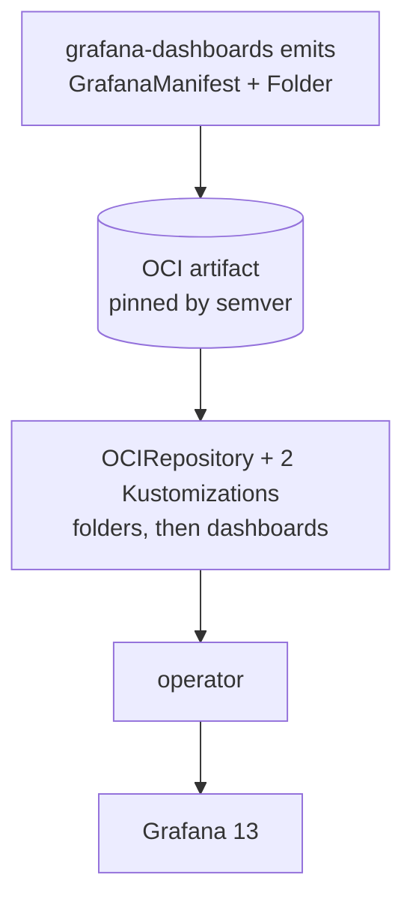

# Dashboard V2: which resource carries which schema

Two different things here are called a version, both spell some of their values
`v1beta1`, and picking the wrong combination produces a board that either refuses to
apply or applies and shows nothing. This page is the map.

Everything was measured on 2026-09-21 on a Kind cluster built to match this platform:
Grafana Operator **5.25.0**, `grafana/grafana:13.2.0`, one `Grafana` CR labelled
`dashboards: grafana`. Where a claim came from reading source rather than running it,
the file is named.

---

## 1. The two version axes

The single most useful thing to hold on to: **the `apiVersion` you type is not the
version you are choosing.**



| Axis | What it is | Values that exist |
|---|---|---|
| `grafana.integreatly.org/v1beta1` | the **operator's own CRD API** | `v1beta1`, and nothing else |
| `dashboard.grafana.app/...` | the **Grafana dashboard schema** | see the discovery output below |

Grafana Operator 5.25.0 ships 13 CRDs and every one has exactly one version, `v1beta1`,
served and stored (`api/v1beta1/groupversion_info.go`; there is no other `api/` package).
There is no `grafana.integreatly.org/v2` and there never has been in v5. So every
resource you write says `v1beta1`, and **the axis you actually choose on is the `kind`**.

What this Grafana serves, read from its own discovery endpoint:

```console
$ kubectl -n monitoring port-forward svc/grafana-service 3000:3000
$ curl -s -u admin:admin http://127.0.0.1:3000/apis | jq -r '.groups[]
    | select(.name|test("dashboard|folder"))
    | "\(.name) -> \([.versions[].version]|join(", "))"'
dashboard.grafana.app -> v2, v2beta1, v2alpha1, v0alpha1, v1, v1beta1
folder.grafana.app    -> v1, v1beta1
```

`dashboard.grafana.app/v2` is served here, which matters because that is the exact
string the Grafana Foundation SDK's `dashboardv2` package emits
(`DashboardAPIVersion = "dashboard.grafana.app/v2"`). On Grafana 12.0 and 12.1 it is
**not** served; the newest there is `v2alpha1`. Run the command above before assuming.

---

## 2. Why the classic resource cannot carry a v2 board

`GrafanaDashboard` posts through the legacy `POST /api/dashboards/db` envelope. That is
not a setting, it is what `controllers/dashboard_controller.go` does via
`models.SaveDashboardCommand`. The content sources — `oci`, `url`, `configMapRef`,
`json`, `grafanaCom`, `jsonnet` — are only transports for the bytes; none of them
changes which schema the controller can speak. The operator docs have said so since
5.25.0: *"The GrafanaDashboard CR only supports V1 dashboards (legacy API)."*

Two attempts, both rejected, each with a message worth being able to recognise.

**Attempt A, the bare v2 spec** (`elements`, `layout`, no `panels`):

```
DashboardSynchronized=False  reason=ApplyFailed
[POST /dashboards/db][400] {"message":"dashboard appears to be in v2 format.
 Please use the /apis/dashboard.grafana.app/v2 API OR it should include a object
 wrapper with an explicit 'apiVersion' and move the body into a 'spec' element"}
```

**Attempt B, the wrapped object that message asks for** — the full
`{apiVersion, kind, metadata, spec}`:

```
DashboardSynchronized=False  reason=ApplyFailed
[POST /dashboards/db][400] {"message":"The k8s style dashboard must not include
 an id on the root element"}
```

Attempt B is the interesting one, because it is not fixable from the dashboard side.
The operator's content resolver sets `contentModel["id"] = nil` on every model before
posting (`controllers/content/resolver.go`), so the root always carries an `id`, and
Grafana's v2 path refuses it. Whatever you put in the artifact, the operator adds the
field that gets it rejected.



> **The 12.0.0 trap.** On Grafana 12.0.0, attempt A reports
> `DashboardSynchronized=True`. That is a false green: the legacy save path accepts
> fairly arbitrary JSON and stores something that is not a usable dashboard. Any check
> that asserts only the CR condition, on 12.x, proves nothing. Read the dashboard back
> before believing it.

---

## 3. The resource that does work

`GrafanaManifest` wraps a Grafana App Platform object and applies it with a
discovery-based dynamic client against `/apis` (`controllers/manifest_controller.go`,
`controllers/client/dynamic_client.go`), so it speaks the same protocol as the schema.



Applied on 13.2.0 the CR reports `ManifestSynchronized=True (ApplySuccessful)`, and the
board reads back from Grafana's own apiserver:

| Dashboard | title | elements | layout rows | folder |
|---|---|---|---|---|
| `temporal-worker-v2` | Temporal — Workflows & Activities | 8 | 3 | `as-code-canary` |
| `business-otel-v2` | Microservices — Business KPIs | 38 | 10 | `as-code-canary` |

Those two rows are the original canary measurement, kept as the record of how this was
established. The canary itself is gone — see §9; the boards now carry their real UIDs in
their real folders, and `temporal-worker` has since grown from 8 panels to 21.

### The wire contract

Three layers, each with its own `apiVersion`, and this is where the confusion usually
bites. The same contract is enforced in CI by `duynhlab/grafana-dashboards`, whose
generator emits exactly this shape and whose Kind e2e reads each board back through
`/apis` to prove it.

```yaml
apiVersion: grafana.integreatly.org/v1beta1   # (1) the OPERATOR's CRD
kind: GrafanaManifest
metadata:
  name: temporal-worker-v2                    # the Kubernetes object name
  namespace: monitoring                       # where the operator watches
spec:
  instanceSelector:
    matchLabels:
      dashboards: grafana                     # binds to the Grafana CR's label
  resyncPeriod: 10m
  template:
    apiVersion: dashboard.grafana.app/v2      # (2) the GRAFANA SCHEMA
    kind: Dashboard
    metadata:
      name: temporal-worker-v2                # becomes the dashboard UID
      namespace: default                      # Grafana's own tenant namespace
      annotations:
        grafana.app/folder: as-code-canary    # (3) resolves to a Folder resource
    spec:
      title: ...
      elements: {...}
      layout: {...}
      variables: []
```

And the folder it names, a sibling manifest:

```yaml
apiVersion: grafana.integreatly.org/v1beta1
kind: GrafanaManifest
metadata:
  name: as-code-canary-folder                 # note: -folder on the K8s name
  namespace: monitoring
spec:
  instanceSelector:
    matchLabels: {dashboards: grafana}
  resyncPeriod: 10m
  template:
    apiVersion: folder.grafana.app/v1         # a different group entirely
    kind: Folder
    metadata:
      name: as-code-canary                    # the bare UID the annotation points at
      namespace: default
    spec:
      title: As-Code (V2 canary)
```

Four things trip people up here, all of them silent if you get them wrong:

1. The **outer** namespace is `monitoring` (where the operator watches). The **inner**
   namespace is `default` (Grafana's tenant namespace). They are not the same field and
   not the same thing.
2. The inner `metadata.name` is the dashboard **UID**, not a display name. The title
   lives in `spec.title`.
3. The folder annotation takes the folder's **UID**, which is the folder manifest's
   *inner* name, not the outer `-folder` one.
4. `template.metadata.name`, `template.metadata.namespace` and `template.kind` are
   **immutable** after creation. Renaming means delete and recreate.

---

## 4. Choosing between the two



| | `GrafanaDashboard` | `GrafanaManifest` |
|---|---|---|
| Dashboard schema | v1 only | v2 (any App Platform kind, in fact) |
| Content sources | `json`, `gzipJson`, `url`, `configMapRef`, `grafanaCom`, `jsonnet`, `oci` | **none** — inline only |
| Folder | `spec.folder` title, or `folderUID` / `folderRef` | `grafana.app/folder` annotation → a `Folder` resource |
| Datasource input mapping | `spec.datasources` | not available |
| Readiness condition | `DashboardSynchronized` | `ManifestSynchronized` |
| Talks to | `/api/dashboards/db` | `/apis/<group>/<version>/...` |

### The one thing `GrafanaManifest` gives up

It has **no content sources at all**. Verified against the CRD rather than the docs:

```console
$ curl -s https://raw.githubusercontent.com/grafana/grafana-operator/v5.25.0/\
config/crd/bases/grafana.integreatly.org_grafanamanifests.yaml \
  | yq '.spec.versions[0].schema.openAPIV3Schema.properties.spec.properties | keys'
[allowCrossNamespaceImport, instanceSelector, patch, resyncPeriod, suspend, template]
```

No `oci`, no `url`, no `configMapRef`. The dashboard body sits in the CR, so it lands in
etcd and is bounded by the ~1 MiB object limit. Our two canary boards are 10 KiB and
41 KiB of JSON, comfortable, but a board past a few hundred KiB needs a rethink rather
than a bigger file.

This is an **operator** gap, not a Grafana one. `spec.oci` arrived on `GrafanaDashboard`
in 5.24; `GrafanaManifest` never inherited that family of fields, and no open issue on
the operator repo asks for it. Do not plan around it appearing.

---

## 5. OCI is still in the picture, one layer up

Losing `spec.oci` does **not** mean copying dashboard JSON into this repository forever.
It means the pull moves from the operator to Flux.



Either way the source of truth is one OCI artifact and this repository holds no
dashboard JSON. The difference is who pulls and how often.

`obs-as-code` moved to the Flux side deliberately, and the reason is worth repeating
because it is easy to assume `spec.oci` is strictly better: the operator's OCI fetcher
has **no cache read path**. `GetContentCache` is consulted only for `url:` and
`grafanaCom:` sources, so every resync is a full registry pull of an artifact that is
immutable per tag, multiplied by the number of boards. At `resyncPeriod: 30s` that is
roughly 2,880 pulls a day per board. Flux pulls the bundle once per interval, applies,
prunes, and reports a single revision.

The wiring for that pattern lives in
`kubernetes/clusters/local/sources/oci/grafana-dashboards-as-code-oci.yaml` plus
`grafana-dashboards-as-code-folders.yaml` and `grafana-dashboards-as-code-dashboards.yaml`.

---

## 6. Ordering: the folder must exist first

The operator applies each `GrafanaManifest` independently and in **no guaranteed
order**. A board whose `grafana.app/folder` names a folder that does not exist yet fails
outright:

```
applying resource: creating resource:
  folders.folder.grafana.app "as-code-canary" not found
```

and then waits for the operator's next resync. At `resyncPeriod: 10m` against a Flux
wave `timeout: 5m`, the retry always lands after the deadline, so the wave sits red
rather than riding it out. This was measured on a cold bring-up of the obs-as-code
canary: six minutes of `HealthCheckFailed`.

Listing the folder first inside one kustomization is **not** a guarantee — kustomize
ordering is not apply ordering for independent controllers. Only `dependsOn` between two
Flux Kustomizations is. The three canary resources here sit in one kustomization because
they arrive in a single apply; if they ever split into waves, the dashboards wave must
`dependsOn` the folder wave.

One more Flux detail: `GrafanaManifest` reports `ManifestSynchronized`, not the `Ready`
condition kstatus expects, so any Kustomization gating on it needs the
`healthCheckExprs` CEL block that `grafana-dashboards-as-code-dashboards.yaml` carries.

---

## 7. The `spec.oci` boards, and why they are gone

Two `GrafanaDashboard` resources used to fetch `kubernetes-cluster-overview` and
`kubernetes-workloads` from `ghcr.io/duynhlab/obs-as-code:v0.3.0`. That payload was
**classic v1 JSON** — top-level `title`, `uid`, `panels`, `schemaVersion` — so the classic
kind carried it correctly and those two CRs were right as written.

The trap was the pin, and it is worth keeping on record because it generalises:

```console
$ flux pull artifact oci://ghcr.io/duynhlab/obs-as-code:v0.3.0 --output /tmp/a
$ jq -r 'keys|join(", ")' /tmp/a/cluster/dashboards/kubernetes-cluster-overview.json
annotations, editable, ..., panels, refresh, schemaVersion, tags, templating, time, title, uid

$ flux pull artifact oci://ghcr.io/duynhlab/obs-as-code:v0.5.1 --output /tmp/b
$ jq -r '.apiVersion, (.title // "no top-level title")' /tmp/b/cluster/dashboards/kubernetes-cluster-overview.json
dashboard.grafana.app/v2
no top-level title
```

Same path, same filename, different schema. Bumping `reference` on those two CRs without
also moving them to `GrafanaManifest` would have swapped a working board for one of the
two 400s in §2.

Both boards now come from `duynhlab/grafana-dashboards` as `GrafanaManifest` instead, so
the CRs and that artifact are deleted. `kubernetes-workloads` was ported there first
precisely so retiring this delivery would not lose it.

## 8. The query-variable defects, and what correct looks like

**Fixed upstream; kept because it is the reference for the correct shape.** Boards
carrying query variables used to be **rejected outright** by Grafana's apiserver — not
"rendered empty", rejected:

```
Dashboard.dashboard.grafana.app "exp4-pgdog" is invalid:
  DashboardSpec.variables: Invalid value: incompatible list lengths (0 and 7),
  DashboardSpec.variables.0.kind: Invalid value: conflicting values
    "AdhocVariable" and "QueryVariable",
  DashboardSpec.variables.0.kind: Invalid value: conflicting values
    "ConstantVariable" and "QueryVariable", ...
```

The union discrimination fails because the variable does not match any variant. Three
defects, each one already hit and fixed on this platform by `obs-as-code`:

| Field | What the repo emits today | What works | Why it matters |
|---|---|---|---|
| `current` | `{"text":"","value":""}` | `{"text":"All","value":"$__all"}` | v2 serialises `current` with no `omitempty`, so an unset one becomes an empty string, and Grafana reads that as a **real selection**. `$var` expands to `""`. Measured: `namespace=~""` returned 0 points where `namespace=~".*"` returned 28 |
| `query` | `{group:"", version:"v0", spec:null}`, expression only in `definition` | `spec: {qryType: 1, query: "label_values(...)", refId: "PrometheusVariableQueryEditor-VariableQuery"}` | a variable query is **not PromQL**. Put it in `expr` and the datasource answers `422: unsupported function "label_values"`; leave it only in `definition` and nothing reaches the datasource at all |
| `allowCustomValue` | `true`, the SDK default | `false` | a reader can type a value that does not exist and get a silently empty panel |

Classic dashboards accepted `query` as a bare string and parsed `label_values()`
themselves, which is why the v1 boards never showed this. V2's `QueryVariableSpec.Query`
is a `DataQueryKind` with no string variant, so the classic form cannot be expressed and
reaching for `expr` looks like the natural substitute. It is not.

All three defects are fixed in `duynhlab/grafana-dashboards`, and a registry-wide
conformance test asserts each of them across every board, so a regression fails the build
rather than the cluster. All 18 boards now apply and read back through `/apis` on
Grafana 13.2.0, query variables included.

### A fourth difference, a choice rather than a defect

Our panels name the datasource as a literal `{"name": "prometheus"}`. In the v2 schema
that string is a **uid**, and this platform does have a datasource with uid `prometheus`
(the alias in `datasource-prometheus-alias.yaml`), so it resolves. The alternative is a
`DatasourceVariable` referenced as `${ds}`, keeping the uid in one place and surviving a
rename; `obs-as-code` does that and rejects literals in CI. Worth knowing that the two
strings are different kinds of thing: writing a **display name** where a uid belongs is
what made every obs-as-code board render empty at v0.4.0.

---

## 9. Current state: the cutover is done

The two canary boards that used to sit beside this file carried their spec **inline**,
duplicating JSON that already lived in `duynhlab/grafana-dashboards`. That was always
described here as deliberate and temporary. It is now finished.



All three upstream changes that section listed have landed:

1. **The query-variable builder is fixed.** The expression now sits in `query.spec` as
   `{qryType: 1, query, refId}` with the datasource plugin as `query.group`, `current`
   defaults to `All`/`$__all` instead of the empty string, and `allowCustomValue` is
   false. A registry-wide conformance test fails the build if any of the three regress,
   so the failure mode is a red CI run rather than a silently empty picker.
2. **`GrafanaManifest` resources are emitted**, with a `folder.grafana.app/v1` manifest
   per folder, and the `GrafanaDashboard` + `spec.oci` output is gone — keeping it would
   have meant shipping a resource that 400s against its own boards. That repo's Kind e2e
   now runs Grafana 13.2.0 and reads every board back through
   `/apis/dashboard.grafana.app/v2/...`, comparing title and element count, so the false
   green from §2 cannot reappear.
3. **It publishes from `main` and from `v*` tags**, so this repo pins a semver.

The inline canaries, the `-v2` suffixed UIDs and the `as-code-canary` folder are deleted.
The boards now carry their real UIDs in their real folders.

## 10. Reproducing any of this

```bash
kind create cluster --name grafana-v2-lab
helm upgrade --install grafana-operator \
  oci://ghcr.io/grafana/helm-charts/grafana-operator \
  --version 5.25.0 -n monitoring --create-namespace --wait

# Grafana CR with the image pinned to what this platform runs, and the label
# every instanceSelector in this repo binds to.
kubectl apply -f - <<'EOF'
apiVersion: grafana.integreatly.org/v1beta1
kind: Grafana
metadata: {name: grafana, namespace: monitoring, labels: {dashboards: grafana}}
spec:
  config: {security: {admin_user: admin, admin_password: admin}}
  deployment:
    spec:
      template:
        spec:
          containers: [{name: grafana, image: "grafana/grafana:13.2.0"}]
EOF
kubectl wait --for=jsonpath='{.status.stage}'=complete grafana/grafana -n monitoring --timeout=7m
kubectl wait --for=condition=Available deploy/grafana-deployment -n monitoring --timeout=7m
kubectl -n monitoring port-forward svc/grafana-service 3000:3000 &

# Which schema versions does this Grafana actually serve?
curl -s -u admin:admin http://127.0.0.1:3000/apis | jq -r '.groups[]
  | select(.name|test("dashboard|folder")) | "\(.name): \([.versions[].version]|join(", "))"'

# Apply a manifest, then READ IT BACK. The CR condition alone is not evidence —
# that is the entire lesson of the 12.0.0 false green.
kubectl apply -f kubernetes/infra/configs/observability/grafana/dashboards/grafana-manifest-as-code-folder.yaml
kubectl apply -f kubernetes/infra/configs/observability/grafana/dashboards/grafana-manifest-temporal-worker-v2.yaml
kubectl get grafanamanifest -n monitoring
curl -s -u admin:admin \
  http://127.0.0.1:3000/apis/dashboard.grafana.app/v2/namespaces/default/dashboards/temporal-worker-v2 \
  | jq '{title: .spec.title, elements: (.spec.elements|length)}'

kind delete cluster --name grafana-v2-lab
```

Failure signatures and where they show up:

| Symptom | Look at | Likely cause |
|---|---|---|
| `DashboardSynchronized=False`, 400 "appears to be in v2 format" | the CR's condition message | v2 payload on the classic kind (§2) |
| `ManifestSynchronized=False`, "folders... not found" | the CR's condition message | folder applied after the board (§6) |
| `ManifestSynchronized=False`, "conflicting values ... QueryVariable" | the CR's condition message | malformed query variable (§8) |
| Condition True, board empty in the UI | `/api/ds/query` in the browser devtools | datasource uid vs display name, or a variable expanding to `""` (§8) |
| Condition True on Grafana 12.x, board is nonsense | read the board back | the false green (§2) |

---

## See also

- [README.md](README.md) — the dashboard inventory and the other delivery mechanisms
- [datasources.md](datasources.md) — the three prometheus-flavoured datasources and their uids
- `kubernetes/clusters/local/obs-as-code-{folders,dashboards}.yaml` — the Flux wiring
  this canary will eventually adopt, including the `healthCheckExprs` block

_Last updated: 2026-09-23 — the cutover in §9 is done: all 18 boards ship as
GrafanaManifest from `duynhlab/grafana-dashboards`, the canaries and the `spec.oci` pair
are deleted, and §7/§8 are rewritten as history rather than open work. Previously
2026-09-21 — first version. All measurements from a Kind run against
Grafana Operator 5.25.0 and `grafana/grafana:13.2.0`._
