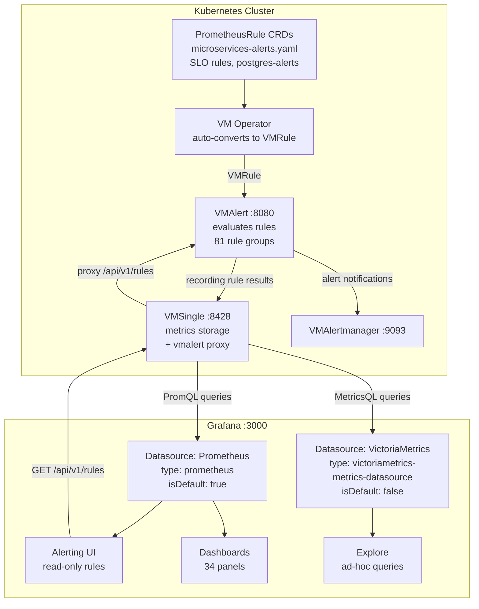
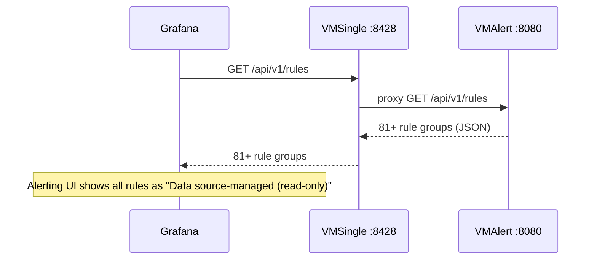

# Grafana Datasource Strategy: Prometheus vs VictoriaMetrics Plugin

## Context

After migrating from `kube-prometheus-stack` to the **VictoriaMetrics Operator**, the metrics storage backend is VMSingle -- which is fully Prometheus API compatible. VictoriaMetrics also provides a native Grafana datasource plugin (`victoriametrics-metrics-datasource`) with additional capabilities.

This document explains why we run **both** datasources and when to use each.

## Architecture



## The Two Datasources

### Prometheus Datasource (Default)

| Property | Value |
|----------|-------|
| **Name** | `Prometheus` |
| **Type** | `prometheus` |
| **UID** | `prometheus` |
| **Default** | Yes |
| **URL** | `http://vmsingle-victoria-metrics.monitoring.svc:8428` |

**Use for:**
- All existing dashboards (they reference `$DS_PROMETHEUS`)
- Grafana Alerting UI (read-only rule display)
- Grafana-managed alert rules (if ever needed)
- Standard PromQL queries

**Why it must be default:**
Grafana's built-in alerting system **only supports** `prometheus`, `loki`, and their forks as datasource types for alert rule evaluation and display. The VictoriaMetrics plugin explicitly states:

> *"Grafana alerting is not supported for datasource types other than prometheus, loki, and their respective forks."*

Since VMSingle is 100% Prometheus API compatible, the `prometheus` datasource type works perfectly for all PromQL operations.

**CRD**: `kubernetes/infra/configs/monitoring/grafana/datasource-prometheus.yaml`

### VictoriaMetrics Datasource (Secondary)

| Property | Value |
|----------|-------|
| **Name** | `VictoriaMetrics` |
| **Type** | `victoriametrics-metrics-datasource` |
| **UID** | `victoriametrics` |
| **Default** | No |
| **URL** | `http://vmsingle-victoria-metrics.monitoring.svc:8428` |
| **Plugin Version** | 0.23.1 |

**Use for:**
- MetricsQL-specific queries (VictoriaMetrics extensions to PromQL)
- `WITH` templates for complex query reuse
- Built-in VMUI integration from Grafana Explore
- Ad-hoc investigation where MetricsQL functions help

**MetricsQL advantages over PromQL:**

| Feature | PromQL | MetricsQL |
|---------|--------|-----------|
| `WITH` templates | Not supported | `WITH (rps = rate(requests_total[5m])) rps > 100` |
| `keep_metric_names` | Not supported | Preserves metric name after aggregation |
| `range_median` | Not supported | `range_median(cpu_usage[1h])` |
| `label_graphite_group` | Not supported | Parse Graphite-style labels |
| Implicit `[5m]` range | Must specify | Auto-fills range vector if omitted |
| Subquery optimization | Limited | Optimized execution |

**Limitation**: Does NOT support Grafana Alerting UI. Alert rules will not appear when this datasource is selected.

**CRD**: `kubernetes/infra/configs/monitoring/grafana/datasource-victoriametrics.yaml`

## Decision Matrix

| Use Case | Datasource | Why |
|----------|------------|-----|
| Dashboard panels | Prometheus | Default, referenced by `$DS_PROMETHEUS` |
| Alert rules display | Prometheus | Only `prometheus` type shows read-only rules |
| Grafana-managed alerts | Prometheus | Grafana alerting requirement |
| Standard PromQL | Prometheus | Native support |
| MetricsQL queries | VictoriaMetrics | `WITH`, `keep_metric_names`, etc. |
| VMUI from Grafana | VictoriaMetrics | Built-in integration |
| Ad-hoc exploration | Either | Choose based on query complexity |
| New dashboard creation | Prometheus | Maintain consistency with existing dashboards |

**Rule of thumb**: Use Prometheus datasource by default. Switch to VictoriaMetrics datasource only when you need MetricsQL-specific features.

## Logs: Loki vs VictoriaLogs plugin

Metrics uses two Grafana datasources pointing at one backend (Prometheus type + VictoriaMetrics plugin). Logs follow a similar **learning / dual-backend** pattern: one ingestion path (Vector), two query UIs.

| Datasource | Type | Backend | Query language | Best for |
|------------|------|---------|----------------|----------|
| **Loki** | `loki` | Loki `:3100` | LogQL | Default dashboards, Grafana log-to-trace correlation (derived fields), Logs Drilldown |
| **VictoriaLogs** | `victoriametrics-logs-datasource` | VLSingle `:9428` | LogsQL | VM plugin features, high-volume Explore, same streams as [`victorialogs.md`](../logging/victorialogs.md) |

**CRDs**: `datasource-loki.yaml`, `datasource-victorialogs.yaml`. Plugins: see [Grafana README](README.md#plugins).

**Rule of thumb**: Use **Loki** for day-to-day correlation with traces in Grafana. Use **VictoriaLogs** when practicing LogsQL or comparing query behavior with Loki.

## How Read-Only Rules Work: `vmalert.proxyURL`

### The Problem

Grafana's Alerting UI queries `/api/v1/rules` on the configured Prometheus datasource to display alert rules. But VMSingle is a **storage engine** -- it stores and queries metrics. It does not evaluate rules. That is VMAlert's job.

Without configuration:
- Grafana calls `VMSingle:8428/api/v1/rules` -> returns **empty** (0 groups)
- VMAlert has **81+ rule groups** loaded, but Grafana never asks it

### The Solution

VMSingle supports `-vmalert.proxyURL` flag. When set, VMSingle **proxies** specific API endpoints to VMAlert:

| Endpoint | Proxied To | Purpose |
|----------|-----------|---------|
| `/api/v1/rules` | VMAlert | Alert + recording rules (Grafana reads this) |
| `/api/v1/alerts` | VMAlert | Currently firing alerts |
| `/vmalert/` | VMAlert | VMAlert's own web UI |

Configuration in `vmsingle.yaml`:

```yaml
apiVersion: operator.victoriametrics.com/v1beta1
kind: VMSingle
metadata:
  name: victoria-metrics
  namespace: monitoring
spec:
  extraArgs:
    dedup.minScrapeInterval: "15s"
    vmalert.proxyURL: "http://vmalert-victoria-metrics.monitoring.svc:8080"
```

### Data Flow After Fix



### What Grafana Shows

After enabling `vmalert.proxyURL`, the Grafana **Alerting > Alert rules** page displays:

| Rule Group Category | Count | Source |
|---------------------|-------|--------|
| PostgreSQL alerts | 14 alerts (5 groups) | `postgres-alerts.yaml` |
| SLO burn-rate alerts | 48 alerts (24 groups) | Sloth Operator |
| Microservices alerts | 18 alerts (6 groups) | `microservices-alerts.yaml` |
| Recording rules | 44+ groups | pg-exporter, SLO SLI/meta |

All displayed as **read-only** -- they cannot be edited in Grafana because they are managed externally via `PrometheusRule` CRDs in Git.

## Interview Reference

**Q: "How do you manage alert rules?"**

> We use a GitOps approach. Alert rules are defined as `PrometheusRule` CRDs in our Git repository. The VictoriaMetrics Operator auto-converts them to `VMRule` resources, which VMAlert evaluates. Grafana displays them as read-only rules via the `vmalert.proxyURL` proxy -- so the team can browse all rules in the Grafana UI, but changes must go through Git (PR review, CI validation, Flux reconciliation). This ensures 100% configuration consistency and audit trail.

**Q: "Why two datasources pointing to the same backend?"**

> Grafana's alerting system only works with `prometheus`-type datasources. But VictoriaMetrics extends PromQL with MetricsQL features like `WITH` templates and `keep_metric_names` that are useful for ad-hoc analysis. So we keep the Prometheus datasource as default (dashboards, alerts) and the VictoriaMetrics plugin as secondary (exploration, MetricsQL). Both point to the same VMSingle backend -- zero data duplication, just different query capabilities.

## Related Documentation

- [Grafana Overview](README.md) -- deployment, plugins, manifest locations
- [Dashboard Reference](dashboard-reference.md) -- 34-panel dashboard
- [Alerting Strategy](../alerting/README.md) -- 2-layer alerting approach
- [VictoriaMetrics Operator](../metrics/victoriametrics.md) -- stack architecture
- [Microservices Alerts Runbook](../runbooks/microservices-alerts.md) -- per-alert investigation guide
