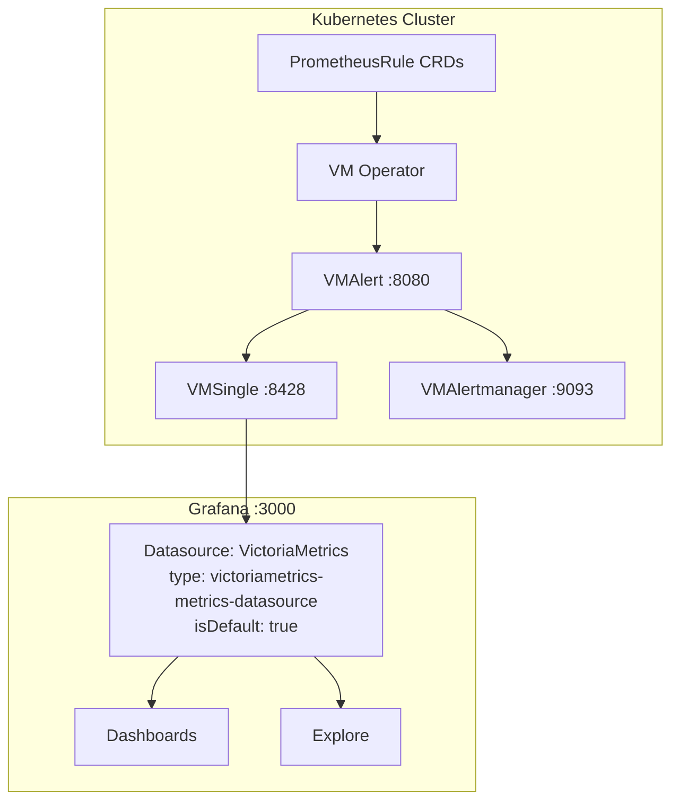

# Grafana metrics datasource: VictoriaMetrics plugin

## Context

Metrics are stored in **VMSingle** (`:8428`). Grafana uses the **VictoriaMetrics Grafana plugin** (`victoriametrics-metrics-datasource`) as the **only** metrics datasource — PromQL-compatible queries and **MetricsQL** extensions against the same backend.

There is **no** separate `type: prometheus` Grafana datasource in GitOps anymore (removed to avoid duplicating the same endpoint).

## Architecture

## Metrics datasource (CRD)

| Property | Value |
|----------|-------|
| **Name** | `VictoriaMetrics` |
| **Type** | `victoriametrics-metrics-datasource` |
| **UID** | `victoriametrics` |
| **Default** | Yes |
| **URL** | `http://vmsingle-victoria-metrics.monitoring.svc:8428` |
| **Plugin** | `victoriametrics-metrics-datasource` (see [Grafana README](README.md#plugins)) |

**CRD**: [`kubernetes/infra/configs/monitoring/grafana/datasource-victoriametrics.yaml`](../../../kubernetes/infra/configs/monitoring/grafana/datasource-victoriametrics.yaml)

**Dashboard variable name**: many dashboards still use the variable name **`DS_PROMETHEUS`** for historical reasons; it resolves to the **VictoriaMetrics** datasource via `GrafanaDashboard` `datasources` mapping (`inputName` → `datasourceName: VictoriaMetrics`).

## Grafana Alerting UI caveat

Upstream Grafana historically optimizes **Alerting > Alert rules** for datasources of type **`prometheus`** / **`loki`**. With **only** the VictoriaMetrics plugin:

- **Verify** after upgrades that **data source-managed** (read-only) rules still appear as expected. If they do not, use **VMAlert** UI (`/vmalert/` on the proxy path), or query rules via `kubectl` / GitOps.
- `vmalert.proxyURL` on VMSingle still proxies `/api/v1/rules` to VMAlert; the Grafana datasource URL is the same VMSingle service — behavior depends on Grafana version and plugin.

**Operational note**: rule definitions remain GitOps (`PrometheusRule` → VMRule → VMAlert); this only affects **how** Grafana displays them in the UI.

## MetricsQL vs PromQL

The VictoriaMetrics plugin supports PromQL-compatible queries and MetricsQL extras (`WITH`, `keep_metric_names`, etc.). See [VictoriaMetrics docs](https://docs.victoriametrics.com/metricsql/).

## Logs: Loki vs VictoriaLogs plugin

Logs use a **dual-backend** pattern (Vector → Loki + VictoriaLogs), unrelated to the metrics datasource change.

| Datasource | Type | Backend | Query language | Best for |
|------------|------|---------|----------------|----------|
| **Loki** | `loki` | Loki `:3100` | LogQL | Default dashboards, trace correlation |
| **VictoriaLogs** | `victoriametrics-logs-datasource` | VLSingle `:9428` | LogsQL | VM plugin workflow, [`victorialogs.md`](../logging/victorialogs.md) |

**CRDs**: `datasource-loki.yaml`, `datasource-victorialogs.yaml`.

## How read-only rules work: `vmalert.proxyURL`

VMSingle can proxy rule endpoints to VMAlert:

| Endpoint | Proxied to | Purpose |
|----------|------------|---------|
| `/api/v1/rules` | VMAlert | Alert + recording rules |
| `/api/v1/alerts` | VMAlert | Firing alerts |
| `/vmalert/` | VMAlert | VMAlert UI |

Configured on `VMSingle` via `vmalert.proxyURL` in [`vmsingle.yaml`](../../../kubernetes/infra/configs/monitoring/victoriametrics/vmsingle.yaml) (or equivalent).

## Interview reference

**Q: "Where are alert rules defined?"**

> GitOps: `PrometheusRule` CRDs → VM Operator → VMAlert. Grafana may show them as read-only when the datasource and Grafana version cooperate; otherwise VMAlert UI or the API.

**Q: "Why VictoriaMetrics plugin only?"**

> Single datasource to the same VMSingle backend, native MetricsQL and VMUI integration, fewer duplicate datasource definitions.

## Related documentation

- [Grafana Overview](README.md)
- [Variables](variables.md) — `$DS_PROMETHEUS` naming
- [Alerting Strategy](../alerting/README.md)
- [VictoriaMetrics Operator](../metrics/victoriametrics.md)
