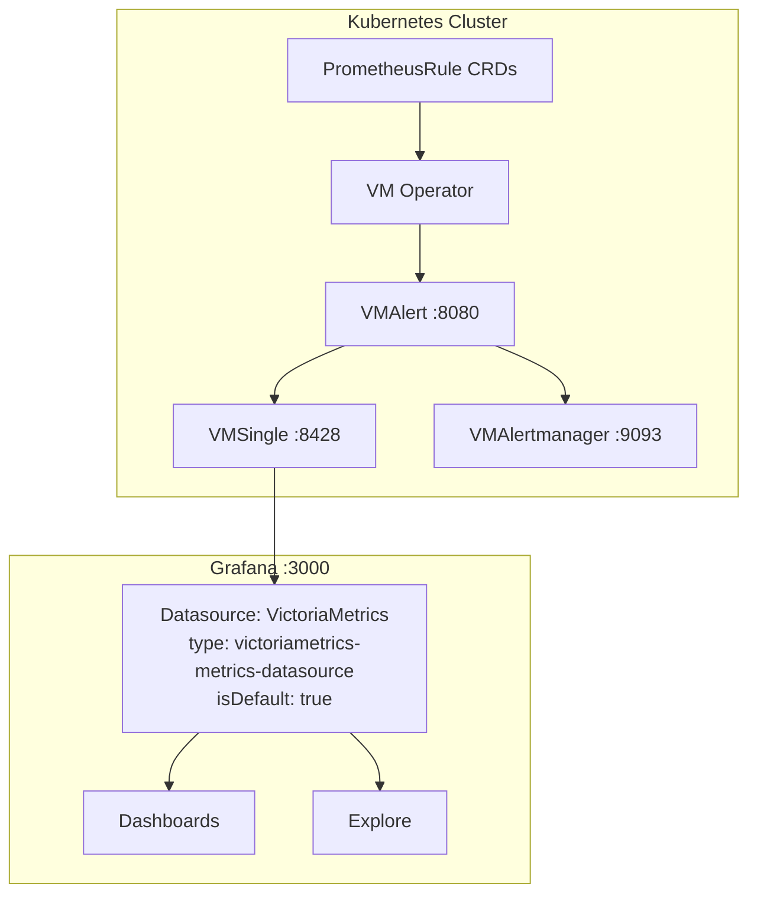

# Grafana metrics datasource: VictoriaMetrics plugin

## Context

Metrics are stored in **VMSingle** (`:8428`). Grafana uses the **VictoriaMetrics Grafana plugin** (`victoriametrics-metrics-datasource`) as the **only** metrics datasource — PromQL-compatible queries and **MetricsQL** extensions against the same backend.

There is **no** separate `type: prometheus` Grafana datasource in GitOps anymore (removed to avoid duplicating the same endpoint). That choice trades away **one** UX feature: Grafana’s **Alerting → Alert rules** page may not list **data source–managed (read-only)** rules as reliably as when a native **`prometheus`** datasource is configured (see [Grafana Alerting and datasource types](#grafana-alerting-and-datasource-types)).

## Architecture

## Metrics datasource (CRD)

| Property | Value |
|----------|-------|
| **Name** | `VictoriaMetrics` |
| **Type** | `victoriametrics-metrics-datasource` |
| **UID** | `victoriametrics` |
| **Default** | Yes |
| **URL** | `http://vmsingle-victoria-metrics.monitoring.svc:8428` |
| **Plugin** | `victoriametrics-metrics-datasource` (see [Grafana README](README.md#plugins)) |

**CRD**: [`kubernetes/infra/configs/monitoring/grafana/datasource-victoriametrics.yaml`](../../../kubernetes/infra/configs/monitoring/grafana/datasource-victoriametrics.yaml)

**Dashboard variable name**: many dashboards still use the variable name **`DS_PROMETHEUS`** for historical reasons; it resolves to the **VictoriaMetrics** datasource via `GrafanaDashboard` `datasources` mapping (`inputName` → `datasourceName: VictoriaMetrics`).

## Grafana Alerting and datasource types

### What “read-only” rules are

In **Alerting → Alert rules**, Grafana can show:

| Kind | Stored in | In this repo |
|------|-----------|--------------|
| **Grafana-managed** | Grafana database | Not used for platform alerts |
| **Data source–managed (read-only)** | External system; Grafana only **displays** them | Yes — rules come from **VMAlert** (fed by `PrometheusRule` → VMRule) |

Evaluation and routing are **always** on **VMAlert** / **VMAlertmanager**; nothing in this section changes **where** rules are defined (GitOps) or **how** they fire.

### VictoriaMetrics plugin vs Grafana’s ruler integration

- The **`victoriametrics-metrics-datasource`** plugin is aimed at **metrics queries** (dashboards, Explore, MetricsQL). Grafana’s **Unified Alerting** UI discovers **data source–managed** rules most reliably for datasources Grafana treats as **Prometheus-compatible rulers** — typically **`type: prometheus`** (and **`loki`** for log-based rules).
- With **only** the VM plugin as the metrics default, **Alerting → Alert rules** may show **few or no** read-only rule groups, or behave differently after Grafana/plugin upgrades. That is a **Grafana UI integration** limitation, **not** proof that rules are missing from the cluster.

### The API still exists on VMSingle

VMAlert continues to hold the rule definitions. **VMSingle** can **proxy** ruler HTTP endpoints to VMAlert via `vmalert.proxyURL` (see [below](#how-read-only-rules-work-vmalertproxyurl)). So **`/api/v1/rules`** is available **at the VMSingle URL** for clients that speak the Prometheus ruler API — the gap is whether **Grafana’s datasource implementation** uses that path for **its** Alerting UI when the datasource type is the VM plugin.

### Optional: add a `prometheus` datasource for the Alerting UI only

If you want Grafana’s **read-only** rule list to behave like a classic Prometheus stack **without** changing where metrics live:

1. Add a second **`GrafanaDatasource`** with **`type: prometheus`**, **`access: proxy`**, and the **same URL** as VMSingle: `http://vmsingle-victoria-metrics.monitoring.svc:8428`.
2. Set **`isDefault: false`** so dashboards and Explore keep using the **VictoriaMetrics** datasource (MetricsQL, single canonical DS for panels).
3. In **Alerting → Alert rules**, pick this **Prometheus** datasource when Grafana asks which data source manages external rules (wording varies by Grafana version).

**Trade-offs**

| Approach | Pros | Cons |
|--------|------|------|
| **VM plugin only** (current GitOps) | One metrics datasource, no duplicate endpoint in the UI list | Alerting UI may not list read-only rules fully |
| **VM plugin + Prometheus DS (same VMSingle URL)** | Grafana Alerting UI often shows read-only rules as expected | Two CRDs for the same HTTP API; operators must know **dashboards = VM**, **ruler listing = Prometheus type** |

Rules are **not** evaluated twice: both datasource types point at **VMSingle**, which queries metrics from storage and proxies **`/api/v1/rules`** to **VMAlert**.

### If Grafana still shows nothing useful

Use the operational paths that do not depend on Grafana’s ruler UI:

- **VMAlert** UI via VMSingle proxy path **`/vmalert/`** (see [table below](#how-read-only-rules-work-vmalertproxyurl)).
- **Karma** (Alertmanager-style UI on VMAlertmanager) — [Alerting strategy](../alerting/README.md).
- **GitOps / API**: `kubectl get prometheusrules,vmrule -A`, or `curl` against VMSingle **`/api/v1/rules`** / **`/api/v1/alerts`**.

**After upgrades**: re-check Grafana + `victoriametrics-metrics-datasource` versions; ruler UI behavior can change.

## MetricsQL vs PromQL

The VictoriaMetrics plugin supports PromQL-compatible queries and MetricsQL extras (`WITH`, `keep_metric_names`, etc.). See [VictoriaMetrics docs](https://docs.victoriametrics.com/metricsql/).

## Logs: Loki vs VictoriaLogs plugin

Logs use a **dual-backend** pattern (Vector → Loki + VictoriaLogs), unrelated to the metrics datasource change.

| Datasource | Type | Backend | Query language | Best for |
|------------|------|---------|----------------|----------|
| **Loki** | `loki` | Loki `:3100` | LogQL | Default dashboards, trace correlation |
| **VictoriaLogs** | `victoriametrics-logs-datasource` | VLSingle `:9428` | LogsQL | VM plugin workflow, [`victorialogs.md`](../logging/victorialogs.md) |

**CRDs**: `datasource-loki.yaml`, `datasource-victorialogs.yaml`.

## How read-only rules work: `vmalert.proxyURL`

VMSingle can proxy rule endpoints to VMAlert:

| Endpoint | Proxied to | Purpose |
|----------|------------|---------|
| `/api/v1/rules` | VMAlert | Alert + recording rules |
| `/api/v1/alerts` | VMAlert | Firing alerts |
| `/vmalert/` | VMAlert | VMAlert UI |

Configured on `VMSingle` via `vmalert.proxyURL` in [`vmsingle.yaml`](../../../kubernetes/infra/configs/monitoring/victoriametrics/vmsingle.yaml) (or equivalent).

## Interview reference

**Q: "Where are alert rules defined?"**

> GitOps: `PrometheusRule` CRDs → VM Operator → VMAlert. Grafana **may** show them as data source–managed (read-only) depending on datasource **type** (VM plugin vs `prometheus`); see [Grafana Alerting and datasource types](#grafana-alerting-and-datasource-types).

**Q: "Why VictoriaMetrics plugin only?"**

> Single default metrics datasource to VMSingle, native MetricsQL and VM workflow, fewer duplicate definitions. Optional second datasource `type: prometheus` (same URL) if you need Grafana’s Alerting UI to list read-only rules reliably.

**Q: "Do we need Prometheus datasource for alerts to work?"**

> **No.** Alerts are evaluated by **VMAlert**. A `prometheus` Grafana datasource is only for **Grafana UI** listing of external rules, not for firing rules.

## Related documentation

- [Grafana Overview](README.md)
- [Variables](variables.md) — `$DS_PROMETHEUS` naming
- [Alerting Strategy](../alerting/README.md)
- [VictoriaMetrics Operator](../metrics/victoriametrics.md)
