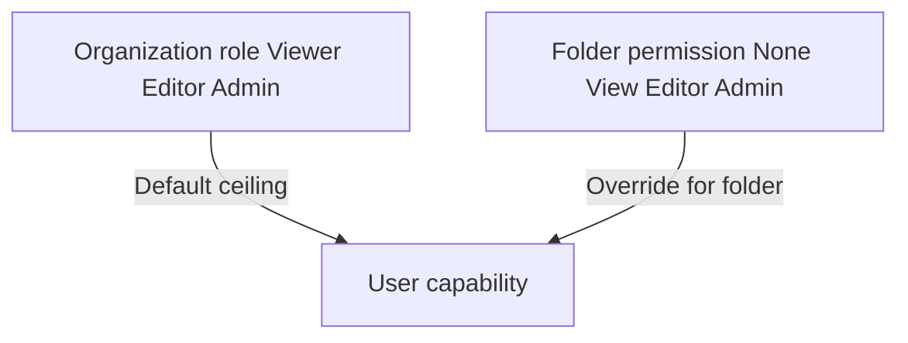
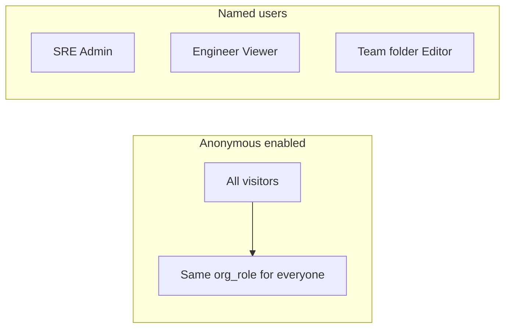
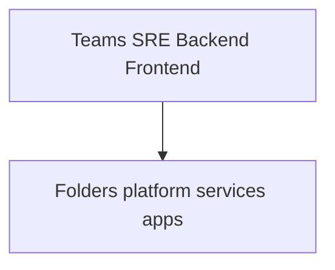

# Grafana RBAC and multi-team access

This document explains **Grafana organization roles**, **Teams**, and how they combine with **anonymous access** in this homelab. It complements [VMAuth / vmauth](../metrics/vmauth.md), which protects VictoriaMetrics HTTP APIs—not the Grafana UI.

## Table of contents

1. [Roles: Viewer, Editor, Admin](#roles-viewer-editor-admin)
2. [Teams (folder permissions)](#teams-folder-permissions)
3. [Anonymous vs named users](#anonymous-vs-named-users)
4. [SRE vs other teams (recommended patterns)](#sre-vs-other-teams-recommended-patterns)
5. [Local users without SSO](#local-users-without-sso)
6. [This repository (homelab defaults)](#this-repository-homelab-defaults)
7. [Diagrams](#diagrams)
8. [References](#references)

---

## Roles: Viewer, Editor, Admin

Grafana uses **organization roles** (per org). Typical meanings:

| Role | Typical capabilities |
|------|----------------------|
| **Viewer** | View dashboards, use Explore (if allowed), read-only |
| **Editor** | Create/edit dashboards, panels, alerts (depending on version/settings) |
| **Admin** | Org settings, users, datasources, plugins (within org) |

Official reference: [Roles and permissions](https://grafana.com/docs/grafana/latest/administration/roles-and-permissions/).

**Grafana Server Admin** (instance-level) is separate from org Admin; in Kubernetes deployments it is often tied to the first user or explicit env.

---

## Teams (folder permissions)

**Teams** group users. You assign **folder permissions** to teams so that:

- **SRE** can own platform / infra dashboards.
- **Backend** / **Frontend** teams can own service-specific folders.
- **Viewer** org role + **Editor** on a folder allows targeted edit rights without org-wide Editor.

Official: [Team sync](https://grafana.com/docs/grafana/latest/administration/team-sync/), [Folder permissions](https://grafana.com/docs/grafana/latest/administration/user-management/manage-dashboard-permissions/).

---

## Anonymous vs named users

| Mode | How users appear | Typical homelab use |
|------|------------------|---------------------|
| **Anonymous** | No login; everyone shares one identity | Fast local demos; **not** multi-tenant |
| **Named users** | Login form or SSO | Per-person audit, different roles |

**Anonymous limitation:** There is **one** anonymous role (`auth.anonymous.org_role`) for **everyone**. You cannot give “SRE = Admin” and “others = Viewer” via anonymous alone—you need **named users** (or OAuth/OIDC groups mapped to Grafana roles).

---

## SRE vs other teams (recommended patterns)

| Goal | Pattern |
|------|---------|
| SRE full control, others read-only | Named users: SRE = **Admin** or **Editor**; engineers = **Viewer**; use folder permissions for exceptions |
| Per-team dashboard ownership | **Teams** + folder **Editor** for that team’s folder |
| Break-glass without SSO | **Local users** in Grafana DB (store passwords via Secret if automated) |
| Production-grade | **OAuth/OIDC** + **Team sync** or group → role mapping |

---

## Local users without SSO

Grafana supports **built-in authentication** (username/password in Grafana’s DB). For GitOps:

- Prefer **Kubernetes Secret** for admin password if using `GF_SECURITY_ADMIN_PASSWORD__FILE` or similar.
- Rotate credentials; restrict who can port-forward to Grafana.

This is acceptable for **homelab**; production usually uses IdP (Keycloak, Google, etc.).

---

## This repository (homelab defaults)

The Grafana instance is configured in:

`kubernetes/infra/configs/monitoring/grafana/grafana.yaml`

Relevant settings (verify in file for exact values):

- **`auth.anonymous.enabled`**: `true` — no login required via UI when reachable.
- **`auth.anonymous.org_role`**: **`Admin`** — **anyone** who reaches Grafana has org Admin until changed.
- **`auth.disable_login_form`**: `true` — login form disabled; combined with anonymous, **named users cannot use the login UI** until you re-enable the form and configure users/SSO.

**Security note:** With port-forward, treat Grafana as **sensitive**. For multi-team or shared networks: set anonymous to **Viewer** or disable anonymous and enable OAuth/login.

**VMAuth** ([vmauth.md](../metrics/vmauth.md)) does **not** change the above: it protects VictoriaMetrics APIs, not Grafana’s anonymous Admin.

---

## Diagrams

### Org role vs folder permission

### Anonymous single role vs named users

### Recommended multi-team layout (conceptual)

---

## References

- [Roles and permissions](https://grafana.com/docs/grafana/latest/administration/roles-and-permissions/)
- [Configure Grafana](https://grafana.com/docs/grafana/latest/setup-grafana/configure-grafana/)
- [Anonymous authentication](https://grafana.com/docs/grafana/latest/setup-grafana/configure-security/configure-authentication/#anonymous-authentication)
- [Grafana overview](README.md)
- [VMAuth and vmauth](../metrics/vmauth.md)
