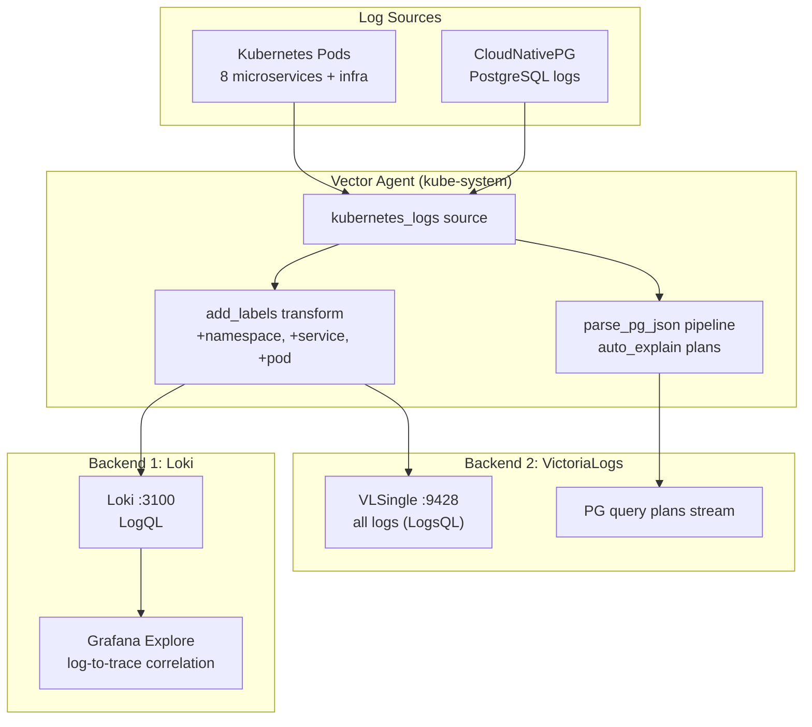

# Structured Logging Guide

## Quick Summary

**Objectives:**
- Implement structured JSON logging with trace-id correlation
- Understand the dual-ship architecture: one Vector agent → two backends (Loki + VictoriaLogs)
- Query logs with LogQL (Loki) and LogsQL (VictoriaLogs)
- Correlate logs with traces in Grafana

**Learning Outcomes:**
- Structured logging best practices with Zap
- Trace-ID propagation and correlation
- LogQL query syntax for Loki
- LogsQL query syntax for VictoriaLogs
- Vector log collection, transformation, and multi-sink routing
- Log-to-trace correlation patterns

**Keywords:**
Structured Logging, JSON Logs, Trace-ID, Log Correlation, LogQL, LogsQL, Log Aggregation, Vector, Loki, VictoriaLogs, Zap Logger, Log Levels, Log Queries

**Technologies:**
- Zap (Go structured logger)
- Vector (log collection agent — single DaemonSet, dual-ship)
- Loki (log storage + LogQL querying — default Grafana datasource)
- VictoriaLogs / VLSingle (log storage + LogsQL querying — PG plan streams)
- Grafana (log visualization + trace correlation)

> **See also:** [VictoriaLogs](victorialogs.md) for VLSingle configuration, Vector sink headers, PG plan streams, and LogsQL verification commands.

## Overview

All services use **structured JSON logging** with **trace-id correlation**. A single **Vector** DaemonSet collects logs cluster-wide and ships them to **two backends** simultaneously: **Loki** (default, Grafana-integrated) and **VictoriaLogs** (LogsQL, PostgreSQL plan analysis).

## Architecture



### Why two backends?

| Backend | Query Language | Best For |
|---------|---------------|----------|
| **Loki** | LogQL | Grafana Explore, log-to-trace correlation (Tempo), pattern detection, Logs Drilldown |
| **VictoriaLogs** | LogsQL | High-performance search, PostgreSQL plan analysis, learning LogsQL API |

Both receive the same logs from a single Vector. No duplicate collection agents.

## Log Format

All logs are in JSON format with the following structure:

```json
{
  "timestamp": "2024-01-15T10:30:45.123Z",
  "level": "info",
  "message": "HTTP request",
  "trace_id": "abc123def456",
  "method": "GET",
  "path": "/api/v1/users",
  "status": 200,
  "duration": 0.045,
  "client_ip": "10.0.0.1",
  "user_agent": "Mozilla/5.0...",
  "caller": "middleware/logging.go:123"
}
```

## Trace-ID in Logs

Every log entry includes a `trace_id` field that:
- Links logs to distributed traces
- Enables log-to-trace correlation in Grafana
- Allows searching logs by trace-id

## Log Levels

- **INFO**: Normal operations (HTTP requests, successful operations)
- **WARN**: Warning conditions (failed tracing initialization, etc.)
- **ERROR**: Error conditions (HTTP errors, failed operations)
- **FATAL**: Critical errors (server startup failures)

## Automatic Logging

### HTTP Request Logging

All HTTP requests are automatically logged with:
- Method, path, status code
- Request duration
- Client IP and user agent
- Trace ID

### Error Logging

HTTP errors (4xx, 5xx) are automatically logged at ERROR level.

## Manual Logging

### Using Logger from Context

```go
import (
    "github.com/duynhlab/monitoring/pkg/middleware"
    "go.uber.org/zap"
)

func handler(c *gin.Context) {
    logger := middleware.GetLoggerFromContext(c, baseLogger)
    
    logger.Info("Processing order",
        zap.String("order_id", orderID),
        zap.String("user_id", userID),
    )
}
```

### Adding Custom Fields

```go
logger.Info("User created",
    zap.String("user_id", userID),
    zap.String("email", email),
    zap.Int("age", age),
)
```

## Log Collection

### Vector Configuration

Vector collects logs from all pods and:
1. Parses JSON logs
2. Extracts trace-id
3. Adds service name and namespace labels
4. Ships to **Loki** (all application logs)
5. Ships to **VictoriaLogs** (all logs + dedicated PG plan stream)

For VictoriaLogs sink details (headers, stream fields, PG plan pipeline), see [VictoriaLogs](victorialogs.md).

### Loki Storage

Logs are stored in Loki with labels:
- `service`: Service name
- `namespace`: Kubernetes namespace
- `pod`: Pod name
- `container`: Container name
- `trace_id`: Trace ID (for correlation)

### VictoriaLogs Storage

Logs are also stored in VictoriaLogs (VLSingle `:9428`) with stream fields:
- `namespace`, `service`, `pod_name`, `container_name`
- Dedicated streams for PostgreSQL query plans (`cluster_name`, `database`, `query_id`)

See [VictoriaLogs](victorialogs.md) for complete configuration and verification.

## Viewing Logs

### Grafana

1. Port-forward Grafana:
   ```bash
   kubectl port-forward -n monitoring svc/grafana-service 3000:3000
   ```

2. Open Grafana: http://localhost:3000

3. Navigate to **Explore** → Select **Loki** datasource

4. Query logs:
   ```
   {service="auth"} |= "error"
   {trace_id="abc123"}
   {namespace="auth"} | json | level="error"
   ```

### VictoriaLogs (LogsQL)

**Grafana Explore (recommended):**

1. Port-forward Grafana: `kubectl port-forward -n monitoring svc/grafana-service 3000:3000`
2. Open **Explore**, select datasource **VictoriaLogs** (type `victoriametrics-logs-datasource`, UID `victorialogs`).
3. Run a LogsQL query (e.g. `*` for all logs, or `_stream:{namespace="product"}`). See the [VictoriaLogs Grafana plugin](https://grafana.com/grafana/plugins/victoriametrics-logs-datasource/).

Provisioning: [`datasource-victorialogs.yaml`](../../../kubernetes/infra/configs/monitoring/grafana/datasource-victorialogs.yaml) → `http://vlsingle-victoria-logs.monitoring.svc.cluster.local:9428`.

**CLI / API (no Grafana):**

```bash
# Port-forward to VictoriaLogs
kubectl port-forward -n monitoring svc/vlsingle-victoria-logs 9428:9428

# Query logs by namespace
curl -G 'http://localhost:9428/select/logsql/query' \
  --data-urlencode 'query=_stream:{namespace="product"}' \
  --data-urlencode 'limit=10'
```

For more LogsQL examples and troubleshooting, see [VictoriaLogs](victorialogs.md#verification).

### Log-to-Trace Correlation

1. Open a trace in Grafana (Tempo datasource)
2. Click on a span
3. View correlated logs in the **Logs** tab

### Trace-to-Log Correlation

1. Open logs in Grafana (Loki datasource)
2. Click on a log entry with trace_id
3. Click "Query with Tempo" to view the trace

## Grafana Logs Drilldown

**Available in**: Grafana 11.6+ (you have 12.1.4) with Loki v3.2+ (you have 3.6.2)

Grafana Logs Drilldown uses **pattern ingestion** and **level detection** to automatically analyze log patterns and identify common structures in your logs.

### Features

1. **Pattern Detection**: Automatically identifies recurring log patterns
2. **Level Detection**: Automatically detects log levels (INFO, WARN, ERROR, etc.)
3. **Volume Queries**: Query log volumes for capacity planning

### Usage

1. Navigate to **Explore** in Grafana
2. Select **Loki** datasource
3. Use the **Patterns** tab (new in Grafana 11.6+)
4. Loki will show detected patterns and frequencies

### Example Queries

**Pattern analysis**:
```logql
{service="auth"} | pattern "<timestamp> <level> <message>"
```

**Volume queries** (enabled by `volume_enabled: true`):
```logql
sum by (service) (count_over_time({namespace="auth"}[5m]))
```

**Level detection** (automatic with `discover_log_levels: true`):
```logql
{service="auth", detected_level="error"}
```

### Configuration

Pattern ingestion and level detection are enabled via:

**Loki config:**
- `--pattern-ingester.enabled=true` - Enable pattern detection
- `--validation.discover-log-levels=true` - Enable log level detection
- `discover_log_levels: true` in `limits_config`

**Vector config:**
- JSON parsing in `add_labels` transform - Extracts `level` field from structured log messages
- Automatically promotes `level` from nested JSON to top-level field for Loki detection

## Vector Monitoring

Vector exposes internal metrics in **Prometheus text format** (`prometheus_exporter` sink). **VMAgent** scrapes those targets and remote-writes to **VMSingle**, so you can monitor pipeline health in Grafana like any other workload metric.

### Available Metrics

Key Vector metrics (query in Grafana against the VictoriaMetrics datasource):

- **`vector_events_processed_total`** - Total events processed by each component
- **`vector_component_errors_total`** - Total errors by component  
- **`vector_component_sent_bytes_total`** - Bytes sent to sinks (e.g. Loki)
- **`vector_component_received_bytes_total`** - Bytes received from sources
- **`vector_buffer_events`** - Events currently in buffer
- **`vector_utilization`** - Component utilization (0.0-1.0)

### Querying Vector Metrics

**Check Vector health**:
```promql
up{job="vector"}
```

**Events processed per second**:
```promql
rate(vector_events_processed_total[5m])
```

**Error rate**:
```promql
rate(vector_component_errors_total[5m])
```

**Loki sink throughput** (bytes/sec):
```promql
rate(vector_component_sent_bytes_total{component_name=~"loki|victorialogs.*"}[5m])
```

**Buffer utilization**:
```promql
vector_buffer_events
```

### Monitoring Vector in Grafana

**Option 1: Pre-built Dashboard** (Recommended)

1. Navigate to **Dashboards** in Grafana
2. Open the **Vector** dashboard (imported from Grafana.com ID: 21954)
3. View comprehensive Vector metrics:
   - Events per second by component
   - Component error rates
   - Buffer utilization
   - Throughput (bytes/sec)
   - Component health status

**Option 2: Manual Queries via Explore**

1. Navigate to **Explore** in Grafana
2. Select the **VictoriaMetrics** metrics datasource (PromQL-compatible; see [datasources.md](../grafana/datasources.md))
3. Query Vector metrics (namespace: `vector_*`)

**Recommended Alerts**:
- High error rate: `rate(vector_component_errors_total[5m]) > 10`
- Buffer overflow: `vector_buffer_events > 10000`
- Low throughput: `rate(vector_events_processed_total[5m]) < 100`

### Configuration

Vector self-monitoring is configured via:
- **Source**: `internal_metrics` (collects Vector's internal metrics)
- **Sink**: `prometheus_exporter` (exposes metrics on port 9090)
- **ServiceMonitor → VMServiceScrape**: VMAgent scrapes Vector on a 30s interval (Prometheus Operator CRDs are converted by the VictoriaMetrics Operator)

## Log Queries

### By Service

```
{service="auth"}
```

### By Trace ID

```
{trace_id="abc123def456"}
```

### By Log Level

```
{service="auth"} | json | level="error"
```

### By Time Range

```
{service="auth"} [5m]
```

### Text Search

```
{service="auth"} |= "login"
```

### JSON Field Filtering

```
{service="auth"} | json | status=500
```

## Best Practices

1. **Use structured fields**: Always use zap fields instead of string formatting
2. **Include context**: Add relevant business context (user ID, order ID, etc.)
3. **Don't log sensitive data**: Never log passwords, tokens, or PII
4. **Use appropriate levels**: Use ERROR for errors, INFO for normal operations
5. **Keep messages concise**: Use short, descriptive messages

## Troubleshooting

### Logs not appearing in Loki or VictoriaLogs

1. Check Vector pods:
   ```bash
   kubectl get pods -n kube-system -l app=vector
   ```

2. Check Vector logs:
   ```bash
   kubectl logs -n kube-system -l app=vector
   ```

3. Check Loki status:
   ```bash
   kubectl get pods -n monitoring -l app=loki
   ```

4. Check VictoriaLogs status:
   ```bash
   kubectl get pods -n monitoring -l app=vlsingle
   ```

5. Verify log format: Ensure logs are in JSON format

### Trace-ID missing in logs

1. Verify logging middleware is added
2. Check that trace context is being propagated
3. Verify trace-id is being extracted correctly

## References

- [Zap Logger Documentation](https://github.com/uber-go/zap)
- [Loki Query Documentation](https://grafana.com/docs/loki/latest/logql/)
- [VictoriaLogs Documentation](https://docs.victoriametrics.com/victorialogs/)
- [LogsQL Query Language](https://docs.victoriametrics.com/victorialogs/logsql/)
- [Vector Documentation](https://vector.dev/docs/)
- [VictoriaLogs (project-specific)](victorialogs.md)

