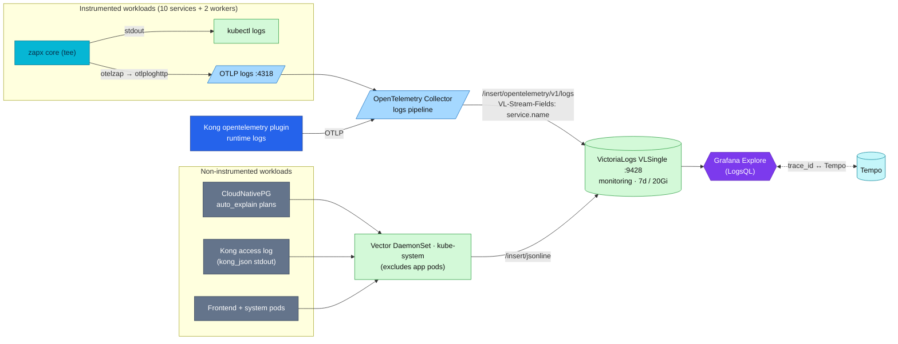

# Logging

The **logs pillar** of the platform — the "**why is it broken?**" signal
(alongside metrics "is something wrong?", traces "where is it slow?", and
profiles "which line of code?"; see [`../README.md`](../README.md)). Logs reach
VictoriaLogs by **two complementary paths**: instrumented Go services ship over
**OTLP** (otelzap → OpenTelemetry Collector), and everything not OTel-instrumented
(databases, Kong access log, the frontend, system pods) is tailed by **Vector**.
Both land in one backend, queryable with LogsQL and correlated to traces by
`trace_id`.

| | |
|---|---|
| **App-log path** | otelzap tee → OTLP (`otlploghttp`) → **OpenTelemetry Collector** → VictoriaLogs (fleet-wide since RFC-0014 P4) |
| **Infra-log path** | Vector — one cluster-wide **DaemonSet** (`kube-system`), `kubernetes_logs` source — DBs, Kong access log, PG `auto_explain`, frontend, system pods |
| **Storage** | VictoriaLogs **VLSingle** `:9428` (`monitoring`, VM Operator CRD) — 7-day retention, 20Gi PVC |
| **Query** | LogsQL (VictoriaLogs) |
| **Visualization** | Grafana — `victorialogs` datasource (`victoriametrics-logs-datasource`) |
| **Correlation** | `trace_id` field ↔ Tempo (log→trace and trace→log) |
| **App logging** | How services emit logs (libraries, format, levels, wiring) → [`../../api/logs.md`](../../api/logs.md) |

> This doc is the **architecture** view: the pipeline, why this stack, and how it
> scales. For **how to implement logging in a service** — the `zapx` logger, the
> otelzap tee, the JSON field contract, the level schema, trace-id wiring, and
> onboarding — see the source of truth,
> [**Application logging**](../../api/logs.md). Backend/ops detail (VLSingle config,
> Vector pipeline, endpoints, verification) lives in [`README.md#platform-pipeline`](README.md#platform-pipeline).
> For the full before/after migration story, see the
> [**RFC-0014 explainer**](../opentelemetry/rfc-0014-explainer.md).

---

## Overview

The platform has **two log paths into one backend**:

- **App path (OTLP).** The 10 Go services + both workers emit structured JSON
  with `zapx`, and their zap core is **tee'd** — one branch to stdout (for
  `kubectl logs`), one through an **otelzap** bridge → OTLP log exporter
  (`otlploghttp`) → **OpenTelemetry Collector** → VictoriaLogs. The Collector's
  VictoriaLogs exporter sets `VL-Stream-Fields: service.name`, so each service
  gets its own stream and **`trace_id` is a first-class queryable field**. This is
  the fleet-wide path since RFC-0014 P4.
- **Infra path (Vector).** Everything **not** OTel-instrumented — databases
  (CloudNativePG, incl. parsed **`auto_explain`** query plans), Kong's access log,
  the frontend, and system pods — is tailed by a single **Vector** DaemonSet and
  shipped over the jsonline endpoint. Vector explicitly **excludes the app pods**
  (they carry `platform.duynhlab.dev/otlp-logs=true`), so the two paths never
  double-ingest.

VictoriaLogs is the **sole** log backend (Loki was removed). Application logs
preserve `trace_id`, so they join directly to distributed traces. Infrastructure
logs normally correlate by namespace, pod, and time unless their source also
emits a trace ID.

## Architecture



**Two paths, one backend, no double-ingest.** App logs travel over OTLP; Vector
handles only the workloads OTel can't instrument. Vector still runs two pipelines
of its own — the *infra* pipeline (label + ship) and the *PostgreSQL* pipeline
(extract `auto_explain` execution plans into their own stream) — and the
VictoriaLogs itself is the operator-managed `VLSingle` CRD (no Helm-chart
collector is deployed), so Vector remains the single agent for that path. App pods are excluded from Vector by label
(`platform.duynhlab.dev/otlp-logs=true`), which is the double-ingest guard.
Pipeline internals, sink headers, and stream definitions are below in [Platform pipeline](#platform-pipeline).

### Kong logs (both paths)

Kong feeds **both** paths, complementary not duplicate: its `opentelemetry`
plugin ships **runtime logs** over OTLP (`logs_endpoint`, Kong ≥ 3.8) →
OpenTelemetry Collector, while Vector still tails Kong's **`kong_json` access
log** from stdout. Per-request access logs over OTLP (`access_logs_endpoint`) are
not available on Kong OSS 3.9. Tradeoff table + decision criteria:
[`docs/platform/kong-gateway.md#observability`](../../platform/kong-gateway.md#observability).

## Why VictoriaLogs (and why not Loki / ELK)

The platform standardised on VictoriaLogs and **removed Loki** (CHANGELOG
`v0.83.0` architectural switch, `v0.94.0` dead-manifest cleanup): one backend, no
second system to operate, native trace correlation, and `auto_explain` plan
analysis out of the box.

| | **VictoriaLogs** (chosen) | Loki | ELK / OpenSearch |
|---|---|---|---|
| Query language | LogsQL (full-text **and** structured) | LogQL | Lucene / KQL |
| Index model | Columnar + bounded **streams** | Label index + chunks | Inverted index |
| High-cardinality fields | Tolerant — put them in the message, not the stream | **Fragile** — high-cardinality labels degrade it | Tolerant but RAM/disk-heavy |
| Resource footprint | Very low (single small binary) | Low–moderate | High (JVM, shards) |
| Trace correlation | Native (`trace_id` ↔ Tempo) | Native | Plugin/manual |
| Ops cost | Minimal | Moderate | High |

### Strengths / weaknesses

**Strengths** — tiny resource footprint; tolerant of high-cardinality fields
(`trace_id`, `query_id` live in the message, never as stream labels); LogsQL does
both full-text and structured filtering; single-binary simplicity; native Grafana
plugin and Tempo correlation; Elasticsearch-compatible ingest endpoint.

**Weaknesses (honest)** — **VLSingle is single-node**: no replication/HA, so it is
homelab-grade as deployed; LogsQL is less widely known than LogQL/KQL; the
community/ecosystem is smaller than Loki's or Elastic's; the 7d / 20Gi window is
small and **PVC fill is the practical limit** (covered by the
`KubePersistentVolumeFillingUp` alert).

## Scaling to 1000+ microservices

What this design does well at scale, and the upgrade path:

- **Collection scales with the cluster.** Both paths scale horizontally: Vector is
  a DaemonSet — one agent per node — so infra-log ingest grows as you add nodes,
  and the app-log OTLP path scales with Collector replicas. Neither has a single
  central aggregator that becomes a bottleneck.
- **Cardinality stays bounded by design.** Stream fields are deliberately
  low-cardinality (`namespace`, `service`, `pod_name`, `container_name`).
  High-cardinality values (`trace_id`, `user_id`, `query_id`) stay in the log
  body, so the index does not explode — this is exactly the failure mode that
  forces label discipline on Loki. The rule at 1000+ services: **never promote a
  high-cardinality field to a stream field.**
- **Volume control at the edge.** Drop or sample noisy/debug lines in Vector
  transforms *before* they are shipped, to keep ingest and storage in check.
- **Backpressure is handled.** Vector's buffer (`when_full: drop_newest`) protects
  the pipeline under bursts; at scale, size buffers up or switch to disk buffers.
- **Storage sizing.** 7d / 20Gi suits a homelab; size production by
  *ingest-rate × retention* (VictoriaLogs compresses well). Use tiered retention
  if needed.
- **Horizontal scale-out when one node isn't enough.** Migrate **VLSingle →
  VictoriaLogs cluster** (`vlinsert` / `vlstorage` / `vlselect`) for horizontal
  scale and replication — same LogsQL, same ingest contract, no app changes.

> This homelab runs 10 services + 2 workers + infra today; the above is the scale-up path, not
> something stress-tested here. The 1000+ framing follows the same large-scale
> references the platform uses elsewhere (Uber M3, Grab/Shopee) — see
> [observability deep-dive](../runbooks/observability-deep-dive.md).

## Querying & correlation

Query in **Grafana → Explore → VictoriaLogs** (or the LogsQL HTTP API). Common
LogsQL:

```logsql
_stream:{service="auth"}                 # all logs for a service
_stream:{service="auth"} level:error     # filter by a JSON field
trace_id:abc123def456                    # everything for one trace
_stream:{namespace="product"} _time:5m   # recent, by namespace
```

- **Log → trace:** open a log line with a `trace_id` → *Query with Tempo* jumps to
  the trace.
- **Trace → log:** in a Tempo span, the **Logs** tab shows the correlated lines
  (Tempo `tracesToLogsV2` → `victorialogs` datasource).

More examples, verification commands, and the PG-plan stream are in
[`README.md#platform-pipeline`](README.md#verification).

## Operations quick-start

```bash
# Explore logs in Grafana
kubectl port-forward -n monitoring svc/grafana-service 3000:3000   # → Explore → VictoriaLogs

# Query VictoriaLogs directly
kubectl port-forward -n monitoring svc/vlsingle-victoria-logs 9428:9428
curl -G 'http://localhost:9428/select/logsql/query' \
  --data-urlencode 'query=_stream:{namespace="product"}' --data-urlencode 'limit=10'

# Is the pipeline healthy?
kubectl get pods -n kube-system -l app.kubernetes.io/name=vector
kubectl get vlsingle -n monitoring
```

Vector self-monitoring (its own throughput/error/buffer metrics, alerts, and
full backend troubleshooting are in [Troubleshooting](#troubleshooting) below. For
symptom-driven on-call (blank Grafana logs panel), see
[`victorialogs-kubernetes-logs-debug.md`](../runbooks/victorialogs-kubernetes-logs-debug.md).

## Platform pipeline {#platform-pipeline}

### Components

| Component | CRD/Kind | Namespace | Purpose |
|-----------|----------|-----------|---------|
| VLSingle | `VLSingle` (VM Operator) | `monitoring` | Log storage and query engine |
| Vector | `HelmRelease` | `kube-system` | Log collection agent (DaemonSet) |

## Grafana

VictoriaLogs is available in Grafana as a **VictoriaLogs** datasource (plugin `victoriametrics-logs-datasource`), provisioned by GitOps:

- **CR**: [`kubernetes/infra/configs/observability/grafana/datasource-victorialogs.yaml`](../../../kubernetes/infra/configs/observability/grafana/datasource-victorialogs.yaml)
- **UID**: `victorialogs`
- **URL**: `http://vlsingle-victoria-logs.monitoring.svc.cluster.local:9428`

After `kubectl port-forward -n monitoring svc/grafana-service 3000:3000`, use **Explore → VictoriaLogs** and LogsQL (e.g. `*` or `_stream:{namespace="product"}`). Plugin reference: [Grafana VictoriaLogs datasource](https://grafana.com/grafana/plugins/victoriametrics-logs-datasource/).

## Endpoints

### VictoriaLogs Service (Operator-Managed)

- **Service**: `vlsingle-victoria-logs.monitoring.svc`
- **Port**: `9428`

### Ingestion Endpoints

| Endpoint | Purpose | Used By |
|----------|---------|---------|
| `/insert/jsonline` | JSON Lines ingestion | Vector sinks (infra logs) |
| `/insert/opentelemetry/v1/logs` | OTLP logs ingestion (`VL-Stream-Fields: service.name`) | OpenTelemetry Collector (app logs) |
| `/insert/elasticsearch` | Elasticsearch-compatible bulk API | Alternative ingestion |
| `/select/logsql/query` | LogsQL query endpoint | Grafana datasource |

### Vector Sink Headers

The Vector sinks use the following VictoriaLogs-specific headers:

```yaml
request:
  headers:
    VL-Time-Field: timestamp      # Field containing log timestamp
    VL-Msg-Field: message         # Field containing log message
    VL-Stream-Fields: namespace,service,pod_name,container_name  # Stream indexing
    AccountID: "0"                # Multi-tenancy (default: 0)
    ProjectID: "0"                # Multi-tenancy (default: 0)
```

## Log Streams

### All Logs Stream

All Kubernetes logs are shipped to VictoriaLogs with these stream fields:
- `namespace`
- `service`
- `pod_name`
- `container_name`

### PostgreSQL Query Plans Stream

CloudNativePG auto_explain logs are parsed and stored with:
- `cluster_name` - CloudNativePG cluster name
- `namespace` - Kubernetes namespace
- `database` - PostgreSQL database name
- `query_id` - PostgreSQL query ID

### PostgreSQL Audit Logs

All CNPG clusters enable `pgaudit` (`pgaudit.log = 'ddl, write'`). Audit records
and `auto_explain` plans flow through the **same cluster-wide Vector DaemonSet** —
there are **no per-cluster logging sidecars**. Audit rows land in VictoriaLogs as
CNPG-parsed structured records carrying `logger: pgaudit` (CNPG parsing strips the
literal `AUDIT:` prefix). Verified live for `platform-db` and `product-db`.
Example query: `_stream:{namespace="platform"} logger:pgaudit`.

## Configuration

### VLSingle CRD (Operator-Managed)

Location: `kubernetes/infra/configs/observability/logging/victorialogs/vlsingle.yaml`

Key settings:
```yaml
apiVersion: operator.victoriametrics.com/v1
kind: VLSingle
metadata:
  name: victoria-logs
  namespace: monitoring
spec:
  retentionPeriod: "7d"
  removePvcAfterDelete: true
  storage:
    resources:
      requests:
        storage: 20Gi
  resources:
    requests:
      cpu: 50m
      memory: 192Mi
    limits:
      cpu: 500m
      memory: 768Mi
```

### Vector HelmRelease

Location: `kubernetes/infra/controllers/logging/vector/vector.yaml`

The Vector config includes:
- **Sources**: `kubernetes_logs`
- **Transforms**: `add_labels`, `parse_pg_json`, `filter_pg_auto_explain`, `parse_pg_auto_explain`
- **Sinks**: `victorialogs_all`, `victorialogs_pg_plans`, `victorialogs_pg_parse_failures`

## Vector self-monitoring

Vector exposes its own metrics in **Prometheus text format** (`internal_metrics`
source → `prometheus_exporter` sink on port `9090`). The Vector chart's
`podMonitor.enabled` creates a `PodMonitor`, which the VM Operator converts to a
`VMPodScrape`; VMAgent scrapes it and remote-writes to VMSingle, so pipeline
health is queryable in Grafana against the VictoriaMetrics datasource like any
other workload.

Key metrics (PromQL):

```promql
up{job="vector"}                                                   # agent health
rate(vector_events_processed_total[5m])                            # events/sec by component
rate(vector_component_errors_total[5m])                            # error rate
rate(vector_component_sent_bytes_total{component_name=~"victorialogs.*"}[5m])  # sink throughput
vector_buffer_events                                               # buffer depth
```

A pre-built Vector dashboard (Grafana.com ID `21954`) covers events/sec, error
rates, buffer utilization, and throughput. Suggested alerts: high error rate
(`rate(vector_component_errors_total[5m]) > 10`), buffer overflow
(`vector_buffer_events > 10000`), low throughput
(`rate(vector_events_processed_total[5m]) < 100`).

## Verification

### Check Operator Resources

```bash
# Check VLSingle status
kubectl get vlsingle -n monitoring

# Check pods
kubectl get pods -n monitoring -l app.kubernetes.io/name=vlsingle
kubectl get pods -n kube-system -l app.kubernetes.io/name=vector
```

### Check VictoriaLogs Health

```bash
# Port-forward to VictoriaLogs
kubectl port-forward -n monitoring svc/vlsingle-victoria-logs 9428:9428

# Check health endpoint
curl http://localhost:9428/health

# Query logs (LogsQL)
curl -G 'http://localhost:9428/select/logsql/query' \
  --data-urlencode 'query=_stream:{namespace="monitoring"}' \
  --data-urlencode 'limit=10'
```

### Check Vector Logs

```bash
# Check Vector logs for successful pushes
kubectl logs -n kube-system -l app.kubernetes.io/name=vector --tail=100 | grep -i victorialogs

# Check for errors
kubectl logs -n kube-system -l app.kubernetes.io/name=vector --tail=100 | grep -i error
```

### Verify PostgreSQL Plan Ingestion

```bash
# Query for PostgreSQL plans in VictoriaLogs
curl -G 'http://localhost:9428/select/logsql/query' \
  --data-urlencode 'query=_stream:{cluster_name!=""}' \
  --data-urlencode 'limit=10'
```

## Troubleshooting

### No Logs in VictoriaLogs

1. **Check Vector is running**:
   ```bash
   kubectl get pods -n kube-system -l app.kubernetes.io/name=vector
   ```

2. **Check Vector sink connectivity**:
   ```bash
   kubectl logs -n kube-system -l app.kubernetes.io/name=vector | grep -i "victorialogs\|connection\|error"
   ```

3. **Verify VictoriaLogs service is accessible**:
   ```bash
   kubectl run -it --rm debug --image=curlimages/curl -- \
     curl -s http://vlsingle-victoria-logs.monitoring.svc:9428/health
   ```

### PostgreSQL Plans Not Appearing

1. **Verify CloudNativePG clusters have auto_explain enabled** in PostgreSQL parameters

2. **Check filter is working**:
   ```bash
   kubectl logs -n kube-system -l app.kubernetes.io/name=vector | grep -i "pg_auto_explain"
   ```

3. **Generate a slow query** to trigger auto_explain:
   ```sql
   -- Connect to product-db (product, cart, order, or payment database)
   SELECT pg_sleep(1);
   ```

### High Memory Usage in Vector

If Vector is consuming too much memory:

1. **Check current resource usage**:
   ```bash
   kubectl top pods -n kube-system -l app.kubernetes.io/name=vector
   ```

2. **Adjust buffer settings** in Vector HelmRelease:
   ```yaml
   buffer:
     type: memory
     max_events: 5000  # Reduce from 10000
     when_full: drop_newest
   ```

## Related Documentation

- **Official VictoriaLogs Docs**: https://docs.victoriametrics.com/victorialogs/
- **External API auth (planned)**: [VMAuth / vmauth](../metrics/victoriametrics.md#vmauth--vmauth-planned) in the VictoriaMetrics stack doc
- **VictoriaLogs Vector Setup**: https://docs.victoriametrics.com/victorialogs/data-ingestion/vector
- **VictoriaLogs Helm Chart**: https://docs.victoriametrics.com/helm/victorialogs-single/
- **LogsQL Query Language**: https://docs.victoriametrics.com/victorialogs/logsql/
- **Vector Documentation**: https://vector.dev/docs/

## Manifest Locations

| Resource | Path |
|----------|------|
| VLSingle CRD | `kubernetes/infra/configs/observability/logging/victorialogs/vlsingle.yaml` |
| VM Operator | `kubernetes/infra/controllers/metrics/victoria-metrics-operator.yaml` |
| Vector HelmRelease | `kubernetes/infra/controllers/logging/vector/vector.yaml` |

---

## References

- [Application logging (app contract)](../../api/logs.md)
- [Observability overview](../README.md) · [Grafana datasources](../grafana/datasources.md)
- [VictoriaLogs docs](https://docs.victoriametrics.com/victorialogs/) · [LogsQL](https://docs.victoriametrics.com/victorialogs/logsql/) · [Vector docs](https://vector.dev/docs/)

---

_Last updated: 2026-07-22 — platform infra hub; app contract → docs/api/logs.md — dual-path logging: app logs over OTLP (otelzap → OpenTelemetry Collector → VictoriaLogs, `VL-Stream-Fields: service.name`, fleet-wide since RFC-0014 P4) + Vector DaemonSet for non-instrumented workloads (DBs, Kong access log, PG `auto_explain`, frontend); VictoriaLogs VLSingle `:9428` (7d/20Gi), LogsQL, `trace_id` ↔ Tempo; Loki removed._
