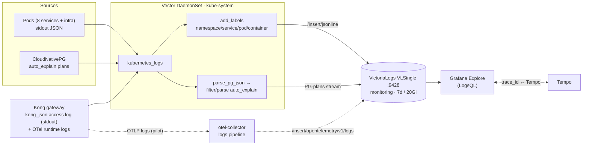

# Logging

The **logs pillar** of the platform — the "**why is it broken?**" signal
(alongside metrics "is something wrong?", traces "where is it slow?", and
profiles "which line of code?"; see [`../README.md`](../README.md)). Every pod's
stdout is collected by one Vector agent and stored in VictoriaLogs, queryable
with LogsQL and correlated to traces by `trace_id`.

| | |
|---|---|
| **Collector** | Vector — one cluster-wide **DaemonSet** (`kube-system`), `kubernetes_logs` source |
| **Storage** | VictoriaLogs **VLSingle** `:9428` (`monitoring`, VM Operator CRD) — 7-day retention, 20Gi PVC |
| **Query** | LogsQL (VictoriaLogs) |
| **Visualization** | Grafana — `victorialogs` datasource (`victoriametrics-logs-datasource`) |
| **Correlation** | `trace_id` field ↔ Tempo (log→trace and trace→log) |
| **App logging** | How services emit logs (libraries, format, levels, wiring) → [`../../api/logs.md`](../../api/logs.md) |

> This doc is the **architecture** view: the pipeline, why this stack, and how it
> scales. For **how to implement logging in a service** — log libraries
> (Zap/clog/zerolog), the JSON field contract, the level schema, trace-id wiring,
> and onboarding — see the API-layer source of truth,
> [**Logging Standards**](../../api/logs.md). Backend/ops detail (VLSingle config,
> Vector pipeline, endpoints, verification) lives in [`victorialogs.md`](victorialogs.md).

---

## Overview

All services log **structured JSON to stdout**; nothing writes log files. A single
**Vector** DaemonSet tails every container on its node, tags each line with stream
fields (`namespace`, `service`, `pod_name`, `container_name`), and ships it to
**VictoriaLogs** over HTTP. VictoriaLogs is the **sole** log backend (Loki was
removed) and also carries a dedicated stream of parsed **PostgreSQL
`auto_explain`** query plans. Because every line keeps the `trace_id` the
application logged, a log and its distributed trace join on one id.

## Architecture



**One agent, one backend.** A single cluster-wide Vector DaemonSet does all
collection — the VictoriaLogs Helm chart's embedded collector is **disabled** so
there is no duplicate ingestion. Vector applies two pipelines: the *all-logs*
pipeline (label + ship) and the *PostgreSQL* pipeline (extract `auto_explain`
execution plans into their own stream). Both land in one VLSingle instance.
Pipeline internals, sink headers, and stream definitions are in
[`victorialogs.md`](victorialogs.md).

### Kong OTel-logs pilot (parallel path)

Alongside Vector, Kong's `opentelemetry` plugin ships its **runtime logs** via
OTLP (`logs_endpoint`, Kong ≥ 3.8) → otel-collector `logs` pipeline →
VictoriaLogs' OTLP ingest. This is a **pilot** to compare against the Vector
path (which remains primary and also carries Kong's `kong_json` access log
from stdout). Per-request access logs over OTLP (`access_logs_endpoint`) are
not available on Kong OSS 3.9. Tradeoff table + decision criteria:
[`docs/platform/kong-gateway.md#observability`](../../platform/kong-gateway.md#observability).

## Why VictoriaLogs (and why not Loki / ELK)

The platform standardised on VictoriaLogs and **removed Loki** (CHANGELOG
`v0.83.0` architectural switch, `v0.94.0` dead-manifest cleanup): one backend, no
second system to operate, native trace correlation, and `auto_explain` plan
analysis out of the box.

| | **VictoriaLogs** (chosen) | Loki | ELK / OpenSearch |
|---|---|---|---|
| Query language | LogsQL (full-text **and** structured) | LogQL | Lucene / KQL |
| Index model | Columnar + bounded **streams** | Label index + chunks | Inverted index |
| High-cardinality fields | Tolerant — put them in the message, not the stream | **Fragile** — high-cardinality labels degrade it | Tolerant but RAM/disk-heavy |
| Resource footprint | Very low (single small binary) | Low–moderate | High (JVM, shards) |
| Trace correlation | Native (`trace_id` ↔ Tempo) | Native | Plugin/manual |
| Ops cost | Minimal | Moderate | High |

### Strengths / weaknesses

**Strengths** — tiny resource footprint; tolerant of high-cardinality fields
(`trace_id`, `query_id` live in the message, never as stream labels); LogsQL does
both full-text and structured filtering; single-binary simplicity; native Grafana
plugin and Tempo correlation; Elasticsearch-compatible ingest endpoint.

**Weaknesses (honest)** — **VLSingle is single-node**: no replication/HA, so it is
homelab-grade as deployed; LogsQL is less widely known than LogQL/KQL; the
community/ecosystem is smaller than Loki's or Elastic's; the 7d / 20Gi window is
small and **PVC fill is the practical limit** (covered by the
`KubePersistentVolumeFillingUp` alert).

## Scaling to 1000+ microservices

What this design does well at scale, and the upgrade path:

- **Collection scales with the cluster.** Vector is a DaemonSet — one agent per
  node — so ingest capacity grows automatically as you add nodes; there is no
  central aggregator to become a bottleneck.
- **Cardinality stays bounded by design.** Stream fields are deliberately
  low-cardinality (`namespace`, `service`, `pod_name`, `container_name`).
  High-cardinality values (`trace_id`, `user_id`, `query_id`) stay in the log
  body, so the index does not explode — this is exactly the failure mode that
  forces label discipline on Loki. The rule at 1000+ services: **never promote a
  high-cardinality field to a stream field.**
- **Volume control at the edge.** Drop or sample noisy/debug lines in Vector
  transforms *before* they are shipped, to keep ingest and storage in check.
- **Backpressure is handled.** Vector's buffer (`when_full: drop_newest`) protects
  the pipeline under bursts; at scale, size buffers up or switch to disk buffers.
- **Storage sizing.** 7d / 20Gi suits a homelab; size production by
  *ingest-rate × retention* (VictoriaLogs compresses well). Use tiered retention
  if needed.
- **Horizontal scale-out when one node isn't enough.** Migrate **VLSingle →
  VictoriaLogs cluster** (`vlinsert` / `vlstorage` / `vlselect`) for horizontal
  scale and replication — same LogsQL, same ingest contract, no app changes.

> This homelab runs 8 services + infra today; the above is the scale-up path, not
> something stress-tested here. The 1000+ framing follows the same large-scale
> references the platform uses elsewhere (Uber M3, Grab/Shopee) — see
> [observability deep-dive](../runbooks/observability-deep-dive.md).

## Querying & correlation

Query in **Grafana → Explore → VictoriaLogs** (or the LogsQL HTTP API). Common
LogsQL:

```logsql
_stream:{service="auth"}                 # all logs for a service
_stream:{service="auth"} level:error     # filter by a JSON field
trace_id:abc123def456                    # everything for one trace
_stream:{namespace="product"} _time:5m   # recent, by namespace
```

- **Log → trace:** open a log line with a `trace_id` → *Query with Tempo* jumps to
  the trace.
- **Trace → log:** in a Tempo span, the **Logs** tab shows the correlated lines
  (Tempo `tracesToLogsV2` → `victorialogs` datasource).

More examples, verification commands, and the PG-plan stream are in
[`victorialogs.md`](victorialogs.md#verification).

## Operations quick-start

```bash
# Explore logs in Grafana
kubectl port-forward -n monitoring svc/grafana-service 3000:3000   # → Explore → VictoriaLogs

# Query VictoriaLogs directly
kubectl port-forward -n monitoring svc/vlsingle-victoria-logs 9428:9428
curl -G 'http://localhost:9428/select/logsql/query' \
  --data-urlencode 'query=_stream:{namespace="product"}' --data-urlencode 'limit=10'

# Is the pipeline healthy?
kubectl get pods -n kube-system -l app.kubernetes.io/name=vector
kubectl get vlsingle -n monitoring
```

Vector self-monitoring (its own throughput/error/buffer metrics, alerts, and
dashboard) and full backend troubleshooting are in
[`victorialogs.md`](victorialogs.md).

## Documentation map

```
logging/
├── README.md         # This hub — architecture, why-this-stack, scaling
└── victorialogs.md   # Backend & pipeline ops: VLSingle config, Vector pipeline,
                      # endpoints, streams, self-monitoring, verification, runbooks
../../api/logs.md      # App logging standards & implementation (onboarding)
```

## References

- [App logging standards (onboarding)](../../api/logs.md) · [VictoriaLogs backend & ops](victorialogs.md)
- [Observability overview](../README.md) · [Grafana datasources](../grafana/datasources.md)
- [VictoriaLogs docs](https://docs.victoriametrics.com/victorialogs/) · [LogsQL](https://docs.victoriametrics.com/victorialogs/logsql/) · [Vector docs](https://vector.dev/docs/)

---

_Last updated: 2026-06-29 — single Vector DaemonSet → VictoriaLogs VLSingle `:9428` (7d/20Gi), LogsQL, `trace_id` ↔ Tempo; Loki removed._
