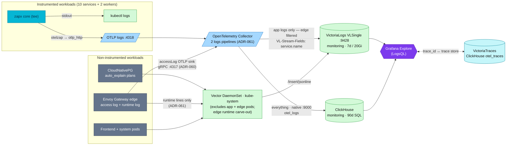

# Logging

The **logs pillar** of the platform — the "**why is it broken?**" signal
(alongside metrics "is something wrong?", traces "where is it slow?", and
profiles "which line of code?"; see [`../README.md`](../README.md)). Logs reach
VictoriaLogs by **two complementary paths**: instrumented Go services ship over
**OTLP** (otelzap → OpenTelemetry Collector), and everything not OTel-instrumented
(databases, the frontend, system pods, the edge's *runtime* lines) is tailed by
**Vector**. Both land in **VictoriaLogs**, queryable with LogsQL and correlated
to traces by `trace_id`. The app-log OTLP path additionally writes to
**ClickHouse** `otel_logs` — a second store on purpose, for 90-day SQL
([ADR-023](../../proposals/adr/ADR-023-clickhouse-observability-olap/)); see
[ClickHouse](../clickhouse/README.md). The one stream that does **not** follow
this shape is the edge's **access log**: it is ClickHouse-**only**
([ADR-061](../../proposals/adr/ADR-061-edge-log-routing/)) — see
[Edge logs](#edge-logs-adr-061-access--clickhouse-runtime--victorialogs).

| | |
|---|---|
| **App-log path** | otelzap tee → OTLP (`otlploghttp`) → **OpenTelemetry Collector** → VictoriaLogs + ClickHouse (fleet-wide since RFC-0014 P4) |
| **Infra-log path** | Vector — one cluster-wide **DaemonSet** (`kube-system`) — DBs, PG `auto_explain`, frontend, system pods, **edge runtime lines** (ADR-061) → [`vector.md`](vector.md) |
| **Edge access log** | OTLP sink → Collector → **ClickHouse only** (90d, JOINs `otel_traces`) — filtered out of the VictoriaLogs leg ([ADR-061](../../proposals/adr/ADR-061-edge-log-routing/)) |
| **Storage** | VictoriaLogs **VLSingle** `:9428` (`monitoring`, VM Operator CRD) — 7-day retention, 20Gi PVC → [`victorialogs.md`](victorialogs.md) |
| **Query** | LogsQL → [`logsql-guide.md`](logsql-guide.md) |
| **Visualization** | Grafana — `victorialogs` datasource (`victoriametrics-logs-datasource`) |
| **Correlation** | `trace_id` field ↔ VictoriaTraces. **trace→log is configured** (`tracesToLogsV2`); log→trace has no derived field — see [`victorialogs.md`](victorialogs.md#grafana-datasource--trace-correlation) |
| **App logging** | How services emit logs (libraries, format, levels, wiring) → [`../../api/logs.md`](../../api/logs.md) |

> This doc is the **architecture** view: the pipeline, why this stack, and how it
> scales. For **how to implement logging in a service** — the `zapx` logger, the
> otelzap tee, the JSON field contract, the level schema, trace-id wiring, and
> onboarding — see the source of truth,
> [**Application logging**](../../api/logs.md). Backend/ops detail lives in
> [**`victorialogs.md`**](victorialogs.md) (store, ingest contracts, verification)
> and [**`vector.md`**](vector.md) (collection pipeline, troubleshooting).
> For the full before/after migration story, see
> [**OTel fundamentals § How this platform got here**](../opentelemetry/fundamentals.md#how-this-platform-got-here--rfc-0014-in-pictures).

---

## Overview

The platform has **two log paths**, and the OTLP one lands in **two stores**:

- **App path (OTLP).** The 10 Go services + both workers emit structured JSON
  with `zapx`, and their zap core is **tee'd** — one branch to stdout (for
  `kubectl logs`), one through an **otelzap** bridge → OTLP log exporter
  (`otlploghttp`) → **OpenTelemetry Collector** → VictoriaLogs. The Collector's
  VictoriaLogs exporter sets `VL-Stream-Fields: service.name`, so each service
  gets its own stream and **`trace_id` is a first-class queryable field**. This is
  the fleet-wide path since RFC-0014 P4.
- **Infra path (Vector).** Everything **not** OTel-instrumented — databases
  (CloudNativePG, incl. parsed **`auto_explain`** query plans),
  the frontend, and system pods — is tailed by a single **Vector** DaemonSet and
  shipped over the jsonline endpoint. Vector explicitly **excludes the app pods
  and the Envoy pods** (all of them carry `platform.duynhlab.dev/otlp-logs=true`),
  so the two paths never double-ingest. One deliberate carve-out (ADR-061): a
  dedicated Vector source tails the proxy pods again for their **runtime lines
  only** — access-log JSON is filtered out because it travels the OTLP road.

VictoriaLogs is the **ops** log backend and the only one Vector writes to (Loki was
removed). It is **not** the only log store: the collector's `logs` pipeline also exports to
ClickHouse `otel_logs`, which keeps 90 days for SQL while VictoriaLogs keeps 7 for LogsQL.
Application logs preserve `trace_id`, so they join directly to distributed traces. Infrastructure
logs normally correlate by namespace, pod, and time unless their source also
emits a trace ID.

## Architecture


```mermaid
flowchart LR
    subgraph apps["Instrumented workloads (10 services + 2 workers)"]
        Z["zapx core (tee)"]
        Z -->|stdout| KLOGS["kubectl logs"]
        Z -->|"otelzap → otlp_http"| OTLP
    end
    subgraph infra["Non-instrumented workloads"]
        CNPG["CloudNativePG<br/>auto_explain plans"]
        EDGE["Envoy Gateway edge<br/>access log + runtime log"]
        FE["Frontend + system pods"]
    end
    OTLP[/"OTLP logs :4318"/] --> COL[/"OpenTelemetry Collector<br/>2 logs pipelines (ADR-061)"/]
    CNPG --> VEC["Vector DaemonSet · kube-system<br/>(excludes app + edge pods;<br/>edge runtime carve-out)"]
    EDGE -->|"accessLog OTLP sink<br/>gRPC :4317 (ADR-060)"| COL
    EDGE -->|"runtime lines only<br/>(ADR-061)"| VEC
    FE --> VEC
    COL -->|"app logs only — edge filtered<br/>VL-Stream-Fields: service.name"| VL[("VictoriaLogs VLSingle :9428<br/>monitoring · 7d / 20Gi")]
    COL -->|"everything · native :9000<br/>otel_logs"| CH[("ClickHouse<br/>monitoring · 90d SQL")]
    VEC -->|"/insert/jsonline"| VL
    VL --> GRAF{{"Grafana Explore<br/>(LogsQL)"}}
    CH --> GRAF
    GRAF <-. "trace_id ↔ trace store" .-> TEMPO[("VictoriaTraces<br/>ClickHouse otel_traces")]
    classDef collector fill:#a5d8ff,color:#111,stroke:#1971c2;
    classDef log fill:#d3f9d8,color:#111,stroke:#2f9e44;
    classDef trace fill:#c5f6fa,color:#111,stroke:#0c8599;
    class OTLP,COL collector;
    class VL log;
    class CH log;
    class TEMPO trace;
    classDef service fill:#06b6d4,color:#082f49,stroke:#0e7490;
    classDef external fill:#64748b,color:#fff,stroke:#334155;
    classDef platform fill:#7c3aed,color:#fff,stroke:#5b21b6;
    class Z service;
    class CNPG,EDGE,FE external;
    class VEC,KLOGS log;
    class GRAF platform;
```

**Two paths, no double-ingest — and the edge routed by class.** App logs travel over OTLP; Vector
handles the workloads OTel can't instrument. Vector runs three pipelines
of its own — the *infra* pipeline (label + ship), the *PostgreSQL* pipeline
(extract `auto_explain` execution plans into their own stream), and the
*edge-runtime* carve-out (ADR-061) — and
VictoriaLogs itself is the operator-managed `VLSingle` CRD (no Helm-chart
collector is deployed), so Vector remains the single agent for that path. App pods are excluded from Vector by label
(`platform.duynhlab.dev/otlp-logs=true`), which is the double-ingest guard.
Pipeline internals live in [`vector.md`](vector.md); the store's ingest
contracts and stream catalog live in [`victorialogs.md`](victorialogs.md).

### Edge logs (ADR-061): access → ClickHouse, runtime → VictoriaLogs

The edge is the one workload whose logs are **routed by class**
([ADR-061](../../proposals/adr/ADR-061-edge-log-routing/), refining
[ADR-060](../../proposals/adr/ADR-060-envoy-access-log-transport/)):

| Edge log class | Store | Path | Why |
|---|---|---|---|
| **Access log** (request records, TraceId) | **ClickHouse only** — 90d | `EnvoyProxy.spec.telemetry.accessLog` OTLP sink → collector `:4317`; `filter/drop_edge_logs` removes it from the VictoriaLogs pipeline | attributes-only records (no `_msg` → LogsQL free-text blind) whose every real question is SQL: status distributions, latency percentiles, `JOIN otel_traces ON TraceId` |
| **Runtime log** (Envoy process: startup, config rejects, upstream warnings) | **VictoriaLogs** — 7d | dedicated Vector source scoped to the proxy pods, keeping only non-JSON lines → [`vector.md`](vector.md#pipeline) | the ops signal; before ADR-061 it was collected **nowhere** (the pod-level label exclusion silenced it) |
| **stdout** (`File` sink) | no store | `kubectl logs` | the fallback that survives the collector being the broken thing |

Three mechanics keep the split honest:

- **One `settings[]` entry, one format, one filter, two sinks** — the `File`
  and `OpenTelemetry` sinks share the JSON format and the CEL filter, so
  stdout and OTLP always describe the same request set.
- **Successful probe traffic is dropped at the source.** The CEL `matches`
  filter suppresses `/health` / `/ready` / kube-probe lines **answered 2xx** on
  both sinks; a *failing* probe still logs (measured: a 404 on `/health` landed).
- **The label guard stays.** Proxy pods carry
  `platform.duynhlab.dev/otlp-logs=true`, so Vector's main source never tails
  them — the runtime carve-out is a second source whose filter keeps only
  lines not starting with `{` (access logs are our declared JSON format;
  runtime lines start `[ts][level][component]`). `spec.logging.level.default:
  warn` is pinned so the now-collected runtime stream stays sparse.

**Querying edge logs:**

```sql
-- Access logs: ClickHouse (Grafana → ClickHouse datasource / otel-logs-explorer)
SELECT LogAttributes['status'] AS status, count() AS hits
FROM otel.otel_logs
WHERE ServiceName = 'platform.envoy-gateway' AND TimestampTime > now() - INTERVAL 1 HOUR
GROUP BY status ORDER BY hits DESC
```

```logsql
# Runtime logs: VictoriaLogs (stream service falls back to the proxy pod name)
_stream:{pod_name=~"envoy-envoy-gateway.*"} _time:1h
```

Access-log field names remain a parse contract (15 fields: `time`, `client`,
`method`, `uri`, `status`, `response_flags`, `bytes`, `duration`,
`upstream_time`, `upstream`, `upstream_cluster`, `route_name`, `host`,
`request_id`, `user_agent`). Config:
[`kubernetes/infra/configs/envoy-gateway/envoyproxy.yaml`](../../../kubernetes/infra/configs/envoy-gateway/envoyproxy.yaml).

## Why VictoriaLogs (and why not Loki / ELK)

The platform standardised on VictoriaLogs and **removed Loki** (CHANGELOG
`v0.83.0` architectural switch, `v0.94.0` dead-manifest cleanup): one **ops** backend
instead of two, native trace correlation, and `auto_explain` plan analysis out of the box.
The ClickHouse tier added later by [ADR-023](../../proposals/adr/ADR-023-clickhouse-observability-olap/)
is a deliberate second store for long-retention SQL (`GROUP BY`, correlation over
90 days), **not** a second LogsQL engine and not a replacement for find/triage —
[schema-and-queries](../clickhouse/schema-and-queries.md).

| | **VictoriaLogs** (chosen) | Loki | ELK / OpenSearch |
|---|---|---|---|
| Query language | LogsQL (full-text **and** structured) | LogQL | Lucene / KQL |
| Index model | Columnar + bounded **streams** | Label index + chunks | Inverted index |
| High-cardinality fields | Tolerant — put them in the message, not the stream | **Fragile** — high-cardinality labels degrade it | Tolerant but RAM/disk-heavy |
| Resource footprint | Very low (single small binary) | Low–moderate | High (JVM, shards) |
| Trace correlation | Native (`trace_id` ↔ VictoriaTraces) | Native | Plugin/manual |
| Ops cost | Minimal | Moderate | High |

### Strengths / weaknesses

**Strengths** — tiny resource footprint; tolerant of high-cardinality fields
(`trace_id`, `query_id` live in the message, never as stream labels); LogsQL does
both full-text and structured filtering; single-binary simplicity; native Grafana
plugin and trace correlation; Elasticsearch-compatible ingest endpoint.

**Weaknesses (honest)** — **VLSingle is single-node**: no replication/HA, so it is
homelab-grade as deployed; LogsQL is less widely known than LogQL/KQL; the
community/ecosystem is smaller than Loki's or Elastic's; the 7d / 20Gi window is
small and **PVC fill is the practical limit** — and the guard for it,
`KubePersistentVolumeFillingUp`, is **inactive on Kind** (the local-path CSI
reports no kubelet VolumeStats — [alert catalog](../alerting/alert-catalog.md)),
so on this cluster that limit is effectively unwatched.

## Scaling to 1000+ microservices

What this design does well at scale, and the upgrade path:

- **Collection scales with the cluster.** Both paths scale horizontally: Vector is
  a DaemonSet — one agent per node — so infra-log ingest grows as you add nodes,
  and the app-log OTLP path scales with Collector replicas. Neither has a single
  central aggregator that becomes a bottleneck.
- **Cardinality stays bounded by design.** Stream fields are deliberately
  low-cardinality (`namespace`, `service`, `pod_name`, `container_name`).
  High-cardinality values (`trace_id`, `user_id`, `query_id`) stay in the log
  body, so the index does not explode — this is exactly the failure mode that
  forces label discipline on Loki. The rule at 1000+ services: **never promote a
  high-cardinality field to a stream field.**
- **Volume control at the edge.** Drop or sample noisy/debug lines before they
  ship — in Vector transforms on the infra path (see
  [`vector.md § Sinks`](vector.md#sinks)), or at the source like the edge's
  probe-traffic CEL filter above.
- **Backpressure is handled.** Vector's buffers (`when_full: drop_newest`)
  protect the pipeline under bursts; at scale, size buffers up or switch to
  disk buffers.
- **Storage sizing.** 7d / 20Gi suits a homelab; size production by
  *ingest-rate × retention* (VictoriaLogs compresses well). Use tiered retention
  if needed.
- **Horizontal scale-out when one node isn't enough.** Migrate **VLSingle →
  VictoriaLogs cluster** (`vlinsert` / `vlstorage` / `vlselect`) — same LogsQL,
  same ingest contract, no app changes
  ([details](victorialogs.md#scaling-vlsingle--victorialogs-cluster)).

> This homelab runs 10 services + 2 workers + infra today; the above is the scale-up path, not
> something stress-tested here. The 1000+ framing follows the same large-scale
> references (Uber M3, Grab/Shopee) the platform's alerting strategy draws on.

## Querying & correlation

Query in **Grafana → Explore → VictoriaLogs** (or the LogsQL HTTP API). The two
ingest paths create **different stream fields** — full guide with runnable
recipes: [**LogsQL guide**](logsql-guide.md). The shape:

```logsql
_stream:{"service.name"="checkout"} severity_text:error  # a Go service (OTLP path)
_stream:{namespace="product"} level:error _time:5m       # a namespace (Vector path)
trace_id:abc123def456                                    # everything for one trace
```

(Severity is also per-path: app records follow the OTel model and carry
`severity_text`; only Vector-shipped records carry `level`.)

- **Trace → log:** in a VictoriaTraces span, the **Logs** tab shows the correlated
  lines (`tracesToLogsV2` → `victorialogs` datasource, tag `trace_id`).
- **Log → trace:** **not wired** — no `derivedFields` on the datasource; copy the
  `trace_id` and search the trace store
  ([details](victorialogs.md#grafana-datasource--trace-correlation)).

## Documentation map

```
logging/
├── README.md          # This hub — the two paths, architecture, edge, why VictoriaLogs, scaling
├── victorialogs.md    # The store: streams model, VLSingle, ingest contracts, retention, scale-out
├── vector.md          # The infra pipeline: DaemonSet, transforms, PG plans/pgaudit, self-monitoring
└── logsql-guide.md    # LogsQL: streams on this platform, filters, pipes, runnable recipes
```

App-side contract (how services emit logs): [`../../api/logs.md`](../../api/logs.md).
The Collector's logs pipeline: [`../opentelemetry/collector.md`](../opentelemetry/collector.md).
The 90-day SQL store: [`../clickhouse/README.md`](../clickhouse/README.md)
([fundamentals](../clickhouse/fundamentals.md), [schema-and-queries](../clickhouse/schema-and-queries.md)).

## Operations quick-start

```bash
# Explore logs in Grafana
kubectl port-forward -n monitoring svc/grafana-service 3000:3000   # → Explore → VictoriaLogs

# Query VictoriaLogs directly
kubectl port-forward -n monitoring svc/vlsingle-victoria-logs 9428:9428
curl -G 'http://localhost:9428/select/logsql/query' \
  --data-urlencode 'query=_stream:{namespace="product"}' --data-urlencode 'limit=10'

# Is the pipeline healthy?
kubectl get pods -n kube-system -l app.kubernetes.io/name=vector
kubectl get vlsingle -n monitoring
```

Deeper verification lives in [`victorialogs.md § Verification`](victorialogs.md#verification);
pipeline troubleshooting (missing logs, PG plans, Vector memory) in
[`vector.md § Troubleshooting`](vector.md#troubleshooting); the
blank-Grafana-panel case in
[`victorialogs.md § Troubleshooting`](victorialogs.md#troubleshooting--logs-ingested-but-blank-in-grafana).

## References

- [VictoriaLogs store](victorialogs.md) · [Vector pipeline](vector.md) · [LogsQL guide](logsql-guide.md)
- [Application logging (app contract)](../../api/logs.md) — includes the [OTel LogRecord data model](../../api/logs.md#otel-log-data-model) every exported record follows (SeverityNumber, Body, Resource, trace correlation)
- [OpenTelemetry Collector](../opentelemetry/collector.md) — the logs pipeline this hub's OTLP path runs through (VictoriaLogs + ClickHouse fan-out)
- [ClickHouse](../clickhouse/README.md) · [fundamentals](../clickhouse/fundamentals.md) · [schema and queries](../clickhouse/schema-and-queries.md)
- [Observability overview](../README.md) · [Grafana datasources](../grafana/datasources.md)
- [External API auth (planned)](../metrics/victoriametrics.md#vmauth--vmauth-planned) — VMAuth in the VictoriaMetrics stack doc
- [VictoriaLogs docs](https://docs.victoriametrics.com/victorialogs/) · [LogsQL](https://docs.victoriametrics.com/victorialogs/logsql/) · [Vector docs](https://vector.dev/docs/)

---

_Last updated: 2026-08-25 — ADR-061 routes the edge's logs by class: the access
log is now **ClickHouse-only** (filtered out of the VictoriaLogs pipeline — it was
an attributes-only record LogsQL free-text could never see, and the noisiest OTLP
stream), while the proxy's **runtime** lines — previously collected nowhere — reach
VictoriaLogs through a dedicated Vector source. Same day, earlier: the area was
split into this hub + [`victorialogs.md`](victorialogs.md) + [`vector.md`](vector.md)
+ [`logsql-guide.md`](logsql-guide.md)._
