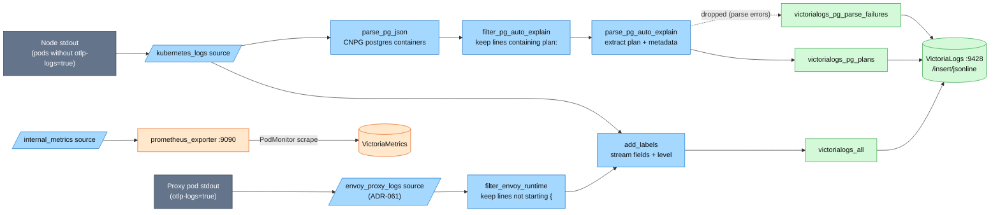
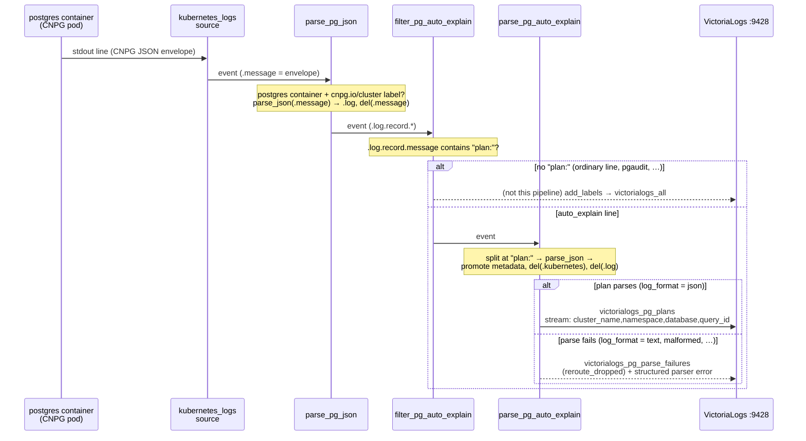

# Vector — the infra-log pipeline

The **collection agent** of the logs pillar's infra path: one cluster-wide
DaemonSet that tails the stdout of everything **not** OTel-instrumented —
databases (including parsed PostgreSQL `auto_explain` plans), the frontend, and
system pods — and ships it to [VictoriaLogs](victorialogs.md). App pods and the
Envoy edge ship their own logs over OTLP and are excluded here by label
([hub](README.md#overview)), with one deliberate carve-out since ADR-061: a
dedicated source tails the proxy pods again for their **runtime lines only**.

| | |
|---|---|
| **Deployment** | Helm chart `vector` `0.57.0`, `role: Agent` (DaemonSet), ns `kube-system` |
| **Sources** | `kubernetes_logs` (`extra_label_selector: platform.duynhlab.dev/otlp-logs!=true`) + `envoy_proxy_logs` (ADR-061: proxy pods only, runtime lines only) |
| **Sinks** | 3 × VictoriaLogs jsonline (`all`, `pg_plans`, `pg_parse_failures`) + `prometheus_exporter` `:9090` |
| **Resources** | requests `20m` / `32Mi`, limits `200m` / `256Mi` |
| **Self-monitoring** | `podMonitor` → VMPodScrape → VMAgent; Grafana dashboard `21954` (provisioned) |
| **Manifest** | [`kubernetes/infra/controllers/logging/vector/vector.yaml`](../../../kubernetes/infra/controllers/logging/vector/vector.yaml) |

---

## Why Vector still runs (and what it must not read)

Since RFC-0014 P4 the 10 Go services + 2 workers tee their logs to OTLP, and
since ADR-060 the Envoy edge does too. Vector remains the agent for everything
that *can't* do that. Two configuration decisions make the split safe:

- **The exclusion label is the double-ingest guard.** Every OTLP-shipping pod
  carries `platform.duynhlab.dev/otlp-logs=true`, and Vector's `kubernetes_logs`
  source excludes them (`extra_label_selector: "platform.duynhlab.dev/otlp-logs!=true"`).
  Remove the label from a pod and VictoriaLogs silently holds every line of it
  twice. The label is tied to the same ResourceSet input as `OTEL_LOGS_ENABLED`,
  so flipping a service's `otel_logs_enabled` to `"false"` flips the label with
  it and Vector resumes tailing instantly — that is the RFC's rollback path.
- **Tolerations cover the control plane.** A log collector must run on every
  node. Without the control-plane toleration the DaemonSet skipped the tainted
  control-plane node — which on Kind is exactly where the edge lives
  (`kind-up.sh` labels it `ingress-ready=true` and both Envoy proxy replicas are
  pinned there). The gateway access log — the first thing you reach for when a
  route misbehaves — never reached VictoriaLogs, while the Envoy *control-plane*
  pod on a worker was collected normally and masked the gap.
- **The edge-runtime carve-out (ADR-061).** The label exclusion silenced Envoy's
  *runtime* logs along with the access log — but only the access log has an
  OTLP sink, so runtime warnings were collected nowhere. A second
  `kubernetes_logs` source (`envoy_proxy_logs`) selects **only** the proxy pods
  via an existence selector on `gateway.envoyproxy.io/owning-gateway-name`
  (app pods never match it), and `filter_envoy_runtime` keeps only lines not
  starting with `{` — access logs are our declared JSON format and travel
  OTLP → ClickHouse, so a `{` line here would be a double-store.

## Pipeline



### Transforms

| Transform | Type | What it does |
|---|---|---|
| `add_labels` | remap | Builds the stream fields: `service` from the pod's `app` label (pod name as fallback, `"system"` last resort), `namespace`, `pod_name`, `container_name`; keeps `stream` (stdout/stderr) as a regular field; parses the message as JSON to lift `level` when present |
| `filter_envoy_runtime` | filter | ADR-061: from the `envoy_proxy_logs` source, keeps only Envoy *runtime* lines (`!starts_with(.message, "{")`) — the access-log JSON travels OTLP → ClickHouse instead |
| `parse_pg_json` | remap | For CNPG `postgres` containers (label `cnpg.io/cluster`): parses the CloudNativePG JSON wrapper into `.log` |
| `filter_pg_auto_explain` | filter | Keeps only records whose `log.record.message` contains `plan:` — the `auto_explain` signature |
| `parse_pg_auto_explain` | remap | Extracts the execution plan and its metadata (below); `drop_on_error` + `reroute_dropped` sends parse failures to their own sink instead of losing them |

### Sinks

All three VictoriaLogs sinks post to `/insert/jsonline` with memory buffers and
`when_full: drop_newest` — under a burst the pipeline sheds the newest lines
rather than blocking the agent. Headers (stream identity per sink) are owned by
[`victorialogs.md § ingest contract`](victorialogs.md#per-sender-ingest-contract).

| Sink | Input | Batch | Buffer (`max_events`) |
|---|---|---|---|
| `victorialogs_all` | `add_labels` | 1000 / 5s | 10000 |
| `victorialogs_pg_plans` | `parse_pg_auto_explain` | 100 / 5s | 1000 |
| `victorialogs_pg_parse_failures` | `parse_pg_auto_explain.dropped` | 100 / 10s | 500 |

At scale: size buffers up or switch to disk buffers, and drop or sample noisy
debug lines in a transform *before* they ship — volume control belongs at the
edge of the pipeline, not in the store.

## PostgreSQL pipeline

The most elaborate thing Vector does here: turn PostgreSQL **`auto_explain`**
output — the execution plan of every query slower than `1s`, logged by the
server itself — into a dedicated, queryable VictoriaLogs stream keyed by
`cluster_name` / `database` / `query_id`. This section walks the record through
every hop, because two format contracts have to hold for it to work at all.
What the stream is **for** — the 2am "this query got 10× slower, what plan did
it run at the time?" investigation — is the
[plan-regression runbook](../runbooks/postgresql/plan-regression-investigation.md).

### The two format contracts

1. **CloudNativePG logs JSON.** CNPG always wraps every PostgreSQL log line in
   its own JSON envelope (`record.message` carries the original PG message) —
   that part needs no configuration.
2. **auto_explain must log JSON too.** The parser reads the payload after
   `plan:` with `parse_json` and extracts JSON-format keys (`Plan`,
   `Query Text`, `Planning Time`, `Execution Time`) — so every CNPG cluster
   that preloads `auto_explain` **must set `auto_explain.log_format: "json"`**
   (`platform-db` and `product-db` `instance.yaml` do). The PostgreSQL default
   is `text`, and with it the pipeline fails *silently and completely*: the
   filter still matches (`plan:` is present), the JSON parse fails, and **every
   plan lands in the `victorialogs_pg_parse_failures` debug sink instead of the
   plans stream**. That is not hypothetical — the 2026-08-25 audit found
   exactly this live (plans stream **0** records over 6h, failure stream 8)
   because the parameter was missing; adding it fixed the pipeline within one
   config reload, no restart.

### The record, hop by hop



**Hop 0 — what PostgreSQL writes** (real line from `product-db-1`, abridged;
note the PG message is a *string embedded in* CNPG's envelope, and `query_id`
is already there because `compute_query_id = auto` + `pg_stat_statements`
preloaded turns it on):

```json
{"level":"info","logger":"postgres","msg":"record","logging_pod":"product-db-1",
 "record":{"user_name":"postgres","database_name":"postgres",
   "message":"duration: 1301.086 ms  plan:\n{\n  \"Query Text\": \"select pg_sleep(1.3);\",\n  \"Plan\": {\n    \"Node Type\": \"Result\", ... \"Actual Total Time\": 1301.070 ... }\n}",
   "query_id":"-5191732810777595558"}}
```

**Hop 1 — `parse_pg_json`.** Scoped to `container_name == "postgres"` on pods
labelled `cnpg.io/cluster`: parses the envelope into `.log` and **deletes
`.message`**. This deletion matters later: a record that dies downstream
carries no `message` field, which is why failure-sink records render as
`missing _msg field` in VictoriaLogs.

**Hop 2 — `filter_pg_auto_explain`.** Keeps only events whose
`.log.record.message` contains `plan:` — the auto_explain signature. Everything
else from the postgres container (startup chatter, **pgaudit** rows) simply
doesn't enter this pipeline; it still reaches VictoriaLogs via `add_labels` →
`victorialogs_all`, because both transforms read from the same source.

**Hop 3 — `parse_pg_auto_explain`**, the parser, condensed from its 10 VRL
steps:

1. Read `.log.record.message`; abort (→ failure sink) if missing.
2. Split it at `plan:` — the left half holds `duration: X ms`, the right half
   is the plan payload.
3. `parse_json` the payload — **the step that hard-requires
   `log_format: json`**; abort with a structured `json_parse_failure` error on
   anything else.
4. Promote the metadata that becomes the record's identity and query fields:

   | Field | Source |
   |---|---|
   | `cluster_name` | pod label `cnpg.io/cluster` |
   | `namespace`, `pod_name` | pod metadata |
   | `database`, `user`, `query_id` | `.log.record.*` (CNPG envelope) |
   | `query_text`, `plan_json` | plan JSON (`Query Text`, `Plan`) |
   | `duration_ms` | regex on the left half (`duration: (…) ms`) |
   | `planning_time_ms`, `execution_time_ms` | plan JSON, when present |

5. Build a human `message` (`Query plan for queryid=… (duration=…ms)`).
6. `del(.kubernetes)`, `del(.log)` — the stored record keeps only the fields
   above.

**Hop 4 — the sink.** `victorialogs_pg_plans` ships with `VL-Msg-Field:
plan_json` and `VL-Stream-Fields: cluster_name,namespace,database,query_id` —
so in Grafana the *plan itself* is the log body, and the stream identity is
the query, not the pod. The record that lands (real, after the fix):

```json
{"_stream":"{cluster_name=\"product-db\",database=\"postgres\",namespace=\"product\",query_id=\"-5191732810777595558\"}",
 "_msg":"{\"Node Type\":\"Result\", ... \"Actual Total Time\":1301.07 ...}",
 "duration_ms":"1301.086","query_text":"select pg_sleep(1.3);",
 "pod_name":"product-db-1","user":"postgres",
 "message":"Query plan for queryid=-5191732810777595558 (duration=1301.086ms)"}
```

### The failure path is a feature

Anything the parser aborts on is **not** lost: `drop_on_error` +
`reroute_dropped` route the original event to `victorialogs_pg_parse_failures`
(stream: `kubernetes.container_name`, `kubernetes.pod_name`), and the parser
also `log()`s a structured warn/error naming the failing step
(`missing_field` / `split_failure` / `json_parse_failure`) with the cluster and
a 100-char `json_preview`. So "plans are missing" is always diagnosable from
Grafana: **read the failure stream first** — if plans are landing there, the
parser is telling you which contract broke.

**pgaudit** rows (`pgaudit.log = 'ddl, write'`, enabled on all CNPG clusters)
take the ordinary path instead: they are CNPG-JSON like everything else from the
`postgres` container but contain no `plan:`, so they flow through `add_labels` →
`victorialogs_all` **unparsed** — the CNPG envelope (with its
`"logger":"pgaudit"` key) is the stored `_msg`, surfaced at query time via
`unpack_json` ([recipe](logsql-guide.md#pgaudit-rides-the-infra-stream-as-raw-cnpg-json)).
There are **no per-cluster logging sidecars** — one DaemonSet covers audit rows
and plans alike.

## Self-monitoring

Vector exposes its own metrics in Prometheus text format (`internal_metrics`
source → `prometheus_exporter` sink on `:9090`). The chart's
`podMonitor.enabled: true` creates a `PodMonitor`, the VM Operator converts it
to a `VMPodScrape`, and VMAgent scrapes it into VMSingle — so pipeline health is
queryable like any other workload.

```promql
up{job="vector"}                                                   # agent health
rate(vector_events_processed_total[5m])                            # events/sec by component
rate(vector_component_errors_total[5m])                            # error rate
rate(vector_component_sent_bytes_total{component_name=~"victorialogs.*"}[5m])  # sink throughput
vector_buffer_events                                               # buffer depth
```

The **Vector dashboard (Grafana.com ID `21954`) is provisioned by GitOps** —
[`grafana-dashboard-vector.yaml`](../../../kubernetes/infra/configs/observability/grafana/dashboards/grafana-dashboard-vector.yaml),
folder *Platform / Infrastructure* — covering events/sec, error rates, buffer
utilization, and throughput. No Vector-specific alert rules are deployed;
suggested starting points if the pipeline earns them: error rate
(`rate(vector_component_errors_total[5m]) > 10`), buffer overflow
(`vector_buffer_events > 10000`), low throughput
(`rate(vector_events_processed_total[5m]) < 100`).

## Troubleshooting

### No logs in VictoriaLogs

```bash
# 1. Agent running on every node?
kubectl get pods -n kube-system -l app.kubernetes.io/name=vector

# 2. Sink connectivity errors?
kubectl logs -n kube-system -l app.kubernetes.io/name=vector --tail=100 | grep -i "victorialogs\|connection\|error"

# 3. Store reachable from inside the cluster?
kubectl run -it --rm debug --image=curlimages/curl -- \
  curl -s http://vlsingle-victoria-logs.monitoring.svc:9428/health
```

If a *specific* pod is missing while others arrive, check its labels — a pod
carrying `platform.duynhlab.dev/otlp-logs=true` is deliberately not tailed
(its logs should be arriving via the Collector instead).

### PostgreSQL plans not appearing

Checklist in root-cause order (1 and 3 are what the 2026-08-25 audit actually
found and used):

1. **`auto_explain.log_format` must be `json`** — the [format contract](#the-two-format-contracts).
   With the PG default `text`, *every* plan silently lands in the failure sink
   and the plans stream stays at zero:
   ```bash
   kubectl exec -n product product-db-1 -c postgres -- \
     psql -U postgres -Atc "show auto_explain.log_format;"   # must print: json
   ```
2. **auto_explain loaded and the threshold reachable?**
   `show shared_preload_libraries;` must include `auto_explain`, and the test
   query must exceed `log_min_duration` (1s here) — use
   `SELECT pg_sleep(1.3);`, not `pg_sleep(1)` sitting exactly on the threshold.
3. **Read the failure stream first** — the parser says *why* it dropped:
   ```logsql
   _stream:{"kubernetes.container_name"="postgres"} _time:1h
   ```
   Plans landing here instead of `_stream:{cluster_name!=""}` is diagnostic by
   itself; the parser's own warn/error (`error_type`: `missing_field` /
   `split_failure` / `json_parse_failure`, plus a `json_preview`) is in the
   Vector pod logs.
4. **Transform active?**
   `kubectl logs -n kube-system -l app.kubernetes.io/name=vector | grep -i pg_auto_explain`

### High memory usage

```bash
kubectl top pods -n kube-system -l app.kubernetes.io/name=vector
```

Reduce the buffer on the big sink in the HelmRelease (`victorialogs_all` →
`buffer.max_events: 10000` is the knob), or move it to a disk buffer.

Query-side symptoms (logs ingested but blank in Grafana) are
[`victorialogs.md § Troubleshooting`](victorialogs.md#troubleshooting--logs-ingested-but-blank-in-grafana).

## References

- [Logging hub](README.md) · [VictoriaLogs store](victorialogs.md) · [LogsQL guide](logsql-guide.md)
- [Vector docs](https://vector.dev/docs/) ·
  [VictoriaLogs Vector setup](https://docs.victoriametrics.com/victorialogs/data-ingestion/vector)
- [PostgreSQL metrics hub](../metrics/postgresql/README.md) — the metrics-side view of the same CNPG clusters

---

_Last updated: 2026-08-25 — ADR-061 adds the edge-runtime carve-out: a second
`kubernetes_logs` source scoped to the EG proxy pods whose filter keeps only
non-JSON runtime lines (the access log is ClickHouse-only now). Earlier the same
day: the PostgreSQL pipeline section was rebuilt hop-by-hop after a live audit
found `auto_explain.log_format` unset — every plan had been failing the JSON
parse into the `pg_parse_failures` sink; the parameter is now set and the
troubleshooting checklist runs in root-cause order._
