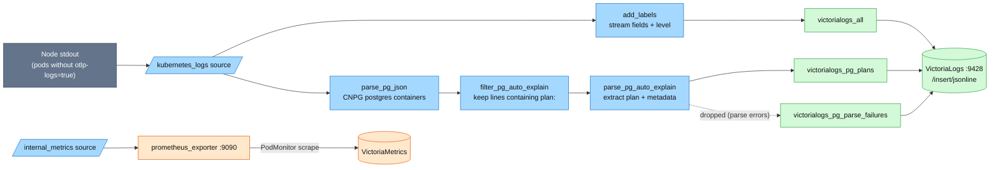

# Vector — the infra-log pipeline

The **collection agent** of the logs pillar's infra path: one cluster-wide
DaemonSet that tails the stdout of everything **not** OTel-instrumented —
databases (including parsed PostgreSQL `auto_explain` plans), the frontend, and
system pods — and ships it to [VictoriaLogs](victorialogs.md). App pods and the
Envoy edge ship their own logs over OTLP and are excluded here by label
([hub](README.md#overview)).

| | |
|---|---|
| **Deployment** | Helm chart `vector` `0.57.0`, `role: Agent` (DaemonSet), ns `kube-system` |
| **Source** | `kubernetes_logs` with `extra_label_selector: platform.duynhlab.dev/otlp-logs!=true` |
| **Sinks** | 3 × VictoriaLogs jsonline (`all`, `pg_plans`, `pg_parse_failures`) + `prometheus_exporter` `:9090` |
| **Resources** | requests `20m` / `32Mi`, limits `200m` / `256Mi` |
| **Self-monitoring** | `podMonitor` → VMPodScrape → VMAgent; Grafana dashboard `21954` (provisioned) |
| **Manifest** | [`kubernetes/infra/controllers/logging/vector/vector.yaml`](../../../kubernetes/infra/controllers/logging/vector/vector.yaml) |

---

## Why Vector still runs (and what it must not read)

Since RFC-0014 P4 the 10 Go services + 2 workers tee their logs to OTLP, and
since ADR-060 the Envoy edge does too. Vector remains the agent for everything
that *can't* do that. Two configuration decisions make the split safe:

- **The exclusion label is the double-ingest guard.** Every OTLP-shipping pod
  carries `platform.duynhlab.dev/otlp-logs=true`, and Vector's `kubernetes_logs`
  source excludes them (`extra_label_selector: "platform.duynhlab.dev/otlp-logs!=true"`).
  Remove the label from a pod and VictoriaLogs silently holds every line of it
  twice. The label is tied to the same ResourceSet input as `OTEL_LOGS_ENABLED`,
  so flipping a service's `otel_logs_enabled` to `"false"` flips the label with
  it and Vector resumes tailing instantly — that is the RFC's rollback path.
- **Tolerations cover the control plane.** A log collector must run on every
  node. Without the control-plane toleration the DaemonSet skipped the tainted
  control-plane node — which on Kind is exactly where the edge lives
  (`kind-up.sh` labels it `ingress-ready=true` and both Envoy proxy replicas are
  pinned there). The gateway access log — the first thing you reach for when a
  route misbehaves — never reached VictoriaLogs, while the Envoy *control-plane*
  pod on a worker was collected normally and masked the gap.

## Pipeline



### Transforms

| Transform | Type | What it does |
|---|---|---|
| `add_labels` | remap | Builds the stream fields: `service` from the pod's `app` label (pod name as fallback, `"system"` last resort), `namespace`, `pod_name`, `container_name`; keeps `stream` (stdout/stderr) as a regular field; parses the message as JSON to lift `level` when present |
| `parse_pg_json` | remap | For CNPG `postgres` containers (label `cnpg.io/cluster`): parses the CloudNativePG JSON wrapper into `.log` |
| `filter_pg_auto_explain` | filter | Keeps only records whose `log.record.message` contains `plan:` — the `auto_explain` signature |
| `parse_pg_auto_explain` | remap | Extracts the execution plan and its metadata (below); `drop_on_error` + `reroute_dropped` sends parse failures to their own sink instead of losing them |

### Sinks

All three VictoriaLogs sinks post to `/insert/jsonline` with memory buffers and
`when_full: drop_newest` — under a burst the pipeline sheds the newest lines
rather than blocking the agent. Headers (stream identity per sink) are owned by
[`victorialogs.md § ingest contract`](victorialogs.md#per-sender-ingest-contract).

| Sink | Input | Batch | Buffer (`max_events`) |
|---|---|---|---|
| `victorialogs_all` | `add_labels` | 1000 / 5s | 10000 |
| `victorialogs_pg_plans` | `parse_pg_auto_explain` | 100 / 5s | 1000 |
| `victorialogs_pg_parse_failures` | `parse_pg_auto_explain.dropped` | 100 / 10s | 500 |

At scale: size buffers up or switch to disk buffers, and drop or sample noisy
debug lines in a transform *before* they ship — volume control belongs at the
edge of the pipeline, not in the store.

## PostgreSQL pipeline

CloudNativePG wraps every PostgreSQL log line in JSON, and all CNPG clusters
run `auto_explain` — so slow-query execution plans arrive as JSON embedded in a
`"duration: X.X ms  plan: {...}"` message. The three `pg_*` transforms turn that
into a dedicated queryable stream:

1. `parse_pg_json` unwraps the CNPG JSON (only for `postgres` containers of
   `cnpg.io/cluster` pods).
2. `filter_pg_auto_explain` keeps the `plan:` lines.
3. `parse_pg_auto_explain` splits the message at `plan:`, parses the plan JSON,
   and promotes the metadata that becomes the stream + query fields:
   `cluster_name`, `namespace`, `database`, `query_id`, plus `pod_name`, `user`,
   `query_text`, `plan_json`, `duration_ms`, `planning_time_ms`,
   `execution_time_ms`. Kubernetes metadata is deleted at the end to keep the
   stored record small.

Any record the parser cannot handle is not silently dropped: `reroute_dropped`
routes it — with a structured warn/error from the parser itself — to
`victorialogs_pg_parse_failures`, so the parser's own failure modes are
debuggable from Grafana.

**pgaudit** rows (`pgaudit.log = 'ddl, write'`, enabled on all CNPG clusters)
take the ordinary path instead: they are CNPG-JSON like everything else from the
`postgres` container but contain no `plan:`, so they flow through `add_labels` →
`victorialogs_all` carrying `logger: pgaudit`. There are **no per-cluster logging
sidecars** — one DaemonSet covers audit rows and plans alike.

## Self-monitoring

Vector exposes its own metrics in Prometheus text format (`internal_metrics`
source → `prometheus_exporter` sink on `:9090`). The chart's
`podMonitor.enabled: true` creates a `PodMonitor`, the VM Operator converts it
to a `VMPodScrape`, and VMAgent scrapes it into VMSingle — so pipeline health is
queryable like any other workload.

```promql
up{job="vector"}                                                   # agent health
rate(vector_events_processed_total[5m])                            # events/sec by component
rate(vector_component_errors_total[5m])                            # error rate
rate(vector_component_sent_bytes_total{component_name=~"victorialogs.*"}[5m])  # sink throughput
vector_buffer_events                                               # buffer depth
```

The **Vector dashboard (Grafana.com ID `21954`) is provisioned by GitOps** —
[`grafana-dashboard-vector.yaml`](../../../kubernetes/infra/configs/observability/grafana/dashboards/grafana-dashboard-vector.yaml),
folder *Platform / Infrastructure* — covering events/sec, error rates, buffer
utilization, and throughput. No Vector-specific alert rules are deployed;
suggested starting points if the pipeline earns them: error rate
(`rate(vector_component_errors_total[5m]) > 10`), buffer overflow
(`vector_buffer_events > 10000`), low throughput
(`rate(vector_events_processed_total[5m]) < 100`).

## Troubleshooting

### No logs in VictoriaLogs

```bash
# 1. Agent running on every node?
kubectl get pods -n kube-system -l app.kubernetes.io/name=vector

# 2. Sink connectivity errors?
kubectl logs -n kube-system -l app.kubernetes.io/name=vector --tail=100 | grep -i "victorialogs\|connection\|error"

# 3. Store reachable from inside the cluster?
kubectl run -it --rm debug --image=curlimages/curl -- \
  curl -s http://vlsingle-victoria-logs.monitoring.svc:9428/health
```

If a *specific* pod is missing while others arrive, check its labels — a pod
carrying `platform.duynhlab.dev/otlp-logs=true` is deliberately not tailed
(its logs should be arriving via the Collector instead).

### PostgreSQL plans not appearing

1. `auto_explain` enabled in the cluster's PostgreSQL parameters?
2. The filter/parser active? `kubectl logs -n kube-system -l app.kubernetes.io/name=vector | grep -i pg_auto_explain`
3. Check the failure stream: `_stream:{"kubernetes.container_name"!=""}` in
   Grafana surfaces records the parser rejected, with the parser's own error.
4. Generate a slow query to trigger a plan: `SELECT pg_sleep(1);` on `product-db`.

### High memory usage

```bash
kubectl top pods -n kube-system -l app.kubernetes.io/name=vector
```

Reduce the buffer on the big sink in the HelmRelease (`victorialogs_all` →
`buffer.max_events: 10000` is the knob), or move it to a disk buffer.

Query-side symptoms (logs ingested but blank in Grafana) are
[`victorialogs.md § Troubleshooting`](victorialogs.md#troubleshooting--logs-ingested-but-blank-in-grafana).

## References

- [Logging hub](README.md) · [VictoriaLogs store](victorialogs.md) · [LogsQL guide](logsql-guide.md)
- [Vector docs](https://vector.dev/docs/) ·
  [VictoriaLogs Vector setup](https://docs.victoriametrics.com/victorialogs/data-ingestion/vector)
- [PostgreSQL metrics hub](../metrics/postgresql/README.md) — the metrics-side view of the same CNPG clusters

---

_Last updated: 2026-08-25 — split out of the logging README. States what the
manifest actually runs: the exclusion-label mechanics and rollback path, the
control-plane toleration story, per-sink batch/buffer numbers, the parse-failure
reroute, and that dashboard 21954 is GitOps-provisioned (it was described as
merely "pre-built")._
