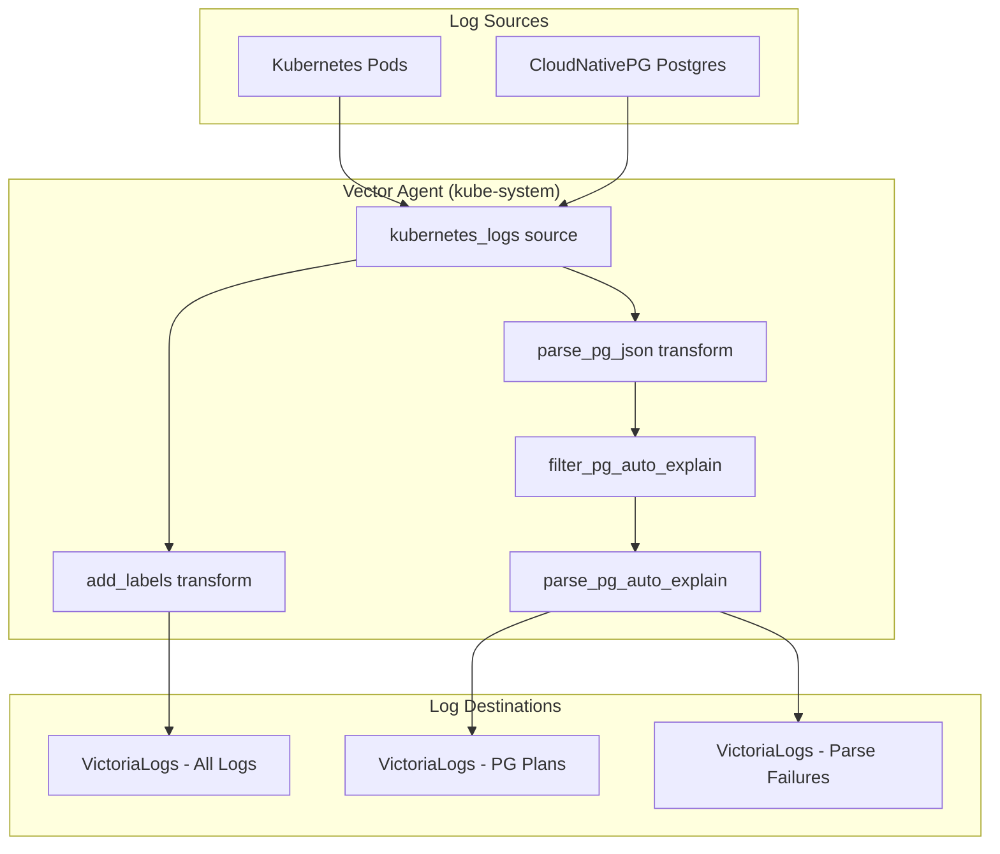

# VictoriaLogs

VictoriaLogs is the cluster's log storage backend. It provides high-performance log ingestion and querying using LogsQL.

> Backend & pipeline **ops reference**. For the logging architecture, the
> why-this-stack rationale, and scaling, see the [logging hub](README.md); for how
> services emit logs (libraries, format, levels), see
> [Logging Standards](logging-standards.md).

## Architecture



### Single Vector Design

This deployment uses a **single cluster-wide Vector Agent** (`kube-system/vector`) that ships logs to VictoriaLogs. The VictoriaLogs Helm chart's embedded Vector/collector is **disabled** to avoid conflicts.

**Why single Vector?**
- Eliminates duplicate log collection
- Simplifies configuration management
- Reduces resource overhead
- Consistent log processing

## Components

| Component | CRD/Kind | Namespace | Purpose |
|-----------|----------|-----------|---------|
| VLSingle | `VLSingle` (VM Operator) | `monitoring` | Log storage and query engine |
| Vector | `HelmRelease` | `kube-system` | Log collection agent (DaemonSet) |

## Grafana

VictoriaLogs is available in Grafana as a **VictoriaLogs** datasource (plugin `victoriametrics-logs-datasource`), provisioned by GitOps:

- **CR**: [`kubernetes/infra/configs/monitoring/grafana/datasource-victorialogs.yaml`](../../../kubernetes/infra/configs/monitoring/grafana/datasource-victorialogs.yaml)
- **UID**: `victorialogs`
- **URL**: `http://vlsingle-victoria-logs.monitoring.svc.cluster.local:9428`

After `kubectl port-forward -n monitoring svc/grafana-service 3000:3000`, use **Explore → VictoriaLogs** and LogsQL (e.g. `*` or `_stream:{namespace="product"}`). Plugin reference: [Grafana VictoriaLogs datasource](https://grafana.com/grafana/plugins/victoriametrics-logs-datasource/).

## Endpoints

### VictoriaLogs Service (Operator-Managed)

- **Service**: `vlsingle-victoria-logs.monitoring.svc`
- **Port**: `9428`

### Ingestion Endpoints

| Endpoint | Purpose | Used By |
|----------|---------|---------|
| `/insert/jsonline` | JSON Lines ingestion | Vector sinks |
| `/insert/elasticsearch` | Elasticsearch-compatible bulk API | Alternative ingestion |
| `/select/logsql/query` | LogsQL query endpoint | Grafana datasource |

### Vector Sink Headers

The Vector sinks use the following VictoriaLogs-specific headers:

```yaml
request:
  headers:
    VL-Time-Field: timestamp      # Field containing log timestamp
    VL-Msg-Field: message         # Field containing log message
    VL-Stream-Fields: namespace,service,pod_name,container_name  # Stream indexing
    AccountID: "0"                # Multi-tenancy (default: 0)
    ProjectID: "0"                # Multi-tenancy (default: 0)
```

## Log Streams

### All Logs Stream

All Kubernetes logs are shipped to VictoriaLogs with these stream fields:
- `namespace`
- `service`
- `pod_name`
- `container_name`

### PostgreSQL Query Plans Stream

CloudNativePG auto_explain logs are parsed and stored with:
- `cluster_name` - CloudNativePG cluster name
- `namespace` - Kubernetes namespace
- `database` - PostgreSQL database name
- `query_id` - PostgreSQL query ID

## Configuration

### VLSingle CRD (Operator-Managed)

Location: `kubernetes/infra/configs/monitoring/victoriametrics/vlsingle.yaml`

Key settings:
```yaml
apiVersion: operator.victoriametrics.com/v1
kind: VLSingle
metadata:
  name: victoria-logs
  namespace: monitoring
spec:
  retentionPeriod: "7d"
  removePvcAfterDelete: true
  storage:
    resources:
      requests:
        storage: 20Gi
```

### Vector HelmRelease

Location: `kubernetes/infra/controllers/logging/vector/vector.yaml`

The Vector config includes:
- **Sources**: `kubernetes_logs`
- **Transforms**: `add_labels`, `parse_pg_json`, `filter_pg_auto_explain`, `parse_pg_auto_explain`
- **Sinks**: `victorialogs_all`, `victorialogs_pg_plans`, `victorialogs_pg_parse_failures`

## Vector self-monitoring

Vector exposes its own metrics in **Prometheus text format** (`internal_metrics`
source → `prometheus_exporter` sink on port `9090`). VMAgent scrapes them
(`ServiceMonitor` → `VMServiceScrape`, converted by the VM Operator, 30s interval)
and remote-writes to VMSingle, so pipeline health is queryable in Grafana against
the VictoriaMetrics datasource like any other workload.

Key metrics (PromQL):

```promql
up{job="vector"}                                                   # agent health
rate(vector_events_processed_total[5m])                            # events/sec by component
rate(vector_component_errors_total[5m])                            # error rate
rate(vector_component_sent_bytes_total{component_name=~"victorialogs.*"}[5m])  # sink throughput
vector_buffer_events                                               # buffer depth
```

A pre-built Vector dashboard (Grafana.com ID `21954`) covers events/sec, error
rates, buffer utilization, and throughput. Suggested alerts: high error rate
(`rate(vector_component_errors_total[5m]) > 10`), buffer overflow
(`vector_buffer_events > 10000`), low throughput
(`rate(vector_events_processed_total[5m]) < 100`).

## Verification

### Check Operator Resources

```bash
# Check VLSingle status
kubectl get vlsingle -n monitoring

# Check pods
kubectl get pods -n monitoring -l app.kubernetes.io/name=vlsingle
kubectl get pods -n kube-system -l app.kubernetes.io/name=vector
```

### Check VictoriaLogs Health

```bash
# Port-forward to VictoriaLogs
kubectl port-forward -n monitoring svc/vlsingle-victoria-logs 9428:9428

# Check health endpoint
curl http://localhost:9428/health

# Query logs (LogsQL)
curl -G 'http://localhost:9428/select/logsql/query' \
  --data-urlencode 'query=_stream:{namespace="monitoring"}' \
  --data-urlencode 'limit=10'
```

### Check Vector Logs

```bash
# Check Vector logs for successful pushes
kubectl logs -n kube-system -l app.kubernetes.io/name=vector --tail=100 | grep -i victorialogs

# Check for errors
kubectl logs -n kube-system -l app.kubernetes.io/name=vector --tail=100 | grep -i error
```

### Verify PostgreSQL Plan Ingestion

```bash
# Query for PostgreSQL plans in VictoriaLogs
curl -G 'http://localhost:9428/select/logsql/query' \
  --data-urlencode 'query=_stream:{cluster_name!=""}' \
  --data-urlencode 'limit=10'
```

## Troubleshooting

### No Logs in VictoriaLogs

1. **Check Vector is running**:
   ```bash
   kubectl get pods -n kube-system -l app.kubernetes.io/name=vector
   ```

2. **Check Vector sink connectivity**:
   ```bash
   kubectl logs -n kube-system -l app.kubernetes.io/name=vector | grep -i "victorialogs\|connection\|error"
   ```

3. **Verify VictoriaLogs service is accessible**:
   ```bash
   kubectl run -it --rm debug --image=curlimages/curl -- \
     curl -s http://vlsingle-victoria-logs.monitoring.svc:9428/health
   ```

### PostgreSQL Plans Not Appearing

1. **Verify CloudNativePG clusters have auto_explain enabled** in PostgreSQL parameters

2. **Check filter is working**:
   ```bash
   kubectl logs -n kube-system -l app.kubernetes.io/name=vector | grep -i "pg_auto_explain"
   ```

3. **Generate a slow query** to trigger auto_explain:
   ```sql
   -- Connect to cnpg-db (product, cart, or order database)
   SELECT pg_sleep(1);
   ```

### High Memory Usage in Vector

If Vector is consuming too much memory:

1. **Check current resource usage**:
   ```bash
   kubectl top pods -n kube-system -l app.kubernetes.io/name=vector
   ```

2. **Adjust buffer settings** in Vector HelmRelease:
   ```yaml
   buffer:
     type: memory
     max_events: 5000  # Reduce from 10000
     when_full: drop_newest
   ```

## Related Documentation

- **Official VictoriaLogs Docs**: https://docs.victoriametrics.com/victorialogs/
- **VictoriaLogs Vector Setup**: https://docs.victoriametrics.com/victorialogs/data-ingestion/vector
- **VictoriaLogs Helm Chart**: https://docs.victoriametrics.com/helm/victorialogs-single/
- **LogsQL Query Language**: https://docs.victoriametrics.com/victorialogs/logsql/
- **Vector Documentation**: https://vector.dev/docs/

## Manifest Locations

| Resource | Path |
|----------|------|
| VLSingle CRD | `kubernetes/infra/configs/monitoring/victoriametrics/vlsingle.yaml` |
| VM Operator | `kubernetes/infra/controllers/metrics/victoria-metrics-operator.yaml` |
| Vector HelmRelease | `kubernetes/infra/controllers/logging/vector/vector.yaml` |

---

_Last updated: 2026-06-29 — VLSingle `:9428` (VM Operator, 7d/20Gi), single Vector DaemonSet (all-logs + PG auto_explain streams), Vector self-monitoring via VMAgent._
