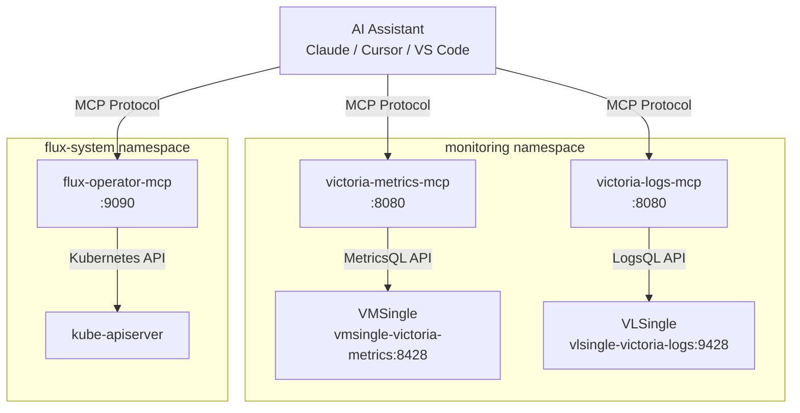
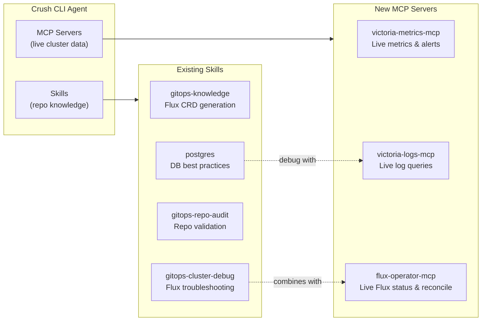

# MCP Servers for AI-Assisted Observability & GitOps

## Overview

MCP (Model Context Protocol) servers expose observability data and GitOps operational capabilities to AI assistants. This enables AI agents to query metrics, logs, reconcile Flux resources, and assist engineers with debugging/troubleshooting directly from their IDE or CLI.

This document covers deploying **3 MCP servers** in the homelab cluster:

| MCP Server | Purpose | Connects To | Chart Version |
|---|---|---|---|
| **victoria-metrics-mcp** | Query metrics, alerts, cardinality, rules | VMSingle | `0.2.0` |
| **victoria-logs-mcp** | Query logs, streams, fields | VLSingle | `0.1.0` |
| **flux-operator-mcp** | Flux resources, reconciliation, logs | Kubernetes API | Latest |



---

## 1. VictoriaMetrics MCP Server

### What It Does

Exposes VictoriaMetrics metrics data to AI assistants via MCP protocol. Capabilities:

- **Query metrics** using MetricsQL (with graph rendering if client supports it)
- **List/export** available metrics, labels, label values, entire time series
- **Analyze alerting/recording rules** and active alerts
- **Explore cardinality** and metrics usage statistics
- **Debug** relabeling rules, downsampling, retention policy configurations
- **Trace/explain queries** for optimization

### Helm Chart Values

```yaml
# victoria-metrics-mcp HelmRelease values
# Chart: oci://ghcr.io/victoriametrics/helm-charts/victoria-metrics-mcp
# Version: 0.2.0

nameOverride: vmm

mcp:
  mode: http           # http (streamable) or sse (legacy)
  heartbeatInterval: 30s
  disable:
    tools: []           # list of tool names to disable
    resources: false    # disable MCP resources (docs tool still works)
  passthroughHeaders: []

vm:
  type: single          # single or cluster
  entrypoint: "http://vmsingle-victoria-metrics.monitoring.svc:8428"
  bearerToken: ""       # auth token (not needed for in-cluster)
  cloudAPIKey: ""       # only for VictoriaMetrics Cloud
  headers: []

service:
  type: ClusterIP
  port: 8080

resources:
  requests:
    cpu: 10m
    memory: 32Mi
  limits:
    cpu: 200m
    memory: 128Mi

scrape:
  enabled: true         # enable self-monitoring VMServiceScrape
```

### Key Configuration Notes

| Parameter | Description | Our Value |
|---|---|---|
| `vm.type` | `single` for VMSingle, `cluster` for vmselect | `single` |
| `vm.entrypoint` | Root URL of VMSingle (not `/api/v1/query`) | `http://vmsingle-victoria-metrics.monitoring.svc:8428` |
| `mcp.mode` | `http` = Streamable HTTP (recommended), `sse` = legacy SSE | `http` |
| `mcp.disable.tools` | Disable specific tools by name | `[]` (all enabled) |
| `scrape.enabled` | Auto-create VMServiceScrape for self-monitoring | `true` |

---

## 2. VictoriaLogs MCP Server

### What It Does

Exposes VictoriaLogs log data to AI assistants. Capabilities:

- **Query logs** using LogsQL
- **List streams, fields, field values** for log exploration
- **Show VictoriaLogs instance parameters**
- **Query statistics** for logs-as-metrics analysis

### Helm Chart Values

```yaml
# victoria-logs-mcp HelmRelease values
# Chart: oci://ghcr.io/victoriametrics/helm-charts/victoria-logs-mcp
# Version: 0.1.0

nameOverride: vlm

mcp:
  mode: http
  heartbeatInterval: 30s
  disable:
    tools: []
    resources: false
  passthroughHeaders: []

vl:
  entrypoint: "http://vlsingle-victoria-logs.monitoring.svc:9428"
  bearerToken: ""
  headers: []

service:
  type: ClusterIP
  port: 8080

resources:
  requests:
    cpu: 10m
    memory: 32Mi
  limits:
    cpu: 200m
    memory: 128Mi

scrape:
  enabled: true
```

### Key Configuration Notes

| Parameter | Description | Our Value |
|---|---|---|
| `vl.entrypoint` | Root URL of VLSingle | `http://vlsingle-victoria-logs.monitoring.svc:9428` |
| `mcp.mode` | `http` recommended over `sse` | `http` |

---

## 3. Flux Operator MCP Server

### What It Does

Enables AI assistants to interact with Flux-managed Kubernetes clusters. Tools grouped by category:

**Reporting** (read-only):
- `get_flux_instance` — Flux installation details, component status
- `get_kubernetes_resources` — Any K8s/Flux resource + status + events
- `get_kubernetes_logs` — Pod container logs
- `get_kubernetes_metrics` — CPU/Memory usage (requires metrics-server)
- `get_kubernetes_api_versions` — Registered CRDs and preferred API versions

**Reconciliation** (write):
- `reconcile_flux_source` — Trigger GitRepository/OCIRepository/HelmRepository reconciliation
- `reconcile_flux_kustomization` — Trigger Kustomization reconciliation
- `reconcile_flux_helmrelease` — Trigger HelmRelease reconciliation
- `reconcile_flux_resourceset` — Trigger ResourceSet reconciliation

**Suspend/Resume**:
- `suspend_flux_reconciliation` / `resume_flux_reconciliation`

**Cluster Operations**:
- `apply_kubernetes_manifest` — Server-side apply YAML
- `delete_kubernetes_resource` — Delete resources
- `install_flux_instance` — Install Flux from manifest URL

**Documentation**:
- `search_flux_docs` — Search Flux documentation

### Helm Chart Values

```yaml
# flux-operator-mcp HelmRelease values
# Chart: oci://ghcr.io/controlplaneio-fluxcd/charts/flux-operator-mcp
# Version: latest

transport: http         # http (streamable) or sse (legacy)
readonly: false         # true in prod to disable write tools

networkPolicy:
  create: true
  ingress:
    namespaces: []      # namespaces allowed to access MCP server

rbac:
  create: true          # grants cluster-admin to flux-operator-mcp SA

resources:
  limits:
    cpu: 1000m
    memory: 1Gi
  requests:
    cpu: 10m
    memory: 64Mi

securityContext:
  runAsNonRoot: true
  readOnlyRootFilesystem: true
  allowPrivilegeEscalation: false
  capabilities:
    drop: ["ALL"]
  seccompProfile:
    type: "RuntimeDefault"
```

### Key Configuration Notes

| Parameter | Description | Our Value |
|---|---|---|
| `transport` | `http` (recommended) or `sse` (legacy) | `http` |
| `readonly` | Disable write operations (reconcile, apply, delete) | `false` (local dev) |
| `rbac.create` | Grants `cluster-admin` — required for full Flux access | `true` |
| `networkPolicy.create` | Restrict ingress to specific namespaces | `true` |

### Security Considerations

- **Read-only mode** (`readonly: true`): Disables reconcile, suspend, resume, apply, delete tools
- **Secret masking**: Enabled by default (masks Secret values)
- **Service Account impersonation**: Can restrict to specific SA permissions via `--kube-as`
- In-cluster deployment: kubeconfig context switching is disabled (single cluster only)

---

## Implementation Plan

| Phase | Scope | Files |
|---|---|---|
| **1** | Deploy VM MCP + VL MCP | `kubernetes/infra/controllers/mcp/victoria-metrics-mcp.yaml`, `victoria-logs-mcp.yaml` |
| **2** | Deploy Flux Operator MCP | `kubernetes/infra/controllers/mcp/flux-operator-mcp.yaml` |
| **3** | Wire into Flux Kustomization | `kubernetes/infra/controllers/kustomization.yaml` |
| **4** | Port-forward MCP servers | `kubectl port-forward` commands |
| **5** | Configure AI assistants (Crush, VS Code, Claude) | `.crush.json`, `.vscode/settings.json` |

### Phase 1: Deploy VictoriaMetrics MCP + VictoriaLogs MCP

**Files to create:**

```
kubernetes/infra/controllers/mcp/
├── kustomization.yaml
├── victoria-metrics-mcp.yaml    # HelmRelease
└── victoria-logs-mcp.yaml       # HelmRelease
```

**Deployment pattern** (matching existing OCI-based HelmRelease pattern):

```yaml
apiVersion: source.toolkit.fluxcd.io/v1
kind: OCIRepository
metadata:
  name: victoria-metrics-mcp-oci
  namespace: flux-system
spec:
  interval: 60m
  url: oci://ghcr.io/victoriametrics/helm-charts/victoria-metrics-mcp
  ref:
    semver: ">=0.2.0"
  layerSelector:
    mediaType: "application/vnd.cncf.helm.chart.content.v1.tar+gzip"
    operation: copy
---
apiVersion: helm.toolkit.fluxcd.io/v2
kind: HelmRelease
metadata:
  name: victoria-metrics-mcp
  namespace: monitoring
spec:
  interval: 30m
  chartRef:
    kind: OCIRepository
    name: victoria-metrics-mcp-oci
    namespace: flux-system
  values:
    nameOverride: vmm
    mcp:
      mode: http
    vm:
      type: single
      entrypoint: "http://vmsingle-victoria-metrics.monitoring.svc:8428"
    resources:
      requests:
        cpu: 10m
        memory: 32Mi
      limits:
        cpu: 200m
        memory: 128Mi
    scrape:
      enabled: true
```

### Phase 2: Deploy Flux Operator MCP

**Files to create:**

```
kubernetes/infra/controllers/mcp/
└── flux-operator-mcp.yaml       # HelmRelease
```

```yaml
apiVersion: source.toolkit.fluxcd.io/v1
kind: OCIRepository
metadata:
  name: flux-operator-mcp-oci
  namespace: flux-system
spec:
  interval: 60m
  url: oci://ghcr.io/controlplaneio-fluxcd/charts/flux-operator-mcp
  ref:
    semver: "*"
  layerSelector:
    mediaType: "application/vnd.cncf.helm.chart.content.v1.tar+gzip"
    operation: copy
---
apiVersion: helm.toolkit.fluxcd.io/v2
kind: HelmRelease
metadata:
  name: flux-operator-mcp
  namespace: flux-system
spec:
  interval: 30m
  chartRef:
    kind: OCIRepository
    name: flux-operator-mcp-oci
    namespace: flux-system
  values:
    transport: http
    readonly: false
    networkPolicy:
      create: true
    resources:
      requests:
        cpu: 10m
        memory: 64Mi
      limits:
        cpu: 500m
        memory: 512Mi
```

### Phase 3: Wire into Kustomization

Add `mcp/` to `kubernetes/infra/controllers/kustomization.yaml`:

```yaml
resources:
  # ... existing controllers ...
  - mcp/
```

### Phase 4: Port-Forward MCP Servers

After Flux reconciles, port-forward the MCP servers to localhost:

```bash
# Port-forward MCP servers
kubectl port-forward -n monitoring svc/vmm-victoria-metrics-mcp 8080:8080 &
kubectl port-forward -n monitoring svc/vlm-victoria-logs-mcp 8081:8080 &
kubectl port-forward -n flux-system svc/flux-operator-mcp 9090:9090 &
```

### Phase 5: Configure AI Assistants

Configure your AI assistant to connect to the MCP servers. Each tool has a different config format.

---

## AI Assistant Configuration

### Crush (CLI Agent — Primary)

We use [Crush](https://crush.ai) as the primary AI CLI agent. Crush supports MCP servers via `crush.json` (project-local or global).

**Current setup** (from `crush info`):

| Setting | Value |
|---|---|
| Model | `claude-opus-4.6` via GitHub Copilot |
| Existing MCPs | `hyper-mcp` (stdio), `drawio` (stdio) |
| Config file | `~/.local/share/crush/crush.json` |
| Skills | `gitops-cluster-debug`, `gitops-knowledge`, `gitops-repo-audit`, `postgres` |

#### Option A: Project-local config (recommended)

Create `.crush.json` in the repo root to add MCP servers scoped to this project only:

```json
{
  "$schema": "https://charm.land/crush.json",
  "mcp": {
    "victoria-metrics": {
      "type": "http",
      "url": "http://localhost:8080/mcp",
      "timeout": 30
    },
    "victoria-logs": {
      "type": "http",
      "url": "http://localhost:8081/mcp",
      "timeout": 30
    },
    "flux-operator": {
      "type": "http",
      "url": "http://localhost:9090/mcp",
      "timeout": 30
    }
  }
}
```

> **Note**: Project-local config merges with global config. Existing MCPs (`hyper-mcp`, `drawio`) from global config will still be available.

#### Option B: Global config

Add to `~/.local/share/crush/crush.json` under the `"mcp"` key (alongside existing `hyper-mcp` and `drawio`):

```json
{
  "mcp": {
    "hyper-mcp": { "..." : "existing" },
    "drawio": { "..." : "existing" },
    "victoria-metrics": {
      "type": "http",
      "url": "http://localhost:8080/mcp",
      "timeout": 30
    },
    "victoria-logs": {
      "type": "http",
      "url": "http://localhost:8081/mcp",
      "timeout": 30
    },
    "flux-operator": {
      "type": "http",
      "url": "http://localhost:9090/mcp",
      "timeout": 30
    }
  }
}
```

#### Verify Crush MCP Connection

After configuring, restart Crush and verify:

```bash
# Start Crush in the project directory
crush

# Inside Crush, check MCP status
> /info
# Should show:
# [mcp]
# victoria-metrics = connected (N tools, 0 resources)
# victoria-logs = connected (N tools, 0 resources)
# flux-operator = connected (N tools, 0 resources)
# hyper-mcp = connected (8 tools, 0 resources)
# drawio = connected (3 tools, 0 resources)
```

#### Crush Usage Examples

Once connected, you can use natural language in Crush to interact with the MCP servers:

```bash
# Metrics queries
> "Show me top 10 metrics by cardinality"
> "List all active alerts and their severity"
> "Explain this query: rate(http_requests_total{namespace='auth'}[5m])"
> "Debug my relabeling config for vmagent"

# Log queries
> "Show me error logs from the auth namespace in the last hour"
> "What log streams are available?"
> "Search logs for 'connection refused' across all namespaces"

# Flux operations
> "What version of Flux is running?"
> "Show me all failed HelmReleases"
> "Reconcile infrastructure-local Kustomization"
> "Get logs from the flux-system source-controller pod"
```

#### Crush + Skills Synergy

The MCP servers complement existing Crush skills for a complete DevOps workflow:



| Workflow | Skill | MCP Server | Combined Capability |
|---|---|---|---|
| Flux debugging | `gitops-cluster-debug` | `flux-operator` | Skill provides CRD knowledge + MCP queries live status |
| Alert investigation | — | `victoria-metrics` | AI queries MetricsQL, explains alerts, checks cardinality |
| Log analysis | — | `victoria-logs` | AI searches LogsQL, correlates with metrics |
| DB troubleshooting | `postgres` | `victoria-logs` + `victoria-metrics` | Skill guides queries + MCP fetches PG logs & metrics |
| Manifest generation | `gitops-knowledge` | `flux-operator` | Skill generates YAML + MCP validates live state |

---

### VS Code / Cursor

Add to `.vscode/settings.json` or Cursor settings:

```json
{
  "mcp": {
    "servers": {
      "victoria-metrics": {
        "type": "http",
        "url": "http://localhost:8080/mcp"
      },
      "victoria-logs": {
        "type": "http",
        "url": "http://localhost:8081/mcp"
      },
      "flux-operator": {
        "type": "http",
        "url": "http://localhost:9090/mcp"
      }
    }
  },
  "chat.mcp.enabled": true
}
```

> For VS Code: Enable **Agent mode** in GitHub Copilot Chat to access MCP tools.

### Claude Desktop

Add to `~/.config/claude/claude_desktop_config.json` (Linux) or `~/Library/Application Support/Claude/claude_desktop_config.json` (macOS):

```json
{
  "mcpServers": {
    "victoria-metrics": {
      "type": "http",
      "url": "http://localhost:8080/mcp"
    },
    "victoria-logs": {
      "type": "http",
      "url": "http://localhost:8081/mcp"
    },
    "flux-operator": {
      "type": "http",
      "url": "http://localhost:9090/mcp"
    }
  }
}
```

---

## Verification

After deployment and AI assistant configuration, test with these prompts:

### VictoriaMetrics MCP
- "What metrics are available in the monitoring namespace?"
- "Show me the top 10 metrics by cardinality"
- "List all active alerts"
- "Explain this query: `rate(http_requests_total[5m])`"

### VictoriaLogs MCP
- "Show me recent error logs from the auth namespace"
- "What log streams are available?"
- "Search for logs containing 'connection refused' in the last hour"

### Flux Operator MCP
- "What version of Flux is running?"
- "Show me all HelmReleases and their status"
- "Are there any failed Kustomizations?"
- "Reconcile the infrastructure-local Kustomization"

---

## Troubleshooting

### MCP Server Not Connecting

```bash
# Check pods are running
kubectl get pods -n monitoring -l app.kubernetes.io/name=victoria-metrics-mcp
kubectl get pods -n monitoring -l app.kubernetes.io/name=victoria-logs-mcp
kubectl get pods -n flux-system -l app.kubernetes.io/name=flux-operator-mcp

# Check HelmRelease status
kubectl get helmrelease -n monitoring victoria-metrics-mcp
kubectl get helmrelease -n monitoring victoria-logs-mcp
kubectl get helmrelease -n flux-system flux-operator-mcp

# Check MCP server health
curl http://localhost:8080/health/readiness   # VM MCP
curl http://localhost:8081/health/readiness   # VL MCP
curl http://localhost:9090/health             # Flux MCP
```

### Crush Shows "disconnected"

1. Verify port-forward is running: `ps aux | grep port-forward`
2. Test MCP endpoint: `curl http://localhost:8080/mcp`
3. Restart Crush: exit and re-enter the CLI
4. Check `crush info` output for MCP section errors

### VM MCP Can't Query Metrics

- Verify `vm.entrypoint` matches your VMSingle service: `kubectl get svc -n monitoring | grep vmsingle`
- Check network connectivity from MCP pod: `kubectl exec -n monitoring <mcp-pod> -- wget -qO- http://vmsingle-victoria-metrics.monitoring.svc:8428/health`

### Flux MCP Permission Errors

- Verify RBAC: `kubectl get clusterrolebinding | grep flux-operator-mcp`
- Check ServiceAccount: `kubectl get sa -n flux-system flux-operator-mcp`

---

## References

| Resource | URL |
|---|---|
| VictoriaMetrics MCP Docs | https://docs.victoriametrics.com/helm/victoria-metrics-mcp/ |
| VictoriaLogs MCP Docs | https://docs.victoriametrics.com/helm/victoria-logs-mcp/ |
| VM AI Tools Overview | https://docs.victoriametrics.com/ai-tools/ |
| Flux MCP Install Guide | https://fluxoperator.dev/docs/mcp/install/ |
| Flux MCP Tools Reference | https://fluxoperator.dev/docs/mcp/tools |
| Flux MCP Helm Chart | https://fluxoperator.dev/docs/charts/flux-operator-mcp |
| Flux MCP Configuration | https://fluxoperator.dev/docs/mcp/config |
| Crush MCP Config Docs | https://charm.land/crush (see MCP Servers section) |
| VictoriaMetrics MCP GitHub | https://github.com/VictoriaMetrics/mcp-victoriametrics |
| VictoriaLogs MCP GitHub | https://github.com/VictoriaMetrics/mcp-victorialogs |
| VM Agent Skills | https://github.com/VictoriaMetrics/skills |
