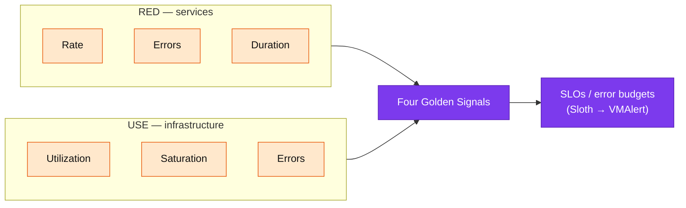
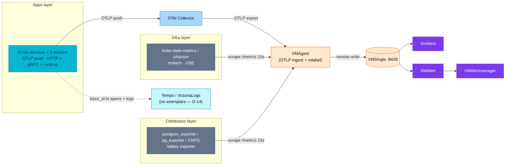

# Metrics

The **metrics pillar** of the platform — what each service and piece of
infrastructure is doing *right now*, stored as time series and queried with
PromQL/MetricsQL. Metrics tell you *that* something is wrong (latency up, errors
up, memory climbing); traces tell you *where*, and profiles tell you *which line
of code* (see [`../README.md`](../README.md)).

| | |
|---|---|
| **Collectors** | OTel Collector — receives **OTLP push** from 10 services + 2 workers; VMAgent — scrapes **infra exporters'** `/metrics` every `15s` |
| **Storage** | VMSingle `:8428` — single-binary TSDB + Prometheus-compatible PromQL/MetricsQL API |
| **CRDs** | `prometheus-operator-crds` (definitions only) → auto-converted to VM CRDs by the VM Operator |
| **Rules / alerts** | VMAlert (recording + alerting) → VMAlertmanager; SLO burn-rate via Sloth |
| **Visualization** | Grafana (VictoriaMetrics datasource) |
| **Correlation** | Shared `trace_id` field pivots metrics↔logs↔traces (VictoriaLogs + Tempo traces↔logs); VictoriaMetrics does **not** support exemplars (RFC-0014 D-14) |

---

## Overview

This platform monitors three layers — **applications**, **cluster
infrastructure**, and **databases** — with one collection pipeline and one query
language. To decide *what* to measure on each layer it applies three
industry-standard methodologies, each answering a different question:

| Method | View | Signals | Best for | Origin |
|--------|------|---------|----------|--------|
| **RED** | External (request) | **R**ate, **E**rrors, **D**uration | APIs, microservices, user-facing endpoints | Tom Wilkie (Weaveworks) |
| **USE** | Internal (resource) | **U**tilization, **S**aturation, **E**rrors | CPU, memory, disk, network, DB, cache | Brendan Gregg |
| **Golden Signals** | Superset | Latency, Traffic, Errors, **Saturation** | Full-stack (RED + saturation) | Google SRE |

**How they combine here:** the 10 Go microservices are request-driven, so they use
**RED** — all three signals come from a single `http_server_request_duration_seconds`
histogram. (The scrape-era `requests_in_flight` saturation gauge has **no OTel
equivalent** — otelgin v0.69 doesn't emit `http.server.active_requests` — so the
4th Golden Signal for apps is now inferred from container working-set and GC
pacing rather than an in-flight counter.) Infrastructure (pods, nodes, databases,
cache) is resource-driven, so it uses **USE**. The Four Golden Signals are the
umbrella that both roll up into.

**SLOs** sit on top of the metrics. Service Level Objectives (e.g. "99% of
requests < 500ms", "99.9% availability") are defined per service and compiled by
the **Sloth** operator into multi-window burn-rate recording + alerting rules
that run in VMAlert — so an alert fires on *error-budget burn*, not on a raw
threshold. See [SLO docs](../slo/README.md).



## Monitoring stack & why

The platform runs **VictoriaMetrics** (VMAgent + VMSingle), **not** a Prometheus
server or `kube-prometheus-stack`. The reasons:

- **Lower footprint** — VMSingle uses far less RAM/disk than Prometheus for the
  same series count, which matters on a Kind homelab and keeps prod cheap.
- **Drop-in compatibility** — VMSingle speaks the Prometheus remote-write and
  PromQL APIs, so Grafana, dashboards, and queries are unchanged; MetricsQL adds
  conveniences on top. (VictoriaMetrics does **not** support exemplars — an
  accepted trade-off of the OTLP cutover, RFC-0014 D-14; correlation is via the
  shared `trace_id` field instead.)
- **One operator, familiar CRDs** — the VM Operator consumes the *same*
  `ServiceMonitor` / `PodMonitor` / `PrometheusRule` CRDs the ecosystem already
  emits (Valkey charts, Sloth, etc.), auto-converting them to native VM scrape
  objects. That is why `prometheus-operator-crds` is installed for the CRD
  definitions even though no Prometheus server runs.

Full architecture, the dual-CRD model, and component deep-dive:
[**VictoriaMetrics Operator Stack**](victoriametrics.md).

## Architecture

Two ingest paths feed one store. The **10 Go services + 2 workers push OTLP**
(SDK → OTel Collector → VMAgent's OTLP ingest → VMSingle) — there is **no
`/metrics` scrape** for them. **Infra exporters** (kube-state-metrics, cAdvisor,
postgres/Valkey exporters) are still **scraped** by VMAgent via
`ServiceMonitor`/`PodMonitor` objects (converted to VM scrape CRDs) every 15s.
App series get their `app`/`namespace` labels from OTLP resource attributes plus
VMAgent relabeling (`service_name→app`, `k8s_namespace_name→namespace`) — not
from scrape target labels, and with **no `job` label** on the push path. Grafana
queries VMSingle; VMAlert evaluates rules and routes firing alerts to
VMAlertmanager.



Two cross-cutting conventions make this scale to any number of services without
manual wiring — detailed in [metrics-apps.md](metrics-apps.md):

- **Resource-attribute labels** — app series carry semconv metric attributes
  (`http_request_method`, `http_route`, `http_response_status_code`); their
  `app`/`namespace` come from OTLP resource attributes via VMAgent relabel
  (`service_name→app`, `k8s_namespace_name→namespace`). The push path has **no
  `job` label**.
- **Zero-wiring onboarding** — a service scales in automatically the moment its
  SDK starts exporting OTLP; there is no per-service ServiceMonitor to add.
  (Infra exporters are still discovered via a `ServiceMonitor`/`PodMonitor`
  scrape selector.)

## Metrics coverage by layer

Each layer has its own reference doc with the full metric catalog, PromQL, and
runbooks:

| Layer | What it covers | Methodology | Reference |
|-------|----------------|-------------|-----------|
| **Applications** | HTTP RED (`http_server_request_duration_seconds`), request/response body size, Go runtime, **gRPC east-west RED**, `trace_id` correlation, instrumentation | RED + Golden | [**metrics-apps.md**](metrics-apps.md) |
| **Catalog (lookup)** | Every emitted series: auto families + all **34 business instruments** per service, with label values + semantics | — | [**metrics-catalog.md**](metrics-catalog.md) |
| **Infrastructure** | `up`, container restarts, pod/node/API-server resources, network | USE + Golden | [**metrics-infra.md**](metrics-infra.md) |
| **Databases** | PostgreSQL (all CloudNativePG), custom queries, PgDog pooler, Valkey | USE | [**postgresql/README.md**](postgresql/README.md) |

### Methodology coverage matrix

Status of each methodology across the platform (✅ implemented, ❌ scoped out):

| Signal | Scope | Status | Implementation |
|--------|-------|:------:|----------------|
| **RED** (Rate/Errors/Duration) | 10 microservices | ✅ | `http_server_request_duration_seconds` → recording rules + 16 alerts + Apdex |
| **Latency** | API server | ✅ | `KubeAPIServerHighLatency` (P99 > 1s) |
| **Traffic** | Microservices | ✅ | RPS recording rule + per-endpoint breakdown |
| **Errors** | Infra / API server / PostgreSQL / Valkey | ✅ | OOMKill, CrashLoop, 5xx rate, ~25 PG alerts, Valkey down/rejected |
| **Saturation** | Microservices / pods / nodes / API server / PG / Valkey | ✅ | CPU throttle, memory pressure, connections, evictions (app-level `requests_in_flight` retired — no OTel equivalent; apps saturate via container working-set + GC pacing) |
| **USE** | Pod CPU/mem, node, PVC, network, PostgreSQL, Valkey, workloads | ✅ | See [metrics-infra.md](metrics-infra.md) + [databases](postgresql/monitoring.md) |
| **SLO** | Microservices | ✅ | 60 Sloth-generated burn-rate rules |
| etcd / kubelet / ingress / node_exporter | Cluster | ❌ | Scoped out for Kind — see [metrics-infra.md](metrics-infra.md#not-covered-scoped-out-for-kind) |

> Every deployed alert and recording rule — exact manifest files, counts, and
> production impact — is catalogued authoritatively in the
> [Alert Catalog](../alerting/alert-catalog.md); each layer doc links its relevant
> domain.

## Documentation map

```
metrics/
├── README.md            # This hub — fundamentals, stack, architecture, coverage
├── metrics-apps.md      # Application + gRPC east-west metrics (RED)
├── metrics-catalog.md   # Lookup catalog — every emitted series incl. all business metrics
├── metrics-infra.md     # Cluster / infrastructure metrics (USE)
├── victoriametrics.md   # The stack: VM Operator, dual CRDs, components, ops
├── promql-guide.md      # PromQL: counters, rate() vs increase(), $rate vs $__range
├── streaming-aggregation.md  # At-scale playbook: in-flight aggregation, 2-tier vmagent (RFC-0013)
└── postgresql/          # Databases layer — hub, custom metrics, workflows, runbook links
    ├── monitoring.md            # Entry point: CNPG cluster inventory + built-in exporter
    ├── custom-metrics.md        # CNPG custom queries
    ├── pg-exporter-dashboards.md   # Retired Pigsty pg_exporter reference
    └── pg-exporter-mapping.md      # Retired Pigsty pg_exporter metric reference
```

## Operations quick-start

```bash
# Query VMSingle directly (VMUI)
kubectl port-forward -n monitoring svc/vmsingle-victoria-metrics 8428:8428
# → http://localhost:8428/vmui

# Inspect what VMAgent is scraping
kubectl port-forward -n monitoring svc/vmagent-victoria-metrics 8429:8429
# → http://localhost:8429/targets

# Force a reconcile after changing monitoring manifests
flux reconcile kustomization monitoring-local --with-source
```

Sample RED queries (microservices):

```promql
# Rate (RPS) — OTLP push path has no job label; select on app
sum(rate(http_server_request_duration_seconds_count{app!=""}[5m]))
# Error ratio
sum(rate(http_server_request_duration_seconds_count{app!="", http_response_status_code=~"5.."}[5m]))
  / sum(rate(http_server_request_duration_seconds_count{app!=""}[5m]))
# Duration (P95)
histogram_quantile(0.95, sum by (le) (rate(http_server_request_duration_seconds_bucket{app!=""}[5m])))
```

## References

- [VictoriaMetrics Operator Stack](victoriametrics.md) — architecture, dual CRDs, components
- [Application metrics (RED)](metrics-apps.md) · [Infrastructure metrics (USE)](metrics-infra.md) · [Database metrics hub](postgresql/README.md)
- [PromQL Guide](promql-guide.md) — counters, `rate()`/`increase()`, `$rate` vs `$__range`
- [Streaming Aggregation](streaming-aggregation.md) — cardinality math + at-scale playbook (RFC-0013)
- [SLO Documentation](../slo/README.md) — SLI mappings, Sloth integration
- [Grafana Dashboard Guide](../grafana/dashboard-reference.md) · [Datasource Strategy](../grafana/datasources.md)
- [VictoriaMetrics docs](https://docs.victoriametrics.com/) · [prometheus-operator CRDs](https://prometheus-operator.dev/)

---

_Last updated: 2026-07-14 — databases layer is now all-CloudNativePG (Zalando→CNPG migration); PgDog pooler; pg_exporter docs retained as retired reference._
