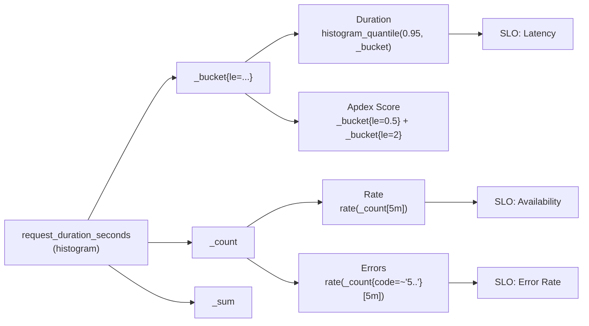
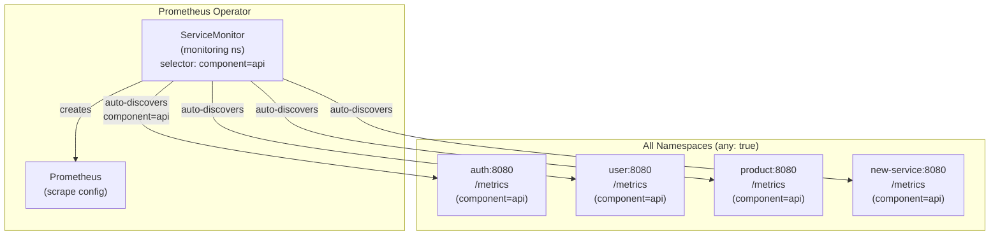

# Metrics

## Quick Summary

**Objectives:**
- Understand the RED method and how it maps to our Prometheus metrics
- Understand label injection (application emits 3 labels, Prometheus adds 4 at scrape time)
- Understand ServiceMonitor auto-discovery, path normalization, and exemplars
- Configure and query metrics in Grafana dashboards

**Keywords:**
Prometheus, RED Method, Golden Signals, Histogram, Counter, Gauge, PromQL, Percentiles, Apdex, SLO, Exemplars, ServiceMonitor, Label Injection, Path Normalization, Cardinality

**Technologies:**
- Prometheus (metrics collection) + Prometheus Operator (v0.5.0+)
- Prometheus Go Client Library + OpenTelemetry (tracing)
- ServiceMonitor CRD
- Grafana (visualization) + Tempo (traces)
- PromQL (query language)

---

## 1. RED Method and Golden Signals

### What is RED?

RED is a monitoring methodology for **request-driven microservices**, created by Tom Wilkie (Weaveworks/Grafana Labs, 2015). It defines three signals that cover the most important aspects of a service's health:

| Signal | Definition | Question It Answers |
|--------|-----------|---------------------|
| **R**ate | Requests per second | How much traffic is the service handling? |
| **E**rrors | Failed requests per second | How many requests are failing? |
| **D**uration | Latency distribution (percentiles) | How long do requests take? |

### RED vs Golden Signals vs USE

| Method | Scope | Signals | Best For |
|--------|-------|---------|----------|
| **RED** | External (request view) | Rate, Errors, Duration | APIs, microservices, user-facing endpoints |
| **USE** | Internal (resource view) | Utilization, Saturation, Errors | Infrastructure: CPU, memory, disk, network |
| **Golden Signals** (Google SRE) | Superset | Latency, Traffic, Errors, Saturation | Full-stack monitoring (RED + saturation) |

**Our approach**: RED for API metrics (this document) + `requests_in_flight` for saturation = all 4 Golden Signals.

### How We Implement RED with ONE Histogram

`request_duration_seconds` is the **single source of truth** for all three RED signals. Prometheus histograms automatically generate `_bucket`, `_count`, and `_sum` sub-metrics, so one metric definition covers everything:



| RED Signal | PromQL | Source Sub-metric |
|-----------|--------|-------------------|
| **Rate** (traffic) | `rate(request_duration_seconds_count{job="microservices"}[5m])` | `_count` |
| **Errors** | `rate(request_duration_seconds_count{job="microservices", code=~"5.."}[5m])` | `_count` + code filter |
| **Duration** (P95) | `histogram_quantile(0.95, rate(request_duration_seconds_bucket{job="microservices"}[5m]))` | `_bucket` |
| Error Rate % | `(errors / rate) * 100` | `_count` ratio |
| Apdex | `(satisfied + 0.5 * tolerating) / total` | `_bucket{le="0.5"}` and `_bucket{le="2"}` |

**Why this matters**: No redundant counter metrics needed. A single histogram produces Rate, Errors, Duration, SLO compliance, and Apdex -- all from one `.Observe()` call per request.

### Why This Matters at Scale

| Company | Scale | Key Practice |
|---------|-------|-------------|
| **Uber** (M3 platform) | 6B time series | Single histogram per service, cardinality limits enforced at platform level, path normalization at SDK level |
| **Grab / Shopee** | 1000+ microservices | Standardized SDK (shared Go module), bounded labels only (no raw IDs), OpenTelemetry migration |
| **Google SRE** | Reference model | One metric per signal, histogram for 3 of 4 Golden Signals, exemplars for trace correlation |

Common principles across all large-scale platforms:
1. **One histogram = 3 signals** (never create separate counters for what histogram already provides)
2. **Bounded labels only** (route patterns, not raw URLs; status code classes, not user IDs)
3. **Path normalization at source** (application-level, not aggregation-tier)
4. **Exemplars** for metrics-to-traces correlation

---

## 2. Architecture

### Label Injection Strategy

Applications **only emit** 3 labels. Prometheus **automatically adds** 4 more labels during scrape via ServiceMonitor relabel_configs.

**Application Level (Go Middleware):**

```go
// middleware/prometheus.go (in each service repository)
var (
    requestDuration = promauto.NewHistogramVec(
        prometheus.HistogramOpts{
            Name: "request_duration_seconds",
            Help: "Duration of HTTP requests in seconds",
        },
        []string{"method", "path", "code"}, // Only 3 labels
    )
)
```

**Prometheus Level (Scrape Time):**

- `app` - From pod's `metadata.labels.app`
- `namespace` - From pod's `metadata.namespace`
- `job` - From ServiceMonitor's job name (`microservices`)
- `instance` - Pod IP:port (e.g., `10.244.1.5:8080`)

**Final Metric Labels (7 total):**

```promql
request_duration_seconds_bucket{
  app="auth",                    # Added by Prometheus
  namespace="auth",              # Added by Prometheus
  job="microservices",           # Added by Prometheus
  instance="10.244.1.5:8080",   # Added by Prometheus
  method="GET",                  # From application
  path="/api/v1/login",         # From application
  code="200",                   # From application
  le="0.1"
} 150
```

| Label | Source | Example | Added By |
|-------|--------|---------|----------|
| `method` | HTTP request | `GET`, `POST` | Application |
| `path` | Route pattern | `/api/v1/users/:id` | Application |
| `code` | Status code | `200`, `404`, `500` | Application |
| `app` | Pod label | `auth`, `user` | **Prometheus** |
| `namespace` | Pod namespace | `auth`, `user` | **Prometheus** |
| `job` | ServiceMonitor | `microservices` | **Prometheus** |
| `instance` | Pod IP:port | `10.244.1.5:8080` | **Prometheus** |

**Benefits:**
1. **Eliminates Label Duplication** - Application doesn't need to know its own name or namespace
2. **Simplifies Application Code** - No env var injection, no helper functions
3. **Follows Best Practices** - Prometheus Community best practice: let Prometheus add target labels
4. **Scales to 1000+ Pods** - Single ServiceMonitor discovers all microservices automatically

**Consistent approach across the stack:**
- **Metrics (Prometheus)**: Labels auto-injected by Prometheus during scrape
- **Tracing (OpenTelemetry)**: Service name auto-detected from Kubernetes environment
- **Profiling (Pyroscope)**: Service name auto-detected from Kubernetes environment

---

### ServiceMonitor Auto-Discovery

**Single ServiceMonitor** for all microservices using `namespaceSelector.any: true` with label matching:

```yaml
# kubernetes/infra/configs/monitoring/servicemonitors/microservices.yaml
apiVersion: monitoring.coreos.com/v1
kind: ServiceMonitor
metadata:
  name: microservices-api
  namespace: monitoring
spec:
  namespaceSelector:
    any: true
  selector:
    matchLabels:
      component: api
  endpoints:
  - port: http
    path: /metrics
    interval: 15s
    scrapeTimeout: 10s
    relabelings:
    - replacement: microservices
      targetLabel: job
    - sourceLabels: [__meta_kubernetes_service_name]
      targetLabel: service
    - sourceLabels: [__meta_kubernetes_namespace]
      targetLabel: namespace
    - sourceLabels: [__meta_kubernetes_service_label_app]
      targetLabel: app
```

**How It Works:**

1. **Label Matching**: ServiceMonitor finds all Services with `component: api` label in ANY namespace
2. **Pod Discovery**: Prometheus resolves Service endpoints to pods
3. **Label Injection**: Prometheus adds `app`, `namespace`, `job`, `service` labels from pod/service metadata
4. **Scraping**: Prometheus scrapes `/metrics` endpoint every 15s



**Auto-discovery**: New services deployed with the `mop` Helm chart (which sets `component: api` on the Service) are automatically scraped. No manual namespace registration needed.

**Deployment:**
- **Location**: [`kubernetes/infra/configs/monitoring/servicemonitors/microservices.yaml`](../../../kubernetes/infra/configs/monitoring/servicemonitors/microservices.yaml)
- **Deployed via**: Flux Operator
- **Reconciliation**: `flux reconcile kustomization configs-local --with-source`

---

### Job Label Strategy

**Current Approach: Unified `job="microservices"` Label**

ServiceMonitor relabeling sets `job="microservices"` for all microservice targets:

```
job="microservices"          # Same for all services
app="auth"                   # Service identifier
service="auth"               # Original service name
namespace="auth"             # Kubernetes namespace
instance="10.244.1.6:8080"   # Pod IP:port
```

**Why this approach:**
- Backward compatible with existing dashboard queries
- Clear separation: microservices vs system metrics vs monitoring stack
- Scalable: new services auto-discovered, queries work immediately
- Single filter to identify all microservices: `job="microservices"`

---

### Path Normalization

Path labels use **registered route patterns** instead of raw URLs to prevent cardinality explosion:

```go
// c.FullPath() returns the Gin route pattern, not the raw URL
path := c.FullPath()  // "/api/v1/products/:id" (bounded set)
if path == "" {
    path = "unknown"   // 404 or unmatched routes
}
```

| Approach | Example | Cardinality |
|----------|---------|-------------|
| Raw URL (`c.Request.URL.Path`) | `/api/v1/products/123`, `/api/v1/products/456`, ... | **Unbounded** (N unique IDs) |
| Route pattern (`c.FullPath()`) | `/api/v1/products/:id` | **Bounded** (~20 routes) |

With 8 services, ~20 routes each, 3 methods, 5 status codes: `8 * 20 * 3 * 5 = 2,400` series -- bounded and predictable.

---

### Infrastructure Endpoint Filtering

**Filtered paths**: `/health`, `/ready`, `/metrics`, `/readiness`, `/liveness`

**Benefits:**
- Metrics reflect actual user traffic (not polluted by health checks)
- Lower cardinality (fewer unique path combinations)
- Storage efficiency (~75% reduction in datapoints)
- Accurate response time percentiles

**Implementation**: Early return in Prometheus middleware before metric collection. Infrastructure endpoints still functional, just not metrified.

---

## 3. Metrics Reference

All metrics used in the system, organized by category. The `app`, `namespace`, `job`, `instance` labels are automatically injected by Prometheus during scrape (see Architecture above) and are omitted from individual metric label lists below to avoid repetition.

### Summary Table

| Metric | Category | Type | App Labels | Purpose |
|--------|----------|------|------------|---------|
| `request_duration_seconds` | Custom | Histogram | method, path, code | RED: Rate (_count), Errors (_count+code), Duration (_bucket) |
| `request_duration_seconds_bucket` | Custom | Histogram Bucket | method, path, code, le | Percentile calculation (histogram_quantile), Apdex |
| `request_duration_seconds_count` | Custom | Counter | method, path, code | RPS, total requests, error rate, SLO availability |
| `requests_in_flight` | Custom | Gauge | method, path | Concurrent requests, saturation (4th Golden Signal) |
| `request_size_bytes` | Custom | Histogram | method, path, code | Request body size, RX bytes/sec (via _sum) |
| `response_size_bytes` | Custom | Histogram | method, path, code | Response body size, TX bytes/sec (via _sum) |
| `go_memstats_alloc_bytes` | Go Runtime | Gauge | -- | Heap allocated memory, memory leak detection |
| `go_memstats_heap_inuse_bytes` | Go Runtime | Gauge | -- | Heap in-use memory, memory leak detection |
| `process_resident_memory_bytes` | Go Runtime | Gauge | -- | Process RSS, OS-level memory monitoring |
| `go_goroutines` | Go Runtime | Gauge | -- | Active goroutines, goroutine leak detection |
| `go_threads` | Go Runtime | Gauge | -- | OS threads, concurrency monitoring |
| `go_gc_duration_seconds_sum` | Go Runtime | Counter | -- | GC duration, memory pressure detection |
| `go_gc_duration_seconds_count` | Go Runtime | Counter | -- | GC frequency, memory pressure detection |
| `go_memstats_frees_total` | Go Runtime | Counter | -- | Memory frees, GC activity monitoring |
| `process_cpu_seconds_total` | Go Runtime | Counter | -- | CPU usage, service-level resource monitoring |
| `up` | Kubernetes | Gauge | -- | Service availability, instance health monitoring |
| `kube_pod_container_status_restarts_total` | Kubernetes | Counter | namespace, pod, container | Container restarts, OOM/crash detection |

### Custom Application Metrics (4 metrics)

Emitted by application code via Prometheus middleware. All metrics also carry the 4 Prometheus-injected labels (`app`, `namespace`, `job`, `instance`).

#### 1. `request_duration_seconds` (Histogram) -- Core RED Metric

HTTP request latency in seconds. Automatically generates `_bucket`, `_count`, and `_sum` sub-metrics.

- **Labels:** `method`, `path`, `code`
- **Buckets:** `0.005, 0.01, 0.025, 0.05, 0.1, 0.2, 0.3, 0.5, 0.75, 1, 2, 5, 10`
- **Sub-metrics:**
  - `_bucket{le="..."}` - Percentiles (P50, P95, P99) and Apdex score
  - `_count` - RPS, total requests, error rates, SLO availability and error-rate objectives
  - `_sum` - Total duration sum
- **Exemplars:** Attached with `traceID` label for metrics-to-traces correlation in Grafana

**Why these buckets:** SLO-tuned with extra precision around the 500ms latency threshold. Buckets at 200ms, 300ms, 500ms, 750ms give accurate P95 interpolation in the SLO boundary zone. Apdex uses `le="0.5"` (satisfying) and `le="2"` (tolerating), both present.

| Bucket (seconds) | Purpose |
|-------------------|---------|
| 0.005, 0.01, 0.025 | Fast responses (cache hits, health checks) |
| 0.05, 0.1 | Typical DB queries |
| **0.2, 0.3** | Precision zone before SLO threshold |
| **0.5** | SLO latency threshold, Apdex satisfying boundary |
| **0.75** | Precision zone after SLO threshold |
| 1 | Slow responses |
| **2** | Apdex tolerating boundary |
| 5, 10 | Timeouts, degraded responses |

#### 2. `requests_in_flight` (Gauge)

Concurrent requests being processed at scrape time.

- **Labels:** `method`, `path` (no `code` -- measured during processing)
- **Usage:** Saturation monitoring (4th Golden Signal), bottleneck detection, capacity validation
- **Why:** High values indicate service overload; critical for capacity planning

#### 3. `request_size_bytes` (Histogram)

HTTP request body size in bytes.

- **Labels:** `method`, `path`, `code`
- **Buckets:** `100, 1000, 10000, 100000, 1000000`
- **Sub-metric `_sum`:** Used with `rate()` for RX bytes/sec; aggregated by `sum() by (app)` for service-level view
- **Note:** Measures HTTP body only, not TCP/IP overhead, HTTP headers, or TLS overhead

#### 4. `response_size_bytes` (Histogram)

HTTP response body size in bytes.

- **Labels:** `method`, `path`, `code`
- **Buckets:** `100, 1000, 10000, 100000, 1000000`
- **Sub-metric `_sum`:** Used with `rate()` for TX bytes/sec; aggregated by `sum() by (app)` for service-level view
- **Note:** Measures HTTP body only, not TCP/IP overhead, HTTP headers, or TLS overhead

---

### Go Runtime Metrics

Automatically exposed by Prometheus Go client library. No application code needed. All carry the 4 Prometheus-injected labels only.

| Metric | Type | Purpose |
|--------|------|---------|
| `go_memstats_alloc_bytes` | Gauge | Heap allocated memory. Only increases; detect leaks when it grows without GC recovery. |
| `go_memstats_heap_inuse_bytes` | Gauge | Heap in-use memory. Can decrease after GC; steady growth post-GC = memory leak. |
| `process_resident_memory_bytes` | Gauge | Process RSS (heap + stack + OS overhead). Detects OS-level leaks beyond Go heap. |
| `go_goroutines` | Gauge | Active goroutines. Steady increase = goroutine leak (forgotten `defer cancel()`, unclosed channels). |
| `go_threads` | Gauge | OS threads used by Go runtime. Sudden spike may indicate blocking operations. |
| `go_gc_duration_seconds_sum` | Counter | Total GC time. Use `increase() / time_window` for average GC duration. High = memory pressure. |
| `go_gc_duration_seconds_count` | Counter | Total GC cycles. Use `rate()` for GC frequency. High = memory pressure or insufficient heap. |
| `go_memstats_frees_total` | Counter | Memory free count. High values indicate frequent GC activity. |
| `process_cpu_seconds_total` | Counter | Process CPU time. Use `rate() * 100` for CPU %. Aggregated by `sum() by (app)` for service-level view. |

---

### Kubernetes Metrics

From Kubernetes infrastructure, scraped from kube-state-metrics or Prometheus.

| Metric | Type | Labels | Purpose |
|--------|------|--------|---------|
| `up` | Gauge | job, app, namespace, instance | Service availability. 1 = up, 0 = down. Use `count()` for healthy instance count. |
| `kube_pod_container_status_restarts_total` | Counter | namespace, pod, container | Container restarts. Frequent restarts indicate OOM or crashes. Panel uses regex `^$app-[a-z0-9]+-[a-z0-9]+$` to filter. |

---

## 4. Exemplars: Metrics-to-Traces Correlation

Exemplars attach trace context to individual histogram observations, allowing Grafana to link directly from a latency spike to the exact distributed trace in Tempo.

### How It Works

When recording a histogram observation, the middleware also attaches the OpenTelemetry `traceID` as an exemplar label:

```go
span := trace.SpanFromContext(c.Request.Context())
if span.SpanContext().HasTraceID() {
    requestDuration.WithLabelValues(method, path, statusCode).(prometheus.ExemplarObserver).ObserveWithExemplar(
        duration, prometheus.Labels{"traceID": span.SpanContext().TraceID().String()},
    )
} else {
    requestDuration.WithLabelValues(method, path, statusCode).Observe(duration)
}
```

### Grafana Usage

1. Open any histogram-based panel (P95, P99 response time)
2. Enable "Exemplars" toggle in the panel query options
3. Exemplar dots appear on the time series graph
4. Click a dot to see the `traceID`, then click through to Tempo

This eliminates manual trace hunting during incidents -- click on the P99 spike, jump directly to the offending trace.

### Prerequisites

- Prometheus: `--enable-feature=exemplar-storage`
- OpenTelemetry tracing middleware must run **before** Prometheus middleware (already configured: `TracingMiddleware()` -> `LoggingMiddleware()` -> `PrometheusMiddleware()`)
- Grafana: Tempo datasource configured (already done)

---

## 5. Dashboard

### Overview

The Grafana dashboard contains **34 data panels** organized in **5 row groups**:

1. **Row 1: Overview & Key Metrics** (12 panels) - Response time percentiles (P50, P95, P99), RPS, Success/Error rates, Apdex, Up instances, Restarts
2. **Row 2: Traffic & Requests** (4 panels) - Status code distribution, request rate by endpoint
3. **Row 3: Errors & Performance** (8 panels) - Client errors (4xx), Server errors (5xx), error rate by method/endpoint, response time by endpoint
4. **Row 4: Go Runtime & Memory** (6 panels) - Heap memory, RSS, goroutines/threads, GC duration/frequency
5. **Row 5: Resources & Infrastructure** (5 panels) - Total memory/CPU/network per service, requests in flight, memory allocations

> See [Grafana Dashboard Guide](./grafana-dashboard.md) for detailed query analysis, troubleshooting scenarios, and SRE best practices for all panels.

### Variables

The dashboard uses **4 variables** for filtering:

1. **`$DS_PROMETHEUS`** - Datasource selector
2. **`$namespace`** - Kubernetes namespace filter (multi-select)
3. **`$app`** - Application/service filter (multi-select, cascades from namespace)
4. **`$rate`** - Rate interval for calculations (default: 5m)

**Variable Cascading:** `$namespace` filters `$app` options dynamically. All panel queries include both `namespace=~"$namespace"` and `app=~"$app"` filters.

> See [Variables & Regex Guide](./grafana-variables.md) for detailed variable configuration, regex patterns, and cascading best practices.

---

### Dashboard Metrics Audit

Complete mapping of which metrics power which panels:

| Metric | Panels Using It | Count |
|--------|----------------|-------|
| `request_duration_seconds_count` | Total RPS, Success RPS, Error RPS, Success Rate %, Error Rate %, Total Request, Status Code Distribution, Total Requests by Endpoint, Request Rate by Endpoint, RPS by Endpoint, Request Rate by Method/Endpoint, Error Rate by Method/Endpoint, Client Errors 4xx, Server Errors 5xx | 14 |
| `request_duration_seconds_bucket` | P99/P95/P50 Response Success, Apdex Score, Response time P95/P50/P99 | 7 |
| `requests_in_flight` | Total Requests In Flight per Service | 1 |
| `request_size_bytes_sum` | Total Network Traffic (RX) | 1 |
| `response_size_bytes_sum` | Total Network Traffic (TX) | 1 |
| Go runtime metrics | Heap, RSS, Goroutines, GC, CPU, Memory Allocations | 8 |
| `up` | Up Instances | 1 |
| `kube_pod_container_status_restarts_total` | Restarts | 1 |

---

## 6. Metrics Collection Implementation

### Prometheus Middleware

**Location:** `middleware/prometheus.go` in each service repository (polyrepo)

```go
func PrometheusMiddleware() gin.HandlerFunc {
    return func(c *gin.Context) {
        start := time.Now()
        method := c.Request.Method

        if !shouldCollectMetrics(c.Request.URL.Path) {
            c.Next()
            return
        }

        // Route pattern for bounded cardinality (e.g. "/api/v1/products/:id")
        path := c.FullPath()
        if path == "" {
            path = "unknown"
        }

        requestsInFlight.WithLabelValues(method, path).Inc()

        c.Next()

        duration := time.Since(start).Seconds()
        statusCode := strconv.Itoa(c.Writer.Status())

        // Exemplar: attach traceID for metrics-to-traces correlation
        span := trace.SpanFromContext(c.Request.Context())
        if span.SpanContext().HasTraceID() {
            requestDuration.WithLabelValues(method, path, statusCode).(prometheus.ExemplarObserver).ObserveWithExemplar(
                duration, prometheus.Labels{"traceID": span.SpanContext().TraceID().String()},
            )
        } else {
            requestDuration.WithLabelValues(method, path, statusCode).Observe(duration)
        }

        requestSize.WithLabelValues(method, path, statusCode).Observe(float64(c.Request.ContentLength))
        responseSize.WithLabelValues(method, path, statusCode).Observe(float64(c.Writer.Size()))

        requestsInFlight.WithLabelValues(method, path).Dec()
    }
}
```

**Middleware order** (configured in `cmd/main.go`):
1. `TracingMiddleware()` -- creates OpenTelemetry span (must be first for exemplars)
2. `LoggingMiddleware()` -- structured logging with trace context
3. `PrometheusMiddleware()` -- records metrics with traceID exemplar

---

## 7. Memory Leak Detection

Row 4 (Go Runtime & Memory) provides 6 panels for systematic leak detection.

### Workflow

**Step 1: Check Memory Heap Panels (3 panels)**

- **Heap Allocated** (`go_memstats_alloc_bytes`) - Increasing continuously?
- **Heap In-Use** (`go_memstats_heap_inuse_bytes`) - Not returning to baseline after GC?
- **Process RSS** (`process_resident_memory_bytes`) - Increasing continuously?

If all 3 trend upward = **HEAP MEMORY LEAK**

**Step 2: Check Goroutines Panel**

- **Goroutines** (`go_goroutines`) - Increasing continuously without decrease?

If goroutines trend upward = **GOROUTINE LEAK** (forgotten `defer cancel()`, unclosed channels)

**Step 3: Check GC Panels (2 panels)**

- **GC Duration** (`go_gc_duration_seconds_sum`) + **GC Frequency** (`go_gc_duration_seconds_count`)

If both increase + Heap increasing = Heap leak confirmed.
If both increase + Heap stable = High load (not a leak).

### Decision Matrix

| Heap | Goroutines | GC | Diagnosis | Action |
|------|------------|-----|-----------|--------|
| ↑↑↑ | → | ↑↑ | **Heap Memory Leak** | Check: data structures holding references, global caches, unclosed resources |
| →/↑ | ↑↑↑ | → | **Goroutine Leak** | Check: forgotten `defer cancel()`, unclosed channels, blocking operations |
| ↑↓ | ↑↓ | ↑↑ | **High Load** (OK) | Normal - traffic increased, app handling load |
| → | → | → | **Healthy** | No action needed |

### Common Leak Causes

**Heap Memory Leak:** Global maps/slices growing indefinitely, cache without eviction, HTTP client not reusing connections, unclosed file descriptors.

**Goroutine Leak:** Context not cancelled, channel not closed, HTTP request without timeout, goroutine waiting indefinitely.

---

## 8. Troubleshooting

### Cardinality Monitoring

**Symptoms:** Prometheus slow queries, "high cardinality metrics" warnings, OOM on Prometheus pods.

**Check current cardinality:**

```promql
# Total unique series per metric (should be < 5000 for custom metrics)
count by (__name__) ({job="microservices"})

# Unique path values (should be < 30 per service with c.FullPath())
count(count by (path) ({job="microservices"}))

# Top 10 highest-cardinality metrics
topk(10, count by (__name__) ({job="microservices"}))
```

**Prevention:** Path normalization (`c.FullPath()`) keeps path cardinality bounded. Never use raw IDs, emails, or IPs in labels.

### Go Process Metrics vs Kubernetes Container Metrics (cAdvisor)

Memory & CPU panels show Go process metrics, **not** Kubernetes container metrics. For container-level metrics, cAdvisor (built into kubelet) is needed.

| Aspect | Go Process Metrics | K8s Container Metrics (cAdvisor) |
|--------|-------------------|----------------------------------|
| **Source** | Go runtime (`runtime.Memstats`) | cAdvisor in kubelet |
| **Scope** | Go process only | Full container (app + OS) |
| **Memory** | Heap allocated | Container RSS, cache, buffers |
| **CPU** | Go process CPU time | Container CPU usage vs limits |
| **Network** | Not available | TX/RX bytes/sec |
| **Disk I/O** | Not available | Read/write bytes |

### Counter Reset Handling

Counter panels ("Total Request", "Total Requests by Endpoint") use `increase([$__range])` instead of raw counter values. Prometheus handles counter resets automatically when pods restart.

See [PromQL Guide](./promql-guide.md) for details on `increase()` and `rate()` counter reset handling.

### Network Traffic Panel

The "Total Network Traffic per Service" panel measures HTTP body size only, not total pod network. Missing: TCP headers, HTTP headers, TLS overhead, health checks. For full network metrics, cAdvisor is needed.

---

## 9. Best Practices

1. **RED Method**: Use `request_duration_seconds` as single source of truth for Rate, Errors, Duration
2. **Bounded Labels**: Always use route patterns (`c.FullPath()`) for path labels, never raw URLs
3. **SLO-Tuned Buckets**: More buckets around SLO threshold (500ms) for precise percentile calculation
4. **Exemplars**: Attach traceID to histograms for click-through from Grafana to Tempo
5. **4 Golden Signals**: RED + `requests_in_flight` (saturation) covers all 4 signals
6. **Apdex Score**: Use for overall health assessment (satisfying < 0.5s, tolerating < 2s)
7. **Filter infrastructure**: Exclude `/health`, `/metrics` from business traffic metrics
8. **Adjust `$rate` variable**: High traffic: 1m-5m (responsive), Low traffic: 30m-1h (smoother)

---

## Related Documentation

- **[Grafana Dashboard Guide](./grafana-dashboard.md)** - Complete panel reference, query analysis, troubleshooting, SRE best practices
- **[Variables & Regex Guide](./grafana-variables.md)** - Dashboard variables, regex patterns, cascading configuration
- **[PromQL Guide](./promql-guide.md)** - PromQL functions, time range vs rate interval, counter handling
- **[Metrics Audit Runbook](../../../docs/runbooks/metrics-audit-fixes.md)** - Before/after analysis for each metrics issue fixed, with PromQL verification queries
- **[SLO Documentation](../slo/README.md)** - SLO definitions, SLI mappings, Sloth integration
- **[Prometheus Operator](https://prometheus-operator.dev/)** - Official documentation
- **[ServiceMonitor API](https://prometheus-operator.dev/docs/operator/api/#monitoring.coreos.com/v1.ServiceMonitor)** - CRD reference

---

**Last Updated**: 2026-02-20
**Version**: 4.0
**Maintainer**: SRE Team
